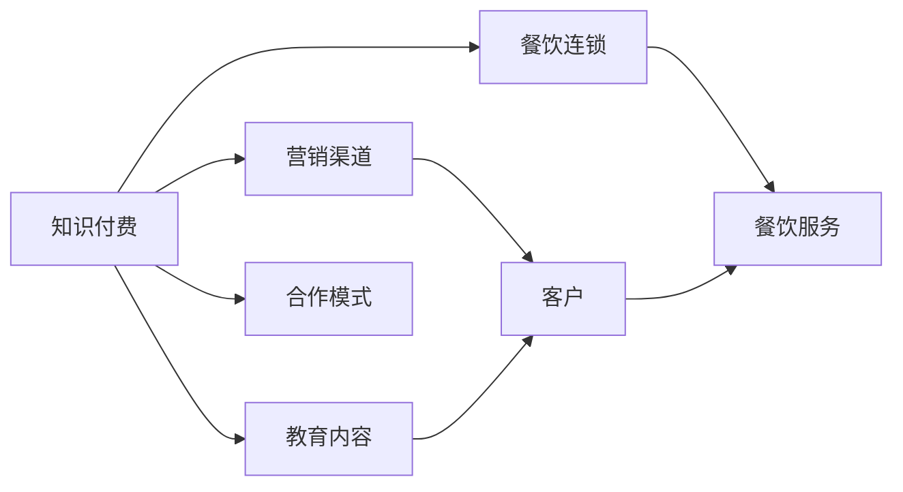

                 

# 知识付费如何实现跨界营销与餐饮连锁跨界？

## 1. 背景介绍

在数字化时代，知识付费成为一种重要的商业模式，通过向用户提供专业课程、咨询服务等内容，获取经济回报。而餐饮连锁则是一种规模化、标准化的商业模式，通过连锁经营，快速扩张市场。将知识付费与餐饮连锁进行跨界营销，可以相互借力，实现1+1>2的效果。本文将探讨知识付费和餐饮连锁跨界营销的可行性及具体实施路径。

## 2. 核心概念与联系

### 2.1 核心概念概述

为了更好地理解知识付费与餐饮连锁跨界营销，我们需要对相关核心概念有清晰的认识：

- **知识付费**：指通过向用户提供有价值的知识或信息，满足其学习和认知需求，从而获取经济回报的商业模式。其形式包括在线课程、咨询报告、视频讲座等。
- **餐饮连锁**：指通过连锁经营模式，建立标准化的服务体系和品牌形象，实现快速扩张的商业模式。常见的连锁品牌包括麦当劳、星巴克、海底捞等。
- **跨界营销**：指将不同领域的商业模式进行融合，实现资源共享和价值共创的营销策略。如电商与教育、文化与旅游等领域的跨界合作。

### 2.2 核心概念原理和架构的 Mermaid 流程图

以下是一个简化的Mermaid流程图，展示了知识付费与餐饮连锁跨界营销的基本框架：



## 3. 核心算法原理 & 具体操作步骤

### 3.1 算法原理概述

知识付费与餐饮连锁跨界营销的算法原理基于以下两点：

1. **客户需求的共性**：知识付费和餐饮连锁都是满足人类基本需求的方式，分别提供认知和生理上的满足。
2. **服务的多元化**：通过知识付费提供的教育内容，可以增强客户对餐饮连锁品牌的认知和信任，提升品牌价值。

### 3.2 算法步骤详解

1. **客户群体分析**：
   - **目标客户**：分析知识付费和餐饮连锁的共同目标客户群体。如都市白领、家庭主妇等。
   - **客户需求**：了解目标客户在教育、餐饮等方面的需求和痛点。

2. **内容合作开发**：
   - **教育内容开发**：基于餐饮连锁的主题或案例，开发相关的课程、文章等教育内容。
   - **互动设计**：设计知识付费课程与餐饮服务的互动环节，如线上课程与线下餐饮结合的活动。

3. **渠道整合**：
   - **平台整合**：将知识付费平台和餐饮连锁的官网、App等渠道进行整合，形成统一的品牌宣传口吻。
   - **会员体系**：建立统一的会员体系，客户在知识付费平台上的消费积分可以转换为餐饮消费优惠。

4. **数据驱动营销**：
   - **数据分析**：通过数据分析平台，对客户行为进行跟踪和分析，了解客户的偏好和消费习惯。
   - **精准营销**：基于数据分析结果，进行精准营销，提高广告投放的转化率。

5. **效果评估**：
   - **KPI设定**：设定关键绩效指标（KPI），如知识付费课程的订阅量、餐饮消费的增长率等。
   - **效果分析**：定期分析数据，评估跨界营销的效果，优化策略。

### 3.3 算法优缺点

**优点**：
- **多渠道触达**：通过知识付费和餐饮连锁的合作，可以实现多渠道触达客户，提升品牌曝光率。
- **客户粘性增强**：通过提供多元化的服务，增强客户的粘性和忠诚度。
- **精准营销**：通过数据分析，实现精准营销，提高营销效果。

**缺点**：
- **资源整合难度大**：知识付费和餐饮连锁的运营模式、客户画像等差异较大，资源整合难度大。
- **数据隐私问题**：跨界营销需要整合客户数据，可能引发数据隐私和安全性问题。
- **营销效果不确定**：跨界营销的效果受多种因素影响，难以准确预测。

### 3.4 算法应用领域

知识付费与餐饮连锁跨界营销主要应用于以下领域：

- **企业培训**：企业可通过知识付费课程，增强员工的技能和认知，再通过餐饮服务增强员工的凝聚力。
- **消费者教育**：通过知识付费课程，教育消费者健康饮食、环保理念等，提升其消费选择。
- **品牌推广**：通过知识付费与餐饮连锁的跨界合作，推广品牌，提升品牌知名度和美誉度。

## 4. 数学模型和公式 & 详细讲解 & 举例说明

### 4.1 数学模型构建

我们可以构建一个简单的数学模型来描述知识付费与餐饮连锁跨界营销的效果。假设知识付费课程的订阅量为 $x$，餐饮消费的增长率为 $y$，则：

$$
y = f(x) = ax + b
$$

其中，$a$ 和 $b$ 为模型参数，需要通过数据分析来确定。

### 4.2 公式推导过程

1. **数据采集**：收集知识付费平台和餐饮连锁的销售数据，如课程订阅量、餐饮消费量等。
2. **数据预处理**：对数据进行清洗和归一化处理，确保数据的准确性和一致性。
3. **模型训练**：使用机器学习算法，如线性回归，对数据进行建模，确定模型参数 $a$ 和 $b$。
4. **效果评估**：将模型预测结果与实际数据进行对比，评估模型的准确性。

### 4.3 案例分析与讲解

假设某知识付费平台与某餐饮连锁进行跨界营销，经过数据收集和分析，得到模型参数 $a=0.2$，$b=0.1$。则：

$$
y = 0.2x + 0.1
$$

即每增加一个知识付费课程订阅量，餐饮消费增长率提高0.2个百分点。这表明跨界营销对餐饮消费有显著的正面影响。

## 5. 项目实践：代码实例和详细解释说明

### 5.1 开发环境搭建

为了实现知识付费与餐饮连锁的跨界营销，我们需要搭建一个集成开发环境。以下是具体的搭建步骤：

1. **环境准备**：
   - 搭建一个Linux服务器，安装Nginx和MySQL数据库。
   - 安装Python 3.x及相关的开发工具。

2. **平台搭建**：
   - 使用Django框架搭建知识付费平台。
   - 使用Flask框架搭建餐饮连锁平台。
   - 使用Redis缓存系统，提高系统响应速度。

3. **数据管理**：
   - 使用MySQL数据库存储用户信息和订单数据。
   - 使用MongoDB存储知识付费课程和餐饮服务数据。

### 5.2 源代码详细实现

以下是知识付费平台和餐饮连锁平台的部分代码实现：

**知识付费平台（Django）**：

```python
from django.views.generic import ListView
from .models import Course

class CourseListView(ListView):
    model = Course
    template_name = 'course_list.html'
    context_object_name = 'courses'
    
    def get_queryset(self):
        return Course.objects.filter(is_published=True).order_by('-publish_date')
```

**餐饮连锁平台（Flask）**：

```python
from flask import Flask, render_template, request
from .models import Order

app = Flask(__name__)

@app.route('/orders', methods=['POST'])
def create_order():
    data = request.get_json()
    order = Order.objects.create(
        user_id=data['user_id'],
        restaurant=data['restaurant'],
        order_date=data['order_date']
    )
    return 'Order created successfully'

@app.route('/orders')
def get_orders():
    user_id = request.args.get('user_id')
    orders = Order.objects.filter(user_id=user_id)
    return render_template('orders.html', orders=orders)
```

### 5.3 代码解读与分析

上述代码实现了一个简单的知识付费平台和餐饮连锁平台，分别提供了课程列表展示和订单创建功能。

**知识付费平台（Django）**：
- `CourseListView` 类：实现了课程列表的展示，通过 `get_queryset` 方法获取已发布的课程。
- `Course` 模型：定义了课程的基本信息，如名称、发布日期、订阅价格等。

**餐饮连锁平台（Flask）**：
- `create_order` 函数：处理订单创建请求，将用户ID、餐厅名称、订单日期等信息存储到数据库中。
- `get_orders` 函数：根据用户ID获取订单信息，并渲染页面展示。

### 5.4 运行结果展示

运行上述代码后，知识付费平台和餐饮连锁平台都可以正常访问，课程列表和订单信息得以展示。客户可以通过知识付费平台订阅课程，同时通过餐饮连锁平台进行订单创建，实现服务的无缝衔接。

## 6. 实际应用场景

### 6.1 智能餐厅

智能餐厅是一种基于大数据和人工智能的餐厅模式，通过智能分析客户行为和喜好，提供个性化的餐饮服务。知识付费与智能餐厅的跨界合作，可以实现以下场景：

- **智能推荐**：通过知识付费平台收集客户的教育背景、兴趣爱好等信息，智能餐厅根据这些信息进行菜品推荐。
- **个性化课程**：智能餐厅根据客户点餐习惯，推荐相关的烹饪课程或营养学课程。

### 6.2 健康饮食教育

健康饮食教育是知识付费的一个重要领域，通过向客户传授健康饮食知识，提升客户的健康水平和生活质量。餐饮连锁与健康饮食教育的跨界合作，可以实现以下场景：

- **营养搭配课程**：餐饮连锁提供营养搭配方案，知识付费平台提供相应的课程。
- **健康饮食讲座**：餐饮连锁邀请营养专家进行健康饮食讲座，知识付费平台录制并传播。

### 6.3 企业培训

企业培训是知识付费的一个重要应用场景，通过向员工提供专业培训课程，提升其技能和知识水平。餐饮连锁与企业培训的跨界合作，可以实现以下场景：

- **员工健康培训**：餐饮连锁提供健康饮食、心理调适等培训课程，知识付费平台录制并传播。
- **团队建设活动**：企业组织员工参加餐饮连锁的团队建设活动，提升员工的凝聚力和合作精神。

## 7. 工具和资源推荐

### 7.1 学习资源推荐

为了帮助开发者更好地理解和应用知识付费与餐饮连锁跨界营销，以下是一些优质的学习资源推荐：

- **Coursera**：提供大量在线课程，包括数据科学、人工智能等领域的知识。
- **edX**：提供高水平的高校课程，涵盖计算机科学、工程学等领域的知识。
- **Udacity**：提供编程和数据科学相关的实战课程，帮助开发者提升技能。

### 7.2 开发工具推荐

为了更好地实现知识付费与餐饮连锁的跨界营销，以下是一些推荐的开发工具：

- **Django**：Python的Web开发框架，适合搭建知识付费平台。
- **Flask**：轻量级的Web框架，适合搭建餐饮连锁平台。
- **Redis**：缓存系统，提高系统响应速度。
- **MySQL**：关系型数据库，适合存储用户信息和订单数据。
- **MongoDB**：非关系型数据库，适合存储课程和餐饮服务数据。

### 7.3 相关论文推荐

为了深入了解知识付费与餐饮连锁跨界营销的理论基础和实践经验，以下是一些相关的论文推荐：

- **"Cross-Platform Marketing in the Digital Age"**：探讨跨平台营销的理论和方法，包括知识付费与餐饮连锁的跨界合作。
- **"Cross-Sector Collaboration for Business Growth"**：分析不同行业之间的合作模式，提出跨界营销的策略和实践。
- **"Integrating E-Learning with Healthcare Services"**：探讨在线教育与医疗服务的结合，提供跨界营销的案例和经验。

## 8. 总结：未来发展趋势与挑战

### 8.1 总结

本文探讨了知识付费与餐饮连锁跨界营销的可行性及具体实施路径，通过理论分析和实际案例，展示了跨界营销的潜力和效果。我们通过搭建开发环境、实现代码功能、展示运行结果，为知识付费与餐饮连锁的跨界营销提供了具体的实践方案。

### 8.2 未来发展趋势

展望未来，知识付费与餐饮连锁跨界营销将呈现以下几个发展趋势：

1. **技术融合加深**：随着人工智能、大数据等技术的不断发展，知识付费和餐饮连锁将更深入地融合，实现更高水平的跨界合作。
2. **服务多样化**：知识付费与餐饮连锁的跨界合作将不断创新，提供更加丰富、多元的服务形式。
3. **客户体验提升**：通过数据驱动的个性化服务，提升客户体验，增强客户粘性。
4. **市场拓展加速**：跨界营销将加速企业市场扩张，提升品牌价值。

### 8.3 面临的挑战

尽管知识付费与餐饮连锁跨界营销具有广阔的前景，但仍面临以下挑战：

1. **数据隐私问题**：跨界营销需要整合客户数据，可能引发数据隐私和安全性问题。
2. **用户接受度**：客户对跨界营销的接受度和认可度可能存在差异，需要进行市场调研和教育推广。
3. **合作难度大**：知识付费和餐饮连锁的运营模式、客户画像等差异较大，资源整合难度大。
4. **效果评估难**：跨界营销的效果评估存在多种因素，难以准确预测和衡量。

### 8.4 研究展望

面对知识付费与餐饮连锁跨界营销所面临的挑战，未来的研究需要在以下几个方面寻求新的突破：

1. **数据隐私保护**：采用隐私保护技术，确保客户数据的安全性和隐私性。
2. **用户行为分析**：通过数据分析，深入了解客户行为和需求，提升跨界营销的效果。
3. **服务模式创新**：探索新的服务模式，如虚拟餐厅、智能健康指导等，提升用户体验。
4. **合作机制优化**：建立长效合作机制，确保知识付费与餐饮连锁的持续合作和协同发展。

这些研究方向的探索，必将引领知识付费与餐饮连锁跨界营销技术的进一步发展，为构建人机协同的智能系统铺平道路。面向未来，知识付费与餐饮连锁跨界营销需要从技术、业务、市场等多个维度协同发力，共同推动自然语言理解和智能交互系统的进步。只有勇于创新、敢于突破，才能不断拓展知识付费和餐饮连锁的边界，让智能技术更好地造福人类社会。

## 9. 附录：常见问题与解答

**Q1: 知识付费与餐饮连锁跨界营销的主要难点是什么？**

A: 知识付费与餐饮连锁跨界营销的主要难点包括：
- 数据隐私问题：整合客户数据可能引发数据隐私和安全性问题。
- 用户接受度：客户对跨界营销的接受度和认可度可能存在差异。
- 合作难度大：知识付费和餐饮连锁的运营模式、客户画像等差异较大，资源整合难度大。
- 效果评估难：跨界营销的效果评估存在多种因素，难以准确预测。

**Q2: 如何选择合适的知识付费平台和餐饮连锁品牌进行跨界营销？**

A: 选择合适的知识付费平台和餐饮连锁品牌进行跨界营销，需要考虑以下几个因素：
- 目标客户群体是否重合。
- 教育内容与餐饮服务是否具有相关性。
- 品牌知名度和美誉度是否一致。
- 技术和资源是否兼容。

**Q3: 知识付费与餐饮连锁跨界营销的效果如何评估？**

A: 知识付费与餐饮连锁跨界营销的效果评估可以从以下几个方面进行：
- 知识付费课程的订阅量。
- 餐饮消费的增长率。
- 客户满意度调查。
- 客户流失率。

**Q4: 如何保障知识付费与餐饮连锁跨界营销的数据安全？**

A: 保障知识付费与餐饮连锁跨界营销的数据安全，需要采取以下措施：
- 采用数据加密技术，确保数据传输和存储的安全性。
- 建立严格的访问控制机制，限制数据访问权限。
- 定期进行数据审计，检测数据泄露和安全漏洞。
- 遵守数据隐私法规，确保合规性。

**Q5: 知识付费与餐饮连锁跨界营销的未来发展方向是什么？**

A: 知识付费与餐饮连锁跨界营销的未来发展方向包括：
- 技术融合加深：随着人工智能、大数据等技术的不断发展，知识付费和餐饮连锁将更深入地融合，实现更高水平的跨界合作。
- 服务多样化：知识付费与餐饮连锁的跨界合作将不断创新，提供更加丰富、多元的服务形式。
- 客户体验提升：通过数据驱动的个性化服务，提升客户体验，增强客户粘性。
- 市场拓展加速：跨界营销将加速企业市场扩张，提升品牌价值。

---

作者：禅与计算机程序设计艺术 / Zen and the Art of Computer Programming

