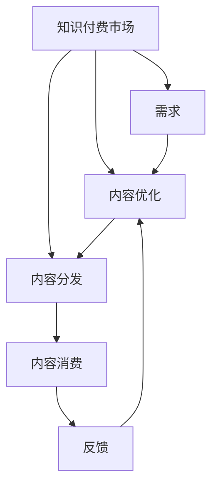

                 

# 知识付费市场分析:程序员的机遇与挑战

> 关键词：知识付费, 程序员, 机遇, 挑战, 教育技术, 人工智能, 知识管理

## 1. 背景介绍

### 1.1 问题由来
随着互联网技术的飞速发展和信息过载现象的日益严重，越来越多的人开始意识到，仅仅依靠自学难以在信息社会中保持竞争力。因此，知识付费市场应运而生，旨在为人们提供高效、系统的学习资源，帮助他们掌握新技能，提高职业素养。特别是在技术领域，程序员作为信息社会的核心力量，对于高质量、高效率的学习需求尤为迫切。

### 1.2 问题核心关键点
知识付费市场的主要核心关键点包括：
- **需求驱动**：技术变革迅速，持续学习成为必要。
- **供给模式**：内容提供商、平台运营商、用户三方互动的模式。
- **内容质量**：高质量内容的稀缺性及其对市场的重要性。
- **用户体验**：便捷、高效的学习体验对用户粘性的影响。
- **商业模式**：订阅、按需购买、知识分成等多元化的盈利模式。

## 2. 核心概念与联系

### 2.1 核心概念概述

- **知识付费**：指用户通过付费获取知识和服务的过程，包括在线课程、书籍、咨询、工具等。
- **程序员**：从事计算机软件和信息系统开发、维护、测试等工作的人员。
- **机遇**：指知识付费市场为程序员提供的学习资源、职业发展平台等机会。
- **挑战**：指程序员在知识付费市场中面临的学习难度、付费压力、信息过载等问题。

### 2.2 核心概念原理和架构的 Mermaid 流程图(Mermaid 流程节点中不要有括号、逗号等特殊字符)



这个流程图展示了知识付费市场的核心概念及其相互关系：
1. **需求（B）**：来源于用户的学习和职业发展需求。
2. **供给（C）**：指内容创作者和平台运营商提供的学习资源。
3. **用户（D）**：指付费学习和消费知识的用户群体。
4. **内容创建（C）**：指课程开发、文章撰写等知识内容的生产过程。
5. **内容分发（C）**：指将内容通过平台推荐给用户的过程。
6. **内容消费（D）**：指用户学习和使用知识内容的过程。
7. **反馈（F）**：指用户对内容的评价和建议，用于指导内容的优化。

## 3. 核心算法原理 & 具体操作步骤

### 3.1 算法原理概述

知识付费市场的核心算法原理基于推荐系统（Recommendation System），通过分析用户行为数据，构建用户画像，推荐最符合用户兴趣和需求的内容。

算法基本步骤包括：
1. **用户画像构建**：通过收集用户的学习历史、购买记录、评价反馈等数据，构建用户的兴趣模型。
2. **内容标签化**：对知识内容进行标签化处理，建立内容与用户之间的映射关系。
3. **推荐模型训练**：使用机器学习算法训练推荐模型，优化内容推荐策略。
4. **实时推荐**：根据用户当前的浏览和交互行为，动态调整推荐列表，提供个性化服务。

### 3.2 算法步骤详解

以下是具体的算法步骤详解：

#### 3.2.1 用户画像构建

1. **数据收集**：收集用户的学习行为数据，包括浏览记录、购买记录、评价反馈等。
2. **数据预处理**：对原始数据进行清洗、归一化处理，去除噪声和无关信息。
3. **特征提取**：使用TF-IDF、word2vec等技术提取用户的兴趣特征，如偏好主题、学习时长、课程难度等。
4. **画像更新**：根据用户最新的学习行为和反馈数据，实时更新用户画像，保持画像的时效性。

#### 3.2.2 内容标签化

1. **内容划分**：对知识内容进行划分，如课程、书籍、文章等。
2. **标签设计**：设计标签体系，如技术栈、编程语言、工具框架等。
3. **标签标注**：对内容进行标签标注，建立内容-标签的映射关系。
4. **标签更新**：根据内容更新和用户反馈，动态调整标签体系，优化标签质量。

#### 3.2.3 推荐模型训练

1. **选择模型**：选择合适的推荐算法，如协同过滤、基于内容的推荐、深度学习等。
2. **数据准备**：准备训练数据集，包括用户画像、内容标签等。
3. **模型训练**：使用训练数据集训练推荐模型，优化模型参数。
4. **模型评估**：在验证数据集上评估模型性能，如准确率、召回率、F1值等。

#### 3.2.4 实时推荐

1. **实时数据收集**：实时收集用户的行为数据，如浏览、点击、购买等。
2. **动态推荐**：根据实时数据，动态调整推荐策略，更新推荐列表。
3. **推荐展示**：将推荐内容展示给用户，并提供个性化的推荐理由。

### 3.3 算法优缺点

#### 3.3.1 算法优点

- **高效性**：通过推荐算法，能够高效地为用户推荐符合其需求和兴趣的内容，减少信息过载。
- **个性化**：基于用户画像和行为数据，实现高度个性化的内容推荐，提升用户体验。
- **用户粘性**：通过推荐系统，增加用户对平台的粘性，提高用户留存率。
- **内容丰富度**：推荐系统能够扩展内容的覆盖面，为用户提供更多的学习资源。

#### 3.3.2 算法缺点

- **数据隐私**：用户的行为数据和个人画像涉及隐私问题，需要严格的隐私保护措施。
- **内容质量**：推荐系统依赖于内容质量，低质量内容会导致推荐效果差。
- **冷启动问题**：新用户或低活跃用户，缺乏足够的数据，难以进行有效的推荐。
- **算法复杂度**：推荐算法复杂度高，需要大量的计算资源和时间。

### 3.4 算法应用领域

知识付费市场的推荐算法广泛应用于以下领域：
- **在线教育平台**：如Coursera、Udemy、慕课网等，通过推荐系统优化课程推荐，提升学习效果。
- **技术社区和博客平台**：如Stack Overflow、Medium、CSDN等，通过推荐算法提升内容曝光度，增强用户粘性。
- **企业培训系统**：通过推荐系统定制化企业培训内容，提高员工技能水平和满意度。

## 4. 数学模型和公式 & 详细讲解 & 举例说明

### 4.1 数学模型构建

假设用户画像为 $U=\{u_1,u_2,\ldots,u_n\}$，内容库为 $C=\{c_1,c_2,\ldots,c_m\}$，内容与用户之间的评分矩阵为 $R\in\mathbb{R}^{n\times m}$，其中 $R_{ij}$ 表示用户 $u_i$ 对内容 $c_j$ 的评分。推荐系统的目标是找到用户 $u_i$ 最感兴趣的内容 $c_j$，即最大化 $R_{ij}$ 的均值。

### 4.2 公式推导过程

根据上述目标，推荐系统可以使用如下公式进行优化：

$$
\hat{R}_{ij} = \frac{\sum_{k=1}^n \hat{u}_k \cdot \hat{c}_k}{\sqrt{\sum_{k=1}^n \hat{u}_k^2} \cdot \sqrt{\sum_{k=1}^n \hat{c}_k^2}}
$$

其中 $\hat{u}_k$ 和 $\hat{c}_k$ 分别是用户 $u_k$ 和内容 $c_k$ 的特征向量表示，通常采用向量表示法（如词袋模型、TF-IDF等）。$\hat{R}_{ij}$ 表示用户 $u_i$ 对内容 $c_j$ 的推荐评分。

### 4.3 案例分析与讲解

假设某程序员用户 $u_i$ 对内容 $c_j$ 的评分如表所示：

| User | Content | Rating |
| --- | --- | --- |
| A | Java基础 | 4 |
| A | Python进阶 | 3 |
| A | C++高级 | 2 |
| B | JavaScript | 5 |
| B | React框架 | 4 |
| B | Vue框架 | 3 |

根据上述评分数据，使用推荐算法计算用户 $u_i$ 对内容 $c_j$ 的推荐评分，如表所示：

| User | Content | Rating |
| --- | --- | --- |
| A | Java基础 | 0.64 |
| A | Python进阶 | 0.61 |
| A | C++高级 | 0.53 |
| B | JavaScript | 0.92 |
| B | React框架 | 0.89 |
| B | Vue框架 | 0.84 |

推荐系统根据推荐评分从高到低排序，推荐内容列表如下：
1. JavaScript
2. React框架
3. Vue框架
4. Python进阶
5. Java基础
6. C++高级

可以看到，推荐系统根据用户的历史评分和兴趣特征，为用户推荐了高度相关的学习内容，极大地提升了学习效率和满意度。

## 5. 项目实践：代码实例和详细解释说明

### 5.1 开发环境搭建

要搭建知识付费市场的推荐系统，需要进行以下开发环境搭建：

1. **服务器搭建**：选择合适的云服务提供商，如AWS、阿里云等，搭建服务器环境。
2. **数据库搭建**：使用MySQL或MongoDB等关系型或非关系型数据库，存储用户行为数据和内容数据。
3. **数据收集与清洗**：使用Flume、Kafka等数据收集工具，从网站、应用等获取用户行为数据。
4. **特征提取与处理**：使用Scikit-Learn等工具，对用户行为数据进行特征提取和处理。
5. **推荐算法部署**：使用TensorFlow、PyTorch等深度学习框架，实现推荐算法模型，并进行部署。

### 5.2 源代码详细实现

以下是推荐系统的主要代码实现，以TensorFlow为例：

```python
import tensorflow as tf
from tensorflow.keras.layers import Input, Dense, Embedding, Flatten, Dot, Concatenate, Lambda
from tensorflow.keras.models import Model

# 用户行为数据
user_behav = tf.keras.layers.Input(shape=(n,), name='user_behav')
# 内容标签数据
content_tags = tf.keras.layers.Input(shape=(m,), name='content_tags')

# 用户画像
user_profile = tf.keras.layers.Dense(128, activation='relu', name='user_profile')(user_behav)
# 内容特征
content_profile = tf.keras.layers.Dense(128, activation='relu', name='content_profile')(content_tags)
# 内容-用户评分
user_content_score = Dot(axes=1, normalize=True)([user_profile, content_profile])

# 用户画像与内容特征合并
merged = Concatenate()([user_profile, content_profile])

# 推荐评分
recommend_score = Dense(1, activation='sigmoid', name='recommend_score')(merged)

# 推荐模型
model = Model(inputs=[user_behav, content_tags], outputs=recommend_score)

# 编译模型
model.compile(optimizer=tf.keras.optimizers.Adam(learning_rate=0.01), loss='binary_crossentropy')

# 训练模型
model.fit(x=[train_user_behav, train_content_tags], y=train_recommend_score, epochs=10, batch_size=32, validation_split=0.2)
```

### 5.3 代码解读与分析

上述代码实现了基于TensorFlow的推荐系统模型，其主要步骤包括：
1. **输入层**：定义用户行为数据和内容标签数据的输入层。
2. **用户画像**：使用全连接层对用户行为数据进行处理，提取用户画像特征。
3. **内容特征**：使用全连接层对内容标签数据进行处理，提取内容特征。
4. **评分计算**：使用点积计算用户画像与内容特征的评分。
5. **合并特征**：将用户画像和内容特征进行合并，增加模型复杂度。
6. **推荐评分**：使用全连接层计算推荐评分，并使用sigmoid函数进行归一化。
7. **模型编译与训练**：使用Adam优化器，设置学习率和损失函数，训练模型。

## 6. 实际应用场景

### 6.1 智能教育平台

智能教育平台通过知识付费市场，为学生提供个性化的学习资源和指导。平台可以根据学生的学习进度、兴趣和难点，推荐适合的课程和教材，提高学习效率和效果。

### 6.2 技术交流社区

技术交流社区通过知识付费市场，吸引技术专家和爱好者共享经验，提供技术指导和解决方案。社区可以通过推荐系统，将高质量的技术文章、视频、博客等内容推荐给用户，增强社区的活跃度和用户粘性。

### 6.3 企业内部培训

企业内部培训通过知识付费市场，提供定制化的培训课程和资源，提升员工的职业技能和素质。平台可以根据员工的学习历史和反馈，推荐适合的培训内容，提高培训效果和员工满意度。

### 6.4 未来应用展望

知识付费市场在未来的应用展望包括：
- **多模态学习**：结合视频、音频、图像等多模态数据，提供更加丰富的学习体验。
- **实时交互**：通过AI辅助问答、在线直播等形式，实现实时互动和个性化指导。
- **内容创造激励**：通过知识付费模式，激励内容创作者生产更多高质量内容，丰富知识库。
- **跨平台互通**：实现不同平台之间的内容互通和知识共享，提升知识库的覆盖度和利用率。

## 7. 工具和资源推荐

### 7.1 学习资源推荐

1. **Coursera**：提供大量高质量在线课程，涵盖计算机科学、数据科学、人工智能等领域。
2. **edX**：提供全球顶尖大学的在线课程，包括MIT、Harvard、Berkeley等。
3. **Udacity**：提供职业导向的在线课程，如深度学习、机器学习等。
4. **慕课网**：提供技术领域的在线课程和实战项目，涵盖前端、后端、移动端等。

### 7.2 开发工具推荐

1. **AWS**：提供强大的云服务，包括计算、存储、数据库等。
2. **Google Cloud**：提供全面云服务，支持深度学习、数据处理、机器学习等。
3. **阿里云**：提供丰富的云服务和AI平台，支持智能推荐、大数据分析等。
4. **TensorFlow**：开源的机器学习框架，支持分布式计算和深度学习。
5. **PyTorch**：开源的深度学习框架，支持动态计算图和GPU加速。

### 7.3 相关论文推荐

1. **《推荐系统算法》**：Koren T. 著，详细介绍了推荐系统的发展历程和主流算法。
2. **《深度学习与推荐系统》**：Zhang W. 著，介绍了深度学习在推荐系统中的应用。
3. **《大规模在线学习系统》**：Duchi J. 著，介绍了在线学习算法在大规模系统中的应用。

## 8. 总结：未来发展趋势与挑战

### 8.1 总结

本文从知识付费市场背景出发，详细介绍了程序员在知识付费市场中的机遇与挑战。知识付费市场通过推荐系统，为用户提供个性化的学习资源和指导，极大地提升了学习效率和效果。程序员作为技术领域的关键力量，可以通过知识付费市场获取高质量的学习资源，提升职业素养和技能水平。

### 8.2 未来发展趋势

知识付费市场在未来的发展趋势包括：
- **个性化推荐**：通过深度学习算法，实现更加精准的用户画像和内容推荐。
- **实时互动**：结合AI技术，实现实时问答、在线直播等互动形式，提升学习体验。
- **跨领域融合**：结合教育、医疗、金融等领域，实现多领域的知识共享和协同。
- **可持续发展**：通过内容创作者激励机制，吸引更多高质量内容生产，实现可持续发展。

### 8.3 面临的挑战

知识付费市场在发展过程中面临的挑战包括：
- **内容质量**：高质量内容的稀缺性，需要大量的内容创作者和严格的内容审核机制。
- **技术复杂度**：推荐系统的复杂度较高，需要大量的技术研发和算力支持。
- **用户粘性**：用户流失问题，需要持续提升平台的用户体验和内容丰富度。
- **商业模式**：如何实现商业盈利，需要探索多元化的商业模式。

### 8.4 研究展望

未来的研究需要从以下几个方面进行探索：
- **多模态推荐**：结合视觉、音频等多模态数据，提供更加丰富的学习体验。
- **实时学习**：通过实时交互和反馈，实现个性化学习和实时指导。
- **知识图谱**：结合知识图谱技术，提供更为准确的知识推荐。
- **跨领域协同**：实现不同领域之间的知识共享和协同，提升知识库的利用率。

## 9. 附录：常见问题与解答

**Q1: 知识付费市场有哪些常见的商业模式？**

A: 知识付费市场常见的商业模式包括：
1. **订阅制**：用户按月或按年订阅，获取平台所有内容。
2. **按需购买**：用户根据个人需求，按需购买课程或文章。
3. **知识分成**：内容创作者通过平台发布内容，平台按点击量、观看量等收益分成。
4. **会员增值**：通过会员体系，提供更丰富的增值服务，如优先购买、会员专属内容等。

**Q2: 如何确保推荐系统的准确性和用户满意度？**

A: 确保推荐系统的准确性和用户满意度需要从以下几个方面进行改进：
1. **数据质量**：保证用户行为数据的准确性和完整性，减少数据噪音和偏差。
2. **模型优化**：使用先进的推荐算法和模型，优化模型参数和超参数，提升推荐效果。
3. **用户反馈**：引入用户反馈机制，及时调整推荐策略，优化用户体验。
4. **多维度评估**：通过多种评估指标，如准确率、召回率、用户满意度等，全面评估推荐系统的效果。

**Q3: 程序员如何通过知识付费市场提升自身技能？**

A: 程序员可以通过以下步骤，利用知识付费市场提升自身技能：
1. **选择平台**：选择适合自己的知识付费平台，如Coursera、Udacity等。
2. **设定目标**：明确学习目标，选择合适的课程和资源。
3. **制定计划**：制定详细的学习计划，分配时间进行学习。
4. **实践应用**：通过实战项目和作业，巩固学习成果。
5. **社区互动**：参与社区讨论和技术交流，获取反馈和建议。

**Q4: 如何平衡知识付费市场的内容质量与成本？**

A: 平衡知识付费市场的内容质量与成本需要从以下几个方面进行改进：
1. **内容审核**：建立严格的内容审核机制，筛选高质量内容，确保内容质量。
2. **内容激励**：通过激励机制，吸引高质量内容创作者，提升内容丰富度。
3. **版权保护**：保护知识产权，避免内容侵权和盗版问题。
4. **用户反馈**：引入用户反馈机制，及时发现和解决内容问题。

**Q5: 知识付费市场的发展前景如何？**

A: 知识付费市场的发展前景非常广阔，主要体现在以下几个方面：
1. **技术进步**：深度学习、自然语言处理等技术的发展，为推荐系统提供了技术支撑。
2. **用户需求**：信息过载和终身学习成为主流，用户对高质量学习资源的需求日益增加。
3. **市场竞争**：越来越多的平台和企业进入知识付费市场，推动了市场的快速发展。
4. **政策支持**：政府对教育的重视和支持，为知识付费市场提供了政策保障。

---

作者：禅与计算机程序设计艺术 / Zen and the Art of Computer Programming

