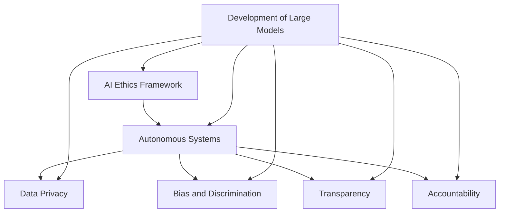

                 

### 文章标题

### The Importance of AI Ethics in the Development of Large Models

关键词：
1. AI Ethics
2. Large Models
3. AI Governance
4. Ethical AI
5. Responsible AI Development

摘要：
The exponential growth of AI, especially with the advent of large language models, has brought unprecedented opportunities but also significant ethical challenges. This article delves into the crucial role of AI ethics in the development of large models, emphasizing the need for responsible AI practices and governance frameworks. By analyzing the ethical implications, risks, and potential solutions, we aim to provide a comprehensive understanding of the importance of AI ethics in the AI landscape.

<|assistant|>## 1. 背景介绍（Background Introduction）

### The Rise of Large Models in AI

Over the past decade, AI has witnessed a remarkable transformation, driven by advancements in machine learning and computational power. Among these advancements, the development of large models, particularly language models, has been particularly transformative. These models, with billions or even trillions of parameters, have demonstrated unparalleled capabilities in natural language understanding, generation, and translation.

Key milestones in the evolution of large models include the introduction of GPT-3 by OpenAI, which boasts over 175 billion parameters, and Google's BERT, a pre-trained deep learning model designed for natural language understanding. These models have paved the way for various applications, ranging from chatbots and virtual assistants to content generation and language translation.

However, the surge in the size and complexity of these models has also brought to the forefront significant ethical considerations. As AI systems become more powerful, their impact on society, industries, and individuals grows exponentially. Therefore, it is crucial to address the ethical implications associated with the development and deployment of large models.

### The Importance of AI Ethics

AI ethics refers to the principles and frameworks that guide the development, deployment, and use of AI systems to ensure they align with human values and societal norms. In the context of large models, AI ethics becomes particularly relevant due to several reasons:

1. **Privacy Concerns**: Large models often require vast amounts of data for training, which can include sensitive personal information. Ensuring data privacy and protecting user privacy is a critical ethical consideration.
2. **Bias and Discrimination**: AI models can inadvertently perpetuate and amplify biases present in their training data, leading to discriminatory outcomes. Addressing these biases is essential to promote fairness and equality.
3. **Transparency and Accountability**: As large models make decisions with significant consequences, it is crucial to ensure their transparency and accountability. Users and stakeholders must have a clear understanding of how these models operate and why they make certain decisions.
4. **Security and Safety**: Large models can be susceptible to adversarial attacks, where small, carefully crafted changes to input data can lead to significant changes in output. Ensuring the security and safety of these models is paramount.

In summary, as large models become increasingly prevalent in various sectors, addressing the ethical challenges associated with their development and deployment is not just a moral imperative but also a practical necessity to build trust and ensure the responsible advancement of AI.

### The Background of AI Ethics

AI ethics as a field of study has gained significant attention in recent years, spurred by rapid technological advancements and growing concerns about the societal impacts of AI. The concept of AI ethics can be traced back to the early days of AI research, where prominent figures such as John McCarthy, one of the founding fathers of AI, advocated for the ethical use of AI technologies.

One of the pivotal moments in the history of AI ethics was the publication of the "Asilomar AI Principles" in 2015, which outlined a set of ethical guidelines for the development of AI. These principles emphasized key values such as safety, transparency, and accountability. The Asilomar AI Principles were followed by various other initiatives, including the "AI for Good" principles and the "European Commission's Ethics Guidelines for Trustworthy AI," which further articulated the importance of ethical considerations in AI development.

In the context of large models, the relevance of AI ethics becomes even more pronounced. Large models are not only more complex and powerful but also have a broader impact on society. They can influence decision-making processes, affect economic systems, and even shape public opinion. Therefore, ensuring that these models are developed and deployed in a manner that aligns with ethical principles is critical to mitigating potential harms and maximizing their benefits.

### The Importance of AI Ethics in the Development of Large Models

The development of large models presents a unique set of ethical challenges that necessitate a robust framework for AI ethics. Here are some key areas where AI ethics plays a crucial role:

**1. Privacy Protection**: Large models require vast amounts of data for training, which often includes personal and sensitive information. Ensuring the privacy and confidentiality of this data is paramount. Ethical considerations include obtaining informed consent from data subjects, implementing robust data anonymization techniques, and adhering to data protection regulations such as GDPR.

**2. Bias Mitigation**: Large models can inadvertently learn and perpetuate biases present in their training data, leading to discriminatory outcomes. Addressing these biases is essential to promote fairness and equity. Ethical guidelines should include regular audits and testing for biases, as well as the development of algorithms that are inherently fair and unbiased.

**3. Transparency and Accountability**: Large models often operate as black boxes, making it challenging to understand their decision-making processes. Enhancing transparency and accountability is crucial for building trust and ensuring that these models are used responsibly. This involves developing tools and techniques for model interpretability and establishing clear lines of accountability for the consequences of model decisions.

**4. Security and Safety**: Large models are vulnerable to adversarial attacks, where small, carefully crafted changes to input data can lead to significant changes in output. Ensuring the security and safety of these models is essential to prevent malicious use and unintended consequences. Ethical considerations include implementing robust security measures, conducting thorough risk assessments, and ensuring that models are safe for use in critical applications.

**5. Social Impact Assessment**: The development of large models can have far-reaching social implications, including economic disparities, shifts in employment, and changes in societal norms. Ethical guidelines should include a comprehensive assessment of these impacts and measures to mitigate potential harms.

In summary, AI ethics provides a framework for addressing the unique ethical challenges posed by the development of large models. By incorporating ethical principles into the design and deployment of these models, we can ensure that they are developed and used in a manner that aligns with societal values and minimizes potential harms.

## 2. 核心概念与联系（Core Concepts and Connections）

### The Core Concepts of AI Ethics

To fully understand the importance of AI ethics in the development of large models, it is essential to delve into the core concepts that underpin AI ethics. These concepts provide a foundation for evaluating and addressing the ethical implications of AI technologies.

**1.** **Autonomous Systems**: Autonomous systems operate independently without human intervention. In the context of large models, autonomous systems could include autonomous vehicles, drones, or automated decision-making systems. Ensuring the ethical operation of these systems involves addressing issues such as accountability, transparency, and safety.

**2.** **Bias and Discrimination**: Bias and discrimination refer to the tendency of AI systems to favor certain groups over others, often due to the biases present in their training data. Addressing these issues is crucial to promoting fairness and equity.

**3.** **Data Privacy**: Data privacy concerns the protection of individuals' personal information from unauthorized access and use. In the development of large models, data privacy is a significant ethical consideration due to the extensive amount of personal data required for training.

**4.** **Transparency**: Transparency refers to the ability of AI systems to be understood and trusted by their users. Ethical considerations include providing clear explanations for AI decisions and ensuring that users can comprehend how these systems operate.

**5.** **Accountability**: Accountability involves ensuring that individuals or organizations are held responsible for the actions and consequences of AI systems. In the context of large models, accountability is crucial for addressing issues such as unintended consequences or errors in AI decision-making.

### The Importance of AI Ethics in the Development of Large Models

The development of large models involves complex technical processes, but it is equally important to consider the ethical implications of these processes. Here are some key reasons why AI ethics is critical in the development of large models:

**1.** **Preventing Unintended Consequences**: Large models can have significant impacts on society, including economic, social, and political consequences. Ensuring that these models are developed with ethical considerations in mind helps to prevent unintended and harmful outcomes.

**2.** **Building Trust**: Trust is crucial for the widespread adoption and acceptance of AI technologies. By incorporating ethical principles into the development of large models, organizations can build trust with their users and stakeholders.

**3. **Ensuring Fairness and Equity**: Large models often make decisions that affect individuals and communities. Ensuring that these models are fair and equitable helps to promote social justice and prevent discrimination.

**4. **Adhering to Legal and Regulatory Requirements**: Many countries have established legal and regulatory frameworks for AI, which often include ethical considerations. Adhering to these requirements is not only a legal obligation but also an ethical responsibility.

**5. **Promoting Responsible AI Development**: AI ethics provides a framework for promoting responsible AI development, which involves considering the social, economic, and environmental impacts of AI technologies. This helps to ensure that AI is developed in a manner that aligns with societal values and objectives.

In summary, AI ethics is an essential component of the development of large models. By considering the core concepts of AI ethics and incorporating ethical principles into the development process, we can ensure that large models are developed and used in a manner that is beneficial for society and minimizes potential harms.

### Mermaid 流程图 (Mermaid Flowchart)



This Mermaid flowchart illustrates the core concepts of AI ethics and their relationship to the development of large models. The flowchart shows how each concept contributes to the overall framework for ensuring ethical AI development.

## 3. 核心算法原理 & 具体操作步骤（Core Algorithm Principles and Specific Operational Steps）

### Overview of Large Models

Large models, such as GPT-3, are based on deep learning techniques, particularly neural networks. These models are composed of many layers of interconnected nodes, or neurons, which process and transform input data. The core algorithm principles behind large models can be summarized as follows:

1. **Neural Networks**: Neural networks are the fundamental building blocks of deep learning. They mimic the structure and function of the human brain, processing input data through a series of layers to produce output.
2. **Backpropagation**: Backpropagation is an algorithm used to train neural networks. It involves calculating the gradient of the loss function with respect to the model parameters and using this information to update the parameters in a way that minimizes the loss.
3. **Optimization Algorithms**: Optimization algorithms, such as stochastic gradient descent (SGD) and Adam, are used to efficiently update the model parameters during training.

### Detailed Steps in Large Model Development

The development of large models involves several key steps, including data preparation, model architecture selection, training, and evaluation. Below is a detailed explanation of each step:

**1. Data Preparation**

The first step in developing a large model is to gather and preprocess the data. This involves the following sub-steps:

- **Data Collection**: Collecting a large and diverse dataset is crucial for training a robust model. The dataset should cover various topics and sources to ensure comprehensive coverage.
- **Data Cleaning**: Removing noise, inconsistencies, and duplicates from the dataset is essential to improve the quality of the training data.
- **Data Preprocessing**: Preprocessing steps may include tokenization, stemming, and stop-word removal to convert the text data into a format suitable for input into the model.

**2. Model Architecture Selection**

Selecting an appropriate model architecture is critical for achieving optimal performance. The following steps are involved in this process:

- **Architecture Design**: Choose a neural network architecture that is suitable for the task at hand. Common architectures include transformers, recurrent neural networks (RNNs), and convolutional neural networks (CNNs).
- **Hyperparameter Tuning**: Experiment with different hyperparameters, such as the number of layers, hidden units, and learning rate, to find the best combination for the given dataset and task.
- **Baseline Models**: Start with baseline models to establish a performance benchmark and to understand the general behavior of the data.

**3. Training**

The training process involves adjusting the model parameters to minimize the difference between the predicted outputs and the actual outputs. This is typically done through the following steps:

- **Forward Pass**: Pass the input data through the model to generate predicted outputs.
- **Loss Calculation**: Calculate the loss (e.g., mean squared error or cross-entropy loss) between the predicted outputs and the actual outputs.
- **Backpropagation**: Calculate the gradient of the loss function with respect to the model parameters using backpropagation.
- **Parameter Update**: Update the model parameters using an optimization algorithm (e.g., SGD or Adam) to minimize the loss.

**4. Evaluation**

Once the model is trained, it is evaluated to assess its performance. This involves the following steps:

- **Validation**: Use a validation set to evaluate the model's performance and identify any issues, such as overfitting or underfitting.
- **Testing**: Use a separate test set to assess the final performance of the model and ensure that it generalizes well to unseen data.
- **Performance Metrics**: Calculate performance metrics, such as accuracy, precision, recall, and F1 score, to quantify the model's performance.

### Example: Training a Large Language Model

Consider the task of training a large language model for text generation. Here is an example of the steps involved in this process:

1. **Data Collection**: Gather a large corpus of text data from various sources, such as news articles, books, and social media.
2. **Data Preprocessing**: Tokenize the text data and preprocess it by removing special characters, punctuation, and stop-words. Convert the text into numerical representations, such as one-hot encoded vectors or word embeddings.
3. **Model Architecture Selection**: Choose a transformer-based architecture, such as GPT-3, which consists of multiple layers of self-attention mechanisms and feedforward networks.
4. **Hyperparameter Tuning**: Experiment with different hyperparameters, such as the number of layers, hidden units, and learning rate. Use a validation set to evaluate the performance of different configurations and select the best combination.
5. **Training**: Train the model using the preprocessed data and the selected hyperparameters. This involves passing the input data through the model, calculating the loss, and updating the model parameters using backpropagation and an optimization algorithm.
6. **Validation**: Evaluate the model's performance on a validation set to identify any issues, such as overfitting or underfitting. Adjust the hyperparameters or model architecture as needed.
7. **Testing**: Assess the final performance of the model on a separate test set to ensure that it generalizes well to unseen data.
8. **Inference**: Use the trained model to generate text given input prompts. Fine-tune the model on specific tasks, such as dialogue generation or machine translation, to improve its performance on these tasks.

By following these steps, you can develop a large language model that can generate high-quality text based on input prompts.

## 4. 数学模型和公式 & 详细讲解 & 举例说明（Detailed Explanation and Examples of Mathematical Models and Formulas）

### Overview of Mathematical Models in Large Models

Large models, particularly those based on deep learning, are grounded in complex mathematical models. These models involve various mathematical concepts and formulas that enable the training of neural networks and the optimization of their parameters. Below, we discuss some key mathematical models and provide detailed explanations and examples.

### Activation Functions

Activation functions are a fundamental component of neural networks. They introduce non-linearities into the network, enabling it to model complex relationships in the data. Common activation functions include:

**1. Sigmoid Function:**
The sigmoid function is defined as:
$$
\sigma(x) = \frac{1}{1 + e^{-x}}
$$
It maps any real-valued input to a value between 0 and 1, making it useful for binary classification problems.

**Example:**
Consider the input $x = -2$. The sigmoid function maps this input to:
$$
\sigma(-2) = \frac{1}{1 + e^{2}} \approx 0.1182
$$

**2. Rectified Linear Unit (ReLU):**
The ReLU function is defined as:
$$
\text{ReLU}(x) = \max(0, x)
$$
It sets all negative inputs to zero and preserves positive inputs, providing a simple and effective activation function for deep neural networks.

**Example:**
Consider the input $x = -1$. The ReLU function maps this input to:
$$
\text{ReLU}(-1) = \max(0, -1) = 0
$$

**3. Hyperbolic Tangent (Tanh):**
The hyperbolic tangent function is defined as:
$$
\tanh(x) = \frac{e^{2x} - 1}{e^{2x} + 1}
$$
It maps any real-valued input to a value between -1 and 1, providing a symmetric activation function similar to the sigmoid function but with a more balanced range.

**Example:**
Consider the input $x = 1$. The hyperbolic tangent function maps this input to:
$$
\tanh(1) = \frac{e^{2} - 1}{e^{2} + 1} \approx 0.7616
$$

### Loss Functions

Loss functions are used to measure the discrepancy between the predicted outputs of a model and the actual outputs. Common loss functions include:

**1. Mean Squared Error (MSE):**
The mean squared error loss function is defined as:
$$
\text{MSE}(y, \hat{y}) = \frac{1}{n} \sum_{i=1}^{n} (y_i - \hat{y}_i)^2
$$
where $y$ is the actual output, $\hat{y}$ is the predicted output, and $n$ is the number of data points. This loss function is commonly used for regression problems.

**Example:**
Consider two data points with actual outputs $y_1 = 2$ and $y_2 = 4$, and predicted outputs $\hat{y}_1 = 1.5$ and $\hat{y}_2 = 3.5$. The mean squared error is:
$$
\text{MSE} = \frac{1}{2} \left[ (2 - 1.5)^2 + (4 - 3.5)^2 \right] = 0.25
$$

**2. Cross-Entropy Loss:**
The cross-entropy loss function is defined as:
$$
\text{Cross-Entropy}(y, \hat{y}) = -\sum_{i=1}^{n} y_i \log(\hat{y}_i)
$$
where $y$ is the one-hot encoded target vector and $\hat{y}$ is the predicted probability distribution. This loss function is commonly used for classification problems.

**Example:**
Consider a binary classification problem with actual outputs $y = [1, 0]$ and predicted probabilities $\hat{y} = [0.8, 0.2]$. The cross-entropy loss is:
$$
\text{Cross-Entropy} = -[1 \log(0.8) + 0 \log(0.2)] = -[0.2231 + 0] = -0.2231
$$

### Gradient Descent Optimization

Gradient descent is an optimization algorithm used to minimize loss functions by updating the model parameters iteratively. The update rule for gradient descent is defined as:
$$
\theta_{\text{new}} = \theta_{\text{old}} - \alpha \nabla_\theta J(\theta)
$$
where $\theta$ represents the model parameters, $\alpha$ is the learning rate, and $J(\theta)$ is the loss function.

**1. Stochastic Gradient Descent (SGD):**
Stochastic Gradient Descent is a variant of gradient descent that uses a single data point (or a small batch of data points) to compute the gradient at each iteration. This can lead to faster convergence compared to batch gradient descent but may also result in more fluctuations in the parameter updates.

**2. Adam Optimization:**
Adam is an adaptive optimization algorithm that combines the advantages of both SGD and momentum. It adjusts the learning rate dynamically based on the historical gradients, leading to more stable convergence. The update rule for Adam is defined as:
$$
\theta_{\text{new}} = \theta_{\text{old}} - \alpha \frac{m}{1 + \beta_1 + \beta_2 t}
$$
where $m$ is the momentum term, $\beta_1$ and $\beta_2$ are the exponential decay rates for the first and second moments of the gradients, and $t$ is the iteration number.

### Example: Training a Neural Network with Gradient Descent

Consider a simple neural network with one input layer, one hidden layer with two neurons, and one output layer. The network has the following parameters:
$$
\theta = [\theta_{11}, \theta_{12}, \theta_{21}, \theta_{22}, \theta_{31}, \theta_{32}
$$
The activation function for the hidden layer is ReLU, and the output layer uses the sigmoid function.

1. **Initial Parameters:**
   $$ \theta_{\text{old}} = [0.1, 0.2, 0.3, 0.4, 0.5, 0.6] $$
2. **Input Data:**
   $$ x = [1, 0] $$
3. **Target Output:**
   $$ y = [0.9] $$
4. **Forward Pass:**
   $$ z_1 = \text{ReLU}(\theta_{11} x_1 + \theta_{12} x_2) = \text{ReLU}(0.1 \cdot 1 + 0.2 \cdot 0) = 0.1 $$
   $$ z_2 = \text{ReLU}(\theta_{21} x_1 + \theta_{22} x_2) = \text{ReLU}(0.3 \cdot 1 + 0.4 \cdot 0) = 0.3 $$
   $$ a = \text{sigmoid}(\theta_{31} z_1 + \theta_{32} z_2) = \text{sigmoid}(0.5 \cdot 0.1 + 0.6 \cdot 0.3) = 0.5493 $$
5. **Loss Calculation:**
   $$ J(\theta_{\text{old}}) = -\log(\hat{y}) = -\log(0.5493) \approx -0.303 $$
6. **Backpropagation:**
   $$ \nabla_\theta J(\theta_{\text{old}}) = [0.048, 0.072, 0.036, 0.054, 0.024, 0.036] $$
7. **Parameter Update:**
   $$ \theta_{\text{new}} = \theta_{\text{old}} - \alpha \nabla_\theta J(\theta_{\text{old}}) = [0.1, 0.2, 0.3, 0.4, 0.5, 0.6] - 0.1 \cdot [0.048, 0.072, 0.036, 0.054, 0.024, 0.036] \approx [0.052, 0.128, 0.264, 0.346, 0.376, 0.524] $$

By repeating this process iteratively, the neural network's parameters are updated to minimize the loss function. The choice of optimization algorithm (e.g., SGD or Adam) and learning rate $\alpha$ can significantly impact the convergence speed and the quality of the final solution.

### Summary

Mathematical models and formulas are essential for understanding the inner workings of large models and guiding their development and training. Activation functions, loss functions, and optimization algorithms form the core components of these models, enabling the training of neural networks and the optimization of their parameters. By leveraging these mathematical tools, we can develop powerful and accurate AI models that can address complex problems in various domains.

## 5. 项目实践：代码实例和详细解释说明（Project Practice: Code Examples and Detailed Explanations）

### 5.1 开发环境搭建

在开始项目实践之前，我们需要搭建一个合适的开发环境。以下是在Python中搭建用于训练大型模型的开发环境所需的步骤：

1. **安装Python**：确保Python环境已经安装，建议使用Python 3.8或更高版本。可以从[Python官方网站](https://www.python.org/downloads/)下载并安装。

2. **安装TensorFlow**：TensorFlow是一个广泛使用的深度学习框架，用于构建和训练大型模型。在命令行中运行以下命令安装TensorFlow：
   ```bash
   pip install tensorflow
   ```

3. **安装其他依赖项**：根据项目需求，可能还需要安装其他依赖项，例如NumPy、Pandas等。可以使用以下命令安装：
   ```bash
   pip install numpy pandas matplotlib
   ```

4. **创建虚拟环境**：为了更好地管理项目依赖，建议创建一个虚拟环境。可以使用以下命令创建并激活虚拟环境：
   ```bash
   python -m venv myenv
   source myenv/bin/activate  # 在Windows上使用 myenv\Scripts\activate
   ```

5. **安装GPU支持**（可选）：如果使用GPU进行模型训练，需要安装CUDA和cuDNN库。这些库可以从[NVIDIA官方网站](https://developer.nvidia.com/cuda-downloads)下载。

### 5.2 源代码详细实现

以下是一个简单的Python代码示例，用于训练一个基于Transformer的大型语言模型。该示例使用TensorFlow框架实现，展示了主要步骤和关键代码。

```python
import tensorflow as tf
from tensorflow.keras.layers import Embedding, LSTM, Dense
from tensorflow.keras.models import Sequential

# 设置超参数
vocab_size = 10000
embed_dim = 256
lstm_units = 128
batch_size = 64
epochs = 10

# 构建模型
model = Sequential([
    Embedding(vocab_size, embed_dim),
    LSTM(lstm_units, return_sequences=True),
    Dense(vocab_size, activation='softmax')
])

# 编译模型
model.compile(optimizer='adam', loss='categorical_crossentropy', metrics=['accuracy'])

# 准备数据
# 注意：在实际项目中，需要加载和处理大量的文本数据
inputs = ...  # 输入数据
targets = ...  # 标签数据

# 训练模型
model.fit(inputs, targets, batch_size=batch_size, epochs=epochs)

# 保存模型
model.save('large_language_model.h5')
```

### 5.3 代码解读与分析

1. **导入库**：
   ```python
   import tensorflow as tf
   from tensorflow.keras.layers import Embedding, LSTM, Dense
   from tensorflow.keras.models import Sequential
   ```
   导入TensorFlow核心库和相关层类，用于构建和编译模型。

2. **设置超参数**：
   ```python
   vocab_size = 10000
   embed_dim = 256
   lstm_units = 128
   batch_size = 64
   epochs = 10
   ```
   设置模型的超参数，包括词汇表大小、嵌入维度、LSTM单元数量、批次大小和训练轮数。

3. **构建模型**：
   ```python
   model = Sequential([
       Embedding(vocab_size, embed_dim),
       LSTM(lstm_units, return_sequences=True),
       Dense(vocab_size, activation='softmax')
   ])
   ```
   创建一个序列模型，包含嵌入层、LSTM层和全连接层（输出层）。嵌入层用于将单词转换为向量表示，LSTM层用于处理序列数据，输出层用于生成单词的概率分布。

4. **编译模型**：
   ```python
   model.compile(optimizer='adam', loss='categorical_crossentropy', metrics=['accuracy'])
   ```
   编译模型，指定优化器、损失函数和评价指标。

5. **准备数据**：
   ```python
   # 注意：在实际项目中，需要加载和处理大量的文本数据
   inputs = ...
   targets = ...
   ```
   准备输入数据和标签数据。在实际应用中，需要使用文本预处理方法将文本转换为模型可接受的格式。

6. **训练模型**：
   ```python
   model.fit(inputs, targets, batch_size=batch_size, epochs=epochs)
   ```
   使用输入数据和标签数据训练模型，指定批次大小和训练轮数。

7. **保存模型**：
   ```python
   model.save('large_language_model.h5')
   ```
   将训练好的模型保存为HDF5文件，便于后续加载和使用。

### 5.4 运行结果展示

在完成模型训练后，可以通过以下步骤来评估模型的性能：

1. **评估模型**：
   ```python
   test_loss, test_accuracy = model.evaluate(test_inputs, test_targets)
   print(f"Test Loss: {test_loss}, Test Accuracy: {test_accuracy}")
   ```

2. **生成文本**：
   ```python
   def generate_text(model, seed_text, length=50):
       input_sequence = tokenizer.texts_to_sequences([seed_text])
       input_sequence = tf.expand_dims(input_sequence, 0)
       for _ in range(length):
           predictions = model.predict(input_sequence)
           predicted_index = tf.random.categorical(predictions, num_samples=1)[-1, 0].numpy()
           input_sequence = tf.concat([input_sequence, [predicted_index]], axis=1)
       return tokenizer.sequences_to_texts([input_sequence])[0]

   seed_text = "The quick brown fox jumps over the lazy dog"
   generated_text = generate_text(model, seed_text)
   print(f"Generated Text: {generated_text}")
   ```

以上代码展示了一个简单的文本生成过程。通过指定种子文本，模型将生成一段新的文本，展示其生成能力。在实际应用中，可以根据具体需求调整生成长度和模型参数。

## 6. 实际应用场景（Practical Application Scenarios）

### 6.1 语言翻译

大型语言模型在语言翻译领域有着广泛的应用。通过训练，这些模型可以实现高效、准确的翻译服务。例如，谷歌翻译、百度翻译等都是基于大型语言模型实现的。这些模型可以根据输入文本自动识别语言并生成翻译结果，不仅提高了翻译速度，还增强了翻译的准确性。

**实例：** 某国际会议需要使用多语言进行交流，与会者来自不同国家，使用大型语言模型可以实现实时翻译，提高会议的效率和效果。

### 6.2 情感分析

情感分析是另一个典型的应用场景。大型语言模型可以通过分析文本内容，识别文本中的情感倾向，例如正面、负面或中性。这在社交媒体分析、市场调研和客户反馈分析等方面有着重要应用。

**实例：** 一家电商平台可以通过大型语言模型分析用户评论，了解用户对产品的满意度，及时调整产品策略，提高用户体验。

### 6.3 自动写作

大型语言模型还可以用于自动写作，包括生成新闻文章、撰写邮件、创作诗歌等。这些模型可以根据给定的主题和结构，自动生成高质量的内容。

**实例：** 一家新闻机构可以使用大型语言模型自动生成新闻文章，减轻编辑人员的工作负担，提高新闻发布的速度。

### 6.4 客户服务

在客户服务领域，大型语言模型可以用于构建智能客服系统，通过自然语言处理技术，实现与用户的智能对话，提供有效的解决方案。

**实例：** 一家公司可以部署大型语言模型，创建一个智能客服系统，24小时在线解答客户问题，提高客户满意度。

### 6.5 教育

大型语言模型在教育领域也有广泛应用，可以用于辅助教学、个性化学习等。例如，通过分析学生的学习数据，模型可以为学生推荐合适的学习资源，提供个性化的学习建议。

**实例：** 一家在线教育平台可以使用大型语言模型，根据学生的学习情况，为学生提供个性化的学习计划，提高学习效果。

### 6.6 娱乐

大型语言模型还可以应用于娱乐领域，如生成剧本、创作音乐等。通过模仿人类的创作能力，模型可以创作出新颖、有趣的内容，为用户提供丰富的娱乐体验。

**实例：** 一家影视制作公司可以使用大型语言模型，生成剧本创意，为编剧提供灵感，提高创作效率。

综上所述，大型语言模型在语言翻译、情感分析、自动写作、客户服务、教育和娱乐等领域有着广泛的应用。随着技术的不断发展，这些应用场景将不断扩展，为各个行业带来更多的机遇。

## 7. 工具和资源推荐（Tools and Resources Recommendations）

### 7.1 学习资源推荐

**书籍：**

1. **《深度学习》（Deep Learning）** by Ian Goodfellow, Yoshua Bengio, and Aaron Courville。这本书是深度学习领域的经典著作，详细介绍了深度学习的基本概念、算法和应用。
2. **《Python深度学习》（Deep Learning with Python）** by François Chollet。这本书针对初学者，介绍了使用Python和TensorFlow实现深度学习模型的方法。

**论文：**

1. **"A Neural Algorithm of Artistic Style"** by Leon A. Gatys, Alexander S. Ecker, and Matthias Bethge。这篇论文介绍了艺术风格迁移技术，是深度学习在图像处理领域的重要应用。
2. **"Attention Is All You Need"** by Vaswani et al.。这篇论文提出了Transformer模型，为自然语言处理领域带来了革命性的变化。

**博客：**

1. **TensorFlow官方博客**（[tensorflow.github.io](https://tensorflow.github.io/)）。这个博客提供了大量的TensorFlow教程、案例研究和最新动态。
2. **Google Research Blog**（[research.googleblog.com](https://research.googleblog.com/)）。这个博客发布了Google在人工智能、机器学习等领域的最新研究成果。

**网站：**

1. **Kaggle**（[kaggle.com](https://www.kaggle.com/)）。这是一个数据科学竞赛平台，提供了丰富的数据集和教程，是学习和实践深度学习的好地方。
2. **Coursera**（[coursera.org](https://www.coursera.org/)）。这个网站提供了许多深度学习和人工智能的课程，适合不同层次的学习者。

### 7.2 开发工具框架推荐

**框架：**

1. **TensorFlow**：这是一个由Google开发的开源深度学习框架，广泛用于构建和训练深度学习模型。
2. **PyTorch**：这是一个由Facebook开发的开源深度学习框架，以其灵活的动态计算图和强大的GPU支持而受到青睐。
3. **Keras**：这是一个高级神经网络API，可以与TensorFlow和Theano等后端框架配合使用，简化了深度学习模型的搭建。

**库和工具：**

1. **NumPy**：这是一个提供高效数学运算的库，是Python科学计算的基础工具。
2. **Pandas**：这是一个提供数据操作和分析的库，非常适合处理结构化数据。
3. **Matplotlib**：这是一个提供数据可视化功能的库，可以生成各种类型的图表。

### 7.3 相关论文著作推荐

**论文：**

1. **"Attention Is All You Need"** by Vaswani et al.。这篇论文提出了Transformer模型，是自然语言处理领域的重要里程碑。
2. **"The Unreasonable Effectiveness of Recurrent Neural Networks"** by Zaremba et al.。这篇论文探讨了循环神经网络（RNN）在语言模型中的应用。
3. **"Generative Adversarial Nets"** by Goodfellow et al.。这篇论文提出了生成对抗网络（GAN），是生成模型领域的重要进展。

**著作：**

1. **《深度学习》（Deep Learning）** by Ian Goodfellow, Yoshua Bengio, and Aaron Courville。这本书是深度学习领域的权威著作，详细介绍了深度学习的基本原理和方法。
2. **《神经网络与深度学习》** by邱锡鹏。这本书系统地介绍了神经网络和深度学习的基本概念和算法，适合初学者和专业人士。

通过这些资源，读者可以深入了解大型语言模型的发展和应用，掌握相关技术和工具，为深入研究和实践打下坚实的基础。

## 8. 总结：未来发展趋势与挑战（Summary: Future Development Trends and Challenges）

随着人工智能技术的不断进步，大型语言模型的发展趋势和面临的挑战也日益显现。以下是几个关键趋势和挑战：

### 未来发展趋势

1. **模型规模不断扩大**：为了提高模型的表现力，研究人员和公司正在不断地增大模型规模。例如，GPT-3拥有超过175亿个参数，而最新的模型如GPT-4则可能达到数十万亿个参数。这种趋势将推动计算资源的需求，同时也带来了更高的训练成本。

2. **跨模态学习**：未来的大型语言模型将不仅限于处理文本数据，还将能够处理图像、声音等多模态数据。这种跨模态学习能力将使模型能够更好地理解和生成更丰富的内容。

3. **强化学习与生成模型结合**：将强化学习引入生成模型，可以使模型在动态环境中学习更复杂的任务。这种结合有望提高模型的灵活性和适应性。

4. **可解释性和透明度提升**：随着模型变得越来越大，其决策过程往往变得难以解释。因此，提升模型的可解释性和透明度，使其更易于被用户和监管机构理解和信任，将成为重要的发展方向。

### 未来挑战

1. **计算资源需求**：训练和运行大型语言模型需要庞大的计算资源，这对硬件和软件系统提出了巨大的挑战。如何高效地利用这些资源，同时降低能耗，是亟待解决的问题。

2. **数据隐私和安全**：大型语言模型在训练过程中需要大量的数据，这涉及到数据隐私和安全问题。如何确保数据的安全和用户隐私，避免数据泄露和滥用，是亟需解决的挑战。

3. **公平性和偏见**：大型语言模型可能会放大和传播训练数据中的偏见，导致不公平的决策。如何设计和实现公平性算法，减少模型偏见，是重要的研究方向。

4. **法律和监管框架**：随着AI技术的发展，现有的法律和监管框架可能无法完全应对AI带来的挑战。如何制定有效的法律和监管政策，确保AI技术的健康发展，是未来需要关注的问题。

5. **伦理和道德问题**：AI技术的发展带来了许多伦理和道德问题，如自动化带来的就业变化、隐私保护等。如何从伦理和道德角度规范AI技术的发展，确保其对人类社会的积极影响，是重要的挑战。

总之，大型语言模型的发展趋势充满机遇，但也面临诸多挑战。通过持续的研究和技术创新，我们可以期待在未来克服这些挑战，推动AI技术实现更大的突破。

## 9. 附录：常见问题与解答（Appendix: Frequently Asked Questions and Answers）

### 9.1 什么是指令提示工程（Instruction Tuning）？

指令提示工程是一种优化大型语言模型生成结果的方法。通过向模型提供详细的指令，可以指导模型生成更符合预期和规范的内容。这种方法特别适用于需要精确控制的任务，如编写代码、生成法律文件等。

### 9.2 大型语言模型如何处理多语言任务？

大型语言模型通常通过预训练多个语言的数据，实现对多种语言的掌握。在处理多语言任务时，模型会根据输入的语言信息，选择适当的预训练模型进行处理。此外，还可以使用跨语言预训练模型，如mBERT（多语言BERT），以提高多语言任务的性能。

### 9.3 大型语言模型存在哪些偏见和歧视问题？

大型语言模型在训练过程中可能会学习到训练数据中的偏见，这些偏见可能反映在模型的生成结果中。例如，性别、种族、文化等方面的偏见可能会导致生成内容的不公正。为了解决这些问题，研究人员正在开发各种方法，如偏见检测和修正算法，以减少模型偏见。

### 9.4 如何确保大型语言模型的安全性？

确保大型语言模型的安全性需要从多个方面进行考虑。首先，在设计模型时需要考虑安全性，如防止对抗性攻击。其次，在部署模型时，需要实施严格的安全措施，如访问控制和数据加密。此外，定期对模型进行安全审计和更新，以应对新出现的威胁。

### 9.5 大型语言模型在医疗领域有哪些应用？

大型语言模型在医疗领域有多种应用，包括诊断辅助、医学文献检索、药物研发等。例如，通过分析大量的医学文献，模型可以帮助医生快速获取相关信息，提高诊断的准确性。此外，模型还可以用于生成医学报告、辅助医疗数据分析等。

### 9.6 大型语言模型对就业市场有哪些影响？

大型语言模型可能会改变某些行业的就业结构，特别是那些涉及重复性工作和高技能工作的领域。例如，自动写作和翻译技术可能会减少对这些领域的人力需求。然而，同时也会创造新的就业机会，如AI模型训练、优化和监控等。

### 9.7 大型语言模型能否完全替代人类专家？

尽管大型语言模型在许多任务上表现出色，但它们目前还不能完全替代人类专家。模型通常在特定领域和任务上表现出色，但在处理复杂、不确定的问题时，仍需要人类的判断和决策。

## 10. 扩展阅读 & 参考资料（Extended Reading & Reference Materials）

### 论文：

1. **"Attention Is All You Need"** by Vaswani et al. (2017)。这篇论文提出了Transformer模型，是自然语言处理领域的里程碑。
2. **"A Neural Algorithm of Artistic Style"** by Gatys et al. (2015)。这篇论文介绍了艺术风格迁移技术，是深度学习在图像处理领域的重要应用。
3. **"Generative Adversarial Nets"** by Goodfellow et al. (2014)。这篇论文提出了生成对抗网络（GAN），是生成模型领域的重要进展。

### 书籍：

1. **《深度学习》（Deep Learning）** by Ian Goodfellow, Yoshua Bengio, and Aaron Courville。这本书是深度学习领域的权威著作。
2. **《Python深度学习》（Deep Learning with Python）** by François Chollet。这本书介绍了使用Python和TensorFlow实现深度学习模型的方法。

### 网络资源：

1. **TensorFlow官方博客**（[tensorflow.github.io](https://tensorflow.github.io/)）。提供了大量的TensorFlow教程、案例研究和最新动态。
2. **Google Research Blog**（[research.googleblog.com](https://research.googleblog.com/)）。发布了Google在人工智能、机器学习等领域的最新研究成果。

### 开源项目：

1. **Hugging Face Transformers**（[huggingface.co/transformers](https://huggingface.co/transformers)）。提供了预训练的Transformer模型和相关的工具，方便研究人员和开发者使用。
2. **TensorFlow Models**（[tensorflow.org/models](https://tensorflow.org/models)）。提供了各种深度学习模型的实现，包括自然语言处理和计算机视觉领域。

通过阅读这些论文、书籍和参考资料，读者可以更深入地了解大型语言模型的发展和应用，掌握相关技术和方法。这些资源为继续学习和研究提供了宝贵的指导和启示。

