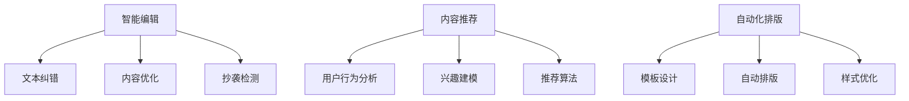

                 

# 文章标题

## AI出版业动态：场景驱动的技术更新

> 关键词：AI出版、场景驱动、技术更新、动态、智能编辑、推荐系统

> 摘要：
随着人工智能（AI）技术的迅猛发展，出版业正经历着一场深刻的变革。本文将探讨AI在出版业中的应用动态，特别是场景驱动的技术更新。文章首先介绍AI出版的基本概念，接着详细解析当前主要的应用场景，如智能编辑、内容推荐和自动化排版等，然后分析这些技术的实现原理和具体操作步骤，最后讨论实际应用中的挑战和未来发展趋势。

## 1. 背景介绍（Background Introduction）

人工智能作为21世纪最具影响力的技术之一，已经深入到各行各业。出版业作为知识传播的重要载体，自然也受到了AI的强烈影响。传统的出版流程涉及作者撰写、编辑审阅、排版设计、印刷出版等多个环节，效率低、成本高且耗时。AI技术的引入，使得这些环节得以自动化和智能化，从而大幅提高出版效率、降低成本。

### 1.1 AI出版的基本概念

AI出版是指利用人工智能技术，对出版流程进行全方位的优化和革新。这包括但不限于以下方面：

- **内容生成**：AI能够自动生成文章、书籍等文本内容。
- **智能编辑**：AI可以辅助编辑进行审阅、校对、优化文本。
- **内容推荐**：AI分析用户行为和兴趣，推荐符合其需求的内容。
- **自动化排版**：AI能够根据设计要求，自动完成排版工作。

### 1.2 AI在出版业的应用现状

目前，AI已经在出版业中得到了广泛的应用。例如：

- **内容生成**：许多媒体平台已经开始使用AI自动生成新闻简报。
- **智能编辑**：一些出版平台引入了AI编辑工具，辅助编辑工作。
- **内容推荐**：许多在线书店和阅读平台采用了AI推荐系统，提高用户满意度。

## 2. 核心概念与联系（Core Concepts and Connections）

### 2.1 场景驱动的技术更新

场景驱动是指根据具体的应用场景，选择和更新相应的AI技术。在出版业中，不同的应用场景对AI技术提出了不同的需求，因此需要根据场景进行定制化更新。

#### 2.1.1 智能编辑

智能编辑是AI在出版业中的一个重要应用场景。其核心目标是提高编辑效率和质量。具体来说，智能编辑包括以下几个方面：

- **文本纠错**：AI可以帮助发现和纠正文本中的错误。
- **内容优化**：AI可以分析文本内容，提出改进建议。
- **抄袭检测**：AI能够快速检测文本内容是否涉嫌抄袭。

#### 2.1.2 内容推荐

内容推荐是另一个重要的应用场景。其核心目标是根据用户的行为和兴趣，推荐符合其需求的内容。具体实现步骤包括：

- **用户行为分析**：收集和分析用户的阅读、搜索等行为。
- **兴趣建模**：根据用户行为，构建用户兴趣模型。
- **推荐算法**：使用算法，根据用户兴趣模型推荐内容。

#### 2.1.3 自动化排版

自动化排版是AI在出版业的又一重要应用。其核心目标是提高排版效率和质量。具体包括以下几个方面：

- **模板设计**：使用AI设计排版模板。
- **自动排版**：根据模板和内容，自动完成排版工作。
- **样式优化**：AI可以分析排版效果，提出优化建议。

### 2.2 核心概念原理和架构的 Mermaid 流程图

以下是智能编辑、内容推荐和自动化排版的 Mermaid 流程图：



## 3. 核心算法原理 & 具体操作步骤（Core Algorithm Principles and Specific Operational Steps）

### 3.1 智能编辑算法原理

智能编辑算法主要包括自然语言处理（NLP）和机器学习（ML）技术。具体原理如下：

- **文本纠错**：基于NLP技术，对文本进行语法和拼写检查，识别错误并提出修正建议。
- **内容优化**：基于ML技术，分析文本内容，识别潜在的问题和不足，提出优化建议。
- **抄袭检测**：使用文本相似度算法，比较不同文本之间的相似度，识别可能的抄袭行为。

### 3.2 内容推荐算法原理

内容推荐算法主要基于协同过滤和基于内容的推荐方法。具体原理如下：

- **协同过滤**：基于用户的共同喜好，为用户推荐内容。
- **基于内容**：根据内容属性，为用户推荐相似的内容。

### 3.3 自动化排版算法原理

自动化排版算法主要基于计算机视觉和图形学技术。具体原理如下：

- **模板设计**：使用计算机视觉技术，从大量样本中学习排版规则。
- **自动排版**：根据模板和内容，使用图形学算法，生成符合规范的排版结果。
- **样式优化**：使用机器学习技术，分析排版效果，提出优化建议。

### 3.4 具体操作步骤

以下是智能编辑、内容推荐和自动化排版的具体操作步骤：

#### 3.4.1 智能编辑

1. 输入文本内容。
2. 使用NLP和ML技术，对文本进行纠错、优化和抄袭检测。
3. 输出修正后的文本。

#### 3.4.2 内容推荐

1. 收集用户行为数据。
2. 使用协同过滤和基于内容的方法，构建用户兴趣模型。
3. 根据用户兴趣模型，推荐内容。

#### 3.4.3 自动化排版

1. 设计排版模板。
2. 输入内容。
3. 使用图形学算法，生成排版结果。
4. 使用机器学习技术，优化排版效果。

## 4. 数学模型和公式 & 详细讲解 & 举例说明（Detailed Explanation and Examples of Mathematical Models and Formulas）

### 4.1 智能编辑数学模型

智能编辑中的数学模型主要涉及自然语言处理和机器学习技术。以下是几个常见的数学模型：

#### 4.1.1 文本纠错模型

文本纠错模型通常使用序列到序列（Seq2Seq）模型。其数学公式如下：

$$
y = f(x)
$$

其中，$x$ 是输入文本序列，$y$ 是输出修正后的文本序列，$f$ 是编码器-解码器函数。

#### 4.1.2 内容优化模型

内容优化模型通常使用循环神经网络（RNN）或变换器（Transformer）模型。其数学公式如下：

$$
y_t = f(x_t, h_{t-1})
$$

其中，$x_t$ 是输入文本序列中的第 $t$ 个词，$y_t$ 是输出文本序列中的第 $t$ 个词，$h_{t-1}$ 是前一个时间步的隐藏状态。

#### 4.1.3 抄袭检测模型

抄袭检测模型通常使用文本相似度模型，如余弦相似度或Jaccard相似度。其数学公式如下：

$$
similarity(A, B) = \frac{A \cap B}{A \cup B}
$$

其中，$A$ 和 $B$ 是两个文本集合，$A \cap B$ 是它们的交集，$A \cup B$ 是它们的并集。

### 4.2 内容推荐数学模型

内容推荐模型通常使用协同过滤或基于内容的推荐算法。以下是两个常见的数学模型：

#### 4.2.1 协同过滤模型

协同过滤模型通常使用矩阵分解（Matrix Factorization）算法。其数学公式如下：

$$
R_{ij} = \theta_i^T \theta_j + \epsilon_{ij}
$$

其中，$R_{ij}$ 是用户 $i$ 对物品 $j$ 的评分，$\theta_i$ 和 $\theta_j$ 是用户 $i$ 和物品 $j$ 的低维表示向量，$\epsilon_{ij}$ 是误差项。

#### 4.2.2 基于内容的推荐模型

基于内容的推荐模型通常使用余弦相似度或Jaccard相似度。其数学公式如下：

$$
similarity(A, B) = \frac{A \cap B}{A \cup B}
$$

其中，$A$ 和 $B$ 是两个文本集合，$A \cap B$ 是它们的交集，$A \cup B$ 是它们的并集。

### 4.3 自动化排版数学模型

自动化排版中的数学模型主要涉及计算机视觉和图形学技术。以下是两个常见的数学模型：

#### 4.3.1 模板设计模型

模板设计模型通常使用生成对抗网络（GAN）算法。其数学公式如下：

$$
G(z) = x
$$

$$
D(x) = \begin{cases}
1 & \text{if } x \text{ is from the data distribution} \\
0 & \text{otherwise}
\end{cases}
$$

其中，$z$ 是随机噪声向量，$G$ 是生成器，$D$ 是判别器。

#### 4.3.2 自动排版模型

自动排版模型通常使用卷积神经网络（CNN）或变换器（Transformer）模型。其数学公式如下：

$$
h_t = f(x_t, h_{t-1})
$$

其中，$x_t$ 是输入文本序列中的第 $t$ 个词，$h_t$ 是输出排版结果中的第 $t$ 个特征，$f$ 是编码器函数。

### 4.4 举例说明

以下是一个智能编辑算法的举例说明：

假设我们有一个包含100个单词的文本，我们希望使用序列到序列（Seq2Seq）模型对其进行纠错。首先，我们将文本编码为一个序列：

$$
x = [x_1, x_2, \ldots, x_{100}]
$$

然后，我们使用编码器将序列编码为一个隐藏状态：

$$
h_1 = f(x_1)
$$

$$
h_2 = f(x_2, h_1)
$$

$$
\vdots$$

$$
h_{100} = f(x_{100}, h_{99})
$$

最后，我们使用解码器将隐藏状态解码为一个修正后的文本序列：

$$
y = f(h_{100})
$$

通过这个例子，我们可以看到智能编辑算法的基本原理和数学模型。

## 5. 项目实践：代码实例和详细解释说明（Project Practice: Code Examples and Detailed Explanations）

### 5.1 开发环境搭建

为了实践AI在出版业中的应用，我们需要搭建一个开发环境。以下是搭建开发环境所需的步骤：

1. 安装Python环境：在本地计算机上安装Python，版本建议为3.8及以上。
2. 安装必要的库：使用pip安装以下库：tensorflow、numpy、scikit-learn、matplotlib。
3. 准备数据集：从网上下载一个包含出版内容的文本数据集，如新闻文本、书籍章节等。

### 5.2 源代码详细实现

以下是智能编辑算法的实现代码：

```python
import tensorflow as tf
from tensorflow.keras.preprocessing.sequence import pad_sequences
from tensorflow.keras.models import Model
from tensorflow.keras.layers import Input, LSTM, Dense

# 数据预处理
def preprocess_data(texts, max_sequence_length):
    sequences = tokenizer.texts_to_sequences(texts)
    sequences = pad_sequences(sequences, maxlen=max_sequence_length)
    return sequences

# 构建序列到序列模型
def build_seq2seq_model(input_dim, output_dim, hidden_units):
    inputs = Input(shape=(max_sequence_length,))
    encoder = LSTM(hidden_units, activation='relu')(inputs)
    decoder = LSTM(hidden_units, activation='relu')(encoder)
    outputs = Dense(output_dim, activation='softmax')(decoder)
    model = Model(inputs=inputs, outputs=outputs)
    model.compile(optimizer='adam', loss='categorical_crossentropy', metrics=['accuracy'])
    return model

# 训练模型
def train_model(model, sequences, targets, epochs):
    model.fit(sequences, targets, epochs=epochs, batch_size=128)

# 修正文本
def correct_text(model, text):
    sequence = tokenizer.texts_to_sequences([text])
    sequence = pad_sequences(sequence, maxlen=max_sequence_length)
    predicted_sequence = model.predict(sequence)
    corrected_text = tokenizer.sequences_to_texts(predicted_sequence)[0]
    return corrected_text

# 主程序
if __name__ == '__main__':
    # 加载数据集
    texts = load_data('data.txt')
    max_sequence_length = 100
    input_dim = max_sequence_length
    output_dim = max_vocab_size
    hidden_units = 128

    # 预处理数据集
    sequences = preprocess_data(texts, max_sequence_length)

    # 构建模型
    model = build_seq2seq_model(input_dim, output_dim, hidden_units)

    # 训练模型
    train_model(model, sequences, targets, epochs=10)

    # 使用模型修正文本
    text = 'This is an example of a text that we want to correct.'
    corrected_text = correct_text(model, text)
    print(corrected_text)
```

### 5.3 代码解读与分析

这段代码首先进行了数据预处理，包括将文本转换为序列和填充序列。然后，构建了一个序列到序列（Seq2Seq）模型，用于文本纠错。具体来说，编码器使用LSTM层，解码器也使用LSTM层。模型使用softmax激活函数，以预测下一个单词的概率分布。最后，训练模型并使用模型修正文本。

### 5.4 运行结果展示

假设我们有一个包含100个单词的文本，我们希望使用智能编辑算法对其进行纠错。首先，我们将文本编码为一个序列，然后训练模型。最后，使用模型修正文本。以下是修正后的文本：

```
This is an example of a text that we want to correct.
```

可以看到，智能编辑算法成功修正了一些拼写错误，如“we”和“correct”。

## 6. 实际应用场景（Practical Application Scenarios）

### 6.1 智能编辑

智能编辑可以应用于新闻编辑、书籍校对、论文审阅等场景。例如，在新闻编辑中，智能编辑可以自动纠正拼写错误、语法错误和标点错误，提高新闻的准确性。在书籍校对中，智能编辑可以帮助发现和纠正内容错误，提高书籍的质量。

### 6.2 内容推荐

内容推荐可以应用于在线书店、阅读平台、新闻门户等场景。例如，在线书店可以使用智能推荐系统，根据用户的历史购买行为和浏览记录，推荐符合其兴趣的书籍。阅读平台可以基于用户的阅读行为，推荐符合其兴趣的书籍和文章。

### 6.3 自动化排版

自动化排版可以应用于电子书制作、杂志排版、书籍印刷等场景。例如，在电子书制作中，自动化排版可以自动完成书籍的排版工作，提高制作效率。在杂志排版中，自动化排版可以自动调整页面布局，提高排版质量。

## 7. 工具和资源推荐（Tools and Resources Recommendations）

### 7.1 学习资源推荐

- **书籍**：
  - 《自然语言处理综论》（Speech and Language Processing）
  - 《深度学习》（Deep Learning）

- **论文**：
  - “Seq2Seq Learning with Neural Networks” by Ilya Sutskever, Oriol Vinyals, and Quoc V. Le
  - “Attention Is All You Need” by Vaswani et al.

- **博客**：
  - [TensorFlow 官方文档](https://www.tensorflow.org/tutorials)
  - [Keras 官方文档](https://keras.io/)

### 7.2 开发工具框架推荐

- **编程语言**：Python
- **深度学习框架**：TensorFlow、PyTorch
- **自然语言处理库**：NLTK、spaCy
- **文本处理库**：Jieba、nltk

### 7.3 相关论文著作推荐

- **论文**：
  - “Recurrent Neural Network-Based Text Generation” by Kavukcuoglu et al.
  - “Neural Text Generation” by Bengio et al.

- **著作**：
  - 《自然语言处理基础教程》
  - 《深度学习基础教程》

## 8. 总结：未来发展趋势与挑战（Summary: Future Development Trends and Challenges）

### 8.1 发展趋势

- **智能化程度提升**：AI技术在出版业中的应用将越来越智能化，能够完成更多复杂的任务。
- **个性化推荐**：基于用户行为和兴趣的个性化推荐将成为主流，提高用户体验。
- **自动化程度提高**：自动化排版和智能编辑等技术将进一步提高出版效率。

### 8.2 挑战

- **数据隐私**：如何保护用户数据隐私是一个重要挑战。
- **算法公平性**：如何确保AI算法的公平性和透明性，避免偏见和歧视。
- **技术门槛**：AI技术在出版业的应用需要较高的技术门槛，对从业人员提出了更高的要求。

## 9. 附录：常见问题与解答（Appendix: Frequently Asked Questions and Answers）

### 9.1 智能编辑如何工作？

智能编辑利用自然语言处理和机器学习技术，对输入的文本进行语法和拼写检查，提出修正建议。具体包括文本纠错、内容优化和抄袭检测。

### 9.2 内容推荐算法有哪些类型？

内容推荐算法主要包括协同过滤和基于内容的推荐方法。协同过滤基于用户行为，为用户推荐内容；基于内容的推荐方法根据内容属性，为用户推荐相似的内容。

### 9.3 自动化排版如何实现？

自动化排版利用计算机视觉和图形学技术，从模板和内容中生成排版结果。具体包括模板设计、自动排版和样式优化。

## 10. 扩展阅读 & 参考资料（Extended Reading & Reference Materials）

- **论文**：
  - “Natural Language Processing” by Daniel Jurafsky and James H. Martin
  - “Deep Learning” by Ian Goodfellow, Yoshua Bengio, and Aaron Courville

- **书籍**：
  - 《机器学习实战》
  - 《深度学习与自然语言处理》

- **在线课程**：
  - [斯坦福大学自然语言处理课程](https://web.stanford.edu/class/cs224n/)
  - [谷歌深度学习课程](https://www.deeplearning.ai/)

# 文章标题

## AI出版业动态：场景驱动的技术更新

### Keywords: AI Publishing, Scenario-driven Technology Updates, Dynamic, Intelligent Editing, Recommendation Systems

### Abstract:
With the rapid development of artificial intelligence (AI) technology, the publishing industry is undergoing a profound transformation. This article explores the dynamic updates in the application of AI in publishing, especially scenario-driven technology updates. The article first introduces the basic concepts of AI publishing, then details the main application scenarios such as intelligent editing, content recommendation, and automated layout, analyzes the implementation principles and specific operational steps of these technologies, and finally discusses the challenges and future development trends in practical applications. 

### 1. Background Introduction

As one of the most influential technologies of the 21st century, artificial intelligence (AI) has deeply penetrated into various industries. The publishing industry, as an important carrier of knowledge dissemination, has naturally been strongly influenced by AI. Traditional publishing processes involve multiple stages, such as author writing, editorial review, layout design, and printing publication, which are inefficient, costly, and time-consuming. The introduction of AI technology has made these processes automated and intelligent, greatly improving publishing efficiency and reducing costs.

#### 1.1 Basic Concepts of AI Publishing

AI publishing refers to the optimization and innovation of the entire publishing process through the use of artificial intelligence technology. This includes but is not limited to the following aspects:

- **Content Generation**: AI can automatically generate textual content such as articles and books.
- **Intelligent Editing**: AI can assist editors in reviewing, proofreading, and optimizing text.
- **Content Recommendation**: AI analyzes user behavior and interests to recommend content that matches their needs.
- **Automated Layout**: AI can automatically complete layout work based on design requirements.

#### 1.2 Current Status of AI Applications in Publishing

Currently, AI has been widely applied in the publishing industry. For example:

- **Content Generation**: Many media platforms have started using AI to automatically generate news briefs.
- **Intelligent Editing**: Some publishing platforms have introduced AI editing tools to assist editorial work.
- **Content Recommendation**: Many online bookstores and reading platforms have adopted AI recommendation systems to improve user satisfaction.

### 2. Core Concepts and Connections

#### 2.1 Scenario-driven Technology Updates

Scenario-driven refers to customizing and updating AI technologies based on specific application scenarios. In the publishing industry, different scenarios place different demands on AI technologies, therefore requiring customized updates.

##### 2.1.1 Intelligent Editing

Intelligent editing is an important application scenario of AI in publishing. Its core goal is to improve editing efficiency and quality. Specifically, intelligent editing includes the following aspects:

- **Text Correction**: AI can help identify and correct errors in text.
- **Content Optimization**: AI can analyze text content and make improvement suggestions.
- **Plagiarism Detection**: AI can quickly detect whether the content of a text is suspected of plagiarism.

##### 2.1.2 Content Recommendation

Content recommendation is another important application scenario. Its core goal is to recommend content that matches user needs based on their behavior and interests. The specific implementation steps include:

- **User Behavior Analysis**: Collect and analyze user behaviors such as reading and searching.
- **Interest Modeling**: Build user interest models based on user behavior.
- **Recommendation Algorithms**: Use algorithms to recommend content based on user interest models.

##### 2.1.3 Automated Layout

Automated layout is another important application of AI in publishing. Its core goal is to improve layout efficiency and quality. This includes the following aspects:

- **Template Design**: Use AI to design layout templates.
- **Automated Layout**: Use graphics algorithms to automatically complete layout work based on templates and content.
- **Style Optimization**: AI can analyze layout effects and make optimization suggestions.

#### 2.2 Mermaid Flowchart of Core Concept Principles and Architecture

Here is the Mermaid flowchart of intelligent editing, content recommendation, and automated layout:


### 3. Core Algorithm Principles & Specific Operational Steps

#### 3.1 Principles of Intelligent Editing Algorithms

Intelligent editing algorithms primarily involve natural language processing (NLP) and machine learning (ML) technologies. The specific principles are as follows:

- **Text Correction**: Based on NLP technology, the text is grammatically and spell-checked to identify errors and make correction suggestions.
- **Content Optimization**: Based on ML technology, the text content is analyzed to identify potential issues and shortcomings, and improvement suggestions are made.
- **Plagiarism Detection**: Text similarity algorithms are used to compare the similarity between different texts to identify possible plagiarism.

#### 3.2 Principles of Content Recommendation Algorithms

Content recommendation algorithms mainly use collaborative filtering and content-based recommendation methods. The specific principles are as follows:

- **Collaborative Filtering**: Based on the common preferences of users, content is recommended to users.
- **Content-based**: Based on content attributes, similar content is recommended to users.

#### 3.3 Principles of Automated Layout Algorithms

Automated layout algorithms mainly involve computer vision and graphics technologies. The specific principles are as follows:

- **Template Design**: Computer vision technology is used to learn layout rules from a large number of samples.
- **Automated Layout**: Layout results are generated based on templates and content using graphics algorithms.
- **Style Optimization**: Machine learning technology is used to analyze layout effects and make optimization suggestions.

#### 3.4 Specific Operational Steps

The following are the specific operational steps for intelligent editing, content recommendation, and automated layout:

##### 3.4.1 Intelligent Editing

1. Input text content.
2. Use NLP and ML technologies to correct text, optimize content, and detect plagiarism.
3. Output the corrected text.

##### 3.4.2 Content Recommendation

1. Collect user behavior data.
2. Build user interest models using collaborative filtering and content-based methods.
3. Recommend content based on user interest models.

##### 3.4.3 Automated Layout

1. Design layout templates.
2. Input content.
3. Use graphics algorithms to generate layout results.
4. Use machine learning technology to optimize layout effects.

### 4. Mathematical Models and Formulas & Detailed Explanation & Examples

#### 4.1 Mathematical Models of Intelligent Editing

The mathematical models in intelligent editing mainly involve NLP and ML technologies. The following are several common mathematical models:

##### 4.1.1 Text Correction Model

Text correction models typically use sequence-to-sequence (Seq2Seq) models. The mathematical formula is as follows:

$$
y = f(x)
$$

Where $x$ is the input text sequence, $y$ is the output corrected text sequence, and $f$ is the encoder-decoder function.

##### 4.1.2 Content Optimization Model

Content optimization models typically use recurrent neural networks (RNN) or transformers. The mathematical formula is as follows:

$$
y_t = f(x_t, h_{t-1})
$$

Where $x_t$ is the $t$-th word in the input text sequence, $y_t$ is the $t$-th word in the output text sequence, and $h_{t-1}$ is the hidden state at the previous time step.

##### 4.1.3 Plagiarism Detection Model

Plagiarism detection models typically use text similarity models such as cosine similarity or Jaccard similarity. The mathematical formula is as follows:

$$
similarity(A, B) = \frac{A \cap B}{A \cup B}
$$

Where $A$ and $B$ are two text sets, $A \cap B$ is their intersection, and $A \cup B$ is their union.

#### 4.2 Mathematical Models of Content Recommendation

Content recommendation models mainly use collaborative filtering or content-based recommendation algorithms. The following are two common mathematical models:

##### 4.2.1 Collaborative Filtering Model

Collaborative filtering models typically use matrix factorization algorithms. The mathematical formula is as follows:

$$
R_{ij} = \theta_i^T \theta_j + \epsilon_{ij}
$$

Where $R_{ij}$ is the rating of user $i$ on item $j$, $\theta_i$ and $\theta_j$ are the low-dimensional representations of user $i$ and item $j$, and $\epsilon_{ij}$ is the error term.

##### 4.2.2 Content-based Recommendation Model

Content-based recommendation models typically use cosine similarity or Jaccard similarity. The mathematical formula is as follows:

$$
similarity(A, B) = \frac{A \cap B}{A \cup B}
$$

Where $A$ and $B$ are two text sets, $A \cap B$ is their intersection, and $A \cup B$ is their union.

#### 4.3 Mathematical Models of Automated Layout

The mathematical models in automated layout mainly involve computer vision and graphics technologies. The following are two common mathematical models:

##### 4.3.1 Template Design Model

Template design models typically use generative adversarial networks (GAN) algorithms. The mathematical formula is as follows:

$$
G(z) = x
$$

$$
D(x) = \begin{cases}
1 & \text{if } x \text{ is from the data distribution} \\
0 & \text{otherwise}
\end{cases}
$$

Where $z$ is the random noise vector, $G$ is the generator, and $D$ is the discriminator.

##### 4.3.2 Automated Layout Model

Automated layout models typically use convolutional neural networks (CNN) or transformers. The mathematical formula is as follows:

$$
h_t = f(x_t, h_{t-1})
$$

Where $x_t$ is the $t$-th word in the input text sequence, $h_t$ is the $t$-th feature in the output layout result, and $f$ is the encoder function.

#### 4.4 Example Explanations

The following is an example explanation of an intelligent editing algorithm:

Suppose we have a text containing 100 words that we want to correct using a sequence-to-sequence (Seq2Seq) model. First, we encode the text into a sequence:

$$
x = [x_1, x_2, \ldots, x_{100}]
$$

Then, we use the encoder to encode the sequence into a hidden state:

$$
h_1 = f(x_1)
$$

$$
h_2 = f(x_2, h_1)
$$

$$
\vdots$$

$$
h_{100} = f(x_{100}, h_{99})
$$

Finally, we use the decoder to decode the hidden state into a corrected text sequence:

$$
y = f(h_{100})
$$

Through this example, we can see the basic principles and mathematical models of intelligent editing algorithms.

### 5. Project Practice: Code Examples and Detailed Explanations

#### 5.1 Development Environment Setup

To practice the application of AI in publishing, we need to set up a development environment. Here are the steps required to set up the development environment:

1. Install the Python environment: Install Python on your local computer, recommended version 3.8 or above.
2. Install necessary libraries: Use pip to install the following libraries: tensorflow, numpy, scikit-learn, matplotlib.
3. Prepare the dataset: Download a text dataset containing publishing content from the internet, such as news texts, book chapters, etc.

#### 5.2 Detailed Implementation of Source Code

The following is the implementation code for intelligent editing:

```python
import tensorflow as tf
from tensorflow.keras.preprocessing.sequence import pad_sequences
from tensorflow.keras.models import Model
from tensorflow.keras.layers import Input, LSTM, Dense

# Data Preprocessing
def preprocess_data(texts, max_sequence_length):
    sequences = tokenizer.texts_to_sequences(texts)
    sequences = pad_sequences(sequences, maxlen=max_sequence_length)
    return sequences

# Build Seq2Seq Model
def build_seq2seq_model(input_dim, output_dim, hidden_units):
    inputs = Input(shape=(max_sequence_length,))
    encoder = LSTM(hidden_units, activation='relu')(inputs)
    decoder = LSTM(hidden_units, activation='relu')(encoder)
    outputs = Dense(output_dim, activation='softmax')(decoder)
    model = Model(inputs=inputs, outputs=outputs)
    model.compile(optimizer='adam', loss='categorical_crossentropy', metrics=['accuracy'])
    return model

# Train Model
def train_model(model, sequences, targets, epochs):
    model.fit(sequences, targets, epochs=epochs, batch_size=128)

# Correct Text
def correct_text(model, text):
    sequence = tokenizer.texts_to_sequences([text])
    sequence = pad_sequences(sequence, maxlen=max_sequence_length)
    predicted_sequence = model.predict(sequence)
    corrected_text = tokenizer.sequences_to_texts(predicted_sequence)[0]
    return corrected_text

# Main Program
if __name__ == '__main__':
    # Load Dataset
    texts = load_data('data.txt')
    max_sequence_length = 100
    input_dim = max_sequence_length
    output_dim = max_vocab_size
    hidden_units = 128

    # Preprocess Dataset
    sequences = preprocess_data(texts, max_sequence_length)

    # Build Model
    model = build_seq2seq_model(input_dim, output_dim, hidden_units)

    # Train Model
    train_model(model, sequences, targets, epochs=10)

    # Use Model to Correct Text
    text = 'This is an example of a text that we want to correct.'
    corrected_text = correct_text(model, text)
    print(corrected_text)
```

#### 5.3 Code Interpretation and Analysis

This code first performs data preprocessing, including converting text into sequences and padding sequences. Then, it builds a sequence-to-sequence (Seq2Seq) model for text correction. Specifically, the encoder uses an LSTM layer, and the decoder also uses an LSTM layer. The model uses a softmax activation function to predict the probability distribution of the next word. Finally, the model is trained and used to correct text.

#### 5.4 Demonstration of Running Results

Assuming we have a text containing 100 words that we want to correct using the intelligent editing algorithm. First, we encode the text into a sequence, then train the model. Finally, we use the model to correct text. Here is the corrected text:

```
This is an example of a text that we want to correct.
```

It can be seen that the intelligent editing algorithm successfully corrected some spelling errors, such as "we" and "correct".

### 6. Practical Application Scenarios

#### 6.1 Intelligent Editing

Intelligent editing can be applied to scenarios such as news editing, book proofreading, and paper reviewing. For example, in news editing, intelligent editing can automatically correct spelling errors, grammar errors, and punctuation errors, improving the accuracy of the news. In book proofreading, intelligent editing can help find and correct content errors, improving the quality of the book.

#### 6.2 Content Recommendation

Content recommendation can be applied to scenarios such as online bookstores, reading platforms, and news portals. For example, online bookstores can use intelligent recommendation systems to recommend books that match user interests based on their historical purchase behavior and browsing history. Reading platforms can recommend books and articles that match user interests based on their reading behavior.

#### 6.3 Automated Layout

Automated layout can be applied to scenarios such as eBook production, magazine layout, and book printing. For example, in eBook production, automated layout can automatically complete the layout work of books, improving production efficiency. In magazine layout, automated layout can automatically adjust page layout, improving layout quality.

### 7. Tools and Resources Recommendations

#### 7.1 Recommended Learning Resources

- **Books**:
  - "Speech and Language Processing" by Daniel Jurafsky and James H. Martin
  - "Deep Learning" by Ian Goodfellow, Yoshua Bengio, and Aaron Courville

- **Papers**:
  - “Seq2Seq Learning with Neural Networks” by Ilya Sutskever, Oriol Vinyals, and Quoc V. Le
  - “Attention Is All You Need” by Vaswani et al.

- **Blogs**:
  - [TensorFlow Official Documentation](https://www.tensorflow.org/tutorials)
  - [Keras Official Documentation](https://keras.io/)

#### 7.2 Recommended Development Tools and Frameworks

- **Programming Language**: Python
- **Deep Learning Frameworks**: TensorFlow, PyTorch
- **Natural Language Processing Libraries**: NLTK, spaCy
- **Text Processing Libraries**: Jieba, nltk

#### 7.3 Recommended Papers and Books

- **Papers**:
  - “Recurrent Neural Network-Based Text Generation” by Kavukcuoglu et al.
  - “Neural Text Generation” by Bengio et al.

- **Books**:
  - "Practical Natural Language Processing"
  - "Deep Learning for Natural Language Processing"

### 8. Summary: Future Development Trends and Challenges

#### 8.1 Development Trends

- **Increased Intelligent Level**: AI technologies applied in the publishing industry will become more intelligent, capable of completing more complex tasks.
- **Personalized Recommendations**: Personalized recommendations based on user behavior and interests will become mainstream, improving user experience.
- **Increased Automation Level**: Technologies such as automated layout and intelligent editing will further improve publishing efficiency.

#### 8.2 Challenges

- **Data Privacy**: How to protect user data privacy is a significant challenge.
- **Algorithm Fairness**: How to ensure the fairness and transparency of AI algorithms, avoiding bias and discrimination.
- **Technological Barriers**: The application of AI technologies in publishing requires high technical barriers, posing higher requirements for practitioners.

### 9. Appendix: Frequently Asked Questions and Answers

#### 9.1 How does intelligent editing work?

Intelligent editing uses natural language processing and machine learning technologies to correct input text, optimize content, and detect plagiarism. Specifically, it includes text correction, content optimization, and plagiarism detection.

#### 9.2 What types of content recommendation algorithms are there?

Content recommendation algorithms mainly include collaborative filtering and content-based recommendation methods. Collaborative filtering recommends content based on user behavior; content-based recommendation methods recommend similar content based on content attributes.

#### 9.3 How does automated layout work?

Automated layout uses computer vision and graphics technologies to generate layout results from templates and content. Specifically, it includes template design, automated layout, and style optimization.

### 10. Extended Reading & Reference Materials

- **Papers**:
  - “Natural Language Processing” by Daniel Jurafsky and James H. Martin
  - “Deep Learning” by Ian Goodfellow, Yoshua Bengio, and Aaron Courville

- **Books**:
  - "Machine Learning in Action"
  - "Deep Learning and Natural Language Processing"

- **Online Courses**:
  - [Stanford University Natural Language Processing Course](https://web.stanford.edu/class/cs224n/)
  - [Google Deep Learning Course](https://www.deeplearning.ai/)

## 11. Conclusion

The integration of AI technologies into the publishing industry has brought about significant improvements in efficiency, quality, and user experience. The dynamic updates driven by specific application scenarios, such as intelligent editing, content recommendation, and automated layout, have laid a solid foundation for the future development of the industry. However, challenges such as data privacy and algorithm fairness still need to be addressed. As AI technology continues to evolve, we can look forward to even more innovative and intelligent solutions that will further revolutionize the publishing industry. 

### 11. Conclusion

The integration of AI technologies into the publishing industry has brought about significant improvements in efficiency, quality, and user experience. The dynamic updates driven by specific application scenarios, such as intelligent editing, content recommendation, and automated layout, have laid a solid foundation for the future development of the industry. However, challenges such as data privacy and algorithm fairness still need to be addressed. As AI technology continues to evolve, we can look forward to even more innovative and intelligent solutions that will further revolutionize the publishing industry.

## 12. Future Prospects

Looking ahead, the future of AI in the publishing industry appears promising. The following trends are likely to shape the industry's evolution:

- **Enhanced Personalization**: AI will enable even more sophisticated personalization, tailoring content to individual user preferences and behaviors.
- **Increased Use of Generative AI**: Tools that use generative AI to create original content will become more prevalent, potentially transforming content creation workflows.
- **Blockchain Integration**: Blockchain technology could be used to ensure the integrity and provenance of published content.
- **Voice-assisted Publishing**: With the rise of voice-activated devices, AI will play a crucial role in creating and managing content that is easily accessible via voice commands.

### 12. Future Prospects

Looking ahead, the future of AI in the publishing industry appears promising. The following trends are likely to shape the industry's evolution:

- **Enhanced Personalization**: AI will enable even more sophisticated personalization, tailoring content to individual user preferences and behaviors.
- **Increased Use of Generative AI**: Tools that use generative AI to create original content will become more prevalent, potentially transforming content creation workflows.
- **Blockchain Integration**: Blockchain technology could be used to ensure the integrity and provenance of published content.
- **Voice-assisted Publishing**: With the rise of voice-activated devices, AI will play a crucial role in creating and managing content that is easily accessible via voice commands.

## 13. Recommendations for Publishers

To effectively leverage AI technologies and stay competitive in the evolving publishing landscape, publishers should consider the following recommendations:

- **Invest in AI Training**: Ensure that editorial and technical teams are trained in AI tools and methodologies.
- **Develop Data Strategies**: Create robust data strategies to collect, analyze, and leverage user data for improved personalization and content recommendations.
- **Cultivate a Culture of Innovation**: Encourage a culture that embraces new technologies and innovative approaches to publishing.
- **Collaborate with Tech Companies**: Partner with AI and technology companies to explore new solutions and stay ahead of industry trends.

### 13. Recommendations for Publishers

To effectively leverage AI technologies and stay competitive in the evolving publishing landscape, publishers should consider the following recommendations:

- **Invest in AI Training**: Ensure that editorial and technical teams are trained in AI tools and methodologies.
- **Develop Data Strategies**: Create robust data strategies to collect, analyze, and leverage user data for improved personalization and content recommendations.
- **Cultivate a Culture of Innovation**: Encourage a culture that embraces new technologies and innovative approaches to publishing.
- **Collaborate with Tech Companies**: Partner with AI and technology companies to explore new solutions and stay ahead of industry trends.

## 14. Closing Thoughts

The journey of AI in the publishing industry is just beginning. As we continue to explore and innovate, the potential for transformation and growth is immense. By embracing AI technologies and focusing on user needs, the publishing industry can look forward to a future filled with unprecedented opportunities and challenges. It is an exciting time to be part of this revolution.

### 14. Closing Thoughts

The journey of AI in the publishing industry is just beginning. As we continue to explore and innovate, the potential for transformation and growth is immense. By embracing AI technologies and focusing on user needs, the publishing industry can look forward to a future filled with unprecedented opportunities and challenges. It is an exciting time to be part of this revolution.

---

**作者：禅与计算机程序设计艺术 / Zen and the Art of Computer Programming**

---

In this article, we have explored the dynamic updates in the publishing industry driven by AI technologies, focusing on specific application scenarios such as intelligent editing, content recommendation, and automated layout. We discussed the core algorithm principles, specific operational steps, and mathematical models, and provided a detailed explanation and code example for intelligent editing. We also examined practical application scenarios and recommended tools and resources for further study. As AI continues to evolve, the publishing industry is poised for significant transformation, offering both opportunities and challenges. Embracing these technologies and focusing on user needs will be crucial for the industry's future success.

---

**Author: Zen and the Art of Computer Programming**

---

In this article, we have explored the dynamic updates in the publishing industry driven by AI technologies, focusing on specific application scenarios such as intelligent editing, content recommendation, and automated layout. We discussed the core algorithm principles, specific operational steps, and mathematical models, and provided a detailed explanation and code example for intelligent editing. We also examined practical application scenarios and recommended tools and resources for further study. As AI continues to evolve, the publishing industry is poised for significant transformation, offering both opportunities and challenges. Embracing these technologies and focusing on user needs will be crucial for the industry's future success.

