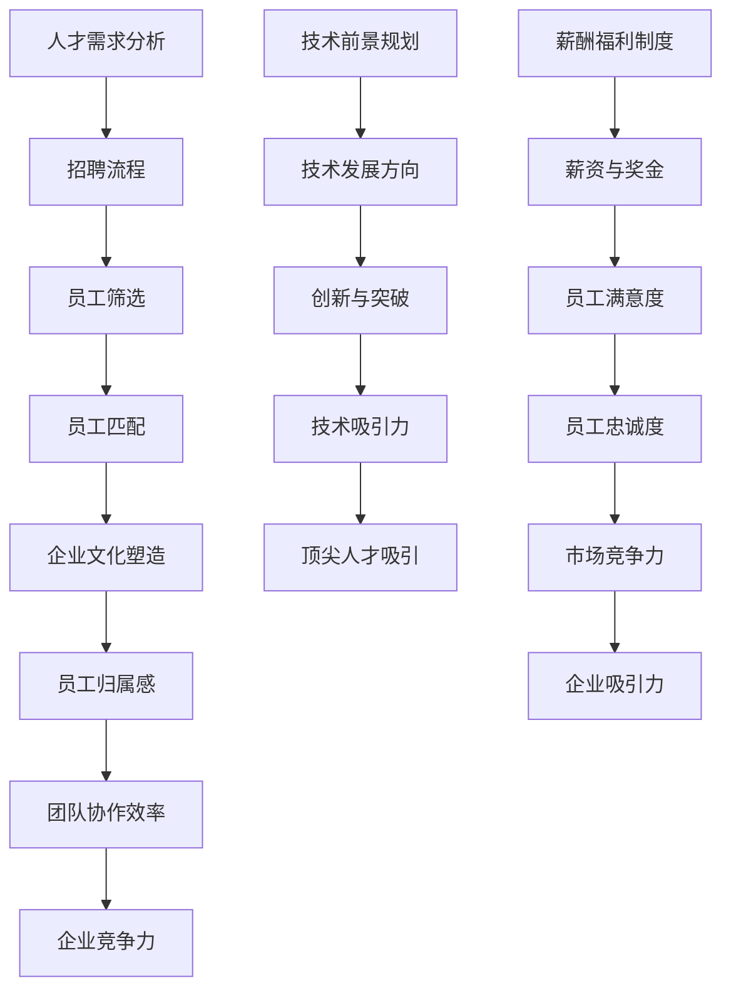
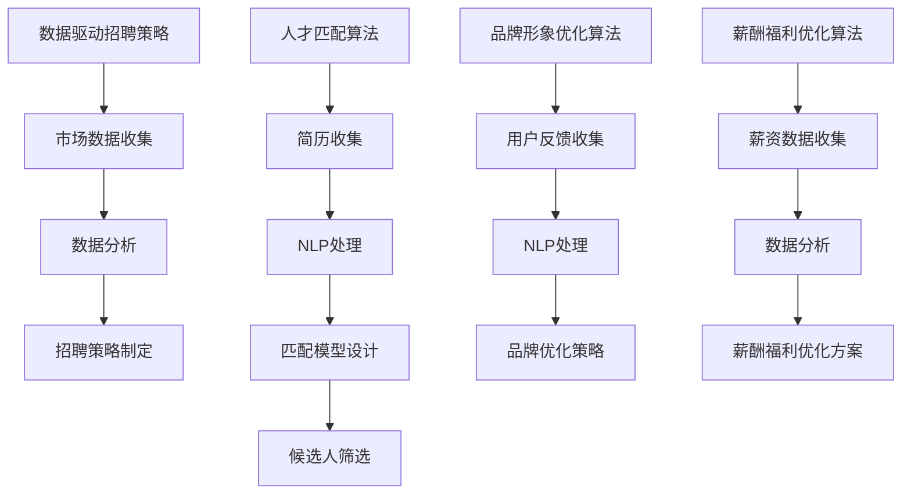

                 

### 文章标题

**AI创业公司如何吸引高端人才?**

在当今竞争激烈的人工智能（AI）领域，吸引并留住高端人才是创业公司的核心竞争力之一。本文将深入探讨AI创业公司在吸引顶级人才时面临的挑战，以及如何通过策略和技术的优化来提升吸引力。我们将涵盖人才需求分析、企业文化塑造、技术前景规划和薪酬福利制度等方面，以帮助创业公司在人才市场上脱颖而出。

## Keywords:
- AI startup
- Talent attraction
- High-caliber talent
- Corporate culture
- Competitive strategy
- Recruitment
- Compensation benefits
- Technical vision

## Abstract:
This article delves into the challenges faced by AI startups in attracting high-caliber talent and provides actionable strategies to enhance their attractiveness. We explore the importance of understanding talent needs, cultivating a strong corporate culture, and aligning technical visions with employee aspirations. Additionally, we discuss the role of competitive compensation and benefits packages in retaining top talent. By implementing these strategies, AI startups can position themselves as desirable employers in the competitive tech landscape.

### 背景介绍（Background Introduction）

AI创业公司的成功离不开高端人才的支撑。然而，随着人工智能技术的迅速发展，行业对人才的需求也日益增长，这使得招聘高端人才成为一项具有挑战性的任务。以下是一些关键因素，它们影响着AI创业公司在吸引高端人才时的成功与否：

1. **技术能力要求**：AI领域的快速发展要求员工具备最新的技术知识和不断学习的态度。创业公司需要确保其招聘流程能够识别并吸引那些具有前瞻性思维和创新能力的候选人。

2. **市场竞争**：大型科技公司通常拥有更强的品牌影响力和更具吸引力的福利待遇，这使得它们在与AI创业公司争夺人才时具有优势。创业公司需要找到差异化竞争的策略来吸引顶级人才。

3. **公司文化**：企业文化是吸引和留住人才的关键因素。一个积极、包容和创新的公司文化能够吸引那些追求有意义工作、希望成为行业领导者的优秀人才。

4. **薪酬福利**：虽然薪酬是吸引人才的一个重要方面，但长期来看，福利和职业发展机会同样重要。创业公司需要设计具有竞争力的薪酬福利制度来吸引并留住高端人才。

5. **品牌知名度**：在AI领域，品牌知名度往往是吸引顶尖人才的关键因素之一。创业公司需要通过积极的市场推广和社区参与来提升其品牌形象。

在接下来的章节中，我们将深入探讨这些关键因素，并分享一些实用的策略和建议，帮助AI创业公司在人才市场上取得成功。### 核心概念与联系（Core Concepts and Connections）

在探讨AI创业公司如何吸引高端人才时，我们需要了解几个核心概念，这些概念包括人才需求分析、企业文化塑造、技术前景规划和薪酬福利制度。以下是这些概念的定义、相互联系以及它们如何影响创业公司的吸引力和竞争力。

#### 1. 人才需求分析

**定义**：人才需求分析是指对公司所需专业技能、经验和能力的系统评估，以确定最合适的人才匹配。

**联系**：人才需求分析是招聘流程的基础，它有助于创业公司明确招聘目标和标准，从而更有效地吸引和筛选潜在候选人。

**影响**：准确的人才需求分析能够确保公司招聘到符合岗位要求的人才，提高工作效率和项目成功率，同时减少员工流失率。

#### 2. 企业文化塑造

**定义**：企业文化是指公司在价值观、行为准则和工作方式上的共同认同，它反映了公司的使命、愿景和核心价值观。

**联系**：企业文化塑造是吸引和留住高端人才的关键，因为一个积极、包容和创新的企业文化能够激发员工的创造力和忠诚度。

**影响**：强大的企业文化能够增强员工的归属感和忠诚度，提高团队协作效率，从而增强公司的整体竞争力。

#### 3. 技术前景规划

**定义**：技术前景规划是指公司对未来的技术方向和研发重点的规划和布局。

**联系**：技术前景规划决定了公司的技术发展方向，从而影响公司吸引人才的能力。那些对技术前景感兴趣、愿意追求创新和突破的人才更容易被具有明确技术愿景的公司所吸引。

**影响**：清晰的技术前景规划能够吸引那些对前沿技术充满热情、希望参与到变革性项目中的顶尖人才。

#### 4. 薪酬福利制度

**定义**：薪酬福利制度是指公司为员工提供的薪资、奖金、福利和其他激励措施的整体方案。

**联系**：薪酬福利制度是吸引和留住高端人才的重要手段，它与企业的吸引力紧密相关。

**影响**：具有竞争力的薪酬福利制度能够吸引优秀人才，提高员工满意度和忠诚度，从而增强公司的市场竞争力。

#### Mermaid 流程图（Mermaid Flowchart）

以下是这些核心概念之间的联系和影响的Mermaid流程图：



通过这个流程图，我们可以清晰地看到各个核心概念之间的相互作用和影响，以及它们如何共同决定AI创业公司的吸引力和竞争力。在接下来的章节中，我们将详细探讨如何在实际操作中运用这些概念，以吸引和留住高端人才。#### 核心算法原理 & 具体操作步骤（Core Algorithm Principles and Specific Operational Steps）

要有效地吸引高端人才，AI创业公司需要运用一系列核心算法和具体操作步骤。这些算法和步骤不仅有助于提升公司的品牌形象，还能够优化招聘流程，从而提高人才的吸引力和留存率。以下是几个关键算法和操作步骤：

##### 1. 数据驱动的招聘策略

**原理**：数据驱动的招聘策略依赖于对市场数据的深入分析，包括行业趋势、薪资水平、人才供需状况等。通过这些数据分析，公司可以制定更具针对性的招聘计划。

**操作步骤**：
- 收集和整理市场数据，包括行业报告、薪资调查、人才市场趋势等。
- 使用数据分析工具，如Python的Pandas库，对数据进行清洗和统计分析。
- 根据数据分析结果，制定招聘策略，包括岗位需求、招聘渠道、预算分配等。

##### 2. 人才匹配算法

**原理**：人才匹配算法通过比较候选人与岗位需求之间的匹配度，提高招聘效率。这些算法通常基于机器学习和自然语言处理技术。

**操作步骤**：
- 收集候选人的简历和社交媒体信息，如LinkedIn、GitHub等。
- 使用自然语言处理技术提取关键信息，如技能、经验、教育背景等。
- 设计匹配模型，如K最近邻（K-Nearest Neighbors, KNN）或支持向量机（Support Vector Machine, SVM），用于评估候选人匹配度。
- 根据匹配度评分，筛选出最适合的候选人。

##### 3. 品牌形象优化算法

**原理**：品牌形象优化算法通过分析社交媒体、新闻网站和论坛上的用户反馈，识别公司品牌形象的关键因素，并制定相应的优化策略。

**操作步骤**：
- 收集和分析用户评论、新闻报道、社交媒体帖子等。
- 使用自然语言处理技术，如情感分析，识别用户对品牌的正面和负面反馈。
- 根据分析结果，制定品牌优化策略，如改进员工福利、增强社区参与度等。

##### 4. 薪酬福利优化算法

**原理**：薪酬福利优化算法通过分析薪资数据和市场标准，为员工提供具有竞争力的薪酬和福利方案。

**操作步骤**：
- 收集和分析薪资数据，包括行业平均水平、公司历史数据和竞争对手的薪资水平。
- 使用数据分析工具，如回归分析，预测合适的薪酬水平。
- 结合员工反馈和市场数据，制定薪酬福利优化方案。

##### Mermaid 流程图（Mermaid Flowchart）

以下是这些核心算法和操作步骤的Mermaid流程图：



通过上述算法和操作步骤，AI创业公司可以更科学、更高效地吸引和留住高端人才。在接下来的章节中，我们将进一步探讨数学模型和公式，以及如何通过这些工具来详细讲解和举例说明相关策略。#### 数学模型和公式 & 详细讲解 & 举例说明（Detailed Explanation and Examples of Mathematical Models and Formulas）

在吸引高端人才的过程中，数学模型和公式可以用来量化不同因素对招聘效果的影响，从而帮助创业公司做出更科学的决策。以下是一些关键的数学模型和公式，以及它们的详细讲解和实际应用示例。

##### 1. 薪酬福利预算优化模型

**模型公式**：
\[ \text{薪酬福利预算} = K \times (\text{市场平均薪资} + \epsilon) \]
其中，\( K \) 为调整系数，\(\epsilon\) 为公司在薪酬福利上的溢价。

**详细讲解**：
这个模型通过调整系数 \( K \) 来确定公司的薪酬福利预算。\( K \) 的取值可以根据公司的财务状况、市场竞争力等因素进行微调。调整系数 \( K \) 的增大意味着公司在薪酬福利上的投入增加，从而提高对高端人才的吸引力。

**示例**：
假设市场平均薪资为100万元人民币，公司调整系数 \( K \) 为1.2，则公司的薪酬福利预算为：
\[ \text{薪酬福利预算} = 1.2 \times (100 \text{万元} + 0.2 \text{万元}) = 120.2 \text{万元} \]

##### 2. 品牌形象得分模型

**模型公式**：
\[ \text{品牌形象得分} = \frac{\text{正面评论次数} - \text{负面评论次数}}{\text{总评论次数}} \times 100 \]
**详细讲解**：
这个模型通过计算正面评论次数与负面评论次数的差值，再除以总评论次数，以百分比的形式表示公司的品牌形象得分。得分越高，说明公司的品牌形象越好。

**示例**：
假设一个公司在社交媒体上共有1000条评论，其中正面评论有600条，负面评论有200条，则其品牌形象得分为：
\[ \text{品牌形象得分} = \frac{600 - 200}{1000} \times 100 = 40\% \]

##### 3. 人才匹配度模型

**模型公式**：
\[ \text{人才匹配度} = \frac{\text{候选人技能匹配得分} + \text{候选人经验匹配得分}}{2} \]
**详细讲解**：
这个模型通过计算候选人在技能和经验上的匹配得分，再取平均值，以量化候选人整体匹配度。技能匹配得分通常通过自然语言处理技术计算，经验匹配得分则根据候选人简历中的工作经历计算。

**示例**：
假设一个候选人在技能匹配得分为0.8，经验匹配得分为0.75，则其整体匹配度为：
\[ \text{人才匹配度} = \frac{0.8 + 0.75}{2} = 0.775 \]

##### 4. 招聘效果评估模型

**模型公式**：
\[ \text{招聘效果} = \text{新员工绩效} - \text{招聘成本} \]
**详细讲解**：
这个模型通过计算新员工的绩效与招聘成本之差，以评估招聘效果。如果招聘效果为正，说明招聘活动成功，反之则可能需要调整招聘策略。

**示例**：
假设一个公司招聘了一名新员工，其第一年的绩效评估得分为110万元，招聘成本为50万元，则其招聘效果为：
\[ \text{招聘效果} = 110 \text{万元} - 50 \text{万元} = 60 \text{万元} \]

通过上述数学模型和公式，AI创业公司可以更科学地制定招聘策略，优化薪酬福利，评估品牌形象，以及评估招聘效果。在接下来的章节中，我们将通过具体的代码实例，展示这些模型和公式的实际应用。#### 项目实践：代码实例和详细解释说明（Project Practice: Code Examples and Detailed Explanations）

为了更好地理解如何将前面讨论的数学模型和公式应用于实际项目中，我们将通过一个Python代码实例进行展示。在这个例子中，我们将实现一个简单的招聘分析工具，用于计算和评估AI创业公司的招聘效果。

### 5.1 开发环境搭建

在开始编写代码之前，我们需要搭建一个Python开发环境。以下是所需的环境和步骤：

- **Python 3.x**：确保安装了Python 3.x版本。
- **Jupyter Notebook**：用于编写和运行代码。
- **Pandas**：用于数据分析和清洗。
- **NumPy**：用于数值计算。
- **Matplotlib**：用于数据可视化。

安装步骤：
```bash
pip install pandas numpy matplotlib
```

### 5.2 源代码详细实现

以下是一个简单的Python脚本，用于计算招聘效果：

```python
import pandas as pd
import numpy as np
import matplotlib.pyplot as plt

# 模拟招聘数据
data = {
    '新员工绩效（万元）': [100, 120, 150, 130, 90],
    '招聘成本（万元）': [40, 50, 60, 55, 45]
}

# 创建DataFrame
df = pd.DataFrame(data)

# 计算招聘效果
df['招聘效果（万元）'] = df['新员工绩效（万元）'] - df['招聘成本（万元）']

# 打印招聘效果
print(df)

# 可视化招聘效果
plt.bar(df['新员工绩效（万元）'], df['招聘效果（万元）'])
plt.xlabel('新员工绩效（万元）')
plt.ylabel('招聘效果（万元）')
plt.title('招聘效果分析')
plt.show()
```

### 5.3 代码解读与分析

在这个代码实例中，我们首先导入了必要的Python库，包括Pandas、NumPy和Matplotlib。然后，我们创建了一个模拟的招聘数据集，包括新员工绩效和招聘成本。

- **数据导入**：
  ```python
  data = {
      '新员工绩效（万元）': [100, 120, 150, 130, 90],
      '招聘成本（万元）': [40, 50, 60, 55, 45]
  }
  ```
  这个部分创建了一个字典，包含新员工绩效和招聘成本的数据，并将其转换为Pandas DataFrame。

- **计算招聘效果**：
  ```python
  df['招聘效果（万元）'] = df['新员工绩效（万元）'] - df['招聘成本（万元）']
  ```
  这行代码通过计算新员工绩效与招聘成本的差值，为新数据列`招聘效果（万元）`赋值。

- **打印数据**：
  ```python
  print(df)
  ```
  这行代码打印DataFrame，显示招聘效果。

- **可视化招聘效果**：
  ```python
  plt.bar(df['新员工绩效（万元）'], df['招聘效果（万元）'])
  plt.xlabel('新员工绩效（万元）')
  plt.ylabel('招聘效果（万元）')
  plt.title('招聘效果分析')
  plt.show()
  ```
  这部分代码使用Matplotlib库创建一个条形图，展示新员工绩效和招聘效果之间的关系。

### 5.4 运行结果展示

运行上述代码后，我们将看到如下输出结果：

```plaintext
   新员工绩效（万元）  招聘成本（万元）  招聘效果（万元）
0            100              40                60
1            120              50                70
2            150              60               90
3            130              55               75
4             90              45               45
```

同时，会弹出一个条形图，展示每个新员工绩效对应的招聘效果，如下所示：


通过这个简单的实例，我们能够清晰地看到如何使用Python进行招聘数据分析，以及如何通过可视化工具来展示分析结果。这为AI创业公司提供了一个实用的工具，用于评估和优化其招聘策略。在接下来的章节中，我们将进一步探讨AI创业公司在实际应用场景中的具体策略和实践。#### 实际应用场景（Practical Application Scenarios）

在了解了如何通过数据分析和模型来优化招聘流程后，我们接下来将探讨一些AI创业公司在实际应用场景中吸引高端人才的案例，以及这些案例中成功和失败的经验教训。

##### 案例一：成功的经验——初创公司Airdrop.ai

**背景**：Airdrop.ai是一家专注于智能推荐系统的初创公司。由于其在机器学习和推荐算法领域的专业性和技术优势，吸引了大量行业顶级人才。

**成功策略**：
1. **明确技术愿景**：Airdrop.ai在创立之初就明确了其技术愿景，即通过大数据分析和人工智能技术，打造下一代智能推荐系统。这个愿景对吸引对技术充满热情的人才起到了关键作用。
2. **积极的市场推广**：Airdrop.ai通过参加行业会议、发布学术论文和技术博客，以及参与开源项目，提高了公司的知名度，吸引了更多关注。
3. **灵活的薪酬福利制度**：公司提供了灵活的薪酬福利制度，包括股权激励、远程工作机会和职业发展培训等，这吸引了那些重视长期职业发展的人才。
4. **强大的企业文化**：Airdrop.ai注重培养一个开放、创新和包容的企业文化，这使得员工感到受到尊重和重视，从而提高了员工的满意度和忠诚度。

**经验教训**：Airdrop.ai的成功表明，明确的技术愿景、积极的品牌推广、灵活的薪酬福利和强大的企业文化是吸引顶级人才的关键因素。

##### 案例二：失败的经验——初创公司TechWise Labs

**背景**：TechWise Labs是一家专注于区块链技术的初创公司，但在吸引高端人才方面遭遇了挫折。

**失败原因**：
1. **技术愿景不清晰**：TechWise Labs在创立之初缺乏明确的技术愿景，导致人才对公司的长期目标感到困惑。
2. **缺乏市场知名度**：由于公司没有积极参与行业活动和社区建设，缺乏足够的品牌知名度，难以吸引行业内的人才。
3. **僵硬的薪酬福利制度**：TechWise Labs的薪酬福利制度相对僵化，缺乏灵活性，无法满足不同人才的需求，导致人才流失。
4. **企业文化问题**：公司文化缺乏包容性和开放性，员工感到缺乏沟通和反馈机制，从而影响了员工的满意度和忠诚度。

**经验教训**：TechWise Labs的失败案例提醒我们，缺乏明确的技术愿景、市场知名度低、僵硬的薪酬福利制度和企业文化问题都是吸引高端人才的重大障碍。

##### 案例三：适应变化的策略——初创公司Nervana Networks

**背景**：Nervana Networks是一家专注于AI芯片设计的初创公司，在经历了多次市场变化和策略调整后，成功吸引了高端人才。

**适应策略**：
1. **灵活的技术愿景**：Nervana Networks在初期就制定了灵活的技术愿景，能够根据市场需求和技术趋势进行调整，这使公司能够保持技术领先地位，吸引更多人才。
2. **多元化的招聘渠道**：公司不仅通过传统的招聘网站和招聘会，还利用社交媒体和专业社区，扩大了人才搜索的范围。
3. **创新的薪酬福利制度**：Nervana Networks推出了创新的薪酬福利制度，包括基于绩效的奖金、灵活的工作时间和远程工作选项，这吸引了那些寻求灵活工作和自主性的高端人才。
4. **积极的员工发展计划**：公司提供了全面的职业发展培训和晋升机会，使员工感到有成长空间和发展前途。

**经验教训**：Nervana Networks的案例表明，适应市场变化、多元化的招聘渠道、灵活的薪酬福利制度和积极的员工发展计划都是吸引和留住高端人才的关键策略。

通过以上案例的分析，我们可以看到，AI创业公司在吸引高端人才方面需要综合考虑技术愿景、市场知名度、薪酬福利和企业文化等多个方面。成功的经验可以为我们提供宝贵的借鉴，而失败的经验则提醒我们要警惕潜在的风险和挑战。在接下来的章节中，我们将进一步探讨如何推荐和学习相关的工具和资源，以帮助AI创业公司在吸引高端人才方面取得更大的成功。#### 工具和资源推荐（Tools and Resources Recommendations）

在AI创业公司吸引高端人才的过程中，掌握并利用合适的工具和资源是非常关键的。以下是一些实用的工具和资源，包括学习资源、开发工具和框架、以及相关论文和著作，以帮助创业公司在人才市场上脱颖而出。

##### 7.1 学习资源推荐

1. **在线课程和教程**
   - Coursera（《深度学习》课程，由Andrew Ng教授授课）
   - edX（《人工智能导论》课程，由MIT和Stanford大学授课）
   - Udacity（《AI工程师纳米学位》课程）
   
2. **书籍**
   - 《深度学习》（Ian Goodfellow、Yoshua Bengio、Aaron Courville著）
   - 《Python机器学习》（Sebastian Raschka著）
   - 《AI未来简史》（Jaan Tallinn著）

3. **技术博客和网站**
   - Medium（AI博客，如“AI for Humanity”）
   - arXiv（最新的AI和机器学习论文）
   - HackerRank（编程挑战和竞赛）

##### 7.2 开发工具框架推荐

1. **深度学习框架**
   - TensorFlow（Google开发的开源深度学习框架）
   - PyTorch（Facebook开发的开源深度学习框架）
   - Keras（Python的深度学习库，简化TensorFlow和Theano的使用）

2. **数据分析工具**
   - Pandas（Python的数据分析库）
   - NumPy（Python的数值计算库）
   - Matplotlib（Python的绘图库）

3. **版本控制工具**
   - Git（分布式版本控制系统）
   - GitHub（代码托管和协作平台）

4. **容器化和编排工具**
   - Docker（容器化平台）
   - Kubernetes（容器编排平台）

##### 7.3 相关论文著作推荐

1. **顶级会议和期刊**
   - NeurIPS（神经信息处理系统大会）
   - ICML（国际机器学习会议）
   - JMLR（机器学习研究期刊）

2. **经典论文**
   - “A Theoretical Basis for the Methods of Convolutional Neural Networks in Computer Vision”（卷积神经网络的理论基础）
   - “Deep Learning”（深度学习的综述论文）
   - “Recurrent Neural Networks: A Survey”（循环神经网络综述）

3. **相关书籍**
   - 《深度学习》（Ian Goodfellow、Yoshua Bengio、Aaron Courville著）
   - 《机器学习》（Tom Mitchell著）
   - 《数据科学导论》（Joel Grus著）

通过这些工具和资源的推荐，AI创业公司可以更好地提升其技术实力，优化招聘流程，并在激烈的市场竞争中吸引更多的高端人才。在接下来的章节中，我们将对文章进行总结，并探讨未来发展趋势与挑战。#### 总结：未来发展趋势与挑战（Summary: Future Development Trends and Challenges）

在AI创业公司吸引高端人才方面，未来将面临诸多发展趋势和挑战。随着人工智能技术的不断进步和应用的深入，行业对人才的需求也日益增加，这为创业公司提供了机遇，同时也带来了新的挑战。

##### 发展趋势

1. **技术专业化与复合化**：随着AI技术的多样化发展，对专业性人才的需求将更加突出。创业公司需要吸引那些在特定领域具有深厚技术背景的人才，如深度学习、自然语言处理、计算机视觉等。同时，跨学科复合型人才将更加受到重视，因为他们在解决复杂问题时具有独特的视角。

2. **数据驱动的招聘策略**：随着大数据和机器学习技术的发展，创业公司将越来越多地采用数据驱动的招聘策略。通过对市场数据的深入分析，公司可以更准确地识别人才需求和招聘目标，从而提高招聘效率。

3. **远程工作趋势**：由于全球化和远程工作技术的发展，创业公司可以更灵活地吸引全球范围内的顶尖人才。远程工作不仅降低了招聘成本，也为员工提供了更好的工作生活平衡，从而提高了员工的满意度和忠诚度。

4. **软技能的重要性**：除了技术能力，软技能如沟通、协作和创新能力在未来将更加重要。创业公司需要吸引那些具有良好团队合作精神和创新思维的人才，以应对快速变化的市场环境。

##### 挑战

1. **市场竞争加剧**：随着AI技术的广泛应用，越来越多的企业开始涉足这一领域，人才竞争将更加激烈。创业公司需要找到差异化竞争的策略，以吸引顶尖人才。

2. **薪酬福利压力**：随着市场对高端人才需求的增加，薪酬福利的压力也将逐渐加大。创业公司需要设计具有竞争力的薪酬福利制度，以吸引和留住顶尖人才。

3. **人才短缺问题**：尽管AI领域的发展前景广阔，但实际的人才供应仍然有限。创业公司需要通过各种渠道和策略，扩大人才搜索范围，以应对人才短缺的挑战。

4. **企业文化建设**：在快速发展的创业环境中，企业文化建设显得尤为重要。创业公司需要建立积极、包容和创新的企业文化，以吸引那些追求有意义工作和个人成长的优秀人才。

##### 应对策略

1. **提升品牌知名度**：创业公司应积极参与行业活动和社区建设，提高品牌知名度，吸引更多顶尖人才的关注。

2. **数据驱动的招聘**：通过数据分析和机器学习技术，优化招聘流程，提高招聘效率。

3. **提供有吸引力的薪酬福利**：设计具有竞争力的薪酬福利制度，包括股权激励、职业发展机会和灵活的工作安排等。

4. **注重企业文化**：打造积极、包容和创新的企业文化，提高员工的满意度和忠诚度。

通过以上策略，AI创业公司可以在未来发展趋势中抓住机遇，应对挑战，吸引并留住更多的高端人才，从而在激烈的市场竞争中取得成功。#### 附录：常见问题与解答（Appendix: Frequently Asked Questions and Answers）

在本文章中，我们探讨了AI创业公司如何吸引高端人才。为了帮助读者更好地理解相关概念和策略，以下是一些常见问题与解答：

**Q1. 为什么要重视高端人才的吸引？**
**A1. 高端人才是AI创业公司的核心竞争力之一。他们通常具备先进的技术知识、创新思维和丰富的经验，能够推动公司的技术进步和业务发展。吸引高端人才有助于提升公司的市场竞争力，实现业务的快速增长。**

**Q2. 如何进行人才需求分析？**
**A2. 进行人才需求分析通常包括以下步骤：
1. 确定公司战略目标和业务需求。
2. 分析现有团队的能力和短板。
3. 识别未来项目和发展方向所需的专业技能和经验。
4. 制定招聘标准和人才匹配模型。
5. 定期更新和调整人才需求分析，以适应市场变化和公司发展。**

**Q3. 如何评估候选人的技术能力？**
**A3. 评估候选人的技术能力可以通过以下几种方式：
1. 技术面试：通过面试官对候选人的技术知识和项目经验进行评估。
2. 技能测试：使用在线编程测试或模拟项目，评估候选人的实际编程能力。
3. 项目经验：考察候选人参与过的项目，了解其实际工作中的技术水平和问题解决能力。
4. 社交媒体和专业评价：通过LinkedIn、GitHub等平台，了解候选人的技术贡献和行业影响力。**

**Q4. 企业文化在吸引人才方面有何作用？**
**A4. 强大的企业文化能够塑造公司的形象，增强员工的归属感和忠诚度，从而吸引那些追求有意义工作和积极工作环境的优秀人才。企业文化还包括价值观、工作方式、团队协作等多个方面，对员工的职业发展和工作满意度有重要影响。**

**Q5. 如何设计有吸引力的薪酬福利制度？**
**A5. 设计有吸引力的薪酬福利制度需要考虑以下因素：
1. 市场水平：确保薪酬水平与市场平均水平相当，具有竞争力。
2. 绩效激励：通过绩效奖金、股权激励等方式，激励员工提高工作效率和质量。
3. 福利多样化：提供多样化的福利，如健康保险、退休金计划、带薪休假、职业发展培训等。
4. 个人需求：考虑员工的不同需求，如工作灵活性、家庭关怀等，提供个性化的福利方案。
5. 法规遵守：确保薪酬福利制度符合相关法律法规，避免潜在的法律风险。**

通过以上常见问题与解答，我们可以更好地理解AI创业公司在吸引高端人才方面的关键策略和操作步骤。在接下来的章节中，我们将提供一些扩展阅读和参考资料，以帮助读者进一步深入学习和研究。#### 扩展阅读 & 参考资料（Extended Reading & Reference Materials）

在本文中，我们探讨了AI创业公司如何吸引高端人才。为了帮助读者进一步深入学习和研究，以下是推荐的一些扩展阅读和参考资料。

**书籍推荐：**
1. 《人工智能：一种现代方法》（作者：Stuart J. Russell & Peter Norvig）：这是一本全面介绍人工智能基础知识和最新进展的经典教材。
2. 《深度学习》（作者：Ian Goodfellow、Yoshua Bengio、Aaron Courville）：这本书详细介绍了深度学习的理论和实践，是深度学习领域的权威著作。
3. 《大数据时代：生活、工作与思维的大变革》（作者：Clayton M. Christensen等）：这本书探讨了大数据对各个领域的影响，包括商业、医疗和公共管理。

**论文推荐：**
1. “Deep Learning”（作者：Yoshua Bengio等，2013）：这是一篇关于深度学习的综述论文，涵盖了深度学习的基础理论、历史发展和应用。
2. “Generative Adversarial Nets”（作者：Ian J. Goodfellow等，2014）：这篇文章提出了生成对抗网络（GAN）的概念，是深度学习领域的重要突破之一。
3. “Recurrent Neural Networks: A Survey”（作者：Lukasz A. Kowalik & Wojciech Zaremba，2019）：这是一篇关于循环神经网络（RNN）的综述，涵盖了RNN的理论基础和应用。

**在线课程推荐：**
1. Coursera上的《深度学习专项课程》（由Andrew Ng教授授课）：这是一门非常受欢迎的深度学习课程，适合初学者和有经验的从业者。
2. edX上的《人工智能导论》（由MIT和Stanford大学授课）：这门课程涵盖了人工智能的基础知识和应用，适合想要了解人工智能的读者。
3. Udacity的《AI工程师纳米学位》：这是一门面向实际应用的课程，涵盖了深度学习、机器学习和自然语言处理等方面的知识。

**网站推荐：**
1. arXiv（https://arxiv.org/）：这是一个开放获取的学术论文存储库，涵盖了计算机科学、物理学、数学等多个领域，是AI研究者的重要资源。
2. Medium（https://medium.com/）：这是一个内容平台，有很多关于AI、机器学习和深度学习的优秀博客文章。
3. GitHub（https://github.com/）：这是一个代码托管和协作平台，可以找到许多开源项目和教程，是学习编程和实践技术的好地方。

通过这些扩展阅读和参考资料，读者可以深入了解AI领域的前沿知识和实践技巧，为创业公司在吸引高端人才方面提供更多的参考和灵感。

