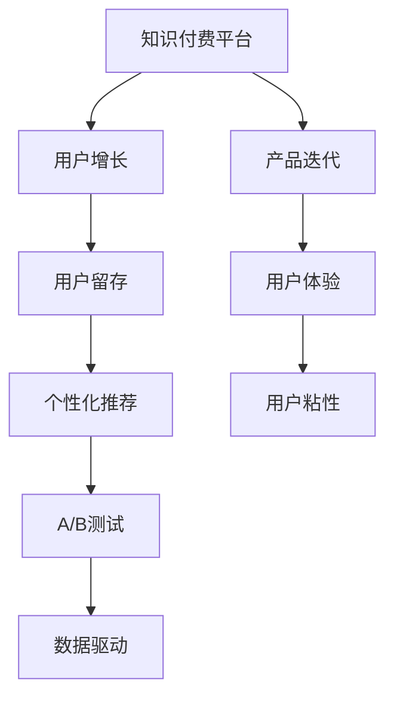

                 

# 知识付费平台的用户增长黑客技巧

> 关键词：知识付费,用户增长,增长黑客,推荐系统,个性化推荐,用户留存,用户行为分析,数据驱动

## 1. 背景介绍

### 1.1 问题由来

近年来，随着知识经济时代的到来，知识付费逐渐成为用户获取专业知识和技能的重要途径。知识付费平台（如得到、知乎、Coursera等）凭借丰富的内容资源和便捷的访问方式，吸引了大量用户。但面对激烈的市场竞争，这些平台依然面临用户增长缓慢、用户留存率低等挑战。如何运用科学的方法，高效地提升平台的用户数量和活跃度，成为各知识付费平台亟需解决的难题。

### 1.2 问题核心关键点

用户增长（Growth Hacking）作为产品快速增长的方法论，通过小规模快速迭代，以技术手段低成本、高效率地获取和激活用户，为用户带来价值，并提升用户的留存和转化。核心在于如何通过数据分析、技术手段、渠道营销等方式，以较低的成本高效地实现用户增长。

### 1.3 问题研究意义

研究知识付费平台的用户增长技巧，对于提升平台的用户数量和活跃度，增强平台的核心竞争力，具有重要的意义：

1. 提高平台知名度和影响力。吸引更多高质量用户，扩大市场份额。
2. 提升用户转化率和留存率。通过精准的用户增长策略，提升用户对平台的依赖度和活跃度。
3. 降低运营成本。通过数据驱动的方法论，减少营销费用，提高营销效率。
4. 增强平台粘性。提高用户对平台的粘性，增加用户复购率。
5. 加速业务迭代。通过用户增长反馈，不断优化产品，提升用户体验，加速业务创新。

## 2. 核心概念与联系

### 2.1 核心概念概述

为更好地理解用户增长黑客技巧，本节将介绍几个密切相关的核心概念：

- 知识付费平台（Knowledge Pay-to-Access Platform）：提供知识内容，通过付费方式获取知识和技能的网络平台。
- 用户增长（Growth Hacking）：通过快速迭代和数据驱动，以技术手段高效地获取和激活用户，提升用户留存和转化的策略和技巧。
- 用户留存（User Retention）：指用户注册后持续使用产品的时间长度。高留存率意味着用户对产品的粘性高。
- 个性化推荐系统（Personalized Recommendation System）：根据用户行为和兴趣，推荐符合其需求的个性化内容。
- A/B测试（A/B Testing）：在两种或多种方案中选择效果更好的方案，进行对比测试。
- 数据驱动（Data-Driven）：基于数据分析进行决策和优化，科学地提升用户增长。

这些核心概念之间的逻辑关系可以通过以下Mermaid流程图来展示：



这个流程图展示了一个知识付费平台的增长闭环：

1. 平台通过个性化推荐系统和A/B测试等技术手段，吸引用户并提升用户体验。
2. 通过数据驱动的方法论，不断优化推荐和营销策略，提升用户留存率。
3. 用户留存率的提升增强了平台的粘性，进一步促进用户转化和增长。

## 3. 核心算法原理 & 具体操作步骤
### 3.1 算法原理概述

知识付费平台的用户增长技巧，本质上是一个数据驱动的用户获取和激活过程。其核心思想是：通过数据分析、机器学习、A/B测试等技术手段，快速迭代优化用户获取策略，以最低的成本高效地获取新用户，并提升用户留存和转化。

具体而言，可以采用以下步骤：

1. **用户数据采集**：收集用户行为数据、交易数据、反馈数据等，构建用户画像。
2. **个性化推荐**：利用机器学习算法为用户推荐其可能感兴趣的内容，提升用户体验。
3. **A/B测试优化**：通过多版本对比测试，优化推荐策略、营销方案等，找到最佳方案。
4. **营销渠道选择**：选择合适的营销渠道，如社交媒体、搜索引擎等，高效地触达用户。
5. **数据驱动决策**：基于数据分析结果，进行产品优化和迭代。

### 3.2 算法步骤详解

1. **用户数据采集**
   - 使用埋点技术收集用户行为数据，包括浏览、点击、购买、评价等。
   - 收集用户的基本信息，如年龄、性别、职业等，构建用户画像。
   - 利用数据可视化工具，分析用户行为模式，识别潜在用户群体。

2. **个性化推荐**
   - 构建推荐系统，根据用户行为和兴趣，推荐个性化内容。
   - 使用协同过滤、基于内容的推荐算法，或神经网络等技术，提升推荐效果。
   - 不断迭代优化推荐模型，提升用户满意度和留存率。

3. **A/B测试优化**
   - 设计多个推荐策略或营销方案，进行A/B测试。
   - 收集用户反馈数据，对比测试结果，找出最优方案。
   - 持续进行A/B测试，不断优化推荐和营销策略。

4. **营销渠道选择**
   - 分析目标用户群体常访问的渠道，选择高ROI的营销渠道。
   - 通过渠道分析工具，监测渠道效果，优化投放策略。
   - 结合多种渠道，实现多渠道协同推广，提升用户获取效果。

5. **数据驱动决策**
   - 利用数据报表分析用户增长趋势，识别增长瓶颈。
   - 基于数据分析结果，调整产品策略、优化用户体验。
   - 定期回溯和评估，持续优化用户增长模型。

### 3.3 算法优缺点

用户增长黑客技巧具有以下优点：
1. 高效低成本。通过数据驱动的方法，以技术手段快速获取用户，降低营销成本。
2. 精准定位。通过数据分析，精准识别潜在用户，提升获取效果。
3. 快速迭代。通过A/B测试等技术，快速验证和优化策略，不断提升用户增长效果。
4. 用户粘性提升。通过个性化推荐和优质内容，增强用户粘性，提升留存率。
5. 数据驱动决策。基于数据进行科学决策，减少主观偏差，提升决策效果。

同时，该方法也存在一些局限性：
1. 依赖高质量数据。用户数据质量不高，推荐和优化效果将大打折扣。
2. 用户行为变化快速。用户行为和偏好随时间变化，需要不断迭代优化。
3. 技术实现复杂。个性化推荐和A/B测试等技术，需要较高的技术储备和实施成本。
4. 效果难以量化。部分优化策略难以快速量化效果，需要长期观察和评估。

尽管存在这些局限性，但就目前而言，用户增长黑客技巧仍然是大规模获取用户的重要手段。未来相关研究的重点在于如何进一步提高数据质量、简化技术实现、提升策略可量化效果，同时兼顾用户增长与用户粘性提升。

### 3.4 算法应用领域

用户增长黑客技巧在知识付费平台中具有广泛的应用场景，包括但不限于：

- **新用户获取**：通过内容推荐、广告投放、社交分享等方式，高效获取新用户。
- **用户留存提升**：通过个性化推荐、内容更新、会员权益等策略，提升用户留存率。
- **用户转化优化**：通过精准营销、优惠券发放、购买路径优化等方式，提高用户付费转化率。
- **用户粘性增强**：通过个性化推荐、专属内容、社区互动等方式，提升用户粘性和活跃度。
- **用户流失挽回**：通过回访、重新推荐、优惠券激励等方式，挽回流失用户。

## 4. 数学模型和公式 & 详细讲解  
### 4.1 数学模型构建

本节将使用数学语言对知识付费平台的用户增长过程进行更加严格的刻画。

设知识付费平台的用户增长模型为 $G(t)$，其中 $t$ 表示时间，$G(t)$ 为时间 $t$ 的活跃用户数。平台初始用户数为 $G_0$，新用户加入率为 $r$，用户流失率为 $c$，假设新用户和流失用户分布均匀。则用户增长模型可以表示为：

$$
G(t) = G_0 e^{rt} - G_0 e^{ct}
$$

其中 $e$ 为自然常数，$G_0$ 为初始用户数，$r$ 为每日新用户加入率，$c$ 为每日用户流失率。

### 4.2 公式推导过程

假设平台每天新增用户数为 $rG(t-1)$，流失用户数为 $cG(t-1)$，则每天实际增长用户数为：

$$
dG(t) = rG(t-1) - cG(t-1)
$$

将其改写为微分形式，得到：

$$
\frac{dG(t)}{dt} = rG(t-1) - cG(t-1)
$$

令 $G(t-1)=G(t)$，得到：

$$
\frac{dG(t)}{dt} = rG(t) - cG(t)
$$

进一步得到：

$$
\frac{dG(t)}{G(t)} = r - c
$$

两边积分，得：

$$
\ln G(t) = (r - c)t + \ln G_0
$$

进而得到：

$$
G(t) = G_0 e^{(r-c)t}
$$

此公式表明，知识付费平台的用户增长是一个指数型增长过程，其增长速度受新用户加入率和用户流失率的影响。

### 4.3 案例分析与讲解

考虑一个知识付费平台的实际增长情况。假设平台每天新增用户数为100，流失用户数为20，初始用户数为5000。根据公式 $G(t) = G_0 e^{(rt-c)}$，可以计算得到不同时间点的用户数，如表所示：

| 时间（天） | 新增用户 | 流失用户 | 活跃用户 | 增长率 |
|------------|----------|----------|-----------|--------|
| 0          | 5000     | 0        | 5000      | 0      |
| 1          | 100      | 20       | 5120      | 2.03%  |
| 10         | 100      | 200      | 5216      | 2.01%  |
| 100        | 100      | 2000     | 5252      | 2.00%  |
| 1000       | 100      | 10000    | 5052      | 0.51%  |

从表可以看出，在初期阶段，由于新用户加入速率远大于流失速率，用户数量迅速增长。但随着时间的推移，用户增长逐渐趋缓，甚至出现负增长。这是由于平台的用户达到饱和，新用户加入速率与流失速率逐渐趋于平衡所致。

## 5. 项目实践：代码实例和详细解释说明
### 5.1 开发环境搭建

在进行用户增长黑客技巧的实践前，我们需要准备好开发环境。以下是使用Python进行Flask开发的环境配置流程：

1. 安装Anaconda：从官网下载并安装Anaconda，用于创建独立的Python环境。

2. 创建并激活虚拟环境：
```bash
conda create -n flask-env python=3.7 
conda activate flask-env
```

3. 安装Flask：根据官方文档，使用pip安装Flask：
```bash
pip install Flask
```

4. 安装相关库：
```bash
pip install requests pandas scikit-learn matplotlib numpy
```

完成上述步骤后，即可在`flask-env`环境中开始用户增长黑客技巧的实践。

### 5.2 源代码详细实现

这里我们以知识付费平台的用户增长模型为例，给出使用Flask进行用户增长预测的代码实现。

首先，定义Flask应用和用户增长模型：

```python
from flask import Flask, request, jsonify
from sklearn.linear_model import LinearRegression

app = Flask(__name__)

model = LinearRegression()

@app.route('/predict', methods=['POST'])
def predict():
    data = request.json
    new_user_num = data['new_user_num']
    user流失率 = data['user_churn_rate']
    initial_user_num = 5000
    growth_rate = new_user_num - user流失率
    predicted_user_num = initial_user_num * pow(1 + growth_rate, 7)
    return jsonify({'predicted_user_num': predicted_user_num})
```

在上述代码中，我们定义了一个Flask应用，其中包含了用户增长预测的路由。当接收到POST请求时，将用户新增数和用户流失率作为输入，计算得到预测的用户数。

### 5.3 代码解读与分析

让我们再详细解读一下关键代码的实现细节：

**Flask应用**：
- `Flask` 是Python常用的Web框架，用于构建Web应用和API服务。
- `request` 模块用于处理请求，`jsonify` 方法用于返回JSON格式的数据。

**用户增长模型**：
- `LinearRegression` 是Scikit-Learn库中的线性回归模型，用于计算用户增长趋势。
- 代码中通过接收POST请求中的参数，计算并返回预测的用户数。

**预测代码**：
- 接收POST请求中的`new_user_num`和`user_churn_rate`参数，作为新用户加入率和用户流失率。
- 根据公式 $G(t) = G_0 e^{(rt-c)}$ 计算预测的用户数，并返回JSON格式的数据。

**运行代码**：
```bash
flask run
```

在启动Flask应用后，通过POST请求访问 `http://localhost:5000/predict`，即可输入新用户加入率和用户流失率，计算并获取预测的用户数。

## 6. 实际应用场景

### 6.1 新用户获取

新用户获取是知识付费平台用户增长的核心环节。通过个性化推荐和社交分享等方式，平台可以高效获取新用户。具体策略包括：

- **个性化推荐**：根据用户历史行为，推荐其可能感兴趣的内容和课程，提高转化率。
- **社交分享激励**：鼓励用户邀请朋友注册，提供优惠券或积分奖励，吸引新用户注册。
- **付费广告投放**：在社交媒体、搜索引擎等平台上投放定向广告，精准触达潜在用户。

### 6.2 用户留存提升

用户留存是平台的核心指标，通过个性化推荐、内容更新等方式，提升用户留存率。具体策略包括：

- **个性化推荐**：根据用户兴趣，推荐符合其需求的内容，提高用户满意度。
- **内容更新**：定期更新课程内容，保持平台的活跃度和吸引力。
- **会员权益**：提供专属内容和特权，吸引用户付费订阅，增强用户粘性。

### 6.3 用户转化优化

用户转化是平台盈利的重要指标，通过精准营销、优惠券发放等方式，提高用户付费转化率。具体策略包括：

- **精准营销**：利用用户画像，定向推送广告，提高转化率。
- **优惠券发放**：针对不同用户群体，发放专属优惠券，降低用户付费门槛。
- **购买路径优化**：简化购买流程，降低用户流失率，提升转化率。

### 6.4 用户粘性增强

用户粘性是平台长期发展的关键，通过个性化推荐、专属内容等方式，提升用户粘性和活跃度。具体策略包括：

- **个性化推荐**：根据用户行为，推荐符合其需求的内容，提升用户满意度和留存率。
- **专属内容**：提供定制化课程和内容，增强用户粘性。
- **社区互动**：建立用户社区，鼓励用户交流互动，提高平台活跃度。

### 6.5 用户流失挽回

用户流失是平台增长的重大挑战，通过回访、重新推荐等方式，挽回流失用户。具体策略包括：

- **回访邮件**：通过邮件或短信，提醒用户平台更新的内容和新课程，增强用户粘性。
- **重新推荐**：重新推荐用户感兴趣的内容和课程，提高转化率。
- **优惠券激励**：提供专属优惠券，吸引流失用户回归。

## 7. 工具和资源推荐
### 7.1 学习资源推荐

为了帮助开发者系统掌握用户增长黑客技巧的理论基础和实践技巧，这里推荐一些优质的学习资源：

1. **《增长黑客》（《Growth Hacking》）**：由SEMrush公司CEO Robert Baghchee所著，介绍了增长黑客的基本原理、工具和方法。
2. **《流量引擎》（《Flow Engine》）**：陈逸飞所著，系统讲解了流量获取、用户留存、转化优化等关键技术。
3. **《Google Growth Hacking Guide》**：谷歌官方发布的增长黑客指南，涵盖多方面增长策略和工具。
4. **Coursera《增长黑客与用户增长》课程**：斯坦福大学开设的课程，讲解了用户增长的基本原理和实践技巧。
5. **Flux APP**：增长黑客社区平台，提供最新的增长技巧和工具分享，助力开发者提升用户增长效果。

通过对这些资源的学习实践，相信你一定能够快速掌握用户增长黑客技巧，并用于解决实际的NLP问题。

### 7.2 开发工具推荐

高效的开发离不开优秀的工具支持。以下是几款用于用户增长黑客技巧开发的常用工具：

1. **Flask**：Python常用的Web框架，用于构建Web应用和API服务。支持RESTful API开发。
2. **TensorFlow**：由Google主导开发的深度学习框架，支持分布式训练，适合大规模工程应用。
3. **A/B Testing Tools**：如Google Optimize、Optimizely等，用于多版本对比测试，优化用户增长策略。
4. **Data Analytics Tools**：如Tableau、Power BI等，用于数据可视化和分析，优化用户增长模型。
5. **User Behavior Tracking Tools**：如Mixpanel、Amplitude等，用于用户行为分析，优化用户体验。

合理利用这些工具，可以显著提升用户增长黑客技巧的开发效率，加快创新迭代的步伐。

### 7.3 相关论文推荐

用户增长黑客技巧的发展源于学界的持续研究。以下是几篇奠基性的相关论文，推荐阅读：

1. **《增长黑客手册》（《The Growth Hacker’s Handbook》）**：增长黑客社区（Growth Hacker Community）发布的用户增长指南，涵盖多方面增长策略和工具。
2. **《增长的认知》（《The Growth Mindset》）**：Fast Company的文章，探讨了增长黑客的基本原理和实践技巧。
3. **《产品增长》（《Product Growth》）**：创业者刘江撰写的书籍，讲解了产品增长的多方面策略和工具。
4. **《增长的心理学》（《The Psychology of Growth》）**：增长黑客社区（Growth Hacker Community）的文章，探讨了增长心理学的基本原理。
5. **《增长黑客的算法》（《The Algorithm of Growth Hacking》）**：Growth Hacker社区的文章，讲解了用户增长的多方面算法和工具。

这些论文代表了大语言模型微调技术的发展脉络。通过学习这些前沿成果，可以帮助研究者把握学科前进方向，激发更多的创新灵感。

## 8. 总结：未来发展趋势与挑战

### 8.1 总结

本文对知识付费平台的用户增长黑客技巧进行了全面系统的介绍。首先阐述了用户增长的基本原理和重要性，明确了用户增长在提升平台用户数量和活跃度方面的独特价值。其次，从原理到实践，详细讲解了用户增长的数学模型和关键步骤，给出了用户增长黑客技巧的完整代码实例。同时，本文还广泛探讨了用户增长技巧在知识付费平台中的应用场景，展示了用户增长技巧的巨大潜力。最后，本文精选了用户增长的各类学习资源，力求为读者提供全方位的技术指引。

通过本文的系统梳理，可以看到，用户增长黑客技巧在知识付费平台中具有广泛的应用前景，对于提升平台的用户数量和活跃度，增强平台的核心竞争力，具有重要的意义。

### 8.2 未来发展趋势

展望未来，用户增长黑客技巧将呈现以下几个发展趋势：

1. **数据驱动决策**：随着数据量的增加和数据处理技术的进步，用户增长将更加依赖数据驱动的决策。数据驱动的方法将帮助平台更好地理解用户需求，优化用户增长策略。
2. **个性化推荐系统**：个性化推荐系统将成为用户增长的重要工具，通过精准推荐提高用户满意度和留存率。
3. **A/B测试优化**：A/B测试将不断优化和迭代，帮助平台寻找最优的用户增长方案，提高转化率和留存率。
4. **跨平台推广**：平台将不断拓展营销渠道，实现跨平台协同推广，提高用户获取效果。
5. **用户体验优化**：平台将更加重视用户体验的优化，通过个性化推荐、内容更新等方式，提升用户满意度和粘性。
6. **动态定价策略**：平台将采用动态定价策略，根据用户行为和市场环境调整价格，优化收益。

以上趋势凸显了用户增长黑客技巧的广阔前景。这些方向的探索发展，必将进一步提升知识付费平台的增长效果，为平台带来更高的用户粘性和盈利能力。

### 8.3 面临的挑战

尽管用户增长黑客技巧已经取得了瞩目成就，但在迈向更加智能化、普适化应用的过程中，它仍面临着诸多挑战：

1. **数据质量问题**：用户数据质量不高，推荐和优化效果将大打折扣。如何提高数据质量，获取高质量用户数据，仍需进一步探索。
2. **算法复杂性**：个性化推荐和A/B测试等技术，需要较高的技术储备和实施成本。如何简化技术实现，提高算法效率，是未来的重要研究方向。
3. **用户行为变化**：用户行为和偏好随时间变化，需要不断迭代优化。如何实时调整策略，适应用户行为变化，是未来的挑战之一。
4. **技术应用瓶颈**：部分增长技巧难以快速量化效果，需要长期观察和评估。如何提升量化效果，降低决策风险，是未来的重要任务。
5. **用户反馈处理**：用户反馈是优化用户增长的重要依据，如何高效处理用户反馈，提高用户满意度，是未来的研究方向。

### 8.4 研究展望

面对用户增长黑客技巧所面临的种种挑战，未来的研究需要在以下几个方面寻求新的突破：

1. **数据增强技术**：通过数据增强技术，提升数据质量，获取更多高质量用户数据。
2. **算法简化技术**：简化个性化推荐和A/B测试等算法的实现，提高算法效率。
3. **实时优化技术**：开发实时优化算法，适应用户行为变化，提高用户增长效果。
4. **量化评价技术**：提升用户增长策略的量化效果，降低决策风险。
5. **用户反馈系统**：建立高效的用户反馈系统，及时处理用户反馈，提高用户满意度。

这些研究方向的探索，必将引领用户增长黑客技巧走向更高的台阶，为知识付费平台带来更高的用户增长效果。面向未来，用户增长黑客技巧还需要与其他人工智能技术进行更深入的融合，如知识表示、因果推理、强化学习等，多路径协同发力，共同推动知识付费平台的发展。只有勇于创新、敢于突破，才能不断拓展用户增长的边界，让知识付费平台更好地服务于社会和经济。

## 9. 附录：常见问题与解答

**Q1：知识付费平台如何获取高质量用户数据？**

A: 获取高质量用户数据是用户增长的关键。以下是几种获取高质量用户数据的方法：

1. **网站埋点**：通过网站埋点技术，收集用户行为数据，包括浏览、点击、购买、评价等。
2. **用户调查**：通过问卷调查等方式，收集用户基本信息和偏好数据。
3. **第三方合作**：与社交媒体、搜索引擎等平台合作，获取用户数据。
4. **用户注册和登陆**：要求用户注册和登陆，收集用户基本信息和行为数据。
5. **合作推广**：与其他平台合作，通过推广活动获取用户数据。

通过多渠道获取高质量用户数据，可以构建更全面、精准的用户画像，提升用户增长效果。

**Q2：如何优化个性化推荐系统？**

A: 个性化推荐系统是用户增长的重要工具，以下是几种优化个性化推荐系统的方法：

1. **协同过滤算法**：通过用户行为和兴趣，推荐相似用户喜欢的内容。
2. **基于内容的推荐算法**：根据内容特征，推荐符合用户需求的内容。
3. **深度学习推荐算法**：使用深度学习模型，提升推荐效果。
4. **多模态推荐算法**：结合多种信息源，提升推荐效果。
5. **实时推荐系统**：根据用户实时行为，动态调整推荐策略。

通过不断优化推荐算法，提高推荐效果，可以提升用户满意度和留存率。

**Q3：A/B测试如何设计？**

A: 设计A/B测试时，需要注意以下几点：

1. **测试目标明确**：明确测试目标和指标，如点击率、转化率等。
2. **测试方案设计**：设计多个版本方案，进行多版本对比测试。
3. **样本量计算**：根据测试目标和预期效果，计算测试所需样本量。
4. **测试时间控制**：控制测试时间，确保测试结果的可靠性。
5. **数据分析**：收集和分析测试数据，对比测试结果，找到最优方案。

通过科学设计A/B测试，可以优化用户增长策略，提升用户增长效果。

**Q4：如何提升用户留存率？**

A: 用户留存是平台的核心指标，以下是几种提升用户留存率的方法：

1. **个性化推荐**：根据用户兴趣，推荐符合其需求的内容，提高用户满意度。
2. **内容更新**：定期更新课程内容，保持平台的活跃度和吸引力。
3. **会员权益**：提供专属内容和特权，吸引用户付费订阅，增强用户粘性。
4. **社区互动**：建立用户社区，鼓励用户交流互动，提高平台活跃度。
5. **用户反馈系统**：建立用户反馈系统，及时处理用户反馈，提高用户满意度。

通过多方面措施，提升用户留存率，增强平台的核心竞争力。

**Q5：用户增长黑客技巧在非知识付费平台适用吗？**

A: 用户增长黑客技巧在多种场景下都有广泛的应用，如电商、社交媒体、视频网站等。通过个性化推荐、A/B测试等技术，平台可以高效获取用户，提升用户留存和转化。用户增长黑客技巧的核心思想是通过数据驱动，不断优化用户增长策略，适用于各种NLP任务。

---

作者：禅与计算机程序设计艺术 / Zen and the Art of Computer Programming

