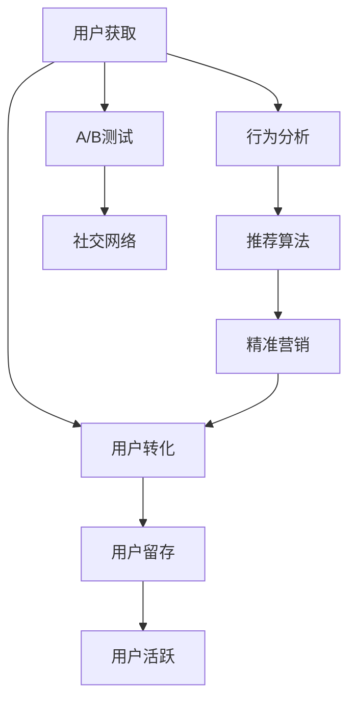

                 

# 知识付费平台的用户增长黑客策略

> 关键词：知识付费, 用户增长, 转化率, A/B测试, 社交网络, 推荐算法, 数据驱动, 漏斗分析, 行为分析, 精准营销

## 1. 背景介绍

### 1.1 问题由来

近年来，知识付费行业呈现出高速增长的趋势，各类平台如雨后春笋般涌现。然而，尽管市场热度高涨，用户获取和留存的挑战依然严峻。如何有效提升用户增长，构建长期的用户粘性，成为平台运营的一大难题。

### 1.2 问题核心关键点

知识付费平台用户增长的关键在于如何将潜在用户转化为付费用户，并保持其长期活跃。这通常包括以下几个步骤：

1. **用户获取**：通过各种渠道吸引并获取新用户。
2. **用户转化**：将访问者转化为试用用户和付费用户。
3. **用户留存**：确保新用户继续使用并最终成为付费用户，持续产生收益。
4. **用户活跃**：提高用户的使用频率，增加用户粘性。

### 1.3 问题研究意义

提升用户增长对于知识付费平台至关重要。一个稳定的用户基础不仅能带来直接的收入，还能为平台吸引更多优质内容，形成正向循环，加速平台的成长。因此，通过科学的用户增长策略，最大化用户转化和留存，不仅有助于提高平台的经济收益，还能推动知识传播和应用，促进社会的知识进步。

## 2. 核心概念与联系

### 2.1 核心概念概述

为更好地理解知识付费平台用户增长的策略，本节将介绍几个密切相关的核心概念：

- **用户获取(UG)**：通过各种渠道吸引新用户加入平台的过程。
- **用户转化(UC)**：将访问用户转化为试用用户或付费用户的过程。
- **用户留存(UR)**：保持新老用户长期使用平台，持续付费的过程。
- **用户活跃(UA)**：提高用户的使用频率，增加用户粘性。
- **漏斗分析(Funnels)**：用于分析用户转化路径的方法，展示用户在平台各个阶段的流失情况。
- **行为分析(BA)**：分析用户行为，挖掘用户需求，优化产品体验。
- **推荐算法(Recommendations)**：利用数据模型预测用户兴趣，推荐相关内容。
- **精准营销(Precision Marketing)**：基于用户数据进行个性化营销，提高营销效果。
- **数据驱动(Data-Driven)**：以数据为基础的决策过程，确保策略的科学性和有效性。
- **A/B测试(A/B Testing)**：比较两种不同的策略或产品，找出效果更好的方案。
- **社交网络(Social Network)**：通过社交关系和影响力，增强用户的黏性和传播。

这些核心概念之间的逻辑关系可以通过以下Mermaid流程图来展示：



这个流程图展示出用户增长策略的主要步骤，包括从用户获取到用户活跃的全过程，以及每个阶段的关键动作。

## 3. 核心算法原理 & 具体操作步骤

### 3.1 算法原理概述

知识付费平台的用户增长策略可以归纳为数据驱动的转化和留存策略。其核心思想是：通过分析用户行为数据，构建用户画像，制定个性化的用户转化和留存方案，最终提升平台的整体用户增长。

形式化地，假设知识付费平台的用户增长模型为 $G(\mathbf{X},\mathbf{Y},\theta)$，其中 $\mathbf{X}$ 为输入特征，包括用户行为、兴趣偏好、社交网络等；$\mathbf{Y}$ 为输出结果，如用户流失率、活跃度等；$\theta$ 为模型参数，用于描述模型的复杂度和拟合能力。

平台用户增长的优化目标是最小化用户流失率，即找到最优的参数 $\theta$：

$$
\theta^* = \mathop{\arg\min}_{\theta} \mathcal{L}(G(\mathbf{X},\mathbf{Y},\theta))
$$

其中 $\mathcal{L}$ 为损失函数，用于衡量模型预测和实际结果的差异。

### 3.2 算法步骤详解

基于数据驱动的用户增长策略，一般包括以下几个关键步骤：

**Step 1: 数据收集与处理**

- 收集平台的用户行为数据，如登录次数、购买记录、课程观看时长等。
- 利用行为分析工具，如Google Analytics，收集用户在平台上的行为路径和转化率。
- 使用推荐算法，如协同过滤、内容推荐等，根据用户兴趣推荐相关课程或内容。

**Step 2: 用户画像构建**

- 对用户行为数据进行预处理和特征工程，提取用户特征向量 $\mathbf{X}$。
- 利用聚类算法或神经网络等方法，构建用户画像，描述用户的基本属性、兴趣偏好、行为模式等。

**Step 3: 制定转化策略**

- 根据用户画像，设计个性化的转化方案，如优惠活动、推荐内容、个性化提示等。
- 使用A/B测试，比较不同策略的效果，选择最优方案。

**Step 4: 用户留存优化**

- 通过行为分析，识别流失用户的关键行为，设计相应的留存策略。
- 使用社交网络，通过用户推荐、社区互动等方式增强用户粘性。
- 定期更新推荐算法，确保内容的相关性和吸引力。

**Step 5: 评估与迭代**

- 利用漏斗分析，定期评估用户转化路径，识别流失点和转化障碍。
- 根据数据反馈，调整和优化转化和留存策略，形成持续迭代机制。

### 3.3 算法优缺点

基于数据驱动的用户增长策略具有以下优点：

1. 科学性。通过数据分析和机器学习，策略更具针对性和可解释性。
2. 可复制性。量化的方法和策略易于标准化和复制，提升运营效率。
3. 灵活性。策略可以根据数据反馈快速调整和优化。

然而，该策略也存在以下局限性：

1. 数据依赖。策略的有效性高度依赖于数据的质量和完备性。
2. 复杂度。构建精确的模型和优化策略需要较强的数据科学和算法工程能力。
3. 时效性。策略需要定期调整和更新，以适应市场和用户的变化。
4. 成本。数据收集和处理需要投入大量资源。

尽管存在这些局限性，但就目前而言，数据驱动的用户增长策略仍然是知识付费平台用户增长的主要范式。未来相关研究的重点在于如何进一步降低数据获取成本，提高策略的灵活性和有效性，同时兼顾成本控制。

### 3.4 算法应用领域

基于数据驱动的用户增长策略已经在知识付费平台等多个领域得到了广泛应用，例如：

- **内容推荐**：根据用户历史行为，推荐相关课程或文章，提高用户的试用和付费意愿。
- **个性化营销**：通过用户画像，设计个性化的营销活动，提升转化率。
- **用户互动**：利用社交网络，增强用户之间的互动和交流，提高平台活跃度。
- **活动设计**：通过A/B测试，设计最有效的活动方案，吸引用户参与。
- **流失用户召回**：分析流失用户行为，设计针对性的召回策略，减少流失。

除了上述这些经典应用外，基于数据驱动的用户增长策略也被创新性地应用于更多场景中，如精准广告投放、用户行为预测、用户生命周期管理等，为知识付费平台的运营带来了新的动力。

## 4. 数学模型和公式 & 详细讲解 & 举例说明

### 4.1 数学模型构建

本节将使用数学语言对知识付费平台用户增长模型进行更加严格的刻画。

假设知识付费平台的用户转化模型为 $G_{U}(\mathbf{X},\mathbf{Y},\theta)$，其中 $\mathbf{X}$ 为影响用户转化的因素，$\mathbf{Y}$ 为用户转化状态（如是否试用或购买），$\theta$ 为模型参数。

定义用户转化的概率函数为 $P_{U}(\mathbf{X},\theta)$，即在给定输入特征 $\mathbf{X}$ 和模型参数 $\theta$ 的情况下，用户转化的概率。

### 4.2 公式推导过程

以用户转化的二项逻辑回归模型为例，推导其损失函数的计算公式。

假设 $P_{U}(\mathbf{X},\theta) = \sigma(\mathbf{X}\theta)$，其中 $\sigma(\cdot)$ 为sigmoid函数。则用户转化的对数似然损失函数为：

$$
\ell_{U}(G_{U}(\mathbf{X},\mathbf{Y},\theta)) = -\sum_{i=1}^{N} \left[ y_i \log P_{U}(\mathbf{x}_i,\theta) + (1-y_i) \log (1 - P_{U}(\mathbf{x}_i,\theta)) \right]
$$

其中 $\mathbf{x}_i$ 为第 $i$ 个用户的特征向量，$y_i$ 为是否转化的二元标签。

在得到损失函数的梯度后，即可带入优化算法更新模型参数。常用的优化算法包括梯度下降、Adam等，具体实现步骤如下：

1. 收集用户转化数据，计算损失函数的梯度。
2. 使用优化算法更新模型参数，最小化损失函数。
3. 定期在测试集上评估模型性能，根据反馈调整策略。

### 4.3 案例分析与讲解

假设我们收集到平台的历史用户转化数据，并构建了二项逻辑回归模型 $G_{U}(\mathbf{X},\mathbf{Y},\theta)$。现在我们需要在测试集上评估该模型的效果，具体步骤如下：

1. 使用测试集数据计算模型预测的转化概率。
2. 计算模型预测与实际标签之间的误差，如交叉熵损失。
3. 利用交叉验证或独立测试集，评估模型的性能指标，如AUC、F1等。
4. 根据评估结果，调整模型参数或优化策略，提高用户转化率。

## 5. 项目实践：代码实例和详细解释说明

### 5.1 开发环境搭建

在进行用户增长策略开发前，我们需要准备好开发环境。以下是使用Python进行PyTorch开发的环境配置流程：

1. 安装Anaconda：从官网下载并安装Anaconda，用于创建独立的Python环境。

2. 创建并激活虚拟环境：
```bash
conda create -n pytorch-env python=3.8 
conda activate pytorch-env
```

3. 安装PyTorch：根据CUDA版本，从官网获取对应的安装命令。例如：
```bash
conda install pytorch torchvision torchaudio cudatoolkit=11.1 -c pytorch -c conda-forge
```

4. 安装各类工具包：
```bash
pip install numpy pandas scikit-learn matplotlib tqdm jupyter notebook ipython
```

完成上述步骤后，即可在`pytorch-env`环境中开始用户增长策略的开发。

### 5.2 源代码详细实现

下面我们以推荐系统为例，给出使用PyTorch构建用户转化模型的PyTorch代码实现。

首先，定义推荐系统的数据处理函数：

```python
from sklearn.preprocessing import StandardScaler
from sklearn.model_selection import train_test_split
import torch
import torch.nn as nn
import torch.optim as optim

# 构建训练集和测试集
train_data, test_data = train_test_split(train_dataset, test_size=0.2, random_state=42)

# 定义输入和输出特征
X_train = train_data.drop('label', axis=1).values
y_train = train_data['label'].values
X_test = test_data.drop('label', axis=1).values
y_test = test_data['label'].values

# 标准化处理
scaler = StandardScaler()
X_train = scaler.fit_transform(X_train)
X_test = scaler.transform(X_test)

# 定义模型参数
class UserTransformationModel(nn.Module):
    def __init__(self):
        super(UserTransformationModel, self).__init__()
        self.fc1 = nn.Linear(input_dim, 128)
        self.fc2 = nn.Linear(128, 1)
        self.sigmoid = nn.Sigmoid()
    
    def forward(self, x):
        x = self.fc1(x)
        x = self.fc2(x)
        x = self.sigmoid(x)
        return x

# 构建模型
model = UserTransformationModel()
loss_fn = nn.BCELoss()
optimizer = optim.Adam(model.parameters(), lr=0.01)

# 训练模型
def train_model(model, X_train, y_train, X_test, y_test, epochs=10, batch_size=32):
    for epoch in range(epochs):
        model.train()
        for i in range(0, len(X_train), batch_size):
            inputs = X_train[i:i+batch_size]
            labels = y_train[i:i+batch_size]
            optimizer.zero_grad()
            outputs = model(inputs)
            loss = loss_fn(outputs, labels)
            loss.backward()
            optimizer.step()
        model.eval()
        with torch.no_grad():
            y_pred = model(X_test)
            loss = loss_fn(y_pred, y_test)
            accuracy = (y_pred >= 0.5).float().mean()
            print(f"Epoch {epoch+1}, Loss: {loss:.4f}, Accuracy: {accuracy:.4f}")

# 训练模型
train_model(model, X_train, y_train, X_test, y_test, epochs=10, batch_size=32)
```

然后，定义训练和评估函数：

```python
from sklearn.metrics import accuracy_score

def evaluate_model(model, X_test, y_test, test_size=0.2, batch_size=32):
    model.eval()
    y_pred = model(X_test)
    loss = loss_fn(y_pred, y_test)
    accuracy = (y_pred >= 0.5).float().mean()
    print(f"Test Loss: {loss:.4f}, Test Accuracy: {accuracy:.4f}")
    return accuracy

# 评估模型
evaluate_model(model, X_test, y_test, batch_size=32)
```

最后，启动训练流程并在测试集上评估：

```python
# 启动训练流程
train_model(model, X_train, y_train, X_test, y_test, epochs=10, batch_size=32)

# 在测试集上评估模型性能
evaluate_model(model, X_test, y_test, batch_size=32)
```

以上就是使用PyTorch对用户转化模型进行训练的完整代码实现。可以看到，PyTorch提供了丰富的深度学习组件和优化器，可以方便地构建和训练模型。

### 5.3 代码解读与分析

让我们再详细解读一下关键代码的实现细节：

**UserTransformationModel类**：
- `__init__`方法：定义了模型结构，包括两个全连接层和sigmoid激活函数。
- `forward`方法：前向传播过程，实现输入数据的逐层传递和输出计算。

**train_model函数**：
- 定义训练集和测试集的输入和输出。
- 对输入数据进行标准化处理，以加速模型收敛。
- 使用Adam优化器，更新模型参数，最小化损失函数。
- 在每个epoch结束后，计算模型在测试集上的表现，并输出训练进度。

**evaluate_model函数**：
- 使用测试集数据评估模型性能。
- 计算模型损失和准确率，并打印输出。

**训练流程**：
- 定义训练轮数和批大小，开始循环迭代
- 在每个epoch内，对训练集数据进行批处理，计算损失函数并反向传播更新模型参数
- 在验证集上评估模型性能，输出训练进度
- 所有epoch结束后，在测试集上评估模型性能，给出最终测试结果

可以看到，PyTorch提供了高效的数据处理和模型构建功能，开发者可以专注于模型的训练和评估。当然，实际应用中还需要考虑更多的因素，如模型部署、超参数调优、实时数据接入等。

## 6. 实际应用场景

### 6.1 智能客服系统

基于推荐系统的用户增长策略，可以应用于智能客服系统的构建。通过分析用户的历史咨询记录和行为数据，推荐合适的客服人员和解决方案，提高用户的满意度和服务体验。

在技术实现上，可以构建推荐系统模型，根据用户的历史行为数据（如访问记录、点击记录等），推荐最合适的客服人员或解决方案，并自动分配任务。同时，利用行为分析工具，实时监测用户的满意度，动态调整推荐策略，提高服务质量。

### 6.2 金融产品推荐

金融行业需要精准推荐适合用户的产品，提高用户的购买率和满意度。基于用户行为数据的推荐系统，可以分析用户的消费习惯和投资偏好，推荐个性化的理财产品或投资方案。

在实践过程中，可以利用机器学习模型，如协同过滤、深度学习等，分析用户的特征和行为数据，构建推荐模型，并提供个性化的产品推荐。同时，通过行为分析工具，实时监测用户的消费行为，动态调整推荐策略，提高用户的忠诚度和购买率。

### 6.3 电商平台的个性化推荐

电商平台需要通过推荐系统，提高用户购买率和复购率，提升平台销售额。基于用户行为数据的推荐系统，可以分析用户的浏览历史和购买记录，推荐相关的商品或促销活动。

在实现上，可以利用深度学习模型，如循环神经网络(RNN)、长短期记忆网络(LSTM)等，分析用户的序列数据，构建推荐模型，并提供个性化的商品推荐。同时，通过行为分析工具，实时监测用户的购买行为，动态调整推荐策略，提高用户的购买意愿和复购率。

### 6.4 未来应用展望

随着推荐系统的不断发展，基于数据驱动的用户增长策略将在更多领域得到应用，为各行业的业务发展提供新的动力。

在智慧医疗领域，推荐系统可以分析病人的历史医疗记录和用药数据，推荐合适的治疗方案和药物，提高治疗效果。在智能家居领域，推荐系统可以分析用户的日常行为数据，推荐最适合的智能设备和生活习惯，提高生活的便利性和舒适度。

此外，在教育、旅游、娱乐等众多领域，基于推荐系统的用户增长策略也将不断涌现，为各行各业的发展提供新的支持。相信随着技术的日益成熟，推荐系统必将在更广阔的应用领域大放异彩。

## 7. 工具和资源推荐

### 7.1 学习资源推荐

为了帮助开发者系统掌握推荐系统的理论和实践，这里推荐一些优质的学习资源：

1. 《推荐系统实战》书籍：全面介绍了推荐系统的算法和应用场景，提供了丰富的代码实现和案例分析。
2. Coursera《推荐系统》课程：斯坦福大学开设的推荐系统课程，系统讲解了推荐系统的基本原理和算法实现。
3. Kaggle推荐系统竞赛：参加Kaggle上的推荐系统竞赛，实战练习推荐算法，积累项目经验。
4. RecSys conference论文：最新的推荐系统研究论文，了解最新的算法和技术进展。

通过对这些资源的学习实践，相信你一定能够快速掌握推荐系统的精髓，并用于解决实际的业务问题。

### 7.2 开发工具推荐

高效的开发离不开优秀的工具支持。以下是几款用于推荐系统开发的常用工具：

1. Apache Spark：大规模数据处理和分析工具，适合大规模推荐系统数据处理。
2. TensorFlow：谷歌主导的开源深度学习框架，支持分布式训练和推理。
3. PyTorch：基于Python的深度学习框架，灵活易用，适合推荐系统的算法实现。
4. LightFM：Facebook开源的推荐系统工具，支持多种推荐算法，易于部署和使用。
5. Scikit-learn：Python机器学习库，提供简单易用的推荐算法实现。

合理利用这些工具，可以显著提升推荐系统的开发效率，加快创新迭代的步伐。

### 7.3 相关论文推荐

推荐系统的研究始于20世纪90年代，近年来随着数据规模的扩大和算法的改进，推荐系统得到了广泛的应用和发展。以下是几篇奠基性的相关论文，推荐阅读：

1. "Trustworthy Online Recommendation Algorithms"（Trustworthy Online Recommendation Algorithms）：提出基于协同过滤的推荐算法，解决了数据稀疏性和用户信任度问题。
2. "Personalized PageRank for Recommender Systems"（Personalized PageRank for Recommender Systems）：提出基于PageRank的个性化推荐算法，提高了推荐系统的多样性和准确性。
3. "Factorization Machines"（Factorization Machines）：提出基于矩阵分解的推荐算法，提高了推荐系统的计算效率和精度。
4. "Neural Collaborative Filtering"（Neural Collaborative Filtering）：提出基于深度神经网络的推荐算法，提高了推荐系统的特征学习能力。
5. "Adaptive Nonlinear Matrix Factorization with Log-Likelihood Maximization"（Adaptive Nonlinear Matrix Factorization with Log-Likelihood Maximization）：提出基于非线性矩阵分解的推荐算法，提高了推荐系统的模型复杂度和精度。

这些论文代表了的推荐系统的发展脉络。通过学习这些前沿成果，可以帮助研究者把握学科前进方向，激发更多的创新灵感。

## 8. 总结：未来发展趋势与挑战

### 8.1 总结

本文对基于推荐系统的知识付费平台用户增长策略进行了全面系统的介绍。首先阐述了知识付费平台用户增长的背景和意义，明确了用户增长的关键步骤和核心动作。其次，从原理到实践，详细讲解了推荐算法的数学原理和实现细节，给出了推荐系统开发的具体代码实现。同时，本文还广泛探讨了推荐系统在智能客服、金融产品推荐、电商平台等多个行业领域的应用前景，展示了推荐系统的广泛应用价值。

通过本文的系统梳理，可以看到，基于推荐系统的用户增长策略已经成为知识付费平台用户增长的主要范式，极大地提升了平台的经济收益和用户体验。未来，伴随推荐算法的持续演进和应用领域的不断拓展，推荐系统必将在更广泛的领域发挥重要作用，推动各行各业的发展和创新。

### 8.2 未来发展趋势

展望未来，推荐系统的发展趋势主要包括以下几个方面：

1. 智能化。随着深度学习和大数据技术的发展，推荐系统将变得更加智能化，能够更好地理解用户需求，提供更个性化的推荐。
2. 实时化。实时推荐系统能够根据用户当前的实时行为数据，快速调整推荐策略，提高推荐效果。
3. 跨领域融合。推荐系统将与社交网络、协同过滤、内容推荐等多种技术融合，形成更加全面、准确的信息推荐体系。
4. 自适应。推荐系统能够根据用户行为的变化，动态调整推荐策略，避免过拟合和模型老化。
5. 可解释性。推荐系统的输出应该具备可解释性，让用户理解推荐结果的依据，增强用户的信任和满意度。
6. 多模态融合。推荐系统将融合文本、图像、语音等多种模态数据，提供更加丰富和多样化的推荐服务。

这些趋势将使得推荐系统在未来的应用中更加精准、智能、灵活，为用户带来更加优质的推荐体验，推动各行各业的发展。

### 8.3 面临的挑战

尽管推荐系统已经取得了显著的进展，但在迈向更加智能化、实时化应用的过程中，它仍面临着诸多挑战：

1. 数据质量和多样性。推荐系统的性能高度依赖于数据的质量和多样性。低质量的数据和单一的数据源将限制推荐系统的效果。
2. 算法复杂度。现有的推荐算法往往比较复杂，需要大量的计算资源和时间。如何提高算法效率，降低计算成本，是亟需解决的问题。
3. 用户隐私保护。推荐系统需要收集和分析大量的用户数据，如何保护用户的隐私和数据安全，成为关键问题。
4. 多目标优化。推荐系统不仅要考虑用户的满意度，还要兼顾平台收益、内容多样性等多重目标，如何实现多目标优化，是推荐系统的另一个难点。
5. 推荐冷启动。新用户或冷启动用户缺乏足够的历史数据，推荐系统无法进行有效的推荐，如何解决冷启动问题，提高新用户的转化率，是推荐系统的挑战之一。
6. 多样性和公平性。推荐系统容易产生过滤泡沫，过度关注热门内容，忽略长尾内容。如何提升推荐系统的多样性和公平性，是未来研究的重要方向。

这些挑战需要研究人员和实践者共同努力，不断探索和优化推荐系统的算法和应用，才能实现其广泛的应用价值。

### 8.4 研究展望

面对推荐系统面临的诸多挑战，未来的研究需要在以下几个方面寻求新的突破：

1. 数据增强技术。通过数据增强技术，提高推荐系统的数据质量和多样性，增强推荐效果。
2. 轻量级推荐模型。设计轻量级推荐模型，提高算法的效率和实时性，适应实时推荐的需求。
3. 隐私保护技术。开发隐私保护算法，保护用户隐私和数据安全，增强用户信任。
4. 多目标优化方法。探索多目标优化算法，综合考虑多个目标，实现推荐系统的优化。
5. 冷启动策略。设计有效的冷启动策略，提高新用户的转化率和活跃度。
6. 多样性和公平性算法。开发多样性和公平性算法，提升推荐系统的多样性和公平性，避免过滤泡沫。

这些研究方向将使得推荐系统在未来的应用中更加精准、智能、可靠，为用户带来更好的推荐体验，推动各行各业的发展。总之，推荐系统需要不断创新和优化，才能适应快速变化的市场需求，实现其广泛的应用价值。

## 9. 附录：常见问题与解答

**Q1：推荐系统如何处理数据稀疏性问题？**

A: 推荐系统通常面临数据稀疏性的挑战，即用户与物品之间的交互记录较少。解决数据稀疏性的方法包括：
1. 协同过滤：通过用户历史行为相似性进行推荐，减少数据稀疏性的影响。
2. 矩阵分解：通过低秩矩阵分解，捕捉用户与物品之间的隐含关系，提高推荐效果。
3. 深度学习：利用深度神经网络，学习用户和物品的复杂关系，减少数据稀疏性的影响。

**Q2：推荐系统如何平衡个性化和多样性？**

A: 推荐系统需要平衡个性化和多样性，避免过拟合和过滤泡沫。常用的方法包括：
1. 多样化损失函数：引入多样化损失函数，鼓励推荐多样化的内容。
2. 多臂老虎机算法：通过多臂老虎机算法，平衡个性化和多样性，提高推荐效果。
3. 负面采样：通过负面采样，避免推荐过多热门内容，保证推荐的多样性。

**Q3：推荐系统如何进行用户行为预测？**

A: 推荐系统可以通过行为预测，提前获取用户行为数据，提高推荐效果。常用的方法包括：
1. 序列模型：利用序列模型，如RNN、LSTM等，预测用户行为序列。
2. 马尔可夫模型：利用马尔可夫模型，预测用户行为的概率分布。
3. 深度学习模型：利用深度神经网络，学习用户行为的复杂关系，提高预测精度。

**Q4：推荐系统如何避免过拟合？**

A: 推荐系统需要避免过拟合，提高模型的泛化能力。常用的方法包括：
1. 正则化：引入L2正则、Dropout等正则化技术，防止模型过拟合。
2. 数据增强：通过数据增强技术，增加训练数据的数量和多样性，提高模型的泛化能力。
3. 模型集成：通过模型集成技术，提高模型的稳定性和泛化能力。

**Q5：推荐系统如何进行实时推荐？**

A: 实时推荐系统需要快速获取用户实时行为数据，并动态调整推荐策略。常用的方法包括：
1. 缓存技术：利用缓存技术，提高数据的读取速度和效率。
2. 流式学习：利用流式学习技术，实时更新模型参数，适应用户的实时行为。
3. 分布式系统：利用分布式系统，提高实时推荐系统的计算能力和效率。

这些方法将使得推荐系统在未来的应用中更加精准、智能、实时，为用户带来更好的推荐体验。

---

作者：禅与计算机程序设计艺术 / Zen and the Art of Computer Programming

