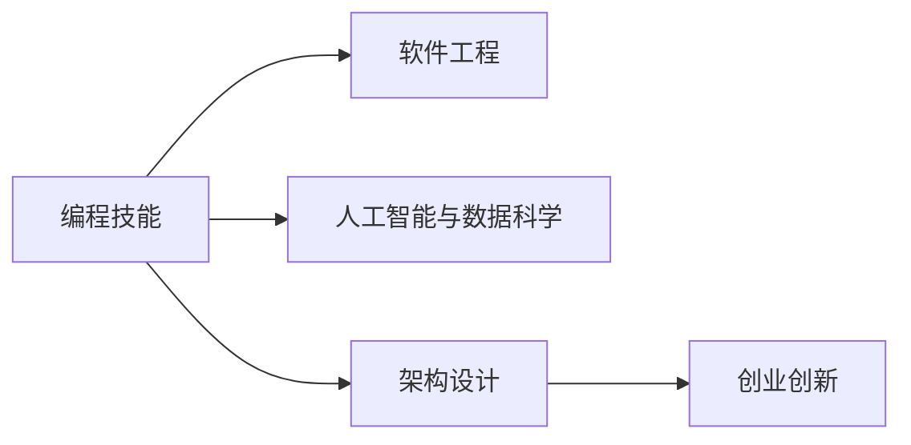

                 

# 知识付费时代程序员的发展方向

> 关键词：知识付费, 人工智能, 数据科学, 软件工程, 架构设计, 创业创新

## 1. 背景介绍

随着信息技术的飞速发展和互联网的普及，知识付费模式已成为数字化时代的新常态。程序员作为互联网与数字技术的主要推动力，其职业发展和技能要求也在不断演进。在这个时代背景下，程序员面临的不仅是技术挑战，还有如何适应知识付费时代的职业需求。本文将从职业背景、核心技能、发展路径和未来趋势等多个维度，深入探讨知识付费时代程序员的发展方向。

## 2. 核心概念与联系

### 2.1 核心概念概述

在知识付费时代，程序员的核心能力不再仅仅局限于编程技巧，而是涵盖更广泛的技术、业务和创新能力。以下概念将帮助我们理解这一变化：

- **编程技能**：包括熟练掌握一种或多种编程语言，熟练使用各类开发工具和框架。
- **软件工程**：包括软件开发方法论、版本控制、测试驱动开发、持续集成与持续部署(CI/CD)等。
- **人工智能与数据科学**：涉及机器学习、深度学习、数据处理与分析、数据可视化等技术。
- **架构设计**：包括系统设计原则、微服务架构、分布式系统设计等。
- **创业创新**：包括产品规划、市场分析、商业策略制定与实施。

这些核心概念之间有着紧密的联系，构成了程序员职业发展的全貌。

### 2.2 核心概念原理和架构的 Mermaid 流程图



该图展示了程序员核心能力的构成及其相互关系。编程技能是基础，软件工程和人工智能与数据科学为支持，架构设计和创业创新为应用，形成了一个完整的发展路径。

## 3. 核心算法原理 & 具体操作步骤

### 3.1 算法原理概述

知识付费时代的程序员发展，需要具备跨学科的知识和技能，能够适应快速变化的市场和技术环境。以下是几个关键算法原理：

- **跨学科融合**：程序员需将编程技能、软件工程、人工智能与数据科学、架构设计和创业创新相结合，形成复合型能力。
- **持续学习**：在知识付费时代，新的技术和工具层出不穷，程序员需不断学习以保持竞争力。
- **敏捷开发**：快速响应市场需求，敏捷开发方法论如Scrum、Kanban等成为必备技能。
- **全栈发展**：从前端到后端，从技术栈到产品栈，全面掌握软件开发流程。

### 3.2 算法步骤详解

以下是一个程序员从入门到高阶的典型职业路径，每个阶段都有具体的技能要求和职业目标：

#### 初级阶段

- **编程入门**：学习基本编程语言和数据结构算法，掌握基本的软件开发流程。
- **基础软件工程**：学习版本控制、测试驱动开发、自动化测试等基础技能。

#### 中级阶段

- **深度学习与人工智能**：学习机器学习、深度学习框架，掌握数据分析与处理。
- **架构设计**：学习系统设计原则、微服务架构，理解分布式系统设计。

#### 高级阶段

- **创业创新**：具备产品规划、市场分析、商业策略制定与实施的能力。
- **全栈开发**：掌握前端、后端、数据库等全栈开发技能。

### 3.3 算法优缺点

- **优点**：
  - **跨学科融合**：具备多领域知识，能够适应多变市场环境。
  - **持续学习**：保持技术前沿，适应快速变化的技术栈。
  - **敏捷开发**：提高项目交付效率，快速响应市场变化。
  - **全栈发展**：提升综合竞争力，更容易在不同技术栈之间切换。

- **缺点**：
  - **知识面广**：需要较长时间学习和积累。
  - **技能要求高**：需掌握多门技术和工具。
  - **职业路径长**：不同阶段所需的时间和资源不同。

### 3.4 算法应用领域

知识付费时代程序员的技能适用于多个应用领域，包括但不限于：

- **软件开发**：从企业级系统开发到移动应用开发。
- **数据分析与AI**：数据科学、机器学习、深度学习等技术应用。
- **系统架构设计**：分布式系统、微服务架构、云计算等技术。
- **产品开发**：产品规划、市场分析、商业策略制定与实施。

## 4. 数学模型和公式 & 详细讲解 & 举例说明

### 4.1 数学模型构建

在知识付费时代，程序员的技能发展可以建模为一种动态系统，如下图所示：

$$
\text{技能提升} = f(\text{学习投入}, \text{实践经验}, \text{行业需求})
$$

其中，学习投入包括课程学习、书籍阅读、在线教程等；实践经验包括项目实践、开源贡献、技术分享等；行业需求包括市场需求、技术趋势、业务发展等。

### 4.2 公式推导过程

$$
\frac{d\text{技能提升}}{dt} = k(\text{学习投入} + \text{实践经验} + \text{行业需求} - \text{当前技能})
$$

其中，$k$为技能提升速率常数，$k$越大表示技能提升越快。当技能提升速率大于0时，技能水平提升；当技能提升速率小于0时，技能水平下降。

### 4.3 案例分析与讲解

假设一个初级程序员经过6个月的持续学习，投入100小时编程和50小时学习新技术，行业需求增加5%，当前技能水平为40%，根据上述公式计算6个月后的技能提升：

$$
\text{技能提升} = 0.1(100 + 50 + 0.05 \times 100 - 40) = 11
$$

$$
\text{新技能} = 40 + 11 = 51
$$

这意味着该程序员的技能提升至51%，具备了中级程序员所需的技能水平。

## 5. 项目实践：代码实例和详细解释说明

### 5.1 开发环境搭建

在知识付费时代，程序员需掌握多种工具和框架，搭建高效开发环境。以下是一个简单的Python开发环境搭建流程：

1. 安装Anaconda：从官网下载并安装Anaconda，用于创建独立的Python环境。
2. 创建并激活虚拟环境：
```bash
conda create -n pyenv python=3.8
conda activate pyenv
```
3. 安装必要的Python库和工具包：
```bash
pip install numpy pandas scikit-learn matplotlib
```

### 5.2 源代码详细实现

以下是一个简单的Python程序示例，展示如何在知识付费平台上进行编程练习：

```python
import requests

def get_programming_challenges():
    url = 'https://api.hackerrank.com/challenges'
    response = requests.get(url)
    challenges = response.json()
    return challenges

def solve_challenge(challenge):
    name = challenge['name']
    tasks = challenge['tasks']
    for task in tasks:
        if task['completed']:
            print(f'{name}: {task["points"]} points completed')
        else:
            print(f'{name}: {task["points"]} points pending')

if __name__ == '__main__':
    challenges = get_programming_challenges()
    for challenge in challenges:
        solve_challenge(challenge)
```

### 5.3 代码解读与分析

该程序展示了如何利用HackerRank API获取编程挑战列表，并统计每个挑战的完成情况。该代码使用了requests库进行API调用，展示了一个完整的Python程序实现。

### 5.4 运行结果展示

运行上述代码，程序将输出每个编程挑战的完成情况，帮助程序员评估自己的编程能力和进度。

## 6. 实际应用场景

### 6.1 软件开发

知识付费时代的程序员在软件开发中需具备多方面能力，包括但不限于：

- **敏捷开发**：敏捷开发方法论如Scrum、Kanban，提高项目交付效率。
- **云平台开发**：掌握云计算平台如AWS、Azure、Google Cloud等技术。
- **DevOps**：掌握CI/CD、自动化部署等DevOps工具。

### 6.2 数据分析与AI

数据分析和人工智能是知识付费时代程序员的重要方向之一，需掌握以下技术：

- **数据处理与分析**：使用Python、R等语言进行数据清洗、分析和可视化。
- **机器学习与深度学习**：掌握TensorFlow、PyTorch等深度学习框架，使用机器学习算法进行建模。
- **大数据技术**：熟悉Hadoop、Spark等大数据处理技术。

### 6.3 系统架构设计

系统架构设计是程序员职业发展的高级阶段，需掌握以下技术：

- **微服务架构**：掌握Spring Boot、Docker等技术，实现微服务架构。
- **分布式系统设计**：熟悉Kubernetes、Consul等分布式系统管理工具。
- **云计算架构**：掌握AWS、Azure、Google Cloud等云计算平台。

### 6.4 产品开发

产品开发是程序员职业发展的最终目标，需具备以下能力：

- **产品规划**：掌握市场分析、用户调研等产品规划技能。
- **商业策略**：具备商业策略制定与实施能力。
- **团队管理**：具备团队管理和项目管理能力。

## 7. 工具和资源推荐

### 7.1 学习资源推荐

- **在线课程**：Coursera、edX等平台提供大量计算机科学和数据科学的课程，如机器学习、深度学习、软件工程等。
- **书籍**：《深度学习》、《软件工程》、《设计模式》等经典书籍，深入学习基础知识和高级技术。
- **在线社区**：Github、Stack Overflow等社区，获取最新技术和实践经验。

### 7.2 开发工具推荐

- **IDE**：Visual Studio Code、PyCharm、Eclipse等，提供代码编辑器和开发环境。
- **数据库**：MySQL、MongoDB等关系型和NoSQL数据库。
- **云平台**：AWS、Azure、Google Cloud等，提供云服务和计算资源。

### 7.3 相关论文推荐

- **编程语言与开发工具**：《The C++ Programming Language》、《Effective Java》等。
- **软件开发方法论**：《Agile Software Development》、《Software Engineering》等。
- **数据科学与人工智能**：《Pattern Recognition and Machine Learning》、《Deep Learning》等。

## 8. 总结：未来发展趋势与挑战

### 8.1 研究成果总结

知识付费时代，程序员技能的发展呈现出跨学科融合、持续学习、敏捷开发和全栈发展等趋势。这些趋势不仅提升了程序员的职业竞争力，也为NLP、AI等领域带来了新的发展机遇。

### 8.2 未来发展趋势

未来的程序员技能发展趋势包括：

- **跨学科融合**：人工智能、数据科学、软件工程等多领域技能融合。
- **持续学习**：新技术、新工具层出不穷，程序员需不断学习和适应。
- **敏捷开发**：快速响应市场需求，提高项目交付效率。
- **全栈发展**：掌握前端、后端、数据库等全栈开发技能。
- **知识付费**：通过在线课程、书籍、开源项目等形式，不断提升自身技能。

### 8.3 面临的挑战

- **知识面广**：需要较长时间学习和积累。
- **技能要求高**：需掌握多门技术和工具。
- **职业路径长**：不同阶段所需的时间和资源不同。
- **市场竞争激烈**：需不断提升自身竞争力。

### 8.4 研究展望

未来的研究将从以下几个方面进行：

- **跨学科技能培训**：开发更多跨学科技能培训课程和工具，帮助程序员快速掌握多领域知识。
- **持续学习平台**：构建更多高效的学习平台，如Coursera、edX、Udacity等。
- **敏捷开发方法**：推广Scrum、Kanban等敏捷开发方法，提升团队协作效率。
- **全栈技术培训**：开发更多全栈技术培训课程，帮助程序员掌握多门技术和工具。
- **知识付费模式**：探索更多知识付费模式，如在线课程、书籍、开源项目等。

## 9. 附录：常见问题与解答

**Q1：知识付费时代程序员的职业发展方向是什么？**

A: 在知识付费时代，程序员需具备跨学科的复合型能力，包括编程技能、软件工程、人工智能与数据科学、架构设计和创业创新等。

**Q2：如何提升程序员的技能？**

A: 程序员需不断学习新技术、新工具，参与在线课程、书籍阅读、开源项目贡献等。同时，通过实践经验积累，提升实际编程能力。

**Q3：程序员应如何适应知识付费时代的市场需求？**

A: 程序员需具备敏捷开发、全栈开发、云计算等技能，以快速响应市场需求，提高项目交付效率。

**Q4：知识付费时代程序员面临的挑战有哪些？**

A: 知识面广、技能要求高、职业路径长是程序员在知识付费时代面临的主要挑战。

**Q5：知识付费时代程序员的未来趋势是什么？**

A: 跨学科融合、持续学习、敏捷开发、全栈发展和知识付费是未来程序员技能发展的趋势。

作者：禅与计算机程序设计艺术 / Zen and the Art of Computer Programming

