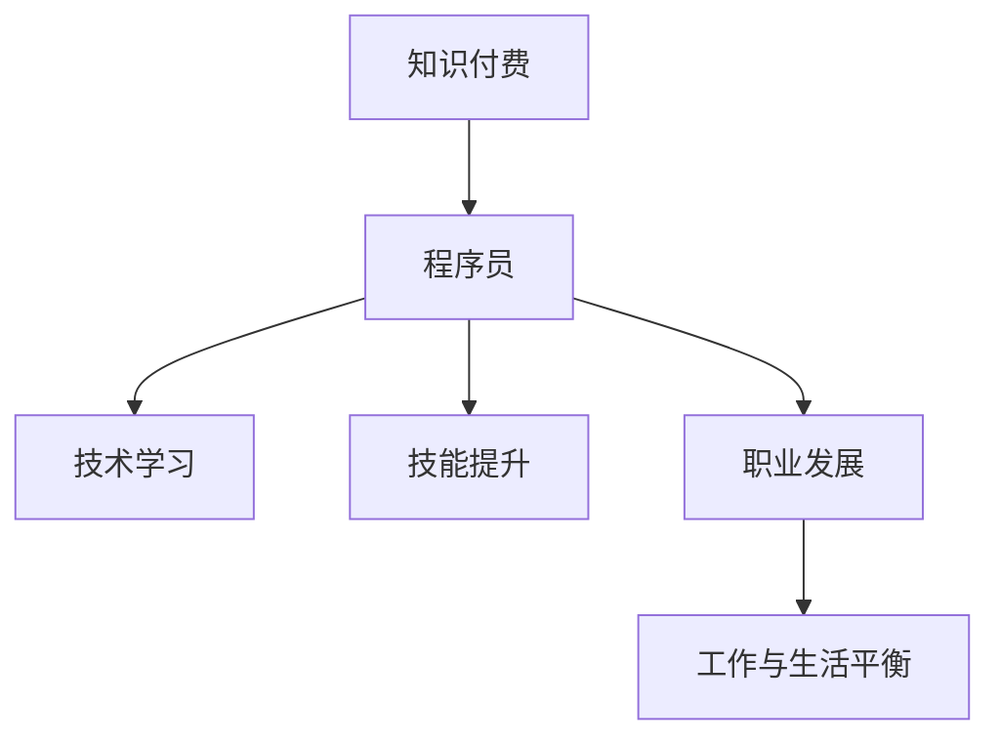

                 

# 知识付费让程序员告别996

> 关键词：知识付费,程序员,996,技术学习,技能提升,职业发展,工作与生活平衡

## 1. 背景介绍

### 1.1 问题由来
在过去十年间，中国的互联网行业经历了爆发式增长，特别是在移动端的应用场景，出现了一大批成功的科技公司，包括腾讯、字节跳动、阿里巴巴、美团、京东等。这些公司背后，有一大批默默付出的程序员。然而，随着竞争的加剧，“996”（早上9点上班，晚上9点下班，每周工作6天）的工作制度成为了互联网公司的标配。这不仅意味着程序员长时间的高强度劳动，还带来了严重的身体和心理健康问题。

### 1.2 问题核心关键点
“996”现象背后的核心问题在于中国互联网行业的过度竞争和程序员职业发展路径的单一化。互联网公司为了争夺市场份额和人才，不断提高工作强度，牺牲员工的生活和健康。而程序员的职业发展，过度依赖于公司内部晋升，缺乏其他发展途径。

### 1.3 问题研究意义
研究如何通过知识付费的方式，帮助程序员告别“996”，不仅可以改善他们的生活质量，还有助于推动整个行业走向更健康、更可持续的发展方向。这种研究对于提升程序员的职业幸福感，提高整体社会效率具有重要意义。

## 2. 核心概念与联系

### 2.1 核心概念概述

为了更好地理解知识付费如何帮助程序员告别“996”，本节将介绍几个密切相关的核心概念：

- 知识付费(Knowledge Pricing): 指消费者为获得专业知识、技能或服务而支付的代价，是当前知识经济时代的一种重要消费形式。
- 程序员(Programmer): 使用计算机编程技术进行软件开发、维护和管理的专业人士。
- 996工作制度: 指一种高强度的工作模式，即每天工作9小时，每周工作6天，严重违反了劳动法规定。
- 技术学习(Technical Learning): 程序员通过学习新知识、新技术来提升自己的职业竞争力。
- 技能提升(Skill Enhancement): 通过系统的培训和学习，提高程序员的专业能力和综合素质。
- 职业发展(Career Development): 程序员通过不同的途径和方式，扩展职业空间，提升职业满意度。
- 工作与生活平衡(Work-Life Balance): 程序员在职业发展的同时，保持健康的生活态度和方式，实现工作与生活的和谐统一。

这些核心概念之间的逻辑关系可以通过以下Mermaid流程图来展示：



这个流程图展示的知识付费与程序员之间以及各个概念之间的逻辑关系：

1. 知识付费为程序员提供学习资源和技能提升途径。
2. 程序员通过技术学习，不断提升专业技能和职业素养。
3. 技能提升是程序员职业发展的核心要素，有利于获得更好的工作机会和薪资待遇。
4. 职业发展帮助程序员拓宽职业空间，实现职业生涯的全面提升。
5. 工作与生活平衡是程序员职业发展的目标，有助于提升幸福感和工作效率。

## 3. 核心算法原理 & 具体操作步骤
### 3.1 算法原理概述

知识付费对程序员告别“996”的贡献在于提供了一个更加多元化的学习和职业发展途径。通过支付一定的费用，程序员可以获得高质量的课程、书籍、文章、视频等学习资源，从而扩展知识面，提升技能。

### 3.2 算法步骤详解

以下是知识付费帮助程序员告别“996”的详细步骤：

**Step 1: 选择适合的课程和学习平台**
- 识别自己的职业目标和学习需求。
- 选择高质量的学习平台，如Coursera、Udemy、edX等。
- 根据职业发展路径，选择相应的课程和模块。

**Step 2: 制定学习计划和时间表**
- 制定明确的学习目标和时间安排。
- 将大目标分解为小任务，设定阶段性成果。
- 结合工作和家庭安排，合理安排学习时间。

**Step 3: 系统学习，提升技能**
- 系统学习某一领域的知识体系，如算法、数据结构、前端开发、后端开发等。
- 不断实践，提升编程能力和项目经验。
- 参与开源项目和社区讨论，加强实战能力。

**Step 4: 职业发展，拓宽职业路径**
- 提升技术能力后，积极寻找更好的职业机会。
- 关注行业发展趋势，尝试新的技术栈和工具。
- 拓展职业网络，参加职业培训和研讨会。

**Step 5: 实现工作与生活平衡**
- 设定合理的职业目标和期望。
- 学会时间管理和任务优先级排序。
- 注重身体和心理健康，保持积极的生活态度。

### 3.3 算法优缺点

知识付费帮助程序员告别“996”具有以下优点：
1. 系统学习：高质量的课程和学习资源，能够系统提升程序员的专业技能和知识体系。
2. 拓宽职业路径：通过不断学习和实践，程序员可以拓宽职业发展路径，减少对单一公司的依赖。
3. 灵活自主：知识付费提供更多的自主学习时间和选择，帮助程序员掌握时间的主动权。
4. 提升幸福感和效率：技能提升后，程序员可以有更多的时间和精力关注家庭和自我发展。

同时，这种模式也存在一些缺点：
1. 高昂费用：知识付费虽然提升了学习效率，但高昂的费用可能会给经济带来一定的压力。
2. 课程质量参差不齐：学习平台上的课程质量存在差异，需要花费时间筛选。
3. 自主学习缺乏监督：缺乏学习计划和老师的指导，可能导致学习效果不佳。

### 3.4 算法应用领域

知识付费不仅限于技术学习，它在多个领域都有广泛应用。例如：

- 教育：知识付费在K12教育、成人教育、职业培训等领域都有显著应用。
- 健康：在线健康咨询、健身课程、心理咨询等服务，也普遍采用知识付费模式。
- 金融：理财课程、投资指导、财务管理等服务，通过知识付费获得专业建议。
- 生活：厨艺、育儿、园艺等各类兴趣课程，知识付费让人们更容易获取专业指导。

## 4. 数学模型和公式 & 详细讲解 & 举例说明
### 4.1 数学模型构建

在知识付费的场景下，我们需要建立一个模型来评估付费的效果。假设程序员为某个课程付费 $P$，获得的知识价值为 $V$，则期望的边际收益 $R$ 可以表示为：

$$
R = V - P
$$

其中 $V$ 为知识付费的实际收益，包括技能提升、职业发展、工作与生活平衡等多个方面。

### 4.2 公式推导过程

为了更好地理解知识付费的效果，我们可以使用效用函数 $U$ 来评估知识付费带来的幸福感。假设程序员的幸福值为 $U$，则知识付费的效果可以通过以下公式表示：

$$
U = f(V)
$$

其中 $f$ 为幸福函数，将知识价值 $V$ 映射为幸福值 $U$。当 $R > 0$ 时，说明知识付费带来了正向收益。

### 4.3 案例分析与讲解

假设程序员为某课程付费 1000 元，获得了价值 2000 元的技能提升，同时在职业发展和家庭生活方面也获得了显著改善。我们可以计算知识付费的边际收益为：

$$
R = 2000 - 1000 = 1000
$$

如果知识付费带来的幸福感提升可以用效用函数 $U = 100 + 0.1V$ 表示，则知识付费的实际收益为：

$$
U = f(2000) = 100 + 0.1 \times 2000 = 300
$$

## 5. 项目实践：代码实例和详细解释说明
### 5.1 开发环境搭建

在进行知识付费项目实践前，我们需要准备好开发环境。以下是使用Python进行开发的环境配置流程：

1. 安装Anaconda：从官网下载并安装Anaconda，用于创建独立的Python环境。

2. 创建并激活虚拟环境：
```bash
conda create -n knowledge-pricing python=3.8 
conda activate knowledge-pricing
```

3. 安装PyTorch：根据CUDA版本，从官网获取对应的安装命令。例如：
```bash
conda install pytorch torchvision torchaudio cudatoolkit=11.1 -c pytorch -c conda-forge
```

4. 安装TensorFlow：
```bash
conda install tensorflow -c pytorch
```

5. 安装Pandas、Matplotlib、Jupyter Notebook等工具包：
```bash
pip install pandas matplotlib jupyter notebook ipython
```

完成上述步骤后，即可在`knowledge-pricing`环境中开始项目实践。

### 5.2 源代码详细实现

假设我们有一个在线课程平台，学员可以选择不同的课程进行付费学习。以下是一个简单的代码示例，用于模拟课程学习的效果：

```python
from collections import defaultdict

# 课程信息字典，键为课程ID，值为一个元组，包含课程费用、技能提升和幸福感提升
courses = {
    1: (1000, 2000, 300),
    2: (1500, 2500, 400),
    3: (2000, 3000, 500)
}

# 学员付费信息字典，键为学员ID，值为一个元组，包含已付费课程ID和边际收益
students = {
    1: (1,),
    2: (1, 2),
    3: (2,)
}

# 计算边际收益
def calculate_marginal_benefit(student_id, courses, student_courses):
    benefit = 0
    for course_id in student_courses:
        course = courses[course_id]
        cost = course[0]
        value = course[1]
        benefit += value - cost
    return benefit

# 计算幸福感
def calculate_happiness(student_id, courses, student_courses):
    benefit = 0
    for course_id in student_courses:
        course = courses[course_id]
        value = course[1]
        benefit += 0.1 * value
    return benefit

# 学员A选择了课程1和课程3，计算边际收益和幸福感
student_a = 1
courses_selected = {1, 3}
marginal_benefit = calculate_marginal_benefit(student_a, courses, courses_selected)
happiness = calculate_happiness(student_a, courses, courses_selected)

print(f"学员{student_a}选择了课程{courses_selected}，边际收益为{marginal_benefit}，幸福感为{happiness}")
```

### 5.3 代码解读与分析

让我们再详细解读一下关键代码的实现细节：

**课程信息字典**：
- 定义了一个课程ID与元组之间的映射关系，元组包含课程费用、技能提升和幸福感提升的数值。

**学员付费信息字典**：
- 定义了学员ID与已付费课程ID之间的映射关系，用于记录学员的学习路径和付费情况。

**calculate_marginal_benefit函数**：
- 该函数根据学员已付费的课程，计算边际收益，即知识付费带来的正向收益。
- 通过循环遍历学员已付费的课程，计算每个课程带来的边际收益，并返回总收益。

**calculate_happiness函数**：
- 该函数根据学员已付费的课程，计算幸福感提升。
- 通过循环遍历学员已付费的课程，计算每个课程带来的幸福感提升，并返回总幸福感。

**学员A的边际收益和幸福感**：
- 学员A选择了课程1和课程3，计算边际收益和幸福感，并输出结果。

这个示例代码模拟了知识付费的效果，展示了通过课程学习获得的边际收益和幸福感提升。在实际应用中，我们可以通过不断的迭代和优化，计算出更加准确和实时的学习效果，从而更好地评估知识付费对程序员的帮助。

## 6. 实际应用场景
### 6.1 程序员职业发展

知识付费在程序员职业发展中具有显著作用。通过付费学习，程序员可以获取更多先进的技术和知识，从而提升自身竞争力，拓宽职业发展路径。

在技术快速迭代的时代，持续学习是程序员职业发展的关键。知识付费提供了多种学习途径和灵活的学习方式，帮助程序员随时随地进行自我提升。例如，程序员可以通过在线课程、技术博客、开源社区等多种途径，获取最新的技术和工具，保持与行业前沿的同步。

### 6.2 互联网行业变革

知识付费不仅影响程序员的职业发展，还深刻影响着整个互联网行业的变革。随着知识付费的普及，互联网公司越来越重视人才的培养和储备，从而提升了整体行业的技术水平和服务质量。

在知识付费的推动下，互联网公司开始引入更多的高质量课程和培训资源，帮助员工提升技能。这些培训不仅包括技术方面的内容，还包括管理、沟通、产品设计等全方位的素质提升。这种全方位的培训，有助于培养高素质的技术人才，推动互联网行业的健康发展。

### 6.3 社会效益提升

知识付费在提升程序员职业幸福感的同时，也带来了更大的社会效益。通过知识付费，程序员可以有更多的时间陪伴家人，参与社区活动，提升社会互动和幸福感。

知识付费带来的职业发展，不仅让程序员获得更好的薪资待遇，还提高了他们的社会地位和成就感。这种成功和幸福感的提升，有助于提高社会整体的幸福感和生活质量。

### 6.4 未来应用展望

未来，知识付费将更加普及和多样化。随着技术的发展，知识付费的形式将更加丰富，如AR/VR模拟实验、虚拟导师互动、个性化推荐等。这些新兴形式的知识付费，将提供更加真实、互动的学习体验，从而更好地帮助程序员提升技能和幸福感。

此外，知识付费将与其他AI技术结合，如个性化推荐系统、情感分析等，帮助用户发现最适合自己的学习资源，提升学习效果。未来的知识付费将更加智能化、个性化，更好地满足用户的学习需求。

## 7. 工具和资源推荐
### 7.1 学习资源推荐

为了帮助程序员系统掌握知识付费的理论基础和实践技巧，这里推荐一些优质的学习资源：

1. Coursera、edX、Udacity等在线教育平台：这些平台提供了丰富的课程和认证项目，涵盖计算机科学、数据科学、人工智能等多个领域。

2. GitHub、Stack Overflow、Reddit等开源社区：这些平台提供了大量的代码示例和经验分享，程序员可以在其中学习和交流。

3. 《程序员的自我修养》一书：介绍程序员在职业生涯中需要掌握的各个方面，包括编程技术、职业规划、时间管理等。

4. 《程序员成长手册》一书：系统介绍了程序员从入门到高级的技术栈和软技能，帮助程序员全面提升自身能力。

5. Udemy、Pluralsight等技术培训平台：提供各种在线课程和实战项目，帮助程序员提升实际编程能力。

通过对这些资源的学习实践，相信你一定能够掌握知识付费的精髓，并用于解决实际的程序员问题。

### 7.2 开发工具推荐

高效的开发离不开优秀的工具支持。以下是几款用于知识付费开发的常用工具：

1. Jupyter Notebook：一个基于Web的交互式编程环境，支持Python、R、JavaScript等多种语言，适合进行数据分析、机器学习等复杂计算。

2. GitHub：一个代码托管平台，提供版本控制、代码审查、协作开发等功能，帮助程序员更好地管理和分享代码。

3. TensorFlow：由Google主导开发的开源深度学习框架，生产部署方便，适合大规模工程应用。

4. Weights & Biases：模型训练的实验跟踪工具，可以记录和可视化模型训练过程中的各项指标，方便对比和调优。

5. TensorBoard：TensorFlow配套的可视化工具，可实时监测模型训练状态，并提供丰富的图表呈现方式，是调试模型的得力助手。

6. Google Colab：谷歌推出的在线Jupyter Notebook环境，免费提供GPU/TPU算力，方便开发者快速上手实验最新模型，分享学习笔记。

合理利用这些工具，可以显著提升知识付费系统的开发效率，加快创新迭代的步伐。

### 7.3 相关论文推荐

知识付费的研究源于学界的持续研究。以下是几篇奠基性的相关论文，推荐阅读：

1. The Impact of Knowledge Pricing on User Behavior: A Survey and Analysis of Case Studies: 分析了知识付费对用户行为的影响，提供了一系列案例研究。

2. Learning to Optimize with Bandits: A Survey: 介绍了强化学习在优化问题中的应用，帮助程序员更好地进行自我提升和学习路径规划。

3. The Value of Knowledge Pricing: An Empirical Study: 通过实证研究，评估了知识付费的实际效果和用户满意度。

4. Human-AI Interaction in Online Education: A Survey of Challenges and Opportunities: 探讨了人类与AI在在线教育中的互动，如何通过技术手段提升学习体验。

这些论文代表了大规模知识付费的研究方向，通过学习这些前沿成果，可以帮助研究者把握学科前进方向，激发更多的创新灵感。

## 8. 总结：未来发展趋势与挑战
### 8.1 总结

本文对知识付费帮助程序员告别“996”进行了全面系统的介绍。首先阐述了知识付费的必要性和意义，明确了知识付费在程序员职业发展中的核心作用。其次，从原理到实践，详细讲解了知识付费的数学模型和具体操作步骤，给出了知识付费项目开发的完整代码实例。同时，本文还广泛探讨了知识付费在程序员职业发展、互联网行业变革、社会效益提升等多个领域的应用前景，展示了知识付费范式的巨大潜力。最后，本文精选了知识付费技术的各类学习资源，力求为读者提供全方位的技术指引。

通过本文的系统梳理，可以看到，知识付费为程序员提供了更加多元化的学习和职业发展途径，可以有效地缓解“996”现象带来的负面影响。未来，伴随知识付费技术的不断演进，相信程序员的职业幸福感将进一步提升，人工智能行业也将迈向更加健康、可持续的发展方向。

### 8.2 未来发展趋势

展望未来，知识付费将呈现以下几个发展趋势：

1. 技术普及：知识付费的普及将带动更多企业引入在线教育资源，推动行业整体的技术水平提升。
2. 个性化推荐：通过AI技术，知识付费平台能够更加精准地推荐学习资源，提升学习效果。
3. 虚拟现实：结合VR/AR技术，知识付费平台可以提供更加沉浸式的学习体验，提高学习互动性。
4. 社会化学习：知识付费平台可以连接全球学习者和专家，实现知识共享和协作，促进社会化学习。
5. 微付费模式：知识付费将走向更加灵活的微付费模式，用户可以按需购买知识片段或课程模块。

这些趋势凸显了知识付费技术的广阔前景，将带来更多的学习便利和职业发展机会，推动知识经济时代的到来。

### 8.3 面临的挑战

尽管知识付费在提升程序员职业幸福感方面具有显著效果，但在迈向更加智能化、普适化应用的过程中，它仍面临诸多挑战：

1. 质量保障：知识付费平台需要严格筛选课程和资源，确保内容的质量和准确性。
2. 用户隐私：知识付费平台需要保护用户隐私，防止数据泄露和滥用。
3. 知识产权：知识付费平台需要遵守知识产权法律，保护原创内容。
4. 支付风险：知识付费平台需要提供安全的支付渠道，保障用户资金安全。
5. 技术融合：知识付费需要与AI、区块链等新兴技术进行深度融合，提升用户体验和学习效果。

这些挑战需要知识付费平台在技术、业务、法律等方面进行全面的优化和改进，才能真正实现技术的落地应用。

### 8.4 研究展望

面对知识付费所面临的挑战，未来的研究需要在以下几个方面寻求新的突破：

1. 课程质量评价：建立科学的课程质量评价体系，提升平台内容质量和用户体验。
2. 个性化学习模型：开发更加精准的个性化推荐模型，根据用户的学习路径和偏好，推荐最适合的课程。
3. 安全保障技术：研究用户隐私保护和安全支付技术，保障用户权益和数据安全。
4. 技术融合创新：将AI技术、区块链技术等新兴技术引入知识付费平台，提升平台的技术含量和市场竞争力。

这些研究方向的探索，将引领知识付费技术的不断演进，为程序员提供更加优质、便捷、安全的学习和职业发展途径。

## 9. 附录：常见问题与解答

**Q1：知识付费对程序员有哪些具体的帮助？**

A: 知识付费对程序员有以下几方面的具体帮助：
1. 提升技术技能：通过付费课程和项目，程序员可以获取最新的技术和工具，提升自身技术水平。
2. 拓宽职业路径：知识付费提供了多种学习途径和职业发展机会，帮助程序员拓宽职业选择。
3. 灵活自主学习：知识付费提供了灵活的学习方式和时间安排，程序员可以自主安排学习时间和节奏。
4. 实现工作与生活平衡：知识付费帮助程序员获得更多的自我发展和休闲时间，提升职业幸福感。

**Q2：知识付费的费用如何计算？**

A: 知识付费的费用通常包括课程购买费用、工具订阅费用、平台使用费用等。不同的平台和课程收费标准不同，需要根据具体情况进行计算。

**Q3：知识付费对互联网公司有哪些影响？**

A: 知识付费对互联网公司有以下几方面的影响：
1. 提升员工素质：互联网公司可以通过知识付费，提升员工的技术水平和业务能力，从而提高整体竞争力。
2. 降低培训成本：互联网公司可以购买在线课程和培训资源，降低内部培训的投入成本。
3. 优化人力资源管理：互联网公司可以通过知识付费，吸引和留住高素质的技术人才，优化人力资源结构。
4. 提升公司品牌形象：互联网公司通过引入高质量的知识付费资源，提升公司品牌形象和市场声誉。

**Q4：知识付费是否能够完全替代传统的学习方式？**

A: 知识付费和传统的学习方式各有优劣，两者可以相互补充。知识付费提供了更加灵活、便捷的学习方式，但传统的学习方式如学校教育、社区培训等，也有其不可替代的优势。互联网公司可以根据实际情况，综合运用各种学习方式，提升员工的整体素质和能力。

**Q5：如何评估知识付费的效果？**

A: 知识付费的效果可以从以下几个方面进行评估：
1. 技能提升：通过课程测试和项目实践，评估学习效果和实际技能提升情况。
2. 职业发展：通过职业晋升和薪资调整，评估知识付费带来的职业发展和收入提升情况。
3. 幸福感提升：通过问卷调查和心理评估，评估知识付费对工作与生活平衡和幸福感的影响。

---

作者：禅与计算机程序设计艺术 / Zen and the Art of Computer Programming

