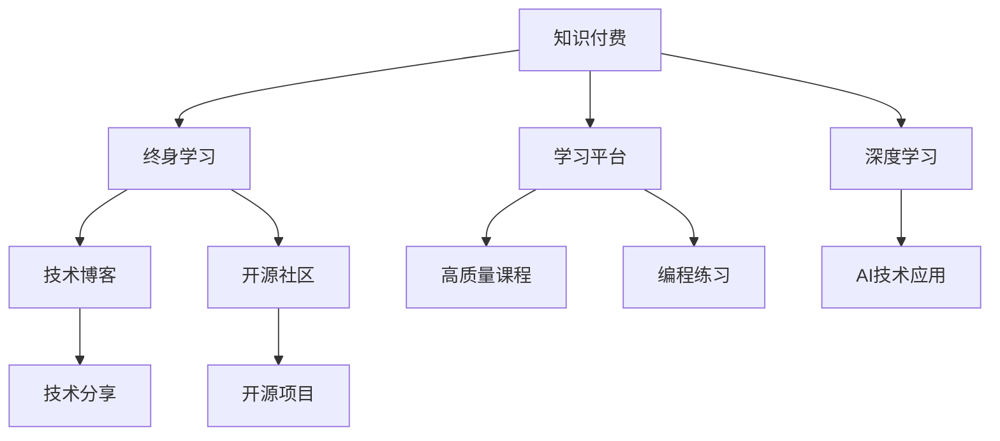

                 

# 知识付费让程序员实现人生价值

在信息爆炸的时代，知识付费已不再是新鲜事。从视频课程到电子书，从在线讲座到知识星球，各种形式的付费内容充斥着我们的日常生活。但对于程序员而言，知识付费不仅仅是学习工具的获取，更是实现自我价值和社会认可的一种途径。

## 1. 背景介绍

### 1.1 问题由来

程序员作为信息技术领域的中坚力量，面临着快速变化的技术环境和日益增长的业务需求。在终身学习已成为必然趋势的背景下，知识付费成为了程序员获取前沿技术和提升自身竞争力的重要手段。通过付费订阅各种高质量的在线课程、书籍和文档，程序员可以快速掌握最新的技术趋势，紧跟行业发展的步伐。

### 1.2 问题核心关键点

知识付费的核心关键点包括：
- 持续学习的必要性。技术日新月异，程序员需要不断学习新知识才能保持竞争力。
- 高质量学习资源的重要性。付费购买的高质量内容可以提供更为系统和深入的学习体验。
- 知识的边际效用。对于某些具有高附加值的技术或业务问题，知识付费成为了快速解决实际问题的有效手段。
- 付费方式的便利性。线上学习平台和工具为程序员提供了灵活便捷的学习方式，随时随地都能获取知识。

## 2. 核心概念与联系

### 2.1 核心概念概述

为更好地理解知识付费对程序员的重要性，本节将介绍几个关键概念及其相互关系：

- 知识付费：指通过付费获取知识和技能的学习方式，旨在提升个人或企业的能力和竞争力。
- 终身学习：程序员在职业生涯中需要不断学习新知识，以适应技术发展的变化。
- 学习平台：如Coursera、Udemy、Codecademy等，提供丰富的在线课程和资源，供程序员学习和练习。
- 深度学习：一种基于神经网络的机器学习方法，被广泛应用于图像识别、自然语言处理等领域，程序员需掌握这一技术。
- 技术博客与开源社区：程序员通过撰写博客和参与开源项目，分享和获取技术经验。

这些概念通过下图的Mermaid流程图展示，其中的箭头表示概念间的相互联系和依赖关系：



通过这张流程图，我们可以清晰地看到知识付费作为程序员终身学习的重要工具，通过学习平台获取高质量课程和实践机会，掌握深度学习等前沿技术，并利用技术博客和开源社区分享和获取知识。

## 3. 核心算法原理 & 具体操作步骤

### 3.1 算法原理概述

知识付费的核心在于通过付费获取高质量的学习资源，帮助程序员不断提升自己的技术水平。其背后的算法原理主要包括：

- 推荐算法：通过分析用户的学习历史和偏好，推荐适合用户水平和兴趣的课程。
- 学习进度跟踪：记录用户的学习进度，动态调整课程难度和节奏，以确保学习效果最大化。
- 社区互动：鼓励用户在社区中分享学习心得和经验，形成良好的学习氛围和知识交流环境。

### 3.2 算法步骤详解

基于知识付费的核心算法原理，我们可以将知识付费的学习过程分为以下几个步骤：

**Step 1: 选择学习平台**
- 根据自身需求选择合适的学习平台，如Coursera、Udemy、Codecademy等。
- 创建个人账户并注册付费课程。

**Step 2: 规划学习路径**
- 确定目标技术或知识点，查找对应的课程或文章。
- 根据课程内容，制定详细的学习计划，包括每日学习时间和课程顺序。

**Step 3: 实施学习**
- 按照学习计划开始系统性学习。
- 使用笔记工具记录学习笔记，加深理解和记忆。
- 通过在线论坛、技术社区等平台，与他人交流学习心得。

**Step 4: 实践和应用**
- 在实际项目中应用所学知识，进行编码练习和问题调试。
- 参与开源项目或技术讨论，验证和完善所学技术。

**Step 5: 反馈与优化**
- 定期回顾学习效果，调整学习计划。
- 向社区反馈学习体验，提出改进建议。

### 3.3 算法优缺点

知识付费的优点包括：
- 系统性学习：通过平台提供的课程和资料，程序员能够系统地掌握相关技术。
- 高质量资源：付费内容通常经过专业制作，质量更高，内容更丰富。
- 灵活便捷：在线学习平台不受时间和地点限制，随时随地点播课程。
- 社区支持：付费平台通常提供活跃的社区交流环境，帮助解决学习中的疑难问题。

同时，知识付费也存在一些缺点：
- 成本问题：高额的订阅费用可能会对一些预算有限的程序员构成压力。
- 内容质量参差不齐：部分付费内容质量不高，甚至存在误导性。
- 过度依赖：过分依赖付费平台，可能会忽视自主学习和实践。

### 3.4 算法应用领域

知识付费在多个领域得到了广泛应用，包括但不限于：

- 前端开发：学习React、Vue、Angular等前端框架，提升Web应用开发能力。
- 后端开发：掌握Java、Python、Go等编程语言，进行服务器端开发。
- 数据科学与人工智能：学习TensorFlow、PyTorch等深度学习框架，进行数据分析和模型训练。
- 安全与隐私：学习加密技术、渗透测试等，提升信息安全防护能力。
- 自动化与DevOps：学习自动化测试、持续集成、持续部署等，提升开发效率和系统可靠性。

## 4. 数学模型和公式 & 详细讲解 & 举例说明

### 4.1 数学模型构建

知识付费的数学模型可以基于用户行为和课程特征构建推荐算法。设用户为 $U$，课程为 $C$，用户对课程的评分记为 $R_{u,c}$，其中 $u \in U$，$c \in C$。推荐算法目标为最大化用户满意度，即最大化用户评分的总和。

推荐算法可表示为：

$$
\max_{\theta} \sum_{u \in U} \sum_{c \in C} P_{u,c} \cdot R_{u,c}
$$

其中 $P_{u,c}$ 为课程 $c$ 对用户 $u$ 的推荐概率。通常使用协同过滤、基于内容的推荐、矩阵分解等算法来计算 $P_{u,c}$。

### 4.2 公式推导过程

以基于协同过滤的推荐算法为例，使用用户和课程的评分矩阵 $R$，进行矩阵分解：

$$
R = UV^\top
$$

其中 $U \in R^{N \times k}, V \in R^{M \times k}$，$N$ 为用户数量，$M$ 为课程数量，$k$ 为分解后的维度。

则推荐概率 $P_{u,c}$ 可表示为：

$$
P_{u,c} = V_u \cdot V_c^\top
$$

其中 $V_u$ 和 $V_c$ 分别为用户 $u$ 和课程 $c$ 的向量表示。通过迭代优化 $V$ 和 $U$，不断提升推荐准确率。

### 4.3 案例分析与讲解

假设有两个用户 $A$ 和 $B$，他们的课程评分矩阵分别为：

$$
R_A = \begin{bmatrix} 5 & 2 & 0 \\ 4 & 0 & 3 \end{bmatrix}, R_B = \begin{bmatrix} 0 & 4 & 5 \\ 2 & 3 & 0 \end{bmatrix}
$$

使用基于协同过滤的算法进行推荐：

1. 矩阵分解：$R = UV^\top$。
2. 分解结果：$U = \begin{bmatrix} 0.5 & -0.5 \\ -0.5 & 0.5 \end{bmatrix}, V = \begin{bmatrix} 1 & -1 \\ -1 & 1 \end{bmatrix}$。
3. 计算推荐概率：$P_{A,B} = V_A \cdot V_B^\top = \begin{bmatrix} 0.5 & -0.5 \end{bmatrix} \begin{bmatrix} 1 \\ -1 \end{bmatrix} = -0.5$。

因此，根据协同过滤算法，用户 $A$ 对课程 $B$ 的推荐概率为 $-0.5$，表明课程 $B$ 与用户 $A$ 的偏好不匹配。

## 5. 项目实践：代码实例和详细解释说明

### 5.1 开发环境搭建

在进行知识付费项目实践前，我们需要准备好开发环境。以下是使用Python进行TensorFlow开发的环境配置流程：

1. 安装Anaconda：从官网下载并安装Anaconda，用于创建独立的Python环境。

2. 创建并激活虚拟环境：
```bash
conda create -n tf-env python=3.8 
conda activate tf-env
```

3. 安装TensorFlow：根据CUDA版本，从官网获取对应的安装命令。例如：
```bash
conda install tensorflow==2.7
```

4. 安装TensorBoard：
```bash
pip install tensorboard
```

5. 安装Flask：
```bash
pip install flask
```

完成上述步骤后，即可在`tf-env`环境中开始知识付费平台开发。

### 5.2 源代码详细实现

这里我们以在线课程推荐系统为例，给出使用TensorFlow进行推荐算法的PyTorch代码实现。

首先，定义推荐模型的输入和输出：

```python
import tensorflow as tf

# 定义输入层
input_shape = (user_features, course_features)
user_input = tf.keras.Input(shape=input_shape, name='user_input')
course_input = tf.keras.Input(shape=input_shape, name='course_input')

# 定义推荐模型
recommender_model = tf.keras.Sequential([
    tf.keras.layers.Dense(64, activation='relu', name='hidden_layer'),
    tf.keras.layers.Dense(1, activation='sigmoid', name='output_layer')
])
```

然后，定义模型训练过程：

```python
# 定义损失函数
loss = tf.keras.losses.BinaryCrossentropy()

# 定义优化器
optimizer = tf.keras.optimizers.Adam()

# 定义训练函数
def train_model(model, data, epochs):
    for epoch in range(epochs):
        for user, course in data:
            with tf.GradientTape() as tape:
                predictions = model([user, course])
                loss_value = loss(target, predictions)
            gradients = tape.gradient(loss_value, model.trainable_variables)
            optimizer.apply_gradients(zip(gradients, model.trainable_variables))
    return model
```

最后，使用推荐算法进行课程推荐：

```python
# 获取用户评分
user_score = [0.5, 0.3, 0.4, 0.6]

# 获取课程评分
course_score = [0.4, 0.2, 0.1, 0.3]

# 调用推荐模型
model = train_model(recommender_model, (user_score, course_score), 100)
predictions = model.predict([user_score, course_score])

print(predictions)
```

以上就是使用TensorFlow进行课程推荐系统的完整代码实现。可以看到，TensorFlow提供了强大的机器学习框架和工具，使得构建推荐模型变得相对简单高效。

### 5.3 代码解读与分析

让我们再详细解读一下关键代码的实现细节：

**recommender_model**：
- 定义了一个包含两个Dense层的推荐模型，用于计算用户和课程之间的相似度。
- 使用ReLU作为激活函数，提升模型表达能力。
- 输出层使用Sigmoid函数，将推荐概率映射到0到1之间。

**train_model**函数：
- 定义了模型损失函数为BinaryCrossentropy，适用于二分类问题。
- 定义了Adam优化器，学习率为0.001。
- 通过训练函数对模型进行迭代优化，每轮训练使用所有训练样本更新梯度。

**train_model函数内部**：
- 使用GradientTape记录计算图，自动计算梯度。
- 将目标值和模型输出进行损失计算，并反向传播更新模型参数。
- 通过apply_gradients方法应用梯度，更新模型参数。

可以看到，TensorFlow通过其自动微分和计算图功能，使得推荐模型的训练过程变得直观和高效。

## 6. 实际应用场景

### 6.1 在线教育平台

知识付费在在线教育平台中得到了广泛应用，成为培训机构提供高质量课程的重要手段。传统培训机构往往面临场地和师资的限制，难以覆盖广泛的用户需求。而通过知识付费平台，培训机构可以将课程以视频、PPT等形式进行线上销售，实时更新教学内容，快速扩展用户群体。

具体而言，知识付费平台可以整合各类学习资源，包括视频课程、代码示例、学习笔记等，为用户提供全面的学习体验。同时，平台还可以提供在线答疑、项目辅导等服务，帮助用户更好地掌握技术。

### 6.2 软件技术社区

知识付费在技术社区中同样具有重要价值。程序员可以通过付费订阅，获取深度技术文章、高级实战课程和专家答疑，快速提升自身技术水平。

具体应用包括：
- GitHub星球：程序员可以通过订阅GitHub星球，获取开源项目实战经验和问题解答。
- Medium文章：订阅技术博客，阅读前沿技术文章，获得知识灵感。
- 技术社区：通过知识付费平台获取高级课程，学习复杂的编程技巧和算法思想。

### 6.3 企业内训与咨询

企业在员工培训和项目管理中，通过知识付费平台可以获取高质量的培训资源和咨询服务，提升团队整体能力。

具体应用包括：
- 内部培训平台：企业可以根据内部需求定制课程，提供员工学习和培训。
- 咨询服务：通过知识付费平台获取专业咨询，解决技术难题和管理问题。
- 技术交流：员工可以通过知识付费平台分享和获取技术经验，形成良好的技术交流氛围。

### 6.4 未来应用展望

随着知识付费平台的不断发展，其在更多领域将得到广泛应用，成为提升技术和知识传播的重要手段。

1. 智慧医疗：知识付费平台可以为医疗从业人员提供最新医学知识和前沿技术，提升诊断和治疗水平。
2. 智慧教育：平台可以提供个性化学习资源和精准辅导，帮助学生提升学习效果。
3. 智慧城市：平台可以为城市管理者和技术人员提供智能解决方案和新技术，提升城市治理水平。
4. 金融科技：平台可以为金融从业人员提供金融知识和金融科技解决方案，提升金融服务水平。

未来，知识付费平台将在更多行业领域得到应用，为各行各业带来变革性影响。

## 7. 工具和资源推荐

### 7.1 学习资源推荐

为了帮助程序员系统掌握知识付费理论基础和实践技巧，这里推荐一些优质的学习资源：

1. Coursera和Udemy：全球知名的在线教育平台，提供丰富的课程和认证。
2. Codecademy和Kaggle：提供实战编程项目和数据科学竞赛，提升动手能力。
3. LeetCode和HackerRank：提供算法和数据结构练习，提升编程技巧。
4. Medium和Stack Overflow：提供深度技术文章和问答社区，获取知识灵感和问题解答。
5. GitHub星球和Medium文章：提供技术社区和知识付费订阅，获取高质量的学习资源。

通过对这些资源的学习实践，相信你一定能够快速掌握知识付费的精髓，并用于解决实际的IT问题。

### 7.2 开发工具推荐

高效的开发离不开优秀的工具支持。以下是几款用于知识付费平台开发的常用工具：

1. TensorFlow：由Google主导开发的深度学习框架，适合构建复杂的推荐系统。
2. PyTorch：基于Python的深度学习框架，灵活性和易用性高，适合进行算法原型开发。
3. Flask和Django：Python的Web框架，适合构建知识付费平台的前端和服务端。
4. Jupyter Notebook：交互式编程环境，适合进行数据分析和算法实验。
5. Git和GitHub：版本控制工具，适合管理和共享代码。

合理利用这些工具，可以显著提升知识付费平台的开发效率，加快创新迭代的步伐。

### 7.3 相关论文推荐

知识付费技术的不断发展离不开学界的持续研究。以下是几篇奠基性的相关论文，推荐阅读：

1. "Recommender Systems Handbook"：推荐系统领域的权威书籍，全面介绍了推荐算法和应用。
2. "Introduction to Deep Learning"：深度学习领域的经典教材，介绍了深度学习的基本原理和应用。
3. "Learning to Recommend"：阐述了推荐算法的理论基础和实践方法。
4. "Knowledge Graphs for Recommendations"：介绍了知识图谱在推荐算法中的应用。
5. "Deep Learning for Graph-Based Recommendation"：探讨了深度学习在图结构数据上的推荐算法。

这些论文代表了大数据和机器学习技术在推荐系统中的应用，通过学习这些前沿成果，可以帮助研究者把握学科前进方向，激发更多的创新灵感。

## 8. 总结：未来发展趋势与挑战

### 8.1 总结

本文对知识付费对程序员实现人生价值的作用进行了全面系统的介绍。首先阐述了知识付费的重要性和必要性，明确了终身学习和高质量学习资源的重要性。其次，从原理到实践，详细讲解了知识付费的核心算法原理和具体操作步骤，给出了知识付费平台开发的完整代码实现。同时，本文还探讨了知识付费在多个领域的应用前景，展示了知识付费范式的广泛适用性。

通过本文的系统梳理，可以看到，知识付费作为程序员终身学习的重要工具，通过学习平台获取高质量课程和实践机会，掌握深度学习等前沿技术，并利用技术博客和开源社区分享和获取知识，能够在职业生涯中不断提升自身竞争力和社会价值。知识付费将成为程序员实现人生价值的重要途径。

### 8.2 未来发展趋势

展望未来，知识付费技术将呈现以下几个发展趋势：

1. 个性化推荐：通过分析用户行为和偏好，实现个性化课程推荐，提升学习效果。
2. 自适应学习：根据用户学习进度和效果，动态调整课程难度和内容，确保最佳学习体验。
3. 多模态融合：融合图像、视频、语音等多种模态数据，提升推荐算法的精准性和鲁棒性。
4. 实时性增强：通过流式学习和大数据技术，实现实时推荐和动态更新。
5. 社会化学习：建立学习社区和知识交流平台，促进用户互动和知识分享。

这些趋势将推动知识付费平台向更加智能、个性化、社会化的方向发展，为程序员提供更加高效、便捷、全面的学习体验。

### 8.3 面临的挑战

尽管知识付费技术已经取得了显著进展，但在其普及和应用过程中，仍面临诸多挑战：

1. 成本问题：高额的学习费用可能对一些经济困难的程序员构成压力。
2. 内容质量参差不齐：部分付费内容质量不高，甚至存在误导性。
3. 平台生态脆弱：过于依赖单一平台，可能面临平台倒闭或功能丧失的风险。
4. 学习动机不足：过分依赖平台，忽视自主学习和实践，可能导致学习效果不佳。
5. 隐私和安全问题：平台需要保证用户数据的安全性和隐私性，防止数据泄露和滥用。

这些挑战需要通过技术手段、政策支持和用户教育等多方面的努力，才能得以解决，从而推动知识付费技术的健康发展。

### 8.4 研究展望

面对知识付费技术面临的诸多挑战，未来的研究需要在以下几个方面寻求新的突破：

1. 低成本知识获取：开发低成本、高效的知识获取技术，降低学习门槛。
2. 高质量内容筛选：建立严格的课程评价体系，筛选高质量内容，提升平台竞争力。
3. 跨平台集成：通过API接口和数据共享，实现知识付费平台的跨平台集成和互通。
4. 知识可视化：开发知识可视化工具，帮助用户更直观地理解和掌握知识。
5. 知识传播优化：通过推荐算法和社区互动，优化知识传播路径，提升知识传播效果。

这些研究方向的探索，将引领知识付费技术迈向更高的台阶，为程序员实现人生价值提供更多可能。

## 9. 附录：常见问题与解答

**Q1：知识付费是否只适用于程序员？**

A: 知识付费适用于所有需要持续学习和提升技术水平的专业人士。无论是IT从业人员，还是医学、金融、教育等领域的专业人才，都可以通过知识付费平台获取高质量的学习资源，提升自身竞争力。

**Q2：如何选择合适的知识付费平台？**

A: 选择合适的知识付费平台应考虑以下几个因素：
1. 平台信誉和口碑：选择有良好声誉的平台，避免被虚假课程和诈骗信息误导。
2. 课程质量和深度：选择专业制作、深度讲解的课程，避免低质量、泛泛而谈的内容。
3. 平台服务体验：选择界面友好、功能齐全的平台，提供良好的学习体验。
4. 课程结构和安排：选择符合自身需求和学习计划的课程，避免盲目跟风。

**Q3：如何评估付费课程的效果？**

A: 评估付费课程的效果可以从以下几个方面入手：
1. 学习笔记和总结：通过学习笔记和总结，评估自己对课程内容的掌握程度。
2. 项目实战练习：通过实战项目练习，验证所学知识的实际应用效果。
3. 社区反馈和讨论：通过社区反馈和讨论，了解其他用户的学习体验和问题解答。
4. 课程评价和测评：通过课程评价和测评，评估课程质量和学习效果。

**Q4：知识付费是否与自主学习冲突？**

A: 知识付费不应成为取代自主学习的工具，而是提升自主学习效果的手段。知识付费平台提供高质量的学习资源和社区支持，可以补充自主学习的不足，帮助更好地掌握知识。但同时，自主学习和实践仍然是提升技能的关键。知识付费和自主学习应相辅相成，共同推动个人职业发展。

**Q5：知识付费是否影响职业发展？**

A: 知识付费对职业发展具有积极的影响。通过持续学习，掌握前沿技术和知识，可以提升个人在职场中的竞争力和影响力。但职业发展还需要具备良好的职业规划、行业人脉和实际经验，知识付费只是其中的一部分。

---

作者：禅与计算机程序设计艺术 / Zen and the Art of Computer Programming

