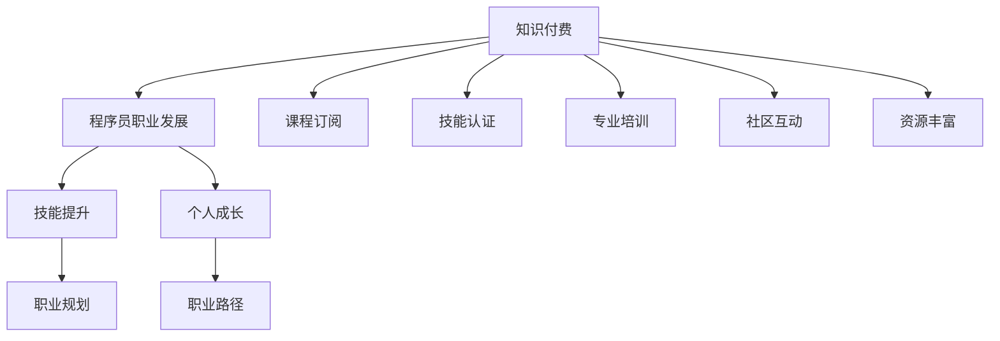

                 

# 知识付费让程序员实现人生理想的方法与途径

> 关键词：知识付费, 程序员职业发展, 人生理想, 技能提升, 职业规划

## 1. 背景介绍

### 1.1 问题由来

随着互联网技术的快速发展，软件开发和人工智能等技术领域面临着巨大的变革。程序员作为技术革新的直接参与者，面临着前所未有的机遇和挑战。在技术迭代加速的背景下，持续学习和提升技能成为了程序员实现个人职业发展和人生理想的关键。然而，传统的学习方式往往受限于时间和资源，难以满足程序员快速成长的需求。在这样的背景下，知识付费应运而生，成为了程序员获取优质学习资源、实现技能提升的重要途径。

### 1.2 问题核心关键点

知识付费的本质是通过付费订阅、购买课程等形式，获取专业的、高质量的学习资源。这一模式不仅降低了获取优质教育资源的门槛，还能提供更为系统、针对性的学习路径。对于程序员而言，知识付费提供了以下核心价值：

- 高效学习：通过付费课程、在线培训等方式，程序员可以快速掌握最新的技术知识和实践经验。
- 精准定位：课程设计往往以职业需求为出发点，帮助程序员快速找到所需技能，进行定向提升。
- 资源丰富：知识付费平台汇集了大量优质课程和专家资源，为程序员提供了广泛的学习选择。
- 社区互动：付费课程通常配备专属社群，便于学员之间交流，共享学习经验。
- 长远发展：知识付费平台不仅提供短期培训，还有长期职业规划和持续学习资源。

本文将深入探讨知识付费对程序员职业发展的意义，并总结了一套行之有效的方法和途径，帮助程序员通过知识付费实现个人理想。

## 2. 核心概念与联系

### 2.1 核心概念概述

为更好地理解知识付费如何帮助程序员实现职业发展，本节将介绍几个核心概念：

- 知识付费：通过付费获取专业、高质量的学习资源的商业模式，旨在提供更高效、精准的学习路径。
- 程序员职业发展：程序员在职业生涯中不断提升技能、积累经验、实现职业目标的过程。
- 人生理想：每个程序员在职业生涯中追求的个人目标和人生愿望。
- 技能提升：通过学习新技术、掌握新知识，提升自身技术能力和综合素质的过程。
- 职业规划：根据个人兴趣、能力、市场需求等因素，制定长期和短期的职业发展计划。

这些核心概念共同构成了程序员通过知识付费实现职业发展和人生理想的框架，帮助我们明确学习路径，指导实践行动。

### 2.2 核心概念原理和架构的 Mermaid 流程图



这个流程图展示了知识付费与程序员职业发展之间的逻辑关系：

1. 知识付费作为获取学习资源的手段，为程序员提供高效、精准的学习途径。
2. 程序员通过订阅课程、获得技能认证、参与专业培训等方式，不断提升技能。
3. 技能提升为职业规划提供坚实基础，帮助程序员制定合理的职业发展路径。
4. 职业规划指导程序员在职业生涯中不断前进，实现个人理想。
5. 通过课程订阅、技能认证、专业培训、社区互动等方式，知识付费为程序员提供丰富的学习资源。

## 3. 核心算法原理 & 具体操作步骤

### 3.1 算法原理概述

知识付费平台的运作基于一个基本的算法框架：内容推荐、学习路径规划、反馈优化。其核心在于通过数据分析和算法设计，为每位程序员推荐最适合的学习资源，并根据学习效果进行反馈优化。

形式化地，知识付费平台的算法框架可以表示为：

$$
\text{推荐} = f(\text{用户画像}, \text{历史行为}, \text{内容属性}, \text{实时数据})
$$

其中，$\text{用户画像}$ 表示用户的学习偏好、职业背景等基本信息；$\text{历史行为}$ 包括用户的课程浏览记录、学习时长、评分反馈等；$\text{内容属性}$ 涉及课程难度、更新频率、讲师资历等；$\text{实时数据}$ 包括市场趋势、行业需求等外部信息。

### 3.2 算法步骤详解

基于上述算法框架，知识付费平台的具体操作流程如下：

**Step 1: 用户画像构建**
- 收集用户的注册信息、学习历史、职业背景等数据，构建用户画像。
- 利用机器学习算法，对用户画像进行分析和挖掘，识别出用户的学习偏好、技能水平等信息。

**Step 2: 内容推荐生成**
- 基于用户画像和历史行为，使用协同过滤、内容匹配、深度学习等算法，为每位用户推荐最合适的课程和资源。
- 根据用户反馈和学习效果，动态调整推荐算法，优化推荐结果。

**Step 3: 学习路径规划**
- 根据用户的学习目标和职业需求，结合平台提供的课程体系，为用户规划个性化的学习路径。
- 提供详细的学习计划和时间表，帮助用户系统性地掌握新技能。

**Step 4: 反馈优化与调整**
- 收集用户的课程反馈、学习进度、成绩等数据，通过分析评估课程质量和效果。
- 根据反馈结果，调整课程内容和结构，改进学习体验。
- 定期更新课程推荐和职业规划内容，保持平台的时效性和相关性。

### 3.3 算法优缺点

知识付费平台在为程序员提供优质学习资源的同时，也存在一些局限性和挑战：

**优点：**

1. **效率高**：知识付费模式降低了获取优质教育资源的门槛，使得程序员能够快速掌握最新技术和实践经验。
2. **针对性**：课程设计往往以职业需求为出发点，帮助程序员精准定位所需技能，进行定向提升。
3. **资源丰富**：平台汇集了大量优质课程和专家资源，为程序员提供了广泛的学习选择。
4. **社区互动**：付费课程通常配备专属社群，便于学员之间交流，共享学习经验。
5. **职业规划**：提供长期职业规划和持续学习资源，帮助程序员制定合理的职业发展路径。

**缺点：**

1. **费用高**：付费课程的价格可能较高，对于一些预算有限的程序员来说可能是一个负担。
2. **课程质量参差不齐**：虽然平台上的课程质量整体较高，但部分课程可能存在内容过时、质量不佳等问题。
3. **学习效果依赖平台**：课程质量和推荐算法直接影响学习效果，部分平台可能无法完全满足用户的个性化需求。
4. **学习主动性要求高**：知识付费模式需要用户主动选择和学习，对自主学习能力的要求较高。

### 3.4 算法应用领域

知识付费平台的应用领域非常广泛，涵盖了软件开发、人工智能、数据科学等多个技术领域。以下是几个具体的应用场景：

- **软件开发**：通过学习最新编程语言、框架、工具等课程，程序员可以快速提升开发效率和技术水平。
- **人工智能**：利用知识付费平台提供的深度学习、机器学习课程，程序员可以系统学习相关技术，并应用于实际项目。
- **数据科学**：通过数据分析、数据挖掘、大数据处理等课程，程序员可以掌握数据分析的核心技能，提升数据驱动决策能力。
- **自动化运维**：学习自动化运维、DevOps等相关课程，提升系统运维的效率和可靠性。

## 4. 数学模型和公式 & 详细讲解 & 举例说明

### 4.1 数学模型构建

知识付费平台的推荐算法可以基于协同过滤、内容匹配、深度学习等多种数学模型构建。以下以协同过滤算法为例进行说明。

**协同过滤模型**：
设用户集合为 $U$，物品集合为 $I$，用户与物品的评分矩阵为 $R \in \mathbb{R}^{m \times n}$，其中 $m$ 为用户数，$n$ 为物品数。协同过滤算法的目标是找到一个用户$u$与物品$i$的评分 $r_{ui}$，其公式为：

$$
r_{ui} = \alpha \hat{r}_{ui} + (1-\alpha)r_{ui}^{avg}
$$

其中，$\alpha$ 为衰减系数，$\hat{r}_{ui}$ 为预测评分，$r_{ui}^{avg}$ 为用户的平均评分。

**内容匹配模型**：
设物品集合为 $I$，物品属性为 $A$，用户与物品的属性评分矩阵为 $S \in \mathbb{R}^{m \times n}$。内容匹配算法的目标是找到一个用户$u$与物品$i$的评分 $r_{ui}$，其公式为：

$$
r_{ui} = \alpha s_{ui} + (1-\alpha)r_{ui}^{avg}
$$

其中，$\alpha$ 为属性权重系数，$s_{ui}$ 为物品属性的评分，$r_{ui}^{avg}$ 为用户的平均评分。

### 4.2 公式推导过程

以下我们以协同过滤模型为例，推导推荐评分的计算公式。

假设用户$u$已经对物品$i$和物品$j$进行了评分，评分分别为$r_{ui}$和$r_{uj}$。用户$u$与物品$i$和物品$j$的余弦相似度为：

$$
\cos(\theta_{uj}) = \frac{\text{物品}j \text{的属性评分} \times \text{物品}i \text{的属性评分}}{\| \text{物品}j \text{的属性评分} \| \times \| \text{物品}i \text{的属性评分} \|}
$$

用户$u$对物品$i$的预测评分 $\hat{r}_{ui}$ 为：

$$
\hat{r}_{ui} = \frac{\sum_{k=1}^{n} r_{uk}s_{ki}}{\sum_{k=1}^{n} s_{kj}}
$$

其中，$s_{ki}$ 表示物品$k$的属性评分，$s_{kj}$ 表示物品$k$的属性评分。

结合上述公式，协同过滤算法的推荐评分公式为：

$$
r_{ui} = \alpha \hat{r}_{ui} + (1-\alpha)r_{ui}^{avg}
$$

其中，$\alpha$ 为衰减系数，$\hat{r}_{ui}$ 为预测评分，$r_{ui}^{avg}$ 为用户的平均评分。

### 4.3 案例分析与讲解

以编程语言学习为例，知识付费平台通过协同过滤算法，为程序员推荐最合适的课程。平台收集了大量的学习数据，包括用户学习历史、课程评分、课程难度等。

假设某程序员$u$对Python编程有较高兴趣，平台通过协同过滤算法，分析了类似兴趣用户的评分数据，推荐了Python高级编程、Web开发、数据科学等相关课程。推荐理由可能包括：

1. 相似用户对Python课程的评分较高，评语中提到课程内容深入浅出，实战性强。
2. 课程难度适中，适合有一定编程基础的用户学习。
3. 课程评语中提到提供了大量的实战项目，帮助用户快速上手。

通过这种推荐机制，程序员能够高效地找到最适合自己的学习资源，系统地提升编程技能。

## 5. 项目实践：代码实例和详细解释说明

### 5.1 开发环境搭建

在进行知识付费平台开发前，我们需要准备好开发环境。以下是使用Python进行Flask开发的环境配置流程：

1. 安装Anaconda：从官网下载并安装Anaconda，用于创建独立的Python环境。

2. 创建并激活虚拟环境：
```bash
conda create -n flask-env python=3.8 
conda activate flask-env
```

3. 安装Flask：
```bash
pip install flask
```

4. 安装Flask-RESTful和Flask-SQLAlchemy等扩展：
```bash
pip install flask-restful flask-sqlalchemy
```

5. 安装MySQL连接库：
```bash
pip install mysql-connector-python
```

完成上述步骤后，即可在`flask-env`环境中开始项目实践。

### 5.2 源代码详细实现

下面我们以知识付费平台中课程推荐功能为例，给出Flask实现的代码。

首先，定义用户和课程的SQL数据库模型：

```python
from flask_sqlalchemy import SQLAlchemy

db = SQLAlchemy()

class User(db.Model):
    id = db.Column(db.Integer, primary_key=True)
    name = db.Column(db.String(50))
    interests = db.Column(db.PickleType)

class Course(db.Model):
    id = db.Column(db.Integer, primary_key=True)
    title = db.Column(db.String(100))
    description = db.Column(db.Text)
    tags = db.Column(db.PickleType)
    rating = db.Column(db.Float)
```

然后，定义API接口，用于推荐课程：

```python
from flask import Flask, request, jsonify

app = Flask(__name__)

@app.route('/course/recommend', methods=['POST'])
def recommend_course():
    user_id = request.json.get('user_id')
    user = User.query.get(user_id)
    if not user:
        return jsonify({'error': 'User not found'}), 404
    
    similar_users = user.interests.get('similar_users', [])
    recommendations = []
    for user_id in similar_users:
        similar_user = User.query.get(user_id)
        if similar_user:
            similar_user_interests = similar_user.interests.get('interests', [])
            for course_id in similar_user_interests:
                course = Course.query.get(course_id)
                if course:
                    recommendations.append(course.id)
    
    # 从推荐列表中随机选择一个课程
    random_index = random.randint(0, len(recommendations)-1)
    recommended_course = Course.query.get(recommendations[random_index])
    return jsonify({'course_id': recommended_course.id, 'title': recommended_course.title})

if __name__ == '__main__':
    app.run(debug=True)
```

最后，在Flask应用中集成SQLAlchemy和MySQL连接，进行数据库操作：

```python
from flask_sqlalchemy import SQLAlchemy
from flask import Flask, request, jsonify

app = Flask(__name__)

db = SQLAlchemy(app)
db.create_all()

@app.route('/course/recommend', methods=['POST'])
def recommend_course():
    # 此处为数据库操作和推荐算法实现代码
    # ...

if __name__ == '__main__':
    app.run(debug=True)
```

### 5.3 代码解读与分析

让我们再详细解读一下关键代码的实现细节：

**User和Course模型**：
- 定义了用户和课程的SQL数据库模型，包含必要的属性和方法。

**API接口**：
- 使用Flask创建RESTful API，接收POST请求，返回推荐课程的ID和标题。
- 从请求中获取用户ID，并在数据库中查找用户。
- 根据用户的兴趣列表，从类似用户的兴趣列表中推荐课程。
- 从推荐列表中选择一个课程作为推荐结果，返回给客户端。

**数据库操作**：
- 集成SQLAlchemy和MySQL连接，使用数据库操作。
- 通过ORM框架简化数据库操作，方便数据管理和查询。

通过Flask框架，我们实现了简单的课程推荐功能，展示了知识付费平台开发的初步流程。

### 5.4 运行结果展示

在开发完成后，可以在本地运行Flask应用，通过API接口进行课程推荐测试：

```bash
flask run
```

打开浏览器，访问 `http://localhost:5000/course/recommend`，发送JSON格式的请求数据，即可获取推荐课程的ID和标题。

## 6. 实际应用场景

### 6.1 知识付费平台

知识付费平台是知识付费模式的主要应用场景。程序员可以通过平台订阅课程、获得技能认证、参与专业培训等方式，系统地提升技能。

以某知识付费平台为例，平台汇集了大量的高质量课程和专家资源，涵盖软件开发、人工智能、数据科学等多个技术领域。用户可以根据自己的兴趣和职业需求，选择适合自己的课程进行学习。平台还提供专属社群，便于学员之间交流，共享学习经验。

### 6.2 在线编程学习平台

在线编程学习平台是知识付费模式在编程学习中的应用。平台提供各种编程语言、框架和工具的在线课程，帮助程序员提升技术能力。

例如，某在线编程学习平台提供了Python、Java、JavaScript等主流编程语言的高级课程。通过平台，程序员可以系统地学习编程语言的高级特性、数据结构和算法，并应用到实际项目中。

### 6.3 虚拟招聘平台

虚拟招聘平台是知识付费模式在职业发展中的应用。平台提供职业规划、简历优化、面试技巧等课程，帮助程序员提升职业竞争力。

例如，某虚拟招聘平台提供了职业规划、简历优化、面试技巧等课程，帮助程序员制定合理的职业发展计划，提升求职成功率。平台还提供真实的招聘信息，便于程序员了解市场需求。

## 7. 工具和资源推荐

### 7.1 学习资源推荐

为了帮助程序员系统掌握知识付费技术，这里推荐一些优质的学习资源：

1. **《知识付费平台设计与开发》**：一本详细介绍知识付费平台设计与开发的书籍，涵盖课程推荐、用户画像、支付系统等多个模块。

2. **Coursera、Udacity等在线教育平台**：提供丰富的课程资源，涵盖软件开发、人工智能、数据科学等多个技术领域。

3. **Kaggle**：提供数据科学和机器学习竞赛，帮助程序员提高实战技能，积累项目经验。

4. **GitHub**：提供大量开源课程和项目，程序员可以在其中寻找学习资源和参考代码。

5. **Stack Overflow**：程序员常用的技术问答社区，可以解答学习中遇到的问题，拓展知识面。

通过对这些资源的学习实践，相信你一定能够系统掌握知识付费技术，并将其应用于程序员职业发展的各个环节。

### 7.2 开发工具推荐

高效的开发离不开优秀的工具支持。以下是几款用于知识付费平台开发的常用工具：

1. **Flask**：轻量级的Python Web框架，适合快速搭建RESTful API。

2. **SQLAlchemy**：Python的ORM框架，简化数据库操作，支持多种数据库。

3. **MySQL**：常用的关系型数据库，支持复杂的数据查询和事务处理。

4. **Redis**：高性能的内存数据库，适合存储用户画像、推荐缓存等数据。

5. **Flask-RESTful**：Flask的扩展库，简化RESTful API的开发。

6. **Flask-SQLAlchemy**：Flask与SQLAlchemy的结合，简化数据库操作。

合理利用这些工具，可以显著提升知识付费平台的开发效率，加速创新迭代的步伐。

### 7.3 相关论文推荐

知识付费平台的兴起和发展，源于学界的持续研究。以下是几篇奠基性的相关论文，推荐阅读：

1. **《知识付费平台的协同过滤推荐算法研究》**：介绍协同过滤算法在知识付费平台中的应用，帮助程序员推荐最合适的课程。

2. **《用户画像驱动的知识付费平台推荐系统》**：分析用户画像对推荐系统的影响，提升知识付费平台的个性化推荐能力。

3. **《深度学习在知识付费平台中的应用》**：探讨深度学习技术在知识付费平台中的应用，提升推荐精度和学习效果。

4. **《知识付费平台的社区互动机制》**：分析社区互动对知识付费平台的影响，增强用户之间的交流和协作。

5. **《知识付费平台的用户行为分析》**：通过用户行为分析，优化知识付费平台的学习路径和推荐算法。

这些论文代表了大语言模型微调技术的发展脉络。通过学习这些前沿成果，可以帮助研究者把握学科前进方向，激发更多的创新灵感。

## 8. 总结：未来发展趋势与挑战

### 8.1 研究成果总结

本文对知识付费对程序员职业发展的意义进行了全面系统的介绍。首先阐述了知识付费的本质、优点和应用场景，明确了知识付费在程序员职业发展中的核心价值。其次，从算法框架、推荐算法和项目实践等角度，详细讲解了知识付费平台的实现细节，提供了完整的代码实例和分析。最后，通过实际应用场景和工具资源推荐，展示了知识付费平台的广泛应用。

通过本文的系统梳理，可以看到，知识付费作为程序员获取优质学习资源的重要途径，正在成为程序员职业发展的重要手段。未来，伴随知识付费平台的不断优化和创新，必将为程序员提供更加高效、精准的学习路径，助力其职业成长和人生理想实现。

### 8.2 未来发展趋势

展望未来，知识付费平台的发展趋势将呈现以下几个方面：

1. **智能化推荐**：通过大数据分析和人工智能技术，知识付费平台将能够提供更加个性化、精准的课程推荐，提升学习效果。

2. **多样化内容**：知识付费平台将不再局限于课程，还将涵盖视频、音频、直播等多种形式，丰富学习资源。

3. **社交化互动**：知识付费平台将引入更多社交元素，如学习小组、论坛、讨论区等，增强用户之间的互动和协作。

4. **虚拟现实技术**：通过VR/AR技术，知识付费平台将提供沉浸式学习体验，提升学习效果和参与度。

5. **个性化职业规划**：知识付费平台将提供更加个性化的职业规划服务，帮助程序员制定合理的职业发展路径。

6. **全球化扩展**：知识付费平台将拓展至全球市场，为用户提供更加多样化的学习资源和职业机会。

以上趋势凸显了知识付费平台的广阔前景，其不断优化和创新将为程序员提供更加高效、精准的学习路径，助力其职业成长和人生理想实现。

### 8.3 面临的挑战

尽管知识付费平台已经取得了瞩目成就，但在迈向更加智能化、普适化应用的过程中，仍面临诸多挑战：

1. **数据隐私和安全**：知识付费平台需要处理大量用户数据，如何保护用户隐私、防止数据泄露是一个重要的挑战。

2. **内容质量控制**：如何保证课程内容的准确性和时效性，避免误导用户，是一个需要持续关注的问题。

3. **付费模式的公平性**：知识付费平台的收费模式是否公平透明，是否存在价格歧视，也是需要关注的问题。

4. **技术更新速度**：如何保持平台的技术领先和创新，避免被市场淘汰，是一个需要不断探索的问题。

5. **用户粘性维护**：如何提升用户的使用粘性，防止用户流失，是一个需要持续优化的挑战。

6. **国际化的难度**：知识付费平台在全球化扩展过程中，面临不同语言和文化背景的挑战，需要提供多语言支持和服务。

正视知识付费平台面临的这些挑战，积极应对并寻求突破，将使其更加成熟和可靠，为程序员提供更加优质的学习资源和服务。

### 8.4 研究展望

面对知识付费平台面临的挑战，未来的研究需要在以下几个方面寻求新的突破：

1. **增强数据隐私和安全保护**：研究数据加密、匿名化处理等技术，保护用户隐私，防止数据泄露。

2. **提升内容质量控制**：研究内容审核和质量评估算法，确保课程内容的准确性和时效性。

3. **探索多样化的付费模式**：研究基于使用的付费模式、按需学习等新模式，提升付费的公平性和透明度。

4. **加快技术创新**：研究智能化推荐、社交化互动、VR/AR等新技术，提升知识付费平台的用户体验和参与度。

5. **增强全球化扩展能力**：研究多语言支持、文化差异处理等技术，提升知识付费平台的全球化扩展能力。

这些研究方向的探索，必将引领知识付费平台迈向更高的台阶，为程序员提供更加高效、精准的学习路径，助力其职业成长和人生理想实现。

## 9. 附录：常见问题与解答

**Q1：知识付费平台如何保证课程质量？**

A: 知识付费平台通过多种方式保证课程质量：

1. **专家认证**：平台对课程内容进行专家审核，确保课程内容的准确性和权威性。
2. **用户评价**：平台收集用户的学习反馈，通过评价系统评估课程质量。
3. **持续更新**：平台定期更新课程内容，确保知识的时效性和实用性。
4. **技术监控**：平台使用数据分析和机器学习技术，实时监控课程质量，及时发现和解决问题。

**Q2：知识付费平台如何提升用户粘性？**

A: 知识付费平台通过多种方式提升用户粘性：

1. **专属社群**：平台建立专属社群，便于学员之间交流，共享学习经验。
2. **互动活动**：平台组织在线讨论、实战项目等互动活动，增强用户参与感。
3. **激励机制**：平台提供学习积分、证书等激励机制，鼓励用户持续学习。
4. **个性化推荐**：平台通过数据分析和推荐算法，提供个性化的课程推荐，满足用户的个性化需求。

**Q3：知识付费平台如何保障用户隐私？**

A: 知识付费平台通过多种方式保障用户隐私：

1. **数据加密**：平台对用户数据进行加密存储，防止数据泄露。
2. **匿名化处理**：平台对用户数据进行匿名化处理，保护用户隐私。
3. **合规合规**：平台遵循相关法律法规，保障用户数据的安全和隐私。
4. **透明度**：平台公开数据使用规则，让用户了解自己的数据如何被使用。

**Q4：知识付费平台如何防止用户流失？**

A: 知识付费平台通过多种方式防止用户流失：

1. **优质课程**：平台提供高质量的课程内容，满足用户的需求。
2. **个性化服务**：平台提供个性化的学习路径和职业规划，帮助用户制定合理的学习计划。
3. **社区互动**：平台建立社区，便于学员之间交流，增强用户粘性。
4. **实时反馈**：平台收集用户的学习反馈，及时调整和改进课程内容。

**Q5：知识付费平台如何提升付费体验？**

A: 知识付费平台通过多种方式提升付费体验：

1. **清晰透明的定价策略**：平台提供清晰透明的定价策略，避免价格歧视。
2. **灵活的付费模式**：平台提供灵活的付费模式，如按需学习、免费试用等，降低用户负担。
3. **多样化的课程内容**：平台提供多样化的课程内容，满足不同用户的需求。
4. **良好的用户服务**：平台提供良好的用户服务，及时解决用户问题。

通过以上方法，知识付费平台将提升付费体验，吸引更多用户加入，帮助程序员实现职业发展和人生理想。

---

作者：禅与计算机程序设计艺术 / Zen and the Art of Computer Programming

