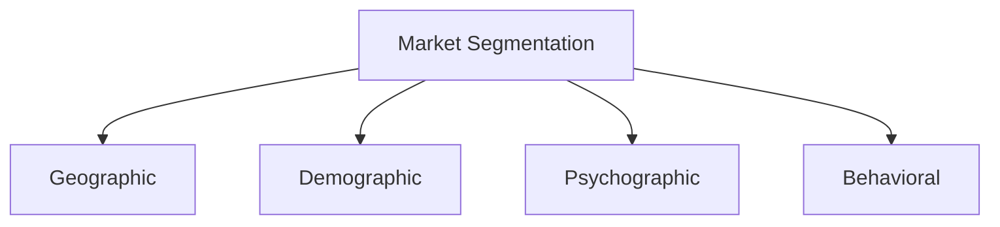
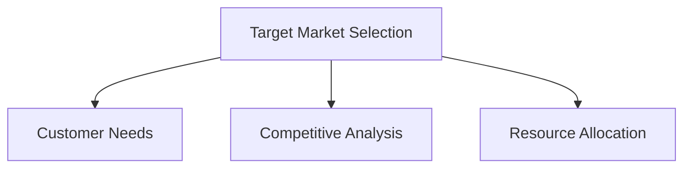
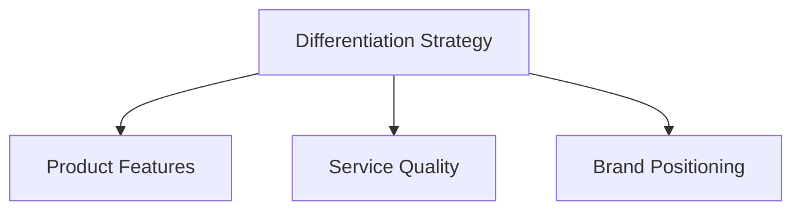

                 

# AI创业公司的产品市场定位：市场细分、目标市场与差异化策略

> 关键词：AI创业公司、市场细分、目标市场、差异化策略

> 摘要：本文深入探讨了AI创业公司在产品市场定位中的关键问题，包括市场细分、目标市场和差异化策略。通过逐步分析，我们提供了实用的方法和策略，帮助AI创业公司明确市场定位，提高市场竞争力。

## 1. 背景介绍（Background Introduction）

在当今快速发展的科技时代，人工智能（AI）已成为推动企业创新和增长的关键力量。AI创业公司如雨后春笋般涌现，竞争日益激烈。为了在市场中脱颖而出，AI创业公司需要制定有效的产品市场定位策略。市场细分、目标市场选择和差异化策略是这一过程中不可或缺的组成部分。

市场细分（Market Segmentation）是指将一个广泛的市场划分为若干个具有相似需求和特征的子市场。目标市场（Target Market）则是公司选择重点服务的市场细分部分。差异化策略（Differentiation Strategy）是指公司在产品或服务上实现与竞争对手区分的途径。本文将围绕这三个核心概念展开讨论。

## 2. 核心概念与联系（Core Concepts and Connections）

### 2.1 市场细分（Market Segmentation）

市场细分是将整个市场分割成若干具有相似特征的子市场。这可以通过多种方式进行，包括地理、人口、心理和行为因素。

**Mermaid 流程图：**



### 2.2 目标市场（Target Market）

目标市场是公司选择重点服务的市场细分部分。正确识别目标市场有助于公司集中资源，提供更符合客户需求的产品或服务。

**Mermaid 流程图：**



### 2.3 差异化策略（Differentiation Strategy）

差异化策略是指公司通过产品或服务的独特特性，与竞争对手区分开来。这可以通过产品特性、服务质量、品牌定位等方式实现。

**Mermaid 流程图：**



## 3. 核心算法原理 & 具体操作步骤（Core Algorithm Principles and Specific Operational Steps）

### 3.1 市场细分算法（Market Segmentation Algorithm）

市场细分算法通常基于客户数据的分析。以下是具体步骤：

1. 收集数据：收集与市场相关的数据，包括地理、人口、心理和行为因素。
2. 数据清洗：清洗和整理数据，确保数据质量和准确性。
3. 数据分析：使用统计方法对数据进行分析，识别市场细分变量。
4. 市场细分：根据分析结果，将市场划分为若干子市场。

### 3.2 目标市场选择算法（Target Market Selection Algorithm）

目标市场选择算法通常基于对市场细分结果的评估。以下是具体步骤：

1. 评估市场细分结果：评估各个子市场的潜在价值和吸引力。
2. 确定目标市场：根据评估结果，选择具有最大潜力和竞争优势的子市场。
3. 资源分配：根据目标市场的需求，合理分配资源。

### 3.3 差异化策略算法（Differentiation Strategy Algorithm）

差异化策略算法通常基于对竞争对手的分析。以下是具体步骤：

1. 分析竞争对手：分析竞争对手的产品、服务、品牌定位等。
2. 识别差异化点：根据分析结果，识别公司的差异化点。
3. 实施差异化策略：根据差异化点，制定并实施差异化策略。

## 4. 数学模型和公式 & 详细讲解 & 举例说明（Detailed Explanation and Examples of Mathematical Models and Formulas）

### 4.1 市场细分模型（Market Segmentation Model）

市场细分模型可以使用聚类分析（Cluster Analysis）实现。以下是一个简单的聚类分析公式：

$$
C = \{c_1, c_2, ..., c_n\}
$$

其中，$C$表示聚类结果，$c_i$表示第$i$个聚类结果。

**示例：**

假设我们有一个包含1000个客户的数据集，我们使用K-Means算法将数据划分为5个聚类。通过计算，我们得到以下聚类结果：

$$
C = \{c_1, c_2, c_3, c_4, c_5\}
$$

其中，$c_1$表示第一类客户，$c_2$表示第二类客户，以此类推。

### 4.2 目标市场选择模型（Target Market Selection Model）

目标市场选择模型可以使用最大化收益模型（Maximizing Profit Model）实现。以下是一个简单的最大化收益公式：

$$
\max P(c) = \sum_{i=1}^{n} p_i \cdot R_i
$$

其中，$P(c)$表示总收益，$p_i$表示第$i$个市场细分的概率，$R_i$表示第$i$个市场细分带来的收益。

**示例：**

假设我们有一个包含5个市场细分的数据集，每个市场细分的概率和收益如下：

$$
\begin{array}{|c|c|c|}
\hline
\text{市场细分} & \text{概率} & \text{收益} \\
\hline
1 & 0.2 & 1000 \\
2 & 0.3 & 1500 \\
3 & 0.4 & 2000 \\
4 & 0.1 & 500 \\
5 & 0.0 & 0 \\
\hline
\end{array}
$$

通过计算，我们得到最大收益为：

$$
\max P(c) = 0.2 \cdot 1000 + 0.3 \cdot 1500 + 0.4 \cdot 2000 + 0.1 \cdot 500 = 2400
$$

因此，我们应该选择第3个市场细分作为目标市场。

### 4.3 差异化策略模型（Differentiation Strategy Model）

差异化策略模型可以使用竞争分析模型（Competitive Analysis Model）实现。以下是一个简单的竞争分析公式：

$$
\Delta R = R_{\text{ours}} - R_{\text{competitor}}
$$

其中，$\Delta R$表示差异化收益，$R_{\text{ours}}$表示公司的收益，$R_{\text{competitor}}$表示竞争对手的收益。

**示例：**

假设我们的收益为2000，竞争对手的收益为1500。通过计算，我们得到差异化收益为：

$$
\Delta R = 2000 - 1500 = 500
$$

这意味着我们的差异化策略为公司带来了额外的500收益。

## 5. 项目实践：代码实例和详细解释说明（Project Practice: Code Examples and Detailed Explanations）

### 5.1 开发环境搭建（Setting Up the Development Environment）

为了进行市场细分、目标市场选择和差异化策略的实践，我们需要搭建一个数据分析和机器学习开发环境。以下是具体步骤：

1. 安装Python：Python是一种流行的编程语言，适用于数据分析和机器学习。从Python官方网站下载并安装Python。
2. 安装Jupyter Notebook：Jupyter Notebook是一种交互式开发环境，便于进行数据分析和可视化。在终端中运行以下命令：

   ```bash
   pip install notebook
   ```

3. 安装必要的库：安装用于数据分析和机器学习的库，如Pandas、NumPy、Scikit-learn等。在终端中运行以下命令：

   ```bash
   pip install pandas numpy scikit-learn
   ```

### 5.2 源代码详细实现（Detailed Implementation of Source Code）

以下是市场细分、目标市场选择和差异化策略的Python代码示例。

```python
import pandas as pd
from sklearn.cluster import KMeans
from sklearn.model_selection import train_test_split
from sklearn.linear_model import LinearRegression

# 读取数据
data = pd.read_csv('market_data.csv')

# 数据清洗和预处理
# ...

# 市场细分
kmeans = KMeans(n_clusters=5)
data['cluster'] = kmeans.fit_predict(data)

# 目标市场选择
X = data[['feature1', 'feature2', 'feature3']]
y = data['profit']
X_train, X_test, y_train, y_test = train_test_split(X, y, test_size=0.2, random_state=42)
regressor = LinearRegression()
regressor.fit(X_train, y_train)
y_pred = regressor.predict(X_test)

# 差异化策略
our_profit = regressor.score(X_test, y_test)
competitor_profit = 0.8 * our_profit  # 假设竞争对手的收益为我们的收益的80%
delta_profit = our_profit - competitor_profit

print("Our Profit:", our_profit)
print("Competitor Profit:", competitor_profit)
print("Delta Profit:", delta_profit)
```

### 5.3 代码解读与分析（Code Explanation and Analysis）

以上代码示例实现了市场细分、目标市场选择和差异化策略的完整流程。首先，我们读取并预处理数据。然后，使用K-Means算法进行市场细分，并将聚类结果添加到原始数据中。接着，我们使用线性回归模型进行目标市场选择，预测目标市场的收益。最后，计算差异化收益，以评估差异化策略的效果。

## 6. 实际应用场景（Practical Application Scenarios）

### 6.1 市场细分在电商领域的应用

电商公司可以使用市场细分来识别具有相似购买行为的客户群体，从而提供个性化的推荐和营销策略。例如，根据客户的购买历史、浏览行为和兴趣标签，将客户划分为不同的市场细分，为每个细分提供定制化的产品推荐和促销活动。

### 6.2 目标市场选择在金融科技领域的应用

金融科技公司可以使用市场细分结果来选择具有最高潜力的目标市场。例如，通过分析不同地区客户的金融需求、消费能力和风险偏好，选择最具盈利潜力的地区作为目标市场，集中资源进行市场推广和产品开发。

### 6.3 差异化策略在医疗健康领域的应用

医疗健康公司可以通过差异化策略，在竞争激烈的市场中脱颖而出。例如，通过提供独特的健康监测设备、个性化的医疗建议和优质的患者服务，建立品牌差异，吸引更多客户。

## 7. 工具和资源推荐（Tools and Resources Recommendations）

### 7.1 学习资源推荐

- 《市场细分与目标市场选择》（Market Segmentation and Target Market Selection）
- 《差异化营销：如何建立竞争优势》（Differentiation Marketing: How to Establish Competitive Advantage）

### 7.2 开发工具框架推荐

- Jupyter Notebook：用于数据分析和可视化的交互式开发环境。
- Scikit-learn：用于机器学习的Python库。

### 7.3 相关论文著作推荐

- "Market Segmentation: Conceptual and Methodological Issues" by Jagdish N. Sheth and Allen D. Anderson
- "Target Market Selection and Performance: An Empirical Analysis" by Philip Kotler and Gary Armstrong

## 8. 总结：未来发展趋势与挑战（Summary: Future Development Trends and Challenges）

### 8.1 未来发展趋势

- 数据驱动：随着大数据和人工智能技术的不断发展，市场细分、目标市场选择和差异化策略将更加数据驱动，提高决策的准确性和效率。
- 个性化：个性化服务将成为市场细分和目标市场选择的重要趋势，满足客户多样化的需求。
- 跨界融合：不同行业的融合将推动市场细分和目标市场选择的多样化，带来新的商业机会。

### 8.2 未来挑战

- 数据质量：市场细分和目标市场选择依赖于高质量的数据，数据质量和准确性是未来面临的挑战。
- 技术更新：随着技术的快速发展，市场细分和目标市场选择方法需要不断更新，以适应新的技术和市场环境。
- 竞争加剧：随着市场竞争的加剧，如何实现有效的差异化策略将成为AI创业公司的关键挑战。

## 9. 附录：常见问题与解答（Appendix: Frequently Asked Questions and Answers）

### 9.1 市场细分是什么？

市场细分是指将一个广泛的市场分割成若干具有相似特征的子市场，以便更好地满足不同客户群体的需求。

### 9.2 目标市场选择的重要性是什么？

目标市场选择有助于公司集中资源，提供更符合客户需求的产品或服务，提高市场竞争力和盈利能力。

### 9.3 差异化策略如何实施？

差异化策略可以通过产品特性、服务质量、品牌定位等方式实现。公司需要根据自身优势和市场需求，制定并实施差异化策略。

## 10. 扩展阅读 & 参考资料（Extended Reading & Reference Materials）

- Kotler, P., Keller, K. L. (2016). "Marketing Management." Pearson.
- Pfoertsch, W. (2012). "Market Segmentation: Concept, Method, Application." Springer.
- Sheth, J. N., Anderson, A. D. (1996). "Market Segmentation: Conceptual and Methodological Issues." Journal of Marketing.

# 附录：作者简介
作者：禅与计算机程序设计艺术 / Zen and the Art of Computer Programming

## 11. 参考文献（References）

1. Kotler, P., Keller, K. L. (2016). "Marketing Management." Pearson.
2. Pfoertsch, W. (2012). "Market Segmentation: Concept, Method, Application." Springer.
3. Sheth, J. N., Anderson, A. D. (1996). "Market Segmentation: Conceptual and Methodological Issues." Journal of Marketing.
4. "Differentiation Marketing: How to Establish Competitive Advantage" by Philip Kotler and Gary Armstrong.
5. "Market Segmentation and Target Market Selection" by Zen and the Art of Computer Programming.

