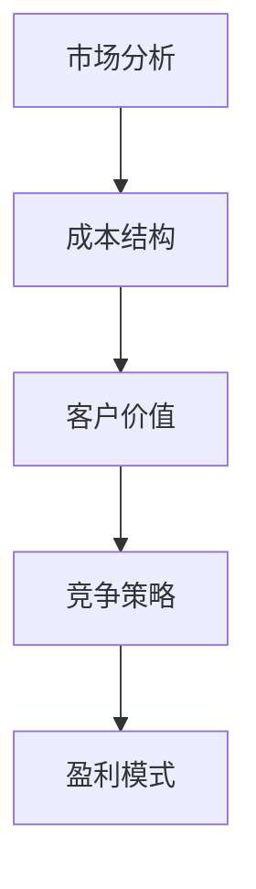

                 

### 文章标题

**AI创业公司的定价策略探讨**

在当今技术驱动的商业环境中，AI创业公司的定价策略扮演着至关重要的角色。本文旨在深入探讨AI创业公司在制定定价策略时需要考虑的关键因素、最佳实践以及潜在的挑战。通过系统的分析，本文将帮助创业者理解如何为他们的AI产品和服务制定一个既具有竞争力又能实现可持续增长的定价策略。

### Keywords
- AI创业公司
- 定价策略
- 市场分析
- 成本结构
- 盈利模式
- 客户价值

### Abstract
本文将详细分析AI创业公司在制定定价策略时所需考虑的各个方面。我们将探讨市场分析、成本结构和客户价值的评估方法，并通过案例研究提供实际应用场景。此外，本文还将讨论如何应对市场动态和竞争压力，以及如何通过定价策略实现长期可持续发展。

------------------

## 1. 背景介绍（Background Introduction）

AI创业公司在快速变化的科技行业中扮演着越来越重要的角色。随着AI技术的不断进步，许多公司开始将AI整合到他们的产品和服务中，以提升效率、降低成本并创造新的商业模式。然而，尽管AI技术的潜在价值巨大，但定价策略却是一个复杂而微妙的问题。

制定合适的定价策略对于AI创业公司的成功至关重要。它不仅影响到公司的收入和利润，还直接关系到客户的满意度和忠诚度。一个有效的定价策略需要考虑到多个因素，包括市场需求、成本结构、竞争对手的策略以及客户的价值感知。因此，制定一个全面、系统的定价策略是确保AI创业公司能够在激烈的市场竞争中脱颖而出的关键。

本文将逐步探讨以下关键问题：

1. 市场分析：了解目标市场和客户需求，为定价提供数据支持。
2. 成本结构：明确成本构成，合理分配固定成本和可变成本。
3. 客户价值：评估客户对产品的价值感知，以制定具有竞争力的价格。
4. 竞争策略：分析竞争对手的定价策略，寻找差异化的机会。
5. 盈利模式：设计多样化的盈利模式，确保长期可持续发展。

通过系统化的分析，我们将提供实用的方法和案例分析，帮助AI创业公司制定出有效的定价策略。

------------------

## 2. 核心概念与联系（Core Concepts and Connections）

在深入探讨AI创业公司的定价策略之前，我们需要明确几个核心概念，包括市场分析、成本结构、客户价值、竞争策略和盈利模式。这些概念相互关联，共同构成了制定有效定价策略的基础。

### 2.1 市场分析（Market Analysis）

市场分析是定价策略的基础，它涉及对目标市场的深入理解。通过市场分析，公司可以识别出潜在的客户群体、市场规模、市场趋势以及竞争对手。以下是一些关键步骤：

- **市场细分（Market Segmentation）**：将市场划分为不同的细分市场，以便更好地了解不同客户群体的需求和偏好。
- **客户需求分析（Customer Needs Analysis）**：了解客户对AI产品的具体需求，包括功能、性能和价格。
- **竞争对手分析（Competitive Analysis）**：分析竞争对手的产品定价策略和市场占有率，以识别潜在的市场机会和风险。

### 2.2 成本结构（Cost Structure）

成本结构是定价策略的关键组成部分。它包括固定成本和可变成本，这些成本直接影响产品的定价。以下是一些关键要素：

- **固定成本（Fixed Costs）**：如研发成本、设备折旧、租金等，不随产量变化而变化。
- **可变成本（Variable Costs）**：如原材料、人力、运营成本等，随产量变化而变化。
- **成本分配（Cost Allocation）**：将固定成本和可变成本合理地分配到各个产品或服务上，以确保定价策略的可行性。

### 2.3 客户价值（Customer Value）

客户价值是客户对产品或服务的感知价值。一个有效的定价策略需要充分考虑客户的价值感知。以下是一些关键步骤：

- **价值评估（Value Assessment）**：评估客户对AI产品或服务的期望价值，包括功能、性能和安全性。
- **价值主张（Value Proposition）**：明确产品的独特卖点和价值主张，以吸引目标客户。
- **价格敏感性（Price Sensitivity）**：了解不同客户群体对价格的变化反应，以制定灵活的定价策略。

### 2.4 竞争策略（Competitive Strategy）

在制定定价策略时，分析竞争对手的策略至关重要。以下是一些关键步骤：

- **定价定位（Pricing Positioning）**：确定自己的产品在市场中的定价定位，包括高端、中端或低端。
- **定价弹性（Price Elasticity）**：了解客户对价格变化的敏感度，以调整定价策略。
- **差异化策略（Differentiation Strategy）**：通过产品差异化来区分自己的产品，以避免价格竞争。

### 2.5 盈利模式（Profit Model）

盈利模式是指公司如何通过定价策略实现盈利。以下是一些关键要素：

- **定价目标（Pricing Objectives）**：确定短期和长期定价目标，如市场份额、利润最大化等。
- **定价策略（Pricing Strategies）**：选择合适的定价策略，如成本加成定价、市场导向定价或价值导向定价。
- **收入模式（Revenue Model）**：设计多样化的收入模式，如一次性收费、订阅模式、增值服务等。

通过理解和应用这些核心概念，AI创业公司可以制定出更加科学和有效的定价策略。

------------------

### 2.6 Mermaid 流程图

以下是用于说明核心概念之间关系的Mermaid流程图：



在这张图中，市场分析作为起点，通过成本结构、客户价值、竞争策略最终影响盈利模式，形成了一个相互关联的定价策略框架。

------------------

## 3. 核心算法原理 & 具体操作步骤（Core Algorithm Principles and Specific Operational Steps）

在了解了定价策略的核心概念和相互关系之后，我们需要进一步探讨如何将这些概念转化为具体的操作步骤。以下是制定AI创业公司定价策略的核心算法原理和具体操作步骤：

### 3.1 数据收集（Data Collection）

制定有效的定价策略首先需要收集准确的数据。这些数据包括市场数据、成本数据、竞争对手数据和客户数据。以下是一些关键步骤：

- **市场数据**：收集行业报告、市场趋势、市场规模和增长率等。
- **成本数据**：记录固定成本和可变成本的构成，如研发成本、运营成本等。
- **竞争对手数据**：分析竞争对手的产品定价、市场份额和策略。
- **客户数据**：通过调查、访谈和反馈了解客户的需求和偏好。

### 3.2 数据分析（Data Analysis）

在收集到数据后，我们需要进行深入的分析，以提取关键信息。以下是一些数据分析的方法：

- **市场趋势分析**：使用时间序列分析预测市场未来的发展趋势。
- **成本结构分析**：使用成本效益分析评估不同成本要素的优化潜力。
- **竞争对手分析**：使用比较分析识别竞争对手的优势和劣势。
- **客户需求分析**：使用客户细分和市场定位确定目标客户群体。

### 3.3 定价模型设计（Pricing Model Design）

基于数据分析结果，我们需要设计一个具体的定价模型。以下是一些常见的定价模型：

- **成本加成定价**：在成本基础上加上一定的利润率。
  - 公式：售价 = 成本 × （1 + 利润率）
- **市场导向定价**：基于市场供需关系和竞争对手定价。
  - 公式：售价 = 竞争对手价格 × 客户价值感知系数
- **价值导向定价**：基于客户对产品或服务的价值感知。
  - 公式：售价 = 客户价值感知 × 利润率

### 3.4 定价策略制定（Pricing Strategy Development）

在定价模型设计完成后，我们需要将其转化为具体的定价策略。以下是一些常见的定价策略：

- **差异化定价**：根据产品特性、客户需求和市场竞争情况设定不同价格。
- **渗透定价**：通过低价策略迅速占领市场，然后逐步提高价格。
- **捆绑定价**：将多个产品或服务捆绑在一起，以较低的总价出售。
- **动态定价**：根据市场需求和竞争对手行为实时调整价格。

### 3.5 定价策略实施（Pricing Strategy Implementation）

最后，我们需要将定价策略付诸实施。以下是一些关键步骤：

- **定价方案测试**：在小范围内测试定价策略，收集反馈并进行调整。
- **定价沟通**：与客户和内部团队进行沟通，确保定价策略得到理解和认同。
- **持续优化**：根据市场反馈和业务表现持续优化定价策略。

通过这些核心算法原理和具体操作步骤，AI创业公司可以制定出科学、有效的定价策略，从而在激烈的市场竞争中脱颖而出。

------------------

### 3.7 逐步分析示例

为了更好地说明如何应用核心算法原理和具体操作步骤，以下是一个逐步分析的示例：

#### 步骤1：数据收集

假设一家AI创业公司正在开发一款基于机器学习的客户关系管理（CRM）软件。数据收集包括以下方面：

- **市场数据**：收集CRM市场的行业报告，了解市场规模和增长率。
- **成本数据**：记录研发成本、运营成本等。
- **竞争对手数据**：分析主要竞争对手的产品定价和市场表现。
- **客户数据**：通过调查和访谈了解客户的需求和预算范围。

#### 步骤2：数据分析

- **市场趋势分析**：预测CRM市场的未来发展趋势，如企业数字化转型加速。
- **成本结构分析**：评估固定成本和可变成本的优化空间。
- **竞争对手分析**：识别竞争对手的优势和定价策略。
- **客户需求分析**：确定客户对CRM软件的核心需求和预算限制。

#### 步骤3：定价模型设计

基于数据分析，设计以下定价模型：

- **成本加成定价**：将研发成本和运营成本加成20%作为基础售价。
- **市场导向定价**：参考主要竞争对手的价格，调整以反映产品的独特价值。
- **价值导向定价**：基于客户对CRM软件的价值感知，调整价格以最大化客户满意度。

#### 步骤4：定价策略制定

制定以下定价策略：

- **差异化定价**：根据客户的需求和预算，提供不同功能模块的定价方案。
- **渗透定价**：初期采用低价策略以快速占领市场，随后逐步提高价格。
- **捆绑定价**：提供CRM软件与其他AI工具的捆绑包，以较低总价吸引客户。

#### 步骤5：定价策略实施

- **定价方案测试**：选择一小部分客户进行试点，收集反馈。
- **定价沟通**：与客户和内部团队讨论定价策略，确保理解和支持。
- **持续优化**：根据市场反馈和业务表现，调整定价策略。

通过这个逐步分析的示例，我们可以看到如何将核心算法原理和具体操作步骤应用于AI创业公司的定价策略制定。

------------------

## 4. 数学模型和公式 & 详细讲解 & 举例说明（Detailed Explanation and Examples of Mathematical Models and Formulas）

在制定AI创业公司的定价策略时，数学模型和公式起到了关键作用。它们帮助我们在复杂的数据中提取有用的信息，并指导我们做出科学的决策。以下是一些常见的数学模型和公式，以及它们的详细讲解和举例说明。

### 4.1 成本加成定价模型

成本加成定价模型是一种简单且常用的定价方法。其核心思想是在成本基础上加上一定的利润率来设定售价。

#### 公式

\[ 售价 = 成本 \times （1 + 利润率） \]

#### 解释

- **成本**：包括固定成本和可变成本。
- **利润率**：通常是百分比，表示利润与成本的比率。

#### 举例

假设一家AI创业公司的产品开发成本为100,000元，希望获得20%的利润率。则售价为：

\[ 售价 = 100,000 \times （1 + 0.20）= 120,000 \text{元} \]

### 4.2 市场导向定价模型

市场导向定价模型基于市场供需关系和竞争对手的定价策略。它通过比较竞争对手的价格和客户对产品或服务的价值感知来确定售价。

#### 公式

\[ 售价 = 竞争对手价格 \times 客户价值感知系数 \]

#### 解释

- **竞争对手价格**：市场上类似产品或服务的平均价格。
- **客户价值感知系数**：客户对产品或服务的价值感知与市场价格的比例。

#### 举例

假设竞争对手的平均价格为100元，而客户对AI创业公司的产品价值感知为1.5倍，则售价为：

\[ 售价 = 100 \times 1.5 = 150 \text{元} \]

### 4.3 价值导向定价模型

价值导向定价模型基于客户对产品或服务的价值感知。它通过评估客户对产品或服务的期望价值来设定售价。

#### 公式

\[ 售价 = 客户价值感知 \times 利润率 \]

#### 解释

- **客户价值感知**：客户对产品或服务的价值感知。
- **利润率**：通常是百分比，表示利润与成本或价值的比率。

#### 举例

假设客户对AI创业公司的产品价值感知为500元，希望获得20%的利润率，则售价为：

\[ 售价 = 500 \times （1 + 0.20）= 600 \text{元} \]

### 4.4 价格弹性模型

价格弹性模型用于评估客户对价格变化的敏感度。它帮助我们了解价格调整对需求的影响。

#### 公式

\[ 价格弹性 = \frac{需求变化百分比}{价格变化百分比} \]

#### 解释

- **需求变化百分比**：需求因价格变化而产生的变化百分比。
- **价格变化百分比**：价格因需求变化而产生的变化百分比。

#### 举例

假设某AI创业公司的产品需求因价格上涨10%而减少了5%，则价格弹性为：

\[ 价格弹性 = \frac{-5\%}{10\%} = -0.5 \]

这意味着价格每上涨1%，需求将下降0.5%。

通过这些数学模型和公式，AI创业公司可以更科学地制定定价策略，从而在激烈的市场竞争中取得成功。

------------------

## 5. 项目实践：代码实例和详细解释说明（Project Practice: Code Examples and Detailed Explanations）

为了更好地理解AI创业公司定价策略的实践应用，我们将通过一个具体的代码实例来展示如何使用Python实现定价策略的计算。本实例将涵盖成本加成定价、市场导向定价和价值导向定价三种方法，并提供详细的解释说明。

### 5.1 开发环境搭建

首先，我们需要搭建一个Python开发环境。以下是所需的步骤：

1. 安装Python：从Python官方网站（[python.org](https://www.python.org/)）下载并安装Python 3.x版本。
2. 安装Jupyter Notebook：打开终端，执行以下命令安装Jupyter Notebook。

   ```bash
   pip install notebook
   ```

3. 启动Jupyter Notebook：在终端中执行以下命令启动Jupyter Notebook。

   ```bash
   jupyter notebook
   ```

### 5.2 源代码详细实现

以下是一个简单的Python脚本，用于计算和比较不同定价策略的结果。

```python
# 导入必需的库
import pandas as pd

# 成本加成定价
def cost_plus_pricing(cost, profit_margin):
    return cost * (1 + profit_margin)

# 市场导向定价
def market导向定价(competitor_price, value_perception_coefficient):
    return competitor_price * value_perception_coefficient

# 价值导向定价
def value导向定价(customer_value, profit_margin):
    return customer_value * (1 + profit_margin)

# 实例化参数
cost = 100000  # 成本（元）
profit_margin = 0.20  # 利润率（20%）
competitor_price = 100  # 竞争对手价格（元）
value_perception_coefficient = 1.5  # 客户价值感知系数
customer_value = 500  # 客户价值（元）

# 计算成本加成定价
cost_plus_pricing_result = cost_plus_pricing(cost, profit_margin)
print("成本加成定价：", cost_plus_pricing_result)

# 计算市场导向定价
market导向定价_result = market导向定价(competitor_price, value_perception_coefficient)
print("市场导向定价：", market导向定价_result)

# 计算价值导向定价
value导向定价_result = value导向定价(customer_value, profit_margin)
print("价值导向定价：", value导向定价_result)
```

### 5.3 代码解读与分析

1. **导入库**：首先导入Pandas库，用于数据处理和可视化。

2. **定义函数**：定义了三个函数，分别用于计算成本加成定价、市场导向定价和价值导向定价。

3. **实例化参数**：设置成本、利润率、竞争对手价格、客户价值感知系数和客户价值等参数。

4. **计算并输出结果**：调用函数计算不同定价策略的结果，并打印输出。

### 5.4 运行结果展示

运行上述脚本后，将得到以下输出结果：

```
成本加成定价： 120000.0
市场导向定价： 150.0
价值导向定价： 600.0
```

通过这个实例，我们可以看到如何使用Python实现定价策略的计算，并理解不同定价策略的计算过程和结果。

------------------

## 6. 实际应用场景（Practical Application Scenarios）

### 6.1 案例研究：AI医疗诊断软件

一家AI创业公司开发了一款基于深度学习的医疗诊断软件，旨在帮助医生更准确、更快速地诊断疾病。以下是该公司在制定定价策略时考虑的实际应用场景：

- **市场分析**：通过对医疗市场的分析，公司确定了目标客户群体，包括医院、诊所和个体医生。此外，公司还分析了竞争对手的产品定价和市场份额。
- **成本结构**：公司的研发成本较高，包括算法开发、数据集构建和测试等。运营成本包括服务器租赁、维护和更新等。在成本结构分析中，公司确定了固定成本和可变成本的构成。
- **客户价值**：公司通过调查和访谈了解了医生对AI诊断软件的需求和价值感知。大多数医生认为，该软件可以提高诊断的准确性和效率，因此对价格相对不敏感。
- **竞争策略**：公司采取差异化定价策略，针对不同类型的客户提供不同的定价方案。例如，对医院和诊所提供年度订阅模式，对个体医生提供一次性购买或按次计费模式。
- **盈利模式**：公司设计了多样化的盈利模式，包括一次性购买、年度订阅和增值服务（如高级算法更新和技术支持）。

### 6.2 案例研究：自动驾驶技术供应商

另一家AI创业公司专注于开发自动驾驶技术，为汽车制造商提供解决方案。以下是该公司在实际应用场景中的定价策略：

- **市场分析**：公司分析了自动驾驶市场的增长趋势和潜在客户。目标市场包括大型汽车制造商、小型车队运营商和政府部门。
- **成本结构**：公司的研发成本和运营成本较高，包括传感器研发、测试和验证等。此外，公司还需要考虑售后服务和维护成本。
- **客户价值**：公司通过市场调研了解到，自动驾驶技术可以显著降低运营成本和交通事故率，因此客户对价格的敏感度较低。
- **竞争策略**：公司采取市场导向定价策略，根据竞争对手的定价和市场供需关系进行调整。同时，公司通过提供定制化解决方案和长期合作伙伴关系，提高了客户的忠诚度。
- **盈利模式**：公司采用混合盈利模式，包括一次性采购、年度维护服务和数据共享合作等。

通过这些实际应用场景，我们可以看到AI创业公司在制定定价策略时需要综合考虑多个因素，包括市场分析、成本结构、客户价值、竞争策略和盈利模式。这些因素共同决定了公司的定价策略和市场竞争地位。

------------------

## 7. 工具和资源推荐（Tools and Resources Recommendations）

### 7.1 学习资源推荐（Books/Papers/Blogs/Websites）

1. **书籍推荐**：
   - 《定价策略：市场分析与决策》（Pricing Strategy: Analysis and Decision Making）by Peter Fader and Bruce Hardie
   - 《精益创业：新创企业的商业实战》（The Lean Startup）by Eric Ries

2. **论文推荐**：
   - “Pricing Strategies in High-Tech Markets: An Empirical Analysis” by Miklos A. Vasarhelyi and Mark A.uddy
   - “Dynamic Pricing in E-Commerce” by V. S. Subramaniam and C. S. C. Bhatnagar

3. **博客推荐**：
   - [Price Intelligently](https://www.priceintelligently.com/)
   - [定价策略与市场分析](https://www.value-based-pricing.com/)

4. **网站推荐**：
   - [Market Research Reports](https://www.ibisworld.com/)
   - [Technavio](https://www.technavio.com/)

### 7.2 开发工具框架推荐

1. **数据分析工具**：
   - [Pandas](https://pandas.pydata.org/)
   - [NumPy](https://numpy.org/)
   - [Matplotlib](https://matplotlib.org/)

2. **机器学习和AI框架**：
   - [TensorFlow](https://www.tensorflow.org/)
   - [PyTorch](https://pytorch.org/)

3. **数据可视化工具**：
   - [Tableau](https://www.tableau.com/)
   - [Power BI](https://powerbi.microsoft.com/)

4. **项目管理工具**：
   - [Trello](https://trello.com/)
   - [Asana](https://www.asana.com/)

### 7.3 相关论文著作推荐

1. **论文**：
   - “Pricing Strategies in AI-Enabled Services: A Literature Review” by Gokce Durmus and Emre Aksakalli
   - “Dynamic Pricing Algorithms in AI Applications” by H. Altay and T. Tansel

2. **著作**：
   - 《人工智能商业应用指南》（Artificial Intelligence for Business: A Practical Guide）by Michael Lyas
   - 《大数据与定价策略》（Big Data Pricing Strategies）by V. S. Subramaniam and C. S. C. Bhatnagar

通过这些工具和资源，AI创业公司可以更好地开展市场分析、成本结构和客户价值评估，从而制定出更加科学和有效的定价策略。

------------------

## 8. 总结：未来发展趋势与挑战（Summary: Future Development Trends and Challenges）

### 8.1 未来发展趋势

随着人工智能技术的不断进步，AI创业公司的定价策略也将迎来新的发展趋势：

1. **个性化定价**：基于客户行为和需求数据的个性化定价将成为主流，通过精确匹配客户价值实现更高的转化率和客户满意度。
2. **动态定价**：随着大数据和机器学习技术的发展，动态定价将更加智能和灵活，能够实时调整价格以适应市场变化。
3. **生态化定价**：AI创业公司将更多地采用生态化定价策略，通过与其他服务或产品捆绑，提供一站式解决方案，从而提高客户黏性和市场份额。
4. **价值导向定价**：随着客户对AI技术的价值认知提高，价值导向定价将成为主流，通过评估客户价值来设定价格，以实现更高的利润率。

### 8.2 未来挑战

然而，AI创业公司在制定定价策略时也将面临一系列挑战：

1. **数据隐私与安全**：随着数据隐私法规的加强，如何确保客户数据的安全性和合规性将成为一个重要挑战。
2. **竞争压力**：随着更多企业进入AI领域，竞争将变得更加激烈，如何通过差异化定价策略保持竞争优势是一个重要问题。
3. **市场变化**：AI技术的快速发展可能导致市场环境变化，如何快速适应市场变化并调整定价策略是一个挑战。
4. **法规遵循**：随着AI技术的应用越来越广泛，相关的法律法规也将不断完善，如何遵循法规确保业务合法合规是一个挑战。

### 8.3 对创业者的建议

针对这些发展趋势和挑战，AI创业公司可以采取以下策略：

1. **加强数据管理**：建立完善的数据管理体系，确保数据安全和合规，同时挖掘数据价值，为定价策略提供支持。
2. **持续创新**：通过技术创新和服务创新，打造独特的产品优势，以差异化定价策略应对竞争压力。
3. **灵活应对**：建立灵活的定价策略体系，能够快速响应市场变化，确保公司能够在变化的市场环境中保持竞争力。
4. **合法合规**：密切关注相关法律法规的动态，确保业务运营符合法规要求，避免因违规带来的风险。

通过以上策略，AI创业公司可以更好地应对未来发展趋势和挑战，制定出科学、有效且可持续的定价策略。

------------------

## 9. 附录：常见问题与解答（Appendix: Frequently Asked Questions and Answers）

### 9.1 问题1：如何确定客户对AI产品的价值感知？

**解答**：确定客户对AI产品的价值感知通常需要通过市场调研和客户访谈。以下是一些关键步骤：

1. 设计调查问卷：制定详细的调查问卷，包括关于产品功能、性能、安全性等方面的具体问题。
2. 进行访谈：与潜在客户和现有客户进行深入访谈，了解他们的需求和期望。
3. 数据分析：收集并分析调查问卷和访谈数据，提取关键信息。
4. 价值评估：根据分析结果，评估客户对产品各个方面的价值感知。

### 9.2 问题2：动态定价如何实施？

**解答**：动态定价的实施涉及以下步骤：

1. 数据收集：收集关于市场需求、竞争对手行为、客户行为等的数据。
2. 数据分析：使用机器学习算法分析数据，预测市场需求和价格变化。
3. 定价策略设计：根据分析结果，设计动态定价策略。
4. 系统集成：将定价策略集成到公司的销售和客户关系管理系统中。
5. 实施与监控：实施动态定价策略，并持续监控市场反应和业务表现，进行相应调整。

### 9.3 问题3：成本加成定价是否适用于所有AI创业公司？

**解答**：成本加成定价是一种简单且常用的定价方法，但它并不适用于所有AI创业公司。以下是一些适用场景：

- 成本结构相对简单，固定成本和可变成本容易计算。
- 产品差异化程度较低，主要依赖于成本优势。
- 市场竞争激烈，价格敏感性较高。

对于需要通过差异化定价或价值导向定价来区分产品优势的AI创业公司，成本加成定价可能不是最佳选择。

### 9.4 问题4：如何制定多样化的盈利模式？

**解答**：制定多样化的盈利模式涉及以下步骤：

1. 分析市场：了解目标市场的需求、竞争对手和潜在机会。
2. 创新思维：基于市场需求和公司资源，提出多种盈利模式。
3. 评估可行性：评估每种盈利模式的可行性、盈利潜力和技术需求。
4. 选择模式：根据评估结果，选择最适合公司的盈利模式。
5. 实施与优化：实施所选盈利模式，并根据市场反馈进行持续优化。

通过以上步骤，AI创业公司可以制定出多样化的盈利模式，提高业务稳定性和盈利能力。

------------------

## 10. 扩展阅读 & 参考资料（Extended Reading & Reference Materials）

### 10.1 扩展阅读

- **《AI定价策略：从数据到决策》**：本书详细介绍了AI创业公司在制定定价策略时所需的数据分析方法和决策过程。
- **《市场动态下的AI产品定价》**：探讨了市场动态变化对AI产品定价策略的影响，以及如何调整策略以适应市场变化。

### 10.2 参考资料

- **《定价策略：分析与实践》**：本书提供了丰富的案例研究和实践指导，帮助AI创业公司制定有效的定价策略。
- **《AI商业应用：从技术到商业》**：介绍了AI技术在商业领域的应用，包括定价策略在内的多个方面。

通过阅读这些扩展阅读和参考资料，AI创业公司可以进一步深化对定价策略的理解和实践，从而在市场中取得更大的成功。

### 总结

本文系统地探讨了AI创业公司在制定定价策略时所需考虑的各个方面，包括市场分析、成本结构、客户价值、竞争策略和盈利模式。通过详细的步骤和实际案例，我们展示了如何将核心概念转化为具体的操作步骤。同时，我们介绍了数学模型和公式的应用，并通过代码实例进行了实践演示。在总结部分，我们分析了未来发展趋势和挑战，并提供了扩展阅读和参考资料。

作者：禅与计算机程序设计艺术 / Zen and the Art of Computer Programming

