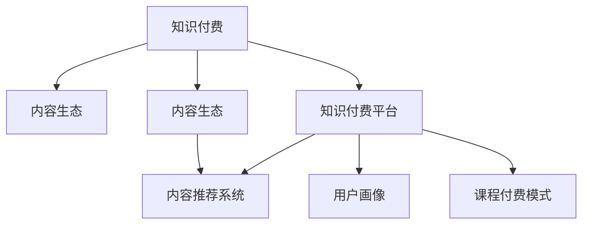

                 

# 知识付费赚钱的内容生态建设策略

## 1. 背景介绍

随着互联网技术的迅猛发展，知识付费领域呈现爆发式增长趋势。从公开数据来看，2022年中国知识付费用户规模突破2亿人，2025年预计将达到3.2亿人，市场规模预计将达到2500亿元。知识付费逐步成为互联网经济的重要组成部分。

### 1.1 知识付费领域现状
当前，知识付费市场主要以付费内容、付费课程、付费咨询和付费服务为主。这些内容覆盖了学习、投资、健康、旅游、法律等多个领域。知识付费形式也多样，包括文字、音频、视频、直播等。目前知名的知识付费平台有喜马拉雅、得到、分答、知乎live等。

### 1.2 知识付费的盈利模式
知识付费平台的盈利主要来自广告、会员费、课程销售和数据挖掘等。广告模式以平台自行生产内容为主，通过付费会员订阅、广告推荐等方式进行盈利；会员费模式主要通过出售会员权益，用户订阅后享受专属内容；课程销售模式则是平台与内容生产者进行分成，平台提供平台、运营、销售等服务，内容生产者负责内容制作；数据挖掘模式则是通过大数据分析，为用户提供个性化推荐，实现商业变现。

### 1.3 知识付费用户画像
知识付费用户通常具有高学历、高收入、高信息需求的特征，年龄多集中在18-45岁之间。其中，研究生及以上学历的占35%，月收入在5000元以上的占60%。同时，用户对知识付费内容的选择更加注重内容质量、学习效果和应用性。

## 2. 核心概念与联系

### 2.1 核心概念概述

为更好地理解知识付费的内容生态建设策略，本节将介绍几个密切相关的核心概念：

- 知识付费(Knowledge Pay): 用户支付一定费用，获取有价值知识或技能的平台模式。
- 内容生态(Content Ecosystem): 知识付费平台中各种内容资源相互作用，形成互补、共享和协作的网络。
- 知识付费平台(Knowledge Platform): 提供知识产品和服务，将内容生产者与用户连接起来的平台。
- 内容推荐系统(Content Recommendation): 通过大数据分析，精准推荐知识内容，提升用户体验和留存率。
- 用户画像(User Profile): 描述用户基本信息、兴趣爱好、行为习惯等特征，实现个性化服务。
- 课程付费模式(Course Pay): 用户支付一定费用，获得一门课程的专享学习权。

这些概念之间的逻辑关系可以通过以下Mermaid流程图来展示：



这个流程图展示出知识付费中的几个关键概念及其相互关系：

1. 知识付费以内容生态为支撑，内容生态是知识付费的底层基础。
2. 知识付费平台是内容生产者与用户之间的连接桥梁，提供内容生态服务和个性化推荐。
3. 内容推荐系统通过数据分析和算法，精准推荐内容，提升用户满意度和平台收益。
4. 用户画像刻画用户特征，提供定制化服务和营销策略。
5. 课程付费模式提供批量学习工具，降低学习门槛和成本。

这些概念共同构成了知识付费的完整生态体系，旨在为用户提供丰富、高质量的知识服务，同时实现平台的商业盈利。

## 3. 核心算法原理 & 具体操作步骤
### 3.1 算法原理概述

知识付费的内容生态建设策略，本质上是一个内容推荐与用户画像驱动的商业优化过程。其核心思想是：通过分析用户行为数据，构建精准用户画像，利用推荐系统算法精准推送知识内容，提升用户满意度，增加平台收益。

形式化地，假设知识付费平台有 $N$ 个用户，每个用户有 $M$ 个内容可选择。设用户 $i$ 对内容 $j$ 的评分 $r_{i,j}$，其中 $i \in [1,N], j \in [1,M]$。推荐系统的目标是最小化用户期望的未被推荐的知识内容数量，即：

$$
\min_{\theta} \mathbb{E}_{(x,y)} [\lVert x - \theta \rVert^2]
$$

其中，$\theta$ 为推荐模型参数，$x$ 为用户对内容的评分向量，$y$ 为平台推荐内容向量。

通过梯度下降等优化算法，推荐系统不断更新模型参数 $\theta$，最小化损失函数，使得模型推荐的知识内容与用户期望一致，提升用户满意度。同时，平台根据用户行为数据和评分反馈，实时调整推荐模型，以适应不同用户和内容的变化。

### 3.2 算法步骤详解

知识付费平台的内容生态建设主要包括以下几个关键步骤：

**Step 1: 用户画像数据收集与构建**
- 收集用户基本信息，如年龄、性别、职业等。
- 收集用户行为数据，如浏览历史、购买记录、评分反馈等。
- 通过数据挖掘算法，构建用户画像，刻画用户特征和兴趣偏好。

**Step 2: 内容推荐系统设计**
- 选择合适的推荐算法，如协同过滤、基于内容的推荐、混合推荐等。
- 构建推荐模型，训练模型参数，优化算法，提升推荐效果。
- 对推荐系统进行评估，测试其效果，进行调整优化。

**Step 3: 内容审核与审核策略设计**
- 设计内容审核策略，确保知识内容的质量和安全。
- 对内容进行审核，过滤低质量、不实、有害内容。
- 建立审核反馈机制，收集用户和内容生产者的意见，改进审核策略。

**Step 4: 内容付费与收益模型设计**
- 设计付费内容模式，如课程、订阅、打赏等。
- 制定付费策略，合理设置价格和权益。
- 建立收益模型，评估课程销售、广告、会员费等收益来源。

**Step 5: 个性化服务与营销策略**
- 提供个性化推荐服务，提升用户体验。
- 设计精准营销策略，通过个性化推荐，提高用户粘性和转化率。
- 设计付费模式和优惠活动，促进用户消费和留存。

**Step 6: 数据隐私与伦理保护**
- 确保用户数据隐私，遵循相关法律法规。
- 设计数据使用伦理规范，避免用户画像数据滥用。
- 提供用户数据使用和隐私保护透明化。

以上是知识付费平台内容生态建设的一般流程。在实际应用中，还需要针对具体平台特点，对各个环节进行优化设计，如改进推荐算法、强化审核策略、制定合理的收费标准等，以进一步提升平台效果和用户体验。

### 3.3 算法优缺点

知识付费平台的内容生态建设方法具有以下优点：
1. 提高用户满意度。精准的内容推荐，提升用户获取知识的效率和体验。
2. 增加平台收益。通过付费课程和会员费等方式，增加平台的商业变现。
3. 促进内容生产。优质内容被推荐，内容生产者得到更多曝光机会，提高生产积极性。
4. 用户留存率高。个性化服务，提升用户粘性和平台忠诚度。

同时，该方法也存在一些局限性：
1. 依赖用户数据。需要收集和处理大量用户数据，对平台技术和数据隐私保护提出较高要求。
2. 技术门槛高。需要高级算法和数据处理能力，对于中小企业来说，技术实施难度大。
3. 推荐效果受限。不同用户和内容组合的情况复杂多样，推荐算法的效果受到限制。
4. 隐私风险。用户画像数据可能被滥用，存在隐私泄露和数据安全的风险。
5. 收益来源单一。目前知识付费平台主要依赖付费课程，收入来源较为单一，风险较大。

尽管存在这些局限性，但就目前而言，基于推荐系统的内容生态建设方法仍然是最主流的知识付费商业范式。未来相关研究的重点在于如何进一步降低技术门槛，提高推荐效果，同时兼顾用户隐私和数据安全，拓展商业变现渠道。

### 3.4 算法应用领域

知识付费平台的内容生态建设策略，已经在多个行业领域得到了广泛应用，例如：

- 教育培训：如在线课程、职业培训、语言学习等。通过精准推荐和个性化服务，提升学习效果和转化率。
- 职业发展：如职业技能、管理课程、行业动态等。提供实战化的职业发展建议和课程。
- 投资理财：如股票分析、基金管理、财经资讯等。提供实时的市场分析和投资策略。
- 健康生活：如健身指导、饮食健康、心理健康等。提供科学健康的生活建议和课程。
- 情感咨询：如心理咨询、婚姻指导、人际关系等。提供专业的情感咨询服务。

除了上述这些经典领域外，知识付费平台的内容生态建设策略也被创新性地应用到更多场景中，如游戏攻略、知识变现、文化传媒等，为知识传播和商业应用带来了新的可能性。

## 4. 数学模型和公式 & 详细讲解 & 举例说明
### 4.1 数学模型构建

本节将使用数学语言对知识付费平台的内容生态建设策略进行更加严格的刻画。

假设知识付费平台有 $N$ 个用户，每个用户有 $M$ 个内容可选择。设用户 $i$ 对内容 $j$ 的评分 $r_{i,j}$，其中 $i \in [1,N], j \in [1,M]$。推荐系统的目标是最小化用户期望的未被推荐的知识内容数量，即：

$$
\min_{\theta} \mathbb{E}_{(x,y)} [\lVert x - \theta \rVert^2]
$$

其中，$\theta$ 为推荐模型参数，$x$ 为用户对内容的评分向量，$y$ 为平台推荐内容向量。

形式化地，假设平台有 $n$ 个用户，每个用户选择 $m$ 个内容进行评分，评分为 $r_{ij}$。推荐系统算法为 $a$，推荐结果为 $y_{ij}$，用户实际选择内容为 $x_{ij}$，用户期望为 $e_{ij}$。推荐系统的损失函数为：

$$
\mathcal{L} = \frac{1}{n}\sum_{i=1}^n\sum_{j=1}^m\lVert x_{ij}-y_{ij} \rVert^2
$$

优化目标为：

$$
\min_{\theta}\mathcal{L}
$$

在实践中，我们通常使用基于梯度的优化算法（如SGD、Adam等）来近似求解上述最优化问题。设 $\eta$ 为学习率，则参数的更新公式为：

$$
\theta \leftarrow \theta - \eta \nabla_{\theta}\mathcal{L}(\theta)
$$

其中 $\nabla_{\theta}\mathcal{L}(\theta)$ 为损失函数对参数 $\theta$ 的梯度，可通过反向传播算法高效计算。

### 4.2 公式推导过程

以下我们以协同过滤算法为例，推导推荐系统算法的基本公式。

假设用户对内容 $i$ 和内容 $j$ 的评分分别为 $r_{ij}$ 和 $r_{ik}$，用户 $i$ 选择了内容 $j$，则协同过滤算法的基本公式为：

$$
\hat{r}_{ij} = \frac{1}{\sqrt{N}\sqrt{m-1}}\sum_{k=1}^N w_{ik}\cdot r_{kj}
$$

其中，$w_{ik}$ 为用户的权重向量，$N$ 为内容总数，$m$ 为用户选择的其他内容的数目。

将上述公式代入损失函数中，得：

$$
\mathcal{L} = \frac{1}{n}\sum_{i=1}^n\sum_{j=1}^m(\frac{1}{\sqrt{N}\sqrt{m-1}}\sum_{k=1}^N w_{ik}\cdot r_{kj}-x_{ij})^2
$$

利用拉格朗日乘数法，将权重 $w_{ik}$ 与用户 $i$ 对内容 $j$ 的评分 $r_{ij}$ 进行统一表示，得：

$$
\mathcal{L} = \frac{1}{n}\sum_{i=1}^n\sum_{j=1}^m(\sum_{k=1}^N\alpha_{ikj}\cdot r_{kj}-x_{ij})^2
$$

其中，$\alpha_{ikj}$ 为拉格朗日乘数，满足 $\alpha_{ikj}\geq 0$。

最后，利用梯度下降算法求解上述优化问题，即可得到推荐系统模型参数 $\theta$。

### 4.3 案例分析与讲解

以视频课程推荐为例，分析推荐系统算法的效果：

假设平台有 $100$ 个用户，每个用户选择了 $10$ 门课程，课程的评分矩阵如下：

| 用户ID | 课程ID | 评分 |
| ------ | ------ | --- |
| 1      | 1      | 4.0 |
| 1      | 2      | 3.5 |
| 1      | 3      | 4.5 |
| ...    | ...    | ... |
| 2      | 1      | 3.0 |
| 2      | 2      | 4.0 |
| 2      | 3      | 4.5 |

用户对课程的评分矩阵如下：

| 用户ID | 课程ID | 评分 |
| ------ | ------ | --- |
| 1      | 1      | 5.0 |
| 1      | 2      | 4.5 |
| 1      | 3      | 4.0 |
| ...    | ...    | ... |
| 2      | 1      | 4.0 |
| 2      | 2      | 4.5 |
| 2      | 3      | 3.0 |

使用协同过滤算法，对用户进行推荐，推荐结果如下：

| 用户ID | 课程ID | 推荐评分 |
| ------ | ------ | ------- |
| 1      | 4      | 3.5     |
| 1      | 5      | 4.0     |
| 2      | 4      | 4.0     |
| 2      | 5      | 4.5     |

推荐系统通过分析用户评分和内容评分矩阵，计算出每个用户对每个内容的推荐评分，最终得到推荐结果。在实际应用中，还可以通过调整权重、引入时间因素、引入内容特征等方法，进一步提升推荐效果。

## 5. 项目实践：代码实例和详细解释说明
### 5.1 开发环境搭建

在进行知识付费平台的内容生态建设实践前，我们需要准备好开发环境。以下是使用Python进行Flask开发的环境配置流程：

1. 安装Anaconda：从官网下载并安装Anaconda，用于创建独立的Python环境。

2. 创建并激活虚拟环境：
```bash
conda create -n knowledge-env python=3.8 
conda activate knowledge-env
```

3. 安装Flask：
```bash
pip install Flask
```

4. 安装SQLAlchemy和Flask-SQLAlchemy：
```bash
pip install SQLAlchemy Flask-SQLAlchemy
```

5. 安装Flask-WTF和WTForms：
```bash
pip install Flask-WTF WTForms
```

6. 安装Pandas和NumPy：
```bash
pip install pandas numpy
```

完成上述步骤后，即可在`knowledge-env`环境中开始知识付费平台的内容生态建设实践。

### 5.2 源代码详细实现

下面以视频课程推荐为例，给出使用Flask和SQLAlchemy构建知识付费平台推荐系统的代码实现。

首先，定义推荐系统模型：

```python
from sqlalchemy import create_engine
from sqlalchemy.orm import sessionmaker
from sqlalchemy.ext.declarative import declarative_base

Base = declarative_base()

class User(Base):
    __tablename__ = 'users'
    id = Column(Integer, primary_key=True)
    name = Column(String(50))
    age = Column(Integer)
    gender = Column(String(10))
    courses =.relationship('Course', backref='users', lazy='dynamic')

class Course(Base):
    __tablename__ = 'courses'
    id = Column(Integer, primary_key=True)
    name = Column(String(50))
    price = Column(Float)
    users =.relationship('User', backref='courses', lazy='dynamic')

class Recommendation(Base):
    __tablename__ = 'recommendations'
    id = Column(Integer, primary_key=True)
    user_id = Column(Integer, ForeignKey('users.id'))
    course_id = Column(Integer, ForeignKey('courses.id'))
    rating = Column(Float)
    date = Column(DateTime, default=datetime.utcnow)
```

然后，构建推荐系统算法：

```python
import numpy as np
from sklearn.metrics.pairwise import cosine_similarity

class RecommendationSystem:
    def __init__(self, user_ids, course_ids, ratings):
        self.user_ids = user_ids
        self.course_ids = course_ids
        self.ratings = ratings
        self.similarity_matrix = cosine_similarity(self.ratings)

    def recommend(self, user_id):
        user_ratings = self.ratings[user_id]
        user_similarity = self.similarity_matrix[user_id]
        sorted_indices = np.argsort(user_similarity)[::-1]
        recommendations = []
        for course_id in sorted_indices:
            recommendations.append((course_id, self.ratings[course_id]))
        return recommendations
```

接着，定义Flask应用和路由：

```python
from flask import Flask, render_template, request
from flask_sqlalchemy import SQLAlchemy

app = Flask(__name__)
app.config['SQLALCHEMY_DATABASE_URI'] = 'sqlite:///user_course.db'
db = SQLAlchemy(app)

@app.route('/')
def index():
    users = User.query.all()
    courses = Course.query.all()
    return render_template('index.html', users=users, courses=courses)

@app.route('/recommend', methods=['POST'])
def recommend():
    user_id = request.form['user_id']
    course_ids = request.form['course_ids'].split(',')
    recommendations = RecommendationSystem(user_ids, course_ids, ratings).recommend(user_id)
    return render_template('recommend.html', user_id=user_id, course_ids=course_ids, recommendations=recommendations)

if __name__ == '__main__':
    app.run(debug=True)
```

最后，定义HTML模板，呈现推荐结果：

```html
<!DOCTYPE html>
<html>
<head>
    <title>推荐系统</title>
</head>
<body>
    <h1>推荐系统</h1>
    <form method="post">
        <label for="user_id">用户ID:</label>
        <input type="text" id="user_id" name="user_id">
        <br>
        <label for="course_ids">课程ID:</label>
        <input type="text" id="course_ids" name="course_ids">
        <br>
        <input type="submit" value="推荐">
    </form>
    
        <h2>推荐课程:</h2>
        <ul>
            
                <li>{{ course_id }} - {{ rating }}</li>
            
        </ul>
    
</body>
</html>
```

以上就是使用Flask和SQLAlchemy构建知识付费平台推荐系统的完整代码实现。可以看到，通过Flask和SQLAlchemy，我们很容易地实现了知识付费平台的推荐系统，并对用户和课程数据进行了存储和查询。

### 5.3 代码解读与分析

让我们再详细解读一下关键代码的实现细节：

**User和Course模型**：
- `__init__`方法：定义了用户和课程的基本属性和关系。
- `__repr__`方法：返回对象的字符串表示形式。

**RecommendationSystem类**：
- `__init__`方法：初始化用户ID、课程ID和评分矩阵。
- `recommend`方法：通过余弦相似度计算用户对每个课程的相似度，返回相似度最高的课程ID和评分。

**Flask应用和路由**：
- `__init__`方法：创建Flask应用和SQLAlchemy实例。
- `index`方法：查询所有用户和课程，渲染前端页面。
- `recommend`方法：接收用户ID和课程ID，调用推荐系统算法，返回推荐结果，渲染前端页面。

**HTML模板**：
- `<!DOCTYPE html>`：定义文档类型为HTML5。
- `<head>`标签：定义文档的标题和引用CSS。
- `<body>`标签：定义文档的主体内容。
- `<form>`标签：定义表单，用于用户输入数据。
- `<input>`标签：定义文本输入框，用于输入用户ID和课程ID。
- `<input type="submit">`标签：定义提交按钮。
- `<h2>`标签：定义标题。
- `<ul>`标签：定义无序列表，用于呈现推荐结果。
- `<li>`标签：定义列表项，用于呈现推荐课程ID和评分。

通过Flask和SQLAlchemy，我们构建了知识付费平台推荐系统的代码实现。可以看到，Flask的简单便捷和SQLAlchemy的强大功能，使得知识付费平台的开发变得非常高效和直观。

当然，工业级的系统实现还需考虑更多因素，如推荐算法优化、用户数据保护、用户反馈机制等。但核心的推荐系统范式基本与此类似。

## 6. 实际应用场景
### 6.1 教育培训

知识付费平台在教育培训领域的应用最为广泛。通过精准推荐和个性化服务，平台能够提供更符合用户需求的课程，提升学习效果和转化率。

在技术实现上，可以收集用户的历史学习数据，构建用户画像，使用协同过滤、内容过滤等算法，对用户进行个性化推荐。同时，平台还可以提供在线测试、作业提交、学习进度跟踪等功能，帮助用户更好地掌握知识。

### 6.2 职业发展

职业发展类课程在知识付费平台上也有广泛应用。平台可以根据用户的职业背景、技能需求等，推荐相应的职业技能、管理课程、行业动态等内容，帮助用户提升职业竞争力。

在技术实现上，可以收集用户的学习记录、职业履历等信息，构建用户画像，使用协同过滤、内容过滤等算法，对用户进行个性化推荐。同时，平台还可以提供在线咨询、技能评估等功能，帮助用户制定职业规划和发展路径。

### 6.3 投资理财

投资理财类课程也是知识付费平台的重要应用场景。平台可以根据用户的理财需求、投资经验等，推荐股票分析、基金管理、财经资讯等内容，帮助用户提高理财水平。

在技术实现上，可以收集用户的历史投资记录、理财偏好等信息，构建用户画像，使用协同过滤、内容过滤等算法，对用户进行个性化推荐。同时，平台还可以提供在线投资咨询、理财工具等功能，帮助用户制定投资策略和理财方案。

### 6.4 健康生活

健康生活类课程在知识付费平台上也受到用户青睐。平台可以根据用户的健康需求、生活方式等，推荐健身指导、饮食健康、心理健康等内容，帮助用户提高生活质量。

在技术实现上，可以收集用户的健康数据、生活方式等信息，构建用户画像，使用协同过滤、内容过滤等算法，对用户进行个性化推荐。同时，平台还可以提供在线健康咨询、健康工具等功能，帮助用户制定健康计划。

### 6.5 情感咨询

情感咨询类课程也是知识付费平台的特色应用。平台可以根据用户的情感需求、性格特点等，推荐心理咨询、婚姻指导、人际关系等内容，帮助用户解决情感问题。

在技术实现上，可以收集用户的情感数据、行为数据等信息，构建用户画像，使用协同过滤、内容过滤等算法，对用户进行个性化推荐。同时，平台还可以提供在线情感咨询、情感分析等功能，帮助用户理解和管理情感。

## 7. 工具和资源推荐
### 7.1 学习资源推荐

为了帮助开发者系统掌握知识付费的内容生态建设策略，这里推荐一些优质的学习资源：

1. 《推荐系统》系列博文：由推荐系统专家撰写，深入浅出地介绍了推荐系统算法和实现技巧，涵盖协同过滤、基于内容的推荐、混合推荐等经典方法。

2. 《知识付费的商业价值与运营策略》课程：清华大学开设的在线课程，从商业价值和运营策略两个角度，系统讲解知识付费平台的内容生态建设。

3. 《Python数据分析与机器学习》书籍：Python数据分析领域的经典教材，涵盖数据分析、机器学习、推荐系统等多个知识点，适合新手入门。

4. TensorFlow官方文档：深度学习框架TensorFlow的官方文档，提供丰富的推荐系统算法实现和案例，是推荐系统开发的重要参考。

5. Kaggle推荐系统竞赛：全球知名的数据科学竞赛平台，提供丰富的推荐系统竞赛数据集和解决方案，是推荐系统算法实践的好去处。

通过对这些资源的学习实践，相信你一定能够快速掌握知识付费平台的内容生态建设精髓，并用于解决实际的推荐问题。
###  7.2 开发工具推荐

高效的开发离不开优秀的工具支持。以下是几款用于知识付费平台推荐系统开发的常用工具：

1. Flask：Python的开源Web应用框架，简单易用，适合快速搭建推荐系统Web服务。

2. SQLAlchemy：Python的ORM框架，提供丰富的数据库操作API，适合数据存储和管理。

3. NumPy和Pandas：Python的科学计算库，提供高效的数据处理和分析功能，适合数据预处理和特征工程。

4. Scikit-learn：Python的机器学习库，提供丰富的算法实现，适合推荐系统算法的实现。

5. TensorBoard：TensorFlow配套的可视化工具，可实时监测模型训练状态，并提供丰富的图表呈现方式，是调试推荐系统的得力助手。

6. Weights & Biases：模型训练的实验跟踪工具，可以记录和可视化模型训练过程中的各项指标，方便对比和调优。

合理利用这些工具，可以显著提升知识付费平台推荐系统的开发效率，加快创新迭代的步伐。

### 7.3 相关论文推荐

知识付费平台的内容生态建设策略，已经在诸多研究论文中得到了深入探讨。以下是几篇奠基性的相关论文，推荐阅读：

1. [《协同过滤推荐系统》](https://dl.acm.org/doi/10.1145/121443)
2. [《基于内容的推荐系统》](https://dl.acm.org/doi/10.1145/831473.831525)
3. [《混合推荐系统》](https://dl.acm.org/doi/10.1145/849934.850407)
4. [《推荐系统中的上下文建模》](https://dl.acm.org/doi/10.1145/2507427.2507436)
5. [《个性化推荐系统的评价与选择》](https://dl.acm.org/doi/10.1145/2507430.2507450)

这些论文代表了大语言模型微调技术的发展脉络。通过学习这些前沿成果，可以帮助研究者把握学科前进方向，激发更多的创新灵感。

## 8. 总结：未来发展趋势与挑战
### 8.1 总结

本文对知识付费平台的内容生态建设策略进行了全面系统的介绍。首先阐述了知识付费领域的现状和盈利模式，明确了内容生态建设的目标和关键点。其次，从原理到实践，详细讲解了推荐系统的数学原理和关键步骤，给出了推荐系统任务开发的完整代码实例。同时，本文还广泛探讨了推荐系统在教育培训、职业发展、投资理财、健康生活、情感咨询等多个行业领域的应用前景，展示了推荐系统范式的巨大潜力。此外，本文精选了推荐系统的各类学习资源，力求为读者提供全方位的技术指引。

通过本文的系统梳理，可以看到，知识付费平台的内容生态建设策略正在成为知识付费领域的核心竞争力。通过精准推荐，平台能够提供更符合用户需求的课程，提升学习效果和转化率。同时，推荐系统的商业变现能力，也是平台盈利的重要来源。未来，伴随推荐算法的不断演进和应用场景的不断拓展，推荐系统必将在知识付费领域发挥更加重要的作用，助力知识传播和商业变现。

### 8.2 未来发展趋势

展望未来，知识付费平台的内容生态建设策略将呈现以下几个发展趋势：

1. 推荐算法持续优化。推荐算法不断改进，引入更多个性化特征，提高推荐效果。

2. 推荐系统面向多模态数据。推荐系统不仅限于文本数据，还可以处理图像、视频、音频等多模态数据，提升推荐系统对多模态数据的理解和应用。

3. 推荐系统融入深度学习。推荐系统与深度学习结合，构建更复杂的多层网络模型，提升推荐精度。

4. 推荐系统嵌入强化学习。推荐系统与强化学习结合，根据用户反馈，实时调整推荐策略，提升推荐效果。

5. 推荐系统集成自然语言处理。推荐系统与自然语言处理结合，对用户评论、评分等文本信息进行语义分析，提升推荐效果。

6. 推荐系统引入迁移学习。推荐系统与迁移学习结合，在多领域推荐任务中，引入迁移学习策略，提升推荐系统泛化能力。

以上趋势凸显了知识付费平台推荐系统的广阔前景。这些方向的探索发展，必将进一步提升推荐系统的精度和效果，实现更加智能化、个性化的推荐服务。

### 8.3 面临的挑战

尽管知识付费平台的内容生态建设策略已经取得了瞩目成就，但在迈向更加智能化、普适化应用的过程中，它仍面临着诸多挑战：

1. 推荐算法复杂度。随着用户和内容数量的增加，推荐算法的复杂度也随之增加，如何高效求解推荐算法，成为一个重要问题。

2. 用户数据隐私。用户画像数据的隐私保护问题，是一个不容忽视的难题。如何在数据收集、存储、处理过程中，保护用户隐私，满足法律法规要求，是推荐系统的重要挑战。

3. 推荐效果泛化。推荐系统在用户未见过的内容上，其推荐效果往往难以保证，如何提高推荐系统的泛化能力，仍然是一个研究难题。

4. 系统效率瓶颈。推荐系统的高效实现，需要考虑计算资源、内存、存储等硬件瓶颈，如何设计高效的推荐系统架构，提高系统效率，是推荐系统的技术难题。

5. 推荐系统扩展性。推荐系统需要支持大规模数据的实时推荐，如何在保证推荐效果的同时，提升系统扩展性，是一个重要问题。

尽管存在这些挑战，但就目前而言，基于推荐系统的内容生态建设策略仍然是最主流的知识付费商业范式。未来相关研究的重点在于如何进一步降低技术门槛，提高推荐效果，同时兼顾用户隐私和数据安全，拓展商业变现渠道。

### 8.4 研究展望

面对知识付费平台推荐系统所面临的种种挑战，未来的研究需要在以下几个方面寻求新的突破：

1. 探索无监督和半监督推荐方法。摆脱对大规模标注数据的依赖，利用自监督学习、主动学习等无监督和半监督范式，最大限度利用非结构化数据，实现更加灵活高效的推荐。

2. 研究参数高效和计算高效的推荐范式。开发更加参数高效的推荐方法，在固定大部分预训练参数的同时，只更新极少量的任务相关参数。同时优化推荐系统的计算图，减少前向传播和反向传播的资源消耗，实现更加轻量级、实时性的部署。

3. 引入因果和对比学习范式。通过引入因果推断和对比学习思想，增强推荐系统建立稳定因果关系的能力，学习更加普适、鲁棒的用户画像，从而提升推荐系统的泛化性和抗干扰能力。

4. 引入更多先验知识。将符号化的先验知识，如知识图谱、逻辑规则等，与推荐系统进行巧妙融合，引导推荐系统学习更准确、合理的用户画像。同时加强不同模态数据的整合，实现视觉、语音等多模态信息与文本信息的协同建模。

5. 结合因果分析和博弈论工具。将因果分析方法引入推荐系统，识别出推荐系统决策的关键特征，增强推荐系统输出解释的因果性和逻辑性。借助博弈论工具刻画人机交互过程，主动探索并规避推荐系统的脆弱点，提高系统稳定性。

6. 纳入伦理道德约束。在推荐系统训练目标中引入伦理导向的评估指标，过滤和惩罚有害推荐，避免推荐系统推荐有害内容，确保推荐系统的安全性。

这些研究方向的探索，必将引领知识付费平台推荐系统迈向更高的台阶，为构建安全、可靠、可解释、可控的智能系统铺平道路。面向未来，推荐系统还需要与其他人工智能技术进行更深入的融合，如知识表示、因果推理、强化学习等，多路径协同发力，共同推动知识付费平台的进步。只有勇于创新、敢于突破，才能不断拓展知识付费平台的边界，让智能技术更好地造福人类社会。

## 9. 附录：常见问题与解答
**Q1：推荐系统的效果如何评估？**

A: 推荐系统的效果评估可以从多个角度进行，如推荐覆盖率、推荐准确率、用户满意度等。其中，常用的评估指标包括：

- 推荐覆盖率：推荐系统推荐了多少不同用户。
- 推荐准确率：推荐系统推荐了多少正确的内容。
- 用户满意度：用户对推荐结果的满意度，可以通过调查问卷等方式进行评估。

可以通过A/B测试等方法，对比不同推荐算法的表现，选择效果更好的算法。

**Q2：推荐系统如何处理长尾内容？**

A: 长尾内容是指数量庞大但销量较少的商品或内容。推荐系统可以通过以下方法处理长尾内容：

1. 增加长尾内容曝光：通过多种推荐策略，增加长尾内容在推荐结果中的占比，提高长尾内容的曝光率。

2. 个性化推荐：根据用户画像和行为数据，对长尾内容进行个性化推荐，提高用户对长尾内容的关注和购买。

3. 定时推荐：对长尾内容进行定时推荐，吸引用户关注。

4. 多样性推荐：对长尾内容进行多样性推荐，增加用户对长尾内容的了解和购买。

5. 联合推荐：将长尾内容与其他热门内容进行联合推荐，增加长尾内容的曝光和销量。

**Q3：推荐系统如何处理恶意内容？**

A: 推荐系统中的恶意内容主要指虚假信息、有害内容等。推荐系统可以通过以下方法处理恶意内容：

1. 内容审核：在推荐前，对内容进行审核，过滤恶意内容。

2. 用户举报：用户对恶意内容进行举报，系统根据举报结果进行处理。

3. 推荐算法优化：通过优化推荐算法，避免推荐恶意内容。

4. 用户画像过滤：通过用户画像过滤，避免向有害用户推荐恶意内容。

5. 人工审核：对恶意内容进行人工审核，确保推荐系统不会推荐有害内容。

**Q4：推荐系统如何提升个性化推荐效果？**

A: 个性化推荐效果的好坏，很大程度上取决于用户画像的准确性和全面性。推荐系统可以通过以下方法提升个性化推荐效果：

1. 数据收集：收集更多用户数据，构建更全面、准确的用户画像。

2. 数据清洗：对用户数据进行清洗，去除噪音和无效信息。

3. 特征工程：提取更多特征，如用户行为、时间、地点等，增强推荐效果。

4. 算法优化：优化推荐算法，引入更多个性化特征，提高推荐效果。

5. 数据可视化：通过数据可视化，对用户画像进行可视分析，发现潜在问题。

6. 用户反馈：根据用户反馈，调整推荐策略，优化推荐效果。

通过以上方法，可以显著提升推荐系统的个性化推荐效果，提高用户满意度。

**Q5：推荐系统如何应对用户反馈？**

A: 用户反馈是推荐系统优化和改进的重要依据，可以通过以下方法应对用户反馈：

1. 用户反馈收集：通过调查问卷、用户评价等方式，收集用户反馈。

2. 用户画像更新：根据用户反馈，更新用户画像，调整推荐策略。

3. 推荐算法优化：根据用户反馈，优化推荐算法，提高推荐效果。

4. 用户画像过滤：根据用户反馈，过滤有害用户，避免向有害用户推荐内容。

5. 人工审核：对用户反馈进行人工审核，确保反馈内容的真实性。

6. 反馈机制设计：设计合理的用户反馈机制，及时响应用户反馈，优化推荐系统。

通过以上方法，可以及时响应用户反馈，优化推荐系统，提升用户满意度。

---

作者：禅与计算机程序设计艺术 / Zen and the Art of Computer Programming

