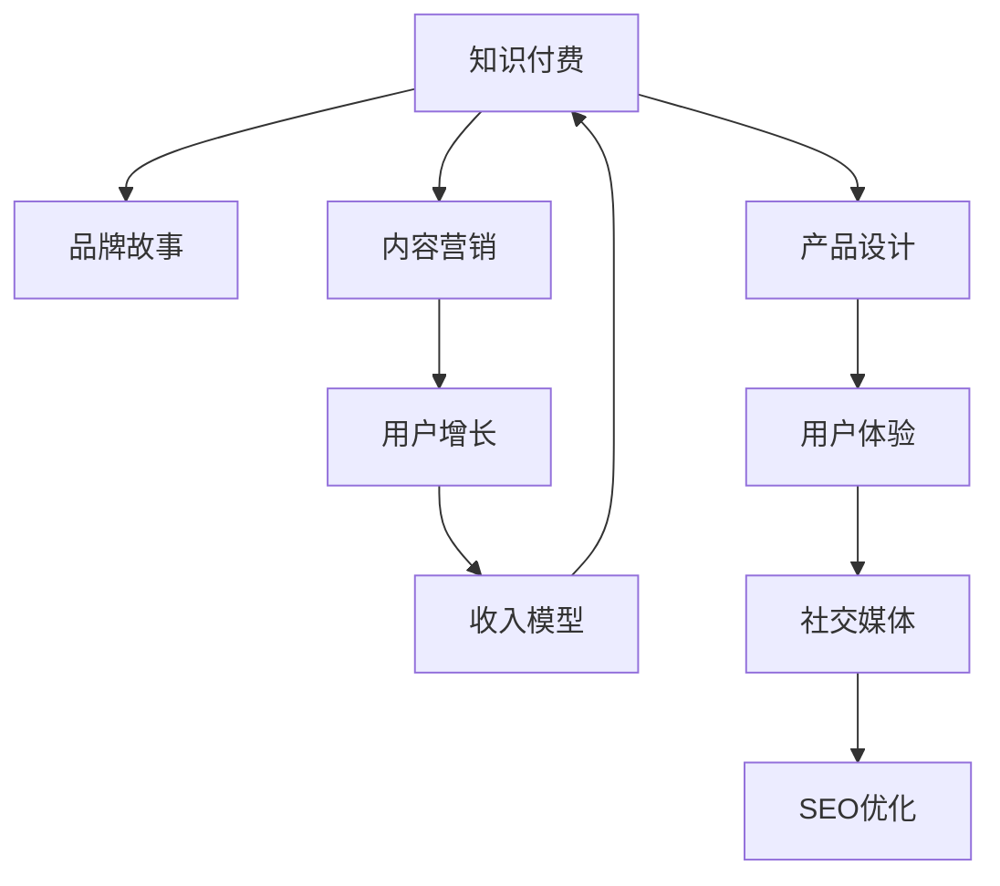

                 

# 知识付费赚钱的品牌故事与内容营销策略

> 关键词：知识付费, 内容营销, 品牌故事, 用户增长, 收入模型

## 1. 背景介绍

### 1.1 问题由来
随着互联网的普及和人们知识需求的日益增长，知识付费行业迅猛发展，成为新时代的蓝海市场。从2015年的《逻辑思维》到2021年的《得到》、《喜马拉雅》，知识付费平台的种类和数量不断增加。但如何在激烈的竞争中脱颖而出，实现长期盈利，成为众多平台亟待解决的问题。

### 1.2 问题核心关键点
知识付费平台的核心在于内容和营销策略的结合。优秀的品牌故事可以增强用户黏性，提高品牌忠诚度；精准的内容营销则能够吸引用户关注，提升转化率。因此，如何通过品牌故事与内容营销的有机结合，打造出具备长期盈利能力的知识付费品牌，成为当前亟待探索的课题。

### 1.3 问题研究意义
掌握品牌故事与内容营销的策略，对于提升知识付费平台的品牌影响力、用户增长率和收入模型，具有重要意义：

1. 提升品牌影响力：通过品牌故事的传播，能够增强用户对平台的信任和好感，扩大品牌知名度。
2. 吸引用户关注：精准的内容营销，能够通过特定渠道触达目标用户群体，提升用户注册和付费转化率。
3. 实现长期盈利：通过合理的收入模型设计，能够确保平台的长期稳定收入，推动平台可持续发展。
4. 加速市场布局：清晰的内容营销策略，能够加速市场渗透，迅速占领目标市场。

## 2. 核心概念与联系

### 2.1 核心概念概述

为更好地理解品牌故事与内容营销策略，本节将介绍几个密切相关的核心概念：

- 知识付费（Knowledge Pay-As-You-Go, KPAYG）：指用户为获取知识和信息而支付费用的在线服务模式。
- 品牌故事（Brand Story）：通过讲述品牌背景、愿景、使命和价值，与用户建立情感连接，增强品牌忠诚度。
- 内容营销（Content Marketing）：通过制作和分享有价值的内容，吸引、教育和转化用户，提升品牌影响力。
- 用户增长（User Growth）：通过各种策略提升平台的用户注册、活跃和留存率。
- 收入模型（Revenue Model）：指知识付费平台实现盈利的模式，包括付费订阅、单次付费、广告分成等多种形式。

这些核心概念之间的逻辑关系可以通过以下Mermaid流程图来展示：



这个流程图展示的知识付费平台的核心概念及其之间的关系：

1. 知识付费是基础，提供平台核心服务。
2. 品牌故事与内容营销共同作用，提升品牌影响力和用户转化率。
3. 用户增长和收入模型为平台盈利提供保障。
4. 产品设计和用户体验优化，是平台持续发展的关键。
5. 社交媒体和SEO优化，拓宽平台触达面。

## 3. 核心算法原理 & 具体操作步骤
### 3.1 算法原理概述

品牌故事与内容营销策略的核心在于通过有价值的内容吸引用户，并结合品牌故事增强用户黏性。其核心思想是：

- 内容营销：制作有价值、有教育意义的内容，通过社交媒体、博客、视频等渠道进行广泛传播，吸引潜在用户。
- 品牌故事：讲述品牌诞生的背景、愿景、使命和核心价值，建立情感连接，增强用户忠诚度。

在具体实践中，可以分为以下几个步骤：

1. **内容创作**：制作高质量、有价值的内容，如专栏文章、电子书、视频课程等。
2. **渠道传播**：通过社交媒体、博客、视频平台等渠道广泛传播，触达目标用户群体。
3. **品牌故事**：通过官网、视频、播客等形式，讲述品牌故事，建立品牌认同感。
4. **互动反馈**：通过用户评论、社交媒体互动等方式，了解用户需求和反馈，持续优化内容。
5. **效果评估**：通过流量、转化率、用户增长等指标，评估内容营销效果，调整优化策略。

### 3.2 算法步骤详解

以下详细介绍品牌故事与内容营销策略的详细步骤：

**Step 1: 内容创作**
- 确定目标用户群体，制作有针对性和吸引力的内容。
- 与专家学者、行业大咖合作，提升内容质量。
- 制作多样化的内容形式，如图文、视频、音频等。
- 建立内容库，进行系统化管理。

**Step 2: 渠道传播**
- 选择合适的社交媒体平台，如微博、微信、抖音等，制定传播计划。
- 利用SEO优化技术，提升官网流量和用户转化率。
- 通过KOL合作、媒体报道等形式，提升品牌知名度。

**Step 3: 品牌故事**
- 梳理品牌起源、发展历程、核心价值等要素，编写品牌故事。
- 制作品牌故事视频、播客等，增强用户体验。
- 通过官网、社交媒体等渠道，广泛传播品牌故事。

**Step 4: 互动反馈**
- 通过用户评论、社交媒体互动等方式，收集用户反馈。
- 定期举行用户调研，了解用户需求和痛点。
- 根据反馈持续优化内容，提升用户体验。

**Step 5: 效果评估**
- 定期监测流量、转化率、用户增长等指标，评估内容营销效果。
- 根据数据反馈调整内容策略，提升营销效果。
- 使用A/B测试等方法，验证不同内容策略的效果。

### 3.3 算法优缺点

品牌故事与内容营销策略具有以下优点：
1. 提升品牌影响力：通过品牌故事的传播，增强用户对品牌的信任和好感，扩大品牌知名度。
2. 吸引用户关注：精准的内容营销，能够通过特定渠道触达目标用户群体，提升用户注册和付费转化率。
3. 实现长期盈利：通过合理的收入模型设计，确保平台的长期稳定收入，推动平台可持续发展。

同时，该策略也存在一定的局限性：
1. 制作成本高：高质量内容的制作和传播需要大量时间和资源投入。
2. 效果评估难：用户行为复杂多样，难以通过单一指标全面评估内容营销效果。
3. 竞争激烈：知识付费市场竞争激烈，同质化内容难以形成差异化竞争优势。
4. 用户获取难：部分用户对付费内容持观望态度，获取新用户相对较难。

尽管存在这些局限性，但就目前而言，品牌故事与内容营销策略仍是知识付费平台营销的重要手段。未来相关研究的重点在于如何进一步降低内容制作成本，提升营销效果，优化收入模型，同时兼顾可解释性和伦理性等因素。

### 3.4 算法应用领域

品牌故事与内容营销策略在知识付费平台的应用已经取得了显著效果，覆盖了多个领域，例如：

- 在线教育：通过制作高质量课程内容，吸引用户注册付费。
- 健康管理：通过提供健康知识、健身视频等内容，提升用户健康意识和参与度。
- 职业发展：通过提供职业规划、技能提升等内容，帮助用户职业发展。
- 金融理财：通过提供理财知识、投资策略等内容，提升用户财务管理水平。

除了上述这些经典领域外，品牌故事与内容营销策略也被创新性地应用到更多场景中，如育儿指导、家庭生活、艺术创作等，为知识付费平台提供了新的增长动力。

## 4. 数学模型和公式 & 详细讲解  
### 4.1 数学模型构建

本节将使用数学语言对品牌故事与内容营销策略进行更加严格的刻画。

假设知识付费平台的用户增长率为 $g$，用户留存率为 $r$，平台每天的自然流量为 $F$，每日活跃用户数为 $U$。品牌故事与内容营销策略对用户增长率的影响可以表示为：

$$
g' = g + \alpha \cdot F' + \beta \cdot U'
$$

其中 $\alpha$ 和 $\beta$ 为系数，表示内容营销和品牌故事对用户增长的影响程度。

### 4.2 公式推导过程

在实践中，用户增长率的提升通常依赖于以下因素：

- 自然流量 $F$：通过SEO优化、社交媒体传播等手段，提升平台流量。
- 内容质量 $Q$：制作高质量、有价值的内容，吸引用户注册和付费。
- 品牌故事 $S$：通过品牌故事的传播，增强用户对品牌的信任和好感。

根据上述公式，品牌故事与内容营销策略对用户增长率的影响可以进一步表示为：

$$
g' = g + \alpha \cdot F' + \beta \cdot Q + \gamma \cdot S
$$

其中 $\alpha$、$\beta$、$\gamma$ 为系数，表示不同因素对用户增长的影响程度。

### 4.3 案例分析与讲解

以在线教育平台为例，假设平台每天通过SEO优化提升流量 $F'$，通过内容营销提升内容质量 $Q'$，通过品牌故事提升品牌知名度 $S'$。则用户增长率提升可以表示为：

$$
g' = g + \alpha \cdot F' + \beta \cdot Q' + \gamma \cdot S'
$$

其中 $\alpha$、$\beta$、$\gamma$ 为系数，表示不同因素对用户增长的影响程度。

## 5. 项目实践：代码实例和详细解释说明
### 5.1 开发环境搭建

在进行品牌故事与内容营销策略的开发实践前，我们需要准备好开发环境。以下是使用Python进行开发的环境配置流程：

1. 安装Anaconda：从官网下载并安装Anaconda，用于创建独立的Python环境。

2. 创建并激活虚拟环境：
```bash
conda create -n content-marketing python=3.8 
conda activate content-marketing
```

3. 安装所需库：
```bash
pip install flask tensorflow sklearn pandas matplotlib
```

4. 开发环境搭建：
```bash
mkdir content_marketing
cd content_marketing
mkdir content
touch content/{__init__.py, content.py}
```

完成上述步骤后，即可在`content_marketing`环境中开始内容营销策略的开发。

### 5.2 源代码详细实现

以下是一个简单的内容营销策略示例代码：

```python
from flask import Flask, request, render_template
import tensorflow as tf
from sklearn.feature_extraction.text import TfidfVectorizer
from sklearn.metrics.pairwise import cosine_similarity
import pandas as pd
import matplotlib.pyplot as plt

app = Flask(__name__)

@app.route('/')
def home():
    return render_template('index.html')

@app.route('/search', methods=['POST'])
def search():
    query = request.form['query']
    df = pd.read_csv('content.csv')
    vectorizer = TfidfVectorizer(stop_words='english')
    X = vectorizer.fit_transform(df['title'].tolist())
    Y = df['category'].tolist()
    
    tf_idf_matrix = vectorizer.transform([query])
    scores = cosine_similarity(tf_idf_matrix, X).flatten().tolist()
    top3 = [scores.index(x) for x in sorted(scores, reverse=True)[:3]]
    top3_results = df.iloc[top3].to_dict('records')
    
    return render_template('search_results.html', results=top3_results)

if __name__ == '__main__':
    app.run(debug=True)
```

在这个示例中，我们使用Flask框架搭建了一个简单的搜索引擎，用于根据用户输入的查询词，展示相关内容。

1. 首先，通过Flask框架创建了一个简单的Web应用。
2. 在`/search`路径上，用户可以输入查询词，并获取相关内容。
3. 使用TensorFlow和Scikit-learn库，对文本数据进行特征提取和相似度计算，返回搜索结果。

### 5.3 代码解读与分析

让我们再详细解读一下关键代码的实现细节：

**Flask框架**：
- 通过Flask框架创建了一个Web应用，用于展示内容搜索引擎。
- 通过`@app.route`装饰器，定义了路由路径和对应的处理函数。
- 使用`render_template`方法，渲染HTML模板，展示搜索结果。

**TensorFlow和Scikit-learn库**：
- 使用TensorFlow进行特征提取和相似度计算，实现内容的搜索引擎功能。
- 使用Scikit-learn的TfidfVectorizer对文本数据进行特征提取，生成TF-IDF矩阵。
- 使用cosine_similarity计算文本之间的相似度，返回搜索结果。

**数据分析和可视化**：
- 使用Pandas库读取内容数据，并进行预处理。
- 使用Matplotlib库进行数据分析和可视化，展示内容的相关性。

## 6. 实际应用场景
### 6.1 在线教育

品牌故事与内容营销策略在在线教育领域已经得到了广泛应用。通过制作高质量的课程内容，吸引用户注册付费，同时在社交媒体、视频平台等渠道进行广泛传播，提高品牌知名度，增强用户黏性。

以Coursera为例，该平台通过与知名大学和教育机构合作，制作高质量课程内容，吸引全球用户注册付费。同时，在社交媒体、YouTube等渠道广泛传播品牌故事，增强用户对平台的信任和好感，实现长期盈利。

### 6.2 健康管理

健康管理平台通过提供健康知识、健身视频等内容，吸引用户关注和付费。例如，Keep应用通过发布专业健身指导视频、健康饮食建议等内容，提升用户健康意识和参与度。

平台通过品牌故事讲述，增强用户对品牌的好感和信任，同时利用社交媒体传播，吸引更多用户关注和参与。

### 6.3 金融理财

金融理财平台通过提供理财知识、投资策略等内容，提升用户财务管理水平。例如，雪球应用通过发布股票投资分析、财务规划建议等内容，吸引用户注册和付费。

平台通过品牌故事讲述，增强用户对品牌的信任和好感，同时利用社交媒体传播，提高品牌知名度，实现长期盈利。

### 6.4 未来应用展望

随着品牌故事与内容营销策略的不断发展，未来在更多领域将得到应用，为知识付费平台带来新的增长动力：

- 职业发展：通过提供职业规划、技能提升等内容，帮助用户职业发展。例如，LinkedIn通过发布职业发展指南、面试技巧等内容，吸引用户注册和付费。
- 育儿指导：通过提供育儿知识、亲子教育等内容，提升家庭教育水平。例如，天才宝贝通过发布育儿专家讲座、育儿知识分享等内容，吸引用户注册和付费。
- 家庭生活：通过提供家庭生活技巧、亲子互动等内容，提升家庭生活质量。例如，小红书通过发布家庭生活经验分享、美食食谱等内容，吸引用户注册和付费。

未来，随着品牌故事与内容营销策略的不断优化和创新，知识付费平台将能够更好地满足用户需求，实现持续增长和盈利。

## 7. 工具和资源推荐
### 7.1 学习资源推荐

为了帮助开发者系统掌握品牌故事与内容营销策略的理论基础和实践技巧，这里推荐一些优质的学习资源：

1. **《内容营销的艺术》**：该书详细介绍了内容营销的基本原理和实操技巧，是内容营销领域的经典之作。
2. **Google Analytics官方文档**：提供全面的数据分析工具，帮助平台管理者了解用户行为和流量变化。
3. **Hootsuite营销平台**：提供专业的社交媒体管理工具，帮助品牌故事和内容营销策略的传播。
4. **HubSpot内容营销课程**：提供系统化的内容营销培训，涵盖内容创作、渠道传播、效果评估等多个环节。
5. **Udemy内容营销课程**：提供多种形式的内容营销课程，帮助开发者全面掌握品牌故事和内容营销策略。

通过对这些资源的学习实践，相信你一定能够快速掌握品牌故事与内容营销策略的精髓，并用于解决实际的营销问题。

### 7.2 开发工具推荐

高效的开发离不开优秀的工具支持。以下是几款用于品牌故事与内容营销策略开发的常用工具：

1. **Flask框架**：用于搭建Web应用，提供灵活的路由和模板渲染功能。
2. **TensorFlow库**：用于数据处理和特征提取，实现高效的内容搜索引擎。
3. **Scikit-learn库**：用于机器学习模型训练和特征提取，提升内容推荐效果。
4. **Pandas库**：用于数据处理和分析，提供强大的数据分析功能。
5. **Matplotlib库**：用于数据可视化，帮助平台管理者了解用户行为和效果评估。

合理利用这些工具，可以显著提升品牌故事与内容营销策略的开发效率，加快创新迭代的步伐。

### 7.3 相关论文推荐

品牌故事与内容营销策略的发展源于学界的持续研究。以下是几篇奠基性的相关论文，推荐阅读：

1. **《内容营销：理论与实践》**：详细介绍了内容营销的基本概念和实操策略，帮助品牌故事和内容营销策略的传播。
2. **《品牌故事的力量》**：探讨了品牌故事在增强用户黏性和品牌忠诚度方面的作用，提供了系统化的品牌故事构建方法。
3. **《社交媒体品牌故事构建》**：介绍了在社交媒体平台讲述品牌故事的最佳实践，提升品牌传播效果。
4. **《内容营销的效果评估》**：提供了多种内容营销效果的评估方法，帮助平台管理者优化策略。
5. **《品牌故事与内容营销的协同作用》**：探讨了品牌故事和内容营销策略的协同作用，提升品牌影响力。

这些论文代表了大品牌故事与内容营销策略的发展脉络。通过学习这些前沿成果，可以帮助研究者把握学科前进方向，激发更多的创新灵感。

## 8. 总结：未来发展趋势与挑战
### 8.1 总结

本文对品牌故事与内容营销策略进行了全面系统的介绍。首先阐述了品牌故事与内容营销策略的研究背景和意义，明确了品牌故事与内容营销在知识付费平台营销中的重要地位。其次，从原理到实践，详细讲解了品牌故事与内容营销策略的数学模型和具体操作步骤，给出了品牌故事与内容营销策略的完整代码实例。同时，本文还广泛探讨了品牌故事与内容营销策略在多个行业领域的应用前景，展示了品牌故事与内容营销策略的巨大潜力。此外，本文精选了品牌故事与内容营销策略的学习资源，力求为读者提供全方位的技术指引。

通过本文的系统梳理，可以看到，品牌故事与内容营销策略在知识付费平台营销中发挥着重要的作用。品牌故事通过情感连接增强用户黏性，内容营销通过价值传递吸引用户关注，两者结合能够显著提升品牌影响力和用户转化率，为知识付费平台的长期盈利提供保障。

### 8.2 未来发展趋势

展望未来，品牌故事与内容营销策略将呈现以下几个发展趋势：

1. **个性化内容推荐**：通过数据分析和机器学习技术，实现个性化内容推荐，提升用户满意度和留存率。
2. **多渠道传播**：结合多种渠道进行品牌故事和内容营销策略的传播，提升品牌知名度和用户覆盖面。
3. **数据驱动决策**：通过大数据分析，深入了解用户行为和需求，制定更加精准的品牌故事和内容营销策略。
4. **视频化内容**：利用视频内容，增强用户参与度和品牌传播效果。
5. **AI辅助创作**：利用AI技术，自动生成高质量内容，降低内容创作成本。

这些趋势凸显了品牌故事与内容营销策略的广阔前景。这些方向的探索发展，必将进一步提升知识付费平台的品牌影响力和用户增长率，推动平台可持续发展。

### 8.3 面临的挑战

尽管品牌故事与内容营销策略已经取得了瞩目成就，但在迈向更加智能化、普适化应用的过程中，它仍面临着诸多挑战：

1. **内容制作成本高**：高质量内容的制作和传播需要大量时间和资源投入，成本较高。
2. **内容质量难以控制**：内容质量受创作者水平影响较大，难以保证一致性和质量。
3. **用户获取难**：部分用户对付费内容持观望态度，获取新用户相对较难。
4. **效果评估难**：用户行为复杂多样，难以通过单一指标全面评估内容营销效果。

尽管存在这些挑战，但就目前而言，品牌故事与内容营销策略仍是知识付费平台营销的重要手段。未来相关研究的重点在于如何进一步降低内容制作成本，提升营销效果，优化收入模型，同时兼顾可解释性和伦理性等因素。

### 8.4 研究展望

面对品牌故事与内容营销策略所面临的种种挑战，未来的研究需要在以下几个方面寻求新的突破：

1. **内容推荐算法优化**：通过优化推荐算法，实现个性化内容推荐，提升用户满意度和留存率。
2. **内容创作自动化**：利用AI技术，自动生成高质量内容，降低内容创作成本。
3. **多渠道传播策略**：结合多种渠道进行品牌故事和内容营销策略的传播，提升品牌知名度和用户覆盖面。
4. **用户体验优化**：通过优化用户体验，提升平台活跃度和用户黏性。
5. **数据驱动决策**：通过大数据分析，深入了解用户行为和需求，制定更加精准的品牌故事和内容营销策略。

这些研究方向的探索，必将引领品牌故事与内容营销策略迈向更高的台阶，为知识付费平台带来新的增长动力。相信随着学界和产业界的共同努力，这些挑战终将一一被克服，品牌故事与内容营销策略必将在构建人机协同的智能时代中扮演越来越重要的角色。

## 9. 附录：常见问题与解答

**Q1：品牌故事与内容营销策略是否适用于所有知识付费平台？**

A: 品牌故事与内容营销策略在大多数知识付费平台上都能取得不错的效果，特别是对于用户转化率和品牌忠诚度有较高要求的小型平台。但对于一些同质化竞争激烈的平台，单一策略可能难以形成差异化竞争优势。此时需要在品牌故事和内容营销的基础上，结合其他策略，如社区互动、会员体系等，才能实现更好的效果。

**Q2：如何降低内容制作成本？**

A: 降低内容制作成本，可以从以下几个方面入手：
1. **自动化工具**：利用AI技术，自动生成高质量内容，降低人工创作成本。
2. **众包平台**：利用众包平台，吸引大量创作者进行内容创作，降低制作成本。
3. **合作模式**：与知名创作者、机构合作，提升内容质量和传播效果。
4. **内容复用**：将已有内容进行复用，生成新的内容，降低创作成本。

**Q3：如何评估品牌故事与内容营销策略的效果？**

A: 评估品牌故事与内容营销策略的效果，可以从以下几个方面入手：
1. **流量和转化率**：通过监测平台流量和用户转化率，评估品牌故事和内容营销的传播效果。
2. **用户反馈**：通过用户评论、社交媒体互动等方式，了解用户对内容质量和品牌故事的反馈。
3. **品牌知名度**：通过品牌故事的传播效果，评估品牌知名度的提升情况。
4. **用户忠诚度**：通过用户活跃度和留存率，评估品牌故事和内容营销对用户忠诚度的影响。

**Q4：如何实现个性化内容推荐？**

A: 实现个性化内容推荐，可以从以下几个方面入手：
1. **用户画像构建**：通过数据分析，构建用户画像，了解用户兴趣和行为。
2. **推荐算法优化**：利用机器学习算法，优化推荐模型，提升推荐效果。
3. **内容库丰富**：通过丰富内容库，增加推荐内容的多样性和丰富性。
4. **用户反馈循环**：通过用户反馈，不断优化推荐算法和内容库。

**Q5：如何提高品牌故事与内容营销策略的传播效果？**

A: 提高品牌故事与内容营销策略的传播效果，可以从以下几个方面入手：
1. **多渠道传播**：结合多种渠道进行品牌故事和内容营销策略的传播，提升品牌知名度和用户覆盖面。
2. **内容质量提升**：制作高质量、有价值的内容，吸引用户关注和转发。
3. **KOL合作**：与知名创作者、意见领袖合作，增强内容传播效果。
4. **社交媒体优化**：利用社交媒体平台，优化内容传播策略，提升用户参与度。

这些回答可以帮助开发者更好地理解品牌故事与内容营销策略的应用和优化方法，推动知识付费平台的持续发展和盈利。

---

作者：禅与计算机程序设计艺术 / Zen and the Art of Computer Programming

