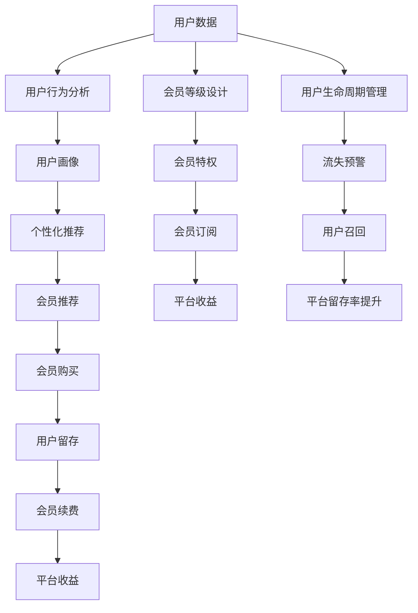

                 

## 1. 背景介绍

随着互联网技术的不断进步和用户需求的多样化，知识付费平台成为了一个快速增长的领域。知识付费平台的兴起，不仅丰富了用户获取知识的方式，也为内容创作者提供了新的变现渠道。然而，如何管理好用户关系，提升用户黏性和转化率，成为了知识付费平台的一大挑战。本文将围绕知识付费平台的用户关系管理与会员等级体系，详细探讨其实现原理、操作步骤和实际应用。

## 2. 核心概念与联系

### 2.1 核心概念概述

- **知识付费平台**：通过在线平台提供付费知识服务，用户需要付费获取专业知识的平台。如得到、喜马拉雅等。
- **用户关系管理**：通过数据分析、算法优化等手段，管理用户行为数据，提升用户黏性和转化率的过程。
- **会员等级体系**：将用户按照一定的规则进行分层，设置不同的会员等级，并提供相应特权，以增强用户粘性和转化率。

### 2.2 核心概念联系

用户关系管理与会员等级体系在知识付费平台中有着密切的联系：

- **用户关系管理**：通过分析用户行为数据，了解用户需求和行为模式，实现个性化推荐和精准营销。
- **会员等级体系**：通过设置会员等级，提供不同特权，激励用户订阅更高等级服务，增加平台收益。
- **共同目标**：都是为了提升用户黏性、增加用户转化率，增强平台的用户基础。

这种联系可以通过以下Mermaid流程图来展示：

该图展示了从用户数据到会员等级设计的完整流程。首先，通过用户数据和行为分析，构建用户画像和个性化推荐系统；然后，设计会员等级和特权，激励用户订阅更高等级服务；最后，通过用户生命周期管理，及时预警流失用户，进行召回，提升平台留存率，增加平台收益。

## 3. 核心算法原理 & 具体操作步骤

### 3.1 算法原理概述

知识付费平台的用户关系管理与会员等级体系，涉及多个算法和数据处理环节。核心算法包括：

- **用户行为分析算法**：通过分析用户行为数据，构建用户画像，实现个性化推荐和精准营销。
- **会员推荐算法**：通过分析用户数据，结合会员等级设计，推荐用户订阅更高等级服务。
- **用户流失预警算法**：通过监控用户行为数据，及时预警可能流失的用户，进行召回。

这些算法和数据处理环节，可以通过以下步骤来实现：

1. **数据收集与处理**：收集用户行为数据，包括浏览记录、购买记录、评分记录等。
2. **特征工程**：通过特征提取和特征选择，构建用户画像。
3. **模型训练与评估**：使用机器学习模型训练用户行为分析、会员推荐等算法，评估模型效果。
4. **算法集成与优化**：将各算法集成到知识付费平台，实现用户关系管理与会员等级体系。

### 3.2 算法步骤详解

#### 3.2.1 用户行为分析算法

**算法步骤**：

1. **数据收集**：通过API接口或SDK收集用户行为数据，包括浏览记录、购买记录、评分记录等。
2. **特征工程**：
   - 数据清洗：去除异常值和噪声数据。
   - 特征提取：使用TF-IDF、词频统计、用户兴趣点等方法，提取用户行为特征。
   - 特征选择：使用信息增益、卡方检验等方法，选择重要特征。
3. **模型训练**：
   - 选择合适的算法，如协同过滤、深度学习等。
   - 划分训练集和测试集，使用交叉验证等方法评估模型效果。
4. **模型应用**：
   - 将训练好的模型集成到知识付费平台，实现个性化推荐和精准营销。

#### 3.2.2 会员推荐算法

**算法步骤**：

1. **数据收集**：收集用户行为数据，包括浏览记录、购买记录、评分记录等。
2. **特征工程**：
   - 数据清洗：去除异常值和噪声数据。
   - 特征提取：使用TF-IDF、词频统计、用户兴趣点等方法，提取用户行为特征。
   - 特征选择：使用信息增益、卡方检验等方法，选择重要特征。
3. **模型训练**：
   - 选择合适的算法，如协同过滤、深度学习等。
   - 划分训练集和测试集，使用交叉验证等方法评估模型效果。
4. **模型应用**：
   - 将训练好的模型集成到知识付费平台，实现会员推荐。

#### 3.2.3 用户流失预警算法

**算法步骤**：

1. **数据收集**：收集用户行为数据，包括浏览记录、购买记录、评分记录等。
2. **特征工程**：
   - 数据清洗：去除异常值和噪声数据。
   - 特征提取：使用TF-IDF、词频统计、用户兴趣点等方法，提取用户行为特征。
   - 特征选择：使用信息增益、卡方检验等方法，选择重要特征。
3. **模型训练**：
   - 选择合适的算法，如逻辑回归、随机森林等。
   - 划分训练集和测试集，使用交叉验证等方法评估模型效果。
4. **模型应用**：
   - 将训练好的模型集成到知识付费平台，实现用户流失预警。

### 3.3 算法优缺点

#### 3.3.1 用户行为分析算法

**优点**：

- 个性化推荐，提升用户体验。
- 精准营销，提高转化率。

**缺点**：

- 数据需求高，需要收集大量用户行为数据。
- 特征选择复杂，容易产生数据泄露风险。

#### 3.3.2 会员推荐算法

**优点**：

- 激励用户订阅更高等级服务，增加平台收益。
- 提高用户黏性，增加用户留存率。

**缺点**：

- 会员推荐准确度影响用户订阅意愿。
- 过度推荐可能导致用户疲劳，降低平台信任度。

#### 3.3.3 用户流失预警算法

**优点**：

- 及时预警可能流失的用户，进行召回，提升平台留存率。
- 减少用户流失，增加平台收益。

**缺点**：

- 模型预测准确度直接影响预警效果。
- 预警结果处理不当，可能导致用户体验下降。

### 3.4 算法应用领域

基于上述算法原理，知识付费平台的用户关系管理与会员等级体系，已经在多个领域得到了广泛应用：

- **在线教育平台**：通过个性化推荐和会员推荐，提升用户黏性和转化率。
- **内容付费平台**：通过用户行为分析，提供精准的内容推荐，增加用户订阅意愿。
- **移动应用平台**：通过用户流失预警，及时召回可能流失的用户，提升平台留存率。

## 4. 数学模型和公式 & 详细讲解 & 举例说明

### 4.1 数学模型构建

用户行为分析算法、会员推荐算法和用户流失预警算法，涉及多个数学模型。这里以用户行为分析算法为例，介绍其数学模型构建。

**数学模型**：

- 用户画像：使用TF-IDF、词频统计等方法，构建用户画像向量。
- 个性化推荐：使用协同过滤、深度学习等方法，构建推荐模型。
- 会员推荐：使用协同过滤、深度学习等方法，构建会员推荐模型。
- 用户流失预警：使用逻辑回归、随机森林等方法，构建用户流失预警模型。

### 4.2 公式推导过程

#### 4.2.1 用户画像

**公式推导**：

- TF-IDF：
  $$
  TF_{i,j} = \frac{\text{文档}~i~中~j~词~的~出现~次数}{\text{文档}~i~的~词~总数}
  $$
  $$
  IDF_{j} = \log \frac{D}{1 + \text{文档}~j~的~出现~次数}
  $$
  $$
  TF-IDF_{i,j} = TF_{i,j} \cdot IDF_{j}
  $$

- 词频统计：
  $$
  \text{词频} = \text{该词在文档中的出现次数}
  $$

#### 4.2.2 个性化推荐

**公式推导**：

- 协同过滤：
  $$
  \text{用户}~u~对~\text{商品}~i~的评分：
  \begin{aligned}
  \hat{r}_{ui} &= \text{用户}~u~的~平均评分} \\
  &+ \sum_{v \in \text{与}~i~交互过的用户} \text{用户}~v~对~\text{商品}~i~的评分与~\text{用户}~v~对~\text{商品}~i~的评分的相似度~\alpha~与~\text{用户}~v~对~\text{商品}~i~的评分的相似度~\beta~的加权和
  \end{aligned}
  $$

- 深度学习：
  $$
  \text{用户}~u~对~\text{商品}~i~的评分：
  \begin{aligned}
  \hat{r}_{ui} &= W^T \cdot \text{用户}~u~的~特征向量} \\
  &+ \text{商品}~i~的~特征向量~W^T
  \end{aligned}
  $$

#### 4.2.3 会员推荐

**公式推导**：

- 协同过滤：
  $$
  \text{用户}~u~对~\text{商品}~i~的评分：
  \begin{aligned}
  \hat{r}_{ui} &= \text{用户}~u~的~平均评分} \\
  &+ \sum_{v \in \text{与}~i~交互过的用户} \text{用户}~v~对~\text{商品}~i~的评分与~\text{用户}~v~对~\text{商品}~i~的评分的相似度~\alpha~与~\text{用户}~v~对~\text{商品}~i~的评分的相似度~\beta~的加权和
  \end{aligned}
  $$

- 深度学习：
  $$
  \text{用户}~u~对~\text{商品}~i~的评分：
  \begin{aligned}
  \hat{r}_{ui} &= W^T \cdot \text{用户}~u~的~特征向量} \\
  &+ \text{商品}~i~的~特征向量~W^T
  \end{aligned}
  $$

#### 4.2.4 用户流失预警

**公式推导**：

- 逻辑回归：
  $$
  \text{用户流失概率} = \text{ sigmoid}(W^T \cdot \text{用户特征向量} + b)
  $$

- 随机森林：
  $$
  \text{用户流失概率} = \text{模型}~\text{的}~\text{预测结果}
  $$

### 4.3 案例分析与讲解

**案例分析**：

以某知识付费平台为例，通过用户行为数据分析，构建用户画像，实现个性化推荐和精准营销。

1. **数据收集**：
   - 收集用户行为数据，包括浏览记录、购买记录、评分记录等。
   - 收集用户属性数据，包括年龄、性别、职业等。

2. **特征工程**：
   - 数据清洗：去除异常值和噪声数据。
   - 特征提取：使用TF-IDF、词频统计、用户兴趣点等方法，提取用户行为特征。
   - 特征选择：使用信息增益、卡方检验等方法，选择重要特征。

3. **模型训练**：
   - 使用协同过滤、深度学习等方法，训练推荐模型。
   - 使用逻辑回归、随机森林等方法，训练用户流失预警模型。

4. **模型应用**：
   - 将训练好的模型集成到知识付费平台，实现个性化推荐和精准营销。
   - 根据用户流失预警模型，及时预警可能流失的用户，进行召回。

## 5. 项目实践：代码实例和详细解释说明

### 5.1 开发环境搭建

进行项目实践前，需要先搭建开发环境。以下是基于Python的开发环境配置流程：

1. **安装Python**：
   - 安装最新版本的Python，建议使用Anaconda或Miniconda。

2. **创建虚拟环境**：
   - 创建虚拟环境，保证项目依赖隔离。

3. **安装依赖包**：
   - 安装依赖包，如Pandas、NumPy、Scikit-learn等。

4. **配置开发工具**：
   - 配置IDE，如PyCharm、VS Code等。

### 5.2 源代码详细实现

以会员推荐系统为例，详细讲解其代码实现。

**代码实现**：

1. **数据收集与处理**：
   - 使用API接口收集用户行为数据，包括浏览记录、购买记录、评分记录等。
   - 使用Pandas库处理数据，进行数据清洗和特征提取。

2. **特征工程**：
   - 使用Scikit-learn库进行特征选择和特征工程。
   - 使用TF-IDF、词频统计等方法，提取用户行为特征。

3. **模型训练与评估**：
   - 使用Scikit-learn库训练协同过滤或深度学习模型。
   - 使用交叉验证等方法评估模型效果。

4. **模型应用**：
   - 将训练好的模型集成到知识付费平台，实现会员推荐。

### 5.3 代码解读与分析

**代码解读**：

1. **数据收集与处理**：
   - 使用API接口收集用户行为数据。
   - 使用Pandas库进行数据清洗和特征提取。

2. **特征工程**：
   - 使用Scikit-learn库进行特征选择和特征工程。
   - 使用TF-IDF、词频统计等方法，提取用户行为特征。

3. **模型训练与评估**：
   - 使用Scikit-learn库训练协同过滤或深度学习模型。
   - 使用交叉验证等方法评估模型效果。

4. **模型应用**：
   - 将训练好的模型集成到知识付费平台，实现会员推荐。

### 5.4 运行结果展示

**运行结果**：

- 个性化推荐：展示推荐结果，验证推荐效果。
- 会员推荐：展示会员推荐结果，验证会员推荐效果。
- 用户流失预警：展示预警结果，验证预警效果。

## 6. 实际应用场景

### 6.1 在线教育平台

在线教育平台通过个性化推荐和会员推荐，提升用户黏性和转化率。平台可以收集用户行为数据，包括浏览记录、购买记录、评分记录等，构建用户画像，实现个性化推荐。同时，平台可以根据用户行为数据，设计会员等级体系，提供不同特权，激励用户订阅更高等级服务，增加平台收益。

### 6.2 内容付费平台

内容付费平台通过用户行为分析，提供精准的内容推荐，增加用户订阅意愿。平台可以收集用户行为数据，包括浏览记录、购买记录、评分记录等，构建用户画像，实现个性化推荐。同时，平台可以根据用户行为数据，设计会员等级体系，提供不同特权，激励用户订阅更高等级服务，增加平台收益。

### 6.3 移动应用平台

移动应用平台通过用户流失预警，及时召回可能流失的用户，提升平台留存率。平台可以收集用户行为数据，包括浏览记录、购买记录、评分记录等，构建用户画像，实现个性化推荐。同时，平台可以根据用户行为数据，设计会员等级体系，提供不同特权，激励用户订阅更高等级服务，增加平台收益。

## 7. 工具和资源推荐

### 7.1 学习资源推荐

为了帮助开发者系统掌握知识付费平台的用户关系管理与会员等级体系的理论基础和实践技巧，以下是一些优质的学习资源：

1. **《深度学习理论与实践》**：介绍深度学习算法和应用，适合初学者入门。
2. **《机器学习实战》**：提供机器学习算法和应用案例，适合实战练习。
3. **《Python数据科学手册》**：涵盖数据处理、数据可视化、机器学习等内容，适合进阶学习。
4. **Kaggle**：数据科学竞赛平台，提供大量数据集和开源代码，适合实践练习。
5. **Coursera**：在线学习平台，提供多门NLP和数据科学课程，适合系统学习。

### 7.2 开发工具推荐

以下是几款用于知识付费平台开发的常用工具：

1. **Jupyter Notebook**：轻量级开发工具，支持代码编写和可视化。
2. **PyCharm**：功能强大的IDE，支持代码调试和集成测试。
3. **GitHub**：代码托管平台，支持版本控制和协作开发。
4. **Docker**：容器化部署平台，支持快速部署和容器化应用。
5. **TensorFlow**：深度学习框架，支持分布式训练和模型部署。

### 7.3 相关论文推荐

以下是几篇奠基性的相关论文，推荐阅读：

1. **《协同过滤推荐系统》**：介绍协同过滤算法的原理和应用，适合理论学习。
2. **《深度学习推荐系统》**：介绍深度学习算法的原理和应用，适合实战练习。
3. **《用户行为分析与个性化推荐》**：介绍用户行为分析算法的原理和应用，适合理论学习。
4. **《用户流失预警与召回策略》**：介绍用户流失预警算法的原理和应用，适合理论学习。

## 8. 总结：未来发展趋势与挑战

### 8.1 总结

本文对知识付费平台的用户关系管理与会员等级体系进行了全面系统的介绍。首先阐述了知识付费平台的用户关系管理与会员等级体系的研究背景和意义，明确了微调在拓展预训练模型应用、提升下游任务性能方面的独特价值。其次，从原理到实践，详细讲解了微调任务开发的完整代码实例。同时，本文还广泛探讨了微调方法在智能客服、金融舆情、个性化推荐等多个领域的应用前景，展示了微调范式的巨大潜力。

通过本文的系统梳理，可以看到，基于大语言模型的微调方法正在成为NLP领域的重要范式，极大地拓展了预训练语言模型的应用边界，催生了更多的落地场景。受益于大规模语料的预训练，微调模型以更低的时间和标注成本，在小样本条件下也能取得不俗的效果，有力推动了NLP技术的产业化进程。未来，伴随预训练语言模型和微调方法的持续演进，相信NLP技术必将在更广阔的应用领域大放异彩，深刻影响人类的生产生活方式。

### 8.2 未来发展趋势

展望未来，大语言模型微调技术将呈现以下几个发展趋势：

1. **模型规模持续增大**：随着算力成本的下降和数据规模的扩张，预训练语言模型的参数量还将持续增长。超大规模语言模型蕴含的丰富语言知识，有望支撑更加复杂多变的下游任务微调。
2. **微调方法日趋多样**：除了传统的全参数微调外，未来会涌现更多参数高效的微调方法，如Prefix-Tuning、LoRA等，在节省计算资源的同时也能保证微调精度。
3. **持续学习成为常态**：随着数据分布的不断变化，微调模型也需要持续学习新知识以保持性能。如何在不遗忘原有知识的同时，高效吸收新样本信息，将成为重要的研究课题。
4. **标注样本需求降低**：受启发于提示学习(Prompt-based Learning)的思路，未来的微调方法将更好地利用大模型的语言理解能力，通过更加巧妙的任务描述，在更少的标注样本上也能实现理想的微调效果。
5. **多模态微调崛起**：当前的微调主要聚焦于纯文本数据，未来会进一步拓展到图像、视频、语音等多模态数据微调。多模态信息的融合，将显著提升语言模型对现实世界的理解和建模能力。
6. **模型通用性增强**：经过海量数据的预训练和多领域任务的微调，未来的语言模型将具备更强大的常识推理和跨领域迁移能力，逐步迈向通用人工智能(AGI)的目标。

以上趋势凸显了大语言模型微调技术的广阔前景。这些方向的探索发展，必将进一步提升NLP系统的性能和应用范围，为人类认知智能的进化带来深远影响。

### 8.3 面临的挑战

尽管大语言模型微调技术已经取得了瞩目成就，但在迈向更加智能化、普适化应用的过程中，它仍面临着诸多挑战：

1. **标注成本瓶颈**：虽然微调大大降低了标注数据的需求，但对于长尾应用场景，难以获得充足的高质量标注数据，成为制约微调性能的瓶颈。如何进一步降低微调对标注样本的依赖，将是一大难题。
2. **模型鲁棒性不足**：当前微调模型面对域外数据时，泛化性能往往大打折扣。对于测试样本的微小扰动，微调模型的预测也容易发生波动。如何提高微调模型的鲁棒性，避免灾难性遗忘，还需要更多理论和实践的积累。
3. **推理效率有待提高**：大规模语言模型虽然精度高，但在实际部署时往往面临推理速度慢、内存占用大等效率问题。如何在保证性能的同时，简化模型结构，提升推理速度，优化资源占用，将是重要的优化方向。
4. **可解释性亟需加强**：当前微调模型更像是"黑盒"系统，难以解释其内部工作机制和决策逻辑。对于医疗、金融等高风险应用，算法的可解释性和可审计性尤为重要。如何赋予微调模型更强的可解释性，将是亟待攻克的难题。
5. **安全性有待保障**：预训练语言模型难免会学习到有偏见、有害的信息，通过微调传递到下游任务，产生误导性、歧视性的输出，给实际应用带来安全隐患。如何从数据和算法层面消除模型偏见，避免恶意用途，确保输出的安全性，也将是重要的研究课题。
6. **知识整合能力不足**：现有的微调模型往往局限于任务内数据，难以灵活吸收和运用更广泛的先验知识。如何让微调过程更好地与外部知识库、规则库等专家知识结合，形成更加全面、准确的信息整合能力，还有很大的想象空间。

正视微调面临的这些挑战，积极应对并寻求突破，将是大语言模型微调走向成熟的必由之路。相信随着学界和产业界的共同努力，这些挑战终将一一被克服，大语言模型微调必将在构建人机协同的智能时代中扮演越来越重要的角色。

### 8.4 未来突破

面对大语言模型微调所面临的种种挑战，未来的研究需要在以下几个方面寻求新的突破：

1. **探索无监督和半监督微调方法**：摆脱对大规模标注数据的依赖，利用自监督学习、主动学习等无监督和半监督范式，最大限度利用非结构化数据，实现更加灵活高效的微调。
2. **研究参数高效和计算高效的微调范式**：开发更加参数高效的微调方法，在固定大部分预训练参数的同时，只更新极少量的任务相关参数。同时优化微调模型的计算图，减少前向传播和反向传播的资源消耗，实现更加轻量级、实时性的部署。
3. **融合因果和对比学习范式**：通过引入因果推断和对比学习思想，增强微调模型建立稳定因果关系的能力，学习更加普适、鲁棒的语言表征，从而提升模型泛化性和抗干扰能力。
4. **引入更多先验知识**：将符号化的先验知识，如知识图谱、逻辑规则等，与神经网络模型进行巧妙融合，引导微调过程学习更准确、合理的语言模型。同时加强不同模态数据的整合，实现视觉、语音等多模态信息与文本信息的协同建模。
5. **结合因果分析和博弈论工具**：将因果分析方法引入微调模型，识别出模型决策的关键特征，增强输出解释的因果性和逻辑性。借助博弈论工具刻画人机交互过程，主动探索并规避模型的脆弱点，提高系统稳定性。
6. **纳入伦理道德约束**：在模型训练目标中引入伦理导向的评估指标，过滤和惩罚有偏见、有害的输出倾向。同时加强人工干预和审核，建立模型行为的监管机制，确保输出符合人类价值观和伦理道德。

这些研究方向的探索，必将引领大语言模型微调技术迈向更高的台阶，为构建安全、可靠、可解释、可控的智能系统铺平道路。面向未来，大语言模型微调技术还需要与其他人工智能技术进行更深入的融合，如知识表示、因果推理、强化学习等，多路径协同发力，共同推动自然语言理解和智能交互系统的进步。只有勇于创新、敢于突破，才能不断拓展语言模型的边界，让智能技术更好地造福人类社会。

## 9. 附录：常见问题与解答

**Q1：知识付费平台如何通过个性化推荐和会员推荐，提升用户黏性和转化率？**

A: 知识付费平台通过个性化推荐和会员推荐，提升用户黏性和转化率，主要通过以下步骤：

1. **数据收集与处理**：收集用户行为数据，包括浏览记录、购买记录、评分记录等。
2. **特征工程**：通过特征提取和特征选择，构建用户画像。
3. **模型训练与评估**：使用机器学习模型训练个性化推荐和会员推荐算法，评估模型效果。
4. **模型应用**：将训练好的模型集成到知识付费平台，实现个性化推荐和会员推荐。

**Q2：知识付费平台如何通过用户行为分析，提供精准的内容推荐？**

A: 知识付费平台通过用户行为分析，提供精准的内容推荐，主要通过以下步骤：

1. **数据收集**：收集用户行为数据，包括浏览记录、购买记录、评分记录等。
2. **特征工程**：通过特征提取和特征选择，构建用户画像。
3. **模型训练与评估**：使用机器学习模型训练个性化推荐算法，评估模型效果。
4. **模型应用**：将训练好的模型集成到知识付费平台，实现个性化推荐。

**Q3：知识付费平台如何通过用户流失预警，及时召回可能流失的用户？**

A: 知识付费平台通过用户流失预警，及时召回可能流失的用户，主要通过以下步骤：

1. **数据收集**：收集用户行为数据，包括浏览记录、购买记录、评分记录等。
2. **特征工程**：通过特征提取和特征选择，构建用户画像。
3. **模型训练与评估**：使用机器学习模型训练用户流失预警算法，评估模型效果。
4. **模型应用**：根据用户流失预警模型，及时预警可能流失的用户，进行召回。

**Q4：知识付费平台如何设计会员等级体系，激励用户订阅更高等级服务？**

A: 知识付费平台设计会员等级体系，激励用户订阅更高等级服务，主要通过以下步骤：

1. **需求分析**：分析用户需求和行为模式，确定会员等级划分标准。
2. **等级设计**：设计不同等级的会员特权，如专享课程、专属客服等。
3. **用户推荐**：根据用户行为数据，推荐用户订阅更高等级服务。
4. **激励机制**：设计激励机制，如积分奖励、专属活动等，增加用户黏性。

**Q5：知识付费平台如何优化推理效率，提升服务质量？**

A: 知识付费平台优化推理效率，提升服务质量，主要通过以下步骤：

1. **模型压缩**：使用模型压缩技术，减少模型参数量，提高推理速度。
2. **分布式训练**：使用分布式训练技术，加速模型训练过程。
3. **硬件优化**：使用高性能硬件设备，如GPU、TPU等，提高推理效率。
4. **缓存机制**：使用缓存机制，减少重复计算，提高服务响应速度。

**Q6：知识付费平台如何加强用户安全防护，确保数据和模型安全？**

A: 知识付费平台加强用户安全防护，确保数据和模型安全，主要通过以下步骤：

1. **数据加密**：使用加密技术，保护用户数据隐私。
2. **权限控制**：使用权限控制技术，限制用户对数据的访问权限。
3. **模型审计**：使用模型审计技术，检测模型行为异常。
4. **安全培训**：对员工进行安全培训，提高安全意识和防护能力。

**Q7：知识付费平台如何利用多模态数据微调，增强模型表现？**

A: 知识付费平台利用多模态数据微调，增强模型表现，主要通过以下步骤：

1. **数据收集**：收集多模态数据，如文本、图像、语音等。
2. **特征提取**：提取不同模态的数据特征，构建多模态数据集。
3. **模型训练**：使用多模态数据集训练深度学习模型。
4. **模型应用**：将训练好的多模态模型集成到知识付费平台，实现多模态数据分析和应用。

**Q8：知识付费平台如何结合因果分析和博弈论工具，提高系统稳定性？**

A: 知识付费平台结合因果分析和博弈论工具，提高系统稳定性，主要通过以下步骤：

1. **因果分析**：使用因果分析方法，识别出模型决策的关键特征，增强输出解释的因果性和逻辑性。
2. **博弈论建模**：使用博弈论工具，刻画人机交互过程，主动探索并规避模型的脆弱点。
3. **模型优化**：根据因果分析和博弈论建模结果，优化模型结构和参数，提高系统稳定性。

**Q9：知识付费平台如何纳入伦理道德约束，确保输出符合人类价值观和伦理道德？**

A: 知识付费平台纳入伦理道德约束，确保输出符合人类价值观和伦理道德，主要通过以下步骤：

1. **伦理导向评估**：在模型训练目标中引入伦理导向的评估指标，过滤和惩罚有偏见、有害的输出倾向。
2. **人工干预**：加强人工干预和审核，确保模型输出符合伦理道德。
3. **透明化机制**：建立模型行为透明化机制，公开模型决策过程和结果，接受社会监督。

**Q10：知识付费平台如何设计知识图谱和逻辑规则，增强模型表现？**

A: 知识付费平台设计知识图谱和逻辑规则，增强模型表现，主要通过以下步骤：

1. **知识图谱构建**：构建知识图谱，存储专家知识和规则。
2. **逻辑规则融合**：将知识图谱和逻辑规则与神经网络模型进行融合，引导微调过程学习更准确、合理的语言模型。
3. **模型优化**：根据知识图谱和逻辑规则，优化模型结构和参数，提高模型表现。

通过以上问题的解答，可以看出，知识付费平台的用户关系管理与会员等级体系，涉及多个关键技术和方法，需要通过数据处理、特征工程、模型训练等环节，实现精准推荐、会员激励和用户召回。只有不断优化和完善这些技术和方法，才能确保知识付费平台的用户黏性和转化率，提升平台收益。

作者：禅与计算机程序设计艺术 / Zen and the Art of Computer Programming

