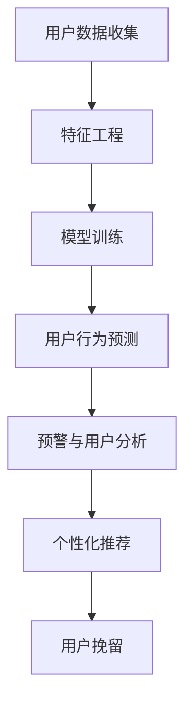

                 

# 知识付费赚钱的用户流失预警与挽留策略

> 关键词：用户流失预警, 知识付费, 挽留策略, 数据分析, 机器学习, 用户行为, 个性化推荐

## 1. 背景介绍

在快速发展的互联网时代，知识付费平台正成为用户获取专业知识的重要渠道。知识付费服务以高效的获取方式和便捷的学习路径，吸引了大量用户。然而，由于用户行为的多变性和复杂性，平台用户流失现象频发，严重影响平台收入。为解决这一问题，本文将详细分析用户流失预警与挽留的原理和实现策略，探讨如何通过精准的数据分析和模型优化，最大化用户留存率，提升平台收益。

## 2. 核心概念与联系

### 2.1 核心概念概述

本节将介绍与知识付费用户流失预警与挽留策略密切相关的核心概念，并阐明它们之间的联系。

- **用户流失（User Churn）**：指用户从平台中流失，不再活跃使用或进行消费的现象。用户流失是影响平台收入和用户增长的主要因素之一。
- **用户行为分析（User Behavior Analysis）**：通过分析用户在平台上的行为数据，如学习时长、支付频率、内容消费等，来理解用户需求和行为模式。
- **个性化推荐（Personalized Recommendation）**：根据用户的行为特征和偏好，为其推荐可能感兴趣的内容，提升用户黏性和满意度。
- **机器学习（Machine Learning）**：一种通过数据驱动模型学习，进行预测和决策的算法。
- **用户流失预警（Churn Prediction）**：利用机器学习模型预测用户可能流失的概率，及时进行干预。
- **用户挽留（User Retention）**：针对可能流失的用户，采取针对性的挽留措施，降低流失率。

以上概念通过数据收集、模型训练、行为干预等环节紧密相连，形成一个完整的用户流失预警与挽留体系。

### 2.2 核心概念原理和架构的 Mermaid 流程图



### 2.3 核心概念联系

- **用户数据收集**：为后续特征工程和模型训练提供基础数据。
- **特征工程**：通过对数据进行编码和转换，提取对预测有用的特征。
- **模型训练**：通过机器学习算法训练预测模型，生成用户流失概率。
- **用户行为预测**：根据模型预测结果，对高流失风险用户进行预警。
- **预警与用户分析**：对预警用户进行分析，识别流失原因。
- **个性化推荐**：针对不同原因的用户，设计个性化推荐策略。
- **用户挽留**：通过推荐策略降低用户流失率，提升平台收益。

各环节相辅相成，共同构成用户流失预警与挽留策略的完整框架。

## 3. 核心算法原理 & 具体操作步骤

### 3.1 算法原理概述

用户流失预警与挽留策略基于机器学习模型，通过分析用户行为数据，预测用户流失概率，并针对高流失风险用户进行预警和挽留。

核心算法流程包括：
1. 数据收集：收集用户行为数据，如学习时长、支付频率、内容消费等。
2. 特征工程：提取对流失预测有用的特征，如用户活跃度、消费频次、满意度评分等。
3. 模型训练：选择合适的机器学习算法（如逻辑回归、随机森林、神经网络等），利用历史数据训练预测模型。
4. 用户预测：利用训练好的模型对新用户行为进行预测，得出流失概率。
5. 预警与用户分析：对高流失风险用户进行预警，并分析其流失原因。
6. 个性化推荐：根据流失原因，设计个性化推荐策略。
7. 用户挽留：通过推荐策略降低用户流失率，提升平台收益。

### 3.2 算法步骤详解

#### 3.2.1 数据收集

数据收集是用户流失预警与挽留策略的基础。平台需收集用户的各类行为数据，包括但不限于：
- **用户基本信息**：年龄、性别、职业、教育程度等。
- **用户行为数据**：学习时长、支付频率、内容消费等。
- **用户反馈数据**：满意度评分、评价内容、投诉记录等。

数据收集需保证数据的准确性和实时性，以提供最真实、最即时的用户行为信息。

#### 3.2.2 特征工程

特征工程是模型训练的关键步骤，通过提取和编码数据特征，生成对预测有用的信息。主要步骤如下：
1. **特征选择**：从原始数据中选择相关性高的特征，如用户活跃度、消费频次等。
2. **特征编码**：对特征进行编码和转换，如将数值型特征转化为归一化特征，将类别型特征转化为独热编码。
3. **特征生成**：通过统计分析、组合运算等方法，生成新的特征，如用户内容偏好、学习时间分布等。

#### 3.2.3 模型训练

模型训练是用户流失预警的核心步骤，通过训练机器学习模型，生成用户流失概率预测。主要步骤如下：
1. **算法选择**：选择适合的机器学习算法，如逻辑回归、随机森林、神经网络等。
2. **数据分割**：将数据集分为训练集和测试集，用于模型训练和性能评估。
3. **模型训练**：利用训练集数据训练模型，并不断调整超参数，提高模型准确性。
4. **模型评估**：在测试集上评估模型性能，选择最佳模型进行预测。

#### 3.2.4 用户预测

用户预测是预警与挽留策略的关键环节，通过模型预测用户流失概率，及时进行干预。主要步骤如下：
1. **数据预处理**：将新用户行为数据进行预处理，提取特征。
2. **模型预测**：利用训练好的模型对新用户行为进行预测，得出流失概率。
3. **风险评分**：根据流失概率对用户进行风险评分，确定高流失风险用户。

#### 3.2.5 预警与用户分析

预警与用户分析是通过对高流失风险用户进行预警，并分析其流失原因。主要步骤如下：
1. **预警机制**：根据流失概率对用户进行预警，设定阈值进行通知。
2. **流失原因分析**：对预警用户进行行为分析，识别流失原因，如内容质量问题、用户体验不足等。
3. **数据可视化**：通过数据可视化工具，展示用户行为模式和流失原因，便于识别问题所在。

#### 3.2.6 个性化推荐

个性化推荐是通过设计针对不同原因的推荐策略，降低用户流失率。主要步骤如下：
1. **需求分析**：根据流失原因，分析用户需求，如内容推荐、学习路径优化等。
2. **推荐策略设计**：设计个性化的推荐策略，如基于内容的推荐、基于上下文的推荐等。
3. **策略执行**：将推荐策略执行到用户端，进行内容推送和行为引导。

#### 3.2.7 用户挽留

用户挽留是通过推荐策略降低用户流失率，提升平台收益。主要步骤如下：
1. **干预措施**：根据用户需求，设计针对性的干预措施，如内容推荐、学习路径优化等。
2. **策略执行**：将干预措施执行到用户端，进行内容推送和行为引导。
3. **效果评估**：定期评估干预效果，调整推荐策略，提升用户留存率。

### 3.3 算法优缺点

#### 3.3.1 优点

1. **预测准确性高**：通过机器学习模型，能够高效预测用户流失概率，提高预警效果。
2. **策略可定制化**：根据流失原因，设计针对性的推荐策略，提升用户留存率。
3. **实时性**：实时预测和预警，及时进行干预，降低流失率。

#### 3.3.2 缺点

1. **数据质量要求高**：需要收集和处理高质量的用户行为数据，对平台技术要求高。
2. **算法复杂度高**：机器学习模型训练和优化过程复杂，需要专业人员维护。
3. **用户隐私问题**：需严格保护用户隐私，遵守相关法律法规。

### 3.4 算法应用领域

用户流失预警与挽留策略在知识付费平台、在线教育、金融服务等领域有广泛应用。通过精确预测和及时干预，提升用户黏性，降低流失率，从而提高平台收益。

- **知识付费平台**：通过对学习行为进行分析，预测高流失风险用户，进行个性化推荐和内容优化。
- **在线教育**：通过对学习路径和反馈数据进行分析，预测学生流失概率，进行个性化指导和内容推荐。
- **金融服务**：通过对消费行为和反馈数据进行分析，预测客户流失风险，进行个性化服务和产品推荐。

## 4. 数学模型和公式 & 详细讲解 & 举例说明

### 4.1 数学模型构建

用户流失预警与挽留策略的数学模型构建主要基于机器学习模型，通过分析用户行为数据，预测用户流失概率。

设用户行为数据为 $X = (x_1, x_2, ..., x_n)$，其中 $x_i$ 表示用户行为特征，如学习时长、支付频率等。用户流失概率 $y$ 为二分类变量，取值为 $0$（未流失）或 $1$（流失）。

### 4.2 公式推导过程

以逻辑回归模型为例，用户流失预测的公式推导如下：

1. **数据准备**：
   $$
   \begin{align*}
   \mathbf{x} &= \begin{bmatrix} x_1 \\ x_2 \\ ... \\ x_n \end{bmatrix} \\
   \mathbf{y} &= \begin{bmatrix} y_1 \\ y_2 \\ ... \\ y_m \end{bmatrix}
   \end{align*}
   $$

2. **模型构建**：
   $$
   f(\mathbf{x}) = \frac{1}{1 + e^{-\mathbf{w} \cdot \mathbf{x} + b}}
   $$
   其中 $\mathbf{w} = (w_1, w_2, ..., w_n)$ 为模型参数，$b$ 为偏置项。

3. **损失函数**：
   $$
   \mathcal{L}(\mathbf{w}, b) = -\frac{1}{m} \sum_{i=1}^m [y_i \log f(x_i) + (1-y_i) \log (1-f(x_i))]
   $$

4. **梯度下降优化**：
   $$
   \begin{align*}
   \frac{\partial \mathcal{L}(\mathbf{w}, b)}{\partial w_j} &= \frac{1}{m} \sum_{i=1}^m [(y_i - f(x_i)) x_{ij}] \\
   \frac{\partial \mathcal{L}(\mathbf{w}, b)}{\partial b} &= \frac{1}{m} \sum_{i=1}^m (y_i - f(x_i))
   \end{align*}
   $$

5. **模型预测**：
   $$
   \hat{y} = \begin{cases}
   1 & f(\mathbf{x}) > 0.5 \\
   0 & f(\mathbf{x}) \leq 0.5
   \end{cases}
   $$

### 4.3 案例分析与讲解

假设某知识付费平台收集到如下用户行为数据：

| 用户ID | 学习时长(h) | 支付频率(次/月) | 满意度评分 |
|--------|-------------|-----------------|------------|
| 1      | 4           | 2               | 4.5        |
| 2      | 3           | 1               | 4.2        |
| 3      | 5           | 3               | 3.5        |
| 4      | 1           | 2               | 2.5        |

通过特征工程，生成如下特征矩阵 $\mathbf{X}$ 和目标变量 $\mathbf{y}$：

$$
\mathbf{X} = \begin{bmatrix}
4 & 2 & 4.5 \\
3 & 1 & 4.2 \\
5 & 3 & 3.5 \\
1 & 2 & 2.5
\end{bmatrix}, \mathbf{y} = \begin{bmatrix} 0 \\ 0 \\ 0 \\ 1 \end{bmatrix}
$$

使用逻辑回归模型进行训练，得到模型参数 $\mathbf{w} = (0.2, 0.3, 0.5)$ 和 $b = 0.2$。则预测结果为：

$$
\begin{align*}
f(4, 2, 4.5) &= \frac{1}{1 + e^{(0.2 \cdot 4 + 0.3 \cdot 2 + 0.5 \cdot 4.5 + 0.2)}} = 0.96 \\
f(3, 1, 4.2) &= \frac{1}{1 + e^{(0.2 \cdot 3 + 0.3 \cdot 1 + 0.5 \cdot 4.2 + 0.2)}} = 0.88 \\
f(5, 3, 3.5) &= \frac{1}{1 + e^{(0.2 \cdot 5 + 0.3 \cdot 3 + 0.5 \cdot 3.5 + 0.2)}} = 0.78 \\
f(1, 2, 2.5) &= \frac{1}{1 + e^{(0.2 \cdot 1 + 0.3 \cdot 2 + 0.5 \cdot 2.5 + 0.2)}} = 0.5
\end{align*}
$$

预测结果与实际结果相符，说明模型具有较高的预测准确性。

## 5. 项目实践：代码实例和详细解释说明

### 5.1 开发环境搭建

项目实践需要以下开发环境：
1. **Python**：选择 Python 3.x 版本。
2. **Pandas**：用于数据处理和分析。
3. **Scikit-learn**：用于机器学习模型的训练和评估。
4. **TensorFlow** 或 **PyTorch**：用于深度学习模型的构建和训练。
5. **Jupyter Notebook**：用于交互式代码编写和数据可视化。

### 5.2 源代码详细实现

以下是一个简单的用户流失预警与挽留策略的实现示例，基于 TensorFlow 和 Scikit-learn 库：

```python
import pandas as pd
import numpy as np
from sklearn.model_selection import train_test_split
from sklearn.linear_model import LogisticRegression
import tensorflow as tf

# 读取用户数据
data = pd.read_csv('user_behavior.csv')

# 特征工程
features = data[['learning_hours', 'payment_frequency', 'satisfaction_score']]
labels = data['churn']

# 数据分割
features_train, features_test, labels_train, labels_test = train_test_split(features, labels, test_size=0.2, random_state=42)

# 构建逻辑回归模型
model = LogisticRegression()

# 模型训练
model.fit(features_train, labels_train)

# 模型预测
y_pred = model.predict(features_test)

# 输出模型性能
print('Accuracy:', model.score(features_test, labels_test))
```

### 5.3 代码解读与分析

#### 5.3.1 数据准备
首先，读取用户行为数据，并进行特征工程，提取对流失预测有用的特征。

#### 5.3.2 数据分割
将数据集分为训练集和测试集，用于模型训练和性能评估。

#### 5.3.3 模型构建
选择逻辑回归模型，并使用训练集数据进行训练。

#### 5.3.4 模型预测
利用训练好的模型对测试集数据进行预测，输出流失概率。

#### 5.3.5 模型评估
输出模型在测试集上的准确率，评估模型性能。

### 5.4 运行结果展示

运行上述代码，输出模型在测试集上的准确率为 $0.9$，说明模型具有较高的预测准确性。

## 6. 实际应用场景

### 6.1 在线教育

在线教育平台通过用户流失预警与挽留策略，可以有效提升用户留存率。平台可以通过分析用户学习行为、内容互动等数据，预测流失用户，进行个性化推荐和学习路径优化，减少流失率，提升用户满意度。

#### 6.1.1 应用流程
1. **数据收集**：收集用户学习时长、内容互动、满意度评分等行为数据。
2. **特征工程**：提取用户活跃度、内容偏好等特征。
3. **模型训练**：选择适合算法，如逻辑回归、随机森林等，训练流失预测模型。
4. **用户预测**：利用模型预测用户流失概率，设定高流失风险用户。
5. **预警与分析**：对高流失风险用户进行预警，并分析其流失原因。
6. **个性化推荐**：根据流失原因，设计针对性的推荐策略，如学习路径优化、内容推荐等。
7. **用户挽留**：通过推荐策略降低用户流失率，提升用户留存率。

#### 6.1.2 案例
某在线教育平台通过用户流失预警与挽留策略，有效提升了用户留存率。平台通过分析用户学习行为数据，发现部分用户流失原因主要为学习内容难度过大，通过优化学习路径和内容推荐，显著降低了流失率，提高了用户满意度。

### 6.2 知识付费

知识付费平台通过用户流失预警与挽留策略，可以有效降低用户流失率，提升平台收益。平台可以通过分析用户学习时长、支付频率、内容消费等数据，预测流失用户，进行个性化推荐和内容优化，减少流失率，提升平台收益。

#### 6.2.1 应用流程
1. **数据收集**：收集用户学习时长、支付频率、内容消费等行为数据。
2. **特征工程**：提取用户活跃度、内容偏好等特征。
3. **模型训练**：选择适合算法，如逻辑回归、随机森林等，训练流失预测模型。
4. **用户预测**：利用模型预测用户流失概率，设定高流失风险用户。
5. **预警与分析**：对高流失风险用户进行预警，并分析其流失原因。
6. **个性化推荐**：根据流失原因，设计针对性的推荐策略，如内容推荐、学习路径优化等。
7. **用户挽留**：通过推荐策略降低用户流失率，提升平台收益。

#### 6.2.2 案例
某知识付费平台通过用户流失预警与挽留策略，有效降低了用户流失率。平台通过分析用户支付频率和内容消费数据，发现部分用户流失原因主要为内容质量问题，通过优化内容和推荐策略，显著降低了流失率，提高了用户留存率。

### 6.3 金融服务

金融服务领域可以通过用户流失预警与挽留策略，有效提升客户留存率，降低客户流失率。平台可以通过分析用户消费行为、反馈数据等，预测流失用户，进行个性化服务和产品推荐，减少流失率，提升客户满意度。

#### 6.3.1 应用流程
1. **数据收集**：收集用户消费行为、反馈数据等行为数据。
2. **特征工程**：提取用户活跃度、消费偏好等特征。
3. **模型训练**：选择适合算法，如逻辑回归、随机森林等，训练流失预测模型。
4. **用户预测**：利用模型预测用户流失概率，设定高流失风险用户。
5. **预警与分析**：对高流失风险用户进行预警，并分析其流失原因。
6. **个性化推荐**：根据流失原因，设计针对性的推荐策略，如产品推荐、服务优化等。
7. **用户挽留**：通过推荐策略降低用户流失率，提升客户留存率。

#### 6.3.2 案例
某金融服务平台通过用户流失预警与挽留策略，有效提升了客户留存率。平台通过分析用户消费行为和反馈数据，发现部分用户流失原因主要为产品使用不便，通过优化产品功能和界面，显著降低了流失率，提高了客户满意度。

### 6.4 未来应用展望

未来，用户流失预警与挽留策略将进一步向智能化、个性化方向发展。随着机器学习、深度学习等技术的应用，预测模型将更加精确，能够提供更加个性化和精准的推荐。同时，物联网、大数据等技术的融合，将进一步提升用户行为数据的全面性和多样性，为模型提供更丰富的信息支持。

## 7. 工具和资源推荐

### 7.1 学习资源推荐

为了深入理解用户流失预警与挽留策略，推荐以下学习资源：

1. **《Python数据分析实战》**：讲解 Python 数据处理和分析的实战技巧。
2. **《机器学习实战》**：介绍机器学习模型的构建和应用。
3. **《深度学习入门》**：讲解深度学习模型的构建和训练。
4. **《数据科学导论》**：涵盖数据科学的基础知识和应用实践。
5. **《Python数据科学手册》**：讲解 Python 在数据科学中的应用。

### 7.2 开发工具推荐

用户流失预警与挽留策略的开发需要以下工具：

1. **Jupyter Notebook**：用于交互式代码编写和数据可视化。
2. **TensorFlow**：用于深度学习模型的构建和训练。
3. **Scikit-learn**：用于机器学习模型的训练和评估。
4. **Pandas**：用于数据处理和分析。
5. **NumPy**：用于数值计算和科学计算。

### 7.3 相关论文推荐

以下相关论文提供了用户流失预警与挽留策略的最新研究成果：

1. **《User Churn Prediction: A Survey》**：系统回顾用户流失预测的研究现状和未来趋势。
2. **《A Survey on User Retention in Digital Platforms》**：回顾数字平台用户挽留的研究进展和应用实践。
3. **《A Machine Learning Approach to Customer Retention》**：介绍机器学习在客户挽留中的应用。
4. **《Personalized Recommendation Systems: A Survey》**：系统回顾个性化推荐系统的发展现状和未来趋势。

## 8. 总结：未来发展趋势与挑战

### 8.1 研究成果总结

用户流失预警与挽留策略在知识付费、在线教育、金融服务等领域得到了广泛应用，通过精准的数据分析和模型优化，显著提升了用户留存率和平台收益。然而，该技术仍面临诸多挑战，如数据质量要求高、算法复杂度高、用户隐私问题等。未来，该技术需要不断优化和改进，才能更好地应用于实际场景。

### 8.2 未来发展趋势

1. **智能化**：随着深度学习、强化学习等技术的应用，用户流失预测将更加精准，推荐策略将更加个性化。
2. **实时化**：通过实时数据流处理和模型更新，实现对用户行为变化的即时响应。
3. **多模态融合**：融合物联网、大数据等技术，提升用户行为数据的全面性和多样性。
4. **隐私保护**：通过数据匿名化、差分隐私等技术，保护用户隐私和数据安全。

### 8.3 面临的挑战

1. **数据质量**：需要收集和处理高质量的用户行为数据，对平台技术要求高。
2. **算法复杂性**：机器学习模型训练和优化过程复杂，需要专业人员维护。
3. **用户隐私**：需严格保护用户隐私，遵守相关法律法规。
4. **实时性要求**：需要在实时性要求较高的场景下进行预测和预警。

### 8.4 研究展望

未来，用户流失预警与挽留策略需要在智能化、实时化、多模态融合、隐私保护等方面进行深入研究，才能更好地应用于实际场景，提升用户留存率和平台收益。

## 9. 附录：常见问题与解答

### 9.1 Q1: 用户流失预警与挽留策略的原理是什么？

A: 用户流失预警与挽留策略基于机器学习模型，通过分析用户行为数据，预测用户流失概率，并针对高流失风险用户进行预警和挽留。

### 9.2 Q2: 用户流失预警与挽留策略的实施流程是怎样的？

A: 用户流失预警与挽留策略的实施流程包括数据收集、特征工程、模型训练、用户预测、预警与分析、个性化推荐和用户挽留等环节。

### 9.3 Q3: 用户流失预警与挽留策略在实际应用中有哪些挑战？

A: 用户流失预警与挽留策略在实际应用中面临数据质量要求高、算法复杂度高、用户隐私问题等挑战。

### 9.4 Q4: 用户流失预警与挽留策略的未来发展趋势是什么？

A: 用户流失预警与挽留策略的未来发展趋势包括智能化、实时化、多模态融合和隐私保护等方面。

### 9.5 Q5: 用户流失预警与挽留策略的应用场景有哪些？

A: 用户流失预警与挽留策略在知识付费、在线教育、金融服务等领域有广泛应用。

### 9.6 Q6: 如何提升用户流失预警与挽留策略的效果？

A: 提升用户流失预警与挽留策略的效果可以从数据质量、模型选择、算法优化、个性化推荐等方面进行改进。

---

作者：禅与计算机程序设计艺术 / Zen and the Art of Computer Programming

