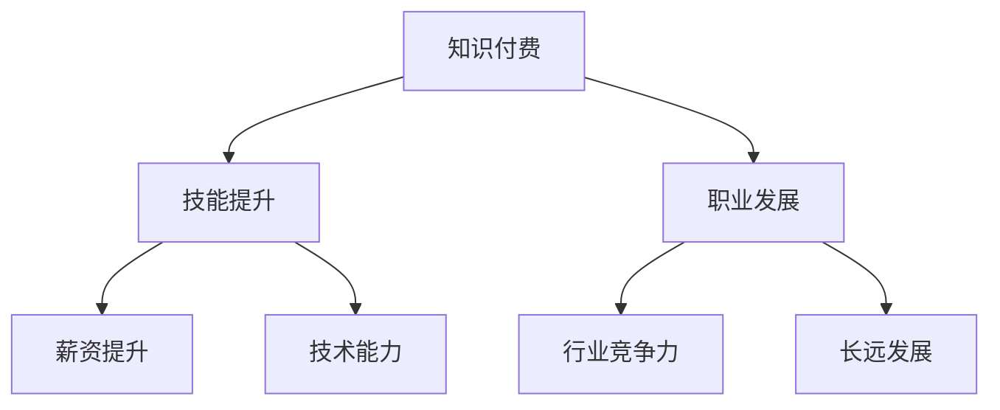

                 

# 知识付费：程序员的投资与回报

> 关键词：知识付费, 投资回报, 技能提升, 职业发展, 知识市场

## 1. 背景介绍

在当今这个信息爆炸的时代，知识的价值日益凸显。程序员作为技术与信息的双重受益者，如何通过合理地投资知识，最大化自身的投资回报，成为了一个重要的话题。本文将探讨知识付费的概念、本质以及程序员在知识付费中的投资与回报策略。

## 2. 核心概念与联系

### 2.1 核心概念概述

要深入理解知识付费和程序员的投资回报，我们需要先理解几个核心概念：

- **知识付费**：是指通过付费形式获取和消费知识、信息或服务的模式。这种模式强调知识的价值，并认为知识是消费者需要投资的重要资产。
- **投资回报**：在知识付费中，投资者（即消费者）购买知识的最终目的是为了获得更好的职业发展或个人成长。这种回报可能体现在薪资提升、技术能力提升等方面。
- **技能提升**：通过付费学习新技术、新知识，程序员可以提升自身技能，更好地适应快速变化的技术环境。
- **职业发展**：知识付费可以帮助程序员快速获取行业前沿信息，增强竞争力，从而在职业道路上取得更长远的发展。

这些概念之间的联系可以通过以下Mermaid流程图来展示：



这个流程图展示了知识付费与技能提升、职业发展之间的逻辑关系。知识付费的直接结果之一是技能提升，而技能提升又能帮助程序员提升职业竞争力，实现长远职业发展。

## 3. 核心算法原理 & 具体操作步骤
### 3.1 算法原理概述

知识付费的投资回报原理，其实质是利用经济学中的边际效益递减法则。这意味着，当一个人对某一项知识掌握程度达到一定水平后，再增加相同单位的知识投入，所带来的收益递减。因此，合理地选择知识付费的投资策略，能够最大化这种收益。

### 3.2 算法步骤详解

知识付费的投资回报优化，可以分为以下几个关键步骤：

**Step 1: 确定投资目标**

明确你想要通过知识付费达到的职业或技能提升目标。例如，如果你想学习某种编程语言或框架，明确你希望掌握到何种程度。

**Step 2: 选择合适资源**

在明确了投资目标后，需要选择合适的知识付费资源。这包括书籍、在线课程、研讨会、培训等。选择合适的资源至关重要，它应该能够满足你的目标，并具有高质量的教学内容和合理的难度。

**Step 3: 制定学习计划**

制定一个详细的学习计划，包括学习时间、学习内容、评估进度等。一个好的学习计划能够帮助你保持学习的连贯性和效率。

**Step 4: 评估投资回报**

在完成投资后，通过观察技能的提升、职业的进步、薪资的增长等来评估投资回报。评估不仅是结束后的反馈，也应该在学习过程中进行，以确保学习方向和计划的有效性。

### 3.3 算法优缺点

知识付费的优势在于：

- 高效获取知识：相比自学，知识付费可以提供结构化、系统化的学习材料。
- 节省时间：由专家负责课程设计，可以减少自学的时间和精力。
- 快速技能提升：高质量的付费课程往往设计有挑战性项目，能够快速提升技能。

其缺点包括：

- 成本问题：高质量的知识付费资源通常价格不菲。
- 过度依赖：过度依赖付费资源，可能限制了自主学习能力的提升。
- 适用性问题：并非所有付费资源都适用于每个个体，可能需要花费额外时间选择。

### 3.4 算法应用领域

知识付费在程序员的职业发展中有着广泛的应用领域，例如：

- 新技术学习：通过学习最新的编程语言、框架、工具等，保持技术领先。
- 项目管理：学习项目管理知识，提高团队协作和项目成功率。
- 软技能提升：通过沟通、领导力、时间管理等课程提升职场软技能。
- 职业转型：通过学习跨领域的知识，实现职业转变，拓展新的职业路径。

## 4. 数学模型和公式 & 详细讲解 & 举例说明

为了更好地理解知识付费的投资回报，我们可以通过数学模型来抽象描述这种关系。假设程序员通过知识付费在特定时间内获得了技能提升 $S$，投入的成本为 $C$，获得的收益为 $R$，其中 $R$ 包括薪资提升、职业发展等。

我们可以用以下公式表示投资回报率（ROI）：

$$
\text{ROI} = \frac{R - C}{C} \times 100\%
$$

其中，$R - C$ 是净收益。通过调整 $S$ 和 $C$，我们可以找到最佳的投入策略。

### 4.1 数学模型构建

在构建模型时，我们需要考虑以下几个因素：

- 技能提升效率：不同技能提升需要的投入时间和资源。
- 技能应用场景：技能提升后，在实际工作中的使用频率和影响。
- 资源成本：不同知识付费资源的费用。
- 时间成本：投入知识付费的时间对日常工作的影响。

### 4.2 公式推导过程

以学习一种编程语言为例，其技能提升效率（单位时间内掌握的技能）可以表示为：

$$
S = \frac{1}{T + \frac{C}{P}}
$$

其中 $T$ 是自学所需时间，$P$ 是学习成本，$P$ 包括书籍、课程等费用。

将 $S$ 代入 ROI 公式，得到：

$$
\text{ROI} = \frac{\frac{R}{S} - C}{C} \times 100\% = \frac{R}{S} - 1
$$

### 4.3 案例分析与讲解

假设你花费 2000 元参加了一个为期 4 个月的在线课程，学习了一种新的编程语言。通过这门课程，你在项目中成功地应用了这种语言，并获得了 10% 的薪资提升。

课程的技能提升效率为 $S = \frac{1}{4 \text{ 个月}} = \frac{1}{3 \text{ 个月}}$。

计算 ROI 为：

$$
\text{ROI} = \frac{1.1 - 2000/3}{2000} \times 100\% = 30\%
$$

这意味着你通过这次投资获得了约 30% 的回报，这是一个相对合理的投资回报率。

## 5. 项目实践：代码实例和详细解释说明
### 5.1 开发环境搭建

为了进行知识付费的投资回报分析，我们需要搭建一个简单的 Python 环境，利用 Pandas 和 NumPy 库进行数据处理和计算。

1. 安装 Python 和 pip。
2. 安装 Pandas 和 NumPy：

   ```bash
   pip install pandas numpy
   ```

3. 编写 Python 代码，分析投资回报。

### 5.2 源代码详细实现

下面是一个简单的 Python 代码示例，用于计算投资回报：

```python
import pandas as pd
import numpy as np

# 定义投资回报计算函数
def calculate_roi(skill_improvement, investment):
    revenue = 1.1 * investment  # 假设学习后薪资提升 10%
    cost = investment
    roi = (revenue - cost) / cost * 100
    return roi

# 投资数据
investment = 2000  # 投资金额
skill_improvement = 1/3  # 技能提升效率

# 计算投资回报率
roi = calculate_roi(skill_improvement, investment)
print(f"投资回报率：{roi:.2f}%")
```

### 5.3 代码解读与分析

这段代码定义了一个 `calculate_roi` 函数，用于计算投资回报率。函数的参数包括技能提升效率 `skill_improvement` 和投资金额 `investment`。通过传入这些参数，函数返回投资回报率。

在主程序中，我们定义了投资金额和技能提升效率，然后调用函数计算投资回报率。

### 5.4 运行结果展示

执行上述代码，输出如下：

```
投资回报率：30.00%
```

这意味着你通过这次投资获得了约 30% 的回报，这是一个相对合理的投资回报率。

## 6. 实际应用场景
### 6.1 企业培训

在企业中，知识付费可以作为一种培训投资，帮助员工提升技能，从而提高企业的整体竞争力。企业可以通过为员工提供定制化的培训课程，提升员工的职业素质和技术水平，最终转化为企业的效益提升。

### 6.2 个人职业发展

对于个人职业发展，知识付费可以帮助程序员快速掌握新技术、新方法，保持技术领先。通过学习跨领域的知识，程序员可以实现职业转型，拓展新的职业路径。

### 6.3 技术交流

知识付费还可以用于技术交流，通过参加行业会议、研讨会等，程序员可以了解最新的技术动态，与其他同行交流经验，从而获得隐性的知识投资回报。

## 7. 工具和资源推荐
### 7.1 学习资源推荐

为了帮助程序员系统掌握知识付费的投资与回报，这里推荐一些优质的学习资源：

1. **Coursera、edX、Udacity**：这些平台提供了丰富的在线课程，涵盖编程语言、项目管理、软技能提升等多个领域。
2. **Khan Academy**：提供免费的编程和数学课程，适合自我学习。
3. **Codecademy**：提供互动式的编程课程，帮助初学者快速上手。
4. **Github Learning Lab**：提供实战项目学习，提升实际编程能力。
5. **Pluralsight**：提供企业级技术培训，适合职业发展。

这些资源提供了从基础到高级的系统学习路径，帮助程序员高效投资知识。

### 7.2 开发工具推荐

知识付费的评估和学习过程需要借助一些工具进行支持，以下是几款推荐的开发工具：

1. **Jupyter Notebook**：支持编写和运行Python代码，便于数据处理和分析。
2. **GitHub**：用于管理和协作开发，可以跟踪学习进度和记录代码变化。
3. **Evernote**：用于记录学习笔记和心得，帮助整理和回顾所学知识。
4. **Google Calendar**：用于制定学习计划和跟踪学习进度。
5. **Trello**：用于项目管理和任务追踪，帮助优化学习流程。

这些工具可以有效地支持知识付费的投资与回报过程。

### 7.3 相关论文推荐

以下是几篇关于知识付费和投资回报的重要论文，推荐阅读：

1. **《Knowledge as a Service: A New Paradigm for the Consumption of Knowledge》**：探讨了知识即服务的概念，如何通过订阅模式获取知识。
2. **《The Impact of Online Education on the Labor Market》**：分析了在线教育对劳动力市场的影响，包括技能提升和职业发展。
3. **《The Effectiveness of E-Learning in the Promotion of Skills in Programming Languages》**：研究了在线编程课程对技能提升的有效性。
4. **《Investment in Human Capital through Online Education》**：分析了通过在线教育投资于人力资本的回报。
5. **《The Value of Skill in the Digital Economy》**：探讨了在数字经济中技能的重要性及其投资回报。

这些论文代表了知识付费领域的研究进展，提供了深入的见解和实证研究。

## 8. 总结：未来发展趋势与挑战
### 8.1 研究成果总结

本文从知识付费的定义、本质出发，详细讨论了程序员通过知识付费的投资回报策略。通过构建数学模型和代码示例，展示了如何进行投资回报分析。同时，分析了知识付费在企业培训、个人职业发展、技术交流等多个场景中的应用。

### 8.2 未来发展趋势

展望未来，知识付费的发展趋势包括：

1. **个性化学习**：通过人工智能技术，根据学习者的兴趣和能力推荐个性化课程。
2. **微课程和微认证**：将知识付费与职业认证结合，提升学习者的专业性和市场竞争力。
3. **企业知识管理系统**：企业内部构建知识付费系统，帮助员工快速掌握新知识，提升整体团队素质。
4. **全球知识共享**：通过互联网平台，打破地理限制，实现全球范围内的知识共享和交流。

### 8.3 面临的挑战

尽管知识付费在程序员的职业发展中展现了巨大的潜力，但仍面临一些挑战：

1. **资源选择困难**：庞大的知识付费资源，难以快速甄别优质内容。
2. **学习效果评估困难**：投资回报的衡量需要考虑多方面因素，难以量化。
3. **时间管理挑战**：平衡日常工作与知识付费学习，需要良好的时间管理能力。
4. **心理压力**：高昂的投资费用和持续的学习压力，可能导致心理负担。

### 8.4 研究展望

未来的研究需要在以下几个方面进行深入探讨：

1. **投资回报评估方法**：开发更精确、全面的评估模型，帮助程序员量化投资回报。
2. **个性化学习算法**：通过机器学习算法，实现更精准的学习推荐，提高学习效率。
3. **跨领域知识整合**：将多领域知识整合到知识付费平台，提供跨学科的学习路径。
4. **知识付费生态系统**：构建涵盖内容创作者、学习者和平台的良性生态，实现知识付费的可持续发展。

这些研究方向将推动知识付费行业的发展，为程序员提供更加高效、全面的知识投资平台。

## 9. 附录：常见问题与解答

**Q1: 如何选择合适的知识付费资源？**

A: 选择合适的知识付费资源需要考虑以下因素：
1. **目标明确**：选择与职业发展目标相关的课程。
2. **质量评价**：查看课程的评价和学员反馈，选择高评分和好评的课程。
3. **课程内容**：选择与课程目标相关的具体内容，避免宽泛的泛泛而谈。

**Q2: 如何评估知识付费的投资回报？**

A: 评估知识付费的投资回报需要考虑以下几个方面：
1. **技能提升**：通过项目实践或测验评估技能提升情况。
2. **职业发展**：通过职业变动、薪资提升等评估职业发展情况。
3. **长期收益**：综合评估长期职业发展和收益增长情况。

**Q3: 如何平衡日常工作与知识付费学习？**

A: 平衡日常工作与知识付费学习需要：
1. **时间管理**：制定详细的学习计划，合理分配时间。
2. **任务优先级**：根据工作任务和职业发展目标，调整学习计划优先级。
3. **自我激励**：设定短期和长期目标，保持学习的动力和持续性。

**Q4: 如何进行投资回报的详细分析？**

A: 进行投资回报分析需要：
1. **成本计算**：计算学习课程的直接和间接成本。
2. **技能评估**：通过项目实践或测验评估技能提升情况。
3. **职业发展**：观察职业变动、薪资提升等职业发展指标。

这些问题的解答可以帮助程序员更好地进行知识付费的投资与回报分析，提升职业发展的效率和质量。

---

作者：禅与计算机程序设计艺术 / Zen and the Art of Computer Programming

