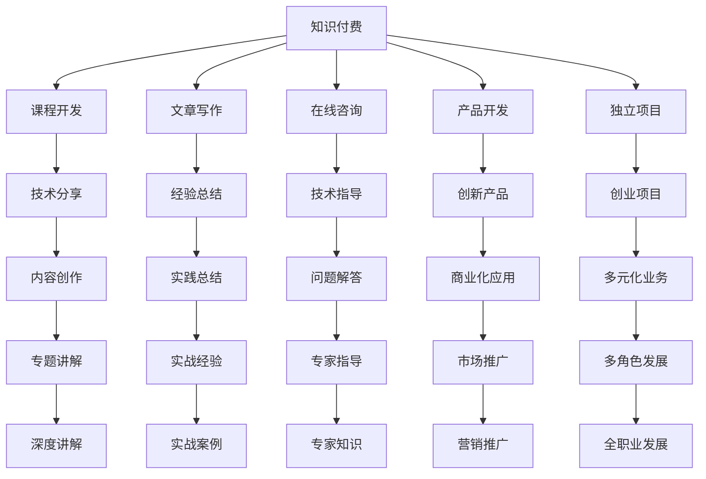

                 

# 知识付费：程序员的斜杠创业

## 1. 背景介绍

随着信息爆炸和知识经济的崛起，知识付费作为一种新兴模式，正在迅速改变着人们的学习和消费习惯。尤其在互联网、人工智能、软件开发等高技术领域，知识付费的价值愈发凸显。程序员，作为知识付费的核心受益者之一，也开始从单纯的开发者向斜杠创业者转变。本文将从背景、趋势、核心概念与联系、算法原理与操作步骤等多个维度，系统探讨知识付费与程序员斜杠创业的结合点，以及如何利用知识付费商业模式赋能程序员创业。

## 2. 核心概念与联系

### 2.1 核心概念概述

要理解程序员斜杠创业与知识付费的结合，首先需要了解几个关键概念：

- **知识付费(Knowledge Pricing)**：一种新兴的商业模式，用户为获取专业知识或资讯而付费。知识付费平台如得到、知乎live、极客时间等，已经成为程序员获取新技术、新思想的重要渠道。
- **程序员斜杠创业(Freelancing and Startup for Programmers)**：程序员除了技术开发工作外，通过开展独立咨询、技术培训、产品开发等多元化业务，实现收入多元化，成为斜杠创业者。
- **斜杠(Slash)文化**：起源于英文单词"Slash"，表示多角色、多身份的生活和工作方式。程序员斜杠创业正是这种文化的体现，融合了技术开发、知识传授、产品创新等多种职业角色。

这些概念的相互交织，构成了程序员斜杠创业与知识付费商业模式的紧密联系。技术开发者通过知识付费获取市场认可和收入增长，同时利用这些资源开展多样化的业务，实现职业转型和收入提升。

### 2.2 核心概念原理和架构的 Mermaid 流程图



这个图展示了程序员斜杠创业与知识付费之间的相互关联。知识付费为程序员提供了展示技能和经验的平台，而程序员通过斜杠创业的形式，提供多样化的知识服务，共同推动知识付费市场的发展。

## 3. 核心算法原理 & 具体操作步骤

### 3.1 算法原理概述

知识付费与程序员斜杠创业的结合，本质上是利用技术开发者的专业知识，通过知识付费平台进行市场化变现。具体来说，知识付费的商业模式可以分为以下几类：

- **课程开发**：通过录制视频、编写教材等形式，提供系统化、结构化的技术课程。
- **文章写作**：撰写技术博客、教程、案例分析等内容，分享专业见解和实践经验。
- **在线咨询**：通过平台提供一对一的技术咨询和问题解答，提供即时帮助。
- **产品开发**：结合实际项目需求，开发实用工具、应用软件等，解决具体问题。
- **独立项目**：承接自由职业项目，提供定制化的技术解决方案。

这些模式通常基于两种主要的变现机制：

- **订阅制**：用户支付一定的订阅费用，获取课程、文章、咨询等长期服务。
- **按需付费**：用户根据具体需求支付相应的费用，获取单次的服务或产品。

### 3.2 算法步骤详解

知识付费和程序员斜杠创业的结合流程大致如下：

1. **技能评估**：评估自己的技术水平和知识领域，确定核心技能和市场需求。
2. **内容创作**：根据市场需求和自身优势，创作相关的课程、文章、案例等。
3. **平台入驻**：选择合适的知识付费平台入驻，并上传相关内容。
4. **用户互动**：通过平台与用户互动，收集反馈和建议，改进内容质量。
5. **商业变现**：通过订阅费、按需付费等方式，实现商业变现。
6. **多元化发展**：在知识付费的基础上，开展多样化的斜杠创业业务，如产品开发、独立项目等。

### 3.3 算法优缺点

**优点**：

- **多元化收入**：通过知识付费获得被动收入，同时开展斜杠创业业务，实现多元化的收入来源。
- **专业认可**：知识付费平台的用户多为技术爱好者和专业开发者，具有较高的专业认可度。
- **低成本创业**：相比于传统的企业创业，知识付费的准入门槛较低，风险相对可控。

**缺点**：

- **内容生产**：高质量内容的创作需要大量的时间和精力投入，难度较大。
- **市场竞争**：知识付费市场竞争激烈，需要不断创新和优化内容，才能保持竞争力。
- **品牌建设**：如何在众多平台中建立个人品牌，需要长期的积累和推广。

### 3.4 算法应用领域

知识付费和程序员斜杠创业的应用领域广泛，涵盖以下几个方面：

- **技术培训**：通过知识付费平台提供系统化、结构化的编程课程、框架教程等，帮助初学者快速入门。
- **项目咨询**：承接企业技术咨询项目，提供架构设计、代码优化、性能调优等服务。
- **产品开发**：根据市场需求，开发实用的技术工具、应用软件等，满足具体需求。
- **内容创作**：撰写技术博客、教程、案例分析等内容，分享专业见解和实践经验。
- **独立项目**：承接自由职业项目，提供定制化的技术解决方案，实现技术变现。

## 4. 数学模型和公式 & 详细讲解 & 举例说明

### 4.1 数学模型构建

知识付费的盈利模型可以简单表示为：

$$
\text{收入} = \text{内容价值} \times \text{用户数量} \times \text{单价}
$$

其中，内容价值由内容质量、创新性、实用性等多方面因素决定，用户数量和单价则由市场需求和平台策略决定。

### 4.2 公式推导过程

以一个简单的课程为例，假设课程时长为$T$小时，制作成本为$C$，平台抽成为$R$，用户订阅数为$N$，单次订阅价格为$P$。则课程的总收入为：

$$
\text{总收入} = N \times P - C - N \times R
$$

假设课程的边际成本为$C_m$，即每增加一个订阅用户，增加的成本。则平均成本为：

$$
\text{平均成本} = \frac{C + N \times C_m}{N}
$$

要使课程盈利，需要满足：

$$
N \times P > \frac{C + N \times C_m}{N} + R
$$

即：

$$
N > \frac{C + N \times C_m}{P - R}
$$

可以看出，用户数量是课程盈利的关键因素，需要通过多种方式吸引和保持用户。

### 4.3 案例分析与讲解

**案例一：技术博客**：某程序员撰写了一系列的深度技术博客，通过知乎平台获得了大量关注。为了商业化这些内容，他将其整理成课程和电子书，通过付费订阅和单次付费两种方式变现，实现了可观的收入。

**案例二：在线咨询**：某软件开发工程师在极客时间上开设了技术咨询课程，通过提供一对一的技术问题解答和编程指导，赢得了众多用户的青睐。他后来还开发了一个实用的编程工具，并成功商业化，进一步扩大了自己的业务范围。

## 5. 项目实践：代码实例和详细解释说明

### 5.1 开发环境搭建

要进行知识付费和程序员斜杠创业的结合，需要以下开发环境：

- **Python**：Python是知识付费平台和内容创作的主流语言，支持丰富的库和框架。
- **知识付费平台API**：如知乎、极客时间、得到等平台都提供了API接口，方便开发者上传和管理内容。
- **开发工具**：如VSCode、PyCharm、Jupyter Notebook等，支持Python开发。

### 5.2 源代码详细实现

以下是一个简单的在线咨询课程的代码实现示例，使用Flask框架搭建一个简单的网站：

```python
from flask import Flask, request, jsonify

app = Flask(__name__)

@app.route('/consult', methods=['POST'])
def consult():
    name = request.json.get('name')
    email = request.json.get('email')
    message = request.json.get('message')
    # 这里将进行具体的技术咨询处理
    return jsonify({'status': 'success', 'message': '咨询提交成功'})

if __name__ == '__main__':
    app.run(debug=True)
```

### 5.3 代码解读与分析

- **Flask框架**：使用Flask框架搭建一个简单的API接口，支持POST请求。
- **请求解析**：解析请求中的参数，包括用户姓名、邮箱和咨询内容。
- **处理逻辑**：根据咨询内容进行技术处理，并返回成功消息。
- **部署运行**：通过运行Flask应用，搭建在线咨询平台。

### 5.4 运行结果展示

假设用户通过POST请求发送以下内容：

```json
{
    "name": "John Doe",
    "email": "johndoe@example.com",
    "message": "How to optimize a Python program for better performance?"
}
```

服务端将接收并处理请求，返回成功消息：

```json
{
    "status": "success",
    "message": "咨询提交成功"
}
```

## 6. 实际应用场景

### 6.1 技术培训

知识付费平台为技术培训提供了良好的展示平台。程序员可以通过录制视频课程、编写教材，将其专业知识转化为商业价值。例如，某知名软件工程师在Coursera上开设了Python数据科学课程，通过系统化讲解数据科学基础知识和实践技巧，吸引了大量学习者，实现了可观的收入。

### 6.2 独立项目

程序员还可以承接自由职业项目，提供定制化的技术解决方案。通过知识付费平台接单，项目完成后通过按需付费的方式获得收益。例如，某程序员在Freelancer平台上接了一个网站开发项目，通过高质量的代码和项目管理，成功交付并获得了高额报酬。

### 6.3 产品开发

根据市场需求，程序员可以开发实用的技术工具、应用软件等。例如，某开源社区的成员基于自己的项目开发了一个高效的数据处理工具，通过GitHub开源并获得了大量社区支持，最终商业化，实现了个人品牌的价值提升。

### 6.4 未来应用展望

未来，知识付费和程序员斜杠创业将进一步融合，形成更加多元化的商业模式。例如，结合VR、AR等技术，开发沉浸式的学习体验；通过区块链技术，实现知识版权保护和透明交易；利用AI技术，提供智能化的学习推荐和内容创作。这些创新应用将为程序员斜杠创业带来更大的市场机遇。

## 7. 工具和资源推荐

### 7.1 学习资源推荐

为了帮助程序员系统掌握知识付费和斜杠创业的知识，以下是几个推荐的学习资源：

1. **知识付费平台指南**：《知识付费平台实战指南》详细介绍了不同知识付费平台的运营策略和用户心理，是入门知识付费的重要参考资料。
2. **课程设计课程**：《课程设计与开发》课程系统讲解了课程内容的设计和制作流程，涵盖视频录制、教材编写等多个环节。
3. **创业指南**：《斜杠创业者》提供了创业的全流程指南，包括市场调研、商业模式设计、品牌建设等多个方面。
4. **营销策略**：《互联网营销》课程介绍了多种互联网营销手段，帮助程序员提升内容曝光度和用户转化率。
5. **编程工具推荐**：《编程工具推荐》博客列举了常用的编程工具和框架，帮助程序员提升开发效率。

### 7.2 开发工具推荐

以下工具推荐用于知识付费和斜杠创业的开发和运营：

1. **编程框架**：Flask、Django、Spring Boot等，提供丰富的API开发框架。
2. **视频录制工具**：OBS Studio、Camtasia等，用于高质量的视频录制和编辑。
3. **内容管理工具**：Joomla、WordPress等，方便内容管理和发布。
4. **数据分析工具**：Google Analytics、Mixpanel等，用于用户行为分析和流量监测。
5. **项目管理系统**：Jira、Trello等，帮助管理自由职业项目和团队协作。

### 7.3 相关论文推荐

以下是几篇具有代表性的相关论文：

1. **知识付费理论研究**：《知识付费的市场分析与策略研究》研究了知识付费市场的现状和未来趋势，提出了具体的策略建议。
2. **技术培训模式**：《在线技术培训模式的比较分析》对比了多种在线培训模式的优缺点，为技术培训提供了参考。
3. **独立项目运营**：《自由职业者的项目管理与协作》介绍了自由职业项目的运营和管理方法，帮助程序员提升工作效率。
4. **产品开发方法**：《敏捷开发方法与实践》提供了敏捷开发的方法论和技术实践，帮助程序员高效开发产品。
5. **知识付费平台技术架构**：《知识付费平台的架构设计与优化》详细介绍了知识付费平台的架构设计和优化策略，为平台开发提供了指导。

## 8. 总结：未来发展趋势与挑战

### 8.1 总结

本文从背景、核心概念与联系、算法原理与操作步骤等多个维度，系统探讨了知识付费与程序员斜杠创业的结合点，并给出了具体的实现流程和工具推荐。通过知识付费平台，程序员可以高效地将自身专业知识转化为商业价值，实现收入多元化。

### 8.2 未来发展趋势

未来，知识付费和程序员斜杠创业的结合将呈现以下几个发展趋势：

1. **技术融合**：随着AI、VR、AR等新技术的不断发展，知识付费和斜杠创业将结合更多创新技术，提供更加沉浸式和多样化的学习体验。
2. **内容多样化**：除了技术课程和博客，还将涌现更多形式的内容，如直播、短视频、互动问答等，满足不同用户的需求。
3. **平台多样化**：除了传统的知识付费平台，还将涌现更多创新平台，如社交媒体、社区网站等，提供更加多元化的变现渠道。
4. **知识社区化**：知识付费将向社区化方向发展，用户之间可以互相交流和分享，形成更加活跃的社区氛围。

### 8.3 面临的挑战

尽管知识付费和程序员斜杠创业的结合前景广阔，但在实际应用过程中，仍面临诸多挑战：

1. **内容质量**：高质量内容的创作需要大量时间和精力，且市场竞争激烈。如何保证内容的质量和创新性，是一个关键问题。
2. **用户获取**：知识付费平台的用户获取难度较大，需要持续的推广和营销。如何吸引和保持用户，是平台运营的重要挑战。
3. **商业模式**：知识付费和斜杠创业的商业模式尚在探索中，如何实现可持续的盈利，需要更多的创新和实践。
4. **平台安全**：知识付费平台需要保障用户隐私和数据安全，防止侵权和不当内容传播。如何建立完善的安全机制，是一个重要问题。
5. **用户参与**：知识付费平台需要提高用户参与度和互动性，提供更加多样化的互动方式，提升用户体验。

### 8.4 研究展望

未来的研究需要在以下几个方面寻求新的突破：

1. **内容生成自动化**：利用AI技术，自动生成高质量的课程和文章，提高内容创作效率。
2. **多渠道运营**：结合社交媒体、社区网站等多种渠道，扩大知识付费和斜杠创业的传播和影响力。
3. **用户个性化推荐**：利用AI技术，提供个性化推荐和内容分发，提升用户满意度和转化率。
4. **知识版权保护**：利用区块链技术，实现知识版权的保护和透明交易，保障创作者权益。
5. **社区治理机制**：建立完善的社区治理机制，提高用户参与度和社区活跃度，形成良性互动。

这些研究方向将为知识付费和程序员斜杠创业带来新的发展机遇，推动技术开发者的职业转型和收入提升。

## 9. 附录：常见问题与解答

**Q1：知识付费和程序员斜杠创业的结合点在哪里？**

A: 知识付费和程序员斜杠创业的结合点在于利用程序员的技术和知识，通过知识付费平台变现，同时开展多样化的斜杠创业业务，实现收入多元化。

**Q2：如何选择合适的知识付费平台？**

A: 选择合适的知识付费平台需要考虑以下几个因素：平台的用户量、平台的用户质量、平台的运营策略、平台的抽成比例等。可以通过试听课程、查看用户评价等方式进行评估选择。

**Q3：如何进行内容创作和发布？**

A: 内容创作需要根据自己的专业领域和市场需求，选择合适的形式，如视频课程、技术博客、在线咨询等。发布平台如知乎、得到、极客时间等，提供了便捷的内容管理和发布功能。

**Q4：如何提升内容曝光度和用户转化率？**

A: 提升内容曝光度和用户转化率可以通过多种方式：优化SEO，提高关键词排名；通过社交媒体、社区网站进行推广；提供高质量的课程和内容，提高用户满意度和口碑等。

**Q5：如何处理平台安全问题？**

A: 平台安全问题需要建立完善的安全机制，如用户身份验证、内容审核、侵权检测等。可以结合技术手段和人工审核，保障平台和用户的安全。

---

作者：禅与计算机程序设计艺术 / Zen and the Art of Computer Programming

