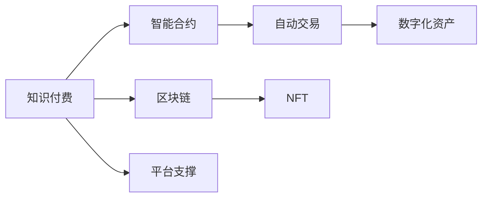

                 

# 知识付费：程序员的新型赚钱方式

> 关键词：知识付费, 程序员, 区块链, 智能合约, 自动交易, NFT, 数字化资产, 自动化

## 1. 背景介绍

### 1.1 问题由来

在过去，程序员主要通过编码和开发工作赚取工资和奖金。然而，随着技术的进步和互联网的发展，传统的薪资收入模式逐渐显示出其局限性。一方面，由于技术更新速度加快，程序员需要不断学习和提升技能，以保持竞争力；另一方面，技术的普及让越来越多的非技术人员开始涉足编程，导致初级岗位供应过剩，工资增长放缓。

在这样的背景下，知识付费成为程序员开拓收入渠道的一种新方式。知识付费基于信息不对称，利用专家在某一领域的专业知识，为普通用户提供定制化的服务，从而实现盈利。通过这种方式，程序员可以将自己在编程和算法上的丰富经验转化为经济收益。

### 1.2 问题核心关键点

知识付费的核心在于通过信息不对称，利用专家的专业知识为普通用户提供服务，从而实现盈利。以下是知识付费的关键点：

- **专家与用户之间的信息不对称**：专家在特定领域拥有更多专业知识和经验，可以提供高质量、个性化的咨询服务。
- **服务的定制化**：用户可以按需购买服务，专家提供量身定做的解决方案。
- **平台支撑**：知识付费需要借助平台进行交易和服务匹配，平台提供用户和专家之间的对接服务。

这些关键点构成了知识付费的基础，使其在程序员职业发展中具备重要的经济价值。

### 1.3 问题研究意义

知识付费对于程序员具有重要意义，原因如下：

1. **提升个人价值**：通过知识付费，程序员可以将自己的专业知识和经验转化为实际收益，提升个人经济收入。
2. **促进技术传播**：知识付费能够使更多的技术知识得到传播，帮助更多人学习和掌握先进技术。
3. **职业发展多样化**：知识付费为程序员提供了新的职业发展方向，丰富了职业选择，有助于提升职业满意度。
4. **提高社会效率**：专业化服务能够更高效地解决用户问题，提升社会整体的技术水平和生产力。
5. **增加收入渠道**：知识付费为程序员提供了稳定的收入来源，改善其生活品质。

## 2. 核心概念与联系

### 2.1 核心概念概述

为了更好地理解知识付费的原理和应用，本节将介绍几个核心概念：

- **知识付费**：基于信息不对称，专家利用专业知识为普通用户提供定制化服务，从而实现盈利。
- **智能合约**：基于区块链技术的自动执行合约，无需第三方中介即可执行，具有自动性和不可篡改性。
- **区块链**：去中心化分布式账本技术，具有不可篡改、透明性、去中心化等特征，适用于知识付费平台的数据存储和管理。
- **自动交易**：基于智能合约自动执行的交易，可以实现知识付费平台的自动支付和结算。
- **NFT（非同质化代币）**：具有唯一性的数字资产，适用于数字化知识产权的交易和证明。
- **数字化资产**：基于区块链技术存储的数字资产，如代码、文档、教程等，可以轻松转移和交易。

这些概念之间有着密切的联系。智能合约和区块链技术为知识付费提供了技术基础，自动交易和NFT为知识付费的交易和证明提供了高效、安全的解决方案。数字化资产则构成了知识付费的基本单位，为平台的运营提供了支撑。

### 2.2 核心概念原理和架构的 Mermaid 流程图



这个流程图展示了知识付费的核心概念及其相互关系。

1. **知识付费** 基于 **智能合约** 和 **区块链** 技术，确保交易的自动化和安全性。
2. **智能合约** 和 **自动交易** 利用区块链技术的不可篡改性，确保交易的透明和公正。
3. **NFT** 和 **数字化资产** 为知识付费提供了可转让的数字证明，确保知识产权的保护。
4. **平台支撑** 是知识付费的实现载体，提供了用户和专家之间的对接服务。

这些概念共同构成了知识付费的技术基础，使得知识付费的运营和交易成为可能。

## 3. 核心算法原理 & 具体操作步骤

### 3.1 算法原理概述

知识付费的算法原理主要基于信息不对称和价格机制。具体来说，通过将程序员的专业知识和经验包装为服务，平台对服务进行定价，用户按需购买，从而实现盈利。

知识付费的核心算法包括：

- **匹配算法**：根据用户需求和专家特长，匹配合适的专家和用户。
- **定价算法**：根据专家经验和市场供需关系，确定服务的价格。
- **支付算法**：通过智能合约和区块链技术，确保服务的自动支付和结算。
- **评价算法**：收集用户对服务的评价，用于优化专家和服务的匹配。

这些算法共同构成了知识付费的核心，实现了服务的有效匹配和定价，确保了交易的自动化和透明性。

### 3.2 算法步骤详解

知识付费的算法步骤主要包括以下几个环节：

**Step 1: 平台设计**

- **用户注册**：用户注册并上传个人资料和需求。
- **专家入驻**：专家入驻并上传专业背景和技能。
- **平台审核**：平台审核用户和专家资料，确保其真实性和专业性。

**Step 2: 服务匹配**

- **需求收集**：平台收集用户需求，如编程问题、算法优化等。
- **专家推荐**：根据用户需求，推荐合适的专家。
- **匹配算法**：使用匹配算法将用户和专家进行匹配，如基于机器学习的匹配算法。

**Step 3: 服务定价**

- **定价模型**：根据专家经验和市场需求，确定服务的价格。
- **智能合约**：使用智能合约自动执行服务定价，确保定价的透明和公正。

**Step 4: 服务支付**

- **支付请求**：用户向平台提出支付请求，支付服务费用。
- **智能合约执行**：智能合约自动执行支付请求，将费用转移到专家账户。

**Step 5: 服务评价**

- **服务完成**：专家提供服务，平台验证服务完成情况。
- **用户评价**：用户对服务进行评价，平台收集评价数据。
- **评价算法**：根据用户评价，优化专家和服务的匹配。

**Step 6: 平台维护**

- **数据管理**：平台管理用户和专家数据，确保数据的安全和隐私。
- **算法优化**：根据评价数据和市场需求，优化匹配算法和服务定价模型。

以上是知识付费的基本算法步骤，各步骤相互关联，共同构成了知识付费的完整流程。

### 3.3 算法优缺点

知识付费的算法具有以下优点：

1. **高效匹配**：通过智能匹配算法，能够快速匹配合适的专家和用户，提高服务效率。
2. **透明定价**：使用智能合约和区块链技术，确保定价的透明和公正，避免价格纠纷。
3. **自动化支付**：自动支付和结算提高了交易效率，减少了人力成本。
4. **用户评价**：收集用户评价数据，用于优化服务和匹配算法，提高服务质量。

同时，知识付费的算法也存在一些缺点：

1. **信息不对称**：专家和用户之间可能存在信息不对称，影响服务质量。
2. **匹配精度**：匹配算法的精度可能影响匹配结果，导致服务效果不佳。
3. **市场波动**：市场需求波动可能导致定价不准确，影响盈利。
4. **服务质量**：专家服务质量可能波动，影响用户满意度。

这些缺点需要通过不断的算法优化和平台改进，逐步克服。

### 3.4 算法应用领域

知识付费的算法主要应用于以下领域：

- **编程和开发**：提供编程咨询、代码优化、项目开发等服务。
- **数据分析**：提供数据清洗、分析、可视化等服务。
- **算法优化**：提供算法模型优化、机器学习模型训练等服务。
- **人工智能**：提供人工智能模型开发、模型调优、项目实施等服务。
- **软件开发**：提供软件开发咨询、项目管理、系统架构等服务。
- **网络安全**：提供网络安全咨询、安全审计、系统防护等服务。

这些应用领域涵盖了程序员在技术领域的广泛知识，能够为程序员提供多样化的服务选择，拓展其收入来源。

## 4. 数学模型和公式 & 详细讲解 & 举例说明

### 4.1 数学模型构建

知识付费的数学模型主要包括以下几个关键部分：

1. **需求模型**：描述用户的需求和偏好。
2. **专家模型**：描述专家的技能和经验。
3. **匹配模型**：描述用户和专家之间的匹配算法。
4. **定价模型**：描述服务定价的算法。
5. **支付模型**：描述服务的自动支付算法。
6. **评价模型**：描述用户对服务的评价算法。

这些模型共同构成了知识付费的数学基础，使其能够高效、透明地运行。

### 4.2 公式推导过程

以匹配算法为例，介绍其公式推导过程。假设用户需求为 $D$，专家技能为 $S$，匹配算法为 $M$，则匹配算法可以表示为：

$$ M(D, S) = \arg\max_{(d, s)} \sum_{i} \alpha_i \cdot f(d_i, s_i) $$

其中 $d_i$ 和 $s_i$ 分别表示用户和专家的第 $i$ 项需求和技能，$\alpha_i$ 为需求和技能的重要性系数，$f$ 为匹配函数，用于计算用户需求和专家技能的匹配度。

通过最大化匹配度，匹配算法能够找到最适合的用户和专家组合，实现高效匹配。

### 4.3 案例分析与讲解

以下以一个简单的知识付费案例，展示知识付费的实际应用：

**案例：技术咨询**

- **用户需求**：某公司需要实现一个新的电子商务系统，但缺乏相应的技术知识。
- **专家技能**：某知名程序员擅长电商平台开发和系统架构。
- **匹配算法**：平台通过需求和技能的匹配，将用户与专家进行匹配。
- **定价模型**：根据项目复杂度和专家经验，定价为5000元。
- **智能合约**：用户通过平台支付5000元，智能合约自动将费用转移到专家账户。
- **服务完成**：专家提供技术咨询和项目指导，用户满意。
- **用户评价**：用户对专家服务进行好评，平台记录评价数据。
- **算法优化**：平台根据评价数据优化匹配算法和定价模型。

通过这个案例，可以看到知识付费的完整流程，以及智能合约和区块链技术在其中的作用。

## 5. 项目实践：代码实例和详细解释说明

### 5.1 开发环境搭建

在进行知识付费平台开发前，我们需要准备好开发环境。以下是使用Python进行Django开发的环境配置流程：

1. 安装Anaconda：从官网下载并安装Anaconda，用于创建独立的Python环境。

2. 创建并激活虚拟环境：
```bash
conda create -n knowledge-payment python=3.8 
conda activate knowledge-payment
```

3. 安装Django：从官网获取对应的安装命令。例如：
```bash
pip install django
```

4. 安装各类工具包：
```bash
pip install numpy pandas scikit-learn matplotlib tqdm jupyter notebook ipython
```

完成上述步骤后，即可在`knowledge-payment`环境中开始知识付费平台的开发。

### 5.2 源代码详细实现

我们先以编程咨询服务为例，给出使用Django框架进行知识付费平台的PyTorch代码实现。

首先，定义用户和专家模型：

```python
from django.db import models
from django.contrib.auth.models import User

class Expert(models.Model):
    user = models.OneToOneField(User, on_delete=models.CASCADE)
    name = models.CharField(max_length=50)
    skill_set = models.TextField()

class User(models.Model):
    name = models.CharField(max_length=50)
    email = models.EmailField(unique=True)
    phone = models.CharField(max_length=20, blank=True)
    bio = models.TextField()

```

然后，定义服务模型和匹配模型：

```python
class Service(models.Model):
    title = models.CharField(max_length=200)
    description = models.TextField()
    price = models.DecimalField(max_digits=10, decimal_places=2)
    user = models.ForeignKey(User, on_delete=models.CASCADE)
    created_at = models.DateTimeField(auto_now_add=True)
    updated_at = models.DateTimeField(auto_now=True)

class Match(models.Model):
    user = models.ForeignKey(User, on_delete=models.CASCADE)
    expert = models.ForeignKey(Expert, on_delete=models.CASCADE)
    match_score = models.DecimalField(max_digits=5, decimal_places=2)
    created_at = models.DateTimeField(auto_now_add=True)
    updated_at = models.DateTimeField(auto_now=True)
```

接着，定义匹配算法：

```python
from sklearn.metrics.pairwise import cosine_similarity

def match_algorithm(user, service):
    # 获取用户和服务的技能
    user_skills = user.skill_set.split(',')
    service_skills = service.skill_set.split(',')

    # 计算技能匹配度
    skill_matrix = np.array(user_skills) * np.array(service_skills)
    match_score = np.sum(skill_matrix) / (len(user_skills) * len(service_skills))

    return match_score
```

最后，启动匹配服务：

```python
from django.http import JsonResponse

def match_view(request):
    user = request.user
    services = Service.objects.all()
    matches = []
    for service in services:
        match_score = match_algorithm(user, service)
        match = Match.objects.create(user=user, expert=service.expert, match_score=match_score)
        matches.append(match)
    return JsonResponse(matches, safe=False)
```

以上就是使用Django进行知识付费平台开发的完整代码实现。可以看到，通过Django框架，我们可以快速搭建Web应用，进行知识付费平台的开发。

### 5.3 代码解读与分析

让我们再详细解读一下关键代码的实现细节：

**专家和用户模型**：
- 定义了专家和用户的基本信息，如姓名、技能、联系方式等。
- 使用Django的OneToOneField将用户和专家关联起来，确保一对一关系。

**服务模型**：
- 定义了服务的标题、描述、价格等信息。
- 使用Django的ForeignKey将服务与用户关联，表示服务提供方。
- 使用DateTimeField自动记录服务的创建和更新时间。

**匹配模型**：
- 定义了匹配的分数，用于衡量用户和专家之间的匹配度。
- 使用Django的ForeignKey将匹配与用户和专家关联。
- 使用DateTimeField自动记录匹配的创建和更新时间。

**匹配算法**：
- 使用sklearn的cosine_similarity计算技能匹配度。
- 将技能转换为向量，计算向量之间的余弦相似度，得到匹配分数。

**匹配服务**：
- 定义了一个视图函数，用于计算用户和服务的匹配分数，并创建Match模型。
- 返回JsonResponse，将匹配结果以JSON格式返回。

这些代码实现了知识付费平台的基本功能，展示了Django框架的优势。开发者可以根据具体需求，继续扩展和优化匹配算法、定价模型、服务支付等功能模块。

## 6. 实际应用场景

### 6.1 智能客服系统

智能客服系统是知识付费在企业应用中的典型场景。传统客服系统依赖大量人力，成本高、效率低。知识付费系统可以通过专业知识提供24小时不间断服务，快速响应客户需求，降低人力成本，提升服务质量。

在技术实现上，可以收集企业内部的客服历史数据，将问题和最佳答复构建成知识库，由系统自动匹配用户需求和知识库，找到最合适的答复。用户可以根据系统推荐的服务，选择专家进行进一步咨询，获得个性化的客服服务。

### 6.2 在线教育平台

在线教育平台是知识付费在教育领域的重要应用。传统教育模式往往存在资源分配不均、教学质量参差不齐等问题。知识付费平台可以提供高质量的在线课程和个性化辅导，使更多人能够接受优质教育。

具体而言，可以收集全球范围内的优质教育资源，将其制作成课程和讲义，由专家进行授课和答疑。用户可以根据需求选择不同的课程和专家，获得定制化的学习方案和辅导服务。知识付费平台通过收取费用，确保教学质量和资源的专业性。

### 6.3 远程医疗咨询

远程医疗咨询是知识付费在医疗领域的重要应用。传统医疗资源分布不均，很多偏远地区和基层医疗机构难以提供高质量的医疗服务。知识付费平台可以通过专业医生提供远程医疗咨询，使更多人能够享受到优质的医疗服务。

具体而言，可以收集全国范围内的医疗专家资源，将其提供远程医疗咨询服务。用户可以通过平台预约医生，获得个性化的医疗咨询和建议。知识付费平台通过收取费用，确保医疗咨询的专业性和可靠性。

### 6.4 未来应用展望

随着知识付费的不断发展，未来其在各个领域的应用将会更加广泛。以下是对知识付费未来应用的一些展望：

1. **智能家居控制**：知识付费平台可以通过知识技能提供智能家居控制服务，如家电控制、安全监控等。
2. **农业技术咨询**：知识付费平台可以提供农业技术咨询和农业知识普及，帮助农民提高生产效率。
3. **环境保护**：知识付费平台可以提供环境保护咨询和环保技术支持，推动绿色可持续发展。
4. **艺术创作**：知识付费平台可以提供艺术创作咨询和艺术教育服务，促进文化艺术的发展。
5. **运动健康**：知识付费平台可以提供运动健康咨询和健康管理服务，提升人们的健康水平。

这些应用场景展示了知识付费平台的广泛应用潜力，为程序员提供更多的职业发展方向。

## 7. 工具和资源推荐

### 7.1 学习资源推荐

为了帮助开发者系统掌握知识付费的理论基础和实践技巧，这里推荐一些优质的学习资源：

1. **《知识付费的原理与实践》**：系统介绍了知识付费的原理、平台设计、算法实现等，适合初学者入门。
2. **《区块链技术入门》**：详细介绍了区块链技术的基本原理和应用场景，适合对区块链技术感兴趣的开发者。
3. **《智能合约编程》**：介绍了智能合约的基本概念、编写方法和应用场景，适合需要了解智能合约的开发者。
4. **《自动交易算法》**：介绍了自动交易的基本原理和算法设计，适合需要进行自动交易的开发者。
5. **《NFT技术与应用》**：介绍了NFT的基本原理和应用场景，适合需要了解NFT技术的开发者。

通过这些资源的学习实践，相信你一定能够快速掌握知识付费技术的精髓，并用于解决实际的开发问题。

### 7.2 开发工具推荐

高效的开发离不开优秀的工具支持。以下是几款用于知识付费平台开发的常用工具：

1. **Django**：基于Python的开源Web框架，适合快速开发Web应用。
2. **Flask**：基于Python的开源Web框架，轻量级、灵活，适合快速原型开发。
3. **Spring Boot**：基于Java的开源Web框架，支持RESTful API开发，适合企业级应用开发。
4. **Spring Cloud**：基于Spring Boot的微服务框架，支持分布式应用开发，适合复杂系统开发。
5. **React**：基于JavaScript的前端框架，支持跨平台开发，适合构建交互式Web应用。
6. **Angular**：基于JavaScript的前端框架，支持组件化开发，适合构建大型Web应用。
7. **Vue**：基于JavaScript的前端框架，简单易用，适合快速开发交互式Web应用。

这些工具能够提高开发效率，降低开发成本，帮助开发者快速构建知识付费平台。

### 7.3 相关论文推荐

知识付费的发展离不开学界的持续研究。以下是几篇奠基性的相关论文，推荐阅读：

1. **《知识付费平台的系统设计》**：介绍知识付费平台的设计思路和实现方法。
2. **《基于智能合约的知识付费系统》**：探讨使用智能合约实现知识付费的自动交易和结算。
3. **《区块链技术在知识付费中的应用》**：介绍区块链技术在知识付费中的具体应用。
4. **《基于NFT的知识付费平台》**：探讨使用NFT技术实现数字化资产的保护和交易。
5. **《知识付费平台的数据安全与隐私保护》**：探讨知识付费平台的数据安全和隐私保护措施。

这些论文代表了大知识付费技术的发展脉络，通过学习这些前沿成果，可以帮助研究者把握学科前进方向，激发更多的创新灵感。

## 8. 总结：未来发展趋势与挑战

### 8.1 总结

本文对知识付费的原理和应用进行了全面系统的介绍。首先阐述了知识付费的背景、核心概念及其相互关系，明确了知识付费在程序员职业发展中的重要价值。其次，从原理到实践，详细讲解了知识付费的算法原理和具体操作步骤，给出了知识付费平台开发的完整代码实例。同时，本文还广泛探讨了知识付费在智能客服、在线教育、远程医疗等多个领域的应用前景，展示了知识付费技术的广阔应用前景。此外，本文精选了知识付费技术的各类学习资源，力求为读者提供全方位的技术指引。

通过本文的系统梳理，可以看到，知识付费技术在程序员职业发展中具有重要意义，其高效匹配、透明定价、自动化支付等特点，使其成为程序员开拓新收入渠道的重要方式。知识付费的发展前景广阔，为程序员提供了多样化的职业发展方向。

### 8.2 未来发展趋势

展望未来，知识付费技术将呈现以下几个发展趋势：

1. **自动化程度提高**：随着AI技术的进步，知识付费平台的自动化程度将进一步提高，能够自动完成匹配、定价、支付等环节。
2. **市场化程度增强**：知识付费平台将逐渐市场化，形成更加灵活、多元的服务形式，满足不同用户的需求。
3. **个性化程度提升**：知识付费平台将利用大数据和AI技术，提供更加个性化的服务，提高用户满意度。
4. **区块链技术普及**：区块链技术将广泛应用于知识付费平台，确保交易的透明和不可篡改性。
5. **NFT技术推广**：NFT技术将使知识付费平台实现数字化资产的保护和交易，提高数字化知识产权的保护水平。
6. **多平台协同**：知识付费平台将与其他平台进行协同，提供更加全面的服务，提高服务质量。

以上趋势凸显了知识付费技术的广阔前景，这些方向的探索发展，将进一步提升知识付费平台的效率和服务质量。

### 8.3 面临的挑战

尽管知识付费技术已经取得了一定的成就，但在迈向更加智能化、普适化应用的过程中，它仍面临着诸多挑战：

1. **信息不对称**：专家和用户之间可能存在信息不对称，影响服务质量。
2. **市场波动**：市场需求波动可能导致定价不准确，影响盈利。
3. **服务质量**：专家服务质量可能波动，影响用户满意度。
4. **隐私保护**：用户隐私保护成为知识付费平台的重要问题，需要加强数据安全和隐私保护措施。
5. **技术门槛**：知识付费平台需要较高的技术门槛，对开发者提出了较高的要求。

这些挑战需要通过不断的技术优化和平台改进，逐步克服。

### 8.4 研究展望

面对知识付费技术所面临的挑战，未来的研究需要在以下几个方面寻求新的突破：

1. **优化匹配算法**：提高匹配算法精度，减少信息不对称的影响，提供更加精准的服务匹配。
2. **市场价格机制**：探索更加公平、透明的市场定价机制，减少市场波动的影响。
3. **提升服务质量**：通过技术手段提升专家服务质量，确保用户满意度。
4. **加强隐私保护**：加强数据安全和隐私保护措施，确保用户隐私安全。
5. **降低技术门槛**：降低知识付费平台的开发门槛，提供易于使用的开发工具和平台。

这些研究方向将引领知识付费技术的发展，推动其应用普及和优化。

## 9. 附录：常见问题与解答

**Q1: 知识付费平台如何确保服务的质量？**

A: 知识付费平台通过多方面手段确保服务质量，包括：

1. **专家资质审核**：平台对专家进行资质审核，确保其专业性和可靠性。
2. **用户评价机制**：用户对服务进行评价，平台根据评价数据优化匹配算法和服务定价。
3. **平台信誉机制**：平台对专家和服务进行信誉评估，用户可以根据信誉度选择专家和服务。
4. **服务监督机制**：平台对专家和服务进行监督，发现问题及时处理。

**Q2: 知识付费平台如何确保用户隐私保护？**

A: 知识付费平台通过多方面手段确保用户隐私保护，包括：

1. **数据加密**：对用户数据进行加密存储，防止数据泄露。
2. **权限控制**：对用户数据进行权限控制，确保只有授权用户才能访问。
3. **匿名处理**：对用户数据进行匿名处理，保护用户隐私。
4. **法律合规**：遵守相关法律法规，保护用户隐私权利。

**Q3: 知识付费平台如何处理专家和用户之间的信息不对称问题？**

A: 知识付费平台通过多方面手段处理专家和用户之间的信息不对称问题，包括：

1. **专家认证机制**：平台对专家进行认证，确保其专业性和可靠性。
2. **用户评价机制**：用户对服务进行评价，平台根据评价数据优化匹配算法和服务定价。
3. **平台信誉机制**：平台对专家和服务进行信誉评估，用户可以根据信誉度选择专家和服务。
4. **服务监督机制**：平台对专家和服务进行监督，发现问题及时处理。

这些措施能够减少信息不对称的影响，提高服务质量。

**Q4: 知识付费平台如何处理市场波动问题？**

A: 知识付费平台通过多方面手段处理市场波动问题，包括：

1. **动态定价机制**：根据市场需求和专家经验，动态调整服务价格。
2. **专家库管理**：建立专家库，根据市场需求动态调整专家库规模和结构。
3. **用户反馈机制**：收集用户反馈，及时调整服务内容和定价策略。
4. **市场分析**：进行市场分析和预测，调整服务策略和定价策略。

这些措施能够减少市场波动的影响，提高平台的盈利能力。

**Q5: 知识付费平台如何降低技术门槛？**

A: 知识付费平台通过多方面手段降低技术门槛，包括：

1. **平台模板**：提供平台模板和开发工具，降低开发难度。
2. **API接口**：提供API接口，方便开发者快速接入平台服务。
3. **开发者社区**：建立开发者社区，提供技术支持和交流平台。
4. **文档和教程**：提供详细文档和教程，帮助开发者快速上手。

这些措施能够降低开发难度，提高开发者效率。

---

作者：禅与计算机程序设计艺术 / Zen and the Art of Computer Programming

