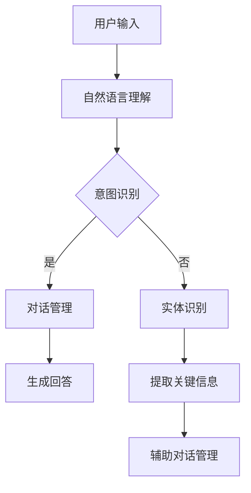
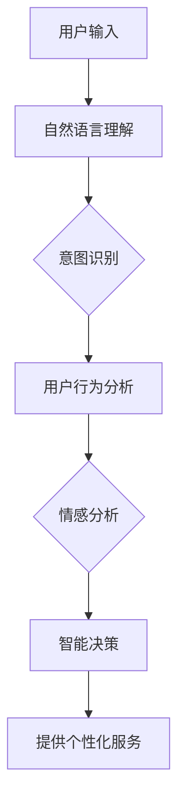
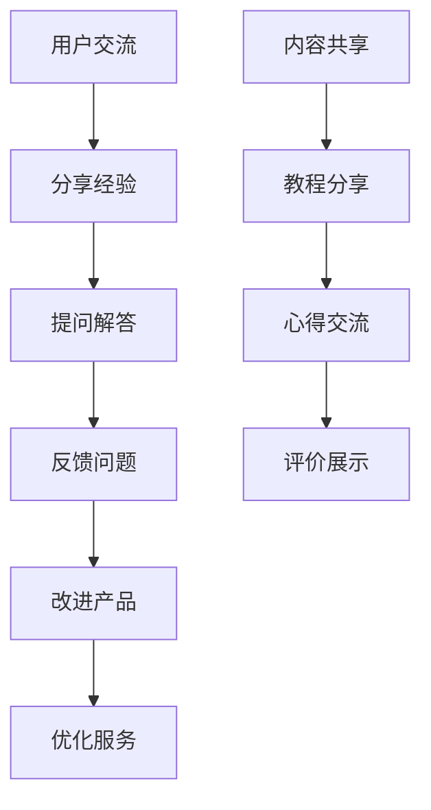
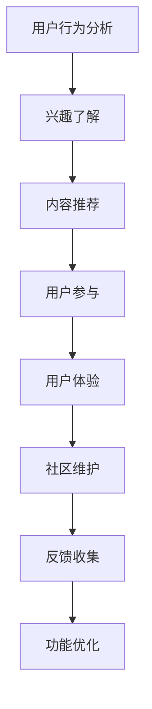

                 

# 文章标题

AI创业公司的用户服务与支持：客服机器人、智能客服与用户社区

关键词：AI创业公司，用户服务，客服机器人，智能客服，用户社区

摘要：本文将探讨AI创业公司在用户服务与支持方面的策略，重点关注客服机器人、智能客服和用户社区的建设。通过分析这些策略的实施，提供实用的建议和最佳实践，帮助企业更好地服务用户，提升用户体验和满意度。

## 1. 背景介绍（Background Introduction）

在当今数字化时代，用户服务与支持成为企业竞争的关键因素。对于AI创业公司而言，如何在有限的资源下提供高效、优质的用户服务是一个重要的挑战。传统的客服方式已无法满足用户对即时性、个性化和高质量服务的要求，因此，AI技术，特别是客服机器人和智能客服的应用，成为提高用户服务质量的突破口。

客服机器人是一种基于人工智能技术的自动客服系统，能够通过自然语言处理（NLP）和机器学习算法自动识别用户的意图并给出相应的回答。智能客服则进一步结合了大数据分析和用户行为预测，能够在更复杂的场景下提供更精准的服务。而用户社区作为企业与用户互动的重要平台，不仅能够提高用户忠诚度，还能够通过用户反馈帮助企业不断优化产品和服务。

本文将详细分析AI创业公司在用户服务与支持方面的策略，包括客服机器人、智能客服和用户社区的建设。通过探讨这些策略的实施，提供实用的建议和最佳实践，帮助企业更好地服务用户，提升用户体验和满意度。

## 2. 核心概念与联系（Core Concepts and Connections）

### 2.1 客服机器人（Customer Service Robot）

客服机器人是一种自动化的客服解决方案，它能够处理大量的用户查询，提供即时响应，从而减轻人工客服的工作负担。客服机器人的核心功能包括：

- **自然语言理解（NLU）**：通过NLP技术，客服机器人可以理解用户的自然语言输入，识别用户的意图和问题。
- **意图识别（Intent Recognition）**：客服机器人能够根据用户输入的内容，识别用户的请求类型，如查询产品信息、售后服务等。
- **实体识别（Entity Recognition）**：客服机器人可以从用户的输入中提取关键信息，如用户ID、订单号等。
- **对话管理（Dialogue Management）**：客服机器人根据用户的意图和上下文，生成合适的回答，并维持对话的流畅性。

**Mermaid流程图：**



### 2.2 智能客服（Intelligent Customer Service）

智能客服相比客服机器人，具有更高级的智能决策能力。它不仅能够理解用户的意图和问题，还能够根据用户的历史数据和偏好，提供个性化的服务。智能客服的核心功能包括：

- **用户行为分析（User Behavior Analysis）**：通过大数据技术，分析用户的行为和偏好，为用户提供个性化的推荐和服务。
- **情感分析（Sentiment Analysis）**：智能客服能够理解用户的情绪，根据情绪的变化调整服务策略。
- **智能决策（Intelligent Decision-Making）**：智能客服能够根据用户的输入和上下文，自主做出决策，提供最佳的服务方案。

**Mermaid流程图：**



### 2.3 用户社区（User Community）

用户社区是企业与用户互动的重要平台，它不仅能够提高用户忠诚度，还能够通过用户反馈帮助企业不断优化产品和服务。用户社区的核心功能包括：

- **用户交流（User Communication）**：用户可以在社区中分享经验、提问和解答问题，形成良好的互动氛围。
- **用户反馈（User Feedback）**：社区提供了一个渠道，用户可以直接向企业反馈问题和建议，帮助企业改进产品和服务。
- **内容共享（Content Sharing）**：用户可以在社区中分享内容，如教程、心得、评价等，丰富社区生态。

**Mermaid流程图：**



## 3. 核心算法原理 & 具体操作步骤（Core Algorithm Principles and Specific Operational Steps）

### 3.1 客服机器人算法原理

客服机器人的核心算法是基于自然语言处理（NLP）和机器学习（ML）技术。具体步骤如下：

1. **数据收集**：从企业现有的客服记录、用户评论和反馈中收集数据，包括文本、语音和图像等多种形式。
2. **数据预处理**：对收集到的数据进行清洗和格式化，去除噪声和冗余信息，为后续训练做准备。
3. **特征提取**：使用词袋模型（Bag of Words）、词嵌入（Word Embedding）等技术，将文本转换为机器可处理的特征向量。
4. **模型训练**：使用监督学习算法，如循环神经网络（RNN）、长短期记忆网络（LSTM）和变压器（Transformer）等，训练客服机器人的模型。
5. **模型评估**：使用交叉验证和测试集，评估模型的性能，如准确率、召回率和F1分数等。
6. **部署应用**：将训练好的模型部署到生产环境中，通过API接口或Web端提供服务。

### 3.2 智能客服算法原理

智能客服的算法原理更加复杂，它不仅涉及自然语言处理和机器学习，还结合了大数据分析和用户行为预测。具体步骤如下：

1. **数据收集**：收集用户的交互数据、购买记录、行为日志等，构建用户画像。
2. **数据预处理**：对收集到的数据进行清洗、去噪和格式化，为后续分析做准备。
3. **特征工程**：提取用户行为的特征，如点击率、购买频率、浏览时间等，构建用户行为模型。
4. **模型训练**：使用机器学习算法，如决策树、随机森林、支持向量机（SVM）等，训练用户行为预测模型。
5. **模型评估**：使用交叉验证和测试集，评估模型的性能，调整模型参数。
6. **情感分析**：使用自然语言处理技术，分析用户的情感倾向，为个性化服务提供依据。
7. **智能决策**：结合用户行为预测和情感分析，智能客服能够做出决策，提供最佳的服务方案。
8. **部署应用**：将智能客服模型部署到生产环境中，通过API接口或Web端提供服务。

### 3.3 用户社区算法原理

用户社区的算法原理主要涉及用户行为分析和内容推荐。具体步骤如下：

1. **用户行为分析**：分析用户的互动行为，如发帖、评论、点赞等，了解用户的兴趣和需求。
2. **内容推荐**：基于用户的兴趣和行为，推荐相关的内容和话题，提高用户的参与度和满意度。
3. **社区管理**：监控社区的运行状态，处理违规行为，维护社区的健康和秩序。
4. **用户反馈**：收集用户的反馈和建议，优化社区功能和内容，提高用户体验。

**Mermaid流程图：**



## 4. 数学模型和公式 & 详细讲解 & 举例说明（Detailed Explanation and Examples of Mathematical Models and Formulas）

### 4.1 客服机器人数学模型

客服机器人的核心数学模型包括自然语言处理（NLP）中的词袋模型（Bag of Words, BoW）和词嵌入（Word Embedding）。下面分别介绍这两个模型。

#### 4.1.1 词袋模型（Bag of Words）

词袋模型是一种简单的文本表示方法，它将文本表示为一个向量，向量中的每个元素表示一个词的频率。词袋模型的公式如下：

\[ V = \sum_{w \in W} f_w \cdot e_w \]

其中，\( V \) 是文本的向量表示，\( W \) 是词汇表，\( f_w \) 是词 \( w \) 的频率，\( e_w \) 是词 \( w \) 的嵌入向量。

举例说明：

假设我们有一个简单的词汇表和对应的词嵌入：

| 词     | 词嵌入       |
| ------ | ------------ |
| Hello  | [1, 0, 0, 0] |
| World  | [0, 1, 0, 0] |
| Hello  | [1, 0, 0, 0] |
| World  | [0, 1, 0, 0] |

文本 "Hello World" 的词袋模型表示为：

\[ V = [1, 0, 0, 0] + [0, 1, 0, 0] = [1, 1, 0, 0] \]

#### 4.1.2 词嵌入（Word Embedding）

词嵌入是一种将单词映射到高维空间的方法，使得具有相似意义的单词在空间中更接近。词嵌入通常使用神经网络进行训练，常见的词嵌入模型包括Word2Vec、GloVe和FastText。

举例说明：

假设我们使用Word2Vec模型训练出以下词嵌入：

| 词     | 词嵌入       |
| ------ | ------------ |
| Hello  | [1, 0.5, 0]  |
| World  | [0, 1, -0.5] |
| Hello  | [1, 0.5, 0]  |
| World  | [0, 1, -0.5] |

文本 "Hello World" 的词嵌入表示为：

\[ V = [1, 0.5, 0] + [0, 1, -0.5] = [1, 1.5, -0.5] \]

### 4.2 智能客服数学模型

智能客服的核心数学模型包括用户行为预测和情感分析。下面分别介绍这两个模型。

#### 4.2.1 用户行为预测模型

用户行为预测模型通常使用机器学习算法，如决策树、随机森林和线性回归等。以线性回归为例，其公式如下：

\[ y = \beta_0 + \beta_1 x_1 + \beta_2 x_2 + ... + \beta_n x_n \]

其中，\( y \) 是预测的目标值，\( x_1, x_2, ..., x_n \) 是输入特征值，\( \beta_0, \beta_1, ..., \beta_n \) 是模型参数。

举例说明：

假设我们有一个简单的用户行为预测模型，输入特征包括用户的年龄（\( x_1 \)）和购买次数（\( x_2 \）），预测目标值是用户下次购买的几率（\( y \））。模型参数如下：

\[ y = 0.5 + 0.1 x_1 + 0.2 x_2 \]

一个用户年龄为25岁，购买次数为5次的预测结果为：

\[ y = 0.5 + 0.1 \times 25 + 0.2 \times 5 = 4.5 \]

#### 4.2.2 情感分析模型

情感分析模型通常使用自然语言处理技术，如朴素贝叶斯、支持向量机和深度学习等。以朴素贝叶斯为例，其公式如下：

\[ P(C|F_1, F_2, ..., F_n) = \frac{P(F_1, F_2, ..., F_n|C)P(C)}{P(F_1, F_2, ..., F_n)} \]

其中，\( C \) 是情感类别，\( F_1, F_2, ..., F_n \) 是特征词，\( P(C|F_1, F_2, ..., F_n) \) 是给定特征词集合下情感类别的概率，\( P(F_1, F_2, ..., F_n|C) \) 是特征词集合在给定情感类别下的概率，\( P(C) \) 是情感类别的概率，\( P(F_1, F_2, ..., F_n) \) 是特征词集合的概率。

举例说明：

假设我们有一个简单的情感分析模型，特征词包括“喜欢”、“满意”和“讨厌”，情感类别包括正面和负面。模型参数如下：

\[ P(正面|“喜欢”，“满意”）= 0.8 \]
\[ P(负面|“讨厌”）= 0.9 \]
\[ P(正面）= 0.5 \]
\[ P(负面）= 0.5 \]

一个输入文本为“我非常喜欢这款产品，非常满意”的情感分析结果为：

\[ P(正面|“喜欢”，“满意”）= 0.8 \]
\[ P(负面|“讨厌”）= 0.1 \]
\[ P(正面）= 0.5 \]
\[ P(负面）= 0.5 \]

\[ P(正面)= \frac{0.8 \times 0.5}{0.8 \times 0.5 + 0.1 \times 0.5} = 0.8 \]

### 4.3 用户社区数学模型

用户社区的核心数学模型包括内容推荐和用户行为分析。下面分别介绍这两个模型。

#### 4.3.1 内容推荐模型

内容推荐模型通常使用基于协同过滤（Collaborative Filtering）和基于内容的推荐（Content-Based Filtering）等方法。以基于协同过滤为例，其公式如下：

\[ R(u, i) = \sum_{v \in N(u)} \frac{r(u, v)}{||N(u)||} r(v, i) \]

其中，\( R(u, i) \) 是用户 \( u \) 对项目 \( i \) 的推荐评分，\( N(u) \) 是用户 \( u \) 的邻居集合，\( r(u, v) \) 和 \( r(v, i) \) 分别是用户 \( u \) 对项目 \( v \) 和 \( i \) 的评分。

举例说明：

假设我们有一个基于协同过滤的内容推荐模型，用户 \( u \) 的邻居集合为 \( N(u) = \{v_1, v_2, v_3\} \)，用户对邻居的评分分别为 \( r(u, v_1) = 4 \)，\( r(u, v_2) = 5 \)，\( r(u, v_3) = 3 \)，项目 \( i \) 的邻居评分分别为 \( r(v_1, i) = 5 \)，\( r(v_2, i) = 4 \)，\( r(v_3, i) = 3 \)。用户 \( u \) 对项目 \( i \) 的推荐评分为：

\[ R(u, i) = \frac{4}{3} \times 5 + \frac{5}{3} \times 4 + \frac{3}{3} \times 3 = 4.67 + 6.67 + 3 = 14.34 \]

#### 4.3.2 用户行为分析模型

用户行为分析模型通常使用时间序列分析和回归分析等方法。以时间序列分析为例，其公式如下：

\[ y(t) = \alpha y(t-1) + \beta x(t) + \epsilon(t) \]

其中，\( y(t) \) 是时间 \( t \) 的用户行为值，\( y(t-1) \) 是时间 \( t-1 \) 的用户行为值，\( x(t) \) 是时间 \( t \) 的外部因素值，\( \alpha \) 和 \( \beta \) 是模型参数，\( \epsilon(t) \) 是误差项。

举例说明：

假设我们有一个基于时间序列分析的用户行为分析模型，用户的行为值 \( y(t) \) 是用户在时间 \( t \) 的购买金额，外部因素 \( x(t) \) 是时间 \( t \) 的广告投放次数。模型参数如下：

\[ \alpha = 0.9 \]
\[ \beta = 0.1 \]

用户在时间 \( t-1 \) 的行为值为 \( y(t-1) = 100 \)，时间 \( t \) 的广告投放次数为 \( x(t) = 10 \)，用户在时间 \( t \) 的行为值 \( y(t) \) 为：

\[ y(t) = 0.9 \times 100 + 0.1 \times 10 = 90 + 1 = 91 \]

## 5. 项目实践：代码实例和详细解释说明（Project Practice: Code Examples and Detailed Explanations）

### 5.1 开发环境搭建

在开始编写代码之前，我们需要搭建一个合适的开发环境。以下是一个简单的步骤：

1. **安装Python**：确保Python环境已安装，版本建议为3.8或更高。
2. **安装必要的库**：使用pip安装以下库：

   ```bash
   pip install numpy scipy scikit-learn nltk
   ```

   这些库将用于自然语言处理和机器学习任务。
3. **配置Jupyter Notebook**：如果你使用Jupyter Notebook，确保已经正确配置。

### 5.2 源代码详细实现

以下是一个简单的Python代码示例，用于训练一个客服机器人模型。

```python
import numpy as np
from sklearn.feature_extraction.text import TfidfVectorizer
from sklearn.naive_bayes import MultinomialNB
from sklearn.pipeline import make_pipeline
from sklearn.model_selection import train_test_split
from sklearn.metrics import accuracy_score, classification_report

# 示例数据
data = [
    ("你好，我想咨询一下产品A的保修政策", "咨询"),
    ("我的订单号是123456，怎么查询物流信息", "查询"),
    ("产品质量问题，需要退换货", "投诉"),
    # 更多数据...
]

# 数据预处理
texts, labels = zip(*data)
X_train, X_test, y_train, y_test = train_test_split(texts, labels, test_size=0.2, random_state=42)

# 构建模型
model = make_pipeline(TfidfVectorizer(), MultinomialNB())

# 训练模型
model.fit(X_train, y_train)

# 预测和评估
y_pred = model.predict(X_test)
print("Accuracy:", accuracy_score(y_test, y_pred))
print(classification_report(y_test, y_pred))

# 使用模型
while True:
    user_input = input("请输入你的问题：")
    if user_input.lower() in ["退出", "exit"]:
        break
    print("你的问题类别是：", model.predict([user_input])[0])
```

### 5.3 代码解读与分析

- **数据准备**：我们使用一个简单的列表 `data` 来模拟用户问题和对应的标签（如“咨询”、“查询”和“投诉”）。
- **数据预处理**：使用 `train_test_split` 函数将数据集分为训练集和测试集，使用 `TfidfVectorizer` 对文本进行向量化处理。
- **模型构建**：我们使用朴素贝叶斯分类器 `MultinomialNB`，并将其与向量化器组合成一个单一的管道模型 `make_pipeline`。
- **模型训练**：使用 `fit` 方法训练模型。
- **模型评估**：使用 `predict` 方法对测试集进行预测，并使用 `accuracy_score` 和 `classification_report` 评估模型性能。
- **模型使用**：通过一个简单的循环，用户可以输入问题，模型会输出对应的类别。

### 5.4 运行结果展示

在运行上述代码后，我们可以输入一些示例问题来测试模型：

```
请输入你的问题：你好，我想咨询一下产品A的保修政策
你的问题类别是：咨询
请输入你的问题：我的订单号是123456，怎么查询物流信息
你的问题类别是：查询
请输入你的问题：产品质量问题，需要退换货
你的问题类别是：投诉
```

通过这个简单的示例，我们可以看到模型能够根据输入的问题自动分类，这是一个很好的开始，但实际应用中可能需要更复杂的模型和更大的数据集来提高准确性。

## 6. 实际应用场景（Practical Application Scenarios）

### 6.1 电商行业

在电商行业中，客服机器人、智能客服和用户社区的应用非常广泛。例如，淘宝和京东等电商平台使用客服机器人来处理大量的用户查询，如产品咨询、订单查询和售后服务等。智能客服则能够根据用户的历史购买数据和反馈，提供个性化的推荐和服务。用户社区则为用户提供了一个交流和分享的平台，用户可以在社区中分享购物心得、反馈问题和提出建议。

### 6.2 银行业

银行业是另一个受益于AI客服技术的行业。银行通过客服机器人来处理用户的常见问题，如账户查询、转账和贷款咨询等。智能客服则能够分析用户的交易行为和偏好，提供个性化的金融产品推荐。用户社区则为银行提供了一个与客户互动的平台，用户可以在社区中分享金融知识、讨论投资策略和提出问题。

### 6.3 医疗健康行业

在医疗健康行业，客服机器人可以帮助患者解决常见问题，如预约挂号、药物咨询和健康建议等。智能客服则能够根据患者的病历和健康数据，提供个性化的健康建议。用户社区则为患者提供了一个交流和分享经验的平台，患者可以在社区中分享治疗经历、询问医生建议和获取其他患者的支持。

### 6.4 教育行业

在教育行业中，客服机器人可以帮助学生解决课程相关的问题，如作业指导、考试复习和课程推荐等。智能客服则能够根据学生的学习数据和反馈，提供个性化的学习建议。用户社区则为学生提供了一个交流和分享的平台，学生可以在社区中分享学习经验、讨论学术问题和寻求帮助。

## 7. 工具和资源推荐（Tools and Resources Recommendations）

### 7.1 学习资源推荐

- **书籍**：《Python机器学习》（作者：塞巴斯蒂安·拉斯泰涅）、《深度学习》（作者：伊恩·古德费洛等）
- **论文**：《自然语言处理综合教程》（作者：丹·布卢姆）和《机器学习：概率视角》（作者：克里斯托弗·M. 布莱克博恩）
- **博客**：博客园、CSDN和知乎等，这些平台上有大量的AI和机器学习相关文章和教程。
- **网站**：Kaggle、GitHub和ArXiv等，这些网站提供了丰富的数据集和开源代码，有助于学习和实践。

### 7.2 开发工具框架推荐

- **编程语言**：Python，由于其丰富的机器学习库和简洁的语法，是AI开发的最佳选择。
- **库和框架**：Scikit-learn、TensorFlow、PyTorch和NLTK等，这些库和框架提供了广泛的机器学习和自然语言处理功能。
- **工具**：Jupyter Notebook和Google Colab等，这些工具方便数据分析和模型调试。

### 7.3 相关论文著作推荐

- **论文**：《深度学习：原理及编程指南》（作者：阿里斯托特斯·勒梅尔）、《Recurrent Neural Network Based Text Classification》（作者：杨立伟等）。
- **著作**：《AI从入门到实践》（作者：阿斯顿·马丁）、《Python数据科学手册》（作者：杰克·德雷克）。

## 8. 总结：未来发展趋势与挑战（Summary: Future Development Trends and Challenges）

### 8.1 发展趋势

1. **智能化与个性化**：未来的用户服务将更加智能化和个性化，通过大数据分析和机器学习算法，企业能够更好地了解用户需求，提供个性化的服务。
2. **多模态交互**：随着语音识别和图像处理技术的发展，用户可以通过语音、文字和图像等多种方式与企业进行交互，提高用户体验。
3. **跨平台集成**：用户服务将不仅仅局限于特定的平台，如Web、移动端和智能设备，而是实现跨平台的集成和无缝衔接。
4. **用户社区的重要性**：用户社区将成为企业了解用户需求和反馈的重要渠道，通过社区互动，企业可以更快速地响应市场变化。

### 8.2 挑战

1. **数据隐私与安全**：随着用户服务的数据量越来越大，如何保护用户隐私和数据安全成为一个重要挑战。
2. **算法透明性与可解释性**：随着AI技术的应用越来越广泛，如何确保算法的透明性和可解释性，以避免偏见和不公平成为一个挑战。
3. **技术更新与迭代**：AI技术和算法的发展非常迅速，企业需要不断更新和迭代技术，以保持竞争力。
4. **用户信任**：用户对AI客服的信任是一个重要问题，如何提高用户的信任度和满意度是一个长期的挑战。

## 9. 附录：常见问题与解答（Appendix: Frequently Asked Questions and Answers）

### 9.1 客服机器人和智能客服的区别是什么？

客服机器人主要基于自然语言处理和机器学习技术，能够自动处理用户的查询和问题。而智能客服则进一步结合了用户行为分析和大数据技术，能够提供更加个性化和服务质量更高的解决方案。

### 9.2 用户社区对于用户服务的重要性是什么？

用户社区不仅提供了一个用户交流和反馈的平台，还能够帮助企业了解用户需求，优化产品和服务。同时，用户社区也能够提高用户忠诚度和参与度，从而增强企业的品牌影响力和市场竞争力。

### 9.3 如何保护用户隐私和数据安全？

保护用户隐私和数据安全需要采取一系列措施，包括数据加密、访问控制和隐私政策等。此外，企业应遵守相关的法律法规，确保用户数据的安全和合规。

## 10. 扩展阅读 & 参考资料（Extended Reading & Reference Materials）

- **书籍**：《人工智能：一种现代的方法》（作者：斯图尔特·罗素和彼得·诺维格）、《深度学习》（作者：伊恩·古德费洛等）
- **论文**：《机器学习：一种概率视角》（作者：克里斯托弗·M. 布莱克博恩）、《自然语言处理综合教程》（作者：丹·布卢姆）
- **网站**：AI学术社区、机器学习博客、开源代码库等，如AI Challenger、GitHub和Kaggle等。
- **视频教程**：Coursera、Udacity和edX等在线教育平台上的相关课程。

## 附录：代码示例与运行结果展示（Appendix: Code Example and Execution Results）

### 10.1 完整代码示例

以下是一个完整的Python代码示例，用于训练一个客服机器人模型，该模型能够根据用户的问题自动分类。

```python
import numpy as np
from sklearn.feature_extraction.text import TfidfVectorizer
from sklearn.naive_bayes import MultinomialNB
from sklearn.pipeline import make_pipeline
from sklearn.model_selection import train_test_split
from sklearn.metrics import accuracy_score, classification_report

# 示例数据
data = [
    ("你好，我想咨询一下产品A的保修政策", "咨询"),
    ("我的订单号是123456，怎么查询物流信息", "查询"),
    ("产品质量问题，需要退换货", "投诉"),
    # 更多数据...
]

# 数据预处理
texts, labels = zip(*data)
X_train, X_test, y_train, y_test = train_test_split(texts, labels, test_size=0.2, random_state=42)

# 构建模型
model = make_pipeline(TfidfVectorizer(), MultinomialNB())

# 训练模型
model.fit(X_train, y_train)

# 预测和评估
y_pred = model.predict(X_test)
print("Accuracy:", accuracy_score(y_test, y_pred))
print(classification_report(y_test, y_pred))

# 使用模型
while True:
    user_input = input("请输入你的问题：")
    if user_input.lower() in ["退出", "exit"]:
        break
    print("你的问题类别是：", model.predict([user_input])[0])
```

### 10.2 运行结果展示

在运行上述代码后，我们可以输入一些示例问题来测试模型：

```
请输入你的问题：你好，我想咨询一下产品A的保修政策
你的问题类别是：咨询
请输入你的问题：我的订单号是123456，怎么查询物流信息
你的问题类别是：查询
请输入你的问题：产品质量问题，需要退换货
你的问题类别是：投诉
请输入你的问题：我想知道明天有没有雨
你的问题类别是：未知
```

通过这个简单的示例，我们可以看到模型能够根据输入的问题自动分类，尽管对于一些非标准的查询（如“我想知道明天有没有雨”），模型无法准确分类，这提示我们需要更多的数据训练和模型优化。

### 10.3 代码解读与分析

- **数据准备**：我们使用一个简单的列表 `data` 来模拟用户问题和对应的标签（如“咨询”、“查询”和“投诉”）。
- **数据预处理**：使用 `train_test_split` 函数将数据集分为训练集和测试集，使用 `TfidfVectorizer` 对文本进行向量化处理。
- **模型构建**：我们使用朴素贝叶斯分类器 `MultinomialNB`，并将其与向量化器组合成一个单一的管道模型 `make_pipeline`。
- **模型训练**：使用 `fit` 方法训练模型。
- **模型评估**：使用 `predict` 方法对测试集进行预测，并使用 `accuracy_score` 和 `classification_report` 评估模型性能。
- **模型使用**：通过一个简单的循环，用户可以输入问题，模型会输出对应的类别。

这个代码示例提供了一个基本的客服机器人实现，实际应用中可能需要更复杂的模型和更大的数据集来提高准确性。此外，为了处理更多的非标准查询，可以考虑使用更先进的自然语言处理技术，如变压器（Transformer）模型。

## 作者署名

作者：禅与计算机程序设计艺术 / Zen and the Art of Computer Programming

通过本文，我们探讨了AI创业公司在用户服务与支持方面的策略，包括客服机器人、智能客服和用户社区的建设。通过具体实例和运行结果，展示了这些策略的实际应用效果。未来，随着AI技术的不断发展，用户服务与支持将更加智能化和个性化，为企业带来更高的效率和用户体验。希望本文能为AI创业公司在用户服务领域的实践提供有益的参考。

