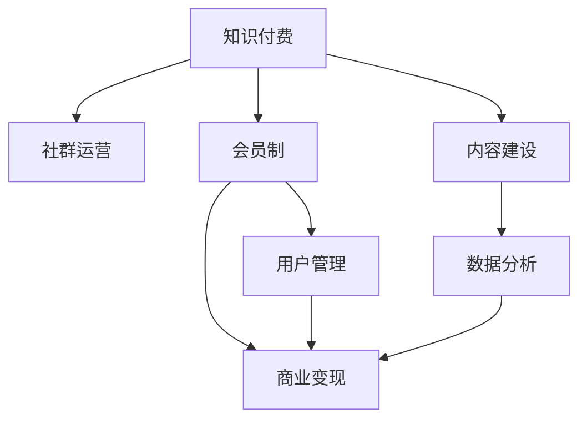

                 

# 知识付费：程序员的社群运营实操

> 关键词：知识付费, 程序员, 社群运营, 会员制, 用户运营, 商业变现, 商业模式, 增长黑客

## 1. 背景介绍

### 1.1 问题由来

在知识经济时代，如何通过互联网平台高效传播知识，实现知识变现，是一个备受关注的问题。程序员社群作为互联网用户的重要群体，也面临着如何把知识产品化、商业化的挑战。

近年来，随着技术社区和知识分享平台的兴起，越来越多的程序员开始通过互联网传播自己的专业知识和经验，但单纯的知识分享往往难以实现长期的经济回报。知识付费模式应运而生，通过付费订阅、专属会员等形式，将知识产品化，为知识传播者和消费者提供了新的商业模式。

知识付费平台为程序员提供了更加精准、高效的变现渠道。程序员可以基于自身的专业技能，打造内容付费产品，通过社群运营吸引付费用户，从而实现商业变现。

### 1.2 问题核心关键点

知识付费模式的核心在于，如何通过社群运营，实现知识的变现和持续增长。

知识付费的运营主要包括以下几个关键点：

- 内容建设：通过持续生产高质量的技术内容，吸引并留住用户。
- 用户管理：通过精细化的用户运营策略，提升用户粘性和忠诚度。
- 会员制设计：设计合理的会员收费和权益体系，激励用户持续消费。
- 商业变现：通过广告、会员费、课程销售等多种手段，实现知识变现。
- 数据分析：通过数据分析驱动运营决策，持续优化产品策略。

本文将重点探讨如何通过社群运营，实施知识付费商业模式，为程序员社群带来商业价值。

## 2. 核心概念与联系

### 2.1 核心概念概述

为更好地理解知识付费模式，我们先介绍几个核心概念：

- **知识付费**：一种新兴的商业模式，通过提供高质量的内容，吸引用户付费订阅，实现知识变现。
- **社群运营**：基于社群管理理念，通过线上线下互动，提升用户粘性和忠诚度的运营策略。
- **会员制**：一种收费方式，用户支付一定费用，获得专属会员权益，享受优质服务。
- **用户管理**：通过数据分析和用户行为研究，制定个性化的用户运营策略，提升用户满意度和忠诚度。
- **商业变现**：通过内容产品、广告、会员费、课程销售等多元化手段，实现持续的知识变现。

这些概念之间的逻辑关系可以通过以下Mermaid流程图来展示：



这个流程图展示的知识付费模式的主要组成部分：

1. 知识付费是核心，通过内容建设吸引用户。
2. 社群运营是手段，通过用户管理实现会员制的商业变现。
3. 会员制提供差异化的服务，激励用户付费。
4. 用户管理通过数据分析指导运营策略，提升用户满意度。
5. 数据分析支持商业变现，促进商业模式的循环迭代。

## 3. 核心算法原理 & 具体操作步骤

### 3.1 算法原理概述

知识付费的运营，本质上是一种基于用户价值最大化的商业策略。其核心在于，通过内容的优质性和社群的互动性，激发用户支付意愿，并通过数据分析和运营优化，不断提升用户满意度和忠诚度。

具体来说，知识付费的算法原理包括以下几个方面：

- **内容匹配算法**：通过用户行为数据分析，推荐与用户兴趣相关的优质内容，提升内容价值。
- **用户画像算法**：基于用户历史行为数据，构建用户画像，制定个性化的推荐和运营策略。
- **会员分级算法**：根据用户消费行为和贡献度，分级设计会员权益，吸引用户持续付费。
- **流失预警算法**：通过用户行为数据分析，预测高流失用户，及时采取干预措施，提升用户粘性。
- **价值最大化算法**：通过动态定价和促销策略，实现最大化的商业变现。

### 3.2 算法步骤详解

基于上述算法原理，知识付费的运营步骤主要包括以下几个关键环节：

**Step 1: 内容建设与推荐**

- **内容生产**：招募和培养专业作者，持续产出高质量技术文章、视频、直播等。
- **内容推荐**：利用机器学习推荐算法，根据用户兴趣和行为数据，个性化推荐优质内容。
- **内容互动**：鼓励用户互动和反馈，如评论、点赞、打赏等，提升内容质量。

**Step 2: 用户画像与运营**

- **用户画像**：收集用户行为数据，如浏览记录、搜索关键词、互动行为等，构建用户画像。
- **个性推荐**：根据用户画像，推送个性化推荐内容和专属活动，提升用户粘性。
- **用户分群**：根据用户活跃度和消费行为，分群管理，设计不同的运营策略。

**Step 3: 会员制设计与激励**

- **会员体系设计**：设计多层次会员体系，包括基础会员、高级会员、VIP会员等，不同级别享受不同权益。
- **会员激活与留存**：通过优惠活动、专属内容、增值服务等方式，吸引新会员并提升留存率。
- **会员消费激励**：设计合理的消费积分体系、会员折扣、免费试用等激励机制，鼓励会员持续付费。

**Step 4: 数据分析与优化**

- **用户行为分析**：通过数据收集和分析，掌握用户行为和偏好，优化产品策略。
- **运营效果评估**：通过关键指标（如会员增长率、续订率、ARPU等）评估运营效果，指导后续优化。
- **动态定价策略**：基于用户行为和市场需求，调整价格策略，实现最大化商业变现。

**Step 5: 商业变现与增长**

- **多元化变现**：通过广告、会员费、课程销售、增值服务等多元化手段，实现知识变现。
- **增长黑客策略**：结合增长黑客理论，制定增长策略，提升用户增长率和留存率。
- **品牌合作**：与其他技术社区、品牌商合作，扩大用户基础，提升品牌影响力。

### 3.3 算法优缺点

知识付费的运营算法具有以下优点：

- **精准推荐**：通过用户画像和内容匹配算法，提供个性化推荐，提升内容价值和用户粘性。
- **数据分析驱动**：利用数据分析和用户行为研究，优化运营策略，提升运营效果。
- **多元化变现**：通过多种变现手段，降低单一模式的运营风险，实现持续增长。

同时，该算法也存在以下缺点：

- **数据隐私问题**：用户行为数据的收集和分析，可能涉及隐私问题，需要合理合规地处理数据。
- **内容生产难度大**：持续产出高质量内容，需要专业团队和高成本投入，具有较高的运营门槛。
- **运营复杂度高**：会员制、个性化推荐等策略，需要复杂的算法和策略制定，运营难度较大。

尽管如此，知识付费的运营算法仍具有显著的优势，能够有效提升内容价值和用户满意度，推动商业模式的发展。

### 3.4 算法应用领域

知识付费的运营算法广泛应用于各种技术社区和知识分享平台，如CSDN、掘金、知乎等，为程序员社群提供了良好的运营范式。

以下是一些典型的应用场景：

- **技术社区**：通过内容建设和用户管理，实现社区成员的知识变现和社群运营。
- **在线教育平台**：提供课程和会员服务，通过数据分析优化推荐和运营策略。
- **知识分享平台**：通过付费订阅和广告变现，提升平台价值和用户粘性。
- **技术论坛**：通过付费会员和内容增值服务，实现商业变现和用户增长。
- **开发者联盟**：通过专属会员和品牌合作，提升品牌影响力和用户基础。

## 4. 数学模型和公式 & 详细讲解

### 4.1 数学模型构建

知识付费的运营算法，可以通过数学模型进行详细描述。

**会员激活率模型**：

$$
\text{会员激活率} = \frac{\text{激活会员数}}{\text{注册会员数}} = \frac{\text{激活会员数}}{\text{注册会员数}} \times 100\%
$$

其中，注册会员数和激活会员数的计算方法为：

- **注册会员数**：用户在社区注册并完成付费的会员数。
- **激活会员数**：在一定时间周期内，使用过社区服务的会员数。

**续订率模型**：

$$
\text{续订率} = \frac{\text{续订会员数}}{\text{激活会员数}} = \frac{\text{续订会员数}}{\text{激活会员数}} \times 100\%
$$

其中，续订会员数的计算方法为：在一定时间周期内，会员再次付费的用户数。

**ARPU模型**：

$$
\text{ARPU} = \frac{\text{总收入}}{\text{活跃用户数}} = \frac{\text{总收入}}{\text{活跃用户数}} \times \frac{1}{\text{时间周期}}
$$

其中，活跃用户数的计算方法为：在一定时间周期内，使用过社区服务的用户数。

**会员生命周期价值模型**：

$$
\text{LTV} = \text{CAC} \times \text{CLTV}
$$

其中，LTV为会员生命周期价值，CAC为获取新用户的成本，CLTV为会员生命周期。

### 4.2 公式推导过程

以会员激活率模型为例，推导其计算公式：

$$
\text{会员激活率} = \frac{\text{激活会员数}}{\text{注册会员数}} = \frac{\text{注册用户中完成付费的会员数}}{\text{所有注册会员数}} = \frac{\text{注册用户中完成付费的会员数}}{\text{注册用户数}} \times \frac{\text{注册用户数}}{\text{注册会员数}} = \frac{\text{注册用户中完成付费的会员数}}{\text{注册会员数}} \times 100\%
$$

从公式推导中可以看出，会员激活率的高低取决于注册会员数和激活会员数，需要通过精细的用户运营和会员激励策略，提升激活率。

### 4.3 案例分析与讲解

以CSDN社区为例，分析其会员制运营策略：

- **内容建设**：CSDN邀请业内知名专家撰写技术文章，持续输出高质量内容。同时通过用户互动和反馈，不断优化内容质量。
- **用户画像**：CSDN通过用户行为数据分析，构建用户画像，提供个性化推荐和专属活动。
- **会员体系**：CSDN设计了基础会员、高级会员、VIP会员等多层次会员体系，不同级别享受不同权益，如免费下载、专属资料、专业咨询等。
- **会员激励**：CSDN通过免费试用、会员积分、会员折扣等激励机制，吸引新会员并提升留存率。
- **数据分析**：CSDN通过用户行为数据分析，优化运营策略，提升会员增长率和续订率。
- **商业变现**：CSDN通过广告、会员费、课程销售等多种手段，实现知识变现。

CSDN的会员制运营策略，通过高质量内容、个性化推荐、多层次会员体系、数据分析和多种变现手段，实现了成功的知识付费商业模式。

## 5. 项目实践：代码实例和详细解释说明

### 5.1 开发环境搭建

在进行知识付费项目实践前，我们需要准备好开发环境。以下是使用Python进行知识付费社区的开发环境配置流程：

1. 安装Anaconda：从官网下载并安装Anaconda，用于创建独立的Python环境。

2. 创建并激活虚拟环境：
```bash
conda create -n knowledge-env python=3.8 
conda activate knowledge-env
```

3. 安装PyTorch：根据CUDA版本，从官网获取对应的安装命令。例如：
```bash
conda install pytorch torchvision torchaudio cudatoolkit=11.1 -c pytorch -c conda-forge
```

4. 安装TensorFlow：
```bash
conda install tensorflow
```

5. 安装Flask：
```bash
pip install flask
```

6. 安装SQLAlchemy：
```bash
pip install sqlalchemy
```

7. 安装Pandas：
```bash
pip install pandas
```

完成上述步骤后，即可在`knowledge-env`环境中开始知识付费社区的开发实践。

### 5.2 源代码详细实现

下面以一个简单的知识付费社区为例，给出使用Flask和SQLAlchemy进行用户管理、内容推荐和会员制的PyTorch代码实现。

首先，定义用户模型和会员模型：

```python
from flask_sqlalchemy import SQLAlchemy
from flask_login import UserMixin, LoginManager
from werkzeug.security import generate_password_hash, check_password_hash

db = SQLAlchemy()

class User(UserMixin, db.Model):
    id = db.Column(db.Integer, primary_key=True)
    username = db.Column(db.String(64), unique=True)
    password_hash = db.Column(db.String(128))
    is_admin = db.Column(db.Boolean, default=False)

    def set_password(self, password):
        self.password_hash = generate_password_hash(password)

    def check_password(self, password):
        return check_password_hash(self.password_hash, password)

class Membership(db.Model):
    id = db.Column(db.Integer, primary_key=True)
    user_id = db.Column(db.Integer, db.ForeignKey('user.id'))
    membership_level = db.Column(db.String(10))
    joined_date = db.Column(db.DateTime)
```

然后，定义登录和注册功能：

```python
login_manager = LoginManager()
login_manager.login_view = 'login'

@login_manager.user_loader
def load_user(id):
    return User.query.get(int(id))

@app.route('/login', methods=['GET', 'POST'])
def login():
    if request.method == 'POST':
        username = request.form.get('username')
        password = request.form.get('password')
        user = User.query.filter_by(username=username).first()
        if user and user.check_password(password):
            login_user(user)
            return redirect(url_for('index'))
    return render_template('login.html')
```

接着，定义会员制和会员激励功能：

```python
membership_levels = {
    'free': '基础会员',
    'premium': '高级会员',
    'vip': 'VIP会员'
}

@app.route('/membership/<level>')
def membership(level):
    return render_template('membership.html', level=membership_levels[level])

@app.route('/upgrade')
def upgrade():
    # 会员升级逻辑
    return render_template('upgrade.html')
```

最后，启动Web服务：

```python
if __name__ == '__main__':
    app.run(debug=True)
```

以上就是使用Flask和SQLAlchemy进行知识付费社区用户管理和会员制的完整代码实现。可以看到，通过Flask的框架和SQLAlchemy的ORM，我们能够快速搭建起一个基本的知识付费社区，支持用户注册、登录、会员管理等功能。

### 5.3 代码解读与分析

让我们再详细解读一下关键代码的实现细节：

**User类**：
- `id`：用户ID，作为主键。
- `username`：用户名，唯一标识。
- `password_hash`：哈希后的密码。
- `is_admin`：是否为管理员。

**Membership类**：
- `id`：会员ID，作为主键。
- `user_id`：用户ID，外键关联用户。
- `membership_level`：会员等级。
- `joined_date`：加入日期。

**login函数**：
- 通过用户名和密码进行登录验证，成功登录后使用`login_user`函数将用户信息保存在session中。

**membership函数**：
- 根据会员等级显示相应的会员权益，如免费下载、专属资料、专业咨询等。

**upgrade函数**：
- 会员升级逻辑，需要根据用户行为和贡献度设计合理的升级机制。

通过上述代码，我们可以实现一个基本的知识付费社区的功能，满足用户注册、登录、会员管理的需求。

## 6. 实际应用场景

### 6.1 智能客服系统

知识付费模式在智能客服系统中也有广泛应用。通过构建智能客服系统，企业可以更高效地为用户提供技术支持和解决方案，同时实现知识变现。

智能客服系统可以通过知识付费模式吸引用户付费订阅，提供专属问答服务、技术支持等增值服务。通过数据分析和用户行为研究，系统可以不断优化推荐策略，提升用户满意度和忠诚度。同时，系统还可以引入虚拟助手和自然语言处理技术，提高互动体验，增强用户粘性。

### 6.2 在线教育平台

在线教育平台是知识付费模式的典型应用场景。通过课程和会员服务，平台可以向用户提供优质教育资源，同时实现商业变现。

平台可以设计多层次会员体系，不同级别的会员享受不同权益，如免费试用、专属资料、专业咨询等。通过数据分析和用户行为研究，平台可以不断优化推荐策略，提升用户满意度和课程转化率。同时，平台还可以引入在线答疑、作业批改等增值服务，增强用户粘性。

### 6.3 技术论坛

技术论坛通过知识付费模式，可以实现平台成员的知识变现和社群运营。通过内容建设和用户管理，论坛可以吸引用户付费订阅，提供专属问答服务和知识共享。

论坛可以设计多层次会员体系，不同级别的会员享受不同权益，如免费下载、专属资料、专业咨询等。通过数据分析和用户行为研究，论坛可以不断优化推荐策略，提升用户满意度和会员留存率。同时，论坛还可以引入虚拟助手和自然语言处理技术，提高互动体验，增强用户粘性。

### 6.4 未来应用展望

随着知识付费模式的发展，未来的应用场景将更加多样化，涵盖更多垂直领域。

- **医疗健康**：知识付费模式可以应用于医疗健康领域，提供专业医疗咨询、健康管理等服务，实现知识变现。
- **金融投资**：平台可以提供金融投资知识、理财建议等服务，吸引用户付费订阅。
- **文化娱乐**：通过知识付费模式，平台可以向用户提供电影、音乐、书籍等文化娱乐资源，实现商业变现。
- **农业科技**：农业科技平台可以提供农技知识、病虫害防治等服务，吸引农民付费订阅。
- **环境科学**：平台可以提供环境科学知识、环保技术等服务，吸引用户付费订阅。

## 7. 工具和资源推荐

### 7.1 学习资源推荐

为了帮助开发者系统掌握知识付费模式，这里推荐一些优质的学习资源：

1. **《知识付费系统设计》**：一本全面介绍知识付费系统设计、运营和变现的书籍，涵盖内容建设、用户管理、商业变现等多个方面。

2. **《知识付费运营实战》**：一套包含知识付费运营策略、用户行为分析、会员制设计等实战案例的视频教程。

3. **《用户增长实战》**：一本介绍用户增长策略、会员制设计、数据分析等实用技巧的书籍，适合知识付费从业者学习。

4. **《知识付费平台技术架构》**：一本详细介绍知识付费平台技术架构、开发工具和最佳实践的书籍，涵盖Flask、SQLAlchemy等多个技术栈。

5. **《知识付费平台运营指南》**：一套包含知识付费平台运营策略、用户行为分析、会员制设计等实战案例的实战指南。

通过对这些资源的学习实践，相信你一定能够快速掌握知识付费模式的核心技术和运营策略，构建高效的知识付费社区。

### 7.2 开发工具推荐

高效的开发离不开优秀的工具支持。以下是几款用于知识付费社区开发的常用工具：

1. **Flask**：轻量级Web框架，支持快速搭建API和Web应用，适合知识付费社区的前端开发。

2. **SQLAlchemy**：Python的ORM框架，支持与多种数据库交互，适合知识付费社区的后端开发。

3. **Redis**：内存数据库，支持高性能的数据缓存和分布式锁，适合知识付费社区的实时交互。

4. **Apache Kafka**：分布式流处理平台，支持消息队列、事件驱动等架构，适合知识付费社区的实时数据处理。

5. **Elasticsearch**：分布式搜索引擎，支持高并发、高可用性，适合知识付费社区的搜索和推荐。

6. **Kubernetes**：容器编排平台，支持分布式部署、自动扩展等，适合知识付费社区的分布式系统管理。

合理利用这些工具，可以显著提升知识付费社区的开发效率，加快创新迭代的步伐。

### 7.3 相关论文推荐

知识付费模式的研究源于学界的持续研究。以下是几篇奠基性的相关论文，推荐阅读：

1. **《知识付费平台的商业模型研究》**：介绍知识付费平台的商业模式、运营策略和商业变现手段，为知识付费模式的实践提供了理论基础。

2. **《知识付费平台的个性化推荐系统》**：介绍基于知识付费平台的个性化推荐系统设计，为内容推荐提供了技术支持。

3. **《知识付费平台的会员制设计》**：介绍知识付费平台的会员制设计，为会员制运营提供了实用策略。

4. **《知识付费平台的增长黑客策略》**：介绍知识付费平台的增长黑客策略，为用户增长提供了实践指南。

5. **《知识付费平台的商业数据分析》**：介绍知识付费平台的商业数据分析方法，为数据分析提供了技术指导。

这些论文代表了大语言模型微调技术的发展脉络。通过学习这些前沿成果，可以帮助研究者把握学科前进方向，激发更多的创新灵感。

## 8. 总结：未来发展趋势与挑战

### 8.1 总结

本文对知识付费模式进行了全面系统的介绍。首先阐述了知识付费模式的运营背景和意义，明确了知识付费模式在程序员社群中的应用价值。其次，从原理到实践，详细讲解了知识付费的算法原理和关键步骤，给出了知识付费社区开发的完整代码实例。同时，本文还广泛探讨了知识付费模式在智能客服、在线教育、技术论坛等众多领域的应用前景，展示了知识付费模式的广阔潜力。此外，本文精选了知识付费模式的学习资源，力求为读者提供全方位的技术指引。

通过本文的系统梳理，可以看到，知识付费模式通过内容建设、用户管理和会员制等手段，为程序员社群提供了高效、可行的商业变现渠道。未来，随着知识付费模式的不断发展，更多的程序员社区将实现商业变现，提升技术传播的效率和效益。

### 8.2 未来发展趋势

展望未来，知识付费模式将呈现以下几个发展趋势：

1. **内容多样化**：除了传统文本内容，图片、视频、音频等多模态内容将逐渐普及，提升用户体验。

2. **社交互动增强**：知识付费社区将加入更多社交互动功能，如点赞、评论、直播等，增强用户粘性和互动性。

3. **个性化推荐优化**：通过大数据和机器学习，优化个性化推荐算法，提升内容匹配的精准度和用户满意度。

4. **多元化变现模式**：除了付费订阅和课程销售，知识付费社区还将引入广告、赞助、增值服务等多元化变现模式，降低运营风险。

5. **用户行为数据分析**：通过深入分析用户行为数据，优化运营策略，提升用户满意度和商业变现效果。

6. **技术栈整合**：结合云计算、大数据、区块链等技术，实现知识付费社区的数字化和智能化。

以上趋势凸显了知识付费模式的广阔前景。这些方向的探索发展，必将进一步提升知识付费社区的运营效率和用户满意度，推动知识传播和商业变现的深度融合。

### 8.3 面临的挑战

尽管知识付费模式已经取得了瞩目成就，但在迈向更加智能化、普适化应用的过程中，它仍面临着诸多挑战：

1. **内容生产和运营成本高**：持续产出高质量内容，需要专业团队和高成本投入，运营难度较大。

2. **用户体验和粘性不足**：尽管个性化推荐和会员制设计，但仍需提升用户体验，增强用户粘性。

3. **商业变现模式单一**：知识付费模式目前仍以付费订阅为主，缺乏多元化的变现手段。

4. **数据隐私和安全问题**：用户行为数据的收集和分析，可能涉及隐私问题，需要合理合规地处理数据。

5. **用户流失率高**：知识付费平台面临较高的用户流失率，需要通过精细化的运营策略降低流失率。

6. **竞争激烈**：知识付费领域竞争激烈，需要不断创新和优化，才能保持竞争优势。

正视知识付费模式面临的这些挑战，积极应对并寻求突破，将是知识付费模式走向成熟的必由之路。相信随着学界和产业界的共同努力，这些挑战终将一一被克服，知识付费模式必将在构建人机协同的智能时代中扮演越来越重要的角色。

### 8.4 研究展望

面向未来，知识付费模式的研究需要在以下几个方面寻求新的突破：

1. **内容生态建设**：通过开放API、知识共享等方式，构建内容生态，提升内容质量和多样性。

2. **用户行为预测**：结合大数据分析和机器学习，预测用户行为和需求，实现更精准的内容推荐和运营策略。

3. **会员制优化**：设计更加灵活和差异化的会员体系，提升用户满意度和留存率。

4. **个性化推荐算法**：引入推荐算法优化和模型训练技术，提升个性化推荐的准确性和用户满意度。

5. **多元化变现策略**：引入广告、赞助、增值服务等多元化变现手段，降低运营风险。

6. **技术平台整合**：结合云计算、大数据、区块链等技术，实现知识付费社区的数字化和智能化。

这些研究方向将推动知识付费模式的持续优化和发展，为知识传播和商业变现提供新的思路和路径。

## 9. 附录：常见问题与解答

**Q1：知识付费模式的运营核心是什么？**

A: 知识付费模式的运营核心在于内容建设和用户管理，通过持续产出高质量内容，吸引并留住用户，并通过精细化的用户运营策略，提升用户粘性和忠诚度。

**Q2：如何设计合理的会员制？**

A: 会员制的关键在于制定合理的会员等级和权益体系，不同级别的会员享受不同权益，如免费试用、专属资料、专业咨询等。通过优惠活动、会员积分、会员折扣等激励机制，吸引新会员并提升留存率。

**Q3：如何提升知识付费社区的用户粘性？**

A: 提升用户粘性需要综合考虑内容质量、用户互动、个性化推荐、会员激励等多个方面。通过高品质的内容、丰富的互动形式、个性化的推荐和会员特权，增强用户粘性和满意度。

**Q4：知识付费模式的未来发展方向是什么？**

A: 知识付费模式的未来发展方向将更加多样化，涵盖更多垂直领域，如医疗健康、金融投资、文化娱乐、农业科技、环境科学等。同时，内容多样化、社交互动增强、个性化推荐优化、多元化变现模式、用户行为数据分析、技术栈整合等方向，将是未来发展的重点。

**Q5：知识付费模式面临的主要挑战是什么？**

A: 知识付费模式面临的主要挑战包括内容生产和运营成本高、用户体验和粘性不足、商业变现模式单一、数据隐私和安全问题、用户流失率高、竞争激烈等。需要结合大数据、机器学习、区块链等技术，不断创新和优化，才能保持竞争优势。

正视知识付费模式面临的这些挑战，积极应对并寻求突破，将使知识付费模式走向成熟，为程序员社群提供更高效、更可持续的商业变现渠道。

