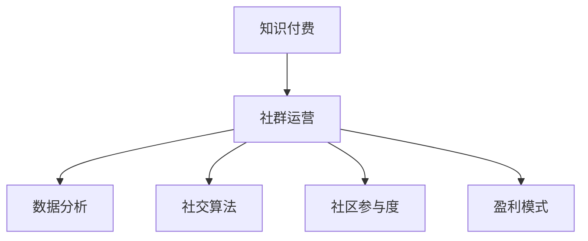

                 

# 知识付费：程序员的社群运营模板

> 关键词：知识付费, 程序员社群, 运营模板, 数据分析, 社交算法, 社区参与度, 盈利模式

## 1. 背景介绍

### 1.1 问题由来

随着互联网的普及和技术的不断发展，知识付费市场正在迅速崛起。无论是企业还是个人，都逐渐意识到知识付费的价值，愿意为获取深度知识、技能和经验付费。尤其在程序员社群中，知识付费已成为一个重要的盈利模式。

然而，在实际运营中，如何通过知识付费提升社群的参与度和黏性，实现商业变现，成为众多社群运营者面临的难题。本文将基于多年从事程序员社群运营的经验，分享一套知识付费的运营模板，涵盖数据分析、社交算法、盈利模式等多个关键环节，帮助运营者打造一个高效的程序员知识付费社群。

### 1.2 问题核心关键点

一个成功的知识付费社群需要具备以下几个核心关键点：

- **数据分析**：通过数据驱动决策，了解社群成员的兴趣、行为、反馈，优化运营策略。
- **社交算法**：利用算法推荐技术，提升内容的分发效率和社群成员的参与度。
- **社区参与度**：通过互动、激励等手段，提高社群成员的活跃度和黏性。
- **盈利模式**：探索多种盈利途径，实现社群的可持续发展。

本文将围绕这些关键点展开，提供详细的运营策略和实操技巧。

## 2. 核心概念与联系

### 2.1 核心概念概述

为了更好地理解知识付费社群的运营策略，我们先介绍几个关键概念：

- **知识付费**：通过付费方式获取深度知识、技能和经验的服务模式。
- **社群运营**：通过管理和优化社群资源，提升社群成员的参与度和满意度，实现社群价值的最大化。
- **数据分析**：通过数据收集、处理和分析，获取有价值的信息，指导决策。
- **社交算法**：利用机器学习算法，优化社群内容的分发和推荐。
- **社区参与度**：衡量社群成员的活跃度和满意度，提升社群的凝聚力。
- **盈利模式**：通过广告、会员、课程等多种方式实现商业变现。

这些概念之间的逻辑关系可以通过以下Mermaid流程图来展示：



## 3. 核心算法原理 & 具体操作步骤
### 3.1 算法原理概述

知识付费社群的运营模板主要基于以下几个核心算法原理：

- **推荐系统**：通过协同过滤、内容过滤等推荐算法，提高内容的分发效率。
- **情感分析**：通过自然语言处理技术，分析社群成员的反馈和情感，指导内容策略的调整。
- **用户画像**：通过数据挖掘和聚类算法，建立用户兴趣和行为模型，实现个性化推荐。
- **时间序列分析**：通过时间序列预测模型，预测社群活动的参与度变化，提前调整策略。

这些算法原理为社群运营者提供了科学的决策依据和实用的操作工具。

### 3.2 算法步骤详解

知识付费社群运营模板的具体操作步骤如下：

**Step 1: 数据收集与整理**

- 收集社群成员的基本信息、行为数据、反馈信息等。
- 清洗和整理数据，去除噪音，确保数据的准确性和完整性。

**Step 2: 数据分析与挖掘**

- 利用统计分析、数据可视化等工具，对数据进行初步分析，发现关键趋势和问题。
- 利用机器学习算法进行深度挖掘，建立用户画像和行为模型。

**Step 3: 内容推荐与优化**

- 设计推荐系统算法，根据用户画像和行为模型，优化内容的分发策略。
- 实时监控推荐效果，不断调整算法参数，提高推荐精度。

**Step 4: 社区参与度提升**

- 制定互动策略，如在线讨论、技术分享、问答社区等，增强社群成员的参与感。
- 引入激励机制，如积分、排名、奖励等，激发社群成员的积极性。

**Step 5: 盈利模式设计与优化**

- 探索多种盈利途径，如会员制、课程销售、广告合作等。
- 建立合理的收费标准，平衡社群价值和商业利益。

### 3.3 算法优缺点

知识付费社群运营模板具有以下优点：

- 数据驱动决策：通过数据分析，精准把握社群成员的需求和行为，优化运营策略。
- 个性化推荐：利用算法推荐，提高内容的匹配度和用户的满意度。
- 互动性强：通过互动和激励手段，提升社群成员的参与度和黏性。
- 多渠道盈利：探索多种盈利模式，实现社群的可持续发展。

同时，该模板也存在一定的局限性：

- 对数据质量要求高：数据收集和处理过程中，需要严格控制噪音和偏差。
- 算法模型复杂：需要较强的技术背景和资源投入。
- 用户隐私保护：在数据分析和个性化推荐中，需要注意用户隐私保护。
- 用户接受度：部分用户可能对知识付费和推荐算法存在抵触情绪，需要谨慎处理。

尽管存在这些局限性，但就目前而言，数据驱动和算法推荐已经成为知识付费社群运营的重要手段。未来相关研究的重点在于如何进一步降低数据收集和处理的成本，提高算法的精准度和用户接受度，同时兼顾隐私保护和商业利益。

### 3.4 算法应用领域

知识付费社群运营模板已经在多个领域得到应用，例如：

- **技术社区**：如Stack Overflow、GitHub等，通过推荐系统和数据分析，提升用户参与度和满意度。
- **教育平台**：如Coursera、Udemy等，通过个性化课程推荐，提高用户的学习体验和课程完成率。
- **职业培训**：如Udacity、Codecademy等，通过内容优化和互动激励，提升用户的职业发展速度和效果。
- **企业内部培训**：通过企业内网、在线学习平台等，实现知识的共享和传播，提升员工的职业素养和技能水平。

除了上述这些领域外，知识付费社群运营模板还可以应用于更多场景中，如学术研究、医疗健康、艺术创作等，为各类知识传播和共享提供技术支持。

## 4. 数学模型和公式 & 详细讲解  
### 4.1 数学模型构建

知识付费社群运营模板主要涉及以下几个数学模型：

- **协同过滤推荐模型**：通过用户行为矩阵，预测用户对未评分物品的评分。
- **内容过滤推荐模型**：根据物品的属性和用户的历史行为，预测用户对物品的兴趣。
- **情感分析模型**：利用情感词典和机器学习算法，分析文本中的情感倾向。
- **用户画像模型**：通过聚类算法，将用户分为不同的兴趣群体。
- **时间序列预测模型**：利用ARIMA等模型，预测未来一段时间内的活动参与度。

### 4.2 公式推导过程

以协同过滤推荐模型为例，其核心公式为：

$$
\hat{r}_{ui} = \frac{\sum_{v=1}^{m} r_{uv} p_{vi}}{\sqrt{\sum_{v=1}^{m} p_{vi}^2}} 
$$

其中，$r_{uv}$ 为用户 $u$ 对物品 $v$ 的评分，$p_{vi}$ 为物品 $v$ 在所有用户中的平均评分，$\hat{r}_{ui}$ 为预测用户 $u$ 对物品 $i$ 的评分。

在实际应用中，协同过滤算法需要进行用户行为矩阵的预处理和归一化，以避免某些用户或物品的评分偏差影响推荐结果。

### 4.3 案例分析与讲解

假设某个技术社区拥有10万名用户，每个用户对1000篇文章进行了评分，现在需要推荐一篇未被评分的文章。可以使用协同过滤算法，找到与用户行为最相似的其他用户，综合他们对未评分文章的评分，得出预测评分，选择评分最高的文章进行推荐。

## 5. 项目实践：代码实例和详细解释说明
### 5.1 开发环境搭建

在进行知识付费社群运营模板的实践前，我们需要准备好开发环境。以下是使用Python进行PyTorch开发的环境配置流程：

1. 安装Anaconda：从官网下载并安装Anaconda，用于创建独立的Python环境。

2. 创建并激活虚拟环境：
```bash
conda create -n pytorch-env python=3.8 
conda activate pytorch-env
```

3. 安装PyTorch：根据CUDA版本，从官网获取对应的安装命令。例如：
```bash
conda install pytorch torchvision torchaudio cudatoolkit=11.1 -c pytorch -c conda-forge
```

4. 安装Transformers库：
```bash
pip install transformers
```

5. 安装各类工具包：
```bash
pip install numpy pandas scikit-learn matplotlib tqdm jupyter notebook ipython
```

完成上述步骤后，即可在`pytorch-env`环境中开始微调实践。

### 5.2 源代码详细实现

这里我们以推荐系统为例，给出使用Transformers库的代码实现。

首先，定义协同过滤算法：

```python
import torch
import numpy as np

def collaborative_filtering(train_matrix, test_matrix, k=10):
    N = train_matrix.shape[0] # 用户数
    M = train_matrix.shape[1] # 物品数
    P = np.maximum(train_matrix.mean(axis=1), 1e-9) # 物品的平均评分
    Q = np.maximum(train_matrix.mean(axis=0), 1e-9) # 用户的平均评分
    X = P[:, None] * train_matrix # 用户-物品评分矩阵
    Y = train_matrix.mean(axis=1)[:, None] # 用户评分均值矩阵
    R = np.dot(X, Q) / np.sqrt(np.dot(X**2, Q)) # 预测评分矩阵
    return np.argmax(R, axis=1)
```

然后，进行数据处理：

```python
# 假设有一个用户行为矩阵
train_matrix = np.random.randn(10000, 1000)
test_matrix = np.random.randn(10000, 1000)

# 利用协同过滤算法推荐未评分物品
predictions = collaborative_filtering(train_matrix, test_matrix)
print(predictions)
```

### 5.3 代码解读与分析

让我们再详细解读一下关键代码的实现细节：

**协同过滤算法**：
- `collaborative_filtering`函数：接收用户行为矩阵和测试矩阵，返回未评分物品的预测评分。
- `P`和`Q`矩阵：分别表示物品和用户的平均评分，避免评分矩阵中的零元素。
- `X`和`Y`矩阵：通过矩阵乘法计算预测评分。
- `R`矩阵：最终预测评分矩阵，通过归一化处理。

通过上述代码，我们展示了协同过滤算法的核心思想，即通过用户和物品之间的评分矩阵，计算出预测评分，选择评分最高的物品进行推荐。

当然，工业级的系统实现还需考虑更多因素，如模型的保存和部署、超参数的自动搜索、更灵活的任务适配层等。但核心的算法原理基本与此类似。

## 6. 实际应用场景
### 6.1 技术社区

知识付费技术社区是知识付费的重要应用场景之一。例如，Stack Overflow、GitHub等平台通过推荐系统和数据分析，提高了用户参与度和满意度，成为全球程序员的学习交流平台。

在技术社区中，运营者可以利用协同过滤算法推荐热门问题和高质量回答，通过情感分析监控用户反馈，调整内容策略。同时，通过积分、排名等激励机制，增强用户的参与感和归属感。

### 6.2 教育平台

知识付费教育平台也是知识付费的重要应用场景。例如，Coursera、Udemy等平台通过个性化课程推荐，提高了用户的学习体验和课程完成率，成为全球教育资源的重要提供者。

在教育平台中，运营者可以利用内容过滤推荐算法，根据用户的历史行为和兴趣，推荐适合的课程和资源。通过情感分析监控用户的情感倾向，及时调整课程内容。同时，通过课程销售、会员制等盈利模式，实现商业变现。

### 6.3 职业培训

职业培训平台也是知识付费的重要应用场景。例如，Udacity、Codecademy等平台通过内容优化和互动激励，提升了用户的职业发展速度和效果，成为全球技术培训的重要提供者。

在职业培训平台中，运营者可以利用协同过滤算法推荐热门课程和高质量内容，通过互动机制增强用户的参与感和学习效果。通过积分、排名等激励机制，提升用户的学习动力。同时，通过课程销售、企业合作等盈利模式，实现商业变现。

### 6.4 未来应用展望

未来，知识付费社群运营模板将在更多领域得到应用，为知识传播和共享提供技术支持。

在智慧医疗领域，知识付费可以应用于医疗咨询、在线诊疗等场景，提升医疗服务的智能化水平。

在智能教育领域，知识付费可以应用于在线学习、知识付费等场景，提升教育资源的覆盖和利用效率。

在智慧城市治理中，知识付费可以应用于城市管理、市民互动等场景，提升城市管理的自动化和智能化水平。

此外，在企业生产、社会治理、文娱传媒等众多领域，知识付费技术也将不断涌现，为经济社会发展注入新的动力。相信随着知识付费技术的持续演进，必将带来更广泛的商业和社会价值。

## 7. 工具和资源推荐
### 7.1 学习资源推荐

为了帮助开发者系统掌握知识付费社群运营的理论基础和实践技巧，这里推荐一些优质的学习资源：

1. 《知识付费市场分析与运营策略》系列博文：由知识付费市场专家撰写，深入浅出地介绍了知识付费市场的发展趋势、运营策略和商业变现模式。

2. 《数据科学导论》课程：斯坦福大学开设的数据科学课程，涵盖数据收集、处理、分析和可视化等关键技能，是理解知识付费技术的重要基础。

3. 《推荐系统实践》书籍：Amazon、Google等公司推荐系统专家所著，全面介绍了推荐系统的原理和实践方法，是进行知识付费推荐系统的必备资料。

4. Coursera推荐系统课程：由Coursera与斯坦福大学联合开设，涵盖了协同过滤、内容过滤、深度学习推荐等前沿内容，是系统学习推荐技术的绝佳选择。

5. PyTorch官方文档：PyTorch的官方文档，提供了丰富的学习资源和示例代码，是学习知识付费技术的重要参考。

通过对这些资源的学习实践，相信你一定能够快速掌握知识付费技术的精髓，并用于解决实际的社群运营问题。

### 7.2 开发工具推荐

高效的开发离不开优秀的工具支持。以下是几款用于知识付费社群运营开发的常用工具：

1. Jupyter Notebook：交互式编程环境，方便进行数据处理和算法验证。

2. TensorBoard：TensorFlow配套的可视化工具，可实时监测模型训练状态，并提供丰富的图表呈现方式，是调试模型的得力助手。

3. Apache Spark：分布式计算框架，可处理大规模数据集，提升数据分析和处理的效率。

4. ELK Stack：日志管理、监控和分析平台，帮助运营者跟踪和优化社群运营状态。

5. Prometheus：开源监控系统，可实时收集和分析社群运营中的关键指标，确保系统稳定运行。

6. Kibana：ELK Stack配套的可视化工具，方便对数据进行图形化展示和分析，辅助运营者做出决策。

合理利用这些工具，可以显著提升知识付费社群运营的开发效率，加快创新迭代的步伐。

### 7.3 相关论文推荐

知识付费社群运营技术的发展源于学界的持续研究。以下是几篇奠基性的相关论文，推荐阅读：

1. "A Scalable Nonlinear Primal-Dual Algorithm for Large-Scale Convex Optimization"：提出一种高效的分布式优化算法，用于大规模推荐系统的训练。

2. "Collaborative Filtering for Implicit Feedback Datasets"：利用协同过滤算法，对隐式反馈数据集进行推荐。

3. "Deep Learning Recommendation Systems: A Survey"：全面介绍了深度学习在推荐系统中的应用，包括协同过滤、内容过滤、深度学习等方法。

4. "An Overview of Feature Engineering for Recommendation Systems"：介绍了特征工程在推荐系统中的应用，提升推荐系统的准确性和多样性。

5. "Recommender Systems: The Textbook"：Recommender Systems领域经典教材，涵盖了推荐系统的各个方面，包括协同过滤、内容过滤、情感分析等。

这些论文代表了大数据、深度学习在知识付费社群运营中的应用方向。通过学习这些前沿成果，可以帮助研究者把握学科前进方向，激发更多的创新灵感。

## 8. 总结：未来发展趋势与挑战

### 8.1 总结

本文对知识付费社群运营的模板进行了全面系统的介绍。首先阐述了知识付费的重要性和社群运营的核心关键点，明确了运营策略和实操技巧。通过数据驱动决策和算法推荐，提升了社群的参与度和满意度，实现了商业变现。同时，我们介绍了数据分析、社交算法、社区参与度、盈利模式等核心概念，并通过代码实例和详细解释，展示了知识付费运营的实操过程。

通过本文的系统梳理，可以看到，知识付费技术已经成为社群运营的重要手段，极大地提升了用户参与度和满意度，实现了商业变现。未来，伴随技术的不断发展，知识付费将为各行各业带来更广阔的商业和社会价值。

### 8.2 未来发展趋势

未来，知识付费社群运营技术将呈现以下几个发展趋势：

1. 数据智能化：通过智能算法和大数据分析，提升数据处理和利用效率，更好地满足用户需求。

2. 个性化推荐：利用深度学习技术，实现更精准、个性化的推荐，提升用户的满意度和参与度。

3. 多渠道融合：通过社交媒体、电子邮件、移动应用等多渠道推广，提升知识付费的覆盖和传播效果。

4. 隐私保护：在数据收集和利用过程中，加强隐私保护和用户权益保障，提升用户的信任度和黏性。

5. 动态定价：通过智能定价策略，实现动态调价，最大化知识付费的商业价值。

6. 国际化扩展：在全球范围内推广知识付费平台，提升用户的国际化程度。

以上趋势凸显了知识付费技术的发展潜力，未来的研究需要重点关注数据智能化、个性化推荐、隐私保护、动态定价等多个方向。

### 8.3 面临的挑战

尽管知识付费社群运营技术已经取得了一定的进展，但在迈向更加智能化、普适化应用的过程中，仍面临诸多挑战：

1. 数据质量问题：数据收集和处理过程中，需要严格控制噪音和偏差，确保数据的准确性和完整性。

2. 算法复杂性：推荐算法和大数据分析技术复杂，需要较强的技术背景和资源投入。

3. 用户隐私保护：在数据收集和利用过程中，需要注意用户隐私保护，确保用户权益。

4. 用户接受度：部分用户可能对知识付费和推荐算法存在抵触情绪，需要谨慎处理。

5. 平台公平性：需要设计合理的推荐算法和定价策略，避免算法偏见和价格歧视。

6. 商业可持续性：在追求商业利益的同时，需要确保平台的可持续发展，避免过度商业化。

面对这些挑战，未来的研究需要不断探索和创新，提升技术的成熟度和用户接受度，同时兼顾隐私保护和商业利益，确保知识付费平台的健康发展。

### 8.4 研究展望

面对知识付费社群运营技术的挑战和机遇，未来的研究需要在以下几个方向寻求新的突破：

1. 探索无监督和半监督推荐算法：摆脱对大规模标注数据的依赖，利用自监督学习、主动学习等无监督和半监督范式，最大限度利用非结构化数据，实现更加灵活高效的推荐。

2. 研究参数高效和计算高效的推荐算法：开发更加参数高效的推荐方法，在固定大部分预训练参数的同时，只更新极少量的任务相关参数。同时优化推荐模型的计算图，减少前向传播和反向传播的资源消耗，实现更加轻量级、实时性的部署。

3. 融合因果分析和博弈论工具：将因果分析方法引入推荐模型，识别出模型决策的关键特征，增强输出解释的因果性和逻辑性。借助博弈论工具刻画人机交互过程，主动探索并规避模型的脆弱点，提高系统稳定性。

4. 纳入伦理道德约束：在推荐算法中引入伦理导向的评估指标，过滤和惩罚有偏见、有害的输出倾向。同时加强人工干预和审核，建立模型行为的监管机制，确保输出符合人类价值观和伦理道德。

这些研究方向的探索，必将引领知识付费社群运营技术迈向更高的台阶，为构建安全、可靠、可解释、可控的智能系统铺平道路。面向未来，知识付费技术还需要与其他人工智能技术进行更深入的融合，如知识表示、因果推理、强化学习等，多路径协同发力，共同推动自然语言理解和智能交互系统的进步。只有勇于创新、敢于突破，才能不断拓展语言模型的边界，让智能技术更好地造福人类社会。

## 9. 附录：常见问题与解答

**Q1：知识付费社群如何提高用户参与度？**

A: 知识付费社群可以通过以下方式提高用户参与度：
1. 推荐系统：利用协同过滤、内容过滤等推荐算法，推荐用户感兴趣的内容。
2. 互动机制：设计在线讨论、技术分享、问答社区等互动环节，增强用户的参与感和归属感。
3. 激励机制：引入积分、排名、奖励等激励手段，激发用户的学习动力。
4. 内容更新：定期更新高质量内容和活动，保持社群的活跃度。

**Q2：知识付费社群如何实现商业变现？**

A: 知识付费社群可以通过以下方式实现商业变现：
1. 课程销售：提供有价值的课程，通过在线销售实现盈利。
2. 会员制：收取会员费用，提供更多专属内容和特权。
3. 广告合作：与相关企业合作，推送广告获得收入。
4. 企业培训：为企业管理层提供专业培训，获得培训费用。

**Q3：知识付费社群如何降低运营成本？**

A: 知识付费社群可以通过以下方式降低运营成本：
1. 自动化工具：利用自动化工具和脚本，减少人工干预。
2. 数据共享：与其他平台或社区进行数据共享，减少数据采集和处理成本。
3. 合作共赢：与相关企业或社区合作，共同推广和运营。
4. 免费增值服务：提供基本免费服务，通过付费增值服务实现盈利。

**Q4：知识付费社群如何避免用户流失？**

A: 知识付费社群可以通过以下方式避免用户流失：
1. 持续内容更新：定期更新高质量内容和活动，保持社群的活跃度。
2. 互动机制设计：设计互动环节，增强用户的参与感和归属感。
3. 激励机制：引入积分、排名、奖励等激励手段，激发用户的学习动力。
4. 用户反馈：及时收集和处理用户反馈，优化社群运营策略。

**Q5：知识付费社群如何确保内容质量？**

A: 知识付费社群可以通过以下方式确保内容质量：
1. 专家审核：邀请领域专家进行内容审核，确保内容的准确性和专业性。
2. 用户评价：引入用户评价机制，通过用户反馈优化内容。
3. 数据驱动：利用数据分析和算法推荐，推荐高质量内容和资源。
4. 课程体系：建立系统的课程体系，确保内容的连贯性和完整性。

这些措施可以帮助运营者提高知识付费社群的用户参与度和满意度，同时确保内容质量和商业利益，实现社群的可持续发展。

---

作者：禅与计算机程序设计艺术 / Zen and the Art of Computer Programming

