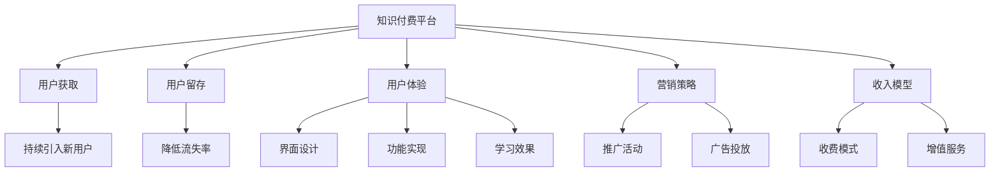

                 

# 知识付费：程序员的社群运营诀窍

> 关键词：知识付费, 程序员, 社群运营, 用户增长, 用户留存, 用户体验, 营销策略

## 1. 背景介绍

### 1.1 问题由来
随着互联网的发展和科技的进步，程序员的岗位需求逐渐增多，编程技术也在不断更新换代。但同时，自学编程的门槛也在提高，越来越多的程序员开始寻求系统化、有深度的编程学习资源。在这样的背景下，知识付费平台应运而生。

知识付费平台为程序员提供了全方位的学习资源，包括但不限于课程、图书、文章、视频、技术博客等，帮助程序员提升技能，拓宽知识面，实现职业发展。然而，如何运营这些平台，提升用户的参与度和满意度，成为知识付费平台面临的巨大挑战。

### 1.2 问题核心关键点
- **用户获取**：如何通过有效的渠道获取新用户，并持续引入潜在用户。
- **用户留存**：如何提高用户的活跃度和留存率，降低流失率。
- **用户体验**：如何优化平台界面和功能，提升用户使用体验。
- **营销策略**：如何制定有效的营销方案，提高平台知名度和影响力。
- **收入模型**：如何构建稳定的收入模型，保证平台的可持续运营。

### 1.3 问题研究意义
- 了解知识付费平台的运营核心，为平台管理者提供参考。
- 分析用户行为和需求，优化平台产品，提升用户满意度。
- 借鉴优秀平台的经验，制定科学的运营策略，实现用户增长和收入提升。

## 2. 核心概念与联系

### 2.1 核心概念概述

为更好地理解知识付费平台的运营诀窍，本节将介绍几个密切相关的核心概念：

- **知识付费平台**：通过在线课程、文章、书籍等知识产品，为用户提供编程技能提升和问题解决的平台。
- **用户获取（User Acquisition）**：通过各种渠道吸引新用户注册并使用平台。
- **用户留存（User Retention）**：通过持续的服务和优质体验，减少用户流失率，提高用户留存率。
- **用户体验（User Experience）**：指用户在使用平台过程中的整体感受，包括界面设计、功能实现、学习效果等。
- **营销策略（Marketing Strategy）**：为平台用户推广，提升平台知名度和用户参与度的一系列策略和方案。
- **收入模型（Revenue Model）**：通过合理的产品和定价策略，保证平台稳定的收入来源和盈利模式。

这些核心概念之间的逻辑关系可以通过以下Mermaid流程图来展示：



这个流程图展示了一个知识付费平台的基本运营逻辑：

1. 知识付费平台提供系统化的学习资源。
2. 通过用户获取策略持续引入新用户。
3. 通过用户留存策略提升用户满意度，减少流失率。
4. 通过用户体验优化，提升用户使用感受。
5. 通过营销策略推广平台，扩大用户基础。
6. 通过收入模型，保证平台可持续运营。

## 3. 核心算法原理 & 具体操作步骤

### 3.1 算法原理概述

知识付费平台的运营主要依赖于以下算法原理：

- **个性化推荐算法**：根据用户的行为数据，推荐其感兴趣的内容。
- **用户行为分析算法**：分析用户的行为数据，了解用户需求和兴趣。
- **社群互动算法**：通过算法引导用户互动，形成有价值的社群。
- **营销优化算法**：通过分析用户数据，优化营销活动，提升用户参与度。
- **流失预测算法**：预测用户流失概率，提前采取措施防止流失。

### 3.2 算法步骤详解

#### 3.2.1 个性化推荐算法

个性化推荐算法基于协同过滤、内容过滤和混合过滤等技术，通过分析用户的历史行为数据和喜好，推荐最符合用户兴趣的内容。

- **协同过滤**：分析用户的行为数据，找出兴趣相似的用户，推荐其喜欢但用户未选择的资源。
- **内容过滤**：通过分析内容的属性特征，推荐与用户喜好最匹配的资源。
- **混合过滤**：结合协同过滤和内容过滤的优点，进行更精准的推荐。

#### 3.2.2 用户行为分析算法

用户行为分析算法通过日志数据和行为数据，分析用户的使用习惯和偏好。

- **用户画像建模**：构建用户行为特征模型，描述用户的基本特征和行为偏好。
- **行为序列分析**：分析用户的点击、浏览、学习等行为序列，预测用户下一步行为。
- **兴趣偏好识别**：通过用户的互动和反馈数据，识别用户的兴趣和需求。

#### 3.2.3 社群互动算法

社群互动算法通过算法引导用户参与社群讨论，形成有价值的社群。

- **话题引导**：通过算法生成热门话题和讨论点，引导用户参与讨论。
- **互动推荐**：根据用户的互动数据，推荐其感兴趣的其他用户和内容。
- **社群内容优化**：优化社群的讨论主题和结构，提升社群活跃度。

#### 3.2.4 营销优化算法

营销优化算法通过分析用户数据，优化营销活动，提升用户参与度。

- **用户细分**：将用户按照特征和行为进行细分，制定不同的营销策略。
- **精准投放**：通过精准的广告投放，提高营销效果。
- **效果评估**：评估营销活动的效果，优化投放策略。

#### 3.2.5 流失预测算法

流失预测算法通过分析用户行为数据，预测用户流失概率，提前采取措施防止流失。

- **行为监控**：监控用户的活跃度和行为数据，识别异常行为。
- **流失概率预测**：基于历史数据，预测用户流失的概率。
- **干预措施**：根据预测结果，提前采取干预措施，提升用户留存率。

### 3.3 算法优缺点

个性化推荐算法具有以下优点：

- **精准推荐**：通过分析用户行为数据，提供更精准的推荐。
- **用户参与度提升**：提高用户的使用体验和满意度。
- **内容多样化**：推荐多样化的内容，满足不同用户的需求。

同时，个性化推荐算法也存在以下缺点：

- **数据依赖**：推荐效果依赖于用户数据的质量和丰富程度。
- **算法复杂**：需要处理大量的用户数据和内容数据，算法复杂度较高。
- **用户隐私**：需要收集和分析用户的隐私数据，可能引发隐私问题。

用户行为分析算法具有以下优点：

- **用户画像精细化**：通过分析用户行为数据，构建精细化的用户画像。
- **用户需求预测**：通过行为数据预测用户需求，优化推荐内容。
- **用户行为监测**：通过行为数据监控用户行为，及时发现问题。

同时，用户行为分析算法也存在以下缺点：

- **数据噪声**：行为数据可能包含噪声，影响分析结果。
- **隐私问题**：需要收集和分析用户的隐私数据，可能引发隐私问题。
- **数据更新**：行为数据需要实时更新，数据处理难度较大。

社群互动算法具有以下优点：

- **社区活跃度提升**：通过算法引导用户互动，提升社区活跃度。
- **知识共享**：促进用户之间的知识共享和交流。
- **用户体验优化**：通过互动提升用户体验。

同时，社群互动算法也存在以下缺点：

- **算法复杂**：需要处理大量的用户互动数据，算法复杂度较高。
- **用户质量**：用户质量参差不齐，可能影响社区质量。
- **社区管理**：需要持续管理社区，防止恶意行为。

营销优化算法具有以下优点：

- **精准营销**：通过分析用户数据，实现精准营销。
- **效果显著**：提升用户参与度和留存率。
- **成本可控**：通过优化投放策略，控制营销成本。

同时，营销优化算法也存在以下缺点：

- **成本高**：需要投入大量资源进行广告投放和优化。
- **效果监测**：需要持续监测和评估营销效果，工作量大。
- **市场变化**：市场环境变化快，需要不断调整策略。

流失预测算法具有以下优点：

- **预防流失**：通过预测用户流失概率，提前采取措施防止流失。
- **用户留存率提升**：通过干预措施提升用户留存率。
- **成本节省**：减少用户流失带来的运营成本。

同时，流失预测算法也存在以下缺点：

- **数据质量要求高**：需要高质量的行为数据，数据处理难度较大。
- **预测准确性**：预测结果可能存在误差，需要不断优化模型。
- **隐私问题**：需要收集和分析用户的隐私数据，可能引发隐私问题。

### 3.4 算法应用领域

基于个性化推荐、用户行为分析、社群互动、营销优化、流失预测等算法原理，知识付费平台在多个领域得到了广泛的应用，例如：

- **课程推荐**：根据用户的学习历史和行为，推荐适合的课程和学习路径。
- **社群讨论**：通过算法引导用户参与讨论，形成有价值的社群，促进知识共享。
- **活动营销**：通过精准的广告投放和推广活动，提升用户参与度和平台知名度。
- **用户流失预测**：通过预测用户流失概率，提前采取措施防止流失，提升用户留存率。

除了上述这些经典应用外，知识付费平台还创新性地应用于更多场景中，如个性化聊天机器人、动态课程更新、用户行为监测等，为平台提供了更加精准和高效的运营支持。

## 4. 数学模型和公式 & 详细讲解 & 举例说明

### 4.1 数学模型构建

本节将使用数学语言对知识付费平台的用户行为分析和个性化推荐过程进行更加严格的刻画。

记知识付费平台的用户为 $U$，课程内容为 $C$，用户行为数据为 $B$。用户 $u \in U$ 对课程 $c \in C$ 的行为数据表示为 $b_{uc} \in B$。

用户行为分析的目标是构建用户画像 $P_u$，描述用户的基本特征和行为偏好，可以表示为：

$$
P_u = f(b_u) = \sum_{c \in C} w_{uc}b_{uc}
$$

其中 $f$ 为用户画像构建函数，$w_{uc}$ 为课程 $c$ 对用户 $u$ 的影响权重。

个性化推荐的目标是推荐用户 $u$ 最感兴趣的课程 $c$，推荐结果 $R_u$ 可以表示为：

$$
R_u = g(P_u, C) = \max_{c \in C} \lbrace f(b_u) \rbrace
$$

其中 $g$ 为个性化推荐函数。

### 4.2 公式推导过程

以下我们以协同过滤算法为例，推导推荐结果的计算公式。

假设用户 $u$ 和课程 $c$ 的行为数据为 $b_{uc} = (r_{uc}, c_{uc})$，其中 $r_{uc}$ 为行为值，$c_{uc}$ 为行为类型（如浏览、购买、评分等）。

协同过滤算法的基本思想是找到与用户 $u$ 兴趣相似的用户 $v$，根据 $v$ 对课程的评分预测 $u$ 对课程的评分。设 $N(u)$ 为与用户 $u$ 兴趣相似的用户集合，$W$ 为相似度权重矩阵，则协同过滤算法的推荐结果为：

$$
R_u = \sum_{v \in N(u)} \frac{W_{uv}}{\sum_{v' \in N(u)} W_{uv'}} b_{vc}
$$

其中 $W_{uv}$ 表示用户 $u$ 和用户 $v$ 之间的相似度。

在实际应用中，相似度 $W_{uv}$ 可以通过余弦相似度、皮尔逊相关系数等方法计算，具体公式推导如下：

- **余弦相似度**：

$$
W_{uv} = \frac{\sum_{c \in C} b_{uc} \cdot b_{vc}}{\sqrt{\sum_{c \in C} b_{uc}^2} \cdot \sqrt{\sum_{c \in C} b_{vc}^2}}
$$

- **皮尔逊相关系数**：

$$
W_{uv} = \frac{\sum_{c \in C} b_{uc} \cdot b_{vc} - \bar{b}_u \cdot \bar{b}_v}{\sqrt{\sum_{c \in C} b_{uc}^2 - \bar{b}_u^2} \cdot \sqrt{\sum_{c \in C} b_{vc}^2 - \bar{b}_v^2}}
$$

其中 $\bar{b}_u$ 和 $\bar{b}_v$ 分别为用户 $u$ 和用户 $v$ 的平均行为值。

### 4.3 案例分析与讲解

假设某知识付费平台拥有两个用户 $u_1$ 和 $u_2$，以及三个课程 $c_1$、$c_2$、$c_3$。用户 $u_1$ 对课程 $c_1$ 和 $c_2$ 的评分分别为 4 和 3，对课程 $c_3$ 未评分；用户 $u_2$ 对课程 $c_2$ 的评分和 $u_1$ 相同，对课程 $c_1$ 的评分为 5，对课程 $c_3$ 未评分。

基于上述数据，计算 $u_1$ 和 $u_2$ 之间的余弦相似度：

$$
W_{u_1u_2} = \frac{4 \cdot 5 + 3 \cdot 3}{\sqrt{4^2 + 3^2} \cdot \sqrt{5^2 + 3^2}} = \frac{35}{\sqrt{25 + 9} \cdot \sqrt{25 + 9}} = \frac{35}{10 \cdot 10} = 0.35
$$

然后根据相似度权重矩阵 $W$ 和用户行为数据 $b$，计算 $u_1$ 和 $u_2$ 对课程 $c_3$ 的协同过滤推荐结果：

$$
R_{u_1} = \frac{0.35 \cdot b_{u_1c_3}}{0.35 + 1} b_{u_2c_3} = 0.35 \cdot b_{u_1c_3} = 0.35 \cdot 0 = 0
$$

$$
R_{u_2} = \frac{0.35 \cdot b_{u_2c_3}}{0.35 + 1} b_{u_1c_3} = 0.35 \cdot b_{u_2c_3} = 0.35 \cdot 0 = 0
$$

因此，根据协同过滤算法，用户 $u_1$ 和 $u_2$ 都未推荐课程 $c_3$。

## 5. 项目实践：代码实例和详细解释说明

### 5.1 开发环境搭建

在进行个性化推荐实践前，我们需要准备好开发环境。以下是使用Python进行Spark的开发环境配置流程：

1. 安装Anaconda：从官网下载并安装Anaconda，用于创建独立的Python环境。

2. 创建并激活虚拟环境：
```bash
conda create -n spark-env python=3.8 
conda activate spark-env
```

3. 安装Spark：根据系统架构，从官网获取对应的安装命令。例如：
```bash
conda install pytorch torchvision torchaudio cudatoolkit=11.1 -c pytorch -c conda-forge
```

4. 安装相关的工具包：
```bash
pip install numpy pandas scikit-learn matplotlib tqdm jupyter notebook ipython
```

完成上述步骤后，即可在`spark-env`环境中开始开发。

### 5.2 源代码详细实现

这里我们以Spark的协同过滤算法为例，给出实现代码。

```python
from pyspark.sql import SparkSession
from pyspark.ml.evaluation import RegressionEvaluator
from pyspark.ml.recommendation import ALS

# 初始化Spark环境
spark = SparkSession.builder.appName('Collaborative Filtering').getOrCreate()

# 加载数据
data = spark.read.csv('data.csv', header=True, inferSchema=True)

# 定义协同过滤模型
model = ALS(numFactors=10, iterations=10, userCol='user_id', itemCol='item_id', ratingCol='rating')

# 训练模型
model.fit(data)

# 使用模型进行推荐
predictions = model.transform(data)

# 评估模型效果
evaluator = RegressionEvaluator(predictionCol='prediction', labelCol='rating', metricName='rmse')
rmse = evaluator.evaluate(predictions)
print("Root Mean Squared Error: ", rmse)

# 输出推荐结果
predictions.select('user_id', 'item_id', 'prediction').show()
```

### 5.3 代码解读与分析

让我们再详细解读一下关键代码的实现细节：

**数据加载**：
- 使用`spark.read.csv`方法加载用户行为数据，指定列名和数据类型。
- 使用`header=True`和`inferSchema=True`参数自动解析数据。

**模型定义**：
- 定义协同过滤模型，使用`ALS`类，并指定参数`numFactors`为因子数量，`iterations`为迭代次数。
- 使用`userCol`、`itemCol`、`ratingCol`参数指定数据列名。

**模型训练**：
- 使用`model.fit`方法训练模型，传入训练数据。
- 使用`evaluator`评估模型效果，计算RMSE（均方根误差）。

**模型推荐**：
- 使用训练好的模型进行推荐，生成预测结果。
- 使用`predictions.select`方法选择输出列。

**推荐结果输出**：
- 使用`predictions.show()`方法输出推荐结果。

可以看到，Spark提供了完整的协同过滤算法实现，开发者只需填写数据和模型参数即可快速进行推荐。

## 6. 实际应用场景

### 6.1 智能客服系统

知识付费平台的智能客服系统可以与传统的客服系统相结合，为用户提供更高效、更个性化的服务体验。智能客服系统通过知识付费平台的用户行为数据和课程评分数据，为用户推荐最合适的课程和学习路径，解答用户的疑问，提升用户满意度。

在技术实现上，可以收集用户的搜索记录、浏览历史、学习记录等行为数据，使用协同过滤算法、用户行为分析算法等技术，为用户推荐适合的课程和学习路径。同时，智能客服系统可以接入知识库、专家库等外部资源，提升推荐的准确性和个性化程度。

### 6.2 企业培训系统

知识付费平台可以帮助企业构建培训系统，提升员工的技能和知识水平。企业可以根据员工的岗位需求，为用户推荐适合的培训课程和学习资源，通过考核评价员工的学习效果，并记录员工的学习行为数据，为后续培训提供依据。

在技术实现上，可以使用知识付费平台的用户行为数据和课程评分数据，为用户推荐适合的培训课程和学习路径。同时，知识付费平台还可以集成考试系统、证书颁发系统等，提升培训效果和员工满意度。

### 6.3 学习社区平台

知识付费平台可以构建学习社区平台，促进用户之间的知识共享和交流。用户可以在社区中发布学习心得、分享课程资源，与其他用户交流讨论，提升学习效果和社区活跃度。

在技术实现上，可以使用社群互动算法，引导用户参与讨论，形成有价值的社群。同时，知识付费平台还可以接入专家系统、知识图谱等外部资源，提升社群互动的质量和深度。

### 6.4 未来应用展望

随着知识付费平台的不断发展和完善，未来的应用场景将更加丰富，以下是几个未来应用展望：

- **个性化聊天机器人**：结合自然语言处理技术和知识付费平台的用户行为数据，构建个性化的聊天机器人，为用户提供实时答疑和推荐。
- **动态课程更新**：根据用户的反馈和学习效果，动态更新课程内容和结构，提升课程质量和用户体验。
- **用户行为监测**：通过行为数据分析，监测用户的学习效果和行为特征，及时发现问题并进行干预。
- **知识图谱构建**：结合知识图谱技术和知识付费平台的课程数据，构建完整的知识图谱，为用户提供更加全面和准确的知识服务。

## 7. 工具和资源推荐
### 7.1 学习资源推荐

为了帮助开发者系统掌握知识付费平台的运营诀窍，这里推荐一些优质的学习资源：

1. **《自然语言处理入门》系列博文**：由知识付费平台技术专家撰写，深入浅出地介绍了自然语言处理技术的基本概念和应用方法。

2. **CS223N《推荐系统》课程**：斯坦福大学开设的推荐系统课程，详细讲解了推荐系统的算法原理和实现方法。

3. **《推荐系统实践》书籍**：推荐系统领域的经典书籍，介绍了推荐系统的各种算法和技术实现，涵盖个性化推荐、协同过滤、用户行为分析等。

4. **Coursera《推荐系统》课程**：由斯坦福大学和Kaggle联合开发的推荐系统课程，讲解了推荐系统的理论基础和实践应用。

5. **Kaggle竞赛平台**：参加推荐系统竞赛，通过实际项目积累经验，提升算法设计和工程实践能力。

通过对这些资源的学习实践，相信你一定能够快速掌握知识付费平台的运营诀窍，并用于解决实际的运营问题。

### 7.2 开发工具推荐

高效的开发离不开优秀的工具支持。以下是几款用于知识付费平台运营的常用工具：

1. **Spark**：Apache提供的开源大数据处理平台，适合大规模数据处理和推荐系统开发。

2. **Scikit-learn**：Python数据科学库，提供了丰富的机器学习和数据挖掘算法。

3. **TensorFlow**：Google开源的深度学习框架，支持分布式计算和模型优化。

4. **Jupyter Notebook**：Python的交互式开发环境，支持代码、数据分析、可视化等多种功能。

5. **PySpark**：Python API for Spark，提供了与Spark相兼容的接口，便于Python开发者使用。

6. **Hadoop**：Apache开源的大数据处理平台，支持大规模数据存储和处理。

合理利用这些工具，可以显著提升知识付费平台的运营效率和开发效率，加速创新迭代的步伐。

### 7.3 相关论文推荐

知识付费平台的运营涉及多个领域的知识，以下是几篇相关的经典论文，推荐阅读：

1. **《协同过滤推荐算法》**：推荐系统领域的经典论文，详细讲解了协同过滤算法的原理和实现方法。

2. **《用户行为分析模型》**：介绍了用户行为分析模型的基本概念和应用方法，涵盖了用户画像建模、行为序列分析、兴趣偏好识别等技术。

3. **《个性化推荐系统》**：推荐系统领域的经典书籍，介绍了个性化推荐系统的各种算法和技术实现，涵盖协同过滤、内容过滤、混合过滤等。

4. **《深度学习在推荐系统中的应用》**：介绍了深度学习在推荐系统中的应用，包括基于深度学习的协同过滤算法、用户行为分析算法等。

5. **《智能客服系统的研究》**：介绍了智能客服系统的基本概念和实现方法，涵盖了自然语言处理、知识图谱、智能推荐等技术。

这些论文代表了大数据、推荐系统、自然语言处理等领域的前沿研究，通过学习这些成果，可以帮助研究者把握学科前进方向，激发更多的创新灵感。

## 8. 总结：未来发展趋势与挑战

### 8.1 总结

本文对知识付费平台的运营诀窍进行了全面系统的介绍。首先阐述了知识付费平台的背景和运营核心，明确了用户获取、用户留存、用户体验、营销策略、收入模型等关键环节的重要性。其次，从原理到实践，详细讲解了个性化推荐、用户行为分析、社群互动、营销优化、流失预测等算法的核心原理和具体操作步骤。同时，本文还广泛探讨了知识付费平台在智能客服、企业培训、学习社区等多个行业领域的应用前景，展示了知识付费平台的发展潜力。此外，本文精选了知识付费平台的各类学习资源，力求为读者提供全方位的技术指引。

通过本文的系统梳理，可以看到，知识付费平台的运营核心在于通过算法和技术手段，提升用户的使用体验和满意度，从而实现用户的增长和留存。这需要从数据、模型、算法、工程、业务等多个维度协同发力，不断迭代和优化，才能实现平台的可持续发展。

### 8.2 未来发展趋势

展望未来，知识付费平台的运营将呈现以下几个发展趋势：

1. **个性化推荐技术发展**：随着推荐算法和算力水平的提升，推荐系统将更加精准和高效，为用户提供更加个性化的学习资源。
2. **用户行为分析深入**：通过更深入的用户行为分析，了解用户的学习需求和兴趣，提供更精准的推荐和定制化服务。
3. **社区互动加强**：通过更丰富的社区互动算法，提升社区活跃度和用户参与度，形成更加有价值的知识共享平台。
4. **营销策略多样化**：结合大数据分析和技术手段，制定更多样化的营销策略，提升平台的知名度和用户参与度。
5. **收入模型多元化**：通过订阅、课程付费、广告等多元化收入模型，保证平台的可持续运营。

以上趋势凸显了知识付费平台运营的核心要点，需要通过不断创新和优化，提升平台的竞争力。

### 8.3 面临的挑战

尽管知识付费平台已经取得了显著的发展，但在迈向更加智能化、普适化应用的过程中，它仍面临着诸多挑战：

1. **数据质量问题**：推荐算法和用户行为分析依赖于高质量的数据，数据质量差可能导致推荐效果不佳。
2. **算法复杂度**：推荐算法和社区互动算法需要处理大量的数据和计算资源，算法复杂度较高。
3. **用户隐私问题**：推荐算法和用户行为分析需要收集和分析用户的隐私数据，可能引发隐私问题。
4. **模型鲁棒性**：推荐算法和用户行为分析需要具备一定的鲁棒性，以应对数据异常和噪声。
5. **成本控制**：推荐系统和社区互动系统的建设和维护需要投入大量资源，成本较高。
6. **用户满意度**：如何提高用户的满意度和留存率，保持用户对平台的持续参与，仍是运营的核心难题。

### 8.4 研究展望

面对知识付费平台运营所面临的挑战，未来的研究需要在以下几个方面寻求新的突破：

1. **数据质量提升**：通过数据清洗和预处理技术，提升数据质量，减少噪声和异常数据。
2. **算法优化**：研究和优化推荐算法和用户行为分析算法，提高算法的效率和准确性。
3. **隐私保护**：研究隐私保护技术，确保用户数据的隐私安全。
4. **鲁棒性增强**：研究和优化推荐算法和用户行为分析算法的鲁棒性，应对数据异常和噪声。
5. **成本控制**：研究和优化推荐系统和社区互动系统的建设和维护成本，提升运营效率。
6. **用户体验优化**：通过优化平台界面和功能，提升用户的使用体验和满意度。

这些研究方向的探索，必将引领知识付费平台运营技术的不断进步，为用户提供更加智能、高效、安全的知识服务。

## 9. 附录：常见问题与解答

**Q1：知识付费平台的用户行为分析算法是如何构建的？**

A: 知识付费平台的用户行为分析算法主要通过以下几个步骤构建：

1. **数据收集**：收集用户的行为数据，包括浏览记录、学习记录、评价记录等。
2. **数据清洗**：对收集到的数据进行清洗和预处理，去除异常数据和噪声。
3. **特征提取**：从清洗后的数据中提取用户的行为特征，如浏览时长、学习频率、评价评分等。
4. **用户画像建模**：使用机器学习算法，如协同过滤、内容过滤、混合过滤等，构建用户画像，描述用户的基本特征和行为偏好。
5. **行为序列分析**：分析用户的行为序列，预测用户下一步行为。
6. **兴趣偏好识别**：通过用户的互动和反馈数据，识别用户的兴趣和需求。

**Q2：知识付费平台的个性化推荐算法是如何实现的？**

A: 知识付费平台的个性化推荐算法主要通过以下几个步骤实现：

1. **数据收集**：收集用户的行为数据，包括浏览记录、学习记录、评价记录等。
2. **数据清洗**：对收集到的数据进行清洗和预处理，去除异常数据和噪声。
3. **特征提取**：从清洗后的数据中提取用户的行为特征，如浏览时长、学习频率、评价评分等。
4. **协同过滤**：使用协同过滤算法，根据用户的兴趣相似度，推荐其他用户喜欢的内容。
5. **内容过滤**：使用内容过滤算法，根据内容的属性特征，推荐用户感兴趣的内容。
6. **混合过滤**：结合协同过滤和内容过滤的优点，进行更精准的推荐。

**Q3：知识付费平台的社群互动算法是如何实现的？**

A: 知识付费平台的社群互动算法主要通过以下几个步骤实现：

1. **数据收集**：收集用户在社区中的互动数据，包括评论、点赞、分享等。
2. **数据清洗**：对收集到的数据进行清洗和预处理，去除异常数据和噪声。
3. **特征提取**：从清洗后的数据中提取用户的互动特征，如评论质量、点赞次数、分享频率等。
4. **话题引导**：使用算法生成热门话题和讨论点，引导用户参与讨论。
5. **互动推荐**：根据用户的互动数据，推荐其感兴趣的其他用户和内容。
6. **社群内容优化**：优化社群的讨论主题和结构，提升社群活跃度。

**Q4：知识付费平台的营销优化算法是如何实现的？**

A: 知识付费平台的营销优化算法主要通过以下几个步骤实现：

1. **数据收集**：收集用户在平台上的行为数据，包括浏览记录、学习记录、评价记录等。
2. **数据清洗**：对收集到的数据进行清洗和预处理，去除异常数据和噪声。
3. **用户细分**：将用户按照特征和行为进行细分，制定不同的营销策略。
4. **精准投放**：通过精准的广告投放，提高营销效果。
5. **效果评估**：评估营销活动的效果，优化投放策略。

**Q5：知识付费平台的流失预测算法是如何实现的？**

A: 知识付费平台的流失预测算法主要通过以下几个步骤实现：

1. **数据收集**：收集用户在平台上的行为数据，包括浏览记录、学习记录、评价记录等。
2. **数据清洗**：对收集到的数据进行清洗和预处理，去除异常数据和噪声。
3. **行为监控**：监控用户的活跃度和行为数据，识别异常行为。
4. **流失概率预测**：基于历史数据，预测用户流失的概率。
5. **干预措施**：根据预测结果，提前采取干预措施，提升用户留存率。

**Q6：知识付费平台的收入模型是如何构建的？**

A: 知识付费平台的收入模型主要通过以下几个步骤构建：

1. **课程收费**：将平台上的课程设置为付费课程，用户需支付费用才能观看。
2. **会员订阅**：提供会员订阅服务，用户可以按月或按年支付费用，享受平台的优质服务。
3. **广告收入**：与广告商合作，在平台上展示广告，获取广告收入。
4. **课程更新**：定期更新课程内容，吸引用户续费。
5. **增值服务**：提供课程、资料、咨询等增值服务，增加用户黏性。

通过以上步骤，知识付费平台可以构建稳定的收入模型，实现平台的可持续运营。

---

作者：禅与计算机程序设计艺术 / Zen and the Art of Computer Programming

