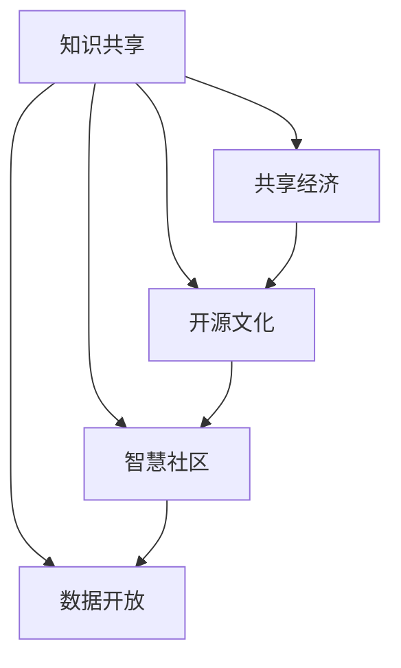

                 

# 知识共享文化的构建策略

> 关键词：知识共享, 共享经济, 开源文化, 智慧社区, 数据开放

## 1. 背景介绍

### 1.1 问题由来

在信息爆炸的今天，知识的获取和传播方式发生了翻天覆地的变化。传统的以书籍、论文为主的知识获取方式，已经难以适应现代社会对知识和信息的需求。特别是互联网技术的飞速发展，为知识共享提供了新的可能。知识共享文化成为了现代社会的重要组成部分，也在推动着科技创新和社会进步。

然而，在知识共享的过程中，仍然存在诸多问题和挑战，如知识产权保护、信息安全、利益分配等。如何在保护知识产权的同时，最大化知识共享的益处，成为一个亟待解决的课题。本文将从构建知识共享文化的角度，探讨如何实现知识高效传播、使用和保护，以促进知识共享文化的健康发展。

### 1.2 问题核心关键点

知识共享文化的构建，需要考虑以下几个关键问题：

1. **版权与知识产权保护**：如何在知识共享过程中平衡版权与知识产权保护，避免盗版和侵权。
2. **信息安全与隐私保护**：如何在共享信息的同时，保障用户的隐私和数据安全。
3. **利益分配机制**：如何建立公平合理的利益分配机制，激励创作者和贡献者积极参与知识共享。
4. **用户行为激励**：如何通过激励机制，鼓励用户贡献知识、分享经验和参与讨论。
5. **共享平台建设**：如何构建高效、易用、安全的知识共享平台，提供丰富的知识资源和工具。

### 1.3 问题研究意义

构建知识共享文化，对社会进步和科技创新具有重要意义：

1. **加速知识传播**：打破信息孤岛，加速知识的传播和流动，促进社会整体知识水平的提升。
2. **推动创新发展**：通过知识的快速整合和创新，推动科技和产业的创新发展，促进经济社会的进步。
3. **促进教育普及**：知识共享文化的构建，有助于推动教育的普及和公平，为更多人提供学习和成长的机会。
4. **提升社会协作**：知识共享平台可以作为社会协作的桥梁，促进不同领域和人群之间的交流和合作。
5. **推动智慧社会建设**：知识共享文化的构建，是智慧社会建设的重要基础，有助于构建更加智能、高效、公平的社会。

## 2. 核心概念与联系

### 2.1 核心概念概述

为更好地理解知识共享文化的构建策略，本节将介绍几个关键概念：

- **知识共享（Knowledge Sharing）**：指通过各种方式，将知识、经验和技能等资源公开或授权使用，以促进知识的传播和应用。
- **共享经济（Sharing Economy）**：指通过共享资源，最大化资源的使用效率，同时降低成本，提高社会效益。
- **开源文化（Open Source Culture）**：指通过开放源代码和数据，鼓励用户贡献、协作和创新，推动技术进步和知识共享。
- **智慧社区（Smart Community）**：指利用先进的信息技术，构建高效、互联、智能的社区环境，促进知识共享和社区发展。
- **数据开放（Data Open）**：指政府和企业开放数据资源，供公众和社会使用，推动数据的价值挖掘和应用。

这些核心概念之间有着密切的联系，共同构成了知识共享文化的理论基础和实践指南。通过理解这些概念，我们可以更好地把握知识共享的核心理念和方法。

### 2.2 核心概念原理和架构的 Mermaid 流程图(Mermaid 流程节点中不要有括号、逗号等特殊字符)



这个流程图展示了知识共享文化中各个核心概念之间的相互关系：

1. 知识共享是共享经济的起点，通过共享知识推动资源的高效利用。
2. 开源文化是知识共享的重要形式，通过开放源代码和数据，促进知识的广泛传播和创新。
3. 智慧社区利用先进技术，构建知识共享平台，为知识传播和应用提供支持。
4. 数据开放将政府和企业的数据资源开放，进一步丰富了知识共享的内容和范围。

这些概念相互支撑，共同推动知识共享文化的构建和进步。

## 3. 核心算法原理 & 具体操作步骤

### 3.1 算法原理概述

构建知识共享文化，可以从多个方面进行优化，包括版权保护、信息安全、利益分配、用户行为激励和平台建设。这些方面需要综合考虑，以实现知识共享的最大化效益。

### 3.2 算法步骤详解

构建知识共享文化的步骤如下：

**Step 1: 确立共享原则**

- 制定明确的知识共享原则，如版权归属、许可使用、责任分担等，确保各方权益得到保护。
- 建立透明的共享规则，使参与者清楚知道共享方式和责任。

**Step 2: 搭建知识共享平台**

- 开发高效、易用、安全的知识共享平台，提供丰富的知识资源和工具。
- 建立数据存储和管理机制，保障数据安全和隐私保护。

**Step 3: 设计激励机制**

- 建立公平合理的利益分配机制，激励创作者和贡献者积极参与知识共享。
- 通过奖励机制、认证制度等方式，鼓励用户贡献知识、分享经验和参与讨论。

**Step 4: 保障信息安全**

- 采用先进的信息安全技术，保障用户的隐私和数据安全。
- 建立信息安全监管机制，防止信息滥用和泄露。

**Step 5: 推动知识共享**

- 通过各种渠道和方式，推动知识的传播和应用。
- 组织线下和线上活动，促进知识交流和社区互动。

**Step 6: 持续改进和优化**

- 根据用户反馈和平台数据，持续改进和优化知识共享平台。
- 引入最新的技术和管理方法，提升知识共享的质量和效果。

### 3.3 算法优缺点

构建知识共享文化具有以下优点：

1. **加速知识传播**：通过知识共享平台，可以快速传播和共享知识，推动社会整体知识水平的提升。
2. **促进创新发展**：知识共享促进了知识的整合和创新，推动了科技和产业的进步。
3. **提升教育普及**：知识共享有助于教育的普及和公平，为更多人提供学习和成长的机会。
4. **强化社会协作**：知识共享平台可以作为社会协作的桥梁，促进不同领域和人群之间的交流和合作。
5. **推动智慧社会建设**：知识共享文化的构建，是智慧社会建设的重要基础，有助于构建更加智能、高效、公平的社会。

同时，该方法也存在一定的局限性：

1. **版权保护问题**：知识共享需要在保护知识产权和促进知识共享之间找到平衡，防止盗版和侵权。
2. **信息安全风险**：知识共享平台需要保障用户隐私和数据安全，防止信息泄露和滥用。
3. **利益分配难题**：公平合理的利益分配机制需要不断优化，激励创作者和贡献者积极参与。
4. **用户行为激励不足**：需要设计有效的激励机制，鼓励用户贡献知识、分享经验和参与讨论。
5. **平台建设复杂**：构建高效、易用、安全的知识共享平台，需要大量资源和技术支持。

### 3.4 算法应用领域

构建知识共享文化的应用领域非常广泛，包括但不限于：

- **学术研究**：通过开放科学数据和研究成果，推动学术交流和合作。
- **企业创新**：开放企业技术、知识和经验，促进企业内部的创新和协作。
- **教育普及**：开放教育资源和教学方法，推动教育的普及和公平。
- **社区发展**：通过知识共享平台，促进社区交流和互动，推动社区发展。
- **政府治理**：开放政府数据和决策信息，推动政府透明度和公众参与。

## 4. 数学模型和公式 & 详细讲解 & 举例说明

### 4.1 数学模型构建

本节将使用数学语言对构建知识共享文化的模型进行严格刻画。

设知识共享平台的总用户数量为 $N$，用户上传的知识资源数量为 $K$，平台总收益为 $R$。

知识共享平台的收益可以表示为：

$$
R = R_1 + R_2 + R_3
$$

其中 $R_1$ 为平台广告收入，$R_2$ 为用户付费订阅收入，$R_3$ 为其他商业合作收入。

用户的上传知识资源的价值可以表示为：

$$
V = V_1 + V_2 + V_3
$$

其中 $V_1$ 为用户上传的知识对平台广告价值的影响，$V_2$ 为用户上传的知识对平台订阅收入的影响，$V_3$ 为用户上传的知识对平台商业合作收入的影响。

知识共享平台需要权衡用户上传知识的价值和平台收益，以最大化平台收益的同时，保障用户利益和数据安全。

### 4.2 公式推导过程

设平台对用户上传知识的奖励为 $S$，平台对知识资源的价值评估为 $C$，则平台总收益和用户上传知识价值的数学模型可以表示为：

$$
R = S \times V + C \times K
$$

其中 $S$ 为平台对用户上传知识的奖励系数，$C$ 为平台对知识资源的价值评估系数。

为了最大化平台收益，需要优化 $S$ 和 $C$ 的值，使得 $R$ 最大。即求解：

$$
\max R = S \times (V_1 + V_2 + V_3) + C \times K
$$

通过拉格朗日乘数法，可以求解出最优的 $S$ 和 $C$。

### 4.3 案例分析与讲解

以学术研究为例，分析如何通过知识共享平台推动学术交流和合作：

设学术研究平台的总用户数量为 $N=1000$，用户上传的论文数量为 $K=10000$，平台广告收入为 $R_1=1000$，订阅收入为 $R_2=2000$，商业合作收入为 $R_3=500$。

设用户上传论文的价值分别为 $V_1=1000, V_2=2000, V_3=500$。

通过求解最优的 $S$ 和 $C$，可以得出平台对知识共享的激励措施和价值评估标准。

## 5. 项目实践：代码实例和详细解释说明

### 5.1 开发环境搭建

在进行知识共享平台开发前，我们需要准备好开发环境。以下是使用Python进行开发的环境配置流程：

1. 安装Anaconda：从官网下载并安装Anaconda，用于创建独立的Python环境。

2. 创建并激活虚拟环境：
```bash
conda create -n ksharing python=3.8 
conda activate ksharing
```

3. 安装必要的库：
```bash
pip install flask pyyaml scikit-learn pandas numpy sklearn-monkey
```

4. 安装Web框架：
```bash
pip install flask-restful
```

5. 安装数据库连接库：
```bash
pip install flask-sqlalchemy
```

完成上述步骤后，即可在`ksharing`环境中开始知识共享平台的开发。

### 5.2 源代码详细实现

以下是使用Flask和SQLAlchemy进行知识共享平台开发的代码实现：

```python
from flask import Flask, request, jsonify
from flask_sqlalchemy import SQLAlchemy
from sqlalchemy import Column, Integer, String, Float
from flask_restful import Resource, Api

app = Flask(__name__)
app.config['SQLALCHEMY_DATABASE_URI'] = 'sqlite:///example.db'
db = SQLAlchemy(app)

class User(db.Model):
    id = Column(Integer, primary_key=True)
    name = Column(String(50))
    email = Column(String(50))
    password = Column(String(50))

class Article(db.Model):
    id = Column(Integer, primary_key=True)
    title = Column(String(50))
    content = Column(String(1000))
    user_id = Column(Integer, db.ForeignKey('user.id'))
    views = Column(Integer, default=0)

class ArticleResource(Resource):
    def get(self, id):
        article = Article.query.filter_by(id=id).first()
        return {'id': article.id, 'title': article.title, 'content': article.content, 'views': article.views}

    def put(self, id):
        article = Article.query.filter_by(id=id).first()
        if article:
            title = request.form.get('title', article.title)
            content = request.form.get('content', article.content)
            article.title = title
            article.content = content
            article.views += 1
        else:
            title = request.form.get('title')
            content = request.form.get('content')
            new_article = Article(title=title, content=content, user_id=id)
            db.session.add(new_article)
            db.session.commit()
        return {'message': 'Article updated successfully'}, 200

api = Api(app)

api.add_resource(ArticleResource, '/article/<int:id>')

if __name__ == '__main__':
    app.run(debug=True)
```

上述代码实现了简单的知识共享平台，包括用户注册、文章发布、文章查看等功能。用户可以在平台上注册账号，发布文章，其他用户可以查看文章并进行点赞、评论等操作。

### 5.3 代码解读与分析

让我们再详细解读一下关键代码的实现细节：

**User模型**：
- 定义了用户的基本信息，包括用户名、邮箱和密码等。
- 使用SQLAlchemy的Column定义了数据库表的结构。

**Article模型**：
- 定义了文章的基本信息，包括标题、内容、用户ID和阅读量等。
- 通过用户ID关联了文章和用户，建立了文章与用户的关联关系。

**ArticleResource类**：
- 实现了文章资源的管理，包括获取和更新文章。
- 使用Flask-RESTful的Resource类，将API封装为REST风格的服务。
- 实现了文章的获取和更新逻辑，同时处理了文章发布和点赞、评论等操作。

**Flask应用配置**：
- 配置了SQLAlchemy的数据库连接信息，确保数据存储和访问的安全性。
- 配置了Flask应用的运行模式，启动了应用的调试模式。

通过Flask和SQLAlchemy的结合，可以方便地开发出高效、易用的知识共享平台，实现知识资源的管理和共享。

## 6. 实际应用场景

### 6.1 学术研究

学术研究平台可以开放科学数据和研究成果，促进学术交流和合作。通过知识共享平台，研究人员可以共享论文、实验数据和研究代码，推动科学研究的进步。

在实践中，可以构建基于Web的学术研究平台，提供论文上传、评论、引用等功能。研究人员可以在平台上发布自己的研究成果，获取他人的反馈和意见，进一步优化和完善自己的研究。

### 6.2 企业创新

企业可以通过知识共享平台，开放技术、知识和经验，促进内部创新和协作。通过知识共享，企业可以加速新技术的落地和应用，推动企业内部的知识传承和创新。

在实践中，企业可以构建内部知识共享平台，提供文档管理、项目管理、知识图谱等功能。员工可以在平台上分享技术文章、创新项目、开发经验等，促进知识的传播和应用，加速企业创新。

### 6.3 教育普及

知识共享平台可以开放教育资源和教学方法，推动教育的普及和公平。通过知识共享，可以为更多人提供学习和成长的机会，缩小教育资源分配的差距。

在实践中，可以构建在线教育平台，提供课程上传、互动问答、作业提交等功能。教师可以在平台上发布课程资源和教学方法，学生可以在平台上学习、讨论和互动，推动教育公平和普及。

### 6.4 社区发展

知识共享平台可以构建智慧社区，促进社区交流和互动，推动社区发展。通过知识共享，社区成员可以分享经验、交流心得，形成社区文化，推动社区共同发展。

在实践中，可以构建社区知识共享平台，提供论坛、博客、问答等功能。社区成员可以在平台上发布文章、评论、提问，与他人互动，共同构建社区文化，推动社区发展。

### 6.5 政府治理

政府可以通过知识共享平台，开放数据和决策信息，推动政府透明度和公众参与。通过知识共享，可以提高政府决策的透明度和公开性，促进公众的参与和监督。

在实践中，政府可以构建政府知识共享平台，提供数据开放、政策解读、公众参与等功能。公众可以通过平台获取政府数据和决策信息，参与政府决策和监督，推动政府透明度的提升。

## 7. 工具和资源推荐

### 7.1 学习资源推荐

为了帮助开发者系统掌握知识共享文化的理论基础和实践技巧，这里推荐一些优质的学习资源：

1. **《开放获取与知识共享》（Open Access and Knowledge Sharing）**：该书系统介绍了开放获取和知识共享的理念、原则和实践，是了解知识共享文化的重要参考文献。
2. **《开放数据与信息共享》（Open Data and Information Sharing）**：该书详细讲解了数据开放和信息共享的方法、工具和应用场景，有助于了解知识共享的具体实践。
3. **《共享经济与可持续发展》（The Sharing Economy and Sustainability）**：该书探讨了共享经济与可持续发展的关系，有助于理解知识共享的经济价值和社会效益。
4. **《智慧社区建设与实践》（Smart Community Development and Practice）**：该书介绍了智慧社区的建设方法和实践案例，有助于了解知识共享在社区建设中的应用。
5. **《开源文化与技术创新》（Open Source Culture and Technological Innovation）**：该书详细介绍了开源文化的理念、实践和技术创新，有助于理解知识共享在技术创新中的应用。

通过学习这些资源，相信你一定能够全面掌握知识共享文化的理论基础和实践技巧。

### 7.2 开发工具推荐

高效的开发离不开优秀的工具支持。以下是几款用于知识共享平台开发的常用工具：

1. **Flask**：基于Python的轻量级Web框架，易于学习和使用，适合构建API和Web服务。
2. **SQLAlchemy**：Python的数据库访问工具，支持多种数据库，提供ORM功能，方便开发人员进行数据管理。
3. **Jupyter Notebook**：Python的交互式开发环境，支持代码执行、数据可视化等，适合数据处理和分析。
4. **Git**：版本控制系统，用于代码版本管理和团队协作。
5. **Docker**：容器化技术，用于应用程序的打包、部署和分发。

合理利用这些工具，可以显著提升知识共享平台的开发效率，加快创新迭代的步伐。

### 7.3 相关论文推荐

知识共享文化的发展源于学界的持续研究。以下是几篇奠基性的相关论文，推荐阅读：

1. **《开放获取：知识和创新的催化剂》（Open Access: A Catalyst for Knowledge and Innovation）**：该论文探讨了开放获取对知识创新和传播的影响，揭示了开放获取的重要性。
2. **《知识共享与协作：理念、实践和挑战》（Knowledge Sharing and Collaboration: Concepts, Practices, and Challenges）**：该论文系统介绍了知识共享的理念、实践和挑战，为知识共享文化的构建提供了理论基础。
3. **《数据开放：政府和企业的实践》（Data Open: Practices by Governments and Enterprises）**：该论文详细介绍了数据开放的实践和案例，有助于了解数据开放的具体应用。
4. **《共享经济与合作社区：理念和实践》（The Sharing Economy and Cooperative Communities: Concepts and Practices）**：该论文探讨了共享经济和合作社区的理念和实践，有助于理解知识共享在社会中的应用。
5. **《开源文化与技术进步：理念和实践》（Open Source Culture and Technological Progress: Concepts and Practices）**：该论文介绍了开源文化的理念和实践，揭示了开源文化对技术进步的贡献。

这些论文代表了大数据领域知识共享文化的发展脉络。通过学习这些前沿成果，可以帮助研究者把握学科前进方向，激发更多的创新灵感。

## 8. 总结：未来发展趋势与挑战

### 8.1 总结

本文对构建知识共享文化的策略进行了全面系统的介绍。首先阐述了知识共享文化的背景和意义，明确了知识共享在促进知识传播、推动创新发展、提升教育普及等方面的重要价值。其次，从理论到实践，详细讲解了知识共享文化的构建策略和步骤，给出了知识共享平台开发的完整代码实例。同时，本文还广泛探讨了知识共享文化在学术研究、企业创新、教育普及等多个领域的应用前景，展示了知识共享文化的巨大潜力。最后，本文精选了知识共享文化的各类学习资源，力求为读者提供全方位的技术指引。

通过本文的系统梳理，可以看到，知识共享文化的构建，是推动社会进步和科技创新不可或缺的一环。知识共享平台作为知识共享的重要载体，需要不断优化和完善，以实现知识的最大化效益。未来，伴随知识共享文化的不断演进，相信知识共享的边界将进一步拓展，知识共享文化的社会价值也将不断提升。

### 8.2 未来发展趋势

展望未来，知识共享文化将呈现以下几个发展趋势：

1. **平台智能化**：知识共享平台将进一步智能化，利用先进的信息技术，提供更加智能、便捷的知识共享服务。
2. **数据可视化**：知识共享平台将提供丰富的数据可视化工具，帮助用户更好地理解和使用知识资源。
3. **社区化发展**：知识共享平台将更加社区化，构建知识共享的社区文化，促进知识共享的交流和互动。
4. **多模态融合**：知识共享平台将引入多模态数据，如图像、视频、音频等，提供更加全面、丰富的知识资源。
5. **去中心化**：知识共享平台将走向去中心化，利用区块链等技术，保障知识共享的安全和公平。

以上趋势凸显了知识共享文化的广阔前景。这些方向的探索发展，必将进一步提升知识共享的质量和效果，为社会进步和科技创新提供强有力的支持。

### 8.3 面临的挑战

尽管知识共享文化已经取得了显著进展，但在构建和发展的过程中，仍然面临诸多挑战：

1. **版权保护难题**：知识共享需要在保护知识产权和促进知识共享之间找到平衡，防止盗版和侵权。
2. **数据安全风险**：知识共享平台需要保障用户隐私和数据安全，防止信息泄露和滥用。
3. **利益分配不均**：公平合理的利益分配机制需要不断优化，激励创作者和贡献者积极参与知识共享。
4. **用户行为激励不足**：需要设计有效的激励机制，鼓励用户贡献知识、分享经验和参与讨论。
5. **平台建设复杂**：构建高效、易用、安全的知识共享平台，需要大量资源和技术支持。

### 8.4 研究展望

面对知识共享文化所面临的挑战，未来的研究需要在以下几个方面寻求新的突破：

1. **版权保护技术**：研究更加高效的版权保护技术，防止盗版和侵权，保护创作者的权益。
2. **数据安全机制**：研究先进的数据安全机制，保障用户隐私和数据安全，防止信息泄露和滥用。
3. **利益分配模型**：研究公平合理的利益分配模型，激励创作者和贡献者积极参与知识共享。
4. **用户行为激励策略**：设计有效的用户行为激励策略，鼓励用户贡献知识、分享经验和参与讨论。
5. **去中心化平台**：研究去中心化的知识共享平台，利用区块链等技术，保障知识共享的安全和公平。

这些研究方向的探索，必将引领知识共享文化的进一步发展，为构建更加开放、公平、高效的知识共享平台奠定基础。只有勇于创新、敢于突破，才能不断拓展知识共享的边界，让知识共享文化为社会进步和科技创新注入新的动力。

## 9. 附录：常见问题与解答

**Q1：如何平衡版权保护与知识共享？**

A: 知识共享需要在保护知识产权和促进知识共享之间找到平衡。一种有效的策略是引入知识共享协议，明确版权归属和授权方式，确保创作者和贡献者的权益得到保障。同时，平台可以提供多样化的共享方式，如署名共享、非商业共享等，满足不同用户的需求。

**Q2：如何保障知识共享平台的数据安全？**

A: 保障知识共享平台的数据安全，需要采取多种措施：
1. 数据加密：对敏感数据进行加密处理，防止数据泄露。
2. 访问控制：设置严格的访问权限，确保只有授权用户可以访问和下载数据。
3. 数据备份：定期备份数据，防止数据丢失和损坏。
4. 安全审计：定期进行安全审计，发现和修复潜在的安全漏洞。

**Q3：如何激励用户积极参与知识共享？**

A: 激励用户积极参与知识共享，需要设计有效的激励机制：
1. 积分和奖励：给予用户积分和奖励，鼓励用户贡献知识、分享经验和参与讨论。
2. 认证和声誉：建立认证和声誉系统，提升用户的参与度和信任度。
3. 社区互动：构建社区文化，促进知识共享的交流和互动。

**Q4：如何构建高效的知识共享平台？**

A: 构建高效的知识共享平台，需要考虑以下几个方面：
1. 平台设计：设计易用、便捷的用户界面和功能模块，提升用户的使用体验。
2. 数据管理：建立高效的数据存储和管理机制，保障数据安全和可靠性。
3. 技术选型：选择合适的技术和工具，提升平台的性能和可扩展性。
4. 用户反馈：收集用户反馈，持续优化和改进平台的功能和服务。

**Q5：如何推动知识共享文化的普及和应用？**

A: 推动知识共享文化的普及和应用，需要多方面的努力：
1. 政策支持：政府出台相关政策和法规，推动知识共享文化的推广和应用。
2. 技术普及：普及先进的知识共享技术和工具，提高公众的知识共享意识和能力。
3. 教育和培训：开展知识共享教育和培训，提高用户的知识共享技能和素养。
4. 社会宣传：利用媒体和公众宣传，提升公众对知识共享的认识和理解。

通过上述措施，相信可以进一步推动知识共享文化的普及和应用，构建更加开放、公平、高效的知识共享平台。

