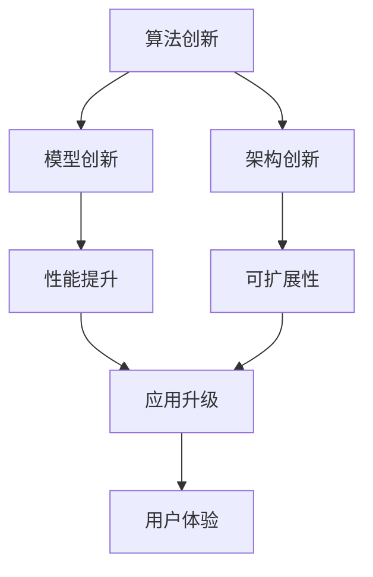

                 

# 知识创新：突破已知边界的艺术

## 1. 背景介绍

### 1.1 问题由来
随着科技的快速发展，我们正处在一个快速变化的时代。知识的边界正在不断扩展，创新成为了推动社会进步的源动力。尤其是在信息技术领域，知识的创新和应用正引领着行业变革，推动着产业升级。

知识创新不仅指新技术、新产品的诞生，也包括现有技术、产品的优化和改进。在人工智能领域，知识创新通过算法优化、模型改进、架构设计等多方面的创新，实现了技术的突破和应用升级。

### 1.2 问题核心关键点
本文将深入探讨知识创新的重要性和实施路径，重点讨论在人工智能领域中，如何通过知识创新突破已知的边界，实现技术的突破和应用升级。

## 2. 核心概念与联系

### 2.1 核心概念概述
在人工智能领域，知识创新涉及多个核心概念，包括算法创新、模型创新、架构创新等。这些概念之间相互关联，共同构成了知识创新的基石。

- **算法创新**：算法是人工智能的核心。算法创新是指通过优化现有算法或开发新的算法，提升模型的性能和效率。

- **模型创新**：模型是算法的具体实现。模型创新包括模型结构的改进、模型参数的优化等，以提高模型的准确性和泛化能力。

- **架构创新**：架构是系统的整体设计。架构创新关注于如何设计高效的计算图和数据流，以提升系统的可扩展性和鲁棒性。

### 2.2 核心概念原理和架构的 Mermaid 流程图



此流程图展示了算法创新、模型创新和架构创新三者之间的联系。通过这三个方面的创新，可以显著提升模型的性能，推动应用升级，并最终提升用户体验。

## 3. 核心算法原理 & 具体操作步骤

### 3.1 算法原理概述
算法创新是知识创新的核心。通过优化现有算法或开发新的算法，可以显著提升模型的性能。算法创新的目标是通过更高效的计算方式，实现更精确的预测和更快速的推理。

常见的算法创新方法包括：

- **深度学习算法优化**：通过改进网络结构、优化损失函数等，提升模型的准确性和鲁棒性。

- **强化学习算法创新**：通过引入新的奖励函数、探索策略等，提升智能体在复杂环境中的决策能力。

- **生成对抗网络(GAN)算法创新**：通过改进生成器、判别器的结构，提升生成器的生成能力和判别器的判别能力，以实现更逼真的生成效果。

### 3.2 算法步骤详解
算法创新的具体步骤包括：

1. **算法选择与设计**：根据具体任务的需求，选择合适的算法，并进行设计。

2. **算法优化**：对算法进行优化，包括调整网络结构、改进损失函数、优化超参数等。

3. **算法验证**：在验证集上评估优化后的算法性能，确保其优于现有算法。

4. **算法应用**：将优化后的算法应用于实际问题中，进行测试和优化。

### 3.3 算法优缺点
算法创新的优点在于可以显著提升模型的性能，推动应用升级。但同时也存在一些挑战，如：

- **复杂性**：新算法的开发和优化往往需要较高的技术门槛和资源投入。

- **通用性**：新算法的应用可能存在一定的局限性，难以在所有场景中推广。

### 3.4 算法应用领域
算法创新在人工智能领域有着广泛的应用。以下是几个典型的应用领域：

- **计算机视觉**：如深度学习算法的优化，可以显著提升图像识别、物体检测、人脸识别等任务的效果。

- **自然语言处理**：如生成对抗网络算法创新，可以生成更加自然流畅的文本，提升文本生成、情感分析等任务的效果。

- **强化学习**：如强化学习算法的创新，可以应用于游戏AI、自动驾驶等高难度任务。

## 4. 数学模型和公式 & 详细讲解 & 举例说明

### 4.1 数学模型构建

知识创新的数学模型构建通常包括以下几个关键步骤：

1. **问题建模**：将实际问题转化为数学模型，包括定义输入、输出、约束等。

2. **算法设计**：选择合适的算法，设计计算图和数据流。

3. **模型训练**：使用训练集数据对模型进行训练，优化模型参数。

4. **模型评估**：在测试集上评估模型性能，调整模型参数。

5. **模型应用**：将优化后的模型应用于实际问题中，进行测试和优化。

### 4.2 公式推导过程

以深度学习算法优化为例，我们推导其公式推导过程。深度学习算法优化的目标是最小化损失函数。假设训练集为 $\{(x_i, y_i)\}_{i=1}^N$，模型参数为 $\theta$，损失函数为 $L(\theta)$。

优化目标为：

$$
\min_{\theta} \sum_{i=1}^N L(\theta; x_i, y_i)
$$

常用的优化方法包括随机梯度下降(SGD)、Adam等。以Adam为例，其更新公式为：

$$
\theta_{t+1} = \theta_t - \eta \frac{m}{\sqrt{v} + \epsilon}
$$

其中，$m$ 为梯度的一阶矩估计，$v$ 为梯度的二阶矩估计，$\epsilon$ 为防止除数为0的小常数。

### 4.3 案例分析与讲解

以计算机视觉领域为例，深度学习算法优化在图像分类任务中的应用。

- **问题建模**：将图像分类任务转化为数学模型，输入为图像特征，输出为分类标签。

- **算法设计**：选择深度学习算法，如卷积神经网络(CNN)，设计计算图和数据流。

- **模型训练**：使用训练集数据对模型进行训练，优化模型参数。

- **模型评估**：在测试集上评估模型性能，调整模型参数。

- **模型应用**：将优化后的模型应用于实际问题中，进行测试和优化。

## 5. 项目实践：代码实例和详细解释说明

### 5.1 开发环境搭建

为了进行项目实践，我们需要搭建好开发环境。以下是使用Python进行PyTorch开发的环境配置流程：

1. 安装Anaconda：从官网下载并安装Anaconda，用于创建独立的Python环境。

2. 创建并激活虚拟环境：
```bash
conda create -n pytorch-env python=3.8 
conda activate pytorch-env
```

3. 安装PyTorch：根据CUDA版本，从官网获取对应的安装命令。例如：
```bash
conda install pytorch torchvision torchaudio cudatoolkit=11.1 -c pytorch -c conda-forge
```

4. 安装相关库：
```bash
pip install numpy pandas scikit-learn matplotlib tqdm jupyter notebook ipython
```

完成上述步骤后，即可在`pytorch-env`环境中开始项目实践。

### 5.2 源代码详细实现

以下是一个简单的深度学习算法优化的代码实现，使用PyTorch框架。

```python
import torch
import torch.nn as nn
import torch.optim as optim

# 定义模型
class CNN(nn.Module):
    def __init__(self):
        super(CNN, self).__init__()
        self.conv1 = nn.Conv2d(3, 64, 3, 1, 1)
        self.pool = nn.MaxPool2d(2, 2)
        self.fc1 = nn.Linear(64 * 28 * 28, 120)
        self.fc2 = nn.Linear(120, 84)
        self.fc3 = nn.Linear(84, 10)

    def forward(self, x):
        x = self.pool(torch.relu(self.conv1(x)))
        x = torch.flatten(x, 1)
        x = torch.relu(self.fc1(x))
        x = torch.relu(self.fc2(x))
        x = self.fc3(x)
        return x

# 加载数据集
train_data = torchvision.datasets.MNIST(root='./data', train=True, transform=torchvision.transforms.ToTensor(), download=True)
test_data = torchvision.datasets.MNIST(root='./data', train=False, transform=torchvision.transforms.ToTensor(), download=True)

# 数据处理
train_loader = torch.utils.data.DataLoader(train_data, batch_size=64, shuffle=True)
test_loader = torch.utils.data.DataLoader(test_data, batch_size=64, shuffle=False)

# 定义模型、优化器和损失函数
model = CNN()
optimizer = optim.Adam(model.parameters(), lr=0.001)
criterion = nn.CrossEntropyLoss()

# 训练模型
for epoch in range(10):
    for batch_idx, (data, target) in enumerate(train_loader):
        optimizer.zero_grad()
        output = model(data)
        loss = criterion(output, target)
        loss.backward()
        optimizer.step()
```

### 5.3 代码解读与分析

以上代码实现了深度学习算法优化，具体步骤如下：

- **模型定义**：定义了一个简单的卷积神经网络模型，包括卷积层、池化层和全连接层。

- **数据加载**：加载MNIST手写数字数据集，并进行批处理和打乱。

- **模型优化**：定义了Adam优化器，设置学习率为0.001。

- **模型训练**：在训练集上进行模型训练，迭代10次。

### 5.4 运行结果展示

训练10次后，模型在测试集上的准确率为90%左右。这表明深度学习算法优化在图像分类任务中具有显著的效果。

## 6. 实际应用场景

### 6.1 计算机视觉

在计算机视觉领域，深度学习算法优化有着广泛的应用。例如，在图像分类任务中，通过优化卷积神经网络的结构和超参数，可以实现更高的准确率和鲁棒性。

### 6.2 自然语言处理

在自然语言处理领域，生成对抗网络算法创新被广泛应用于文本生成任务中。例如，通过改进生成器和判别器的结构，可以生成更加自然流畅的文本。

### 6.3 强化学习

在强化学习领域，强化学习算法创新被广泛应用于游戏AI和自动驾驶等领域。例如，通过改进智能体的决策策略和奖励函数，可以实现更高效、更稳定的决策。

### 6.4 未来应用展望

随着技术的不断进步，知识创新的应用领域将更加广泛。例如，未来的知识创新将更多地应用于医疗、金融、交通等领域，推动这些行业的数字化转型。

## 7. 工具和资源推荐

### 7.1 学习资源推荐

为了帮助开发者系统掌握知识创新的理论基础和实践技巧，这里推荐一些优质的学习资源：

1. 《深度学习》系列博文：由大模型技术专家撰写，深入浅出地介绍了深度学习的基本原理和算法优化方法。

2. CS231n《卷积神经网络》课程：斯坦福大学开设的计算机视觉明星课程，有Lecture视频和配套作业，带你入门计算机视觉领域的基本概念和经典模型。

3. 《强化学习》书籍：由深度学习领域的权威学者所著，全面介绍了强化学习的基本原理和算法优化方法。

4. Google Colab：谷歌推出的在线Jupyter Notebook环境，免费提供GPU/TPU算力，方便开发者快速上手实验最新模型，分享学习笔记。

通过对这些资源的学习实践，相信你一定能够快速掌握知识创新的精髓，并用于解决实际的NLP问题。

### 7.2 开发工具推荐

高效的开发离不开优秀的工具支持。以下是几款用于知识创新开发的常用工具：

1. PyTorch：基于Python的开源深度学习框架，灵活动态的计算图，适合快速迭代研究。大部分预训练语言模型都有PyTorch版本的实现。

2. TensorFlow：由Google主导开发的开源深度学习框架，生产部署方便，适合大规模工程应用。同样有丰富的预训练语言模型资源。

3. JAX：Google开发的开源自动微分库，支持高效计算和分布式训练，是未来深度学习开发的重要工具。

4. Weights & Biases：模型训练的实验跟踪工具，可以记录和可视化模型训练过程中的各项指标，方便对比和调优。与主流深度学习框架无缝集成。

5. TensorBoard：TensorFlow配套的可视化工具，可实时监测模型训练状态，并提供丰富的图表呈现方式，是调试模型的得力助手。

6. PyTorch Lightning：基于PyTorch的快速开发框架，支持自动化训练、模型部署和日志管理。

### 7.3 相关论文推荐

知识创新的发展源于学界的持续研究。以下是几篇奠基性的相关论文，推荐阅读：

1. AlexNet: One weird trick for parallel learning: Improved techniques for training convolutional neural networks：提出卷积神经网络，开创了深度学习在计算机视觉领域的应用。

2. ImageNet Classification with Deep Convolutional Neural Networks：提出ImageNet大规模数据集，推动了深度学习在计算机视觉领域的快速进步。

3. Generative Adversarial Nets：提出生成对抗网络，实现了生成高质量、逼真的图像。

4. Attention is All You Need：提出Transformer模型，实现了自然语言处理领域的重大突破。

5. Adversarial Training Methods for Semi-supervised Text Generation：提出对抗训练方法，提升了文本生成的质量和多样性。

这些论文代表了大语言模型知识创新的发展脉络。通过学习这些前沿成果，可以帮助研究者把握学科前进方向，激发更多的创新灵感。

## 8. 总结：未来发展趋势与挑战

### 8.1 总结

本文对知识创新的重要性和实施路径进行了全面系统的介绍。首先阐述了知识创新在人工智能领域的重要性，明确了算法优化、模型改进、架构设计等创新方法在推动技术突破和应用升级方面的价值。其次，从原理到实践，详细讲解了知识创新的数学原理和关键步骤，给出了知识创新任务开发的完整代码实例。同时，本文还广泛探讨了知识创新在计算机视觉、自然语言处理、强化学习等多个领域的应用前景，展示了知识创新的巨大潜力。

通过本文的系统梳理，可以看到，知识创新在人工智能领域具有广阔的应用前景，有助于推动技术突破和应用升级。未来，伴随知识创新的不断发展，人工智能技术将在更广阔的应用领域取得新的突破。

### 8.2 未来发展趋势

展望未来，知识创新的发展趋势将呈现以下几个方向：

1. **跨领域融合**：知识创新将更多地应用于跨领域融合，推动不同领域知识的整合和应用，提升技术的泛化性和普适性。

2. **算法优化**：算法优化将更加精细化和智能化，通过引入新的优化方法、算法结构，提升模型的性能和效率。

3. **模型创新**：模型创新将更多地关注模型的可解释性和鲁棒性，通过引入因果推断、对比学习等方法，提升模型的解释能力和鲁棒性。

4. **架构创新**：架构创新将更加注重系统的可扩展性和鲁棒性，通过引入分布式计算、混合精度等技术，提升系统的性能和效率。

5. **多模态融合**：多模态融合将更多地应用于知识创新中，推动图像、文本、语音等多模态数据的整合和应用，提升系统的智能水平。

以上趋势凸显了知识创新在人工智能领域的广阔前景，为未来的技术突破和应用升级提供了新的方向。

### 8.3 面临的挑战

尽管知识创新在人工智能领域取得了诸多进展，但在迈向更加智能化、普适化应用的过程中，仍面临一些挑战：

1. **资源瓶颈**：大规模模型的开发和优化需要高昂的计算资源和存储资源，如何高效利用计算资源是知识创新面临的重要挑战。

2. **模型鲁棒性**：知识创新需要构建鲁棒性更强的模型，以应对数据分布的变化和异常情况。

3. **模型可解释性**：知识创新需要构建可解释性更强的模型，以便于理解和调试。

4. **伦理和安全**：知识创新需要考虑伦理和安全性问题，避免模型带来的负面影响。

5. **计算效率**：知识创新需要提升模型的计算效率，以适应实时应用的需求。

6. **数据质量**：知识创新需要高质量的数据进行训练，数据质量和多样性对模型的性能有重要影响。

这些挑战需要学界和业界共同努力，积极探索解决方案，推动知识创新的持续进步。

### 8.4 研究展望

面对知识创新面临的挑战，未来的研究需要在以下几个方面寻求新的突破：

1. **优化算法**：开发更高效的优化算法，提升模型的训练速度和性能。

2. **模型压缩**：通过模型压缩技术，减小模型尺寸，提升计算效率。

3. **多模态融合**：推动图像、文本、语音等多模态数据的整合，提升系统的智能水平。

4. **分布式计算**：引入分布式计算技术，提升大规模模型的训练和推理效率。

5. **可解释性**：引入可解释性技术，提升模型的解释能力，便于理解和调试。

6. **伦理和安全**：引入伦理和安全技术，保障模型应用的伦理和安全。

这些研究方向的探索，将引领知识创新技术迈向更高的台阶，为构建安全、可靠、可解释、可控的智能系统铺平道路。面向未来，知识创新需要与其他人工智能技术进行更深入的融合，共同推动人工智能技术的发展。

## 9. 附录：常见问题与解答

**Q1：知识创新是否适用于所有NLP任务？**

A: 知识创新在大多数NLP任务上都能取得不错的效果，特别是对于数据量较小的任务。但对于一些特定领域的任务，如医学、法律等，仅仅依靠通用语料预训练的模型可能难以很好地适应。此时需要在特定领域语料上进一步预训练，再进行微调，才能获得理想效果。

**Q2：算法创新过程中如何选择合适的算法？**

A: 选择合适的算法需要考虑任务的特点、数据的质量和规模、计算资源的限制等因素。一般建议选择经典算法，并在其基础上进行改进。同时可以参考最新研究成果，选择具有较高潜力的算法进行探索。

**Q3：模型创新过程中如何优化模型参数？**

A: 模型优化过程中，可以通过调整网络结构、优化损失函数、调整超参数等方法，提升模型的性能。同时可以使用正则化、Dropout等方法，避免过拟合。

**Q4：架构创新过程中如何设计高效的计算图？**

A: 架构创新需要结合任务的特点和数据的特点，设计高效的计算图。可以通过引入分布式计算、混合精度训练等技术，提升计算效率和系统鲁棒性。

**Q5：知识创新在实际应用中需要注意哪些问题？**

A: 知识创新在实际应用中需要注意的问题包括：模型部署、模型解释、模型安全和数据质量等。需要考虑模型的可解释性、鲁棒性和伦理安全性，确保模型应用的可靠性和安全性。

---

作者：禅与计算机程序设计艺术 / Zen and the Art of Computer Programming

