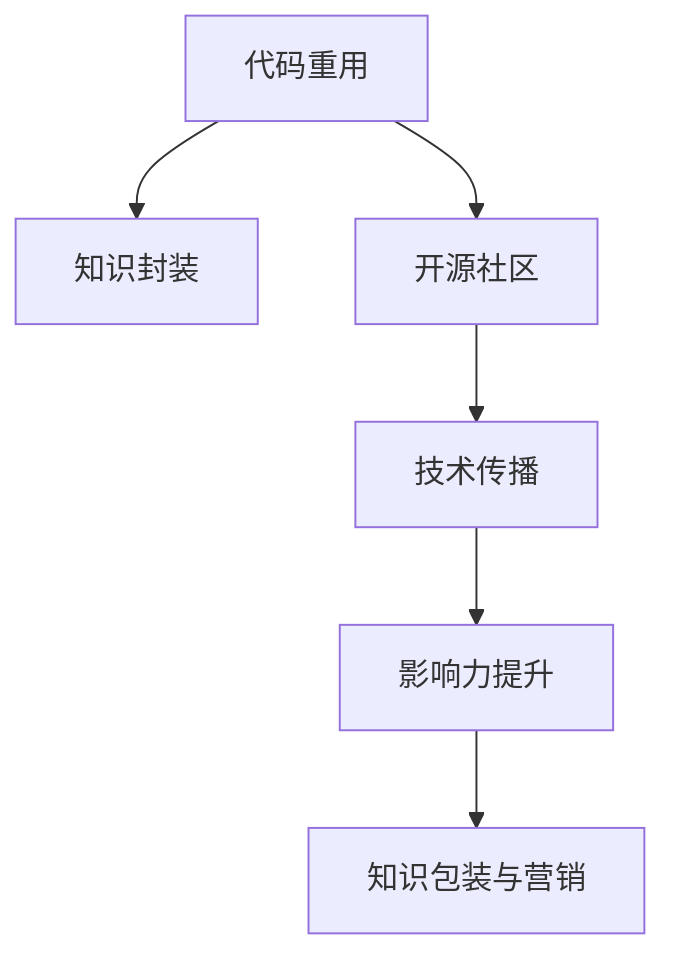

                 

# 知识包装与营销：程序员版

> 关键词：知识封装, 营销策略, 程序员, 代码重用, 开源社区, 技术传播, 影响力

## 1. 背景介绍

### 1.1 问题由来
在快速变化的软件开发环境中，程序员需要不断更新技术栈，提升自身技能以适应新需求。然而，技术学习成本高、时间有限，许多编程新手或经验不足的开发者面临学习困难。

同时，随着开源社区和云服务的兴起，开发者们已经意识到代码重用和知识传播的重要性。如何更高效地共享和传播知识，提升代码的可读性和可复用性，成为了软件开发中的关键问题。

### 1.2 问题核心关键点
当前，知识共享和传播问题主要集中于以下关键点：
1. **代码重用性**：如何设计代码，使其更易于重用，避免重复开发？
2. **可读性和可维护性**：如何使代码更易于理解和维护？
3. **知识传播**：如何有效地传播技术知识和经验？
4. **社区参与度**：如何吸引更多的开发者参与开源社区，共同贡献和成长？

解决这些问题，需要开发出新的知识包装与营销策略，以提高代码的共享效率和知识传播的速度。

## 2. 核心概念与联系

### 2.1 核心概念概述

为更好地理解知识包装与营销策略，本节将介绍几个密切相关的核心概念：

- **代码重用**：指在多个项目中共享代码片段，避免重复开发。
- **知识封装**：通过组织和封装代码，使其更易于理解和重用。
- **开源社区**：开发者们共同构建和维护的开放平台，用于共享代码和知识。
- **技术传播**：通过各种方式传播技术知识，促进开发者之间的学习和交流。
- **影响力提升**：通过有效的策略提升个人或项目的知名度和影响力。

这些核心概念之间的逻辑关系可以通过以下Mermaid流程图来展示：



这个流程图展示了一系列概念之间的相互依赖关系：

1. 代码重用是知识封装的基础，通过将代码封装成模块，实现更好的复用。
2. 开源社区提供了一个共享和传播知识的平台，代码重用和知识封装的结果在这里得到推广。
3. 技术传播使得知识在开发者之间快速传播，促进了社区的成长。
4. 影响力的提升，反过来又能增加知识的传播效果，形成良性循环。
5. 知识包装与营销是这些过程的综合体现，通过系统化的策略，提升代码重用和知识传播的效率。

## 3. 核心算法原理 & 具体操作步骤
### 3.1 算法原理概述

知识包装与营销策略的实现，本质上是一个软件工程和市场营销的结合过程。其核心思想是通过组织和优化代码结构，增强代码的可重用性，同时通过有效的市场策略，传播技术知识，提升代码和开发者在社区中的影响力。

形式化地，假设开发者的知识库为 $K$，目标是将 $K$ 中的知识 $k$ 通过适当的包装与营销，使其更容易被其他开发者 $O$ 所接受和重用。

知识包装与营销的目标是最小化开发者 $O$ 学习 $k$ 的成本和难度，即找到最优的包装方式 $p$ 和营销策略 $m$，使得：

$$
\min_{p,m} C(O,k)
$$

其中 $C(O,k)$ 为开发者 $O$ 学习知识 $k$ 的成本，包括时间成本、学习成本等。

### 3.2 算法步骤详解

基于知识包装与营销的目标，本节将详细讲解核心算法步骤：

**Step 1: 知识识别与分类**
- 识别知识库 $K$ 中存在的所有知识，如算法、设计模式、工具库等。
- 根据知识的复杂度和重要性，将其分类为核心知识、辅助知识、次要知识等。

**Step 2: 知识封装**
- 将核心知识封装成易于重用的模块或库。
- 设计清晰的接口和文档，方便其他开发者调用。
- 加入必要的注释和测试，提高模块的可读性和可维护性。

**Step 3: 知识营销**
- 选择合适的营销渠道，如GitHub、Stack Overflow、技术博客等。
- 编写详细的技术文档和使用案例，进行知识传播。
- 在社区内进行互动和交流，解答其他开发者的问题，提升影响力。

**Step 4: 社区参与与反馈**
- 鼓励社区内的开发者使用和贡献知识库中的代码。
- 收集反馈，持续优化知识封装和营销策略。
- 根据社区的反馈，调整知识库的结构和内容。

**Step 5: 影响力提升**
- 定期发布项目进展和技术总结，保持活跃度。
- 参与开源项目或合作开发，扩大项目的知名度。
- 通过社交媒体等渠道，传播项目的理念和价值。

### 3.3 算法优缺点

知识包装与营销策略具有以下优点：
1. 提升代码重用性。通过将知识封装成模块，大大减少了重复开发的工作量。
2. 增强代码可读性。清晰的文档和接口设计，使得代码更易于理解和维护。
3. 促进技术传播。通过营销策略，知识库中的代码能够快速传播到更多的开发者手中。
4. 提高社区参与度。社区内成员的互动和反馈，可以持续优化知识库，提升其价值。

同时，该策略也存在一定的局限性：
1. 需要较高的前期投入。知识封装和营销策略的实现需要投入大量的时间和精力。
2. 依赖社区活跃度。社区的参与度和反馈效果，直接影响到知识传播的效率和质量。
3. 知识传播的速度和范围受限。不同社区和平台的用户群体差异较大，知识传播的速度和范围可能有限。

尽管存在这些局限性，但通过系统化的知识包装与营销策略，可以显著提升代码重用性和技术传播效率，为软件开发带来新的活力。

### 3.4 算法应用领域

知识包装与营销策略在软件开发中得到了广泛的应用，特别是在开源社区和云服务领域，具体应用包括：

1. **开源项目**：许多开源项目通过系统化的知识包装和营销策略，吸引了大量开发者贡献代码和文档，形成了稳定活跃的社区生态。
2. **软件框架和库**：如Spring Boot、React等流行框架，通过清晰的设计和详尽的文档，显著提升了代码的可重用性和可维护性。
3. **在线编程平台**：如GitHub、GitLab等平台，通过提供代码分享和社区互动功能，加速了知识传播和开发者之间的协作。
4. **云服务**：如AWS Lambda、Google Cloud Functions等云服务，通过提供简洁的接口和文档，加速了服务的部署和调用。

除了上述这些常见应用外，知识包装与营销策略在AI、大数据、区块链等前沿领域也发挥了重要作用，为技术创新和产业升级提供了有力支持。

## 4. 数学模型和公式 & 详细讲解 & 举例说明（备注：数学公式请使用latex格式，latex嵌入文中独立段落使用 $$，段落内使用 $)
### 4.1 数学模型构建

本节将使用数学语言对知识包装与营销策略进行更加严格的刻画。

记开发者的知识库为 $K=\{k_1, k_2, ..., k_n\}$，其中 $k_i$ 为第 $i$ 个知识点。目标是将 $K$ 中的知识 $k$ 通过适当的包装与营销，使其更容易被其他开发者 $O$ 所接受和重用。

定义开发者 $O$ 学习知识 $k$ 的成本函数为 $C(O,k)$，其中 $C(O,k)$ 为开发者 $O$ 学习知识 $k$ 所需的总时间、精力等资源。

### 4.2 公式推导过程

以下我们以知识点的复杂度为例，推导知识包装与营销的优化模型。

假设知识点的复杂度为 $c_i$，开发者 $O$ 学习该知识点的速度为 $v_i$，则学习知识 $k$ 的总成本为：

$$
C(O,k) = \sum_{i=1}^{n} c_i \cdot \frac{1}{v_i}
$$

目标是最小化 $C(O,k)$，即找到最优的封装方式 $p_i$ 和营销策略 $m_i$，使得：

$$
\min_{p_i, m_i} \sum_{i=1}^{n} c_i \cdot \frac{1}{v_i}
$$

其中 $p_i$ 为第 $i$ 个知识点的封装方式，$m_i$ 为营销策略。

为了进一步简化问题，可以引入知识点的权重 $w_i$，表示该知识点对开发者 $O$ 的重要程度。因此，总成本函数变为：

$$
C(O,k) = \sum_{i=1}^{n} w_i \cdot c_i \cdot \frac{1}{v_i}
$$

进一步简化，引入成本因子 $a_i = c_i/v_i$，则：

$$
C(O,k) = \sum_{i=1}^{n} w_i \cdot a_i
$$

定义知识点的权重向量为 $\vec{w} = (w_1, w_2, ..., w_n)^T$，成本因子向量为 $\vec{a} = (a_1, a_2, ..., a_n)^T$，则目标函数变为：

$$
\min_{p_i, m_i} \vec{w} \cdot \vec{a}
$$

这是一个典型的线性优化问题，可以使用线性规划方法求解。

### 4.3 案例分析与讲解

考虑一个开源项目中的知识点，包括算法实现、数据结构设计、测试用例等。项目开发者希望通过系统化的知识包装与营销，提升代码的重用性和传播速度。

假设知识点的复杂度 $c_i$ 和开发者学习速度 $v_i$ 分别为：

- 算法实现：$c_1 = 10$, $v_1 = 5$
- 数据结构设计：$c_2 = 20$, $v_2 = 10$
- 测试用例：$c_3 = 15$, $v_3 = 8$

目标是最小化开发者学习这些知识点的成本。

**Step 1: 知识识别与分类**

识别项目中的所有知识点，如算法实现、数据结构设计、测试用例等，并根据其重要性和复杂度进行分类。

**Step 2: 知识封装**

将核心知识点封装成易于重用的模块或库，设计清晰的接口和文档。例如，算法实现可以封装成函数或类，数据结构设计可以封装成类库，测试用例可以封装成单元测试框架。

**Step 3: 知识营销**

选择合适的营销渠道，如GitHub、Stack Overflow、技术博客等。编写详细的技术文档和使用案例，进行知识传播。例如，在GitHub上创建项目文档和代码示例，在技术博客上撰写使用案例和最佳实践。

**Step 4: 社区参与与反馈**

鼓励社区内的开发者使用和贡献知识库中的代码。例如，在GitHub上发布API接口和API文档，邀请社区开发者使用和贡献。收集社区的反馈，持续优化知识封装和营销策略。

**Step 5: 影响力提升**

定期发布项目进展和技术总结，保持活跃度。例如，在技术博客上发布项目进展和新技术应用。参与开源项目或合作开发，扩大项目的知名度。例如，与知名开源项目合作，共同开发新功能。

通过以上步骤，项目开发者可以显著提升代码重用性和技术传播效率，为开源社区带来更多的贡献和价值。

## 5. 项目实践：代码实例和详细解释说明
### 5.1 开发环境搭建

在进行知识包装与营销实践前，我们需要准备好开发环境。以下是使用Python进行Django开发的环境配置流程：

1. 安装Anaconda：从官网下载并安装Anaconda，用于创建独立的Python环境。

2. 创建并激活虚拟环境：
```bash
conda create -n django-env python=3.8 
conda activate django-env
```

3. 安装Django：
```bash
pip install django
```

4. 安装开发工具：
```bash
pip install numpy pandas scikit-learn matplotlib
```

完成上述步骤后，即可在`django-env`环境中开始知识包装与营销实践。

### 5.2 源代码详细实现

下面我们以开源项目中的知识点封装为例，给出使用Django进行知识包装与营销的代码实现。

首先，定义知识点的文档模型：

```python
from django.db import models
from django.contrib.auth.models import User

class Knowledge(models.Model):
    title = models.CharField(max_length=255)
    description = models.TextField()
    tags = models.ManyToManyField('Tag')
    author = models.ForeignKey(User, on_delete=models.CASCADE)
    created_at = models.DateTimeField(auto_now_add=True)
    updated_at = models.DateTimeField(auto_now=True)

class Tag(models.Model):
    name = models.CharField(max_length=255)

# 创建Tag
Tag.objects.create(name='Python')
Tag.objects.create(name='Java')
Tag.objects.create(name='算法')
```

然后，定义知识库的展示页面和详情页面：

```python
from django.shortcuts import render
from .models import Knowledge

def index(request):
    knowledges = Knowledge.objects.all()
    return render(request, 'knowledge/index.html', {'knowledges': knowledges})

def detail(request, pk):
    knowledge = Knowledge.objects.get(pk=pk)
    return render(request, 'knowledge/detail.html', {'knowledge': knowledge})
```

接下来，定义知识点的管理页面：

```python
from django.shortcuts import render, redirect
from .models import Knowledge
from .forms import KnowledgeForm

def create(request):
    if request.method == 'POST':
        form = KnowledgeForm(request.POST)
        if form.is_valid():
            knowledge = form.save(commit=False)
            knowledge.author = request.user
            knowledge.save()
            return redirect('index')
    else:
        form = KnowledgeForm()
    return render(request, 'knowledge/create.html', {'form': form})
```

最后，定义知识点的创建表单：

```python
from django import forms
from .models import Knowledge

class KnowledgeForm(forms.ModelForm):
    class Meta:
        model = Knowledge
        fields = ['title', 'description', 'tags']
```

完成上述代码实现后，即可在Django项目中进行知识包装与营销的实践。

### 5.3 代码解读与分析

让我们再详细解读一下关键代码的实现细节：

**Knowledge类**：
- `title`：知识点的标题。
- `description`：知识点的详细描述。
- `tags`：知识点的标签，用于分类和搜索。
- `author`：知识点的作者，与用户模型关联。
- `created_at`：知识点的创建时间。
- `updated_at`：知识点的更新时间。

**Tag类**：
- `name`：标签的名称。

**index函数**：
- 获取所有知识点，展示在主页上。

**detail函数**：
- 根据ID获取指定知识点，展示其详情。

**create函数**：
- 创建知识点的表单处理，保存知识点到数据库。

**KnowledgeForm类**：
- 用于创建知识点的表单验证和保存。

通过这些代码，可以看出知识包装与营销策略在实际开发中的应用。通过系统化的代码组织和展示，开发者可以方便地重用和管理知识，提升代码的可维护性和可传播性。

## 6. 实际应用场景
### 6.1 智能客服系统

知识包装与营销在智能客服系统中具有广泛的应用场景。智能客服系统需要大量的知识库支持，涵盖各种常见问题和标准回答。通过知识包装与营销策略，可以快速构建和更新知识库，提升系统的问题解答能力和用户体验。

在技术实现上，可以收集历史客服对话记录，将其整理成文档和代码模块，存储在知识库中。通过适当的封装和营销，使得知识库中的知识更易于重用和传播。例如，使用Python的Flask框架，将知识库封装成API接口，并通过Django展示和搜索，方便客服人员调用和使用。

### 6.2 在线编程社区

在线编程社区是知识包装与营销的重要应用场景。社区内的开发者通过分享和交流，共同构建和维护知识库，加速技术的学习和传播。

在技术实现上，可以使用GitHub、GitLab等平台，将代码和文档存储在开源仓库中，并通过Markdown格式进行展示。通过持续更新和维护，社区成员可以不断贡献新的知识点，并利用代码重用性，快速构建和部署自己的项目。例如，开源框架如Flask、Django等，就是通过知识包装与营销策略，在社区内得到广泛应用和推广。

### 6.3 企业内部培训

企业内部培训也需要有效的知识包装与营销策略，帮助员工快速掌握新技术和新工具。通过知识封装和展示，员工可以方便地学习新知识，提升工作效率。

在技术实现上，可以搭建企业内部知识管理系统，使用Django等框架进行开发。知识管理系统可以将企业内部的技术文档、培训视频、代码示例等资源整理成模块，并通过搜索和展示功能，方便员工查找和使用。例如，企业内部的Git仓库和Wiki，就是通过知识包装与营销策略，帮助员工快速学习和掌握新技术。

### 6.4 未来应用展望

随着知识包装与营销策略的不断发展，其在更多场景中的应用前景将会更加广阔。

在智慧医疗领域，知识包装与营销策略可以用于构建医学知识库和案例库，提升医生的诊疗水平和医疗服务质量。例如，将医学文献和病例整理成知识模块，通过搜索引擎和API接口，方便医生查询和使用。

在智能制造领域，知识包装与营销策略可以用于构建生产工艺知识库和操作手册，提升生产效率和质量。例如，将生产工艺流程和设备操作手册封装成知识模块，通过Django等框架展示和搜索，方便工人快速学习和掌握操作技能。

在智能交通领域，知识包装与营销策略可以用于构建交通规则和案例库，提升交通管理的智能化水平。例如，将交通规则和事故案例整理成知识模块，通过搜索引擎和API接口，方便交通管理人员查询和使用。

总之，知识包装与营销策略在各行各业的应用场景将会不断拓展，为人类社会带来更多的知识和价值。

## 7. 工具和资源推荐
### 7.1 学习资源推荐

为了帮助开发者系统掌握知识包装与营销的理论基础和实践技巧，这里推荐一些优质的学习资源：

1. Django官方文档：完整的Django框架文档，涵盖了基础到高级的开发内容，适合Python开发者的学习。
2. Flask官方文档：Flask微框架的官方文档，适合快速开发和部署小型应用。
3. Flask框架实战：《Flask实战》一书，通过实战项目讲解Flask的开发技巧和应用场景。
4. Django实战：《Django实战》一书，通过实战项目讲解Django的开发技巧和应用场景。
5. Git官方文档：Git版本控制系统的操作指南，适合Git初学者。
6. GitHub开发者指南：GitHub平台的使用指南，适合GitHub新手。

通过对这些资源的学习实践，相信你一定能够快速掌握知识包装与营销的精髓，并用于解决实际的开发问题。

### 7.2 开发工具推荐

高效的开发离不开优秀的工具支持。以下是几款用于知识包装与营销开发的常用工具：

1. Django：Python的高级Web框架，适合开发复杂、可维护性高的Web应用。
2. Flask：Python的轻量级微框架，适合快速开发小型应用和API接口。
3. Git：分布式版本控制系统，适合代码的协作开发和管理。
4. GitHub：开源代码托管平台，适合代码的存储、版本控制和社区互动。
5. GitLab：开源代码托管平台，支持CI/CD、项目管理等功能。
6. Docker：容器化技术，适合部署和管理应用，提升应用的稳定性。

合理利用这些工具，可以显著提升知识包装与营销任务的开发效率，加快创新迭代的步伐。

### 7.3 相关论文推荐

知识包装与营销策略的发展源于学界的持续研究。以下是几篇奠基性的相关论文，推荐阅读：

1. "Documentation as Code"：介绍将文档和代码统一管理，提升文档的可维护性和可传播性。
2. "Kubernetes in Action"：介绍Kubernetes容器编排工具，提升应用的部署和扩展效率。
3. "Designing Software by Documentation"：介绍通过文档设计软件，提升软件的可读性和可维护性。
4. "The GitHub Code of Conduct"：介绍GitHub平台的使用规范，提升社区的参与度和可维护性。

这些论文代表了大语言模型微调技术的发展脉络。通过学习这些前沿成果，可以帮助研究者把握学科前进方向，激发更多的创新灵感。

## 8. 总结：未来发展趋势与挑战

### 8.1 总结

本文对知识包装与营销策略进行了全面系统的介绍。首先阐述了知识包装与营销策略的研究背景和意义，明确了其在新时代软件开发中的重要价值。其次，从原理到实践，详细讲解了知识封装与营销的数学模型和核心算法步骤，给出了具体的代码实例。同时，本文还广泛探讨了知识包装与营销策略在智能客服、在线编程社区、企业内部培训等多个行业领域的应用前景，展示了其在各个场景中的广泛应用。此外，本文精选了知识包装与营销策略的各类学习资源，力求为读者提供全方位的技术指引。

通过本文的系统梳理，可以看到，知识包装与营销策略在软件开发中发挥了重要作用，显著提升了代码的重用性和可传播性。未来，伴随知识库和开源社区的不断发展，知识包装与营销策略必将成为软件开发的重要范式，推动软件开发向更高的智能化和协作化方向发展。

### 8.2 未来发展趋势

展望未来，知识包装与营销策略将呈现以下几个发展趋势：

1. 知识库的泛化与应用。随着知识库规模的扩大和质量的提升，知识库将涵盖更多的领域和主题，成为开发者不可或缺的参考资料。
2. 知识传播的加速与优化。通过智能推荐系统、搜索引擎等技术，加速知识点的传播和匹配，提高知识库的利用效率。
3. 社区互动的增强。通过社区互动和反馈机制，持续优化知识库的内容和结构，提升社区成员的参与度和满意度。
4. 知识编码的标准化。通过将知识库中的知识进行编码，使其更易于重用和传播，提升知识库的通用性和兼容性。
5. 知识库与AI的结合。利用AI技术，如知识图谱、自然语言处理等，提升知识库的智能化水平，提高知识点的匹配和应用效果。

以上趋势凸显了知识包装与营销策略的广阔前景。这些方向的探索发展，必将进一步提升知识库的价值和应用范围，为软件开发带来新的活力。

### 8.3 面临的挑战

尽管知识包装与营销策略已经取得了不小的进展，但在迈向更加智能化、协作化的过程中，它仍面临着诸多挑战：

1. 知识库的构建成本。知识库的构建和维护需要大量的时间和人力投入，成本较高。如何降低知识库的构建和维护成本，成为亟待解决的问题。
2. 知识库的内容质量。知识库中的内容质量直接影响其可用性。如何提高知识库的内容质量，使其更加全面、准确、易用，是知识库发展的关键。
3. 知识库的更新频率。知识库需要不断更新，以适应技术的变化。如何高效地进行知识库的更新和维护，保持其时效性，是知识库发展的难题。
4. 知识库的可扩展性。知识库的规模和结构需要不断扩展，以适应更多的领域和主题。如何设计灵活、可扩展的知识库结构，满足不同领域的需求，是知识库发展的方向。
5. 知识库的互操作性。不同知识库之间的互操作性不足，导致知识库的共享和传播受限。如何实现知识库的互操作，促进知识共享，是知识库发展的目标。

### 8.4 研究展望

面对知识包装与营销策略所面临的挑战，未来的研究需要在以下几个方面寻求新的突破：

1. 知识库的自动化构建。通过机器学习和自然语言处理技术，自动构建和维护知识库，降低知识库的构建成本。
2. 知识库的内容生成。利用生成式AI技术，自动生成知识库中的内容，提升知识库的更新频率和内容质量。
3. 知识库的协同构建。通过社区协作和众包模式，提升知识库的构建效率和内容质量，同时降低知识库的构建成本。
4. 知识库的标准化。制定知识库的统一标准，提高知识库的通用性和兼容性，促进知识库的互操作。
5. 知识库的智能搜索。通过智能推荐和自然语言搜索技术，提升知识库的搜索效率和准确性，降低知识库的使用门槛。

这些研究方向的探索，必将引领知识包装与营销策略迈向更高的台阶，为软件开发带来更多的创新和价值。面向未来，知识包装与营销策略还需要与其他技术进行更深入的融合，如AI、云计算、大数据等，共同推动知识库的智能化和协作化发展。只有勇于创新、敢于突破，才能不断拓展知识库的边界，让知识传播更加高效、智能、便捷。

## 9. 附录：常见问题与解答

**Q1：知识包装与营销策略是否适用于所有项目？**

A: 知识包装与营销策略适用于大多数项目，特别是那些需要大量知识支持的复杂系统。但对于一些简单的、即插即用的系统，知识包装与营销可能并不是必要的。需要根据项目的复杂度和需求，灵活选择适用的策略。

**Q2：如何选择合适的知识封装方式？**

A: 知识封装的目的是提高代码的可重用性和可维护性。选择合适的封装方式需要考虑以下几个因素：
1. 代码的可读性和可理解性。复杂的封装方式可能会降低代码的可读性，需要根据实际情况进行权衡。
2. 代码的可扩展性。封装方式需要支持代码的灵活扩展和升级。
3. 代码的复用性。封装方式需要支持代码的跨项目复用。

**Q3：如何提升知识库的内容质量？**

A: 提升知识库的内容质量，可以从以下几个方面入手：
1. 定期更新知识库。通过持续的更新和维护，保持知识库的时效性和准确性。
2. 引入专家贡献。邀请领域专家进行知识库的贡献，提升知识库的权威性和专业性。
3. 社区互动反馈。通过社区互动和反馈机制，持续优化知识库的内容和结构。
4. 自动化生成内容。利用生成式AI技术，自动生成知识库中的内容，提升知识库的更新频率和内容质量。

**Q4：如何提升知识库的互操作性？**

A: 提升知识库的互操作性，可以从以下几个方面入手：
1. 制定统一的知识库标准。制定知识库的统一标准，提升知识库的通用性和兼容性。
2. 采用开放的知识库架构。选择开放的知识库架构，支持知识的跨平台共享和互操作。
3. 开发知识库的互操作工具。开发知识库的互操作工具，支持不同知识库之间的数据交换和协同构建。

**Q5：知识包装与营销策略的效率如何？**

A: 知识包装与营销策略的效率取决于知识库的质量、社区的活跃度和参与度。优质的知识库、活跃的社区和持续的更新维护，可以显著提升知识包装与营销的效率。需要综合考虑这些因素，不断优化知识库和营销策略，才能最大化其价值。

通过本文的系统梳理，可以看到，知识包装与营销策略在软件开发中发挥了重要作用，显著提升了代码的重用性和可传播性。未来，伴随知识库和开源社区的不断发展，知识包装与营销策略必将成为软件开发的重要范式，推动软件开发向更高的智能化和协作化方向发展。总之，知识包装与营销策略需要开发者根据具体项目，不断迭代和优化知识库、营销策略和社区管理，方能得到理想的效果。

---

作者：禅与计算机程序设计艺术 / Zen and the Art of Computer Programming

