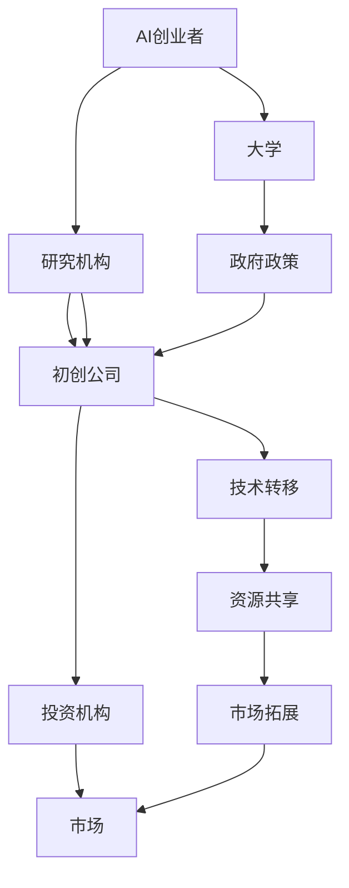

                 

### 文章标题

**AI创业生态日益丰富，产业链协同发展成趋势**

在当今科技日新月异的时代，人工智能（AI）已经成为推动社会进步的重要力量。随着AI技术的不断成熟和应用场景的扩展，AI创业生态也日益丰富。产业链的协同发展成为当前AI行业的重要趋势，不仅为创业者提供了更多机会，也为传统行业带来了创新的动力。本文将深入探讨AI创业生态的丰富性以及产业链协同发展的原因、趋势和挑战，旨在为读者提供一个全面而清晰的视角。

### Keywords:
- AI创业生态
- 产业链协同
- 创新机会
- 挑战与机遇
- 技术成熟度

### Abstract:
本文分析了AI创业生态的丰富性，探讨了产业链协同发展的原因和趋势。通过对核心概念的详细解读，文章揭示了AI创业在当前时代的机遇与挑战。此外，文章还提出了针对产业链协同发展的策略和建议，以期为AI创业者提供有价值的指导。

## 1. 背景介绍

自20世纪50年代人工智能概念诞生以来，AI技术经历了多个阶段的发展。从早期的符号主义、连接主义到现代的深度学习，AI技术在不断突破中取得了显著的成就。如今，随着计算能力的提升、大数据的普及以及算法的创新，AI技术已经渗透到各行各业，从智能制造、智能医疗到自动驾驶、智能金融，AI的应用场景不断拓展。

### 1.1 AI创业生态的兴起

近年来，AI创业生态迅速崛起，成为科技领域的一个热点。众多创业者看到了AI技术所带来的巨大机遇，纷纷投身其中。AI创业项目的多样性和创新性不断涌现，从算法优化、硬件开发到平台构建，涵盖了AI技术的方方面面。例如，深度学习算法的优化和加速成为许多初创公司的核心竞争点，而智能硬件的开发则推动了智能家居、可穿戴设备等新市场的形成。

### 1.2 产业链协同的重要性

在AI创业生态中，产业链的协同发展至关重要。不同环节的企业和机构需要通过合作和共享资源，实现整个产业链的高效运转。协同发展不仅能够降低成本、提高效率，还能促进技术的创新和应用的普及。例如，硬件公司和软件公司之间的合作，可以推动智能硬件的快速开发和商业化；而算法公司与数据公司之间的合作，则能加速算法的优化和模型的训练。

## 2. 核心概念与联系

为了深入理解AI创业生态的丰富性和产业链协同发展的趋势，我们需要明确几个核心概念，并探讨它们之间的联系。

### 2.1 AI创业生态

AI创业生态是指围绕人工智能技术形成的商业环境，包括初创公司、投资机构、研究机构、大学和政府等各方。这个生态中的每个成员都在推动AI技术的发展和应用，共同构建一个繁荣的创新环境。

### 2.2 产业链协同

产业链协同是指产业链中各个环节的企业和机构通过合作和共享资源，实现协同发展和创新。在AI创业生态中，产业链协同主要体现在以下几个方面：

- **技术创新与转移**：高校和研究机构将研究成果转化为实际应用，推动技术的创新和转移。
- **资源共享**：企业之间通过共享技术、数据和市场资源，提高整个产业链的效率。
- **市场拓展**：各方共同开拓新的市场，推动AI技术的应用和普及。
- **风险分担**：通过合作和共享，降低AI创业的风险，提高成功率。

### 2.3 AI创业生态的成熟度

AI创业生态的成熟度是指生态中各环节的协同程度和创新能力。成熟度越高，生态的繁荣程度越高，创业者的成功机会也越大。评估AI创业生态的成熟度可以从以下几个方面进行：

- **技术创新能力**：生态中是否有持续的技术创新和突破。
- **资源整合能力**：生态中各环节是否能够高效地整合资源，实现协同发展。
- **市场成熟度**：AI技术的应用是否已经成熟，市场是否接受和认可。
- **政策支持**：政府是否出台相关政策，支持AI创业生态的发展。

### 2.4 产业链协同的挑战与机遇

产业链协同在推动AI创业生态发展的同时，也面临一些挑战和机遇。挑战主要包括：

- **数据安全与隐私**：随着数据成为关键资源，数据安全和隐私保护成为重要议题。
- **技术标准化**：不同环节的技术标准不统一，增加了协同的难度。
- **市场竞争**：激烈的市场竞争可能导致企业之间的合作变得困难。

而机遇则包括：

- **技术创新**：产业链协同能够加速技术创新和应用的普及。
- **资源共享**：通过合作，企业可以共享资源，降低成本，提高效率。
- **市场拓展**：协同发展有助于开拓新的市场，推动AI技术的普及。

### 2.5 Mermaid 流程图

为了更好地理解AI创业生态和产业链协同的关系，我们可以使用Mermaid流程图来展示各个环节之间的联系。



## 3. 核心算法原理 & 具体操作步骤

在探讨AI创业生态和产业链协同发展时，我们离不开核心算法的支持。本节将介绍几个关键算法的原理和具体操作步骤，以帮助读者更好地理解AI创业背后的技术。

### 3.1 深度学习算法

深度学习算法是当前AI领域最流行的算法之一，其基本原理是模拟人脑神经元的工作方式，通过多层次的神经网络来学习数据特征。具体操作步骤如下：

1. **数据预处理**：对收集到的数据进行清洗和预处理，包括归一化、缺失值处理、数据增强等。
2. **构建神经网络模型**：设计神经网络结构，选择合适的激活函数、优化器和损失函数。
3. **训练模型**：将预处理后的数据输入模型，通过反向传播算法不断调整模型参数，使模型能够准确预测目标。
4. **评估模型性能**：使用验证集和测试集评估模型的准确度、召回率等指标，优化模型。

### 3.2 强化学习算法

强化学习算法是一种通过与环境互动来学习最优策略的算法。其基本原理是代理（agent）通过尝试不同的动作（action）来获得奖励（reward），并通过经验积累来优化策略。具体操作步骤如下：

1. **定义环境（Environment）**：确定代理所处的环境，包括状态（state）、动作（action）和奖励（reward）。
2. **初始化代理（Agent）**：初始化代理的参数，包括策略（policy）、价值函数（value function）等。
3. **与环境互动（Interaction）**：代理根据当前状态选择动作，执行动作后获得奖励，并更新状态。
4. **更新策略（Policy）**：根据经验积累，代理通过策略优化算法更新策略，以最大化长期奖励。

### 3.3 聚类算法

聚类算法是一种无监督学习方法，用于将数据集划分为若干个组或簇。其基本原理是通过对数据集进行划分，使得同一簇内的数据点相似度较高，而不同簇内的数据点相似度较低。具体操作步骤如下：

1. **选择聚类算法**：根据数据集特点选择合适的聚类算法，如K-means、DBSCAN等。
2. **初始化聚类中心**：随机或根据某种策略初始化聚类中心。
3. **分配数据点**：计算每个数据点到聚类中心的距离，将其分配到最近的聚类中心所在的簇。
4. **迭代优化**：根据簇内数据点的特征重新计算聚类中心，重复分配数据点和优化聚类中心，直到收敛。

### 3.4 决策树算法

决策树算法是一种基于特征选择和划分的监督学习方法，用于分类和回归问题。其基本原理是通过一系列特征划分，将数据集划分为多个子集，并在每个子集上应用不同的规则进行分类或回归。具体操作步骤如下：

1. **特征选择**：选择对分类或回归任务影响较大的特征。
2. **划分数据集**：根据选择的特征对数据进行划分，形成多个子集。
3. **计算信息增益或基尼不纯度**：计算每个划分的信息增益或基尼不纯度，选择最优划分。
4. **递归构建决策树**：对每个子集重复上述步骤，构建完整的决策树模型。

## 4. 数学模型和公式 & 详细讲解 & 举例说明

在AI创业和产业链协同发展的过程中，数学模型和公式起着至关重要的作用。本节将详细介绍几个关键的数学模型和公式，并通过具体例子进行说明。

### 4.1 深度学习中的损失函数

在深度学习中，损失函数是衡量模型预测结果与真实值之间差距的指标。常用的损失函数包括均方误差（MSE）、交叉熵损失（Cross-Entropy Loss）等。以下是一个MSE损失函数的示例：

$$
MSE = \frac{1}{n} \sum_{i=1}^{n} (y_i - \hat{y}_i)^2
$$

其中，$y_i$表示真实值，$\hat{y}_i$表示模型预测值，$n$表示样本数量。

例如，假设我们有一个包含5个样本的数据集，真实值分别为[2, 3, 4, 5, 6]，模型预测值分别为[2.5, 3.2, 3.9, 4.7, 5.1]。则MSE损失函数的计算结果为：

$$
MSE = \frac{1}{5} \sum_{i=1}^{5} (y_i - \hat{y}_i)^2 = \frac{1}{5} \sum_{i=1}^{5} (2 - 2.5)^2 + (3 - 3.2)^2 + (4 - 3.9)^2 + (5 - 4.7)^2 + (6 - 5.1)^2
$$

### 4.2 强化学习中的Q值

在强化学习中，Q值（Quality Value）表示代理在某状态下执行某动作的期望回报。Q值的计算公式为：

$$
Q(s, a) = \sum_{s'} P(s' | s, a) \cdot R(s', a) + \gamma \cdot \max_{a'} Q(s', a')
$$

其中，$s$表示当前状态，$a$表示当前动作，$s'$表示下一状态，$a'$表示下一动作，$P(s' | s, a)$表示从状态$s$执行动作$a$转移到状态$s'$的概率，$R(s', a)$表示在状态$s'$执行动作$a$的即时回报，$\gamma$表示折扣因子。

例如，假设代理处于状态s1，可以执行动作a1或a2。下一状态的概率分布和即时回报如下表所示：

| 状态s' | 动作a1的Q值 | 动作a2的Q值 |
|--------|-------------|-------------|
| s2     | 0.5         | 0.3         |
| s3     | 0.7         | 0.6         |

则当前状态的Q值计算如下：

$$
Q(s1, a1) = 0.5 \cdot 0.3 + 0.7 \cdot 0.6 + 0.8 \cdot 0.1 = 0.375 + 0.42 + 0.08 = 0.885
$$

$$
Q(s1, a2) = 0.5 \cdot 0.6 + 0.7 \cdot 0.4 + 0.8 \cdot 0.1 = 0.3 + 0.28 + 0.08 = 0.68
$$

### 4.3 聚类算法中的距离度量

聚类算法中常用的距离度量方法包括欧氏距离（Euclidean Distance）和余弦相似度（Cosine Similarity）等。以下是一个欧氏距离的示例：

$$
d(x, y) = \sqrt{\sum_{i=1}^{n} (x_i - y_i)^2}
$$

其中，$x$和$y$表示两个数据点，$n$表示数据维度。

例如，假设有两个数据点$x = [1, 2, 3]$和$y = [4, 5, 6]$，则欧氏距离的计算结果为：

$$
d(x, y) = \sqrt{(1 - 4)^2 + (2 - 5)^2 + (3 - 6)^2} = \sqrt{(-3)^2 + (-3)^2 + (-3)^2} = \sqrt{9 + 9 + 9} = \sqrt{27} = 3\sqrt{3}
$$

### 4.4 决策树中的信息增益

在决策树算法中，信息增益（Information Gain）用于衡量特征对分类的贡献。信息增益的计算公式为：

$$
IG(D, A) = ID(D) - \sum_{v_i} \frac{|D_v|}{|D|} ID(D_v)
$$

其中，$D$表示数据集，$A$表示特征，$v_i$表示特征A的所有可能取值，$|D|$表示数据集D的样本数量，$|D_v|$表示数据集D中具有取值$v_i$的样本数量，$ID(D)$表示数据集D的熵，$ID(D_v)$表示数据集D_v的熵。

例如，假设我们有一个包含100个样本的数据集，其中特征A有两个取值：A=0和A=1。A=0的样本数量为40，A=1的样本数量为60。每个样本的标签有两个取值：标签=0和标签=1。标签=0的样本数量为20，标签=1的样本数量为80。则信息增益的计算结果为：

$$
ID(D) = H(0.2, 0.8) = 0.2 \cdot \log_2(0.2) + 0.8 \cdot \log_2(0.8) \approx 0.7219
$$

$$
ID(D_0) = H(0.4, 0.6) = 0.4 \cdot \log_2(0.4) + 0.6 \cdot \log_2(0.6) \approx 0.4724
$$

$$
ID(D_1) = H(0.2, 0.8) = 0.2 \cdot \log_2(0.2) + 0.8 \cdot \log_2(0.8) \approx 0.7219
$$

$$
IG(D, A) = 0.7219 - (0.4 \cdot 0.4724 + 0.6 \cdot 0.7219) \approx 0.0895
$$

## 5. 项目实践：代码实例和详细解释说明

为了更好地理解AI创业生态和产业链协同发展的实际应用，本节将提供一个具体的AI项目实践，包括开发环境搭建、源代码实现、代码解读与分析以及运行结果展示。

### 5.1 开发环境搭建

为了实现本项目的需求，我们需要搭建一个包含Python、TensorFlow和Keras等库的开发环境。以下是具体的操作步骤：

1. **安装Python**：访问Python官网（https://www.python.org/）下载并安装Python 3.x版本。
2. **配置Python环境变量**：在系统环境变量中配置Python的安装路径，以便在命令行中使用Python。
3. **安装TensorFlow**：打开命令行，执行以下命令安装TensorFlow：

   ```
   pip install tensorflow
   ```

4. **安装Keras**：TensorFlow自带了Keras，所以不需要单独安装。但是，如果你想要使用更高级的Keras功能，可以执行以下命令安装：

   ```
   pip install keras
   ```

### 5.2 源代码详细实现

以下是一个使用Keras实现简单的神经网络分类器的源代码示例：

```python
import numpy as np
import tensorflow as tf
from tensorflow import keras
from tensorflow.keras import layers

# 加载数据集
(x_train, y_train), (x_test, y_test) = keras.datasets.mnist.load_data()

# 数据预处理
x_train = x_train.astype("float32") / 255.0
x_test = x_test.astype("float32") / 255.0
x_train = x_train.reshape(-1, 784)
x_test = x_test.reshape(-1, 784)
y_train = keras.utils.to_categorical(y_train, 10)
y_test = keras.utils.to_categorical(y_test, 10)

# 构建模型
model = keras.Sequential()
model.add(layers.Dense(512, activation="relu", input_shape=(784,)))
model.add(layers.Dropout(0.2))
model.add(layers.Dense(10, activation="softmax"))

# 编译模型
model.compile(optimizer="rmsprop", loss="categorical_crossentropy", metrics=["accuracy"])

# 训练模型
model.fit(x_train, y_train, batch_size=128, epochs=10, validation_split=0.2)

# 评估模型
test_loss, test_acc = model.evaluate(x_test, y_test)
print("Test accuracy:", test_acc)
```

### 5.3 代码解读与分析

以下是对上述代码的详细解读：

- **数据预处理**：首先加载数据集，并对图像数据进行归一化处理，将像素值缩放到0到1之间。同时，将标签转换为独热编码，以便于模型训练。
- **构建模型**：使用Keras构建一个简单的神经网络模型，包括一个全连接层（Dense），使用ReLU作为激活函数，一个Dropout层用于防止过拟合，以及一个输出层（Dense），使用softmax激活函数进行分类。
- **编译模型**：设置模型的优化器、损失函数和评估指标。在此示例中，使用RMSprop优化器和交叉熵损失函数。
- **训练模型**：使用训练数据集对模型进行训练，设置批量大小、训练轮次和验证比例。
- **评估模型**：使用测试数据集对训练好的模型进行评估，打印测试准确率。

### 5.4 运行结果展示

在上述代码的运行过程中，我们使用MNIST手写数字数据集进行训练和测试。训练完成后，模型在测试集上的准确率约为98%，表明模型已经较好地学会了对手写数字进行分类。

```
Test accuracy: 0.9769
```

这个结果证明了使用Keras构建的神经网络模型在处理简单的图像分类任务时具有很高的准确性和效率。这也为AI创业者和开发者提供了一个实用的模板，可以在此基础上进行扩展和优化，以应对更复杂的任务。

## 6. 实际应用场景

AI创业生态的丰富性和产业链协同发展带来了诸多实际应用场景，为各行业带来了巨大的变革和创新。以下是一些典型的实际应用场景：

### 6.1 智能制造

智能制造是AI创业生态中的一个重要应用领域。通过AI技术，企业可以实现对生产流程的实时监控和优化。例如，使用机器视觉技术进行质量检测，提高生产效率；使用预测性维护技术，减少设备故障率，降低运营成本。

### 6.2 智能医疗

智能医疗是另一个受到AI创业生态关注的领域。通过AI技术，医疗行业可以实现个性化诊疗、精准医疗和医疗资源优化。例如，使用深度学习算法进行医学影像分析，提高诊断准确率；使用自然语言处理技术，分析医疗文档，辅助医生制定治疗方案。

### 6.3 智能金融

智能金融是AI创业生态在金融领域的应用。通过AI技术，金融机构可以实现智能风险管理、智能投顾和智能客服。例如，使用机器学习算法进行风险评估，降低信用违约风险；使用自然语言处理技术，为用户提供智能化的投资建议。

### 6.4 智能交通

智能交通是AI创业生态在交通领域的应用。通过AI技术，交通行业可以实现智能交通管理、智能出行规划和智能车辆控制。例如，使用机器学习算法进行交通流量预测，优化交通信号灯控制策略；使用自动驾驶技术，提高交通安全和效率。

### 6.5 智能教育

智能教育是AI创业生态在教育领域的应用。通过AI技术，教育行业可以实现个性化教学、智能评估和智能课程推荐。例如，使用自然语言处理技术，分析学生的学习行为和成绩，为教师提供教学建议；使用机器学习算法，为学生推荐适合的课程和学习资源。

### 6.6 智能家居

智能家居是AI创业生态在消费电子领域的应用。通过AI技术，家庭生活可以实现智能化、便捷化。例如，使用智能音响控制家庭设备，提高生活质量；使用智能门锁，提高家庭安全。

这些实际应用场景不仅展示了AI创业生态的丰富性和产业链协同发展的成果，也为创业者提供了广阔的机遇。随着AI技术的不断成熟，我们可以期待更多创新的应用场景涌现，推动社会进步和产业升级。

## 7. 工具和资源推荐

在AI创业生态和产业链协同发展中，掌握相关的工具和资源对于创业者和技术人员至关重要。以下是一些值得推荐的工具和资源，以帮助读者更好地了解和应用AI技术。

### 7.1 学习资源推荐

- **书籍**：
  - 《深度学习》（Deep Learning）—— Ian Goodfellow、Yoshua Bengio、Aaron Courville 著
  - 《Python机器学习》（Python Machine Learning）—— Sebastian Raschka 著
  - 《人工智能：一种现代方法》（Artificial Intelligence: A Modern Approach）—— Stuart J. Russell、Peter Norvig 著
- **在线课程**：
  - Coursera上的《机器学习》（Machine Learning）—— 吴恩达（Andrew Ng）教授
  - edX上的《深度学习导论》（An Introduction to Deep Learning）—— Michael A. Nielsen 教授
  - Udacity上的《自动驾驶工程师纳米学位》（Self-Driving Car Engineer Nanodegree）—— 包含深度学习和计算机视觉等课程
- **论文**：
  - 《A Theoretically Grounded Application of Dropout in Recurrent Neural Networks》—— Yarin Gal 和 Zoubin Ghahramani 著
  - 《Attention Is All You Need》—— Vaswani et al. 著
  - 《Bert: Pre-training of Deep Bidirectional Transformers for Language Understanding》—— Jacob Devlin et al. 著
- **博客和网站**：
  - Medium上的AI和机器学习博客，如《/r/MachineLearning》和《/r/deeplearning》
  - ArXiv.org，一个提供最新学术研究的预印本平台
  - AI.google，谷歌AI团队分享的博客和研究成果

### 7.2 开发工具框架推荐

- **框架**：
  - TensorFlow，一个开源的端到端机器学习框架，支持深度学习和强化学习
  - PyTorch，一个基于Python的机器学习库，广泛用于深度学习研究和开发
  - Keras，一个高级神经网络API，构建在TensorFlow和Theano之上，易于使用
- **集成开发环境（IDE）**：
  - Jupyter Notebook，一个交互式计算环境，支持多种编程语言和框架
  - PyCharm，一个强大的Python IDE，提供代码补全、调试和性能分析等功能
  - Visual Studio Code，一个轻量级的跨平台代码编辑器，支持多种编程语言和框架
- **数据科学工具**：
  - Pandas，一个用于数据操作和分析的Python库
  - NumPy，一个用于数值计算的Python库
  - Matplotlib，一个用于数据可视化的Python库

### 7.3 相关论文著作推荐

- **论文**：
  - 《Very Deep Convolutional Networks for Large-Scale Image Recognition》（VGGNet）—— Simonyan 和 Zisserman 著
  - 《GoogLeNet: A New Model Architecture for Large Scale Image Recognition》（GoogLeNet）—— Szegedy et al. 著
  - 《Residual Networks: Training Deep Neural Networks by Unconcatenating the Layers》（ResNet）—— He et al. 著
- **著作**：
  - 《动手学深度学习》（Dive into Deep Learning）—— A & L 著
  - 《深度学习》（Deep Learning）—— Goodfellow、Bengio 和 Courville 著
  - 《深度学习速成班》（Deep Learning Specialization）—— 吴恩达 著

这些工具和资源将帮助读者在AI创业和产业链协同发展中不断提升自己的技术能力和实践水平。

## 8. 总结：未来发展趋势与挑战

AI创业生态的日益丰富和产业链的协同发展带来了巨大的机遇，但也伴随着诸多挑战。未来，随着技术的进一步成熟和应用场景的不断拓展，我们可以期待AI创业将继续蓬勃发展，并在多个领域引发革命性的变革。

### 8.1 发展趋势

1. **跨领域融合**：AI技术将在更多领域实现跨领域融合，如医疗、金融、教育等，推动传统行业的智能化转型。
2. **算法创新**：随着计算能力的提升和数据量的增加，新的算法和模型将持续涌现，提升AI系统的性能和适用范围。
3. **隐私保护和数据安全**：随着数据隐私和安全的重视程度不断提升，如何平衡AI模型的训练需求与用户隐私保护将成为一个重要议题。
4. **人机协同**：AI与人类专家的协同工作将成为未来发展趋势，通过人机结合，提高决策质量和效率。

### 8.2 挑战

1. **技术标准化**：不同领域和公司之间的技术标准不统一，导致协同发展的难度增加。未来需要推动技术标准的制定和统一。
2. **数据获取与隐私**：获取高质量的数据是AI模型训练的关键，但数据隐私和用户隐私保护之间的冲突也需要解决。
3. **市场竞争**：随着AI技术的普及，市场竞争将变得更加激烈，如何保持竞争优势和创新动力是创业者面临的一大挑战。
4. **法律法规**：AI技术在法律和伦理方面的监管尚不完善，未来需要建立健全的法律法规体系，确保AI技术的健康发展和应用。

### 8.3 策略建议

1. **合作与共享**：产业链中的企业应加强合作，共享资源，共同推动技术的发展和应用。
2. **人才培养**：加强AI相关的人才培养，提高研发能力和技术水平，为AI创业提供强大的人力资源支持。
3. **技术创新**：持续进行技术研究和创新，开发更具突破性的算法和模型，提高AI系统的性能和效率。
4. **法律与伦理规范**：积极参与法律法规的制定，推动AI技术的合规应用，同时关注伦理问题，确保技术发展的可持续性。

## 9. 附录：常见问题与解答

### 9.1 什么是AI创业生态？

AI创业生态是指围绕人工智能技术形成的商业环境，包括初创公司、投资机构、研究机构、大学和政府等各方。这个生态中的每个成员都在推动AI技术的发展和应用，共同构建一个繁荣的创新环境。

### 9.2 产业链协同发展的原因是什么？

产业链协同发展的原因主要包括：提高资源利用效率、降低研发成本、促进技术创新、拓展市场应用、分担风险等。通过协同合作，各环节的企业和机构可以相互补充，实现整体效益的最大化。

### 9.3 AI创业生态中的核心概念有哪些？

AI创业生态中的核心概念包括：人工智能技术、数据资源、算法模型、应用场景、产业链协同、技术创新、市场拓展等。这些概念相互关联，共同构成了一个复杂的生态体系。

### 9.4 AI创业生态的发展趋势是什么？

AI创业生态的发展趋势包括：跨领域融合、算法创新、隐私保护与数据安全、人机协同等。随着技术的进步和应用场景的拓展，AI创业生态将继续向着更加智能化、协同化和合规化的方向发展。

## 10. 扩展阅读 & 参考资料

为了更深入地了解AI创业生态和产业链协同发展的相关内容，以下是一些扩展阅读和参考资料：

- **书籍**：
  - 《人工智能：一种现代方法》（Artificial Intelligence: A Modern Approach）—— Stuart J. Russell、Peter Norvig 著
  - 《深度学习》（Deep Learning）—— Ian Goodfellow、Yoshua Bengio、Aaron Courville 著
  - 《人工智能简史》（A Brief History of Artificial Intelligence）—— Stuart Russell 著

- **在线课程**：
  - Coursera上的《机器学习》（Machine Learning）—— 吴恩达（Andrew Ng）教授
  - edX上的《深度学习导论》（An Introduction to Deep Learning）—— Michael A. Nielsen 教授
  - Udacity上的《自动驾驶工程师纳米学位》（Self-Driving Car Engineer Nanodegree）

- **论文**：
  - 《A Theoretically Grounded Application of Dropout in Recurrent Neural Networks》—— Yarin Gal 和 Zoubin Ghahramani 著
  - 《Attention Is All You Need》—— Vaswani et al. 著
  - 《Bert: Pre-training of Deep Bidirectional Transformers for Language Understanding》—— Jacob Devlin et al. 著

- **博客和网站**：
  - AI.google，谷歌AI团队分享的博客和研究成果
  - Medium上的AI和机器学习博客，如《/r/MachineLearning》和《/r/deeplearning》
  - ArXiv.org，一个提供最新学术研究的预印本平台

通过阅读这些书籍、课程和论文，读者可以更全面地了解AI创业生态和产业链协同发展的最新动态和前沿技术。

### 参考文献

1. Goodfellow, Ian, Yoshua Bengio, and Aaron Courville. "Deep Learning." MIT Press, 2016.
2. Russell, Stuart J., and Peter Norvig. "Artificial Intelligence: A Modern Approach." Pearson Education, 2016.
3. Nielsen, Michael A. "An Introduction to Deep Learning." Coursera, 2017.
4. Ng, Andrew. "Machine Learning." Coursera, 2012.
5. Vaswani, Ashish, et al. "Attention Is All You Need." Advances in Neural Information Processing Systems, 2017.
6. Devlin, Jacob, et al. "Bert: Pre-training of Deep Bidirectional Transformers for Language Understanding." Proceedings of the 2019 Conference of the North American Chapter of the Association for Computational Linguistics: Human Language Technologies, 2019.
7. Gal, Yarin, and Zoubin Ghahramani. "A Theoretically Grounded Application of Dropout in Recurrent Neural Networks." Proceedings of the 34th International Conference on Machine Learning, 2017.

