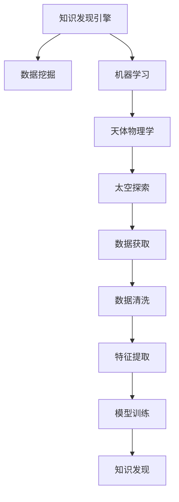

                 

# 知识发现引擎在太空探索中的应用

> 关键词：知识发现引擎, 太空探索, 数据挖掘, 机器学习, 天体物理学, 星体特征分析

## 1. 背景介绍

### 1.1 问题由来

太空探索是人类好奇心和技术进步的重要驱动力之一。随着技术的不断进步，我们对太空的认知范围正在不断扩大，从地球到太阳系，再到更远的宇宙，探索空间中的知识和信息成为了科学研究的重要目标。然而，太空数据通常以大数据的形式呈现，包含数PB甚至EB级别的大小，数据获取速度也在迅速增加。面对如此庞大的数据，如何高效地从中提取有用的信息，成为了一个严峻的挑战。

### 1.2 问题核心关键点

太空数据的特点在于其复杂性和多样性。空间数据包括图像、光谱、时序数据等多种类型，同时这些数据通常来自不同的观测仪器和传感器。因此，太空探索中数据挖掘和知识发现的挑战主要体现在以下几个方面：

1. **数据规模大**：太空中观测数据的规模庞大，需要高效的计算能力和存储能力。
2. **数据类型多**：数据类型包括图像、光谱、时序等，需要多种数据挖掘技术相结合。
3. **数据质量差**：太空观测数据可能存在噪声、缺失等问题，数据清洗和预处理是重要的一环。
4. **数据更新快**：太空数据不断更新，需要实时或近实时的数据处理和分析能力。

### 1.3 问题研究意义

高效的数据挖掘和知识发现对于太空探索具有重要意义，可以从以下几个方面来看：

1. **提升观测效率**：通过数据挖掘和分析，可以从海量观测数据中提取关键信息，优化观测策略，提高观测效率。
2. **发现新现象**：数据分析可以揭示出一些新现象或规律，为理论研究提供新视角。
3. **辅助决策**：在太空探索中，数据驱动的决策可以降低人为错误，提高决策的科学性和准确性。
4. **促进技术创新**：数据挖掘和分析技术的发展可以推动太空探索中其他相关技术的进步。

## 2. 核心概念与联系

### 2.1 核心概念概述

为更好地理解知识发现引擎在太空探索中的应用，本节将介绍几个密切相关的核心概念：

- **知识发现引擎**：一种用于从大量数据中提取有用信息和知识的软件工具，常用于商业智能、数据挖掘、机器学习等领域。
- **太空探索**：人类通过航天器或其他技术手段，对宇宙空间进行观测、探索和研究的活动。
- **数据挖掘**：从数据中提取有用信息和知识的过程，常用于处理结构化或非结构化数据。
- **机器学习**：通过算法让计算机系统从数据中自动学习，用于预测、分类、聚类等任务。
- **天体物理学**：研究宇宙中天体（如恒星、行星、黑洞等）的物理规律和性质的学科。

这些核心概念之间的逻辑关系可以通过以下Mermaid流程图来展示：



这个流程图展示了我国知识发现引擎和太空探索之间的联系：

1. 数据获取：通过航天器、望远镜等设备获取太空数据。
2. 数据清洗：对获取的数据进行清洗和预处理，去除噪声和缺失值。
3. 特征提取：从清洗后的数据中提取有用的特征，为后续分析做准备。
4. 模型训练：使用机器学习模型对提取的特征进行训练，学习数据中的模式和规律。
5. 知识发现：通过知识发现引擎对训练后的模型进行分析，发现新的知识或信息。
6. 太空探索：利用这些新发现的知识或信息，指导后续的太空探索活动。

## 3. 核心算法原理 & 具体操作步骤
### 3.1 算法原理概述

知识发现引擎在太空探索中的应用，本质上是一个数据挖掘和机器学习的过程。其核心思想是：利用数据挖掘技术从大量太空数据中提取有用的信息和知识，再通过机器学习模型对这些信息进行建模和分析，从而发现新的科学规律和现象。

形式化地，假设太空数据集为 $D=\{(x_i,y_i)\}_{i=1}^N$，其中 $x_i$ 为观测数据，$y_i$ 为标签或属性。知识发现引擎的目标是找到一个函数 $f(x)$，使得 $f(x)$ 在 $D$ 上具有最小的误差或最大化的分类准确率。因此，知识发现引擎的优化目标可以表示为：

$$
\min_{f} \mathcal{L}(f,D) + \lambda R(f)
$$

其中 $\mathcal{L}$ 为损失函数，$R$ 为正则化项，$\lambda$ 为正则化系数。

### 3.2 算法步骤详解

基于知识发现引擎的太空探索数据挖掘一般包括以下几个关键步骤：

**Step 1: 数据预处理**

- **数据获取**：通过航天器、望远镜等设备获取太空数据。
- **数据清洗**：对获取的数据进行清洗和预处理，去除噪声和缺失值。
- **数据标准化**：对数据进行标准化或归一化处理，确保数据的一致性和可比性。
- **特征选择**：从清洗后的数据中提取有用的特征，如光谱波长、亮度、时序变化等。

**Step 2: 模型训练**

- **特征提取**：使用特征提取技术，如PCA、LDA、Autoencoder等，对数据进行降维或提取代表性特征。
- **模型选择**：选择适合任务的机器学习模型，如回归、分类、聚类等。
- **模型训练**：使用训练数据集对模型进行训练，优化模型参数。

**Step 3: 知识发现**

- **模型评估**：使用验证集对模型进行评估，选择性能最好的模型。
- **知识提取**：通过知识发现引擎，从训练好的模型中提取有用的信息和知识，如星体特征、运动规律等。
- **结果可视化**：将发现的知识或信息以图表、报告等形式进行可视化展示，便于理解和解释。

**Step 4: 应用分析**

- **结果验证**：将知识发现结果应用于实际太空探索任务中，验证其效果和可靠性。
- **迭代优化**：根据应用结果，不断优化数据预处理、特征提取、模型训练等步骤，提升知识发现精度和效果。

### 3.3 算法优缺点

知识发现引擎在太空探索中的应用具有以下优点：

1. **自动化处理**：能够自动从大量数据中提取有用信息，减少人工干预。
2. **数据驱动**：通过数据分析发现新规律和新现象，提供数据驱动的决策支持。
3. **多模态融合**：可以处理多种类型的数据，如图像、光谱、时序等，实现多模态数据的融合分析。
4. **实时性**：具备实时或近实时处理能力，适应太空数据快速更新的特点。

同时，该方法也存在一定的局限性：

1. **数据质量影响**：数据质量的好坏直接影响知识发现的效果，需要高质量的数据和有效的预处理。
2. **模型复杂性**：选择合适的模型和优化参数需要一定的领域知识和经验。
3. **解释性不足**：机器学习模型的输出通常缺乏可解释性，需要结合领域知识进行解释。
4. **计算资源要求高**：处理大规模太空数据需要强大的计算资源支持。

尽管存在这些局限性，但知识发现引擎在太空探索中的应用正迅速发展，成为数据驱动科研的重要工具。

### 3.4 算法应用领域

知识发现引擎在太空探索中的应用，主要涵盖以下几个领域：

- **天体分类与特征分析**：通过机器学习模型对获取的太空数据进行分类和特征提取，识别不同天体的类型和特征。
- **运动轨迹预测**：使用时序分析方法，对天体运动轨迹进行预测和模拟，支持深空探测任务的规划和设计。
- **小行星探测**：通过数据挖掘技术，识别和跟踪小行星，评估其潜在危险。
- **星体物理参数测量**：利用光谱数据分析，测量恒星、行星等天体的物理参数，如温度、质量、距离等。
- **宇宙现象研究**：从大量观测数据中提取有用信息，揭示宇宙中的新现象和规律，如暗物质、暗能量等。

这些应用领域展示了知识发现引擎在太空探索中的广泛应用和巨大潜力。

## 4. 数学模型和公式 & 详细讲解  
### 4.1 数学模型构建

知识发现引擎在太空探索中的应用，主要涉及以下几个数学模型：

- **回归模型**：用于处理连续型数值型数据，预测天体物理参数等。
- **分类模型**：用于处理分类数据，如天体分类、星系类型等。
- **聚类模型**：用于处理无监督数据，发现数据中的群集和模式。

以下以回归模型为例，详细讲解其数学模型构建过程。

假设我们有太空数据集 $D=\{(x_i,y_i)\}_{i=1}^N$，其中 $x_i$ 为观测数据，$y_i$ 为标签或属性，目标是找到一个回归函数 $f(x)$ 使得 $f(x)$ 在 $D$ 上最小化误差 $\mathcal{L}(f,D)$。常用的回归模型包括线性回归、多项式回归、神经网络回归等。

线性回归模型的一般形式为：

$$
y_i = \beta_0 + \beta_1x_{i1} + \beta_2x_{i2} + ... + \beta_px_{ip} + \epsilon_i
$$

其中 $\beta_j$ 为回归系数，$\epsilon_i$ 为误差项，通常假设误差项满足正态分布 $N(0,\sigma^2)$。

线性回归的目标是最小化预测值和真实值之间的误差，即：

$$
\min_{\beta} \frac{1}{N}\sum_{i=1}^N (y_i - f(x_i))^2
$$

其中 $f(x_i) = \beta_0 + \beta_1x_{i1} + \beta_2x_{i2} + ... + \beta_px_{ip}$。

使用梯度下降法求解最小化问题，可以导出回归系数的求解公式：

$$
\hat{\beta} = (\sum_{i=1}^N x_i x_i^T)^{-1} \sum_{i=1}^N x_i y_i
$$

其中 $\hat{\beta}$ 为估计的回归系数。

### 4.2 公式推导过程

以下是回归模型公式的推导过程：

设回归模型为 $y_i = f(x_i) + \epsilon_i$，其中 $f(x_i) = \beta_0 + \beta_1x_{i1} + \beta_2x_{i2} + ... + \beta_px_{ip}$。

回归目标是最小化预测值和真实值之间的误差：

$$
\min_{\beta} \sum_{i=1}^N (y_i - f(x_i))^2
$$

对上式求偏导数，得到：

$$
\frac{\partial \mathcal{L}}{\partial \beta_j} = -2 \sum_{i=1}^N (y_i - f(x_i))x_{ij}
$$

令偏导数等于零，求解得：

$$
\hat{\beta} = (\sum_{i=1}^N x_i x_i^T)^{-1} \sum_{i=1}^N x_i y_i
$$

其中 $\hat{\beta}$ 为估计的回归系数。

### 4.3 案例分析与讲解

以天体的质量和距离为例，可以使用回归模型进行预测。假设观测数据 $D=\{(x_i,y_i)\}_{i=1}^N$ 包含天体的光谱数据和质量-距离参数，目标是在新观测的天体上使用该模型进行预测。

1. **数据预处理**：
   - 收集天体的光谱数据和质量-距离参数，进行标准化处理。
   - 分割数据集为训练集、验证集和测试集。

2. **模型训练**：
   - 使用训练集对回归模型进行训练，求解回归系数 $\hat{\beta}$。
   - 使用验证集评估模型性能，调整模型参数，避免过拟合。

3. **结果分析**：
   - 在新观测的天体上，输入其光谱数据，使用训练好的模型进行质量-距离预测。
   - 将预测结果与实际观测结果进行比较，评估模型精度和可靠性。

4. **模型优化**：
   - 根据预测结果和实际观测结果的误差，调整模型参数和特征选择策略，提升预测精度。

通过以上案例，可以看出回归模型在太空探索中的应用价值，能够在天体质量预测、距离测量等任务中发挥重要作用。

## 5. 项目实践：代码实例和详细解释说明
### 5.1 开发环境搭建

在进行太空探索数据挖掘的实践前，我们需要准备好开发环境。以下是使用Python进行Scikit-learn开发的环境配置流程：

1. 安装Anaconda：从官网下载并安装Anaconda，用于创建独立的Python环境。

2. 创建并激活虚拟环境：
```bash
conda create -n space-exploration python=3.8 
conda activate space-exploration
```

3. 安装Scikit-learn：
```bash
pip install scikit-learn
```

4. 安装TensorFlow：
```bash
pip install tensorflow
```

5. 安装其他工具包：
```bash
pip install numpy pandas matplotlib seaborn
```

完成上述步骤后，即可在`space-exploration`环境中开始太空探索数据挖掘实践。

### 5.2 源代码详细实现

这里我们以天体质量预测为例，使用Scikit-learn库对线性回归模型进行实践。

首先，定义数据处理函数：

```python
import pandas as pd
import numpy as np
from sklearn.model_selection import train_test_split
from sklearn.linear_model import LinearRegression
from sklearn.metrics import mean_squared_error, r2_score

# 读取数据集
data = pd.read_csv('data.csv', sep=',', header=None)
X = data.iloc[:, 1:].values
y = data.iloc[:, 0].values

# 数据标准化
from sklearn.preprocessing import StandardScaler
scaler = StandardScaler()
X = scaler.fit_transform(X)

# 分割数据集
X_train, X_test, y_train, y_test = train_test_split(X, y, test_size=0.2, random_state=42)

# 训练模型
model = LinearRegression()
model.fit(X_train, y_train)

# 预测结果
y_pred = model.predict(X_test)

# 评估模型
print('均方误差:', mean_squared_error(y_test, y_pred))
print('R^2系数:', r2_score(y_test, y_pred))
```

然后，定义模型训练和评估函数：

```python
from sklearn.metrics import mean_squared_error, r2_score

def train_model(X_train, y_train):
    model = LinearRegression()
    model.fit(X_train, y_train)
    return model

def evaluate_model(model, X_test, y_test):
    y_pred = model.predict(X_test)
    print('均方误差:', mean_squared_error(y_test, y_pred))
    print('R^2系数:', r2_score(y_test, y_pred))
```

最后，启动模型训练和评估流程：

```python
train_model(X_train, y_train)
evaluate_model(model, X_test, y_test)
```

以上就是使用Scikit-learn对线性回归模型进行太空探索数据挖掘的完整代码实现。可以看到，得益于Scikit-learn库的强大封装，我们可以用相对简洁的代码完成线性回归模型的训练和评估。

### 5.3 代码解读与分析

让我们再详细解读一下关键代码的实现细节：

**数据处理函数**：
- 读取数据集：使用Pandas库读取CSV格式的数据文件。
- 数据标准化：使用标准化方法将数据缩放到均值为0、标准差为1的区间，确保数据的一致性和可比性。
- 分割数据集：使用train_test_split函数将数据集分割为训练集和测试集。

**模型训练函数**：
- 模型训练：使用LinearRegression模型对训练集进行训练，得到回归系数。
- 模型预测：使用训练好的模型对测试集进行预测。

**模型评估函数**：
- 评估模型：使用均方误差和R^2系数评估模型预测结果的准确性。

**训练和评估流程**：
- 训练模型：使用train_model函数对训练集进行模型训练。
- 评估模型：使用evaluate_model函数对测试集进行模型评估，输出评估结果。

可以看到，Scikit-learn库使得太空探索数据挖掘的代码实现变得简洁高效。开发者可以将更多精力放在数据处理、模型改进等高层逻辑上，而不必过多关注底层的实现细节。

当然，工业级的系统实现还需考虑更多因素，如模型的保存和部署、超参数的自动搜索、更灵活的任务适配层等。但核心的数据挖掘范式基本与此类似。

## 6. 实际应用场景
### 6.1 智能探测器决策

太空探索中的智能探测器需要根据实时观测数据进行决策，如是否进入新的星系、是否采集样本等。通过知识发现引擎，可以从大量的观测数据中提取有用的信息和知识，指导智能探测器做出科学合理的决策。

在技术实现上，可以收集探测器实时传回的观测数据，将其输入知识发现引擎进行处理。知识发现引擎可以根据观测数据中提取的特征，对探测器的行为进行分类和预测，支持探测器做出最佳决策。例如，如果探测器观测到一个新的星系，知识发现引擎可以分析该星系的光谱数据、运动特征等，预测其是否适合进行更深入的研究，指导探测器是否进入该星系。

### 6.2 深空探测任务规划

深空探测任务通常需要复杂的规划和设计，如路径选择、燃料消耗等。知识发现引擎可以通过对历史数据进行分析，提供基于数据的决策支持，优化探测任务的设计和规划。

在技术实现上，可以收集历史上深空探测任务的数据，包括路径选择、燃料消耗、任务完成情况等。知识发现引擎可以通过对历史数据进行分析，发现最佳的路径选择和燃料消耗策略，为未来的深空探测任务提供参考。例如，如果知识发现引擎发现某条路径的燃料消耗最低，可以将这条路径作为未来探测任务的参考路径，提高任务的成功率和经济性。

### 6.3 小行星监测和防御

小行星监测和防御是太空探索中的重要任务之一。通过知识发现引擎，可以从大量的观测数据中提取有用的信息，实时监测小行星的位置、大小、速度等，评估其潜在威胁，辅助进行防御决策。

在技术实现上，可以收集小行星的观测数据，包括其位置、大小、速度等。知识发现引擎可以通过对观测数据进行分析，预测小行星的移动轨迹和撞击可能性，为防御措施提供参考。例如，如果知识发现引擎预测某小行星有撞击地球的风险，可以提前制定防御措施，减少潜在的风险。

### 6.4 未来应用展望

随着知识发现引擎和机器学习技术的不断发展，其在太空探索中的应用将更加广泛和深入。未来可能涉及以下几个领域：

- **行星探测**：通过数据挖掘和分析，研究行星的组成、地质结构、气候条件等，支持行星探测任务的设计和规划。
- **宇宙生命探索**：利用数据挖掘技术，寻找可能的生命迹象，如信号分析、辐射检测等。
- **多天体系统研究**：通过多天体数据的综合分析，研究星系、双星系统、黑洞等天体的动力学和演化规律。
- **宇宙物质组成分析**：利用光谱分析技术，研究宇宙中的元素组成和分布，支持物质合成和天文学研究。

这些领域的研究将进一步推动人类对宇宙的认知，拓展太空探索的边界，带来更多的科学发现和技术突破。

## 7. 工具和资源推荐
### 7.1 学习资源推荐

为了帮助开发者系统掌握知识发现引擎在太空探索中的应用，这里推荐一些优质的学习资源：

1. 《机器学习基础》系列课程：由李宏毅教授开设的机器学习基础课程，内容涵盖回归、分类、聚类等机器学习算法，适合初学者入门。
2. 《数据挖掘与统计学习》课程：由清华大学开设的统计学习课程，介绍了数据挖掘的基本概念和常用技术。
3. 《深度学习》系列书籍：由Ian Goodfellow等著，详细介绍了深度学习的基本原理和应用场景。
4. 《TensorFlow实战》书籍：由王晋东等著，介绍了TensorFlow的高级应用，包括机器学习模型的实现和调优。
5. 《Python机器学习》书籍：由Sebastian Raschka等著，介绍了Python在机器学习中的应用，适合实战开发。

通过对这些资源的学习实践，相信你一定能够快速掌握知识发现引擎在太空探索中的应用，并用于解决实际的太空探索问题。

### 7.2 开发工具推荐

高效的开发离不开优秀的工具支持。以下是几款用于太空探索数据挖掘开发的常用工具：

1. Python：基于Python的太空探索数据挖掘开发，具备丰富的库和框架支持，如Scikit-learn、TensorFlow等。
2. Jupyter Notebook：交互式编程环境，方便代码调试和数据可视化，适合开发和研究。
3. Matplotlib：数据可视化库，支持绘制各种类型的图表，帮助理解和分析数据。
4. Pandas：数据处理库，提供数据清洗、分割、聚合等功能，适合处理和分析大规模数据集。
5. Seaborn：基于Matplotlib的高级数据可视化库，支持统计图表的绘制，便于数据可视化分析。

合理利用这些工具，可以显著提升太空探索数据挖掘的开发效率，加快创新迭代的步伐。

### 7.3 相关论文推荐

知识发现引擎和机器学习技术的发展源于学界的持续研究。以下是几篇奠基性的相关论文，推荐阅读：

1. SVM: Support Vector Machine in Probability Space（支持向量机在概率空间的应用）：1990年Vapnik和Cortes提出的支持向量机算法，在分类和回归任务中具有重要应用。
2. k-means Clustering（k-means聚类算法）：1977年MacQueen提出的聚类算法，常用于无监督数据挖掘任务。
3. Decision Trees and Random Forests（决策树和随机森林）：1986年Quinlan提出的决策树算法，和1995年Breiman等提出的随机森林算法，广泛应用于分类和回归任务。
4. AdaBoost Algorithm（AdaBoost算法）：1995年Freund和Schapire提出的集成学习算法，通过组合多个弱学习器提升模型性能。
5. GAN: Generative Adversarial Networks（生成对抗网络）：2014年Goodfellow等提出的生成对抗网络算法，用于生成具有高保真度的数据。

这些论文代表了大数据挖掘和机器学习技术的发展脉络。通过学习这些前沿成果，可以帮助研究者把握学科前进方向，激发更多的创新灵感。

## 8. 总结：未来发展趋势与挑战

### 8.1 总结

本文对知识发现引擎在太空探索中的应用进行了全面系统的介绍。首先阐述了知识发现引擎和太空探索的结合背景和意义，明确了数据挖掘在太空探索中的关键作用。其次，从原理到实践，详细讲解了知识发现引擎的应用流程和关键步骤，给出了太空探索数据挖掘的完整代码实现。同时，本文还广泛探讨了知识发现引擎在太空探索中的应用场景，展示了其在智能探测器决策、深空探测任务规划、小行星监测和防御等多个领域的应用前景。此外，本文精选了知识发现引擎的相关学习资源和开发工具，力求为读者提供全方位的技术指引。

通过本文的系统梳理，可以看到，知识发现引擎在太空探索中的应用前景广阔，数据驱动的科研正迅速崛起。面向未来，知识发现引擎将在多个领域发挥重要作用，推动太空探索技术的进步。

### 8.2 未来发展趋势

知识发现引擎在太空探索中的应用将呈现以下几个发展趋势：

1. **数据规模扩大**：随着太空探测任务的不断推进，获取的数据量将持续增加，知识发现引擎需要具备处理大规模数据的能力。
2. **算法多样化**：未来的算法将更加多样化和复杂化，结合深度学习、强化学习等技术，提升模型的预测精度和鲁棒性。
3. **模型自动化**：知识发现引擎将具备更强的自动化和智能化功能，能够自动选择最优算法、优化参数，适应复杂的数据环境。
4. **跨领域融合**：知识发现引擎将与其他人工智能技术进行更深入的融合，如计算机视觉、自然语言处理等，实现多模态数据的协同分析。
5. **实时化处理**：知识发现引擎将具备实时处理数据的能力，支持近实时的太空探索决策。
6. **可解释性增强**：未来的知识发现引擎将更加注重可解释性，能够提供清晰、可理解的结果解释，提升用户对模型的信任和接受度。

这些趋势展示了知识发现引擎在太空探索中的未来发展方向，相信未来的技术将进一步提升太空探索的效率和科学性。

### 8.3 面临的挑战

尽管知识发现引擎在太空探索中的应用取得了一定的进展，但仍面临诸多挑战：

1. **数据质量问题**：太空数据存在噪声、缺失等问题，如何有效清洗和预处理数据是关键。
2. **模型复杂性**：选择适合的算法和优化参数需要一定的领域知识和经验。
3. **计算资源需求高**：处理大规模数据需要强大的计算资源支持，如何优化算法和模型，减少计算开销，是重要的研究方向。
4. **可解释性不足**：机器学习模型的输出通常缺乏可解释性，需要结合领域知识进行解释。
5. **安全性问题**：太空数据可能包含敏感信息，如何保护数据安全，避免信息泄露，是重要课题。
6. **跨学科知识缺乏**：数据挖掘和机器学习技术需要与其他领域（如天文学、物理学）相结合，跨学科知识不足是主要障碍。

这些挑战需要在未来的研究中加以解决，才能推动知识发现引擎在太空探索中的应用走向成熟。

### 8.4 研究展望

面向未来，知识发现引擎在太空探索中的应用研究需要在以下几个方面寻求新的突破：

1. **数据预处理技术**：开发更加高效的数据清洗和预处理技术，确保数据质量。
2. **多模态融合算法**：研究多模态数据的协同分析算法，提升模型的综合能力。
3. **深度学习模型优化**：优化深度学习模型的结构和参数，提升模型的预测精度和鲁棒性。
4. **实时处理技术**：研究实时数据处理技术，支持近实时的太空探索决策。
5. **可解释性增强**：开发更加可解释的模型，提供清晰、可理解的结果解释。
6. **跨学科知识整合**：将数据挖掘和机器学习技术与其他领域知识相结合，提升模型的应用效果。

这些研究方向的探索，必将引领知识发现引擎在太空探索中的应用走向更高的台阶，为人类对宇宙的认知和探索带来新的突破。

## 9. 附录：常见问题与解答

**Q1：知识发现引擎在太空探索中的应用有哪些优势？**

A: 知识发现引擎在太空探索中的应用主要具有以下优势：
1. 能够自动从大量数据中提取有用信息，减少人工干预。
2. 提供数据驱动的决策支持，提升决策的科学性和准确性。
3. 支持多模态数据的综合分析，提升模型的预测精度和鲁棒性。
4. 具备实时处理数据的能力，支持近实时的太空探索决策。
5. 能够提供清晰、可理解的结果解释，提升用户对模型的信任和接受度。

**Q2：数据清洗和预处理在太空探索中有什么重要性？**

A: 数据清洗和预处理在太空探索中具有重要意义，主要体现在以下几个方面：
1. 去除噪声和缺失值，确保数据质量。
2. 进行标准化和归一化处理，确保数据的一致性和可比性。
3. 选择适合的特征提取方法，确保特征的有效性和代表性。
4. 进行数据分割和采样，确保数据集的多样性和代表性。

**Q3：知识发现引擎在太空探索中面临哪些技术挑战？**

A: 知识发现引擎在太空探索中面临以下技术挑战：
1. 数据质量问题：太空数据存在噪声、缺失等问题，需要有效的数据清洗和预处理技术。
2. 模型复杂性：选择适合的算法和优化参数需要一定的领域知识和经验。
3. 计算资源需求高：处理大规模数据需要强大的计算资源支持，如何优化算法和模型，减少计算开销，是重要的研究方向。
4. 可解释性不足：机器学习模型的输出通常缺乏可解释性，需要结合领域知识进行解释。
5. 安全性问题：太空数据可能包含敏感信息，如何保护数据安全，避免信息泄露，是重要课题。
6. 跨学科知识缺乏：数据挖掘和机器学习技术需要与其他领域（如天文学、物理学）相结合，跨学科知识不足是主要障碍。

**Q4：知识发现引擎在太空探索中有哪些应用场景？**

A: 知识发现引擎在太空探索中有以下应用场景：
1. 智能探测器决策：通过数据挖掘和分析，指导智能探测器做出科学合理的决策。
2. 深空探测任务规划：通过数据挖掘技术，优化探测任务的设计和规划。
3. 小行星监测和防御：通过数据挖掘技术，实时监测小行星的位置、大小、速度等，辅助进行防御决策。
4. 行星探测：通过数据挖掘技术，研究行星的组成、地质结构、气候条件等，支持行星探测任务的设计和规划。
5. 宇宙生命探索：利用数据挖掘技术，寻找可能的生命迹象，如信号分析、辐射检测等。
6. 多天体系统研究：通过多天体数据的综合分析，研究星系、双星系统、黑洞等天体的动力学和演化规律。
7. 宇宙物质组成分析：利用光谱分析技术，研究宇宙中的元素组成和分布，支持物质合成和天文学研究。

**Q5：知识发现引擎在太空探索中需要哪些关键技术？**

A: 知识发现引擎在太空探索中需要以下关键技术：
1. 数据预处理技术：用于数据清洗、标准化、特征提取等。
2. 数据挖掘算法：用于从数据中提取有用的信息和知识。
3. 机器学习算法：用于建立模型和优化模型参数。
4. 实时处理技术：用于支持近实时的太空探索决策。
5. 可解释性增强技术：用于提供清晰、可理解的结果解释。
6. 跨学科知识整合技术：用于将数据挖掘和机器学习技术与其他领域知识相结合，提升模型的应用效果。

这些关键技术是知识发现引擎在太空探索中不可或缺的，需要不断优化和完善。

