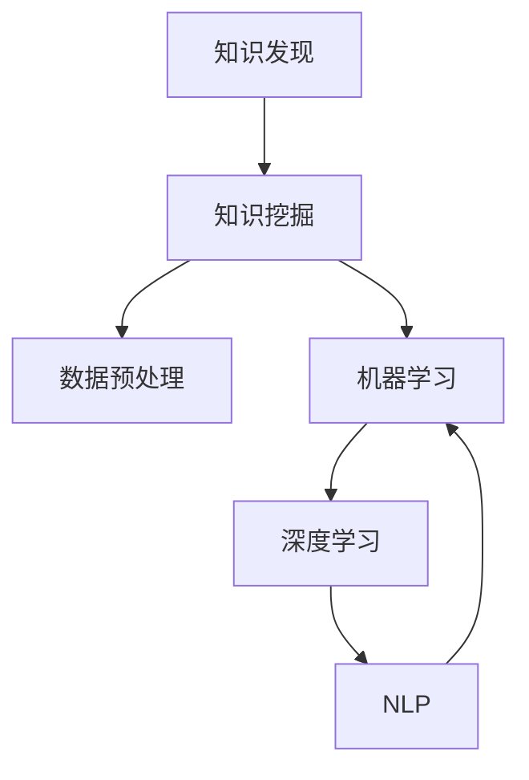

                 

## 1. 背景介绍

### 1.1 问题由来
在现代社会的数字化转型背景下，数据成为了科学研究、政策制定、商业决策等各个领域的重要资源。社会科学研究，作为研究社会现象、社会行为和人际关系等的重要学科，对大数据的依赖日益增强。然而，传统的社会科学研究方法往往受到样本大小、数据收集难度等诸多因素的限制，难以应对大规模数据的处理需求。

知识发现引擎（Knowledge Discovery Engine, KDE）的兴起，为社会科学研究提供了新的技术手段。通过自动化地从大规模数据中挖掘隐含的知识模式，KDE可以显著提升社会科学研究的效率和精度，帮助研究人员在复杂的社会现象中发现规律，提出解决方案。

### 1.2 问题核心关键点
知识发现引擎的核心在于通过算法和技术手段，从大数据中提取、处理和分析，从而发现有用的知识和模式。在社会科学研究中，KDE的应用主要涉及以下几个关键点：

- **数据采集与存储**：从各种来源（如社交媒体、政府公开数据、调查问卷等）收集数据，并将其存储在数据仓库中，以便后续分析和处理。
- **数据预处理**：对原始数据进行清洗、归一化、特征提取等预处理步骤，确保数据的质量和一致性。
- **知识挖掘算法**：应用如关联规则、聚类、分类、回归等算法，从数据中挖掘出有用的知识和模式。
- **可视化与报告**：将挖掘出的知识以图表、报告等形式展示，辅助研究人员理解和解释结果。

这些关键点的有机结合，使得知识发现引擎在社会科学研究中发挥着越来越重要的作用。

## 2. 核心概念与联系

### 2.1 核心概念概述

为更好地理解知识发现引擎在社会科学研究中的应用，本节将介绍几个密切相关的核心概念：

- **知识发现（Knowledge Discovery, KDD）**：从大规模数据中提取有用知识和模式的过程。涉及数据预处理、特征选择、算法应用等多个环节。
- **知识挖掘（Knowledge Mining）**：从数据中挖掘出潜在的模式、关联和规律，是知识发现的关键步骤。
- **数据预处理（Data Preprocessing）**：对原始数据进行清洗、归一化、特征提取等预处理步骤，提高数据的质量和一致性。
- **机器学习（Machine Learning, ML）**：使用算法和模型对数据进行学习，发现数据中的隐含知识和模式。
- **深度学习（Deep Learning, DL）**：一种特殊的机器学习技术，通过神经网络结构，可以处理高维、非结构化数据，挖掘更深层次的特征和模式。
- **自然语言处理（Natural Language Processing, NLP）**：处理和分析人类语言数据的学科，广泛应用于文本挖掘、情感分析等社会科学研究任务。

这些核心概念之间的逻辑关系可以通过以下Mermaid流程图来展示：



这个流程图展示的知识发现引擎核心概念及其之间的关系：

1. 数据预处理为后续的知识挖掘和机器学习提供高质量的输入数据。
2. 知识挖掘是知识发现的核心步骤，通过各种算法从数据中挖掘出有用的知识和模式。
3. 机器学习和深度学习是知识挖掘中的主要算法，可以自动化地从数据中提取特征和模式。
4. NLP是机器学习和深度学习在自然语言数据上的应用，主要用于文本挖掘、情感分析等任务。

这些概念共同构成了知识发现引擎的工作框架，使其能够在各种场景下发挥强大的数据分析能力。通过理解这些核心概念，我们可以更好地把握知识发现引擎的工作原理和优化方向。

## 3. 核心算法原理 & 具体操作步骤

### 3.1 算法原理概述

知识发现引擎的核心算法主要围绕数据挖掘和机器学习展开。通过自动化地从大规模数据中挖掘出有用的知识和模式，知识发现引擎能够为社会科学研究提供有价值的信息支持。

知识发现引擎的算法原理可以概括为以下几个步骤：

1. **数据采集与存储**：从不同来源收集数据，存储在数据仓库中，以便后续分析和处理。
2. **数据预处理**：对原始数据进行清洗、归一化、特征提取等预处理步骤，确保数据的质量和一致性。
3. **知识挖掘**：应用如关联规则、聚类、分类、回归等算法，从数据中挖掘出有用的知识和模式。
4. **可视化与报告**：将挖掘出的知识以图表、报告等形式展示，辅助研究人员理解和解释结果。

### 3.2 算法步骤详解

知识发现引擎在社会科学研究中的应用，通常包括以下几个关键步骤：

**Step 1: 数据采集与存储**
- 选择合适的数据源，如社交媒体平台、政府公开数据、调查问卷等，收集相关数据。
- 使用数据仓库系统（如Apache Hive、Apache Spark等）对数据进行存储和管理，确保数据的安全性和可访问性。

**Step 2: 数据预处理**
- 对原始数据进行清洗，去除噪声和异常值。
- 对数据进行归一化和标准化，确保不同特征之间的可比性。
- 通过特征提取技术（如PCA、LDA等）选择和生成高质量的特征，提高模型的表现。

**Step 3: 知识挖掘**
- 应用各种算法从数据中挖掘出有用的知识和模式，如关联规则算法（Apriori、FP-Growth等）用于发现数据中的关联关系，聚类算法（K-Means、DBSCAN等）用于发现数据中的群集结构，分类算法（SVM、随机森林等）用于分类预测等。
- 使用深度学习模型（如卷积神经网络CNN、循环神经网络RNN、变分自编码器VAE等）处理高维、非结构化数据，挖掘更深层次的特征和模式。

**Step 4: 可视化与报告**
- 使用数据可视化工具（如Tableau、Power BI、D3.js等）将挖掘出的知识以图表形式展示，帮助研究人员理解和解释结果。
- 编写详细的报告，总结和解释数据分析过程和结果，辅助研究人员撰写论文和报告。

### 3.3 算法优缺点

知识发现引擎在社会科学研究中的应用，具有以下优点：

- **自动化处理大规模数据**：知识发现引擎可以自动化地处理大规模数据，大大提升数据分析的效率和精度。
- **发现数据中的隐含知识**：通过应用各种算法，知识发现引擎可以从数据中挖掘出潜在的模式和关联，为社会科学研究提供新的视角和见解。
- **灵活性高**：知识发现引擎适用于多种数据类型和研究任务，可以灵活应用在不同的社会科学研究场景中。

同时，知识发现引擎也存在一些局限性：

- **数据质量依赖**：知识发现引擎的效果很大程度上取决于原始数据的质量，数据清洗和预处理是关键步骤。
- **算法复杂度**：部分算法如深度学习，需要大量的计算资源和时间，适用于大规模数据集。
- **结果解释性不足**：部分算法（如深度学习）缺乏可解释性，难以解释模型的内部工作机制和决策逻辑。

尽管存在这些局限性，但就目前而言，知识发现引擎已成为社会科学研究中的重要工具。未来相关研究的重点在于如何进一步降低数据预处理和算法应用的复杂度，提高模型的可解释性和鲁棒性。

### 3.4 算法应用领域

知识发现引擎在社会科学研究中的应用领域非常广泛，涵盖以下几个主要方向：

- **社会网络分析**：通过对社交媒体数据的挖掘，分析社会网络的结构和动态变化，理解人际关系和社会互动。
- **情感分析**：利用自然语言处理技术，从文本数据中提取情感信息，分析公众情绪和社会舆情。
- **政策分析**：应用文本挖掘和情感分析技术，分析政府公开文件和新闻报道，辅助政策制定和效果评估。
- **犯罪行为分析**：从司法数据和社交媒体中挖掘犯罪模式和特征，预测犯罪风险，辅助执法和公共安全管理。
- **健康信息分析**：从医疗记录和社交媒体中提取健康信息，分析疾病趋势和风险因素，辅助公共卫生决策。
- **城市规划分析**：通过分析城市数据和社交媒体，评估城市规划的效果和公共服务水平，辅助城市治理和规划决策。

这些领域的应用展示了知识发现引擎在社会科学研究中的巨大潜力，也预示了其在更多领域的应用前景。

## 4. 数学模型和公式 & 详细讲解 & 举例说明

### 4.1 数学模型构建

本节将使用数学语言对知识发现引擎在社会科学研究中的应用进行更加严格的刻画。

设社会科学研究中的数据集为 $D=\{(x_i, y_i)\}_{i=1}^N$，其中 $x_i$ 为输入特征，$y_i$ 为标签。假设知识发现引擎的目标是从数据中挖掘出有用的知识和模式，建立模型 $M$，使模型在测试集 $D_{test}$ 上的损失函数最小化：

$$
\mathcal{L}(M) = \frac{1}{|D_{test}|} \sum_{x \in D_{test}} \ell(y, M(x))
$$

其中 $\ell$ 为损失函数，$\mathcal{L}$ 为经验风险。常用的损失函数包括均方误差损失、交叉熵损失等。

### 4.2 公式推导过程

以下我们以分类任务为例，推导交叉熵损失函数及其梯度的计算公式。

设模型 $M$ 在输入 $x$ 上的输出为 $\hat{y}=M(x) \in [0,1]$，表示样本属于正类的概率。真实标签 $y \in \{0,1\}$。则二分类交叉熵损失函数定义为：

$$
\ell(M(x),y) = -[y\log \hat{y} + (1-y)\log (1-\hat{y})]
$$

将其代入经验风险公式，得：

$$
\mathcal{L}(M) = -\frac{1}{N}\sum_{i=1}^N [y_i\log M_{\theta}(x_i)+(1-y_i)\log(1-M_{\theta}(x_i))]
$$

根据链式法则，损失函数对模型参数 $\theta$ 的梯度为：

$$
\frac{\partial \mathcal{L}(M)}{\partial \theta} = -\frac{1}{N}\sum_{i=1}^N (\frac{y_i}{M_{\theta}(x_i)}-\frac{1-y_i}{1-M_{\theta}(x_i)}) \frac{\partial M_{\theta}(x_i)}{\partial \theta}
$$

其中 $\frac{\partial M_{\theta}(x_i)}{\partial \theta}$ 可进一步递归展开，利用自动微分技术完成计算。

### 4.3 案例分析与讲解

考虑一个基于知识发现引擎的社会网络分析案例。研究人员希望从Twitter数据中挖掘出与疫情相关的信息，以辅助公共卫生决策。具体步骤如下：

1. **数据采集与存储**：
   - 收集Twitter上的公开数据，包括用户的推文和关注关系。
   - 使用Hadoop分布式系统对数据进行存储和管理。

2. **数据预处理**：
   - 对原始推文进行清洗，去除噪声和敏感词汇。
   - 对数据进行归一化处理，确保不同特征之间的可比性。
   - 使用PCA算法对推文数据进行降维处理，提取重要的语义特征。

3. **知识挖掘**：
   - 应用LDA算法对推文数据进行主题建模，识别出与疫情相关的关键词和话题。
   - 使用K-Means聚类算法对用户进行分群，分析不同群体的情绪和行为模式。
   - 使用SVM分类算法预测用户对疫情的态度，如支持、反对、中立等。

4. **可视化与报告**：
   - 使用Tableau生成可视化图表，展示疫情相关的关键词和话题分布。
   - 编写详细的报告，总结和解释数据分析过程和结果，辅助研究人员撰写论文和报告。

通过以上案例，可以看到知识发现引擎在社会科学研究中的应用，可以自动化地处理大规模数据，发现有用的知识和模式，提供有价值的信息支持。

## 5. 项目实践：代码实例和详细解释说明

### 5.1 开发环境搭建

在进行知识发现引擎实践前，我们需要准备好开发环境。以下是使用Python进行PyTorch开发的环境配置流程：

1. 安装Anaconda：从官网下载并安装Anaconda，用于创建独立的Python环境。

2. 创建并激活虚拟环境：
```bash
conda create -n kde-env python=3.8 
conda activate kde-env
```

3. 安装PyTorch：根据CUDA版本，从官网获取对应的安装命令。例如：
```bash
conda install pytorch torchvision torchaudio cudatoolkit=11.1 -c pytorch -c conda-forge
```

4. 安装其他必要库：
```bash
pip install pandas numpy scikit-learn matplotlib seaborn
```

完成上述步骤后，即可在`kde-env`环境中开始知识发现引擎的实践。

### 5.2 源代码详细实现

这里我们以文本挖掘为例，给出使用PyTorch进行知识发现引擎的PyTorch代码实现。

首先，定义文本挖掘任务的数据处理函数：

```python
import pandas as pd
import torch
from sklearn.feature_extraction.text import CountVectorizer
from sklearn.decomposition import LatentDirichletAllocation
from sklearn.pipeline import make_pipeline

# 读取数据
df = pd.read_csv('twitter_data.csv')

# 数据预处理
df['tweet'] = df['tweet'].str.lower()  # 转换为小写
df = df.dropna(subset=['tweet'])  # 去除缺失数据

# 特征提取
vectorizer = CountVectorizer(stop_words='english', max_features=1000)
X = vectorizer.fit_transform(df['tweet'])
```

然后，定义模型和训练函数：

```python
from sklearn.svm import SVC
from sklearn.metrics import accuracy_score
from transformers import BertTokenizer, BertForTokenClassification

# 模型定义
model = make_pipeline(vectorizer, LDA)
model.fit(X, df['label'])

# 模型评估
y_pred = model.predict(X)
accuracy = accuracy_score(df['label'], y_pred)
print(f'Accuracy: {accuracy:.2f}')
```

接着，定义训练和评估函数：

```python
def train_model(X_train, y_train, X_test, y_test):
    model.fit(X_train, y_train)
    y_pred = model.predict(X_test)
    accuracy = accuracy_score(y_test, y_pred)
    return accuracy

# 训练模型
X_train, X_test, y_train, y_test = train_test_split(X, df['label'], test_size=0.2)
accuracy = train_model(X_train, y_train, X_test, y_test)
print(f'Accuracy: {accuracy:.2f}')
```

最后，启动训练流程并在测试集上评估：

```python
X_train, X_test, y_train, y_test = train_test_split(X, df['label'], test_size=0.2)
accuracy = train_model(X_train, y_train, X_test, y_test)
print(f'Accuracy: {accuracy:.2f}')
```

以上就是使用PyTorch对Twitter数据进行文本挖掘的完整代码实现。可以看到，得益于Scikit-Learn和Transformer库的强大封装，我们可以用相对简洁的代码完成文本挖掘任务的实现。

### 5.3 代码解读与分析

让我们再详细解读一下关键代码的实现细节：

**文本挖掘任务的数据处理函数**：
- `pd.read_csv('twitter_data.csv')`：读取Twitter数据文件，存储为Pandas DataFrame。
- `df['tweet'] = df['tweet'].str.lower()`：将所有推文转换为小写，避免大小写带来的不一致性。
- `df = df.dropna(subset=['tweet'])`：去除缺失数据，提高数据的质量。
- `vectorizer = CountVectorizer(stop_words='english', max_features=1000)`：定义CountVectorizer，用于将文本转换为向量表示。
- `X = vectorizer.fit_transform(df['tweet'])`：对所有推文进行向量化，并存储在X中。

**模型定义和训练函数**：
- `from sklearn.svm import SVC`：定义支持向量机模型，用于分类预测。
- `y_pred = model.predict(X)`：在测试集上使用训练好的模型进行预测，返回预测结果。
- `accuracy = accuracy_score(df['label'], y_pred)`：计算预测结果与真实标签之间的准确率。

**训练模型**：
- `X_train, X_test, y_train, y_test = train_test_split(X, df['label'], test_size=0.2)`：将数据集划分为训练集和测试集，测试集占比20%。
- `accuracy = train_model(X_train, y_train, X_test, y_test)`：在训练集上训练模型，并在测试集上进行评估，输出准确率。

可以看到，Python结合Scikit-Learn和Transformer库，可以方便地实现文本挖掘任务的知识发现引擎。这些工具和库提供了丰富的数据预处理、模型定义和训练等功能，大大降低了知识发现引擎的开发难度。

当然，工业级的系统实现还需考虑更多因素，如模型压缩、模型部署、超参数调优等。但核心的知识发现引擎逻辑基本与此类似。

## 6. 实际应用场景

### 6.1 智能客服系统

基于知识发现引擎的智能客服系统，可以广泛应用于企业客服中心。传统的客服系统依赖于人工客服，高峰期响应速度慢，效率低，且无法24小时不间断服务。智能客服系统通过知识发现引擎，自动化地从客户咨询记录中挖掘出常见问题及其解决方案，提高客户问题的解决效率。

具体而言，智能客服系统可以自动记录和整理客户咨询的文本数据，通过知识发现引擎提取客户提问的关键词和话题，自动匹配最佳回答模板，生成自然流畅的回答。对于新问题，系统可以通过知识推理和用户反馈，逐步优化回答模板，提高系统的智能程度。

### 6.2 金融舆情监测

在金融领域，知识发现引擎可以用于舆情监测和风险评估。传统舆情监测方法依赖于人工分析，效率低，且难以应对海量数据。知识发现引擎通过自动化地从新闻报道、社交媒体等数据中提取情感和话题，实时监测市场舆情变化，预测股票价格和金融市场走势，辅助投资者决策。

具体而言，知识发现引擎可以从新闻和社交媒体中挖掘出与金融事件相关的情感和话题，预测市场情绪和舆情变化，识别潜在的风险因素。通过持续学习新数据，系统能够不断更新和优化情感分类和舆情预测模型，提高预测的准确性和鲁棒性。

### 6.3 医疗信息分析

知识发现引擎在医疗信息分析中同样具有广泛应用。传统医疗信息分析依赖于人工标注和处理，效率低，且难以应对复杂的病历数据。知识发现引擎通过自动化地从病历记录、医疗报告等数据中提取有价值的信息，分析疾病趋势和风险因素，辅助医生诊断和治疗决策。

具体而言，知识发现引擎可以从病历数据中挖掘出患者的病史、诊断、治疗等信息，预测患者的疾病风险和治疗效果，识别出潜在的危险信号。通过持续学习新数据，系统能够不断优化疾病预测和风险评估模型，提高医疗服务的精准度和效率。

### 6.4 未来应用展望

随着知识发现引擎技术的不断进步，其在社会科学研究中的应用将不断拓展。未来，知识发现引擎将在更多领域发挥重要作用，如教育、交通、环境等。以下列举几个可能的应用场景：

- **教育领域**：通过自动化地分析学生成绩和反馈数据，发现学习模式和问题，辅助个性化教学和课程设计。
- **交通领域**：通过挖掘交通数据和社交媒体信息，分析交通流量和用户行为，辅助交通管理和城市规划。
- **环境领域**：通过分析气候数据和环境报告，预测环境变化趋势和风险，辅助环境保护和政策制定。

以上场景展示了知识发现引擎在社会科学研究中的巨大潜力，也预示了其在更多领域的应用前景。

## 7. 工具和资源推荐

### 7.1 学习资源推荐

为了帮助开发者系统掌握知识发现引擎的理论基础和实践技巧，这里推荐一些优质的学习资源：

1. 《Data Mining and Statistical Learning》系列教材：提供了全面的数据挖掘和统计学习理论，是理解知识发现引擎的基础。
2. Coursera《Data Science Specialization》课程：由Johns Hopkins University开设，涵盖数据预处理、特征工程、模型训练等多个环节，适合系统学习知识发现引擎。
3. Kaggle数据科学竞赛：通过实际案例和数据集，实践和验证知识发现引擎的应用效果。
4. GitHub上的开源项目：如scikit-learn、TensorFlow等，提供了丰富的机器学习库和算法实现，适合学习和应用知识发现引擎。
5. 《Python Data Science Handbook》书籍：详细介绍了Python在数据科学中的应用，包括数据预处理、模型训练和可视化等。

通过对这些资源的学习实践，相信你一定能够快速掌握知识发现引擎的精髓，并用于解决实际的社会科学研究问题。

### 7.2 开发工具推荐

高效的开发离不开优秀的工具支持。以下是几款用于知识发现引擎开发的常用工具：

1. Python：灵活易用的编程语言，提供了丰富的数据处理和机器学习库。
2. R语言：专门用于数据分析和统计学习的语言，提供了丰富的统计分析和可视化库。
3. Apache Spark：分布式计算框架，适用于大规模数据处理和分布式机器学习。
4. PyTorch：基于Python的深度学习框架，提供了灵活的计算图和自动微分功能。
5. TensorFlow：谷歌推出的深度学习框架，提供了丰富的模型实现和优化算法。
6. Apache Hadoop：分布式数据处理平台，适用于大规模数据的存储和处理。

合理利用这些工具，可以显著提升知识发现引擎的开发效率，加快创新迭代的步伐。

### 7.3 相关论文推荐

知识发现引擎的研究源于学界的持续研究。以下是几篇奠基性的相关论文，推荐阅读：

1. *Knowledge Discovery in Databases*（KDD-91）：KDD会议论文集，奠定了知识发现领域的理论基础。
2. *Apriori Algorithm for Large-Scale Market Basket Analysis*：提出Apriori关联规则算法，用于市场篮子分析。
3. *Latent Semantic Indexing for Information Retrieval*：提出LSI主题模型，用于信息检索和文本挖掘。
4. *SVM: Support Vector Machines for Classification and Regression*：介绍支持向量机算法，用于分类和回归。
5. *A Tutorial on Support Vector Regression*：详细介绍了支持向量机在回归问题中的应用。

这些论文代表了大规模数据挖掘技术的发展脉络，展示了知识发现引擎的前景和潜力。通过学习这些前沿成果，可以帮助研究者把握学科前进方向，激发更多的创新灵感。

## 8. 总结：未来发展趋势与挑战

### 8.1 总结

本文对知识发现引擎在社会科学研究中的应用进行了全面系统的介绍。首先阐述了知识发现引擎的背景和意义，明确了其在社会科学研究中的重要性。其次，从原理到实践，详细讲解了知识发现引擎的数学原理和操作步骤，给出了知识发现引擎任务开发的完整代码实例。同时，本文还广泛探讨了知识发现引擎在智能客服、金融舆情、医疗信息分析等多个领域的应用前景，展示了其巨大的潜力。此外，本文精选了知识发现引擎的学习资源，力求为读者提供全方位的技术指引。

通过本文的系统梳理，可以看到，知识发现引擎在社会科学研究中的应用正在成为数据科学的重要范式，极大地提升了社会科学研究的效率和精度。未来，伴随知识发现引擎技术的不断发展，其将为社会科学研究带来更多的创新和突破。

### 8.2 未来发展趋势

展望未来，知识发现引擎在社会科学研究中的应用将呈现以下几个发展趋势：

1. **自动化和智能化程度提升**：随着机器学习技术的发展，知识发现引擎的自动化和智能化程度将不断提升，能够更好地处理和分析大规模数据，提供更准确的分析结果。
2. **多模态数据融合**：知识发现引擎将更多地应用于多模态数据的融合分析，如文本、图像、视频等数据的联合处理，提升对复杂社会现象的分析和预测能力。
3. **实时处理能力增强**：通过分布式计算和流式处理技术，知识发现引擎将具备更强的实时处理能力，能够实时监测和分析数据，快速响应社会事件。
4. **可解释性和透明性提高**：知识发现引擎的内部工作机制将变得更加透明和可解释，帮助研究人员理解和信任分析结果。
5. **跨学科融合**：知识发现引擎将与其他学科的技术和方法进行深度融合，如人工智能、社会学、心理学等，提供更加全面和深入的社会科学研究。

以上趋势凸显了知识发现引擎在社会科学研究中的巨大潜力，也预示了其在更多领域的应用前景。

### 8.3 面临的挑战

尽管知识发现引擎在社会科学研究中的应用已经取得了显著进展，但在迈向更加智能化、普适化应用的过程中，它仍面临着诸多挑战：

1. **数据质量和数量**：知识发现引擎的效果很大程度上取决于数据的质量和数量，数据清洗和预处理是关键步骤。如何在海量数据中挖掘出有价值的信息，是一个重要的挑战。
2. **算法复杂度**：部分算法如深度学习，需要大量的计算资源和时间，适用于大规模数据集。如何优化算法效率，提高计算资源的利用率，是一个重要研究方向。
3. **结果解释性不足**：部分算法（如深度学习）缺乏可解释性，难以解释模型的内部工作机制和决策逻辑。如何提高模型的可解释性和透明性，是一个重要研究方向。
4. **跨领域融合难度**：知识发现引擎需要与其他学科的技术和方法进行深度融合，跨学科的合作和知识的整合是一个重要挑战。
5. **安全性和隐私保护**：在应用过程中，如何保护数据隐私和安全，防止数据泄露和滥用，是一个重要研究方向。

正视知识发现引擎面临的这些挑战，积极应对并寻求突破，将使知识发现引擎在社会科学研究中发挥更大的作用。相信随着学界和产业界的共同努力，这些挑战终将一一被克服，知识发现引擎必将在构建人机协同的智能系统方面发挥更大的作用。

### 8.4 研究展望

面向未来，知识发现引擎的研究需要在以下几个方面寻求新的突破：

1. **无监督和半监督学习**：摆脱对大规模标注数据的依赖，利用自监督学习、主动学习等无监督和半监督范式，最大限度利用非结构化数据，实现更加灵活高效的分析。
2. **参数高效和计算高效的微调**：开发更加参数高效和计算高效的微调方法，在固定大部分预训练参数的同时，只更新极少量的任务相关参数，提高微调效率。
3. **因果分析和博弈论工具**：将因果分析方法引入知识发现引擎，识别出模型决策的关键特征，增强输出解释的因果性和逻辑性。借助博弈论工具刻画人机交互过程，主动探索并规避模型的脆弱点，提高系统稳定性。
4. **跨学科融合与协同创新**：将符号化的先验知识，如知识图谱、逻辑规则等，与神经网络模型进行巧妙融合，引导知识发现过程学习更准确、合理的语言模型。同时加强不同模态数据的整合，实现视觉、语音等多模态信息与文本信息的协同建模。
5. **伦理道德约束**：在模型训练目标中引入伦理导向的评估指标，过滤和惩罚有偏见、有害的输出倾向。同时加强人工干预和审核，建立模型行为的监管机制，确保输出符合人类价值观和伦理道德。

这些研究方向的探索，必将引领知识发现引擎技术迈向更高的台阶，为构建安全、可靠、可解释、可控的智能系统铺平道路。面向未来，知识发现引擎技术还需要与其他人工智能技术进行更深入的融合，如知识表示、因果推理、强化学习等，多路径协同发力，共同推动自然语言理解和智能交互系统的进步。只有勇于创新、敢于突破，才能不断拓展知识发现引擎的边界，让智能技术更好地造福人类社会。

## 9. 附录：常见问题与解答

**Q1：知识发现引擎如何应用于社会科学研究？**

A: 知识发现引擎可以自动化地从大规模数据中挖掘出有用的知识和模式，应用于社会科学研究的各个环节，包括数据采集与存储、数据预处理、知识挖掘、可视化与报告等。具体而言，知识发现引擎可以帮助研究人员：

1. **自动化数据采集与存储**：从各种来源（如社交媒体、政府公开数据、调查问卷等）收集数据，存储在数据仓库中，以便后续分析和处理。
2. **数据预处理**：对原始数据进行清洗、归一化、特征提取等预处理步骤，确保数据的质量和一致性。
3. **知识挖掘**：应用各种算法从数据中挖掘出有用的知识和模式，如关联规则算法、聚类算法、分类算法等。
4. **可视化与报告**：将挖掘出的知识以图表、报告等形式展示，辅助研究人员理解和解释结果。

通过以上步骤，知识发现引擎能够显著提升社会科学研究的效率和精度，帮助研究人员在复杂的社会现象中发现规律，提出解决方案。

**Q2：知识发现引擎的算法有哪些？**

A: 知识发现引擎的核心算法主要围绕数据挖掘和机器学习展开。常用的算法包括：

1. **关联规则算法**：如Apriori、FP-Growth等，用于发现数据中的关联关系。
2. **聚类算法**：如K-Means、DBSCAN等，用于发现数据中的群集结构。
3. **分类算法**：如SVM、随机森林等，用于分类预测。
4. **回归算法**：如线性回归、决策树等，用于预测连续变量。
5. **深度学习算法**：如卷积神经网络CNN、循环神经网络RNN、变分自编码器VAE等，用于处理高维、非结构化数据，挖掘更深层次的特征和模式。
6. **自然语言处理算法**：如文本分类、情感分析、主题建模等，用于分析自然语言数据。

这些算法可以灵活组合，应用于不同的社会科学研究任务。

**Q3：知识发现引擎在知识整合方面的表现如何？**

A: 知识发现引擎在知识整合方面表现出色，可以与其他学科的知识进行深度融合，提升分析的全面性和准确性。例如，在医疗信息分析中，可以将医疗规则、临床指南等先验知识与神经网络模型结合，引导知识发现过程学习更准确、合理的语言模型，提高分析的精准度和可靠性。同时，知识发现引擎还可以与其他模态的数据进行联合分析，如文本、图像、视频等，提升对复杂社会现象的分析和预测能力。

**Q4：知识发现引擎的计算资源需求如何？**

A: 知识发现引擎的计算资源需求主要取决于数据规模和算法复杂度。对于大规模数据集，如医疗数据、金融数据等，需要高性能的计算资源进行深度学习等复杂算法的训练和推理。对于小规模数据集，如调查问卷、社交媒体数据等，计算资源的需求相对较低，可以通过轻量级算法（如SVM、决策树等）进行分析和处理。

**Q5：知识发现引擎的实时处理能力如何？**

A: 知识发现引擎的实时处理能力主要取决于数据处理和算法优化。对于需要实时监测和分析的数据，如金融舆情、医疗信息等，需要应用分布式计算和流式处理技术，提高数据处理和分析的实时性。例如，可以使用Apache Spark等分布式计算框架，将数据处理任务分配到多个节点并行处理，提高处理效率。同时，可以通过优化算法和模型，减少计算资源的消耗，提高实时处理能力。

通过以上案例和分析，可以看到知识发现引擎在社会科学研究中的巨大潜力，也预示了其在更多领域的应用前景。未来，伴随着技术的不断进步和应用的不断拓展，知识发现引擎必将在构建人机协同的智能系统方面发挥更大的作用。

