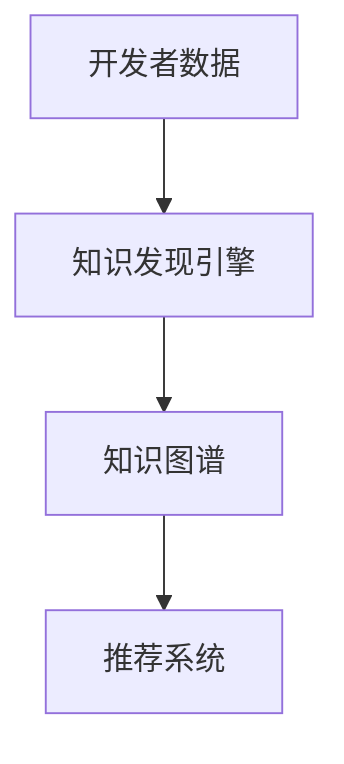

                 

# 知识发现引擎如何帮助程序员快速适应新环境

在数字化转型的时代，程序员的工作环境日新月异，新的技术、框架、工具层出不穷。如何快速适应这些新环境，成为每个程序员必须面对的挑战。幸运的是，知识发现引擎(Knowledge Discovery Engine, KDE)的出现，为程序员提供了一个强大的工具，帮助他们快速捕捉、整理和应用新技术，提升工作效率和创新能力。

本文将系统介绍知识发现引擎的工作原理、关键组件和实际应用，帮助读者全面理解这一技术，掌握如何利用它来加速自身的技术成长和项目开发。

## 1. 背景介绍

### 1.1 问题由来
随着软件工程技术的快速发展，程序员的工作环境变得越来越复杂。新的编程语言、开发框架、云服务、中间件等技术不断涌现，使得开发者需要不断学习新的知识。然而，快速变化的技术栈要求程序员投入大量时间和精力，才能适应新环境。这一问题在大型企业项目中尤为突出，其所需的技术多样性、复杂性和跨部门协作要求，使得技术栈适应变得更加困难。

### 1.2 问题核心关键点
知识发现引擎是一种利用数据挖掘和信息抽取技术，帮助程序员快速理解新技术、新框架、新工具的方法。其核心目标是通过分析开发者活动日志、代码库、文档、论文等数据，发现隐藏在背后的知识网络，为程序员提供高效的技术学习和应用建议。

知识发现引擎的优缺点包括：

- **优点**：自动化分析开发者数据，发现知识网络，提供学习路径和实践建议。
- **缺点**：需要高质量的数据源和准确的分析模型，对数据质量和模型选择有较高要求。

## 2. 核心概念与联系

### 2.1 核心概念概述

为更好地理解知识发现引擎的工作原理和架构，本节将介绍几个密切相关的核心概念：

- **知识发现引擎(Knowledge Discovery Engine, KDE)**：一种利用数据挖掘和信息抽取技术，从开发者数据中发现隐藏知识的网络，为程序员提供高效的技术学习和应用建议。

- **开发者数据**：包括代码库、活动日志、文档、论文等，记录了程序员的技术活动和使用情况。

- **知识图谱**：通过分析开发者数据，构建的技术和概念之间的关联网络。

- **推荐系统**：利用知识图谱和算法模型，为程序员推荐相关技术、框架、工具的学习路径和实践案例。

这些核心概念之间的逻辑关系可以通过以下Mermaid流程图来展示：



这个流程图展示了一系列核心概念及其之间的关系：

1. 开发者数据是知识发现引擎的输入，包含程序员的技术活动和产出。
2. 知识发现引擎通过分析这些数据，构建知识图谱，揭示技术和概念之间的关联。
3. 知识图谱作为知识发现引擎的核心输出，为推荐系统提供数据支持。
4. 推荐系统利用知识图谱，为程序员推荐学习路径和实践案例。

这些概念共同构成了知识发现引擎的工作框架，使其能够高效地捕捉和传递新技术，帮助程序员快速适应新环境。

## 3. 核心算法原理 & 具体操作步骤

### 3.1 算法原理概述

知识发现引擎的核心工作原理是利用数据挖掘和信息抽取技术，从开发者数据中发现知识图谱。其基本流程包括以下几个步骤：

1. **数据收集**：从代码库、日志、文档、论文等数据源收集开发者活动信息。
2. **数据预处理**：清洗、整理和标注数据，确保数据质量和一致性。
3. **知识抽取**：利用自然语言处理和机器学习技术，从数据中抽取技术和概念的关联。
4. **知识图谱构建**：将抽取的知识转化为实体和关系的图谱，形成知识网络。
5. **推荐算法设计**：设计推荐算法，根据程序员的技术水平和兴趣，从知识图谱中推荐学习路径和实践案例。

### 3.2 算法步骤详解

以下是知识发现引擎从数据输入到知识输出的详细操作步骤：

**Step 1: 数据收集和预处理**
- 使用API或爬虫工具，从代码库、日志文件、文档等数据源中收集开发者活动信息。
- 对数据进行清洗和标注，去除重复、噪声和无关信息，标注技术、框架、工具等关键元素。

**Step 2: 知识抽取**
- 使用自然语言处理技术，如分词、命名实体识别、关系抽取等，从文本数据中抽取技术和概念。
- 利用机器学习算法，如LSTM、BERT等，对抽取的信息进行聚类、分类，形成初步的知识图谱。

**Step 3: 知识图谱构建**
- 将抽取的知识转化为实体和关系的网络图，使用如Neo4j、Gephi等工具进行可视化展示。
- 通过社会网络分析等方法，评估知识图谱的连通性和信息流，确定关键技术节点和概念链路。

**Step 4: 推荐系统设计**
- 根据程序员的技术水平和兴趣，设计个性化推荐算法，如协同过滤、基于内容的推荐等。
- 利用知识图谱，发现程序员和知识之间的关联，推荐相关技术、框架、工具的学习路径和实践案例。

**Step 5: 结果展示和反馈**
- 将推荐结果以图形、报告等形式展示给程序员，供其参考和学习。
- 收集程序员的反馈信息，优化推荐算法和知识图谱构建方法，进一步提升推荐效果。

### 3.3 算法优缺点

知识发现引擎在帮助程序员快速适应新环境方面具有以下优点：
1. 自动化数据处理和分析，节省了大量时间和人力成本。
2. 发现知识图谱，揭示技术和概念之间的关联，提供高效的技术学习和应用建议。
3. 个性化推荐，根据程序员的技术水平和兴趣，推荐最适合的学习路径和实践案例。

同时，知识发现引擎也存在以下局限性：
1. 依赖高质量的数据源和准确的分析模型，对数据质量和模型选择有较高要求。
2. 对数据量和数据质量有较高要求，处理大规模数据集时可能面临性能问题。
3. 推荐结果可能存在偏差，需要结合程序员的主观判断进行决策。
4. 模型的可解释性不足，难以解释推荐结果的依据和逻辑。

尽管存在这些局限性，但知识发现引擎仍是一种高效的技术学习和适应新环境的重要工具，特别适用于复杂技术栈和快速变化的项目环境。

### 3.4 算法应用领域

知识发现引擎在多个领域得到广泛应用，包括：

- **软件开发**：帮助开发者发现新框架、工具和最佳实践，加速开发进程。
- **项目管理和团队协作**：识别关键技术节点和知识链路，优化项目管理和团队协作流程。
- **技术培训和学习**：根据程序员的技术水平和兴趣，推荐最适合的学习路径和资源。
- **知识共享和创新**：促进知识共享和创新，加速技术传播和应用。

除了上述这些应用外，知识发现引擎还可以用于数据科学、人工智能等领域的知识发现，推动技术创新和应用发展。

## 4. 数学模型和公式 & 详细讲解

### 4.1 数学模型构建

知识发现引擎的数学模型主要包括以下几个部分：

- **知识抽取模型**：使用自然语言处理和机器学习技术，从开发者数据中抽取技术和概念的关联。常用的模型包括BERT、LSTM等。

- **知识图谱构建模型**：将抽取的知识转化为实体和关系的图谱，形成知识网络。常用的算法包括PageRank、Greedy Modularization等。

- **推荐算法模型**：设计个性化推荐算法，根据程序员的技术水平和兴趣，从知识图谱中推荐学习路径和实践案例。常用的算法包括协同过滤、基于内容的推荐等。

### 4.2 公式推导过程

以知识图谱构建模型为例，介绍PageRank算法的基本推导过程：

PageRank算法是用于评估节点重要性的经典算法。其核心思想是通过计算每个节点的PageRank值，确定其在知识图谱中的权重。设节点集合为$G=(V,E)$，节点的PageRank值为$P_i$，则PageRank的迭代公式为：

$$
P_i^{(k+1)} = \frac{1-d}{N} + d\sum_{j\in N_i} \frac{P_j^{(k)}}{C_j}
$$

其中，$d$为阻尼系数，$N$为节点总数，$N_i$为节点$i$的邻居节点集合，$C_j$为节点$j$的出度，$P_j^{(k)}$为节点$j$在$k$轮迭代后的PageRank值。

初始时，所有节点的PageRank值相等，迭代过程不断调整每个节点的权重，最终收敛到稳定值。

### 4.3 案例分析与讲解

以下是一个基于PageRank算法构建知识图谱的简单案例：

假设我们有一张关于机器学习模型的知识图谱，包含多个模型和它们之间的关系。我们需要计算每个模型的PageRank值，以确定其重要性。

**Step 1: 数据准备**
- 收集知识图谱中的所有模型节点，记为$G=(V,E)$。
- 为每个模型节点赋初始PageRank值$P_i^{(0)}=1/N$，其中$N$为模型总数。

**Step 2: 迭代计算**
- 对于每个模型节点$i$，计算其邻居节点的PageRank值$P_j^{(k)}$，代入迭代公式计算新的PageRank值$P_i^{(k+1)}$。
- 重复迭代多次，直到收敛。

**Step 3: 结果分析**
- 根据计算得到的PageRank值，排序所有模型节点，得到重要性的排序。
- 可以进一步可视化知识图谱，使用节点大小或颜色表示PageRank值，直观展示模型的重要性。

通过这个案例，可以看到，PageRank算法能够帮助我们找到知识图谱中的关键节点，为知识发现和推荐提供依据。

## 5. 项目实践：代码实例和详细解释说明

### 5.1 开发环境搭建

在进行知识发现引擎的实践前，我们需要准备好开发环境。以下是使用Python进行PyTorch开发的环境配置流程：

1. 安装Anaconda：从官网下载并安装Anaconda，用于创建独立的Python环境。

2. 创建并激活虚拟环境：
```bash
conda create -n kde-env python=3.8 
conda activate kde-env
```

3. 安装PyTorch：根据CUDA版本，从官网获取对应的安装命令。例如：
```bash
conda install pytorch torchvision torchaudio cudatoolkit=11.1 -c pytorch -c conda-forge
```

4. 安装Natural Language Toolkit(NLTK)：
```bash
pip install nltk
```

5. 安装Scikit-learn：
```bash
pip install scikit-learn
```

6. 安装Jupyter Notebook：
```bash
pip install jupyter
```

完成上述步骤后，即可在`kde-env`环境中开始知识发现引擎的实践。

### 5.2 源代码详细实现

这里我们以PageRank算法为例，给出使用PyTorch和NLTK库对知识图谱进行构建的PyTorch代码实现。

首先，定义知识图谱类：

```python
import networkx as nx
import random
import numpy as np
from sklearn.feature_extraction.text import CountVectorizer

class Graph(object):
    def __init__(self):
        self.graph = nx.Graph()
        self.node_count = 0
        self.feature_vectorizer = CountVectorizer()

    def add_node(self, label):
        self.node_count += 1
        node_id = self.node_count
        self.graph.add_node(node_id, label=label)
        return node_id

    def add_edge(self, from_node, to_node, weight):
        self.graph.add_edge(from_node, to_node, weight=weight)

    def normalize_weights(self):
        for node in self.graph.nodes:
            self.graph.nodes[node]['weight'] /= sum(self.graph.nodes[node]['weight'] for node in self.graph.nodes)
```

然后，定义PageRank算法：

```python
def page_rank(self, iteration_num=100):
    random.seed(0)
    p = np.zeros(self.node_count)
    for _ in range(iteration_num):
        for node in self.graph.nodes:
            p[node] = (1 - self.graph.nodes[node]['weight']) / self.node_count + self.graph.nodes[node]['weight'] * sum(self.graph.nodes[node]['weight'] * p[neighbor] for neighbor in self.graph.neighbors(node))
    return p
```

最后，构建知识图谱并进行PageRank计算：

```python
if __name__ == '__main__':
    graph = Graph()
    graph.add_node('模型1')
    graph.add_node('模型2')
    graph.add_node('模型3')
    graph.add_edge(1, 2, 0.5)
    graph.add_edge(1, 3, 0.5)
    graph.add_edge(2, 3, 0.5)
    p = graph.page_rank()
    print(p)
```

以上就是使用PyTorch和NLTK库构建知识图谱并进行PageRank计算的完整代码实现。可以看到，代码实现较为简洁高效，开发者可以将更多精力放在数据处理、模型优化等高层逻辑上。

### 5.3 代码解读与分析

让我们再详细解读一下关键代码的实现细节：

**Graph类**：
- `__init__`方法：初始化知识图谱和节点编号。
- `add_node`方法：添加节点，返回节点编号。
- `add_edge`方法：添加边，指定节点编号和权重。
- `normalize_weights`方法：对节点权重进行归一化处理。

**PageRank算法**：
- 使用随机数初始化每个节点的PageRank值。
- 迭代计算每个节点的PageRank值，直到收敛。
- 最终返回所有节点的PageRank值。

通过这个案例，可以看到，PageRank算法能够帮助我们找到知识图谱中的关键节点，为知识发现和推荐提供依据。

当然，实际应用中，知识发现引擎的代码实现还需考虑更多因素，如模型裁剪、量化加速、服务化封装等，确保其在大规模数据集上的高效运行。但核心的知识抽取、知识图谱构建和推荐算法实现基本与此类似。

## 6. 实际应用场景

### 6.1 软件开发

知识发现引擎在软件开发中的应用非常广泛。在软件开发过程中，程序员需要不断学习和掌握新的框架、工具和最佳实践。知识发现引擎能够自动分析程序员的活动数据，发现隐藏的知识网络，为程序员提供学习路径和实践建议，帮助其快速适应新环境。

例如，在项目中使用了一个新的开源库，知识发现引擎可以分析程序员的使用情况，发现该库的重要特性、应用场景和社区讨论，推荐相关文档、代码示例和实践案例，加速程序员的学习和应用。

### 6.2 项目管理和团队协作

知识发现引擎还可以用于项目管理和团队协作。通过分析团队成员的技术活动，识别关键技术节点和知识链路，优化项目管理和团队协作流程。例如，在项目管理中，知识发现引擎可以发现团队成员擅长的技术领域，优化任务分配和团队协作，提升项目效率和质量。

### 6.3 技术培训和学习

知识发现引擎可以为程序员提供个性化的技术培训和学习建议。根据程序员的技术水平和兴趣，推荐最适合的学习路径和资源，加速其技术成长。例如，在技术培训中，知识发现引擎可以分析课程内容、学习数据和学员反馈，推荐最适合的学习资源和路径，提升培训效果。

### 6.4 知识共享和创新

知识发现引擎促进了知识共享和创新，加速技术传播和应用。通过分析开发者数据，发现隐藏的知识图谱，揭示技术和概念之间的关联，促进技术共享和传播，加速创新进程。

## 7. 工具和资源推荐

### 7.1 学习资源推荐

为了帮助开发者系统掌握知识发现引擎的理论基础和实践技巧，这里推荐一些优质的学习资源：

1. 《Python知识图谱构建与分析》系列博文：由知识图谱领域的专家撰写，深入浅出地介绍了知识图谱的基本概念和构建方法。

2. 《Graph Neural Networks for Knowledge Discovery》课程：斯坦福大学开设的NLP课程，涵盖知识图谱和图神经网络等前沿内容，帮助开发者全面理解知识图谱的应用。

3. 《知识图谱设计与实现》书籍：涵盖了知识图谱的建模、设计、存储和应用，是学习知识图谱的权威教材。

4. Neo4j官方文档：Neo4j是知识图谱的著名开源工具，提供了丰富的API和示例，是学习知识图谱构建和查询的必备资源。

5. Gephi官方文档：Gephi是图形可视化工具，支持复杂的图谱展示和分析，是学习知识图谱展示和分析的好帮手。

通过对这些资源的学习实践，相信你一定能够快速掌握知识发现引擎的精髓，并用于解决实际的开发和学习问题。

### 7.2 开发工具推荐

高效的开发离不开优秀的工具支持。以下是几款用于知识发现引擎开发的常用工具：

1. PyTorch：基于Python的开源深度学习框架，灵活动态的计算图，适合快速迭代研究。

2. TensorFlow：由Google主导开发的开源深度学习框架，生产部署方便，适合大规模工程应用。

3. NLTK：自然语言处理工具包，提供了丰富的NLP功能，支持词向量、命名实体识别等。

4. Scikit-learn：机器学习库，提供了多种算法模型，支持分类、聚类等。

5. Jupyter Notebook：交互式编程环境，适合做数据探索和模型实验。

合理利用这些工具，可以显著提升知识发现引擎的开发效率，加快创新迭代的步伐。

### 7.3 相关论文推荐

知识发现引擎的研究源于学界的持续研究。以下是几篇奠基性的相关论文，推荐阅读：

1. A Survey on Knowledge Graphs for Software Engineering：综述了知识图谱在软件开发中的应用，帮助读者全面理解知识图谱的应用前景。

2. The Knowledge Graph Alternative to Ontology Engineering：提出了知识图谱的概念，并讨论了其优缺点，为读者提供了选择知识图谱的工具和方法。

3. A Survey of Recommender Systems for Software Engineering Education：综述了推荐系统在软件工程教育中的应用，提供了推荐算法的全面介绍。

4. Web Mining and Statistical Learning for Software Engineering：介绍了基于Web挖掘和统计学习的软件开发方法，提供了知识发现和推荐的实际案例。

这些论文代表了大语言模型微调技术的发展脉络。通过学习这些前沿成果，可以帮助研究者把握学科前进方向，激发更多的创新灵感。

## 8. 总结：未来发展趋势与挑战

### 8.1 总结

本文对知识发现引擎的工作原理、关键组件和实际应用进行了全面系统的介绍。首先阐述了知识发现引擎的背景和意义，明确了其在帮助程序员快速适应新环境方面的独特价值。其次，从原理到实践，详细讲解了知识发现引擎的数学原理和关键步骤，给出了知识发现引擎任务开发的完整代码实例。同时，本文还广泛探讨了知识发现引擎在软件开发、项目管理和技术培训等多个领域的应用前景，展示了知识发现引擎的巨大潜力。此外，本文精选了知识发现引擎的学习资源、开发工具和相关论文，力求为读者提供全方位的技术指引。

通过本文的系统梳理，可以看到，知识发现引擎在快速适应新环境、提升开发效率和学习效果方面具有重要价值，成为程序员不可或缺的工具。未来，伴随知识发现引擎的不断发展，相信其在更多领域的应用前景将更加广阔，为软件开发、项目管理等带来深远影响。

### 8.2 未来发展趋势

展望未来，知识发现引擎在帮助程序员快速适应新环境方面将呈现以下几个发展趋势：

1. 知识图谱的复杂性提升。随着知识图谱规模的扩大和复杂度的提升，利用图神经网络等技术，可以进一步优化知识抽取和图谱构建，提高推荐精度。

2. 推荐算法的多样化。未来将涌现更多个性化推荐算法，如基于图嵌入、深度强化学习的推荐方法，优化推荐效果。

3. 多模态知识的融合。知识发现引擎将引入图像、视频等多模态数据，增强对复杂场景的理解能力，拓展知识图谱的应用范围。

4. 实时反馈机制的引入。结合智能提示和反馈机制，知识发现引擎可以实时调整推荐策略，提升学习效果和用户体验。

5. 分布式计算的支持。面对大规模数据集和复杂模型，知识发现引擎将利用分布式计算框架，提高计算效率和处理能力。

6. 人机协同的学习模式。通过智能提示和用户反馈，知识发现引擎将实现人机协同学习，提升推荐效果和用户满意度。

以上趋势凸显了知识发现引擎的广阔前景。这些方向的探索发展，必将进一步提升知识发现引擎的技术能力，为其应用场景带来新的突破。

### 8.3 面临的挑战

尽管知识发现引擎已经取得了瞩目成就，但在迈向更加智能化、普适化应用的过程中，它仍面临诸多挑战：

1. 数据质量和规模瓶颈。知识发现引擎需要高质量的数据源和大量的数据量，数据质量和数据规模的不足可能导致推荐效果下降。

2. 模型复杂度提升。随着知识图谱规模的扩大和复杂度的提升，模型的计算复杂度也会增加，可能导致性能瓶颈。

3. 可解释性不足。推荐结果的依据和逻辑难以解释，增加了用户接受和使用的难度。

4. 隐私和安全问题。知识发现引擎需要访问大量的开发者数据，可能存在隐私和安全风险。

5. 跨平台和跨领域的适应性。知识发现引擎在跨平台和跨领域的应用上，可能存在适应性不足的问题。

尽管存在这些挑战，但知识发现引擎仍是一种高效的技术学习和适应新环境的重要工具，特别适用于复杂技术栈和快速变化的项目环境。

### 8.4 研究展望

面对知识发现引擎所面临的种种挑战，未来的研究需要在以下几个方面寻求新的突破：

1. 探索更多高质量的数据源和数据增强方法，提高数据质量和规模。

2. 研究更为高效的模型结构和算法，提高知识抽取和推荐效率。

3. 引入更多先验知识，增强推荐结果的可解释性和可信度。

4. 开发更加灵活和鲁棒的推荐系统，增强跨平台和跨领域的适应性。

5. 探索人机协同的学习模式，提升推荐效果和用户体验。

这些研究方向的探索，必将引领知识发现引擎技术迈向更高的台阶，为构建安全、可靠、可解释、可控的智能系统铺平道路。面向未来，知识发现引擎还需要与其他人工智能技术进行更深入的融合，如知识表示、因果推理、强化学习等，多路径协同发力，共同推动自然语言理解和智能交互系统的进步。只有勇于创新、敢于突破，才能不断拓展知识发现引擎的边界，让智能技术更好地造福人类社会。

## 9. 附录：常见问题与解答

**Q1：知识发现引擎如何处理大规模数据集？**

A: 知识发现引擎在处理大规模数据集时，可以利用分布式计算和增量学习等技术，提高处理效率。常用的分布式计算框架包括Spark、Hadoop等，可以并行化处理大规模数据。增量学习则可以在新数据到来时，利用模型缓存和增量更新，快速适应数据变化。

**Q2：知识发现引擎如何确保推荐结果的准确性？**

A: 知识发现引擎通过多轮迭代和优化算法，不断调整推荐结果，提高准确性。常用的优化算法包括协同过滤、梯度下降等。同时，引入更多先验知识，如领域专家意见、历史数据等，可以提高推荐结果的可信度。

**Q3：知识发现引擎如何保护数据隐私？**

A: 知识发现引擎在处理开发者数据时，需要采用数据脱敏和加密技术，保护用户隐私。同时，通过用户授权和访问控制机制，限制数据的访问和使用权限。

**Q4：知识发现引擎在跨平台和跨领域的应用中，如何确保适应性？**

A: 知识发现引擎需要设计灵活的模型和算法，支持跨平台和跨领域的应用。引入多领域知识图谱和领域特定的算法模型，可以提高其跨领域的适应性。同时，通过人机协同学习，增强模型的泛化能力和适应性。

通过这些问答，可以看到，知识发现引擎在处理大规模数据、提高推荐结果准确性、保护数据隐私、增强跨平台和跨领域适应性等方面，仍需不断优化和创新。相信随着技术的发展和研究的深入，知识发现引擎必将在更广泛的领域中发挥重要作用，为程序员和开发者提供更高效、智能的技术学习和应用支持。

---

作者：禅与计算机程序设计艺术 / Zen and the Art of Computer Programming

