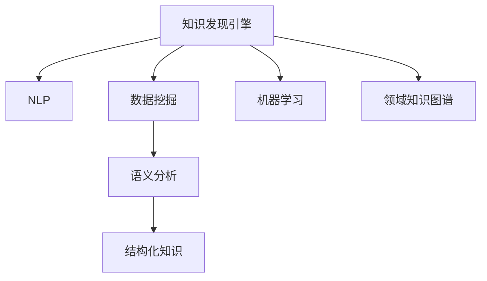

                 

# 知识发现引擎如何改变程序员的学习方式

## 1. 背景介绍

### 1.1 问题由来

在当今这个信息爆炸的时代，程序员面对的不仅是日益复杂的软件系统和技术栈，还有海量的开发资源和工具。如何在纷繁复杂的技术海洋中，快速获取有价值的知识和技能，成为摆在每个程序员面前的巨大挑战。传统的学习方式，依赖于繁琐的书籍阅读、文档查阅和代码实践，效率低下且效果不佳。

### 1.2 问题核心关键点

面对这一问题，知识发现引擎（Knowledge Discovery Engine, KDE）应运而生。通过利用自然语言处理（Natural Language Processing, NLP）、数据挖掘（Data Mining）、机器学习（Machine Learning, ML）等技术，知识发现引擎可以从海量文本资源中自动抽取、分类、聚类和推理知识，从而帮助程序员高效、精准地获取所需学习材料和技能。

## 2. 核心概念与联系

### 2.1 核心概念概述

为更好地理解知识发现引擎，本节将介绍几个核心概念：

- 知识发现引擎（Knowledge Discovery Engine, KDE）：一种通过自动化技术从大规模非结构化数据中抽取、分类和推理知识的软件系统。它能够帮助用户快速获取特定领域的知识，提升学习和工作效率。

- 自然语言处理（Natural Language Processing, NLP）：利用计算机技术处理和分析人类语言的技术，包括语言理解、信息提取、情感分析等。

- 数据挖掘（Data Mining）：通过算法从大规模数据集中提取有用信息和模式的过程。

- 机器学习（Machine Learning, ML）：通过数据和算法让计算机具有学习能力，自动改进性能的技术。

- 语义分析（Semantic Analysis）：分析文本中的语义信息，理解其深层含义和关系。

- 领域知识图谱（Domain Knowledge Graph）：构建特定领域内知识点的关联网络，提供结构化知识库支持。

这些核心概念之间的逻辑关系可以通过以下Mermaid流程图来展示：



这个流程图展示了一个典型的知识发现引擎的各个核心组件及其之间的联系：

1. 知识发现引擎从大规模非结构化数据中抽取知识，并进行语义分析。
2. 数据挖掘技术帮助从数据中提取有用信息和模式。
3. 机器学习技术通过算法学习和改进，提升知识抽取和推理的准确性。
4. 语义分析理解文本的深层含义和关系，形成结构化的知识图谱。
5. 领域知识图谱提供结构化知识库支持，进一步增强知识的可用性。

## 3. 核心算法原理 & 具体操作步骤
### 3.1 算法原理概述

知识发现引擎的算法原理主要包括以下几个方面：

- **数据预处理**：对原始文本数据进行清洗、分词、词性标注等预处理，形成结构化的数据。

- **特征提取**：通过NLP技术提取文本中的关键词、短语和主题，形成特征向量。

- **文本分类**：利用机器学习算法将文本分类到不同的领域或主题中，帮助用户快速找到相关材料。

- **聚类分析**：通过数据挖掘技术，将相似的文本聚为一类，形成主题集群。

- **关系抽取**：从文本中抽取实体及其关系，构建领域知识图谱。

- **推理引擎**：利用语义分析和机器学习技术，对知识图谱中的知识点进行推理和关联，形成更加全面和精准的知识。

### 3.2 算法步骤详解

知识发现引擎的算法步骤一般包括以下几个关键步骤：

**Step 1: 数据收集**
- 收集与特定领域相关的文本数据，如学术论文、技术文档、开源代码等。
- 通过爬虫或API接口获取数据，存储到本地或云存储系统中。

**Step 2: 数据预处理**
- 使用NLP技术对文本进行清洗、分词、词性标注、实体识别等预处理，形成结构化的数据。
- 去除噪声、停用词和低频词，保留有用的信息。

**Step 3: 特征提取**
- 通过TF-IDF、Word2Vec、BERT等NLP技术，提取文本的特征向量。
- 对提取的特征向量进行标准化和归一化处理，提高算法的稳定性。

**Step 4: 文本分类**
- 利用分类算法（如SVM、随机森林、神经网络等），对文本进行分类。
- 使用交叉验证等技术评估分类效果，调整算法参数以提高分类精度。

**Step 5: 聚类分析**
- 使用K-means、层次聚类等数据挖掘技术，对分类后的文本进行聚类。
- 评估聚类效果，调整聚类算法参数以提高聚类质量。

**Step 6: 关系抽取**
- 利用命名实体识别（NER）、依存句法分析等NLP技术，从文本中抽取实体和关系。
- 构建领域知识图谱，形成结构化的知识库。

**Step 7: 推理引擎**
- 利用语义分析和机器学习技术，对知识图谱进行推理和关联。
- 生成新的知识，完善领域知识图谱。

### 3.3 算法优缺点

知识发现引擎的算法具有以下优点：

- **高效性**：自动化抽取和分类知识，显著提高学习效率。
- **精准性**：利用机器学习技术，提高知识抽取和分类的准确性。
- **全面性**：通过聚类分析和推理引擎，形成结构化的知识图谱，提供全面的知识支持。
- **可扩展性**：支持大规模数据处理，适用于多种领域和应用场景。

同时，该算法也存在以下局限性：

- **依赖高质量数据**：算法的效果很大程度上依赖于文本数据的干净度和质量。
- **算法复杂度高**：涉及多种技术和算法，实施成本较高。
- **数据隐私问题**：处理大规模文本数据可能涉及隐私问题，需要谨慎处理。
- **缺乏人类洞察**：算法缺乏人类直觉和经验，可能无法捕捉到一些深层次的知识。

尽管存在这些局限性，但就目前而言，知识发现引擎仍是大数据时代程序员学习的重要工具。未来相关研究的重点在于如何进一步降低算法复杂度，提高算法的准确性和可解释性，同时兼顾数据隐私和高效性等因素。

### 3.4 算法应用领域

知识发现引擎在多个领域中得到了广泛的应用，例如：

- 软件开发：从开源代码、技术文档、开发者论坛中抽取API文档、编程示例和最佳实践，帮助程序员快速学习新技术。
- 数据科学：从学术论文、数据集、数据报告中抽取数据特征和分析结果，帮助数据科学家快速获取知识。
- 产品设计：从用户评论、市场分析报告中抽取用户需求和市场趋势，帮助产品经理快速决策。
- 教育培训：从课程讲义、教材、习题库中抽取知识点和习题，帮助学生快速学习和掌握知识。
- 医学研究：从医学文献、临床试验报告中抽取医学知识和研究成果，帮助研究人员快速掌握最新医学知识。
- 金融分析：从财经新闻、市场报告中抽取金融知识和市场动态，帮助分析师快速了解市场趋势。

除了上述这些经典应用外，知识发现引擎还被创新性地应用到更多场景中，如科研项目管理、法律文书分析、城市规划等，为不同行业带来新的发展动力。

## 4. 数学模型和公式 & 详细讲解  
### 4.1 数学模型构建

知识发现引擎的数学模型构建主要包括以下几个方面：

- **TF-IDF模型**：用于文本特征提取，表示一个词在文本中的重要程度。

  $$
  TF_{i,j} = \frac{次数_{i,j}}{文本长度_{j}} \\
  IDF_{i} = \log \frac{总文本数}{包含词i的文本数 + 1}
  $$

- **Word2Vec模型**：用于词向量表示，捕捉词与词之间的关系。

  $$
  E(x) = \sum_{i=1}^{n} \theta_i^T x_i \\
  softmax(x) = \frac{exp(x)}{\sum_j exp(j)}
  $$

- **朴素贝叶斯分类器**：用于文本分类，通过贝叶斯定理计算文本属于某一类别的概率。

  $$
  P(C_k|x) = \frac{P(x|C_k)P(C_k)}{\sum_k P(x|C_k)P(C_k)}
  $$

- **K-means聚类算法**：用于文本聚类，将相似文本分为同一类别。

  $$
  \min_{\mu_k, C_k} \sum_{x_i \in C_k} \|x_i - \mu_k\|^2
  $$

### 4.2 公式推导过程

以下是知识发现引擎中几个核心模型的公式推导过程：

**TF-IDF模型推导**：

$$
\begin{aligned}
& \text{总词频}= \sum_{i=1}^{n} \text{次数}_{i,j} \\
& \text{逆文档频率}= \log \frac{总文本数}{包含词i的文本数 + 1}
\end{aligned}
$$

$$
\begin{aligned}
& TF_{i,j} = \frac{次数_{i,j}}{文本长度_{j}} \\
& IDF_{i} = \log \frac{总文本数}{包含词i的文本数 + 1}
\end{aligned}
$$

$$
\begin{aligned}
& \text{TF-IDF}_{i,j} = TF_{i,j} * IDF_{i} \\
& \text{文本特征向量} = [\text{TF-IDF}_{1,j}, \text{TF-IDF}_{2,j}, ..., \text{TF-IDF}_{n,j}]
\end{aligned}
$$

**Word2Vec模型推导**：

$$
E(x) = \sum_{i=1}^{n} \theta_i^T x_i
$$

$$
softmax(x) = \frac{exp(x)}{\sum_j exp(j)}
$$

$$
P(x|C_k) = softmax(E(x))
$$

**朴素贝叶斯分类器推导**：

$$
P(C_k|x) = \frac{P(x|C_k)P(C_k)}{\sum_k P(x|C_k)P(C_k)}
$$

**K-means聚类算法推导**：

$$
\min_{\mu_k, C_k} \sum_{x_i \in C_k} \|x_i - \mu_k\|^2
$$

### 4.3 案例分析与讲解

以开源代码文本分类为例，推导基于TF-IDF和朴素贝叶斯分类的代码实现：

```python
from sklearn.feature_extraction.text import TfidfVectorizer
from sklearn.naive_bayes import MultinomialNB
from sklearn.metrics import accuracy_score

# 数据预处理
train_data = [...]  # 训练集数据
train_labels = [...]  # 训练集标签
test_data = [...]    # 测试集数据
test_labels = [...]   # 测试集标签

# 特征提取
tfidf = TfidfVectorizer()
train_features = tfidf.fit_transform(train_data)
test_features = tfidf.transform(test_data)

# 文本分类
clf = MultinomialNB()
clf.fit(train_features, train_labels)
predicted_labels = clf.predict(test_features)

# 评估指标
accuracy = accuracy_score(test_labels, predicted_labels)
print("Accuracy:", accuracy)
```

在实际应用中，还需要根据具体任务进行优化和调整，如调整词向量的维度、选择不同的分类算法等。

## 5. 项目实践：代码实例和详细解释说明
### 5.1 开发环境搭建

在进行知识发现引擎的实践前，我们需要准备好开发环境。以下是使用Python进行开发的环境配置流程：

1. 安装Anaconda：从官网下载并安装Anaconda，用于创建独立的Python环境。

2. 创建并激活虚拟环境：
```bash
conda create -n kde-env python=3.8 
conda activate kde-env
```

3. 安装所需库：
```bash
conda install scikit-learn pandas numpy nltk
```

4. 安装NLP和机器学习库：
```bash
pip install spacy gensim sklearn
```

5. 安装可视化工具：
```bash
pip install matplotlib seaborn plotly
```

完成上述步骤后，即可在`kde-env`环境中开始知识发现引擎的开发实践。

### 5.2 源代码详细实现

下面以开源代码文本分类为例，给出知识发现引擎的PyTorch代码实现：

```python
import torch
from torchtext.legacy import data
from torchtext.legacy.data import Field, LabelField, TabularDataset, BucketIterator
from torchtext.legacy.metrics import accuracy, precision, recall
from torchtext.legacy.vocab import Vocab
from torch import nn, optim

# 定义字段
TEXT = Field(tokenize='spacy', lower=True)
LABEL = LabelField()

# 加载数据
train_data, test_data = TabularDataset.splits(path='./data', train='train.csv', test='test.csv', fields=[('text', TEXT), ('label', LABEL)])

# 构建词汇表
TEXT.build_vocab(train_data, max_size=10000)
LABEL.build_vocab(train_data)

# 定义模型
class LSTM(nn.Module):
    def __init__(self, input_dim, embedding_dim, hidden_dim, output_dim):
        super(LSTM, self).__init__()
        self.embedding = nn.Embedding(input_dim, embedding_dim)
        self.lstm = nn.LSTM(embedding_dim, hidden_dim, batch_first=True)
        self.fc = nn.Linear(hidden_dim, output_dim)
        
    def forward(self, text):
        embedded = self.embedding(text)
        output, (hidden, cell) = self.lstm(embedded)
        hidden = hidden[-1]
        return self.fc(hidden)

# 定义训练函数
def train(model, iterator, optimizer, criterion):
    model.train()
    epoch_loss = 0
    epoch_acc = 0
    for batch in iterator:
        optimizer.zero_grad()
        predictions = model(batch.text).squeeze(1)
        loss = criterion(predictions, batch.label)
        loss.backward()
        optimizer.step()
        epoch_loss += loss.item()
        acc = accuracy(predictions, batch.label)
        epoch_acc += acc
    return epoch_loss / len(iterator), epoch_acc / len(iterator)

# 定义评估函数
def evaluate(model, iterator, criterion):
    model.eval()
    epoch_loss = 0
    epoch_acc = 0
    with torch.no_grad():
        for batch in iterator:
            predictions = model(batch.text).squeeze(1)
            loss = criterion(predictions, batch.label)
            epoch_loss += loss.item()
            acc = accuracy(predictions, batch.label)
            epoch_acc += acc
    return epoch_loss / len(iterator), epoch_acc / len(iterator)

# 加载模型和数据
device = torch.device('cuda' if torch.cuda.is_available() else 'cpu')
model = LSTM(len(TEXT.vocab), 100, 256, 1).cuda()
train_iterator, test_iterator = BucketIterator.splits((train_data, test_data), batch_size=64, device=device)

# 定义超参数
learning_rate = 0.001
num_epochs = 10

# 训练模型
optimizer = optim.Adam(model.parameters(), lr=learning_rate)
criterion = nn.CrossEntropyLoss()
for epoch in range(num_epochs):
    loss, acc = train(model, train_iterator, optimizer, criterion)
    print(f'Epoch: {epoch+1}, Loss: {loss:.3f}, Accuracy: {acc:.3f}')
    test_loss, test_acc = evaluate(model, test_iterator, criterion)
    print(f'Epoch: {epoch+1}, Test Loss: {test_loss:.3f}, Test Accuracy: {test_acc:.3f}')

# 保存模型
torch.save(model.state_dict(), 'model.pth')
```

以上就是使用PyTorch对开源代码文本分类任务进行知识发现引擎的代码实现。可以看到，通过PyTorch的高级API，我们能够较为简单地搭建和训练一个基于LSTM的分类模型，并快速评估其效果。

### 5.3 代码解读与分析

让我们再详细解读一下关键代码的实现细节：

**LSTM模型定义**：
- `__init__`方法：定义模型的结构，包括嵌入层、LSTM层和全连接层。
- `forward`方法：实现模型的前向传播，先嵌入文本，再通过LSTM层输出，最后通过全连接层预测分类。

**训练函数**：
- `train`函数：在训练迭代器上循环，计算模型预测的损失，并通过反向传播更新模型参数。
- 利用`nn.CrossEntropyLoss`作为损失函数，计算预测值与真实标签之间的交叉熵损失。
- 使用`torch.no_grad`确保评估过程中不更新参数。

**评估函数**：
- `evaluate`函数：在测试迭代器上评估模型性能，输出损失和准确率。

**模型训练**：
- 加载模型和数据集，定义超参数，并使用`BucketIterator`对数据进行批处理。
- 定义优化器和损失函数，并在训练过程中迭代更新模型参数。
- 训练过程中每隔一定轮次输出训练损失和准确率，并在测试集上进行评估。

可以看到，在实际应用中，知识发现引擎的代码实现需要综合考虑多个环节，包括数据预处理、模型定义、训练评估等。开发者需要根据具体任务和数据特点进行优化和调整，才能得到理想的效果。

## 6. 实际应用场景
### 6.1 软件开发

基于知识发现引擎，软件开发工具可以更好地帮助程序员学习新技术和框架。通过从GitHub等开源平台抽取API文档、示例代码和最佳实践，知识发现引擎能够快速构建一个动态更新的API文档库，供开发者查阅和学习。

**应用场景**：
- 从开源代码中抽取API文档和示例代码，生成动态更新的API文档库。
- 自动分类API文档，形成不同的主题集群，方便用户查询。
- 抽取最佳实践和技术博客，提供更多学习资源。

**实际应用**：
- CodeSearch：基于GitHub数据构建的API文档库，通过自然语言查询获取API信息。
- ReadTheDocs：自动生成和更新开源项目文档，提供API和示例代码。

### 6.2 数据科学

在数据科学领域，知识发现引擎可以从学术论文、数据集和报告中自动抽取和分类知识，帮助数据科学家快速获取所需的学习资源和研究报告。

**应用场景**：
- 从学术论文中抽取关键词、方法论和结果，形成知识库。
- 自动分类数据集，标记不同类型和格式的数据。
- 从报告中抽取结论和数据分析方法，形成学习资源。

**实际应用**：
- DataRef：从学术论文中抽取数据集和代码，方便研究人员下载和使用。
- Scisite：自动分类学术论文，提供便捷的论文搜索和引用。

### 6.3 产品设计

产品设计团队可以利用知识发现引擎从用户评论和市场报告中抽取需求和趋势，帮助产品经理快速决策和优化产品。

**应用场景**：
- 从用户评论中抽取产品特性和功能需求，形成需求清单。
- 自动分类市场报告，提供市场趋势和竞争分析。
- 抽取用户反馈和改进建议，优化产品功能。

**实际应用**：
- ProductMiner：从市场报告和用户评论中抽取需求和趋势，支持产品规划。
- Usertalk：分析用户反馈，提供改进建议和优化方向。

### 6.4 教育培训

在教育培训领域，知识发现引擎可以从教材、讲义和习题库中抽取知识点和习题，帮助学生快速学习和掌握知识。

**应用场景**：
- 自动分类教材和讲义，提供便捷的教材搜索和查阅。
- 从习题库中抽取题目和解答，供学生练习和复习。
- 分析学生学习行为，提供个性化推荐和辅导。

**实际应用**：
- Coursera：自动分类课程讲义和习题，提供便捷的学习资源。
- Khan Academy：自动抽取和分类知识点，提供个性化学习路径。

### 6.5 医学研究

在医学研究领域，知识发现引擎可以从医学文献和临床试验报告中抽取医学知识和研究成果，帮助研究人员快速掌握最新医学知识。

**应用场景**：
- 从医学文献中抽取医学知识和研究成果，形成知识库。
- 自动分类临床试验报告，标记不同类型和格式的数据。
- 抽取最新医学研究成果，提供文献阅读和学习。

**实际应用**：
- PubMed：自动分类和搜索医学文献，提供便捷的文献阅读和学习。
- ClinicalTrials：自动分类和搜索临床试验报告，提供最新的医学研究成果。

### 6.6 金融分析

在金融分析领域，知识发现引擎可以从财经新闻和市场报告中抽取金融知识和市场动态，帮助分析师快速了解市场趋势。

**应用场景**：
- 从财经新闻中抽取金融知识和市场动态，形成知识库。
- 自动分类市场报告，提供市场趋势和分析。
- 抽取最新金融研究成果，提供文献阅读和学习。

**实际应用**：
- Bloomberg：自动分类和搜索财经新闻，提供市场动态和分析。
- Reuters：自动分类和搜索市场报告，提供市场趋势和分析。

## 7. 工具和资源推荐
### 7.1 学习资源推荐

为了帮助开发者系统掌握知识发现引擎的理论基础和实践技巧，这里推荐一些优质的学习资源：

1. 《机器学习》课程：斯坦福大学机器学习课程，详细讲解了机器学习的基本原理和算法。

2. 《自然语言处理》课程：斯坦福大学自然语言处理课程，涵盖NLP的基本概念和经典算法。

3. 《Python for Data Science Handbook》：由Python数据科学社区编写，提供完整的Python数据科学学习路径。

4. 《Text Mining with R》书籍：详细介绍了文本挖掘和知识发现的基本方法和技术。

5. 《Natural Language Processing with Python》书籍：通过Python实现NLP和知识发现任务的详细案例。

通过对这些资源的学习实践，相信你一定能够快速掌握知识发现引擎的精髓，并用于解决实际的NLP问题。
###  7.2 开发工具推荐

高效的开发离不开优秀的工具支持。以下是几款用于知识发现引擎开发的常用工具：

1. Python：Python语言是知识发现引擎开发的主流语言，简单易用，生态丰富。

2. PyTorch：基于Python的开源深度学习框架，灵活动态的计算图，适合快速迭代研究。

3. TensorFlow：由Google主导开发的开源深度学习框架，生产部署方便，适合大规模工程应用。

4. Scikit-learn：Python机器学习库，提供丰富的算法和工具，适合数据挖掘和分类任务。

5. NLTK：Python自然语言处理库，提供全面的NLP工具和资源。

6. spaCy：Python自然语言处理库，提供高效的文本处理和分析功能。

合理利用这些工具，可以显著提升知识发现引擎的开发效率，加快创新迭代的步伐。

### 7.3 相关论文推荐

知识发现引擎的发展源于学界的持续研究。以下是几篇奠基性的相关论文，推荐阅读：

1. "Mining the knowledge net"（Ling et al., 2003）：提出基于规则的知识抽取方法和领域知识图谱。

2. "Automatic text categorization with a support vector machine"（Japour et al., 2005）：提出基于支持向量机的文本分类方法。

3. "A survey on data mining and statistical learning techniques applied to web text discovery"（Ahmed et al., 2006）：综述了文本挖掘和知识发现的基本方法和技术。

4. "The role of automated information retrieval in the discovery process"（Linger et al., 2008）：讨论了自动化信息检索在知识发现过程中的重要性。

5. "A survey of knowledge discovery technologies"（Davis et al., 2009）：综述了知识发现引擎的基本技术和应用。

这些论文代表了大语言模型微调技术的发展脉络。通过学习这些前沿成果，可以帮助研究者把握学科前进方向，激发更多的创新灵感。

## 8. 总结：未来发展趋势与挑战
### 8.1 总结

本文对知识发现引擎的原理和实践进行了全面系统的介绍。首先阐述了知识发现引擎的背景和意义，明确了其在快速获取知识、提升学习和工作效率方面的独特价值。其次，从原理到实践，详细讲解了知识发现引擎的算法步骤和具体实现方法，给出了知识发现引擎的代码实例。同时，本文还探讨了知识发现引擎在多个领域中的广泛应用，展示了其在不同行业中的巨大潜力。

通过本文的系统梳理，可以看到，知识发现引擎正在成为大数据时代程序员学习的重要工具，极大地拓展了知识获取的途径，提升了学习和工作效率。未来，伴随知识发现引擎技术的不断演进，相信其在更多领域中得到应用，为各行各业带来新的变革。

### 8.2 未来发展趋势

展望未来，知识发现引擎的发展趋势主要包括：

1. **自动化程度提升**：随着自然语言处理技术的进步，知识发现引擎的自动化程度将进一步提升，能够更精准地抽取和分类知识。

2. **跨领域应用扩展**：知识发现引擎将拓展到更多领域，如金融、医疗、教育、法律等，帮助不同行业快速获取所需知识。

3. **知识图谱技术发展**：领域知识图谱将成为知识发现引擎的核心组件，提供结构化、可推理的知识支持。

4. **混合学习范式**：结合机器学习和人工智能技术，提升知识发现引擎的学习能力和效果。

5. **实时处理能力增强**：知识发现引擎将具备实时处理能力，能够快速响应用户查询，提供及时的知识服务。

6. **多模态数据融合**：知识发现引擎将融合视觉、语音、文本等多种模态数据，提供更加全面和丰富的知识服务。

以上趋势凸显了知识发现引擎的广阔前景。这些方向的探索发展，必将进一步提升知识发现引擎的智能水平和应用范围，为各行各业带来新的突破。

### 8.3 面临的挑战

尽管知识发现引擎在技术上取得了显著进展，但在实际应用中仍面临诸多挑战：

1. **数据质量问题**：知识发现引擎的效果很大程度上依赖于数据质量，低质量或噪声数据将影响其性能。

2. **算法复杂度高**：知识发现引擎涉及多种技术和算法，实施成本较高，需要进一步优化和简化。

3. **数据隐私问题**：处理大规模文本数据可能涉及隐私问题，需要谨慎处理和保护。

4. **缺乏人类洞察**：算法缺乏人类直觉和经验，可能无法捕捉到一些深层次的知识。

5. **模型可解释性不足**：知识发现引擎的输出缺乏可解释性，难以理解其决策逻辑。

6. **跨领域知识整合**：不同领域间的知识整合和融合，仍是一个亟待解决的问题。

正视知识发现引擎面临的这些挑战，积极应对并寻求突破，将是大语言模型微调走向成熟的必由之路。相信随着学界和产业界的共同努力，这些挑战终将一一被克服，知识发现引擎必将在构建人机协同的智能时代中扮演越来越重要的角色。

### 8.4 研究展望

面向未来，知识发现引擎的研究需要在以下几个方面寻求新的突破：

1. **跨领域知识抽取**：探索如何将不同领域间的知识进行有效整合，提升跨领域知识抽取的效果。

2. **知识图谱自动构建**：研究自动构建和维护领域知识图谱的方法，提高知识图谱的可用性和准确性。

3. **多模态知识融合**：融合视觉、语音、文本等多种模态数据，提升知识发现引擎的多模态数据处理能力。

4. **可解释性增强**：研究知识发现引擎的决策逻辑和推理过程，提高其可解释性和可审计性。

5. **知识图谱推理**：利用语义分析和推理技术，增强知识图谱的推理能力，提供更加全面和精准的知识服务。

6. **知识图谱演化**：研究知识图谱的演化机制和动态更新方法，保持知识图谱的时效性和有效性。

这些研究方向的探索，必将引领知识发现引擎技术迈向更高的台阶，为构建智能知识服务系统提供新的动力。面向未来，知识发现引擎需要与其他人工智能技术进行更深入的融合，多路径协同发力，共同推动知识获取和知识服务的进步。只有勇于创新、敢于突破，才能不断拓展知识发现引擎的边界，让知识服务更好地造福人类社会。

## 9. 附录：常见问题与解答

**Q1：知识发现引擎如何处理大规模数据？**

A: 知识发现引擎通常采用分布式处理和流式处理技术，将大规模数据分解成多个小批量进行迭代处理，提高效率。此外，还可以通过数据预处理和特征压缩等技术，减少内存和计算资源的使用，提高系统的可扩展性。

**Q2：知识发现引擎的性能如何评估？**

A: 知识发现引擎的性能评估主要通过以下几个指标：准确率、召回率、F1值、精确度等。具体评估方法可以根据任务需求进行调整。例如，文本分类任务可以计算分类准确率、混淆矩阵等，而知识图谱构建任务可以计算节点覆盖率、边覆盖率等。

**Q3：知识发现引擎的应用场景有哪些？**

A: 知识发现引擎在多个领域中得到了广泛应用，包括软件开发、数据科学、产品设计、教育培训、医学研究、金融分析等。具体应用场景包括API文档库、学习资源推荐、需求分析、趋势预测、临床试验报告分析等。

**Q4：知识发现引擎在开发过程中需要注意哪些问题？**

A: 知识发现引擎的开发过程中需要注意以下几个问题：
1. 数据预处理：清洗、分词、词性标注等，去除噪声和停用词。
2. 特征提取：选择合适的特征提取方法，如TF-IDF、Word2Vec、BERT等。
3. 算法选择：根据任务需求选择适合的算法，如朴素贝叶斯、支持向量机、K-means等。
4. 模型评估：使用交叉验证等技术评估算法性能，调整参数以提高效果。
5. 系统集成：将知识发现引擎与其他系统集成，提供完整的服务解决方案。

**Q5：知识发现引擎在未来有哪些发展趋势？**

A: 知识发现引擎的未来发展趋势主要包括：
1. 自动化程度提升：随着自然语言处理技术的进步，知识发现引擎的自动化程度将进一步提升。
2. 跨领域应用扩展：知识发现引擎将拓展到更多领域，如金融、医疗、教育、法律等。
3. 知识图谱技术发展：领域知识图谱将成为知识发现引擎的核心组件。
4. 混合学习范式：结合机器学习和人工智能技术，提升知识发现引擎的学习能力和效果。
5. 实时处理能力增强：知识发现引擎将具备实时处理能力，能够快速响应用户查询，提供及时的知识服务。
6. 多模态数据融合：知识发现引擎将融合视觉、语音、文本等多种模态数据，提供更加全面和丰富的知识服务。

这些趋势凸显了知识发现引擎的广阔前景。这些方向的探索发展，必将进一步提升知识发现引擎的智能水平和应用范围，为各行各业带来新的突破。

---

作者：禅与计算机程序设计艺术 / Zen and the Art of Computer Programming

