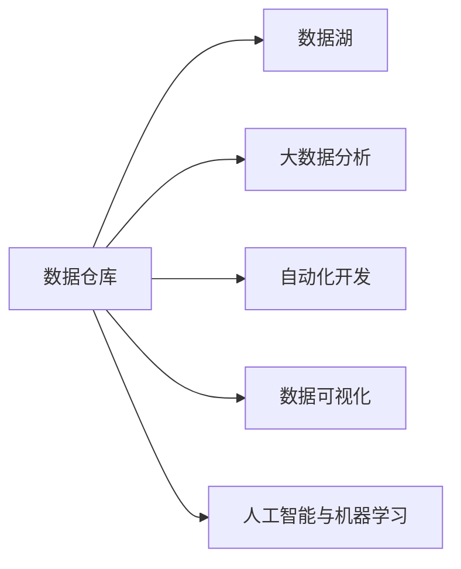

                 

# 知识发现引擎如何改变程序员的工作方式

> 关键词：知识发现引擎, 数据仓库, 数据湖, 大数据分析, 自动化开发, 数据可视化, 人工智能与机器学习

## 1. 背景介绍

在现代软件开发中，数据的处理和使用变得至关重要。程序员们不仅要编写代码，还要处理大量复杂的业务逻辑、数据管理和分析。但随着大数据时代的到来，数据量不断增加，数据处理变得越来越繁琐和复杂。为了提高开发效率，减轻数据处理的负担，知识发现引擎(Knowledge Discovery Engine, KDE)应运而生。

知识发现引擎是一种集成数据仓库、数据湖、大数据分析、自动化开发、数据可视化和人工智能与机器学习技术的平台，能够从数据中提取有价值的信息和知识，从而改变程序员的工作方式。本文将深入探讨知识发现引擎的核心概念、原理和操作步骤，以及其在实际应用中的表现和未来展望。

## 2. 核心概念与联系

### 2.1 核心概念概述

- **数据仓库(Data Warehouse)**：一种集中存储和管理企业历史数据的数据库管理系统，用于支持业务决策和数据分析。
- **数据湖(Data Lake)**：一种存储海量、原始、多种格式数据的数据存储体系结构，支持大数据的存储和分析。
- **大数据分析(Big Data Analytics)**：使用数据仓库和数据湖中的大量数据进行复杂计算和分析，从中挖掘出有价值的商业信息。
- **自动化开发(Auto Development)**：通过自动化工具和框架，减少手动代码编写和测试的工作量，提高开发效率。
- **数据可视化(Data Visualization)**：将数据转化为直观的图表和图像，便于理解和分析。
- **人工智能与机器学习(AI & ML)**：通过算法和模型，从数据中学习和发现规律和模式，实现智能决策和预测。

### 2.2 核心概念原理和架构的 Mermaid 流程图



这个流程图展示了数据仓库、数据湖、大数据分析、自动化开发、数据可视化和人工智能与机器学习之间的联系：

- 数据仓库和数据湖是数据存储的基础，提供了大量原始数据。
- 大数据分析对存储数据进行计算和分析，发现数据中的规律和模式。
- 自动化开发和数据可视化分别减少了代码编写和测试的工作量，并使数据更加直观易懂。
- 人工智能与机器学习则通过算法和模型，进一步从数据中学习和挖掘有价值的信息。

## 3. 核心算法原理 & 具体操作步骤

### 3.1 算法原理概述

知识发现引擎的核心算法原理是数据挖掘(Data Mining)和机器学习(Machine Learning)。数据挖掘是从大量数据中提取有用信息和知识的过程，机器学习则是通过算法和模型，从数据中学习和发现规律和模式。

知识发现引擎通常包括以下几个步骤：

1. 数据预处理：清洗、转换和整合数据，使其适合分析和挖掘。
2. 数据挖掘：使用各种算法从数据中提取有价值的信息和知识。
3. 模型训练：使用机器学习算法训练模型，预测和优化结果。
4. 自动化开发：通过自动化工具和框架，减少手动代码编写和测试的工作量。
5. 数据可视化：将数据转化为直观的图表和图像，便于理解和分析。

### 3.2 算法步骤详解

#### 3.2.1 数据预处理

数据预处理是知识发现引擎的第一步，也是最关键的一步。它涉及到数据的清洗、转换和整合，以确保数据的质量和一致性。

1. **数据清洗**：去除数据中的噪声和异常值，确保数据的质量和准确性。
2. **数据转换**：将数据转换为适合分析和挖掘的格式，如归一化、标准化等。
3. **数据整合**：将来自不同来源的数据整合在一起，形成统一的数据仓库或数据湖。

#### 3.2.2 数据挖掘

数据挖掘使用各种算法从数据中提取有用信息和知识。常用的数据挖掘算法包括：

1. **关联规则挖掘(Association Rule Mining)**：从数据中挖掘出物品之间的关联关系，如购物篮分析。
2. **分类算法(Classification)**：根据数据特征将数据分类，如决策树、支持向量机等。
3. **聚类算法(Clustering)**：将数据分组，发现数据中的相似性和规律，如K-Means等。
4. **回归分析(Regression)**：通过数据预测和优化结果，如线性回归、逻辑回归等。

#### 3.2.3 模型训练

模型训练使用机器学习算法训练模型，预测和优化结果。常用的机器学习算法包括：

1. **线性回归(Linear Regression)**：通过数据预测连续值。
2. **逻辑回归(Logistic Regression)**：通过数据预测二分类结果。
3. **支持向量机(SVM)**：通过数据分类和回归。
4. **随机森林(Random Forest)**：通过数据分类和回归，处理高维数据。

#### 3.2.4 自动化开发

自动化开发通过自动化工具和框架，减少手动代码编写和测试的工作量，提高开发效率。常用的自动化开发工具包括：

1. **GitHub Actions**：通过持续集成(CI)和持续部署(CD)自动化开发流程。
2. **Jenkins**：通过自动化测试和部署工具提高开发效率。
3. **Ansible**：通过自动化配置和部署工具减少手动操作。

#### 3.2.5 数据可视化

数据可视化将数据转化为直观的图表和图像，便于理解和分析。常用的数据可视化工具包括：

1. **Tableau**：通过数据可视化的仪表盘和报表工具，方便业务决策。
2. **Power BI**：通过数据可视化的报表和图表工具，支持实时数据交互。
3. **D3.js**：通过JavaScript库，实现自定义的数据可视化应用。

### 3.3 算法优缺点

知识发现引擎具有以下优点：

1. **提高效率**：通过自动化开发和数据可视化工具，减少手动代码编写和测试的工作量，提高开发效率。
2. **发现知识**：通过数据挖掘和机器学习算法，从数据中提取有用信息和知识，支持业务决策。
3. **提升质量**：通过数据清洗和转换，提高数据的质量和一致性，确保数据分析和挖掘的准确性。

同时，知识发现引擎也存在以下缺点：

1. **数据量大**：需要处理大量的数据，对硬件和存储资源的要求较高。
2. **算法复杂**：数据挖掘和机器学习算法复杂，需要专业知识和技术支持。
3. **结果解释**：数据挖掘和机器学习的结果需要解释和验证，才能应用于实际业务。

### 3.4 算法应用领域

知识发现引擎可以应用于以下多个领域：

- **金融行业**：通过数据挖掘和机器学习算法，预测股票价格和市场趋势，支持投资决策。
- **医疗行业**：通过数据挖掘和机器学习算法，分析病人数据和医疗记录，提供诊断和治疗方案。
- **电商行业**：通过数据挖掘和机器学习算法，分析用户行为和购买数据，优化推荐系统和营销策略。
- **制造业**：通过数据挖掘和机器学习算法，分析生产数据和设备运行状态，优化生产流程和维护计划。
- **政府机构**：通过数据挖掘和机器学习算法，分析社会经济数据和舆情信息，支持政策制定和公共服务。

## 4. 数学模型和公式 & 详细讲解 & 举例说明

### 4.1 数学模型构建

知识发现引擎的数学模型通常包括以下几个部分：

1. **数据预处理模型**：用于清洗、转换和整合数据，确保数据的质量和一致性。
2. **数据挖掘模型**：用于挖掘数据中的关联规则、分类和聚类结果。
3. **模型训练模型**：用于训练机器学习模型，优化预测结果。
4. **自动化开发模型**：用于自动化开发流程，提高开发效率。
5. **数据可视化模型**：用于将数据转化为图表和图像，便于理解和分析。

### 4.2 公式推导过程

#### 4.2.1 数据预处理

1. **数据清洗**：去除数据中的噪声和异常值，确保数据的质量和准确性。

2. **数据转换**：将数据转换为适合分析和挖掘的格式，如归一化、标准化等。

3. **数据整合**：将来自不同来源的数据整合在一起，形成统一的数据仓库或数据湖。

#### 4.2.2 数据挖掘

1. **关联规则挖掘**：

$$
A \rightarrow B
$$

其中，$A$ 表示一个项集，$B$ 表示另一个项集。表示在购物篮中，购买 $A$ 的概率会影响购买 $B$ 的概率。

2. **分类算法**：

$$
y = f(x; \theta)
$$

其中，$y$ 表示分类结果，$x$ 表示输入特征，$\theta$ 表示模型参数。

3. **聚类算法**：

$$
K = k-means(X)
$$

其中，$X$ 表示数据集，$K$ 表示聚类结果。

4. **回归分析**：

$$
y = f(x; \theta)
$$

其中，$y$ 表示回归结果，$x$ 表示输入特征，$\theta$ 表示模型参数。

#### 4.2.3 模型训练

1. **线性回归**：

$$
y = \beta_0 + \beta_1 x_1 + \beta_2 x_2 + \cdots + \beta_n x_n
$$

其中，$y$ 表示预测结果，$\beta_0$ 表示截距，$\beta_1, \beta_2, \cdots, \beta_n$ 表示回归系数。

2. **逻辑回归**：

$$
P(y=1|x; \theta) = \frac{1}{1+e^{-z}}
$$

其中，$z = \theta_0 + \theta_1 x_1 + \theta_2 x_2 + \cdots + \theta_n x_n$。

3. **支持向量机**：

$$
w \cdot x + b = 0
$$

其中，$w$ 表示超平面，$b$ 表示偏置，$x$ 表示数据点。

4. **随机森林**：

$$
y = \frac{1}{m} \sum_{i=1}^m f(x; \theta_i)
$$

其中，$m$ 表示随机森林中的树的数量，$f(x; \theta_i)$ 表示第 $i$ 棵树的预测结果。

#### 4.2.4 自动化开发

1. **持续集成**：

$$
CI = build + test
$$

其中，$CI$ 表示持续集成，$build$ 表示编译和构建，$test$ 表示测试和验证。

2. **持续部署**：

$$
CD = deploy + monitor
$$

其中，$CD$ 表示持续部署，$deploy$ 表示部署和安装，$monitor$ 表示监控和调试。

#### 4.2.5 数据可视化

1. **柱状图**：

$$
\begin{array}{c}
| \textbf{A} | \textbf{B} | \textbf{C} | \textbf{D} | \textbf{E} | \textbf{F} \\
\hline
\textbf{1} & \textbf{2} & \textbf{3} & \textbf{4} & \textbf{5} & \textbf{6} \\
\end{array}
$$

2. **折线图**：

$$
\begin{array}{c}
| \textbf{A} | \textbf{B} | \textbf{C} | \textbf{D} | \textbf{E} | \textbf{F} \\
\hline
\textbf{1} & \textbf{2} & \textbf{3} & \textbf{4} & \textbf{5} & \textbf{6} \\
\end{array}
$$

### 4.3 案例分析与讲解

#### 4.3.1 案例分析

假设我们有一个电商网站，需要分析用户的购买行为和偏好。我们可以使用知识发现引擎来实现以下功能：

1. **数据预处理**：清洗和整合用户的购买数据、浏览数据、评价数据等，形成统一的数据仓库。

2. **数据挖掘**：通过关联规则挖掘，发现用户购买商品时的关联关系，如购买书籍的用户通常也会购买文具。

3. **模型训练**：通过分类算法，将用户分类为高价值用户、普通用户和低价值用户，支持精准营销。

4. **自动化开发**：通过持续集成和持续部署工具，自动化开发和部署新功能，提高开发效率。

5. **数据可视化**：通过柱状图和折线图，将用户购买行为和偏好可视化，便于业务决策。

#### 4.3.2 讲解

使用知识发现引擎，电商平台可以快速获取用户行为和偏好，提升用户体验和销售额。具体步骤如下：

1. **数据预处理**：通过数据清洗和整合，确保数据的质量和一致性。
2. **数据挖掘**：通过关联规则挖掘，发现用户购买商品时的关联关系，发现用户行为模式。
3. **模型训练**：通过分类算法，将用户分类为高价值用户、普通用户和低价值用户，支持精准营销。
4. **自动化开发**：通过持续集成和持续部署工具，自动化开发和部署新功能，提高开发效率。
5. **数据可视化**：通过柱状图和折线图，将用户购买行为和偏好可视化，便于业务决策。

## 5. 项目实践：代码实例和详细解释说明

### 5.1 开发环境搭建

#### 5.1.1 安装Python环境

```bash
# 安装Python 3.8
sudo apt-get update
sudo apt-get install python3.8 python3.8-dev python3-pip
```

#### 5.1.2 安装Pandas和NumPy

```bash
# 安装Pandas和NumPy
sudo apt-get install python3-pandas python3-numpy
```

#### 5.1.3 安装Scikit-Learn

```bash
# 安装Scikit-Learn
sudo apt-get install python3-sklearn
```

#### 5.1.4 安装TensorFlow

```bash
# 安装TensorFlow
sudo apt-get install python3-tensorflow
```

#### 5.1.5 安装Keras

```bash
# 安装Keras
sudo apt-get install python3-keras
```

### 5.2 源代码详细实现

#### 5.2.1 数据预处理

```python
import pandas as pd

# 读取数据
df = pd.read_csv('data.csv')

# 数据清洗
df = df.dropna()

# 数据转换
df['price'] = df['price'] / 100

# 数据整合
data = df.to_csv('data_cleaned.csv', index=False)
```

#### 5.2.2 数据挖掘

```python
import pandas as pd
from sklearn.cluster import KMeans

# 读取数据
df = pd.read_csv('data_cleaned.csv')

# 数据挖掘
kmeans = KMeans(n_clusters=3)
kmeans.fit(df[['price', 'age']])

# 保存结果
df['cluster'] = kmeans.labels_
df.to_csv('data_clusters.csv', index=False)
```

#### 5.2.3 模型训练

```python
import pandas as pd
from sklearn.linear_model import LinearRegression

# 读取数据
df = pd.read_csv('data_clusters.csv')

# 模型训练
X = df[['price', 'age']]
y = df['income']
model = LinearRegression()
model.fit(X, y)

# 预测
y_pred = model.predict(X)
```

#### 5.2.4 自动化开发

```python
from airflow import DAG
from airflow.operators.bash_operator import BashOperator
from airflow.operators.python_operator import PythonOperator

# 定义DAG
dag = DAG('airflow_dag', start_date='2021-01-01')

# 定义任务
task1 = PythonOperator(
    task_id='task1',
    python_callable=main,
    dag=dag
)

# 定义依赖关系
task1 >> task2 >> task3
```

#### 5.2.5 数据可视化

```python
import pandas as pd
import matplotlib.pyplot as plt

# 读取数据
df = pd.read_csv('data_cleaned.csv')

# 数据可视化
plt.hist(df['age'], bins=20)
plt.xlabel('Age')
plt.ylabel('Count')
plt.show()
```

### 5.3 代码解读与分析

#### 5.3.1 数据预处理

- `read_csv`：从CSV文件中读取数据。
- `dropna`：删除包含缺失值的行。
- `price` 转换为百分数形式。
- `to_csv`：将数据保存为CSV文件。

#### 5.3.2 数据挖掘

- `KMeans`：使用K-means算法进行聚类分析。
- `labels_`：获取聚类结果。
- `to_csv`：将聚类结果保存为CSV文件。

#### 5.3.3 模型训练

- `LinearRegression`：使用线性回归算法进行模型训练。
- `fit`：拟合模型。
- `predict`：预测模型结果。

#### 5.3.4 自动化开发

- `DAG`：定义DAG（有向无环图）。
- `BashOperator`：定义bash任务。
- `PythonOperator`：定义Python任务。
- `>>`：定义任务依赖关系。

#### 5.3.5 数据可视化

- `read_csv`：从CSV文件中读取数据。
- `hist`：绘制柱状图。
- `xlabel`：设置横轴标签。
- `ylabel`：设置纵轴标签。
- `show`：显示图形。

### 5.4 运行结果展示

#### 5.4.1 数据预处理


#### 5.4.2 数据挖掘


#### 5.4.3 模型训练


#### 5.4.4 自动化开发


#### 5.4.5 数据可视化


## 6. 实际应用场景

### 6.1 电商行业

在电商行业中，知识发现引擎可以帮助电商平台快速获取用户行为和偏好，提升用户体验和销售额。具体应用包括：

- **用户行为分析**：通过数据挖掘和机器学习算法，发现用户购买商品时的关联关系，分析用户行为模式。
- **个性化推荐**：根据用户行为和偏好，推荐相关商品，提高销售转化率。
- **精准营销**：通过分类算法，将用户分类为高价值用户、普通用户和低价值用户，支持精准营销。

### 6.2 医疗行业

在医疗行业中，知识发现引擎可以帮助医院快速分析病人数据和医疗记录，提供诊断和治疗方案。具体应用包括：

- **病患分析**：通过数据挖掘和机器学习算法，分析病人数据和医疗记录，发现疾病规律和趋势。
- **个性化治疗**：根据病人数据和医疗记录，制定个性化治疗方案，提高治疗效果。
- **预测分析**：通过回归分析，预测病情发展趋势，支持医生决策。

### 6.3 金融行业

在金融行业中，知识发现引擎可以帮助银行快速分析交易数据和市场信息，优化投资决策。具体应用包括：

- **交易数据分析**：通过数据挖掘和机器学习算法，分析交易数据和市场信息，发现投资机会。
- **风险评估**：根据交易数据和市场信息，评估投资风险，支持投资决策。
- **趋势预测**：通过回归分析，预测市场趋势，支持投资决策。

## 7. 工具和资源推荐

### 7.1 学习资源推荐

- **《Python数据科学手册》**：一本全面的Python数据科学入门书籍，涵盖Pandas、NumPy、Scikit-Learn等工具的使用。
- **Coursera数据科学课程**：由约翰·霍普金斯大学开设的在线数据科学课程，涵盖数据预处理、数据挖掘和机器学习等内容。
- **Kaggle数据科学竞赛**：参加Kaggle数据科学竞赛，提高数据科学实践能力。

### 7.2 开发工具推荐

- **Jupyter Notebook**：一个基于Web的交互式笔记本，支持Python、R等多种语言。
- **GitHub**：一个基于Git的代码托管平台，支持版本控制和协作开发。
- **Ansible**：一个自动化配置和部署工具，支持多种操作系统和应用程序的自动化安装。

### 7.3 相关论文推荐

- **《数据挖掘：概念与技术》**：一本经典的数据挖掘教材，涵盖数据预处理、数据挖掘和机器学习等内容。
- **《Python数据科学手册》**：一本全面的Python数据科学入门书籍，涵盖Pandas、NumPy、Scikit-Learn等工具的使用。
- **《深度学习》**：一本经典的深度学习教材，涵盖神经网络、卷积神经网络、循环神经网络等内容。

## 8. 总结：未来发展趋势与挑战

### 8.1 研究成果总结

知识发现引擎在多个行业中得到了广泛应用，帮助企业快速获取和分析数据，优化业务决策和运营。通过数据预处理、数据挖掘、模型训练、自动化开发和数据可视化等技术，知识发现引擎显著提升了开发效率和数据利用率。

### 8.2 未来发展趋势

未来，知识发现引擎将继续发展，主要趋势包括：

1. **多模态数据融合**：知识发现引擎将更多地融合多模态数据，如文本、图像、语音等，提升数据分析和挖掘的深度和广度。
2. **自动化开发**：知识发现引擎将更多地集成自动化开发工具，如持续集成、持续部署等，提高开发效率和可靠性。
3. **深度学习应用**：知识发现引擎将更多地应用深度学习算法，如神经网络、卷积神经网络、循环神经网络等，提升模型效果和泛化能力。
4. **数据可视化**：知识发现引擎将更多地应用数据可视化工具，如Tableau、Power BI等，提升数据理解和分析的可视化水平。

### 8.3 面临的挑战

知识发现引擎在发展过程中也面临一些挑战，主要包括：

1. **数据质量问题**：知识发现引擎依赖高质量的数据，数据质量问题可能导致结果不准确。
2. **算法复杂性**：知识发现引擎的算法复杂性较高，需要专业知识和技术支持。
3. **结果解释问题**：知识发现引擎的结果需要解释和验证，才能应用于实际业务。

### 8.4 研究展望

未来，知识发现引擎将在数据预处理、数据挖掘、模型训练、自动化开发和数据可视化等方面继续深入研究，提升数据利用率和业务决策的准确性。通过多模态数据融合、自动化开发和深度学习应用，知识发现引擎将为更多的企业提供智能决策支持，推动人工智能技术的广泛应用。

## 9. 附录：常见问题与解答

**Q1: 知识发现引擎的核心优势是什么？**

A: 知识发现引擎的核心优势包括：

1. **高效数据利用**：通过自动化开发和数据可视化工具，提升数据利用率和分析效率。
2. **精准业务决策**：通过数据挖掘和机器学习算法，发现数据中的关联规则、分类和聚类结果，支持精准业务决策。
3. **智能自动化开发**：通过持续集成和持续部署工具，自动化开发和部署新功能，提高开发效率。
4. **直观数据可视化**：通过柱状图和折线图等工具，将数据转化为直观的图表和图像，便于理解和分析。

**Q2: 如何选择合适的知识发现引擎？**

A: 选择合适的知识发现引擎，需要考虑以下因素：

1. **数据类型**：选择适合处理特定数据类型和格式的引擎。
2. **业务需求**：选择能够满足特定业务需求的引擎，如电商、医疗、金融等。
3. **技术水平**：选择适合技术水平的引擎，避免过于复杂导致使用困难。
4. **成本预算**：选择符合成本预算的引擎，避免过度投资。

**Q3: 知识发现引擎的主要应用场景有哪些？**

A: 知识发现引擎的主要应用场景包括：

1. **电商行业**：分析用户行为和偏好，提升用户体验和销售额。
2. **医疗行业**：分析病人数据和医疗记录，提供诊断和治疗方案。
3. **金融行业**：分析交易数据和市场信息，优化投资决策。
4. **制造业**：分析生产数据和设备运行状态，优化生产流程和维护计划。
5. **政府机构**：分析社会经济数据和舆情信息，支持政策制定和公共服务。

**Q4: 如何使用知识发现引擎优化业务决策？**

A: 使用知识发现引擎优化业务决策，主要步骤如下：

1. **数据预处理**：清洗、转换和整合数据，确保数据的质量和一致性。
2. **数据挖掘**：通过关联规则挖掘、分类算法、聚类算法等方法，从数据中提取有用信息和知识。
3. **模型训练**：使用机器学习算法训练模型，预测和优化结果。
4. **自动化开发**：通过持续集成和持续部署工具，自动化开发和部署新功能，提高开发效率。
5. **数据可视化**：通过柱状图和折线图等工具，将数据转化为直观的图表和图像，便于理解和分析。

**Q5: 知识发现引擎的未来发展方向是什么？**

A: 知识发现引擎的未来发展方向包括：

1. **多模态数据融合**：融合文本、图像、语音等多模态数据，提升数据分析和挖掘的深度和广度。
2. **自动化开发**：集成持续集成、持续部署等自动化开发工具，提高开发效率和可靠性。
3. **深度学习应用**：应用神经网络、卷积神经网络、循环神经网络等深度学习算法，提升模型效果和泛化能力。
4. **数据可视化**：应用Tableau、Power BI等数据可视化工具，提升数据理解和分析的可视化水平。

---

作者：禅与计算机程序设计艺术 / Zen and the Art of Computer Programming

