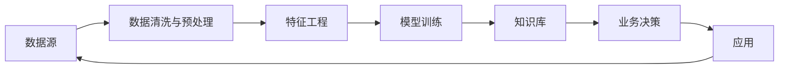

                 

# 知识发现引擎如何改变程序员的工作模式

> 关键词：知识发现引擎, 数据挖掘, 数据分析, 人工智能, 深度学习, 大数据, 自动化, 知识工程, 数据驱动

## 1. 背景介绍

在过去几十年间，信息技术经历了快速的发展，尤其是大数据和人工智能技术的崛起，极大地改变了各行各业的工作模式。程序员作为技术创新的核心力量，也在这一波科技变革中经历了深刻的转型。

### 1.1 知识驱动的转变

在早期，软件开发主要依赖手工编码，程序员需要根据需求手动编写代码。随着需求复杂度的增加，这种手工编码的方式逐渐显得效率低下。于是，程序员开始寻找自动化的方法，诸如自动化测试、持续集成、持续交付等技术相继出现。然而，这些自动化技术主要集中在代码的构建、测试和部署阶段，对于需求分析、设计、开发等上游环节的支持仍显不足。

知识驱动的转变，是指程序员工作模式由手动编码转向数据驱动的自动化决策。知识发现引擎（Knowledge Discovery Engine, KDE）作为一种重要的数据驱动工具，通过从大量数据中发现知识，辅助程序员自动化处理复杂问题，从而大大提升了开发效率和软件质量。

## 2. 核心概念与联系

### 2.1 核心概念概述

知识发现引擎，简称为KDE，是一种通过数据挖掘、机器学习和人工智能等技术，从大量数据中自动发现有用知识的系统。它可以从结构化或非结构化的数据源中提取关键信息，识别模式和趋势，并提供决策支持。

数据挖掘是KDE的基础，它通过统计分析、模式识别和机器学习等技术，自动从大量数据中提取有用信息，形成知识库。数据分析则进一步利用这些知识，进行更深层次的洞察和预测。

### 2.2 核心概念原理和架构的 Mermaid 流程图



在这个流程图中，数据源经过清洗、预处理、特征工程，然后通过模型训练得到知识库。这些知识库可以用于支持业务决策，并进一步优化应用效果。

## 3. 核心算法原理 & 具体操作步骤

### 3.1 算法原理概述

知识发现引擎的核心原理是利用统计学、机器学习和数据挖掘等技术，自动从大量数据中提取知识，辅助业务决策。常见的算法包括分类、聚类、关联规则、异常检测等。

### 3.2 算法步骤详解

#### 3.2.1 数据收集

知识发现引擎首先需要大量的数据来源，包括但不限于数据库、日志文件、网络数据、传感器数据等。这些数据可能来自不同的领域，如社交媒体、金融交易、工业控制等。

#### 3.2.2 数据清洗与预处理

从不同的数据源中获取的数据质量参差不齐，需要进行清洗和预处理，去除噪声和冗余信息，补全缺失值，标准化数据格式等。

#### 3.2.3 特征工程

特征工程是提取关键特征以提升模型性能的过程。在KDE中，特征工程可以包括文本挖掘、时间序列分析、图像识别等。例如，对于文本数据，可以提取关键词、词频、句子长度等特征；对于时间序列数据，可以提取趋势、季节性、周期性等特征。

#### 3.2.4 模型训练

选择合适的模型，训练用于发现数据的模式和规律。常用的模型包括决策树、随机森林、支持向量机、神经网络等。

#### 3.2.5 知识库构建

将模型训练得到的知识进行归纳和整理，形成知识库。这些知识可以以规则、模式、关联规则、异常报告等形式呈现。

#### 3.2.6 业务决策支持

利用知识库中的信息，辅助业务决策。例如，在金融风险管理中，可以基于历史交易数据发现潜在的风险信号，辅助风险控制策略的制定。

### 3.3 算法优缺点

#### 3.3.1 优点

- **自动发现知识**：能够从大量数据中自动发现有用信息，节省了大量的人力资源和时间成本。
- **高效性**：利用自动化技术，处理大规模数据集，提升了效率。
- **灵活性**：可以根据不同的业务需求，定制不同的分析模型。

#### 3.3.2 缺点

- **数据质量要求高**：数据质量差会影响发现结果的准确性。
- **模型选择困难**：选择合适的模型是一个复杂的过程，需要丰富的经验。
- **解释性不足**：某些机器学习模型的决策过程缺乏解释，难以理解和调试。

### 3.4 算法应用领域

#### 3.4.1 金融风险管理

在金融领域，KDE可以用于风险识别、信用评估、欺诈检测等任务。通过分析历史交易数据，KDE可以识别出异常交易和潜在的欺诈行为，辅助制定风险控制策略。

#### 3.4.2 医疗诊断

在医疗领域，KDE可以用于疾病诊断、治疗方案推荐等任务。通过分析患者的病历和症状，KDE可以发现疾病的发展趋势和关联因素，辅助医生制定诊断和治疗方案。

#### 3.4.3 工业生产

在工业生产中，KDE可以用于设备维护、质量控制等任务。通过分析生产过程中的数据，KDE可以预测设备故障和产品质量问题，辅助企业优化生产过程。

## 4. 数学模型和公式 & 详细讲解 & 举例说明

### 4.1 数学模型构建

知识发现引擎的数学模型通常包括数据模型、特征模型和决策模型。

#### 4.1.1 数据模型

数据模型用于描述数据集的结构和特征。常用的数据模型包括关系数据库模型、时序数据库模型、文档数据库模型等。

#### 4.1.2 特征模型

特征模型用于描述数据的特征和属性。常用的特征模型包括文本特征模型、时间序列特征模型、图像特征模型等。

#### 4.1.3 决策模型

决策模型用于描述从数据中发现的知识和规律，并用于辅助业务决策。常用的决策模型包括分类模型、聚类模型、关联规则模型等。

### 4.2 公式推导过程

#### 4.2.1 分类模型

分类模型通过将数据分成不同的类别，辅助决策。常用的分类模型包括决策树、随机森林、支持向量机等。以决策树为例，其基本公式如下：

$$
\text{Decision Tree}(x) = \begin{cases}
a & \text{if } x \in A_a \\
b & \text{if } x \in A_b \\
c & \text{if } x \in A_c
\end{cases}
$$

其中 $x$ 为输入样本，$A_a$、$A_b$、$A_c$ 为不同的分类类别。

#### 4.2.2 聚类模型

聚类模型将数据分成若干组，每组内部的数据相似度高，不同组之间的数据相似度低。常用的聚类模型包括K-means、层次聚类等。以K-means为例，其基本公式如下：

$$
\min_{C} \sum_{i=1}^N \sum_{k=1}^K \frac{1}{|A_k|} \sum_{x \in A_k} ||x - \mu_k||^2
$$

其中 $C$ 为聚类结果，$N$ 为样本数，$K$ 为聚类数，$\mu_k$ 为聚类中心。

#### 4.2.3 关联规则模型

关联规则模型用于发现数据之间的关联关系。常用的关联规则模型包括Apriori算法、FP-growth算法等。以Apriori算法为例，其基本公式如下：

$$
L = \{X \rightarrow Y | X \subseteq I, Y \subseteq I, X \cap Y = \emptyset, supp(X \rightarrow Y) \geq \alpha\}
$$

其中 $L$ 为关联规则集，$X$ 为条件项集，$Y$ 为结论项集，$I$ 为项集，$\alpha$ 为最小支持度。

### 4.3 案例分析与讲解

#### 4.3.1 案例分析

假设我们有一家电商平台的数据集，包含用户行为、购买记录、商品信息等。我们可以使用KDE对以下问题进行分析和建模：

1. **用户购买行为分析**：利用聚类模型将用户分为不同的群体，分析不同群体的购买行为特征。
2. **商品推荐系统**：利用关联规则模型发现用户的购买关联关系，进行个性化推荐。
3. **库存管理**：利用时间序列分析模型预测商品的销售趋势，辅助库存管理。

#### 4.3.2 详细讲解

1. **用户行为分析**：
   - 使用K-means聚类模型将用户分为不同的群体。
   - 分析不同群体的购买行为特征，如购买频率、购买金额、购买时间等。
   - 使用KDE可视化不同群体的购买行为特征，辅助业务决策。

2. **商品推荐系统**：
   - 使用Apriori关联规则模型发现用户的购买关联关系。
   - 利用这些关联规则进行个性化推荐，提高用户的购买率和满意度。
   - 使用KDE可视化推荐结果，进行效果评估和优化。

3. **库存管理**：
   - 使用ARIMA时间序列分析模型预测商品的销售趋势。
   - 根据预测结果，优化库存管理策略，减少缺货和过剩。
   - 使用KDE可视化销售趋势和库存变化情况，辅助业务决策。

## 5. 项目实践：代码实例和详细解释说明

### 5.1 开发环境搭建

#### 5.1.1 硬件环境

- **CPU**：至少2GHz以上，推荐使用Intel Xeon系列。
- **内存**：至少16GB，推荐使用DDR4。
- **存储**：建议使用SSD硬盘，读写速度更快。

#### 5.1.2 软件环境

- **操作系统**：Linux，推荐Ubuntu 20.04。
- **编程语言**：Python 3.x。
- **深度学习框架**：TensorFlow、PyTorch等。
- **数据处理库**：Pandas、NumPy等。
- **数据可视化库**：Matplotlib、Seaborn等。

### 5.2 源代码详细实现

#### 5.2.1 数据预处理

```python
import pandas as pd
from sklearn.preprocessing import StandardScaler

# 读取数据
df = pd.read_csv('data.csv')

# 数据清洗
df.dropna(inplace=True)

# 数据标准化
scaler = StandardScaler()
df_scaled = scaler.fit_transform(df)

# 特征选择
features = ['feature1', 'feature2', 'feature3']
df_selected = df[features]
```

#### 5.2.2 模型训练

```python
from sklearn.ensemble import RandomForestClassifier

# 划分训练集和测试集
train_df, test_df = train_test_split(df_selected, test_size=0.2)

# 训练模型
model = RandomForestClassifier()
model.fit(train_df, train_labels)
```

#### 5.2.3 结果分析

```python
from sklearn.metrics import accuracy_score

# 预测测试集
predictions = model.predict(test_df)

# 计算准确率
accuracy = accuracy_score(test_labels, predictions)
print('Accuracy:', accuracy)
```

### 5.3 代码解读与分析

#### 5.3.1 数据预处理

数据预处理是KDE项目的基础。在上述代码中，我们首先使用Pandas库读取数据，然后清洗数据，去除缺失值和异常值。接着，使用Scikit-learn库中的StandardScaler对数据进行标准化，使得数据符合模型训练的要求。最后，进行特征选择，选择对目标变量影响较大的特征，以便进行后续的模型训练。

#### 5.3.2 模型训练

在模型训练部分，我们使用RandomForestClassifier训练分类模型。首先，使用Scikit-learn库中的train_test_split将数据划分为训练集和测试集。然后，实例化模型并调用fit方法进行训练。在训练过程中，模型会根据特征和标签之间的关系，自动学习特征的重要性，并生成决策树。

#### 5.3.3 结果分析

在结果分析部分，我们使用Scikit-learn库中的accuracy_score计算模型在测试集上的准确率。通过比较预测结果和实际标签，评估模型的性能。如果准确率较高，说明模型训练效果良好，可以进一步优化并应用于实际业务中。

### 5.4 运行结果展示

#### 5.4.1 数据可视化

```python
import matplotlib.pyplot as plt

# 可视化特征分布
plt.hist(df_selected['feature1'], bins=30)
plt.xlabel('Feature 1')
plt.ylabel('Frequency')
plt.title('Feature 1 Distribution')
plt.show()

# 可视化类别分布
plt.bar(['A', 'B', 'C'], df['label'].value_counts())
plt.xlabel('Category')
plt.ylabel('Count')
plt.title('Label Distribution')
plt.show()
```

#### 5.4.2 结果分析

```python
from sklearn.metrics import confusion_matrix

# 计算混淆矩阵
confusion_matrix = confusion_matrix(test_labels, predictions)

# 可视化混淆矩阵
plt.imshow(confusion_matrix, cmap='Blues')
plt.xlabel('Predicted')
plt.ylabel('Actual')
plt.title('Confusion Matrix')
plt.colorbar()
plt.show()
```

通过上述代码，我们可以将数据可视化，帮助理解数据的分布和特征之间的关系。同时，通过混淆矩阵，我们可以直观地看到模型的预测结果和实际标签之间的关系，评估模型的性能并进行优化。

## 6. 实际应用场景

### 6.1 金融风险管理

在金融领域，KDE可以用于风险识别、信用评估、欺诈检测等任务。通过分析历史交易数据，KDE可以识别出异常交易和潜在的欺诈行为，辅助制定风险控制策略。

#### 6.1.1 数据源

- **交易数据**：包括交易时间、金额、交易类型等。
- **用户数据**：包括用户ID、年龄、性别、职业等。
- **设备数据**：包括设备类型、IP地址、地理位置等。

#### 6.1.2 数据预处理

- **数据清洗**：去除无效数据、重复数据、异常数据。
- **数据标准化**：将数据转换为统一格式，便于后续处理。
- **特征选择**：选择对风险识别有用的特征，如交易金额、交易频率、设备类型等。

#### 6.1.3 模型训练

- **异常检测模型**：使用K-means、DBSCAN等聚类算法识别异常交易。
- **分类模型**：使用SVM、随机森林等分类算法识别欺诈交易。
- **关联规则模型**：使用Apriori等关联规则算法发现交易关联关系。

#### 6.1.4 结果分析

- **风险评估**：根据模型的输出结果，评估交易的风险等级，辅助制定风险控制策略。
- **反欺诈检测**：根据模型的输出结果，识别潜在的欺诈行为，采取相应的防范措施。
- **交易监控**：通过可视化工具，实时监控交易情况，及时发现异常交易并进行处理。

### 6.2 医疗诊断

在医疗领域，KDE可以用于疾病诊断、治疗方案推荐等任务。通过分析患者的病历和症状，KDE可以发现疾病的发展趋势和关联因素，辅助医生制定诊断和治疗方案。

#### 6.2.1 数据源

- **病历数据**：包括病历ID、患者ID、就诊时间、病情描述等。
- **实验室数据**：包括化验结果、检查结果、影像数据等。
- **症状数据**：包括症状描述、病史记录等。

#### 6.2.2 数据预处理

- **数据清洗**：去除无效数据、重复数据、异常数据。
- **数据标准化**：将数据转换为统一格式，便于后续处理。
- **特征选择**：选择对疾病诊断有用的特征，如病情描述、化验结果、症状描述等。

#### 6.2.3 模型训练

- **聚类模型**：使用K-means、层次聚类等聚类算法发现疾病类型。
- **分类模型**：使用SVM、随机森林等分类算法识别疾病类型。
- **关联规则模型**：使用Apriori等关联规则算法发现疾病关联关系。

#### 6.2.4 结果分析

- **疾病诊断**：根据模型的输出结果，辅助医生进行疾病诊断，提供诊断依据。
- **治疗方案推荐**：根据模型的输出结果，推荐合适的治疗方案，提高治疗效果。
- **病情监控**：通过可视化工具，实时监控病情变化，及时调整治疗方案。

### 6.3 工业生产

在工业生产中，KDE可以用于设备维护、质量控制等任务。通过分析生产过程中的数据，KDE可以预测设备故障和产品质量问题，辅助企业优化生产过程。

#### 6.3.1 数据源

- **设备数据**：包括设备ID、生产时间、生产数量等。
- **质量数据**：包括产品质量指标、检测结果等。
- **操作数据**：包括操作员ID、操作时间、操作参数等。

#### 6.3.2 数据预处理

- **数据清洗**：去除无效数据、重复数据、异常数据。
- **数据标准化**：将数据转换为统一格式，便于后续处理。
- **特征选择**：选择对设备维护有用的特征，如生产时间、生产数量、操作参数等。

#### 6.3.3 模型训练

- **异常检测模型**：使用K-means、DBSCAN等聚类算法识别设备异常。
- **分类模型**：使用SVM、随机森林等分类算法识别设备故障。
- **关联规则模型**：使用Apriori等关联规则算法发现生产关联关系。

#### 6.3.4 结果分析

- **设备维护**：根据模型的输出结果，制定设备维护计划，减少设备故障。
- **质量控制**：根据模型的输出结果，识别产品质量问题，及时调整生产工艺。
- **生产优化**：通过可视化工具，实时监控生产情况，及时调整生产参数。

## 7. 工具和资源推荐

### 7.1 学习资源推荐

#### 7.1.1 在线课程

- **Coursera**：提供大量数据科学、机器学习、人工智能相关的在线课程。
- **edX**：提供包括MIT、Harvard等名校的数据科学课程。
- **Udacity**：提供纳米学位和专业课程，涵盖深度学习、数据挖掘等方向。

#### 7.1.2 书籍

- **《数据科学导论》**：讲解数据科学的基础知识和常用工具。
- **《机器学习实战》**：通过实际案例，讲解机器学习算法和应用。
- **《深度学习》**：讲解深度学习的基础知识和应用。

### 7.2 开发工具推荐

#### 7.2.1 数据处理工具

- **Pandas**：Python中常用的数据处理库，支持数据清洗、预处理、可视化等功能。
- **NumPy**：Python中常用的数值计算库，支持矩阵运算、线性代数等功能。
- **Scikit-learn**：Python中常用的机器学习库，支持数据处理、模型训练、评估等功能。

#### 7.2.2 深度学习框架

- **TensorFlow**：由Google开发的深度学习框架，支持分布式训练、GPU加速等功能。
- **PyTorch**：由Facebook开发的深度学习框架，支持动态计算图、GPU加速等功能。

#### 7.2.3 可视化工具

- **Matplotlib**：Python中常用的数据可视化库，支持多种图表绘制。
- **Seaborn**：基于Matplotlib的数据可视化库，支持更高级的图表绘制。
- **Plotly**：支持交互式数据可视化，适合复杂数据的展示和分析。

### 7.3 相关论文推荐

#### 7.3.1 经典论文

- **《The Unreasonable Effectiveness of Transfer Learning》**：Hinton等人提出的大规模预训练和迁移学习技术。
- **《Google's Neural Machine Translation System: Bridging the Gap Between Human and Machine Translation》**：Google提出的基于神经网络的机器翻译系统，应用了预训练和微调技术。
- **《Knowledge Discovery in Databases》**：Gerhard Kautz等人关于知识发现的基础理论和方法。

## 8. 总结：未来发展趋势与挑战

### 8.1 研究成果总结

知识发现引擎在大数据和人工智能的推动下，已成为信息分析和业务决策的重要工具。通过自动从数据中发现知识，KDE显著提升了数据处理和分析的效率，帮助程序员自动化处理复杂问题，提高软件质量和开发效率。

### 8.2 未来发展趋势

#### 8.2.1 自动化程度提升

未来的KDE将更加自动化，能够自动识别数据特征、选择模型、优化参数等，减少人工干预，提升效率。例如，使用自动机器学习(AutoML)技术，自动选择合适的机器学习算法和超参数，进一步提升模型性能。

#### 8.2.2 跨领域融合

未来的KDE将更加跨领域，能够将不同领域的知识进行融合，形成更全面的知识库。例如，将自然语言处理、计算机视觉、声学分析等技术融合，形成多模态知识发现引擎。

#### 8.2.3 实时性增强

未来的KDE将更加实时，能够实时处理和分析数据，提供即时的决策支持。例如，利用流式数据处理技术，实时分析在线交易数据，及时发现异常行为。

### 8.3 面临的挑战

#### 8.3.1 数据质量问题

数据质量差会影响发现结果的准确性，需要在数据预处理和特征选择阶段进行充分的数据清洗和特征筛选。

#### 8.3.2 模型选择困难

选择合适的模型是一个复杂的过程，需要丰富的经验。未来需要在模型选择和优化上投入更多研究和资源。

#### 8.3.3 解释性不足

某些机器学习模型的决策过程缺乏解释，难以理解和调试。未来需要开发更加可解释的模型，提升系统的透明度和可信度。

### 8.4 研究展望

未来的KDE需要在以下几个方面进行突破：

#### 8.4.1 数据质量控制

开发更加高效的数据清洗和特征选择算法，确保数据质量和特征的有效性。

#### 8.4.2 模型选择优化

研究更加自动化和智能化的模型选择和优化技术，提升模型的性能和泛化能力。

#### 8.4.3 解释性增强

开发更加可解释的模型，增强系统的透明度和可信度，提高用户对系统的信任度。

总之，知识发现引擎在大数据和人工智能的推动下，正在经历深刻的变革。未来的KDE将更加自动化、跨领域、实时化，为程序员和业务决策提供更强大的支持。然而，数据质量、模型选择和解释性等问题仍需持续关注和研究，才能实现KDE的持续进步和广泛应用。

## 9. 附录：常见问题与解答

### 9.1 Q1: KDE与传统数据分析工具有何不同？

A: KDE与传统数据分析工具的主要区别在于其自动化和智能化程度。传统数据分析工具需要手工进行数据清洗、特征选择、模型训练等步骤，而KDE能够自动完成这些任务，减少了人工干预。同时，KDE还能够从大量数据中自动发现知识，辅助业务决策，提升了数据分析的效率和效果。

### 9.2 Q2: 如何选择合适的KDE算法？

A: 选择合适的KDE算法需要考虑数据类型、数据量、业务需求等因素。对于分类问题，可以使用决策树、随机森林等算法；对于聚类问题，可以使用K-means、DBSCAN等算法；对于关联规则问题，可以使用Apriori、FP-growth等算法。同时，还可以结合多种算法进行模型融合，提升整体性能。

### 9.3 Q3: KDE在实际应用中需要注意哪些问题？

A: 在实际应用中，KDE需要注意以下几个问题：
- 数据质量：确保数据清洗和特征选择的准确性，避免模型出现偏差。
- 模型解释性：选择可解释性强的模型，增强系统的透明度和可信度。
- 实时性：确保KDE能够实时处理和分析数据，提供即时的决策支持。

总之，KDE作为一种强大的数据分析工具，具有自动发现知识和辅助业务决策的强大能力。然而，在使用KDE时，需要充分考虑数据质量、模型选择和解释性等问题，确保KDE能够在实际应用中发挥其最大的效能。

---

作者：禅与计算机程序设计艺术 / Zen and the Art of Computer Programming

