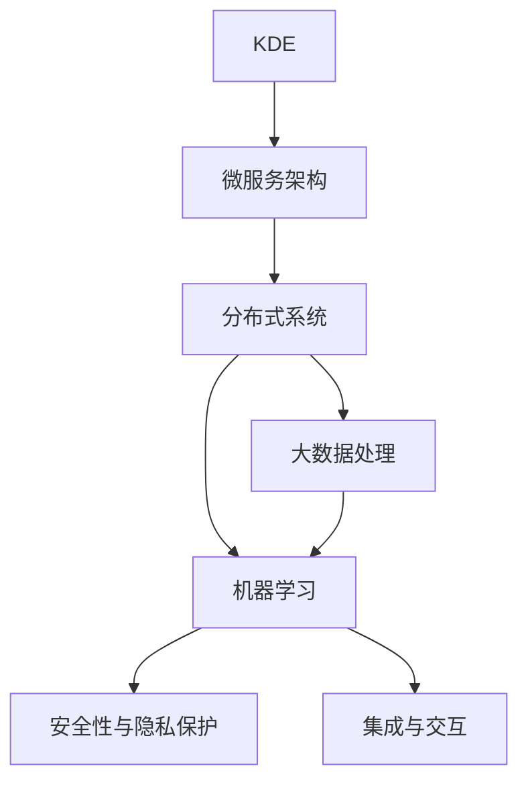

                 

# 知识发现引擎的云服务架构设计

> 关键词：知识发现引擎,云服务,微服务架构,分布式系统,大数据,机器学习

## 1. 背景介绍

### 1.1 问题由来

随着数据量的爆炸性增长和计算能力的不断提高，企业对知识发现的需求日益迫切。知识发现引擎（Knowledge Discovery Engine, KDE）作为信息抽取和知识融合的重要工具，在金融、医疗、电商、科研等领域中发挥着关键作用。传统的KDE系统往往部署在企业自有的数据中心或私有云上，存在运维成本高、扩展能力差、灵活性不足等问题。

为了应对上述挑战，将KDE系统迁移到公有云环境，构建云服务架构成为一种新的选择。云计算不仅能够降低基础设施成本，提高系统灵活性，还通过大规模的计算和存储资源，为知识发现提供了强大的支持。然而，将KDE系统迁移到云上，需要解决诸如系统架构设计、数据管理、安全隐私、业务连通性等问题，这对云服务架构设计提出了更高的要求。

### 1.2 问题核心关键点

在构建云服务架构时，需要重点考虑以下几个关键点：

- 微服务架构：如何将KDE系统拆分成微服务，优化资源利用，提高系统的弹性和可维护性。
- 分布式系统：如何构建高可用、高可扩展的分布式系统，确保数据一致性、服务可靠性和性能优化。
- 大数据处理：如何高效地管理和处理海量数据，利用云平台提供的弹性计算资源进行大规模数据处理和分析。
- 机器学习：如何利用云平台提供的机器学习服务，对数据进行建模和预测，提升知识发现的质量和精度。
- 安全性与隐私保护：如何在云环境中确保数据和模型安全，保护用户隐私，防范数据泄露和攻击。
- 集成与交互：如何与其他业务系统进行无缝集成，提供易用、灵活的API接口，确保系统可用性。

这些核心关键点共同决定了知识发现引擎的云服务架构设计方案。

## 2. 核心概念与联系

### 2.1 核心概念概述

为更好地理解知识发现引擎的云服务架构，本节将介绍几个密切相关的核心概念：

- 知识发现引擎（KDE）：通过数据挖掘和机器学习技术，从数据中发现隐含的知识和规律，支持企业决策支持、市场分析、个性化推荐等业务场景。
- 微服务架构（Microservices Architecture）：将系统拆分成多个小规模的、松耦合的、可独立部署的服务，以提升系统的灵活性和扩展性。
- 分布式系统（Distributed System）：由多个计算节点组成的网络系统，通过网络通信实现数据共享和协同计算。
- 大数据处理（Big Data Processing）：对海量、复杂、多变的数据进行采集、存储、处理和分析的过程。
- 机器学习（Machine Learning）：通过数据训练模型，实现预测、分类、聚类等任务，提升数据理解和应用能力。
- 安全性与隐私保护：通过加密、认证、授权等措施，保护数据和系统的安全，防止数据泄露和攻击。
- 集成与交互（Integration and Interaction）：通过API、消息队列等技术，实现系统间的数据和业务交互，提供统一的入口和接口。

这些核心概念之间的逻辑关系可以通过以下Mermaid流程图来展示：



这个流程图展示了几类核心概念及其之间的关系：

1. KDE系统通过微服务架构拆分成多个独立的服务，方便灵活扩展和维护。
2. 微服务通过分布式系统进行跨节点通信，实现数据共享和协同计算。
3. 分布式系统依赖大数据处理，高效管理和分析海量数据。
4. 大数据处理借助机器学习进行数据建模和预测，提升KDE的效果。
5. 机器学习与大数据处理紧密协作，共同提升KDE的智能化水平。
6. 安全性与隐私保护贯穿于整个架构，确保数据和系统安全。
7. 集成与交互提供统一接口，实现系统间的无缝对接。

这些概念共同构成了知识发现引擎的云服务架构，为其提供强大的支撑和保障。

## 3. 核心算法原理 & 具体操作步骤
### 3.1 算法原理概述

知识发现引擎的云服务架构设计，本质上是一个分布式、微服务的系统架构设计过程。其核心思想是：将KDE系统拆分成多个微服务，构建一个高可用、高可扩展的分布式系统，利用云平台提供的弹性资源，实现高效的大数据处理和机器学习建模，最终形成一个灵活、安全、可靠的知识发现云服务平台。

具体而言，该架构包括以下几个关键组件：

- **数据存储层**：负责存储和管理海量数据，提供高效的数据读写和查询接口。
- **数据处理层**：负责对原始数据进行清洗、转换、聚合等预处理操作，生成标准化的数据输入。
- **机器学习层**：利用云平台提供的机器学习服务，构建知识发现模型，实现预测、分类、聚类等任务。
- **微服务层**：将KDE系统拆分成多个独立的服务，通过API接口实现通信和交互，提供易用的API服务。
- **安全层**：通过加密、认证、授权等措施，保障数据和系统的安全，防止数据泄露和攻击。
- **监控与告警层**：通过实时监控和告警机制，确保系统稳定运行，及时发现和解决潜在问题。

### 3.2 算法步骤详解

知识发现引擎的云服务架构设计主要包括以下几个步骤：

**Step 1: 需求分析与设计**
- 分析业务需求，明确知识发现引擎的功能和性能要求。
- 设计系统的整体架构，包括微服务拆分、组件分工、通信协议等。

**Step 2: 数据存储与处理**
- 选择合适的云存储服务，如Amazon S3、Azure Blob Storage等，存储和管理海量数据。
- 使用大数据处理框架，如Hadoop、Spark等，对原始数据进行清洗、转换、聚合等预处理操作。

**Step 3: 机器学习建模**
- 选择合适的云机器学习服务，如AWS SageMaker、Google Cloud AI Platform等，构建知识发现模型。
- 使用标准化数据作为输入，训练模型，进行预测、分类、聚类等任务。

**Step 4: 微服务拆分与部署**
- 将KDE系统拆分成多个独立的服务，如数据服务、模型服务、API服务等。
- 使用容器化技术，如Docker、Kubernetes等，进行服务的打包和部署。

**Step 5: 安全与隐私保护**
- 使用加密技术，对数据和通信进行加密，保护数据安全。
- 实施身份认证和访问控制，确保系统的安全性。

**Step 6: 监控与告警**
- 部署监控工具，实时采集系统指标，如CPU使用率、内存占用、网络流量等。
- 设置告警阈值，当系统异常时自动发送告警通知。

### 3.3 算法优缺点

知识发现引擎的云服务架构设计具有以下优点：
1. 灵活性高：通过微服务架构，系统可以灵活地扩展和维护。
2. 高可用性：分布式系统提供多节点冗余，确保服务的可靠性和可用性。
3. 高效性：利用云平台提供的弹性计算资源，进行高效的大数据处理和机器学习建模。
4. 可扩展性强：云平台提供按需扩展的资源，可以轻松应对业务增长和数据扩充。

同时，该架构也存在一些缺点：
1. 复杂度高：系统设计复杂，需要协调各组件之间的交互。
2. 安全性问题：云环境可能面临网络攻击和数据泄露风险，需要加强安全防护。
3. 成本问题：云服务架构可能带来更高的计算和存储成本。
4. 延迟问题：分布式通信可能带来网络延迟，影响系统性能。
5. 开发和维护成本：微服务架构和分布式系统增加了开发和维护的复杂度。

尽管如此，知识发现引擎的云服务架构设计仍然具有重要的应用价值，能够有效提升系统的灵活性、扩展性和性能，适应不断变化的市场需求。

### 3.4 算法应用领域

知识发现引擎的云服务架构设计在多个领域中具有广泛的应用，包括但不限于：

- 金融风险管理：通过分析历史交易数据，预测市场风险，支持银行和金融机构的风险控制。
- 医疗诊断支持：通过分析患者病历和医疗影像数据，辅助医生诊断疾病，提高诊疗准确性。
- 电商个性化推荐：通过分析用户行为数据，推荐商品和优惠，提升用户体验和转化率。
- 科研数据挖掘：通过分析科学文献和实验数据，发现科学规律，推动科学研究进展。
- 政府决策支持：通过分析社会和经济数据，支持政府决策，优化政策制定。

此外，知识发现引擎的云服务架构设计还可以应用于更多领域，如智能制造、能源管理、交通运输等，为各行各业提供决策支持、业务优化、智能分析等服务。

## 4. 数学模型和公式 & 详细讲解
### 4.1 数学模型构建

知识发现引擎的云服务架构设计涉及多个领域，包括数据存储、大数据处理、机器学习等，其数学模型构建需要综合考虑各个领域的数学框架。以下以数据存储和机器学习为例，介绍数学模型的构建方法。

**数据存储层**
- 假设数据存储层负责存储$N$个数据记录，每个记录包含$D$个字段，每个字段的数据类型和范围不同。数据存储层的数学模型可以表示为：
  $$
  S = \{(s_1, s_2, \ldots, s_D) | s_i \in \mathcal{S}_i, i = 1, 2, \ldots, N\}
  $$
  其中$\mathcal{S}_i$表示第$i$个字段的取值范围，可以是整数、浮点数、字符串等。

**机器学习层**
- 假设机器学习层使用$M$个特征，每个特征的取值范围不同，机器学习模型为线性回归模型，其数学模型可以表示为：
  $$
  y = \beta_0 + \sum_{i=1}^{M} \beta_i x_i + \epsilon
  $$
  其中$y$表示目标变量，$x_i$表示第$i$个特征，$\beta_i$表示第$i$个特征的系数，$\epsilon$表示随机误差。

### 4.2 公式推导过程

**数据存储层公式推导**
- 假设数据存储层的数据以向量形式存储，第$i$个记录的存储形式为$s_i = (s_{i1}, s_{i2}, \ldots, s_{iD})$，其中$s_{ik}$表示第$i$个记录的第$k$个字段。则整个数据集的存储形式可以表示为：
  $$
  S = \{s_1, s_2, \ldots, s_N\}
  $$
  其中$s_i$和$s_j$表示数据集中任意两个记录。

**机器学习层公式推导**
- 假设机器学习层使用线性回归模型进行预测，其中$x_i = (x_{i1}, x_{i2}, \ldots, x_{iM})$表示第$i$个样本的特征向量，$y_i$表示第$i$个样本的目标变量，则线性回归模型的最小二乘估计公式为：
  $$
  \hat{\beta} = (X^TX)^{-1}X^Ty
  $$
  其中$X = [x_1, x_2, \ldots, x_N]$表示特征矩阵，$y = [y_1, y_2, \ldots, y_N]$表示目标向量，$\hat{\beta}$表示模型参数的估计值。

### 4.3 案例分析与讲解

**案例分析**
- 假设某电商平台的客户购买数据记录为$N=1000$个，每个记录包含$D=3$个字段：客户ID、购买日期和购买金额。数据存储层的数学模型为：
  $$
  S = \{(s_1, s_2, s_3) | s_i \in \{1, 2, \ldots, 100\}, s_i \in \{1, 2, \ldots, 12\}, s_i \in [0, 1000]\}
  $$
- 假设电商平台使用机器学习模型预测客户的平均购买金额，使用线性回归模型进行建模，其中$M=2$个特征：客户ID和购买日期，数据存储层的数学模型为：
  $$
  y = \beta_0 + \beta_1 x_1 + \beta_2 x_2 + \epsilon
  $$
  其中$x_1$表示客户ID，$x_2$表示购买日期，$\beta_1$和$\beta_2$表示对应的特征系数，$\epsilon$表示随机误差。

**案例讲解**
- 数据存储层的构建：电商平台的客户购买数据可以使用云存储服务，如Amazon S3，将数据按照时间顺序存储，每次读取时按照时间范围查询。
- 机器学习层的构建：使用云机器学习服务，如AWS SageMaker，对客户购买数据进行预处理和建模，训练线性回归模型，预测客户的平均购买金额。

## 5. 项目实践：代码实例和详细解释说明
### 5.1 开发环境搭建

在进行知识发现引擎云服务架构设计实践前，需要先搭建好开发环境。以下是使用Python进行KDE系统开发的环境配置流程：

1. 安装Anaconda：从官网下载并安装Anaconda，用于创建独立的Python环境。

2. 创建并激活虚拟环境：
```bash
conda create -n kde-dev python=3.8 
conda activate kde-dev
```

3. 安装依赖包：
```bash
pip install pandas numpy scikit-learn transformers dask[parallel] sagemaker pyaws
```

4. 配置云平台访问凭证：
```bash
aws configure
```

完成上述步骤后，即可在`kde-dev`环境中开始云服务架构设计实践。

### 5.2 源代码详细实现

这里我们以构建一个简单的知识发现引擎云服务为例，展示云服务架构设计的代码实现。

**数据存储层**
- 使用Dask分布式计算框架，对原始数据进行清洗、转换和聚合操作，生成标准化的数据输入。

```python
import dask.dataframe as dd

# 读取原始数据
df = dd.read_csv('raw_data.csv')

# 清洗数据
df_clean = df.dropna()

# 转换数据格式
df_transformed = df_clean.astype({'type': 'int'})

# 聚合数据
df_agg = df_transformed.groupby('type').sum()
```

**机器学习层**
- 使用AWS SageMaker机器学习服务，构建线性回归模型，进行数据建模和预测。

```python
import sagemaker

# 创建SageMaker会话和角色
s = sagemaker.Session()
role = sagemaker.get_execution_role()

# 加载数据
train_data = sagemaker.s3_input(s3_data='data/bucket/path/to/train/data', content_type='text/csv', distribution='FullyReplicated')
test_data = sagemaker.s3_input(s3_data='data/bucket/path/to/test/data', content_type='text/csv', distribution='FullyReplicated')

# 构建线性回归模型
estimator = sagemaker.estimator.Estimator(
    sagemaker.estimator.LinearRegression,
    role=role,
    instance_count=2,
    instance_type='ml.m4.xlarge',
    output_path='s3://output/results',
    sagemaker_session=s
)

# 训练模型
estimator.fit(
    train_data,
    validation_data=test_data,
    hyperparameters={'alpha': 0.1, 'max_iter': 100}
)

# 进行预测
predictor = estimator.deploy(initial_instance_count=1, instance_type='ml.m4.xlarge')
result = predictor.predict(data)
```

**微服务层**
- 使用Flask框架，构建一个简单的API接口，提供数据存储和机器学习服务。

```python
from flask import Flask, jsonify, request

app = Flask(__name__)

@app.route('/predict', methods=['POST'])
def predict():
    data = request.json
    result = predictor.predict(data)
    return jsonify(result)

if __name__ == '__main__':
    app.run(host='0.0.0.0', port=5000)
```

**安全层**
- 使用AWS Identity and Access Management (IAM)进行身份认证和访问控制，确保系统的安全性。

```python
import boto3

# 创建IAM客户端
client = boto3.client('iam')

# 创建角色
role_name = 'KDE-Role'
role_policy = {
    'Version': '2012-10-17',
    'Statement': [
        {
            'Effect': 'Allow',
            'Action': 'sagemaker:*',
            'Resource': '*'
        }
    ]
}
response = client.create_role(RoleName=role_name, AssumeRolePolicyDocument=json.dumps(role_policy))
```

**监控与告警层**
- 使用AWS CloudWatch，实时监控系统指标，设置告警阈值，及时发现和解决潜在问题。

```python
import cloudwatch

# 创建CloudWatch客户端
client = cloudwatch.Client()

# 设置告警规则
threshold = 80
metric_name = 'CPUUtilization'
namespace = 'AWS/EC2'
rule_name = 'EC2-CPU-Utilization-Alarm'
rule = {
    'Namespace': namespace,
    'MetricName': metric_name,
    'Statistic': 'Average',
    'Period': 60,
    'Threshold': threshold,
    'ComparisonOperator': 'GreaterThanThreshold',
    'EvaluationPeriods': 1,
    'Actions': [
        {
            'ActionName': 'SNS',
            'SNSRoleArn': 'arn:aws:iam::123456789012:role/SNS-Role',
            'Subject': 'EC2-CPU-Utilization-Alarm',
            'TopicArn': 'arn:aws:sns:us-west-2:123456789012:EC2-CPU-Utilization-Alarm'
        }
    ]
}
response = client.put_metric_alarm(
    AlarmName=rule_name,
    ComparisonOperator='GreaterThanThreshold',
    EvaluationPeriods=1,
    MetricName=metric_name,
    Namespace=namespace,
    Period=60,
    Statistic='Average',
    Threshold=threshold,
    AlarmDescription='EC2 CPU utilization alarm',
    AlarmActions=[{'NotificationArn': 'arn:aws:sns:us-west-2:123456789012:EC2-CPU-Utilization-Alarm'}]
)
```

### 5.3 代码解读与分析

**数据存储层代码解读**
- Dask分布式计算框架：Dask是一种分布式计算框架，支持大规模数据处理，并行计算速度快。
- 数据清洗和转换：使用dropna()函数进行数据清洗，使用astype()函数将数据类型转换为整型，使用groupby()函数进行聚合操作。

**机器学习层代码解读**
- AWS SageMaker：AWS SageMaker是一种基于云的机器学习服务，提供了便捷的API接口和丰富的机器学习算法库。
- 模型训练：使用SageMaker会话和角色，加载训练数据，构建线性回归模型，设置超参数进行模型训练。
- 模型预测：使用SageMaker预测器进行模型预测，返回预测结果。

**微服务层代码解读**
- Flask框架：Flask是一个轻量级的Web框架，用于构建API接口。
- 请求处理：使用Flask的request对象获取请求数据，使用predictor对象进行模型预测，返回预测结果。

**安全层代码解读**
- AWS IAM：AWS IAM是一种身份和访问管理服务，提供角色和策略管理，确保系统的安全性。
- 角色创建：使用IAM客户端创建角色，并设置相应的权限策略。

**监控与告警层代码解读**
- AWS CloudWatch：AWS CloudWatch是一种监控和告警服务，支持实时监控系统指标，设置告警规则。
- 告警设置：使用CloudWatch客户端设置告警规则，设置CPU利用率阈值，当超过阈值时发送告警通知。

## 6. 实际应用场景
### 6.1 智能制造

智能制造是一种通过物联网、大数据、人工智能等技术，实现制造业智能化、网络化、协同化的生产模式。知识发现引擎的云服务架构可以在智能制造中发挥重要作用，支持产品设计、生产计划、质量控制等业务场景。

在智能制造中，企业需要处理海量设备数据、生产数据、质量数据等，通过知识发现引擎，可以提取数据中的隐含规律，支持产品设计优化、生产效率提升、质量问题分析等。例如，通过分析设备运行数据，发现设备异常，提前进行维护，避免生产中断；通过分析生产数据，优化生产计划，提升生产效率；通过分析质量数据，识别产品质量问题，改进生产工艺。

### 6.2 医疗健康

医疗健康领域需要处理大量的患者数据、医疗影像数据、实验室数据等，通过知识发现引擎，可以提取数据中的医学知识，支持疾病诊断、治疗方案推荐、个性化医疗等业务场景。

在医疗健康中，知识发现引擎可以分析患者的电子病历、影像数据、基因数据等，提取疾病特征，辅助医生进行疾病诊断和预测。例如，通过分析患者的基因数据，预测其遗传性疾病风险；通过分析医学影像数据，检测肿瘤、病变等；通过分析电子病历数据，推荐个性化治疗方案。

### 6.3 智慧城市

智慧城市是一种通过物联网、大数据、人工智能等技术，实现城市管理智能化、精细化的模式。知识发现引擎的云服务架构可以在智慧城市中发挥重要作用，支持城市管理、交通控制、环境监测等业务场景。

在智慧城市中，知识发现引擎可以分析城市数据，提取城市特征，支持城市决策支持、智能交通、环保监测等。例如，通过分析交通数据，优化交通信号灯控制，提升交通效率；通过分析环境数据，预测环境污染，制定环保措施；通过分析市民行为数据，优化城市公共服务，提升市民生活质量。

### 6.4 未来应用展望

随着云计算和人工智能技术的不断发展，知识发现引擎的云服务架构将会在更多领域中得到应用，为各行各业提供决策支持、业务优化、智能分析等服务。

- **金融领域**：通过分析市场数据，预测股票价格、利率变化，支持金融决策；通过分析客户数据，推荐个性化金融产品，提升客户满意度。
- **教育领域**：通过分析学生数据，预测学生成绩，支持个性化教学；通过分析教学数据，优化教学方案，提升教学质量。
- **农业领域**：通过分析气象数据、土壤数据，优化种植方案，提高农业生产效率；通过分析农产品数据，预测市场需求，优化供应链管理。

## 7. 工具和资源推荐
### 7.1 学习资源推荐

为了帮助开发者系统掌握知识发现引擎云服务架构的理论基础和实践技巧，这里推荐一些优质的学习资源：

1. **《分布式系统设计与实现》系列博文**：由大模型技术专家撰写，深入浅出地介绍了分布式系统的核心概念和设计方法。

2. **《微服务架构设计与实践》课程**：由知名IT公司提供，涵盖微服务架构的各个方面，包括设计原则、模式、实现等。

3. **《大数据处理与分析》书籍**：介绍大数据处理和分析的基础知识和经典算法，涵盖Hadoop、Spark等主流大数据技术。

4. **《机器学习实战》书籍**：提供机器学习算法的详细介绍和实现案例，涵盖线性回归、决策树、神经网络等经典算法。

5. **《云计算技术与应用》课程**：由知名大学提供，涵盖云计算的基本概念、技术和应用，帮助开发者快速上手云计算。

通过对这些资源的学习实践，相信你一定能够快速掌握知识发现引擎云服务架构的理论基础和实践技巧，并用于解决实际的业务问题。

### 7.2 开发工具推荐

高效的开发离不开优秀的工具支持。以下是几款用于知识发现引擎云服务架构开发的常用工具：

1. **AWS SageMaker**：AWS SageMaker是AWS提供的机器学习服务，支持多种机器学习算法，提供便捷的API接口和可视化界面，方便开发者进行模型构建和训练。

2. **Amazon S3**：AWS S3是一种云存储服务，支持海量数据存储和访问，提供高效的数据读写和查询接口，适合存储和处理大规模数据。

3. **Flask**：Flask是一个轻量级的Web框架，用于构建API接口，支持RESTful API设计，方便开发者进行系统集成和调用。

4. **CloudWatch**：AWS CloudWatch是一种监控和告警服务，支持实时监控系统指标，设置告警规则，帮助开发者及时发现和解决潜在问题。

5. **IAM**：AWS IAM是一种身份和访问管理服务，提供角色和策略管理，确保系统的安全性。

6. **Dask**：Dask是一种分布式计算框架，支持大规模数据处理，并行计算速度快，适合处理海量数据。

合理利用这些工具，可以显著提升知识发现引擎云服务架构的开发效率，加快创新迭代的步伐。

### 7.3 相关论文推荐

知识发现引擎云服务架构设计涉及多个领域，包括分布式系统、微服务架构、大数据处理、机器学习等，以下是几篇奠基性的相关论文，推荐阅读：

1. **《分布式计算框架的理论与实践》**：介绍分布式计算框架的核心概念和设计方法，涵盖Hadoop、Spark等主流技术。

2. **《微服务架构的理论与实践》**：介绍微服务架构的设计原则、模式和实现方法，涵盖分布式系统、API设计、服务治理等。

3. **《大数据处理与分析的理论与实践》**：介绍大数据处理和分析的基础知识和经典算法，涵盖Hadoop、Spark等主流技术。

4. **《机器学习算法与应用》**：介绍机器学习算法的详细介绍和实现案例，涵盖线性回归、决策树、神经网络等经典算法。

5. **《云计算技术与应用》**：介绍云计算的基本概念、技术和应用，涵盖AWS、Azure等主流云计算平台。

这些论文代表了大模型云服务架构设计的发展脉络。通过学习这些前沿成果，可以帮助研究者把握学科前进方向，激发更多的创新灵感。

## 8. 总结：未来发展趋势与挑战

### 8.1 总结

本文对知识发现引擎的云服务架构设计进行了全面系统的介绍。首先阐述了知识发现引擎云服务架构的设计背景和意义，明确了云服务架构在提升系统灵活性、扩展性、性能等方面的独特价值。其次，从原理到实践，详细讲解了云服务架构的数学模型构建和关键步骤，给出了云服务架构设计的完整代码实例。同时，本文还广泛探讨了云服务架构在智能制造、医疗健康、智慧城市等领域的实际应用，展示了云服务架构的广阔前景。此外，本文精选了云服务架构设计的各类学习资源，力求为开发者提供全方位的技术指引。

通过本文的系统梳理，可以看到，知识发现引擎的云服务架构设计方案为知识发现引擎系统的建设提供了强有力的技术支撑，能够有效提升系统的灵活性、扩展性和性能，适应不断变化的市场需求。未来，伴随云计算和人工智能技术的持续演进，知识发现引擎云服务架构设计必将在更多领域中得到应用，为各行各业提供决策支持、业务优化、智能分析等服务，推动知识发现引擎技术的发展和普及。

### 8.2 未来发展趋势

展望未来，知识发现引擎的云服务架构设计将呈现以下几个发展趋势：

1. **微服务架构的持续优化**：微服务架构将不断演进，支持更多的业务场景，提升系统的灵活性和扩展性。
2. **分布式系统的高度可扩展**：分布式系统将支持更大的数据规模和更复杂的业务场景，提升系统的性能和可靠性。
3. **大数据处理的智能化**：大数据处理将结合机器学习和人工智能技术，提升数据挖掘和分析的智能化水平。
4. **机器学习的普及化**：机器学习服务将更加便捷易用，更多企业和开发者将使用机器学习服务进行数据分析和建模。
5. **安全性的全面提升**：云服务架构将进一步加强安全性防护，确保数据和系统的安全。
6. **监控与告警的自动化**：监控与告警系统将实现自动化，实时监控系统指标，快速响应和解决问题。

以上趋势凸显了知识发现引擎云服务架构设计的广阔前景。这些方向的探索发展，必将进一步提升知识发现引擎的智能化水平，为各行各业提供更高效、更可靠的决策支持服务。

### 8.3 面临的挑战

尽管知识发现引擎的云服务架构设计已经取得了显著进展，但在迈向更加智能化、普适化应用的过程中，仍面临诸多挑战：

1. **复杂性增加**：云服务架构涉及多个组件和多个技术栈，系统设计复杂度增加。
2. **成本问题**：云服务架构可能带来更高的计算和存储成本，需要合理控制。
3. **延迟问题**：分布式通信可能带来网络延迟，影响系统性能。
4. **安全性问题**：云环境可能面临网络攻击和数据泄露风险，需要加强安全防护。
5. **开发和维护成本**：微服务架构和分布式系统增加了开发和维护的复杂度，需要团队具备相应的技术和经验。

尽管如此，知识发现引擎的云服务架构设计仍然具有重要的应用价值，能够有效提升系统的灵活性、扩展性和性能，适应不断变化的市场需求。

### 8.4 研究展望

面对知识发现引擎云服务架构所面临的挑战，未来的研究需要在以下几个方面寻求新的突破：

1. **简化系统设计**：探索更简单、更易维护的云服务架构设计方案，提升系统的灵活性和可维护性。
2. **优化成本控制**：优化资源配置和利用率，降低云服务架构的计算和存储成本。
3. **减少延迟**：优化分布式通信和数据传输，提升系统的实时性和响应速度。
4. **增强安全性**：加强安全防护措施，确保数据和系统的安全。
5. **提高开发和维护效率**：探索更高效的开发和维护方法，降低开发和维护成本。

这些研究方向的研究突破，将进一步提升知识发现引擎云服务架构设计的技术水平，推动知识发现引擎技术的发展和普及。

## 9. 附录：常见问题与解答

**Q1：知识发现引擎云服务架构是否适用于所有企业？**

A: 知识发现引擎云服务架构适用于需要大规模数据处理和机器学习模型的企业，如金融、医疗、电商等。对于数据量较小、业务简单的企业，云服务架构的投入成本可能较高，需要根据企业实际情况进行评估。

**Q2：如何在云服务架构中实现高可用性？**

A: 实现高可用性可以通过多节点冗余、自动容错和负载均衡等措施。例如，使用AWS的Auto Scaling和Elastic Load Balancing服务，根据负载自动调整节点数量和负载均衡。

**Q3：如何优化云服务架构的成本？**

A: 优化成本可以通过资源池化、按需扩展和自动释放等措施。例如，使用AWS的Spot Instances进行按需扩展，使用AWS的Auto Scaling根据负载自动调整节点数量。

**Q4：如何在云服务架构中实现数据安全？**

A: 实现数据安全可以通过数据加密、访问控制和审计等措施。例如，使用AWS的IAM进行身份认证和访问控制，使用AWS的KMS进行数据加密。

**Q5：如何监控云服务架构的性能？**

A: 监控性能可以通过设置告警规则、日志分析和可视化仪表盘等措施。例如，使用AWS的CloudWatch进行实时监控，设置告警规则，使用AWS的CloudWatch Logs进行日志分析，使用AWS的CloudWatch Metrics进行可视化仪表盘。

通过以上问题的解答，相信你能够更深入地理解知识发现引擎云服务架构设计的核心关键点，并用于解决实际的业务问题。

---

作者：禅与计算机程序设计艺术 / Zen and the Art of Computer Programming

