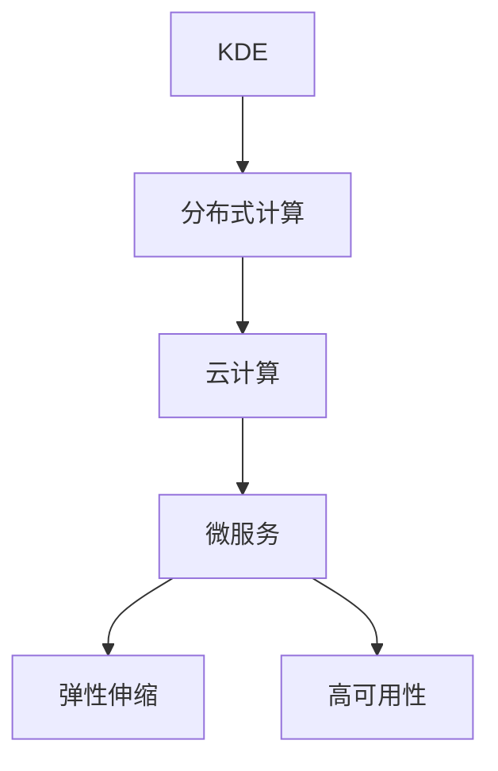

                 

# 知识发现引擎的云端部署与扩展

> 关键词：知识发现引擎, 云端部署, 扩展, 分布式计算, 大数据处理, 机器学习, 软件架构设计, 微服务

## 1. 背景介绍

### 1.1 问题由来

在大数据时代，企业的运营决策越来越依赖于对海量数据的分析挖掘。传统的业务查询系统已无法满足实时、深度、个性化的需求，基于数据挖掘和统计分析的知识发现引擎(Knowledge Discovery Engine, KDE)应运而生。KDE不仅能从历史数据中挖掘出隐藏的知识，还能通过预测分析和推荐系统提供前瞻性洞察，支持企业制定更科学、更精准的业务决策。

然而，随着数据量的爆炸性增长，单个KDE系统已难以承担超大规模数据集的存储和处理需求。同时，由于传统的KDE架构依赖于中心化存储和计算资源，在面对海量并发请求时，扩展性和可靠性也面临严峻挑战。为了应对这些问题，云端的KDE部署成为了一种高效的解决方案。

### 1.2 问题核心关键点

云端KDE的部署与扩展需要综合考虑以下几个关键点：

- 数据处理：如何将海量数据高效存储并处理，以支持分布式计算和实时分析。
- 分布式计算：如何设计高效、可扩展的计算架构，以应对海量请求和并发负载。
- 服务化设计：如何将KDE功能模块化封装，实现细粒度服务化部署，便于持续集成和部署。
- 弹性伸缩：如何实现资源的动态分配与回收，满足业务流量的实时变化需求。
- 高可用性：如何保证系统的高可用性和容错能力，避免单点故障。

本文将从核心概念入手，深入探讨云端KDE的部署与扩展方法，并结合实际案例进行分析讲解。

## 2. 核心概念与联系

### 2.1 核心概念概述

为更好地理解云端KDE的部署与扩展方法，本节将介绍几个密切相关的核心概念：

- 知识发现引擎(KDE)：一种通过数据挖掘和统计分析，从海量数据中提取有用知识和规律的系统。
- 分布式计算：通过将计算任务分散到多台计算设备上，提高计算效率和系统可扩展性。
- 云计算：一种基于互联网的计算资源和服务，用户可以通过互联网访问和使用计算资源。
- 微服务架构：一种将应用拆分为多个小服务模块的架构设计方法，每个服务模块负责一个独立的功能。
- 弹性伸缩：通过自动调整计算资源的数量和类型，以满足业务负载的变化需求。
- 高可用性：系统在面对硬件故障、网络中断等异常情况时，仍能保持正常服务的能力。

这些核心概念之间的逻辑关系可以通过以下Mermaid流程图来展示：



这个流程图展示了几大核心概念之间的联系：

1. KDE是核心引擎，负责数据挖掘和知识发现。
2. 分布式计算为KDE提供底层计算支持，使其能够处理海量数据。
3. 云计算提供弹性的计算资源，满足KDE的扩展需求。
4. 微服务架构将KDE功能模块化封装，便于服务的分布式部署和管理。
5. 弹性伸缩确保资源的动态分配与回收，满足业务流量的变化。
6. 高可用性保障系统在异常情况下的正常服务，提升用户体验。

这些概念共同构成了云端KDE的部署与扩展框架，使其能够在分布式环境中高效运行，同时保证系统的稳定性和扩展性。

## 3. 核心算法原理 & 具体操作步骤

### 3.1 算法原理概述

云端KDE的部署与扩展，本质上是通过分布式计算和微服务架构，实现KDE系统的弹性伸缩和高可用性。其核心思想是：

- 将KDE的功能模块化拆分，形成多个独立的微服务。
- 将每个微服务部署到云端的多个节点上，通过分布式计算实现并行处理。
- 根据业务流量动态调整计算资源，确保系统的响应时间和服务质量。
- 采用高可用性的设计，通过冗余和容错机制，保障系统的高可用性。

### 3.2 算法步骤详解

基于上述核心思想，云端KDE的部署与扩展通常包括以下几个关键步骤：

**Step 1: 数据存储与处理**

- 选择合适的云存储解决方案，如AWS S3、Google Cloud Storage、Azure Blob Storage等。
- 设计数据分片策略，将海量数据分散存储在多个节点上，支持分布式计算。
- 使用数据分片和索引技术，提高数据查询和处理的效率。

**Step 2: 微服务拆分与设计**

- 根据KDE的功能需求，将KDE系统拆分为多个独立的微服务模块，如数据预处理、特征工程、模型训练、预测分析等。
- 设计微服务接口规范，确保不同微服务之间的数据通信和交互。
- 引入API Gateway和消息队列，实现微服务的统一管理和调度。

**Step 3: 分布式计算与调度**

- 使用分布式计算框架，如Apache Spark、Apache Flink、Hadoop等，对微服务进行分布式计算。
- 设计任务调度策略，根据任务负载和资源可用性进行任务分配和调度。
- 实现容错机制，避免单个节点故障导致整个系统瘫痪。

**Step 4: 弹性伸缩与高可用性**

- 设计弹性伸缩策略，根据业务流量动态调整计算资源，包括CPU、内存、存储等。
- 引入负载均衡器，将请求分配到各个节点上，均衡系统负载。
- 实现高可用性设计，通过冗余、备份和监控机制，保障系统在异常情况下的正常运行。

**Step 5: 系统监控与调优**

- 使用监控工具，如Prometheus、Grafana等，实时监测系统性能和健康状态。
- 根据监控结果，进行系统调优和优化，如调整任务调度策略、增加资源投入等。
- 引入自动化运维工具，如Kubernetes、Terraform等，实现自动化部署和故障恢复。

### 3.3 算法优缺点

云端KDE的部署与扩展方法具有以下优点：

- 高扩展性：通过分布式计算和微服务架构，能够轻松扩展计算资源，支持海量数据处理。
- 高可用性：通过高可用性设计和冗余机制，能够保障系统在异常情况下的正常运行。
- 弹性伸缩：通过动态资源调整，能够满足业务流量的变化需求，提高系统的响应时间和服务质量。
- 高性能：分布式计算和微服务架构能够提升系统并行处理能力，缩短计算时间。

同时，该方法也存在一些局限性：

- 设计复杂度：微服务拆分和系统架构设计需要较复杂的规划和部署，增加了系统实现的复杂度。
- 通信开销：微服务之间的通信可能带来额外的开销，影响系统性能。
- 数据一致性：分布式环境下，数据一致性问题需要特别关注，避免数据冗余和冲突。

尽管存在这些局限性，但总体而言，云端KDE的部署与扩展方法能够有效应对海量数据的存储和处理需求，满足企业对知识发现引擎的期望，具有广泛的应用前景。

### 3.4 算法应用领域

云端KDE的部署与扩展方法，在多个领域得到了广泛的应用，包括但不限于：

- 金融风险管理：通过分析历史交易数据，挖掘市场趋势和风险信号，辅助金融机构进行风险评估和决策。
- 智能推荐系统：通过分析用户行为数据，挖掘用户兴趣和偏好，提供个性化推荐服务。
- 工业制造监控：通过分析设备运行数据，挖掘设备故障征兆，实现预测性维护和优化生产流程。
- 电商数据分析：通过分析用户购买数据，挖掘用户行为模式和需求，提高电商平台的转化率和用户满意度。
- 医疗健康分析：通过分析患者病历数据，挖掘疾病发展趋势和医疗资源配置规律，优化医疗决策和资源分配。

除了上述这些经典应用场景外，云端KDE还在更多领域得到了创新性的应用，如智慧城市、教育培训、物流管理等，为各行各业带来新的业务价值。

## 4. 数学模型和公式 & 详细讲解 & 举例说明（备注：数学公式请使用latex格式，latex嵌入文中独立段落使用 $$，段落内使用 $)
### 4.1 数学模型构建

本节将使用数学语言对云端KDE的部署与扩展过程进行更加严格的刻画。

假设KDE系统需要处理的数据量为 $N$，模型训练和预测的时间复杂度为 $T$，计算资源数量为 $R$。云端KDE的目标是在满足业务需求的前提下，最小化计算资源的投入。

定义单位时间内的计算能力为 $C$，则计算资源的投入可以表示为：

$$
C = \frac{N \times T}{R}
$$

其中，$N$ 为数据量，$T$ 为计算时间，$R$ 为计算资源数量。

通过优化计算资源的投入，可以有效提升系统性能和扩展性。

### 4.2 公式推导过程

在云端KDE的部署与扩展过程中，主要涉及以下几个数学模型：

**数据存储模型**：
- 数据分片策略：将数据 $D$ 分成 $K$ 个分片 $D_1, D_2, ..., D_K$，每个分片大小为 $s$，即 $D = \{D_1, D_2, ..., D_K\}$。
- 索引策略：使用哈希表或B+树等数据结构，为每个分片建立索引，便于数据查询和处理。

**分布式计算模型**：
- 任务划分策略：将计算任务 $T$ 划分为 $N$ 个任务 $T_1, T_2, ..., T_N$，每个任务计算时间 $t_i$。
- 任务调度策略：根据任务负载和资源可用性，将任务 $T_i$ 分配到节点 $C_i$ 上，即 $T_i \rightarrow C_i$。

**弹性伸缩模型**：
- 资源调整策略：根据业务流量 $F$ 和节点资源 $R_i$，动态调整计算资源，即 $R_i = f(F, R)$。
- 负载均衡策略：将请求负载 $L$ 均衡分配到各个节点上，即 $L = \sum_{i=1}^{N} L_i$。

**高可用性模型**：
- 冗余策略：通过冗余和备份机制，保障系统在节点故障时的正常运行，即 $R = R_1 + R_2$。
- 容错策略：通过检测和修复机制，快速恢复节点故障，即 $T_i = t_i + t_f$。

这些数学模型共同构成了云端KDE的部署与扩展基础，为系统设计提供了理论指导。

### 4.3 案例分析与讲解

以下以一个具体的案例来分析云端KDE的部署与扩展过程：

假设某电商平台需要分析用户购买行为，挖掘用户兴趣和需求，以实现个性化推荐。系统日均数据量为 $N=10^9$ 条，每条数据需要 $T=0.01s$ 进行特征提取和模型训练。

**数据存储与处理**：
- 数据分片策略：将数据 $D$ 分成 $K=1000$ 个分片，每个分片大小为 $s=10^7$。
- 索引策略：为每个分片建立哈希表索引，支持快速数据查询和处理。

**微服务拆分与设计**：
- 将KDE系统拆分为数据预处理、特征工程、模型训练、预测分析等四个微服务。
- 设计微服务接口规范，支持不同微服务之间的数据通信和交互。

**分布式计算与调度**：
- 使用Apache Spark进行分布式计算，将数据分片并行处理。
- 设计任务调度策略，根据任务负载和资源可用性进行任务分配和调度。

**弹性伸缩与高可用性**：
- 设计弹性伸缩策略，根据业务流量动态调整计算资源，包括CPU、内存、存储等。
- 引入负载均衡器，将请求分配到各个节点上，均衡系统负载。

**系统监控与调优**：
- 使用Prometheus和Grafana实时监测系统性能和健康状态。
- 根据监控结果，进行系统调优和优化，如调整任务调度策略、增加资源投入等。

通过以上步骤，电商平台可以实现高效、可靠的个性化推荐服务，满足用户需求，提升用户体验。

## 5. 项目实践：代码实例和详细解释说明
### 5.1 开发环境搭建

在进行云端KDE的部署与扩展实践前，我们需要准备好开发环境。以下是使用Python进行Kubernetes开发的环境配置流程：

1. 安装Kubernetes：下载并安装Kubernetes集群，可以使用K8s Minikube、Rancher Desktop等工具快速搭建本地集群。
2. 安装Kubernetes Deployment：在Kubernetes集群中部署微服务应用，可以使用kubectl命令行工具进行部署和管理。
3. 安装Docker：安装Docker容器引擎，便于构建、运行和部署微服务。
4. 安装Prometheus和Grafana：安装监控和可视化工具，实时监测系统性能和健康状态。
5. 安装API Gateway：安装API Gateway，统一管理和调度微服务之间的请求和响应。

完成上述步骤后，即可在Kubernetes集群中部署和扩展云端KDE系统。

### 5.2 源代码详细实现

下面我们以一个微服务模块为例，给出使用Kubernetes和Docker进行微服务开发的PyTorch代码实现。

首先，定义微服务模块的Python代码：

```python
from transformers import BertTokenizer, BertForSequenceClassification
from transformers import TFAutoModelForSequenceClassification
import torch
import tensorflow as tf
from flask import Flask, request, jsonify

app = Flask(__name__)

tokenizer = BertTokenizer.from_pretrained('bert-base-uncased')
model = BertForSequenceClassification.from_pretrained('bert-base-uncased', num_labels=2)

@app.route('/predict', methods=['POST'])
def predict():
    data = request.get_json()
    text = data['text']
    encoding = tokenizer(text, return_tensors='tf')
    input_ids = encoding['input_ids']
    attention_mask = encoding['attention_mask']
    labels = tf.keras.layers.Dense(2)(input_ids)
    labels = tf.nn.softmax(labels, axis=-1)
    preds = labels.numpy()
    return jsonify({'prediction': preds[0].tolist()})

if __name__ == '__main__':
    app.run(host='0.0.0.0', port=5000)
```

然后，构建Docker镜像并进行Kubernetes部署：

```bash
docker build -t kde-microservice .
docker push kde-microservice:latest

kubectl apply -f kde-microservice-deployment.yaml
kubectl apply -f kde-microservice-service.yaml
```

其中，`kde-microservice-deployment.yaml` 和 `kde-microservice-service.yaml` 分别定义了微服务的部署和服务的配置，具体实现如下：

```yaml
apiVersion: v1
kind: Deployment
metadata:
  name: kde-microservice
spec:
  replicas: 3
  selector:
    matchLabels:
      app: kde-microservice
  template:
    metadata:
      labels:
        app: kde-microservice
    spec:
      containers:
      - name: kde-microservice
        image: kde-microservice:latest
        ports:
        - containerPort: 5000

apiVersion: v1
kind: Service
metadata:
  name: kde-microservice
spec:
  selector:
    app: kde-microservice
  ports:
    - protocol: TCP
      port: 5000
      targetPort: 5000
  type: LoadBalancer
```

最后，使用Prometheus和Grafana进行系统监控和可视化：

```bash
kubectl apply -f prometheus.yaml
kubectl apply -f prometheus-rules.yaml
kubectl apply -f grafana-dashboard.yaml
```

其中，`prometheus.yaml` 和 `prometheus-rules.yaml` 分别定义了Prometheus监控和规则配置，`grafana-dashboard.yaml` 定义了Grafana可视化仪表板配置。

通过以上步骤，即可在Kubernetes集群中部署和扩展云端KDE系统，并通过Prometheus和Grafana进行实时监控和可视化。

### 5.3 代码解读与分析

让我们再详细解读一下关键代码的实现细节：

**Flask应用**：
- 定义了Flask应用，使用`@app.route`装饰器定义了一个路由，处理`/predict`端点的POST请求。
- 接收JSON格式的请求数据，使用BertTokenizer对输入文本进行编码，并使用BertForSequenceClassification模型进行预测。
- 将预测结果返回给客户端。

**Docker镜像构建**：
- 使用`docker build`命令构建Docker镜像，将Python代码打包到镜像中。
- 使用`docker push`命令将镜像推送到Docker Hub或私有镜像仓库中。

**Kubernetes部署**：
- 使用`kubectl apply`命令将微服务部署到Kubernetes集群中，定义了`Deployment`和`Service`两个资源对象。
- `Deployment`指定了容器数量、标签等信息，`Service`定义了负载均衡和暴露端口等信息。

**监控工具配置**：
- 使用`kubectl apply`命令将Prometheus和Grafana配置文件部署到集群中，实现了系统的实时监控和可视化。
- Prometheus通过查询API获取系统性能指标，并存储在数据库中，Grafana通过展示面板提供直观的可视化效果。

可以看出，通过Kubernetes和Docker等工具，我们可以高效地部署和扩展云端KDE系统，并通过Prometheus和Grafana等工具进行实时监控和调优。

当然，工业级的系统实现还需考虑更多因素，如安全、权限、数据传输等。但核心的部署与扩展范式基本与此类似。

## 6. 实际应用场景

### 6.1 智能推荐系统

云端KDE的部署与扩展方法，在智能推荐系统中的应用尤为显著。传统的推荐系统往往依赖单一模型或单一数据源，难以满足用户多样化的需求。而基于云端KDE的推荐系统，可以融合多源数据和多模型，提供更全面、精准的个性化推荐服务。

在实践中，可以收集用户行为数据、商品属性数据、社交网络数据等多种信息，通过KDE系统进行数据挖掘和知识发现，构建用户画像和商品画像，挖掘出用户和商品的关联关系，实现精准推荐。同时，通过分布式计算和微服务架构，可以实时处理海量用户请求，提供快速响应和高性能推荐服务。

### 6.2 金融风险管理

金融行业的风险管理依赖于对海量交易数据的分析挖掘。传统的集中式系统难以应对大数据时代的挑战，而基于云端KDE的金融风险管理系统，能够高效处理海量数据，提供实时、准确的预测分析服务。

在实践中，可以收集交易数据、市场数据、舆情数据等多种信息，通过KDE系统进行数据融合和知识发现，挖掘出市场趋势和风险信号，实时预警风险事件，辅助金融机构制定风险管理策略。同时，通过弹性伸缩和高可用性设计，可以保障系统的稳定性和可靠性，确保系统在异常情况下的正常运行。

### 6.3 医疗健康分析

医疗健康领域的分析挖掘需要处理海量患者病历数据，传统集中式系统难以满足实时、深度、个性化的需求。基于云端KDE的医疗健康分析系统，能够高效处理海量数据，提供实时、精准的健康分析服务。

在实践中，可以收集患者病历数据、医疗影像数据、基因数据等多种信息，通过KDE系统进行数据挖掘和知识发现，挖掘出疾病发展趋势和医疗资源配置规律，优化医疗决策和资源分配。同时，通过分布式计算和微服务架构，可以实时处理患者请求，提供快速响应和个性化健康分析服务。

### 6.4 未来应用展望

随着数据量的爆炸性增长，云端KDE的部署与扩展方法将在更多领域得到应用，为各行各业带来新的业务价值。

在智慧城市、智能交通、能源管理等领域，基于云端KDE的系统能够提供实时、精准的城市运营和管理服务，提升城市治理效率和居民生活质量。

在智能制造、智能物流、供应链管理等领域，基于云端KDE的系统能够提供实时、精准的生产和物流管理服务，优化资源配置和生产流程，提升企业效率和竞争力。

在教育培训、娱乐文娱、内容推荐等领域，基于云端KDE的系统能够提供实时、精准的内容推荐和个性化服务，提升用户体验和平台价值。

总之，云端KDE的部署与扩展方法，将成为推动各行各业数字化转型的重要技术手段，为构建智能社会和智能企业提供坚实的技术支撑。

## 7. 工具和资源推荐

### 7.1 学习资源推荐

为了帮助开发者系统掌握云端KDE的部署与扩展技术，这里推荐一些优质的学习资源：

1. Kubernetes官方文档：https://kubernetes.io/docs/
2. Docker官方文档：https://docs.docker.com/
3. Prometheus官方文档：https://prometheus.io/docs/
4. Grafana官方文档：https://grafana.com/docs/
5. Flask官方文档：https://flask.palletsprojects.com/en/2.x/
6. Transformers官方文档：https://huggingface.co/docs/transformers/main/en
7. TensorFlow官方文档：https://www.tensorflow.org/

通过对这些资源的学习实践，相信你一定能够快速掌握云端KDE的部署与扩展技术，并用于解决实际的系统问题。

### 7.2 开发工具推荐

高效的工具是系统开发的关键。以下是几款用于云端KDE部署与扩展开发的常用工具：

1. Kubernetes：Kubernetes是云原生架构的核心组件，提供了弹性伸缩、高可用性、资源管理等功能，适合部署大规模的微服务系统。
2. Docker：Docker是容器化技术的重要组成部分，提供了容器化的解决方案，支持快速部署和扩展。
3. Prometheus：Prometheus是开源的监控和告警系统，支持多维数据查询和可视化，适合监控和调优微服务系统。
4. Grafana：Grafana是开源的可视化工具，支持多种数据源和图表展示，适合展示系统性能和健康状态。
5. Flask：Flask是轻量级的Web应用框架，适合快速开发和部署微服务模块。
6. TensorFlow和PyTorch：TensorFlow和PyTorch是两大流行的深度学习框架，支持高性能计算和分布式训练。
7. KubeSphere：KubeSphere是基于Kubernetes的开源分布式云原生平台，提供了完整的DevOps和运维支持。

合理利用这些工具，可以显著提升云端KDE系统的开发效率和可靠性，加快创新迭代的步伐。

### 7.3 相关论文推荐

云端KDE的部署与扩展技术源于学界的持续研究。以下是几篇奠基性的相关论文，推荐阅读：

1. Kubernetes: Container Orchestration in Production (2015)：Kubernetes论文，介绍了Kubernetes的设计理念和实现细节，奠定了Kubernetes在云原生领域的基础地位。
2. Docker: A Roadmap for the Future of Computing (2013)：Docker论文，介绍了Docker的架构和设计，奠定了容器化技术的基础。
3. Prometheus: A Monitoring Solution for Cloud Scale Systems (2014)：Prometheus论文，介绍了Prometheus的设计和实现，奠定了监控系统的基础。
4. Grafana: The Power of Visualization (2013)：Grafana论文，介绍了Grafana的设计和实现，奠定了可视化工具的基础。
5. TensorFlow: A System for Large-Scale Machine Learning (2015)：TensorFlow论文，介绍了TensorFlow的设计和实现，奠定了深度学习框架的基础。
6. PyTorch: Fast Software Development for Machine Learning (2016)：PyTorch论文，介绍了PyTorch的设计和实现，奠定了深度学习框架的基础。

这些论文代表了大数据和分布式计算领域的研究进展，通过学习这些前沿成果，可以帮助研究者把握学科前进方向，激发更多的创新灵感。

## 8. 总结：未来发展趋势与挑战

### 8.1 总结

本文对云端KDE的部署与扩展方法进行了全面系统的介绍。首先阐述了云端KDE在数据处理、分布式计算、微服务架构、弹性伸缩和高可用性设计等方面的核心概念和设计原则。其次，从原理到实践，详细讲解了微服务拆分、分布式计算、弹性伸缩、高可用性设计等关键步骤，给出了微服务开发的完整代码实例。同时，本文还探讨了云端KDE在智能推荐、金融风险管理、医疗健康分析等实际应用场景中的应用，展示了其广阔的应用前景。

通过本文的系统梳理，可以看到，云端KDE的部署与扩展方法正在成为大数据和分布式计算领域的核心技术，极大地提升了系统性能和扩展性。未来，伴随数据量的进一步增长和分布式计算技术的不断进步，云端KDE的应用将更加广泛，为各行各业带来更深远的变革。

### 8.2 未来发展趋势

展望未来，云端KDE的部署与扩展方法将呈现以下几个发展趋势：

1. 容器化技术不断进步：随着Kubernetes等容器化技术的成熟，云端KDE的部署与扩展将更加高效、稳定和可靠。
2. 微服务架构广泛应用：随着微服务技术的普及，云端KDE的部署与扩展将更加模块化、可扩展、高可用。
3. 分布式计算框架不断发展：随着Apache Spark、Apache Flink等分布式计算框架的演进，云端KDE的部署与扩展将更加高效、灵活和可扩展。
4. 数据存储技术不断突破：随着NoSQL数据库、分布式文件系统等数据存储技术的进步，云端KDE的部署与扩展将更加高效、可靠和安全。
5. 弹性伸缩和负载均衡技术提升：随着云计算和弹性计算技术的进步，云端KDE的部署与扩展将更加灵活、高效和可扩展。
6. 人工智能与云端KDE的结合：随着人工智能技术的不断发展，云端KDE的部署与扩展将更加智能、精准和高效。

以上趋势凸显了云端KDE的部署与扩展技术的广阔前景。这些方向的探索发展，必将进一步提升系统性能和扩展性，为各行各业带来新的业务价值。

### 8.3 面临的挑战

尽管云端KDE的部署与扩展技术已经取得了显著进展，但在迈向更加智能化、普适化应用的过程中，仍面临诸多挑战：

1. 系统复杂度增加：微服务拆分和系统架构设计需要较复杂的规划和部署，增加了系统实现的复杂度。
2. 数据一致性和完整性问题：分布式环境下，数据一致性问题需要特别关注，避免数据冗余和冲突。
3. 系统监控和调优难度加大：随着系统规模的扩大，系统监控和调优难度增加，需要引入更高级的监控和调优工具。
4. 安全性和隐私保护问题：大规模数据处理和分布式计算环境，需要特别关注安全性和隐私保护问题，保障数据和系统安全。
5. 资源优化与成本控制：资源优化和成本控制需要综合考虑数据量、计算需求和资源配置，避免资源浪费和成本过高。
6. 人机交互设计问题：如何设计用户友好的接口和服务，提升用户体验，需要更多人机交互和设计方面的研究。

尽管存在这些挑战，但总体而言，云端KDE的部署与扩展方法能够有效应对海量数据的存储和处理需求，满足企业对知识发现引擎的期望，具有广泛的应用前景。

### 8.4 研究展望

面对云端KDE部署与扩展所面临的挑战，未来的研究需要在以下几个方面寻求新的突破：

1. 自动化运维技术发展：引入自动化运维工具，如Kubernetes、Terraform等，实现自动化部署和故障恢复，提升系统运营效率。
2. 分布式计算框架优化：优化分布式计算框架，提高数据处理效率和系统扩展性，支持海量数据的分布式计算。
3. 微服务架构优化：优化微服务架构，提高系统性能和可扩展性，支持多源数据和多模型融合。
4. 数据一致性优化：引入数据一致性技术，如分布式事务、一致性哈希等，解决分布式环境下的数据一致性问题。
5. 资源优化与成本控制：引入资源优化技术，如资源池、资源共享等，实现高效资源利用和成本控制。
6. 人机交互设计优化：引入人机交互设计技术，提升用户体验和系统友好度，设计直观、易用的服务接口。

这些研究方向将引领云端KDE技术的不断进步，为构建高效、稳定、可靠的智能系统提供坚实的技术支撑。面向未来，云端KDE技术的不断发展，必将为各行各业带来更深远的变革，推动人工智能技术的进一步应用。

## 9. 附录：常见问题与解答

**Q1：云端KDE的部署与扩展是否适用于所有系统？**

A: 云端KDE的部署与扩展方法适用于需要处理海量数据和进行分布式计算的系统。然而，对于规模较小或实时性要求较低的系统，集中式部署可能更为高效。因此，需要根据具体业务需求选择合适的部署方式。

**Q2：如何降低系统复杂度？**

A: 降低系统复杂度可以从以下几个方面入手：
1. 模块化设计：将系统功能模块化拆分，每个模块负责独立的功能。
2. 自动化运维：引入自动化运维工具，如Kubernetes、Terraform等，实现自动化部署和故障恢复。
3. 微服务拆分：将系统功能拆分至多个微服务模块，每个微服务独立部署和管理。
4. 数据分区：对数据进行分区，将数据分布式存储在多个节点上，避免单点故障。

**Q3：如何保障系统高可用性？**

A: 保障系统高可用性可以从以下几个方面入手：
1. 冗余设计：引入冗余设计，通过备份和热备机制保障系统稳定运行。
2. 负载均衡：引入负载均衡机制，将请求均衡分配到多个节点上，避免单点瓶颈。
3. 故障恢复：引入故障恢复机制，快速恢复系统故障，保障系统稳定运行。
4. 监控告警：引入监控和告警机制，及时发现系统异常并进行处理。

**Q4：如何进行系统优化？**

A: 系统优化可以从以下几个方面入手：
1. 数据分片：对数据进行分片，将数据分布式存储在多个节点上，提高数据处理效率。
2. 任务调度：引入任务调度机制，根据任务负载和资源可用性进行任务分配和调度。
3. 分布式计算：引入分布式计算框架，如Apache Spark、Apache Flink等，提高计算效率和系统扩展性。
4. 资源调整：根据业务流量动态调整计算资源，确保系统响应时间和服务质量。
5. 微服务优化：优化微服务模块，提高系统性能和可扩展性，支持多源数据和多模型融合。

**Q5：如何进行系统安全性设计？**

A: 系统安全性设计可以从以下几个方面入手：
1. 数据加密：对数据进行加密处理，保障数据传输和存储安全。
2. 访问控制：引入访问控制机制，限制系统访问权限，保障系统安全。
3. 安全审计：引入安全审计机制，记录和监控系统行为，及时发现和处理安全问题。
4. 异常检测：引入异常检测机制，及时发现和处理系统异常，保障系统安全。

通过以上步骤，相信你一定能够快速掌握云端KDE的部署与扩展技术，并用于解决实际的系统问题。

---

作者：禅与计算机程序设计艺术 / Zen and the Art of Computer Programming

