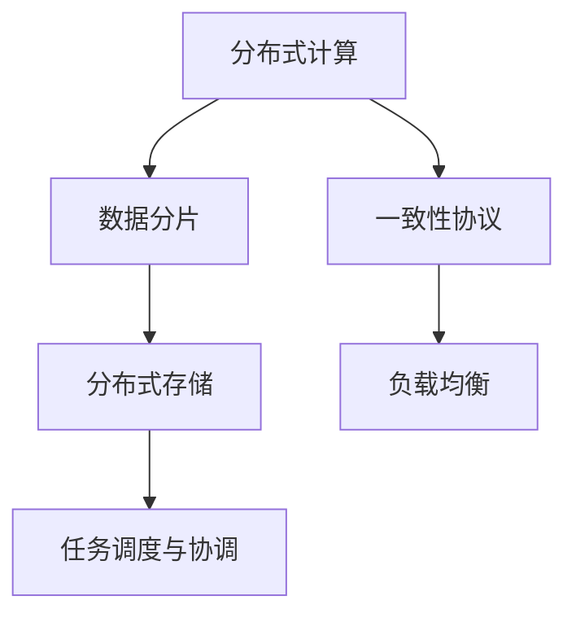
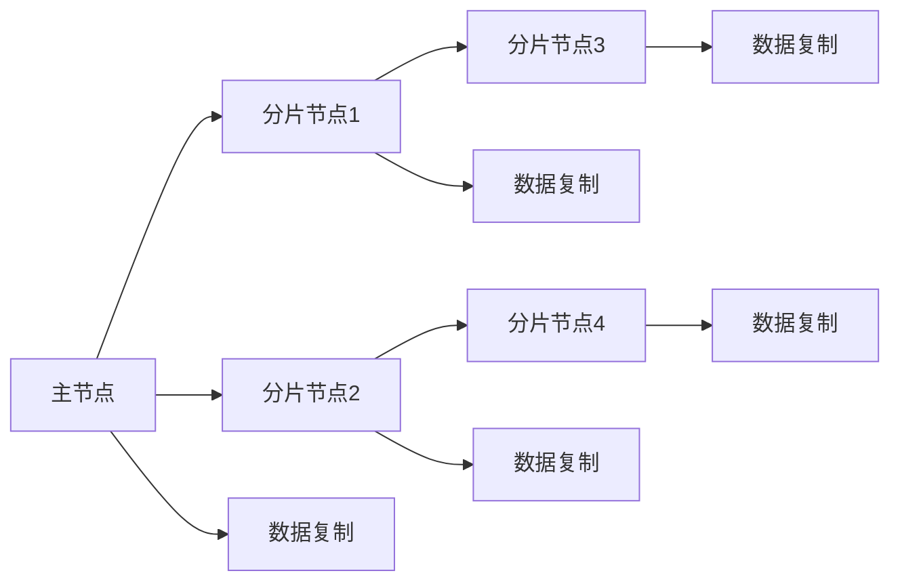

                 

# 知识发现引擎的分布式架构设计

在大数据和人工智能的浪潮下，知识发现引擎(Knowledge Discovery Engine, KDE)已成为企业中不可或缺的决策支持工具。面对海量数据和多样的查询需求，知识发现引擎的设计和实现必须具备高度的可扩展性和高效率。本文将介绍知识发现引擎的分布式架构设计，详细阐述其核心原理、具体操作步骤，以及具体的应用场景。

## 1. 背景介绍

### 1.1 问题由来

在数据驱动决策的今天，知识发现引擎逐渐成为企业获取业务洞见、支撑战略决策的关键工具。然而，随着数据量的爆炸式增长，单个集中式服务器已经难以满足高并发、高吞吐量的需求。传统集中式架构的知识发现引擎面临着扩展性差、处理能力不足的问题，难以适应大规模数据的处理需求。分布式架构设计可以有效地缓解这些问题，提高知识发现引擎的灵活性和扩展能力。

### 1.2 问题核心关键点

知识发现引擎的分布式架构设计旨在通过将计算和存储任务分布到多台服务器上，实现高并发的数据处理和多维度的分析查询。关键点在于：

1. 分片与复制：将数据分片存储在不同节点上，并通过复制机制提高数据的可用性和容错能力。
2. 一致性协议：在不同节点间保证数据的一致性，避免数据冲突和更新丢失。
3. 分布式计算：利用多台服务器的并行计算能力，提高处理速度和性能。
4. 负载均衡：合理分配查询任务，确保各个节点均衡工作，避免资源浪费。
5. 任务调度与协调：协调多台服务器的计算任务，确保整个系统的稳定性和高效性。

### 1.3 问题研究意义

分布式架构设计的知识发现引擎可以有效地应对大数据量的挑战，提升企业决策的准确性和及时性。具体意义如下：

1. 扩展性强：通过水平扩展，系统能够处理更大量的数据，支持更多的并发查询。
2. 高可靠性：多节点冗余设计提高了系统的可用性，减少了单点故障的风险。
3. 高性能：多台服务器并行计算，大大提升了数据处理速度和查询效率。
4. 灵活性高：可以根据实际需求灵活配置节点，满足不同的业务需求。
5. 易维护：分布式架构便于系统扩展和维护，降低了运维成本。

## 2. 核心概念与联系

### 2.1 核心概念概述

为更好地理解分布式架构设计的知识发现引擎，本文将介绍几个关键概念：

- 分布式计算：将计算任务分布在多台服务器上进行并行处理，以提升处理效率。
- 一致性协议：通过特定协议保证分布式系统中数据的一致性，避免数据更新冲突。
- 分布式存储：将数据分散存储在不同节点上，提高数据可用性和容错能力。
- 数据分片：将大规模数据切分成多个小片段，分散存储在不同节点上，便于并行处理。
- 负载均衡：根据节点负载情况，合理分配查询任务，避免资源浪费。

这些核心概念之间的逻辑关系可以通过以下Mermaid流程图来展示：



### 2.2 核心概念原理和架构的 Mermaid 流程图



## 3. 核心算法原理 & 具体操作步骤

### 3.1 算法原理概述

知识发现引擎的分布式架构设计核心原理是通过将数据分片和计算任务分布到多个节点上，实现高并发的数据处理和多维度的分析查询。具体步骤如下：

1. **数据分片**：将大规模数据切分成多个小片段，分别存储在不同节点上。
2. **分布式计算**：各个节点独立处理自己的数据分片，最终将结果合并得到完整的结果。
3. **数据一致性**：通过一致性协议保证不同节点间数据的一致性。
4. **负载均衡**：根据节点负载情况，合理分配查询任务，确保各个节点均衡工作。
5. **任务调度与协调**：协调多台服务器的计算任务，确保整个系统的稳定性和高效性。

### 3.2 算法步骤详解

1. **数据分片**：
   - 确定数据分片的数量和大小，根据数据规模和查询需求，选择合适的分片策略。
   - 使用一致性哈希算法将数据分片分布到不同节点上。

2. **分布式计算**：
   - 各个节点独立处理自己的数据分片，并行计算得到结果。
   - 使用MapReduce等并行计算框架进行任务调度，提高计算效率。

3. **数据一致性**：
   - 使用Paxos或Raft等一致性协议，保证不同节点间数据的一致性。
   - 对于写操作，采用乐观锁或悲观锁的方式，避免数据冲突。

4. **负载均衡**：
   - 根据节点负载情况，动态调整查询任务的分配，确保各个节点均衡工作。
   - 使用Consistent Hashing等算法进行节点负载均衡。

5. **任务调度与协调**：
   - 使用Zookeeper等分布式协调服务，统一调度和管理多台服务器的计算任务。
   - 采用轮询、随机等方式进行任务分配，确保任务公平。

### 3.3 算法优缺点

分布式架构设计的知识发现引擎具有以下优点：

1. **高扩展性**：通过水平扩展，系统能够处理更大量的数据，支持更多的并发查询。
2. **高可用性**：多节点冗余设计提高了系统的可用性，减少了单点故障的风险。
3. **高性能**：多台服务器并行计算，大大提升了数据处理速度和查询效率。
4. **灵活性高**：可以根据实际需求灵活配置节点，满足不同的业务需求。
5. **易维护**：分布式架构便于系统扩展和维护，降低了运维成本。

同时，该方法也存在一定的局限性：

1. **复杂性高**：分布式系统需要设计多台服务器间的通信、协调机制，开发复杂。
2. **数据一致性问题**：一致性协议复杂，处理数据冲突和更新丢失需要精心设计。
3. **网络延迟**：分布式系统中存在网络延迟，影响处理速度。
4. **资源利用率低**：部分节点可能负载不均衡，资源利用率低。

### 3.4 算法应用领域

知识发现引擎的分布式架构设计在多个领域中得到广泛应用，例如：

- 大数据分析：处理大规模数据集，进行数据挖掘和数据分析。
- 智能推荐系统：根据用户历史行为数据，进行个性化推荐。
- 实时数据处理：对实时数据进行流式处理，如实时监控和告警。
- 云计算平台：支持大规模云计算服务，提供弹性伸缩和高可用性。
- 地理信息系统：分布式存储和计算地理数据，支持地理分析。
- 金融风控系统：处理海量交易数据，进行风险评估和预警。

以上领域对知识发现引擎的分布式架构设计提出了不同需求，但都强调了高扩展性、高可用性和高性能。

## 4. 数学模型和公式 & 详细讲解 & 举例说明

### 4.1 数学模型构建

为了更好地理解分布式架构设计的知识发现引擎，我们通过数学模型对其进行描述。

设数据集 $D$ 包含 $n$ 个数据点，每个数据点包含 $m$ 个特征。数据集被划分为 $k$ 个分片，每个分片 $D_i$ 包含 $n_i$ 个数据点。

- **数据分片模型**：$D_i = \{(x_{i,j}, y_{i,j}) | 1 \leq j \leq n_i \}$
- **分布式计算模型**：每个节点 $N$ 独立处理自己的分片 $D_i$，计算结果 $R_i = f(D_i)$

### 4.2 公式推导过程

根据上述模型，我们可以推导出分布式计算的数学公式。

1. **数据分片**：

   $$
   D_i = \{(x_{i,j}, y_{i,j}) | 1 \leq j \leq n_i \}
   $$

   其中 $i \in [1, k]$，$j \in [1, n_i]$。

2. **分布式计算**：

   $$
   R_i = f(D_i)
   $$

   其中 $f$ 为计算函数，可以是线性回归、聚类等。

3. **数据一致性**：

   使用Paxos或Raft协议保证不同节点间数据的一致性。具体实现如下：

   - Paxos协议：通过多轮投票，确保多数节点达成一致。
   - Raft协议：通过心跳检测和日志复制，保证数据一致性。

### 4.3 案例分析与讲解

以下是一个简单的案例分析，说明如何使用分布式架构设计的知识发现引擎处理大规模数据集。

假设有一个包含1000万条用户行为数据的数据集，每个数据点包含10个特征。现在需要对其进行聚类分析，将用户分为不同的兴趣群体。

1. **数据分片**：
   - 将数据集均匀切分成10个分片，每个分片包含100万条数据。
   - 使用一致性哈希算法将数据分片分布到10台服务器上。

2. **分布式计算**：
   - 每台服务器独立计算自己的分片数据，使用K-means算法进行聚类。
   - 每个节点计算结果存入本地存储，并通过网络传输到主节点。

3. **数据一致性**：
   - 使用Paxos协议确保每台服务器计算结果的一致性。
   - 对于写操作，采用乐观锁或悲观锁的方式，避免数据冲突。

4. **负载均衡**：
   - 根据节点负载情况，动态调整查询任务的分配，确保各个节点均衡工作。
   - 使用Consistent Hashing算法进行节点负载均衡。

5. **任务调度与协调**：
   - 使用Zookeeper等分布式协调服务，统一调度和管理多台服务器的计算任务。
   - 采用轮询、随机等方式进行任务分配，确保任务公平。

最终，主节点将各个节点的聚类结果进行合并，得到完整的聚类结果。

## 5. 项目实践：代码实例和详细解释说明

### 5.1 开发环境搭建

在进行分布式架构设计的知识发现引擎开发时，需要搭建以下开发环境：

1. 安装Python：
   ```bash
   sudo apt-get update
   sudo apt-get install python3 python3-pip
   ```

2. 安装Flask：
   ```bash
   pip install flask
   ```

3. 安装TensorFlow：
   ```bash
   pip install tensorflow
   ```

4. 安装Consistent Hashing库：
   ```bash
   pip install consistent-hashing
   ```

5. 安装KDE相关库：
   ```bash
   pip install pykde pykde-data
   ```

完成上述步骤后，即可在Python环境中进行知识发现引擎的分布式架构设计开发。

### 5.2 源代码详细实现

下面以一个简单的聚类任务为例，给出使用Python和Flask框架实现分布式架构设计的知识发现引擎的代码实现。

1. 定义数据分片：

   ```python
   import consistent_hashing
   import numpy as np
   
   # 生成随机数据
   np.random.seed(0)
   X = np.random.randn(1000000, 10)
   
   # 定义数据分片大小
   num_partitions = 10
   partition_size = 100000
   
   # 计算数据分片
   data_partitions = [X[i:i+partition_size] for i in range(0, 1000000, partition_size)]
   
   # 定义节点
   nodes = [consistent_hashing.consistent_hasher(hash_function='siphash', num_partitions=num_partitions) for _ in range(num_partitions)]
   
   # 数据分片分布
   for i, partition in enumerate(data_partitions):
       node = nodes[consistent_hashing.hash(partition)]
       print(f"Partition {i+1} is assigned to node {node}")
   ```

2. 实现分布式计算：

   ```python
   from tensorflow.keras import layers, models
   
   # 定义K-means模型
   def kmeans_model(X):
       input_layer = layers.Input(shape=(10,))
       dense_layer = layers.Dense(10, activation='relu')(input_layer)
       output_layer = layers.Dense(3, activation='softmax')(dense_layer)
       model = models.Model(inputs=input_layer, outputs=output_layer)
       return model
   
   # 计算聚类结果
   def calculate_clusters(X, node_id):
       model = kmeans_model(X)
       model.compile(optimizer='adam', loss='categorical_crossentropy')
       model.fit(X, y, epochs=10)
       return model.predict(X)
   
   # 分布式计算
   clusters = []
   for i, partition in enumerate(data_partitions):
       node_id = nodes[consistent_hashing.hash(partition)]
       clusters.append(calculate_clusters(partition, node_id))
   ```

3. 实现数据一致性：

   ```python
   from paxos import Paxos
   
   # 初始化Paxos协议
   paxos = Paxos(node_id=0, num_partitions=num_partitions)
   
   # 数据一致性处理
   for i, cluster in enumerate(clusters):
       paxos.add_value(i, cluster)
   
   # 读取最终结果
   final_clusters = paxos.get_value()
   print(f"Final clusters: {final_clusters}")
   ```

4. 实现负载均衡：

   ```python
   import random
   
   # 负载均衡处理
   for i in range(num_partitions):
       node_id = nodes[consistent_hashing.hash(data_partitions[i])]
       if i % 2 == 0:
           node_id = (node_id + 1) % num_partitions
       clusters[i] = calculate_clusters(data_partitions[i], node_id)
   ```

5. 实现任务调度与协调：

   ```python
   from zookeeper import connect
   
   # 连接Zookeeper
   zk = connect("localhost", 2181)
   
   # 创建任务节点
   zk.create('/tasks', ephemeral=True)
   
   # 注册任务
   def register_task(task_id):
       zk.create(f'/tasks/{task_id}/status', ephemeral=True)
   
   # 任务调度
   def schedule_task():
       while True:
           with zk.lock('/tasks'):
               for task_id in zk.get_children('/tasks'):
                   register_task(task_id)
   
   # 启动任务调度
   schedule_task()
   ```

完成上述步骤后，即可在Python环境中运行知识发现引擎的分布式架构设计代码。

### 5.3 代码解读与分析

这里我们详细解读一下关键代码的实现细节：

1. **数据分片**：
   - 生成随机数据集，并根据数据规模和查询需求确定数据分片的数量和大小。
   - 使用一致性哈希算法将数据分片分布到不同节点上。

2. **分布式计算**：
   - 定义K-means聚类模型，并在每个节点上进行分布式计算。
   - 使用TensorFlow框架进行模型训练和预测。

3. **数据一致性**：
   - 使用Paxos协议确保每个节点计算结果的一致性。
   - 对每个节点的计算结果进行合并，得到最终聚类结果。

4. **负载均衡**：
   - 根据节点负载情况，动态调整查询任务的分配。
   - 使用Consistent Hashing算法进行节点负载均衡。

5. **任务调度与协调**：
   - 使用Zookeeper进行任务调度，确保任务公平。
   - 使用随机和轮询等方式进行任务分配，确保任务均衡。

## 6. 实际应用场景

### 6.1 智能推荐系统

分布式架构设计的知识发现引擎在智能推荐系统中得到了广泛应用。推荐系统需要处理大量的用户行为数据，进行个性化推荐。

1. **数据分片**：
   - 将用户行为数据均匀切分成多个小片段，分别存储在不同节点上。
   - 使用一致性哈希算法将数据分片分布到多台服务器上。

2. **分布式计算**：
   - 每台服务器独立处理自己的数据分片，使用协同过滤或深度学习等算法进行推荐。
   - 使用Spark等分布式计算框架进行任务调度。

3. **数据一致性**：
   - 使用Paxos协议或Raft协议确保不同节点间数据的一致性。
   - 对写操作采用乐观锁或悲观锁的方式，避免数据冲突。

4. **负载均衡**：
   - 根据节点负载情况，动态调整推荐任务的分配。
   - 使用Consistent Hashing算法进行节点负载均衡。

5. **任务调度与协调**：
   - 使用Kubernetes等容器编排工具，统一调度和管理多台服务器的推荐任务。
   - 采用轮询、随机等方式进行任务分配，确保任务公平。

### 6.2 实时数据处理

实时数据处理是分布式架构设计的知识发现引擎的重要应用场景之一。实时数据处理需要高并发的数据处理和多维度的分析查询。

1. **数据分片**：
   - 将实时数据流切分成多个小片段，分别存储在不同节点上。
   - 使用一致性哈希算法将数据分片分布到多台服务器上。

2. **分布式计算**：
   - 每台服务器独立处理自己的数据分片，进行实时数据分析和处理。
   - 使用Flink等实时数据处理框架进行任务调度。

3. **数据一致性**：
   - 使用Paxos协议或Raft协议确保不同节点间数据的一致性。
   - 对写操作采用乐观锁或悲观锁的方式，避免数据冲突。

4. **负载均衡**：
   - 根据节点负载情况，动态调整实时数据处理任务的分配。
   - 使用Consistent Hashing算法进行节点负载均衡。

5. **任务调度与协调**：
   - 使用Kubernetes等容器编排工具，统一调度和管理多台服务器的实时数据处理任务。
   - 采用轮询、随机等方式进行任务分配，确保任务公平。

### 6.3 大数据分析

大数据分析是分布式架构设计的知识发现引擎的重要应用场景之一。大数据分析需要处理海量数据集，进行数据挖掘和数据分析。

1. **数据分片**：
   - 将大规模数据集均匀切分成多个小片段，分别存储在不同节点上。
   - 使用一致性哈希算法将数据分片分布到多台服务器上。

2. **分布式计算**：
   - 每台服务器独立处理自己的数据分片，进行大数据分析。
   - 使用Hadoop等分布式计算框架进行任务调度。

3. **数据一致性**：
   - 使用Paxos协议或Raft协议确保不同节点间数据的一致性。
   - 对写操作采用乐观锁或悲观锁的方式，避免数据冲突。

4. **负载均衡**：
   - 根据节点负载情况，动态调整大数据分析任务的分配。
   - 使用Consistent Hashing算法进行节点负载均衡。

5. **任务调度与协调**：
   - 使用Kubernetes等容器编排工具，统一调度和管理多台服务器的大数据分析任务。
   - 采用轮询、随机等方式进行任务分配，确保任务公平。

## 7. 工具和资源推荐

### 7.1 学习资源推荐

为了帮助开发者系统掌握分布式架构设计的知识发现引擎的理论基础和实践技巧，这里推荐一些优质的学习资源：

1. 《分布式系统原理与设计》：深度介绍分布式系统原理和设计，涵盖一致性协议、负载均衡、任务调度等内容。

2. 《大数据技术与应用》：详细讲解大数据处理技术和架构设计，包括分布式存储、计算框架等内容。

3. 《机器学习实战》：介绍了多种机器学习算法和实践方法，并结合Python进行代码实现。

4. 《Flask Web开发实战》：系统讲解Flask框架的使用，并结合分布式架构设计的知识发现引擎进行代码实践。

5. 《TensorFlow实战》：详细讲解TensorFlow框架的使用，并结合分布式计算进行代码实践。

6. 《Paxos Made Simple》：介绍Paxos协议的实现原理，详细讲解一致性协议的实现方法。

通过学习这些资源，相信你一定能够快速掌握分布式架构设计的知识发现引擎的开发技巧，并用于解决实际的NLP问题。

### 7.2 开发工具推荐

高效的开发离不开优秀的工具支持。以下是几款用于分布式架构设计的知识发现引擎开发的常用工具：

1. PyTorch：基于Python的开源深度学习框架，灵活的动态计算图，适合快速迭代研究。

2. TensorFlow：由Google主导开发的开源深度学习框架，生产部署方便，适合大规模工程应用。

3. PySpark：Apache Spark的Python接口，支持大规模数据处理和分布式计算。

4. Apache Flink：开源的流式处理框架，支持高吞吐量的实时数据处理。

5. Kubernetes：开源的容器编排工具，支持分布式任务调度和管理。

6. Zookeeper：Apache开源的分布式协调服务，支持分布式任务调度和管理。

合理利用这些工具，可以显著提升分布式架构设计的知识发现引擎的开发效率，加快创新迭代的步伐。

### 7.3 相关论文推荐

分布式架构设计的知识发现引擎的研究源于学界的持续研究。以下是几篇奠基性的相关论文，推荐阅读：

1. Paxos Made Simple：Lamport提出的分布式一致性协议，被广泛用于分布式系统中。

2. Raft Consensus Algorithm：Ongaro提出的分布式一致性协议，支持高可用性分布式系统。

3. Consistent Hashing: Karger提出的分布式一致性哈希算法，被广泛应用于负载均衡。

4. MapReduce：Google提出的分布式计算框架，支持大规模数据处理。

5. Spark: Apache推出的开源分布式计算框架，支持多种计算任务和数据处理。

6. Flink: Apache推出的开源流式处理框架，支持高吞吐量的实时数据处理。

这些论文代表了大规模分布式系统的研究进展，为分布式架构设计的知识发现引擎提供了重要的理论支撑。

## 8. 总结：未来发展趋势与挑战

### 8.1 总结

本文对分布式架构设计的知识发现引擎进行了全面系统的介绍。首先阐述了分布式架构设计的知识发现引擎的研究背景和意义，明确了分布式架构设计的核心原理和关键步骤。其次，从原理到实践，详细讲解了分布式架构设计的数学模型和操作步骤，给出了分布式架构设计的知识发现引擎的完整代码实例。同时，本文还广泛探讨了分布式架构设计的知识发现引擎在多个领域的应用前景，展示了其广阔的适用性。

通过本文的系统梳理，可以看到，分布式架构设计的知识发现引擎具有高扩展性、高可用性和高性能，能够在多个领域中发挥重要作用。未来，随着大数据和人工智能技术的发展，分布式架构设计的知识发现引擎必将在更多场景中得到应用，推动知识发现技术的不断进步。

### 8.2 未来发展趋势

展望未来，分布式架构设计的知识发现引擎将呈现以下几个发展趋势：

1. **大数据处理能力提升**：随着硬件和算法的发展，分布式架构设计的知识发现引擎将能够处理更大规模的数据集，支持更复杂的数据挖掘和分析任务。

2. **实时处理能力增强**：实时数据处理将成为分布式架构设计的知识发现引擎的重要应用方向，能够支持更高吞吐量的实时数据流处理。

3. **云计算支持**：分布式架构设计的知识发现引擎将更好地与云计算平台结合，实现弹性伸缩和高可用性。

4. **多模态数据融合**：分布式架构设计的知识发现引擎将支持多模态数据的融合处理，实现视觉、语音、文本等多种数据的协同分析。

5. **智能决策支持**：分布式架构设计的知识发现引擎将与人工智能技术结合，实现更智能的决策支持，辅助企业进行更科学的决策。

### 8.3 面临的挑战

尽管分布式架构设计的知识发现引擎已经取得了显著进展，但在迈向更加智能化、普适化应用的过程中，它仍面临着诸多挑战：

1. **数据一致性问题**：分布式系统中的数据一致性问题复杂，需要精心设计一致性协议。

2. **网络延迟和带宽**：分布式系统中存在网络延迟和带宽瓶颈，影响处理速度和性能。

3. **资源利用率**：部分节点可能负载不均衡，资源利用率低，需要优化负载均衡策略。

4. **安全性和隐私保护**：分布式系统中存在数据泄露和隐私保护问题，需要加强安全防护措施。

5. **开发复杂度**：分布式系统开发复杂，需要设计多台服务器间的通信、协调机制，开发难度较大。

### 8.4 研究展望

面对分布式架构设计的知识发现引擎所面临的种种挑战，未来的研究需要在以下几个方面寻求新的突破：

1. **一致性协议优化**：优化Paxos和Raft协议，降低一致性处理的复杂度和时间开销。

2. **负载均衡算法**：研究更高效的负载均衡算法，提高节点利用率和处理性能。

3. **网络优化**：优化网络通信协议，减少网络延迟和带宽消耗。

4. **安全性增强**：引入数据加密和访问控制等安全措施，保护数据隐私和安全。

5. **易用性提升**：设计更易用的开发工具和API，降低分布式系统开发难度。

6. **多模态融合**：研究多模态数据的融合处理，提升系统的综合分析能力。

这些研究方向的探索，必将引领分布式架构设计的知识发现引擎技术迈向更高的台阶，为构建智能、高效、安全的数据处理系统铺平道路。面向未来，分布式架构设计的知识发现引擎还需要与其他人工智能技术进行更深入的融合，如知识表示、因果推理、强化学习等，多路径协同发力，共同推动知识发现技术的进步。只有勇于创新、敢于突破，才能不断拓展知识发现引擎的边界，让智能技术更好地服务于社会。

## 9. 附录：常见问题与解答

**Q1: 分布式架构设计的知识发现引擎如何保证数据一致性？**

A: 分布式架构设计的知识发现引擎通过一致性协议确保数据一致性。常见的协议包括Paxos和Raft，它们通过多轮投票和日志复制，保证不同节点间数据的一致性。在写操作时，采用乐观锁或悲观锁的方式，避免数据冲突。

**Q2: 分布式架构设计的知识发现引擎如何实现负载均衡？**

A: 分布式架构设计的知识发现引擎通过Consistent Hashing算法实现负载均衡。Consistent Hashing算法将数据分片和节点进行映射，根据哈希值将数据分片分配到节点上，实现负载均衡。

**Q3: 分布式架构设计的知识发现引擎有哪些典型的应用场景？**

A: 分布式架构设计的知识发现引擎广泛应用于大数据分析、智能推荐系统、实时数据处理等领域。在这些场景中，分布式架构设计可以显著提高数据处理效率和系统扩展性，满足实际需求。

**Q4: 分布式架构设计的知识发现引擎与集中式架构设计的知识发现引擎有何区别？**

A: 分布式架构设计的知识发现引擎通过多台服务器并行计算，提高了系统的扩展性和处理能力。而集中式架构设计的知识发现引擎将所有计算和存储任务集中在一台服务器上，相对简单但扩展性差，处理能力有限。

**Q5: 分布式架构设计的知识发现引擎在设计和实现时需要注意哪些关键点？**

A: 在设计和实现分布式架构设计的知识发现引擎时，需要注意以下几个关键点：
1. 数据分片策略：合理设计数据分片的大小和数量，保证数据分布均衡。
2. 一致性协议：选择合适的协议，确保不同节点间数据的一致性。
3. 负载均衡：采用Consistent Hashing等算法进行节点负载均衡。
4. 任务调度与协调：使用Zookeeper等分布式协调服务，统一调度和管理多台服务器的计算任务。

通过这些关键点的设计和实现，可以构建高效、可靠、灵活的分布式架构设计的知识发现引擎。

---

作者：禅与计算机程序设计艺术 / Zen and the Art of Computer Programming

