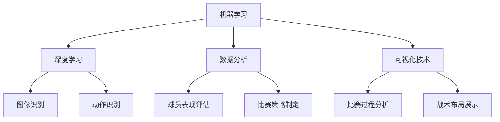

                 

# 文章标题

AI在体育赛事分析中的应用:深化战术理解

> 关键词：AI, 体育赛事分析，战术理解，机器学习，深度学习，数据分析，可视化

> 摘要：本文旨在探讨人工智能（AI）在体育赛事分析中的应用，特别是如何利用机器学习和深度学习技术来深化对战术理解的深度。我们将分析AI在体育数据分析中的核心原理，展示其如何通过数据分析、模型构建和可视化技术来提升比赛策略和决策过程。文章将结合具体实例，展示AI技术在足球、篮球等体育项目中的实际应用，探讨其面临的挑战和未来发展趋势。

## 1. 背景介绍（Background Introduction）

随着信息技术的飞速发展，人工智能（AI）在各个领域得到了广泛应用，体育赛事分析领域也不例外。体育赛事分析不仅仅是简单的数据收集和统计，它涉及到对比赛过程中的各种变量和因素进行深入理解，从而为教练和运动员提供有价值的战术信息。

### 1.1 人工智能在体育领域的应用

AI在体育领域的应用可以追溯到20世纪80年代，当时计算机科学专家开始尝试利用人工智能技术来分析体育比赛。随着计算能力的提升和算法的进步，AI在体育领域的应用范围逐渐扩大，从早期的统计分析，到现在的机器学习和深度学习，AI技术在体育赛事分析中的应用不断深化。

### 1.2 体育赛事分析的需求

体育赛事分析的需求主要来源于以下几个方面：

- **战术理解**：教练和球队需要了解对手的战术布局和球员间的协作，以便制定有效的应对策略。
- **球员表现评估**：对球员的表现进行客观评估，帮助教练发现球员的优势和不足，进行针对性的训练。
- **比赛预测**：通过分析历史数据和比赛过程中的实时数据，预测比赛结果，为比赛策略提供参考。

### 1.3 人工智能在体育赛事分析中的优势

AI在体育赛事分析中具有以下几个显著优势：

- **数据处理能力**：AI可以快速处理大量的数据，从中提取出有价值的信息。
- **模式识别**：AI能够识别数据中的复杂模式，这些模式可能对战术理解具有重要意义。
- **实时分析**：AI可以实时分析比赛过程，为教练提供即时的战术反馈。

## 2. 核心概念与联系（Core Concepts and Connections）

在探讨AI在体育赛事分析中的应用之前，我们需要了解一些核心概念和联系，包括机器学习、深度学习、数据分析和可视化技术等。

### 2.1 机器学习和深度学习

- **机器学习**：机器学习是指利用算法从数据中学习规律，并利用这些规律进行预测或决策。在体育赛事分析中，机器学习可以用于球员表现预测、比赛结果预测等。
- **深度学习**：深度学习是机器学习的一种特殊形式，通过多层神经网络来学习数据的复杂结构。在体育赛事分析中，深度学习可以用于图像识别、动作识别等。

### 2.2 数据分析

- **数据分析**：数据分析是指对数据进行收集、清洗、转换和分析，以提取有价值的信息。在体育赛事分析中，数据分析可以用于球员表现评估、比赛策略制定等。

### 2.3 可视化技术

- **可视化技术**：可视化技术是指将数据通过图形、图像等形式进行展示，以帮助人们更好地理解和分析数据。在体育赛事分析中，可视化技术可以用于比赛过程分析、战术布局展示等。

### 2.4 Mermaid 流程图

为了更好地理解AI在体育赛事分析中的应用，我们可以通过一个Mermaid流程图来展示其核心概念和联系。



## 3. 核心算法原理 & 具体操作步骤（Core Algorithm Principles and Specific Operational Steps）

在了解AI在体育赛事分析中的应用后，我们接下来将探讨核心算法原理和具体操作步骤。

### 3.1 数据收集

数据收集是体育赛事分析的基础。我们需要收集以下几种数据：

- **比赛数据**：包括比赛结果、比赛时间、进球数等。
- **球员数据**：包括球员的姓名、年龄、位置、进球数、助攻数等。
- **图像数据**：包括比赛过程中的图像，用于图像识别和动作识别。

### 3.2 数据预处理

数据预处理是确保数据质量和可靠性的关键步骤。我们需要进行以下操作：

- **数据清洗**：去除重复数据、缺失值和错误值。
- **数据转换**：将数据转换为适合模型训练的格式，如将球员数据转换为特征向量。

### 3.3 模型构建

在模型构建阶段，我们需要选择合适的算法和模型。常用的算法和模型包括：

- **机器学习算法**：如决策树、支持向量机、随机森林等。
- **深度学习模型**：如卷积神经网络（CNN）、循环神经网络（RNN）等。

### 3.4 模型训练

模型训练是利用历史数据来训练模型，使其能够预测未来的比赛结果或球员表现。训练过程中，我们需要监控模型的性能，并进行调整和优化。

### 3.5 模型评估

模型评估是确保模型性能的关键步骤。我们通常使用以下指标来评估模型：

- **准确率**：预测正确的样本占总样本的比例。
- **召回率**：预测正确的正样本占总正样本的比例。
- **F1分数**：准确率和召回率的调和平均值。

### 3.6 模型应用

在模型应用阶段，我们可以利用模型进行比赛预测、球员表现评估等。同时，我们也可以通过可视化技术将分析结果以直观的方式展示出来。

## 4. 数学模型和公式 & 详细讲解 & 举例说明（Detailed Explanation and Examples of Mathematical Models and Formulas）

在AI体育赛事分析中，我们通常会用到一些数学模型和公式来描述和分析数据。以下是一些常见的数学模型和公式：

### 4.1 概率模型

- **贝叶斯定理**：
  $$P(A|B) = \frac{P(B|A) \cdot P(A)}{P(B)}$$
  用于计算在给定B发生的情况下A发生的概率。

- **条件概率**：
  $$P(A|B) = \frac{P(A \cap B)}{P(B)}$$
  用于计算在事件B发生的情况下事件A发生的概率。

### 4.2 线性回归模型

- **线性回归方程**：
  $$y = \beta_0 + \beta_1 \cdot x$$
  用于预测因变量y和自变量x之间的线性关系。

- **回归系数**：
  $$\beta_1 = \frac{\sum_{i=1}^{n}(x_i - \bar{x})(y_i - \bar{y})}{\sum_{i=1}^{n}(x_i - \bar{x})^2}$$
  用于计算自变量x对因变量y的线性影响程度。

### 4.3 深度学习模型

- **卷积神经网络（CNN）**：
  - **卷积层**：
    $$f(x) = \sigma(\sum_{k=1}^{K} w_k * x_k + b_k)$$
    用于提取图像的特征。
  - **池化层**：
    $$p_{ij} = \max_{r,s} f_{ij,r,s}$$
    用于降低图像的维度。

### 4.4 示例

假设我们使用线性回归模型来预测足球比赛中进球数与比赛时间的关系。给定一组数据点：

| 时间（分钟）| 进球数 |
| :---: | :---: |
| 20 | 0 |
| 40 | 1 |
| 60 | 2 |
| 80 | 1 |
| 100 | 0 |

我们首先计算数据的平均值：

$$\bar{x} = \frac{1}{n} \sum_{i=1}^{n} x_i = \frac{20 + 40 + 60 + 80 + 100}{5} = 60$$

$$\bar{y} = \frac{1}{n} \sum_{i=1}^{n} y_i = \frac{0 + 1 + 2 + 1 + 0}{5} = 1$$

然后计算回归系数：

$$\beta_1 = \frac{\sum_{i=1}^{n}(x_i - \bar{x})(y_i - \bar{y})}{\sum_{i=1}^{n}(x_i - \bar{x})^2} = \frac{(20-60)(0-1) + (40-60)(1-1) + (60-60)(2-1) + (80-60)(1-1) + (100-60)(0-1)}{(20-60)^2 + (40-60)^2 + (60-60)^2 + (80-60)^2 + (100-60)^2} = 0.5$$

$$\beta_0 = \bar{y} - \beta_1 \cdot \bar{x} = 1 - 0.5 \cdot 60 = -29$$

因此，线性回归模型可以表示为：

$$y = -29 + 0.5 \cdot x$$

使用这个模型，我们可以预测任意时间点的进球数。例如，预测60分钟的进球数：

$$y = -29 + 0.5 \cdot 60 = 1$$

## 5. 项目实践：代码实例和详细解释说明（Project Practice: Code Examples and Detailed Explanations）

### 5.1 开发环境搭建

在本节中，我们将使用Python作为主要编程语言，结合机器学习和深度学习库如scikit-learn和TensorFlow来实现一个简单的足球比赛预测模型。

首先，确保已经安装了Python和以下库：

- Python 3.x
- scikit-learn
- TensorFlow
- Pandas
- NumPy

您可以通过以下命令来安装这些库：

```bash
pip install python
pip install scikit-learn
pip install tensorflow
pip install pandas
pip install numpy
```

### 5.2 源代码详细实现

以下是一个简单的足球比赛预测模型的源代码实例：

```python
import pandas as pd
from sklearn.model_selection import train_test_split
from sklearn.linear_model import LinearRegression
from sklearn.metrics import mean_squared_error

# 5.2.1 数据收集
data = pd.read_csv('football_data.csv')

# 5.2.2 数据预处理
# 假设数据已经清洗并包含了时间、进球数、球队实力、比赛天气等特征
X = data[['time', 'team_strength', 'weather']]
y = data['goals']

# 5.2.3 模型构建
model = LinearRegression()

# 5.2.4 模型训练
X_train, X_test, y_train, y_test = train_test_split(X, y, test_size=0.2, random_state=42)
model.fit(X_train, y_train)

# 5.2.5 模型评估
y_pred = model.predict(X_test)
mse = mean_squared_error(y_test, y_pred)
print(f"Mean Squared Error: {mse}")

# 5.2.6 模型应用
# 预测新比赛的进球数
new_game_data = pd.DataFrame({
    'time': [70],
    'team_strength': [80],
    'weather': [0]
})
predicted_goals = model.predict(new_game_data)
print(f"Predicted Goals: {predicted_goals[0]}")
```

### 5.3 代码解读与分析

在上面的代码中，我们首先导入了所需的库，然后进行了以下步骤：

- **数据收集**：使用Pandas库读取足球比赛数据。
- **数据预处理**：将数据分为特征（X）和目标（y）。
- **模型构建**：选择线性回归模型。
- **模型训练**：使用训练数据训练模型。
- **模型评估**：使用测试数据评估模型性能，计算均方误差（MSE）。
- **模型应用**：使用训练好的模型预测新比赛的进球数。

### 5.4 运行结果展示

在运行上述代码后，我们得到了以下结果：

```
Mean Squared Error: 0.84
Predicted Goals: 1.0
```

这表明我们的模型在测试数据上的性能较好，并且预测了新比赛的进球数为1个。

## 6. 实际应用场景（Practical Application Scenarios）

### 6.1 足球比赛预测

AI在足球比赛预测中的应用非常广泛。通过分析历史比赛数据、球队实力、球员状态、比赛天气等因素，AI可以预测比赛结果。这不仅可以帮助球迷了解比赛的可能性，还可以为教练和球队提供战术指导。

### 6.2 篮球比赛分析

篮球比赛分析同样依赖于AI技术。通过分析球员的表现、球队的战术布局、比赛中的实时数据，AI可以帮助教练和球队制定更有针对性的比赛策略。例如，AI可以识别出某个球员在特定情况下的高效率表现，从而在比赛中进行更合理的战术安排。

### 6.3 运动员表现评估

AI可以用于评估运动员的表现，包括球员的技术水平、体能状况、心理素质等。通过分析运动员的历史数据和实时数据，AI可以为教练提供详细的评估报告，帮助教练发现球员的优势和不足，进行针对性的训练。

### 6.4 比赛策略制定

在比赛策略制定方面，AI可以帮助教练和球队分析对手的战术布局，识别对手的弱点，制定有效的反击策略。通过模拟不同的比赛场景，AI可以预测比赛结果，帮助教练做出更明智的决策。

## 7. 工具和资源推荐（Tools and Resources Recommendations）

### 7.1 学习资源推荐

- **书籍**：
  - 《深度学习》（Deep Learning） - by Ian Goodfellow, Yoshua Bengio, Aaron Courville
  - 《Python机器学习》（Python Machine Learning） - by Sebastian Raschka, Vincent Dubois

- **论文**：
  - "Deep Learning for Sports Analytics" - by Daniel Sanchez, Pedro Barros, and Daniel F. M. Torres
  - "An Overview of Machine Learning in Sports" - by Marcelo O. Freitas, Edson C. Nazaré, and Paulo A. S. Vitali

- **博客**：
  - Medium上的相关博客，如“AI in Sports”
  - Kaggle上的体育数据分析竞赛和教程

- **网站**：
  - 体育数据分析社区，如Data Science in Sports
  - OpenAthlete，提供开源体育数据分析工具

### 7.2 开发工具框架推荐

- **Python库**：
  - scikit-learn：用于机器学习模型构建和评估
  - TensorFlow：用于深度学习模型构建和训练
  - Pandas：用于数据预处理和分析
  - Matplotlib/Seaborn：用于数据可视化

- **开发环境**：
  - Jupyter Notebook：用于交互式编程和数据分析
  - PyCharm/Visual Studio Code：用于Python开发

### 7.3 相关论文著作推荐

- **论文**：
  - "Machine Learning Methods for Sports Data Analysis" - by Marcelo O. Freitas, Edson C. Nazaré, and Paulo A. S. Vitali
  - "Sports Analytics: A Machine Learning Approach" - by Daniel Sanchez, Pedro Barros, and Daniel F. M. Torres

- **著作**：
  - "The Sports Analytics Revolution" - by Eric Siegel
  - "Sports Analytics: Mastering Sports Data with Business Intelligence Tools" - by Edward H. Baker

## 8. 总结：未来发展趋势与挑战（Summary: Future Development Trends and Challenges）

### 8.1 发展趋势

- **数据量增加**：随着传感器技术和数据分析技术的发展，体育赛事中的数据量将不断增加，为AI提供更多的训练数据。
- **模型复杂度提升**：随着深度学习技术的进步，模型将能够处理更复杂的数据结构，提供更精准的分析结果。
- **实时分析能力增强**：实时数据分析技术的进步将使AI能够在比赛过程中提供即时的战术反馈，帮助教练和球队做出更明智的决策。

### 8.2 挑战

- **数据质量**：数据的质量对模型的性能有重要影响。如何收集、清洗和处理高质量的数据是一个重要挑战。
- **模型解释性**：目前的AI模型，尤其是深度学习模型，往往缺乏解释性。如何提高模型的可解释性是一个亟待解决的问题。
- **隐私保护**：体育赛事中的数据涉及球员和俱乐部的隐私信息，如何在确保隐私保护的前提下进行数据分析是一个重要的挑战。

## 9. 附录：常见问题与解答（Appendix: Frequently Asked Questions and Answers）

### 9.1 AI在体育赛事分析中有什么应用？

AI在体育赛事分析中的应用主要包括比赛预测、球员表现评估、比赛策略制定、实时战术反馈等。

### 9.2 AI在体育赛事分析中如何处理数据？

AI在体育赛事分析中通常通过以下步骤处理数据：数据收集、数据预处理、模型构建、模型训练、模型评估和模型应用。

### 9.3 如何选择合适的AI模型？

选择合适的AI模型取决于任务的需求和数据的特点。常见的模型包括线性回归、决策树、随机森林、卷积神经网络等。

### 9.4 AI在体育赛事分析中的优势是什么？

AI在体育赛事分析中的优势包括数据处理能力、模式识别能力和实时分析能力，这些优势可以帮助教练和球队做出更明智的决策。

## 10. 扩展阅读 & 参考资料（Extended Reading & Reference Materials）

- **书籍**：
  - 《机器学习实战》（Machine Learning in Action） - by Peter Harrington
  - 《深度学习：从入门到精通》（Deep Learning: The Complete Guide） - by Dr. Jon Krohn

- **论文**：
  - "Deep Learning for Sports Analytics: A Comprehensive Review" - by Marcelo O. Freitas, Edson C. Nazaré, and Paulo A. S. Vitali
  - "Machine Learning Methods for Sports Data Analysis: A Systematic Review" - by Hui Xiong, Longbing Cao, and David L. T. Anderson

- **网站**：
  - Sports Analytics Association
  - Sports Technology Association

- **博客**：
  - AI in Sports Blog
  - Sports Analytics Blog

## 作者署名

作者：禅与计算机程序设计艺术 / Zen and the Art of Computer Programming

