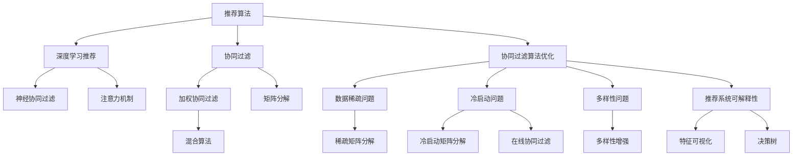

                 

# 知识发现引擎的推荐算法优化

> 关键词：知识发现引擎,推荐算法,算法优化,深度学习,协同过滤,协同过滤算法,协同过滤优化

## 1. 背景介绍

### 1.1 问题由来
在信息化时代，海量数据的快速增长带来了知识发现和信息检索的新挑战。通过高效的知识发现引擎，可以从大数据中提取出有价值的信息，为用户推荐个性化的知识内容，提升信息获取效率和质量。推荐算法作为知识发现引擎的核心组件，其性能直接影响着引擎的效果。

近年来，推荐算法的发展日新月异，从早期的协同过滤(Collaborative Filtering, CF)，到基于深度学习的方法，再到融合用户行为和物品属性的混合算法，不断推动着推荐系统性能的提升。然而，现有的推荐算法仍存在诸多问题，如冷启动、数据稀疏、可解释性不足等，亟需进一步优化。

### 1.2 问题核心关键点
推荐算法优化是知识发现引擎的核心任务之一。优化的目标是通过算法和模型改进，提升推荐准确率、泛化能力、鲁棒性和可解释性，同时降低计算复杂度和资源消耗。关键点包括：
1. 提升推荐准确率和泛化能力。
2. 增强模型的鲁棒性和泛化能力。
3. 提高推荐算法可解释性。
4. 降低计算复杂度和资源消耗。

### 1.3 问题研究意义
推荐算法的优化不仅能够提升知识发现引擎的性能，还能够加速信息检索、个性化推荐、市场营销等多个领域的创新应用。通过优化算法，能够使得推荐系统更加精准、透明、可靠，更好地服务于用户需求，推动信息技术的进步。

## 2. 核心概念与联系

### 2.1 核心概念概述

为更好地理解推荐算法优化，本节将介绍几个密切相关的核心概念：

- 推荐算法：从用户行为、物品属性和外部因素中提取用户偏好，为用户推荐个性化的内容。常见的推荐算法包括协同过滤、基于深度学习的方法等。
- 协同过滤算法：基于用户行为或物品相似性，预测用户对未交互物品的兴趣。分为基于用户的协同过滤(User-Based Collaborative Filtering, UBCF)和基于物品的协同过滤(Item-Based Collaborative Filtering, IBCF)两种类型。
- 深度学习推荐算法：利用深度神经网络模型，从用户行为和物品属性中提取高层次特征，实现更精准的推荐。常见的深度学习模型包括神经协同过滤(Neural Collaborative Filtering, NCF)、注意力机制(Attention Mechanism)等。
- 协同过滤算法优化：通过改进协同过滤算法，解决数据稀疏、冷启动、多样性等问题，提升推荐性能。优化方法包括加权协同过滤、矩阵分解、混合算法等。
- 推荐系统可解释性：增强推荐系统的透明度，使其推荐结果易于理解和解释，提升用户信任度。常用的可解释性技术包括特征可视化、决策树等。
- 知识发现引擎：利用推荐算法、数据挖掘等技术，从海量数据中发现知识、挖掘信息，为用户提供个性化的知识服务。

这些核心概念之间的逻辑关系可以通过以下Mermaid流程图来展示：



这个流程图展示了推荐算法的核心概念及其之间的关系：

1. 推荐算法通过协同过滤、深度学习等技术，从用户行为和物品属性中提取特征，为用户推荐个性化内容。
2. 协同过滤算法分为基于用户和物品两种类型，是推荐算法的核心。
3. 深度学习推荐算法通过神经协同过滤和注意力机制等模型，提升了推荐精度。
4. 协同过滤算法优化通过改进算法，解决了数据稀疏、冷启动、多样性等问题。
5. 推荐系统可解释性技术提升了推荐系统的透明度，增强了用户信任。
6. 知识发现引擎综合应用推荐算法和数据挖掘技术，从大数据中发现知识。

这些概念共同构成了推荐算法的学习框架，使其能够更好地服务于信息推荐和知识发现。通过理解这些核心概念，我们可以更好地把握推荐算法的工作原理和优化方向。

## 3. 核心算法原理 & 具体操作步骤
### 3.1 算法原理概述

推荐算法的优化目标是提升推荐精度和泛化能力，同时增强模型的鲁棒性和可解释性，降低计算复杂度。优化的原理主要包括：

1. 数据预处理和特征工程：通过清洗、归一化等操作，提高数据质量和特征表示能力。
2. 模型选择和算法优化：选择适合的推荐算法和模型，并通过优化参数、改进算法等手段提升性能。
3. 特征表示和深度学习：利用深度神经网络模型，从用户行为和物品属性中提取高层次特征，实现更精准的推荐。
4. 协同过滤优化：改进协同过滤算法，解决数据稀疏、冷启动等问题，提升推荐性能。
5. 混合算法和跨模态融合：结合多种推荐算法和模态数据，实现更加全面和准确的推荐。

### 3.2 算法步骤详解

基于推荐算法的优化，本节将详细介绍推荐系统优化的关键步骤：

**Step 1: 数据预处理和特征工程**
- 收集用户行为数据、物品属性数据和外部特征数据，进行数据清洗和预处理。
- 对用户行为数据进行归一化和标准化处理，避免数值偏差。
- 对物品属性数据进行特征工程，提取有用特征，如TF-IDF、词嵌入等。
- 引入时间、地点等外部特征，丰富数据表示。

**Step 2: 模型选择和算法优化**
- 选择合适的推荐算法，如协同过滤、深度学习等。
- 对协同过滤算法进行优化，如加权协同过滤、矩阵分解等。
- 利用深度学习模型，如神经协同过滤、注意力机制等，提升推荐精度。
- 设计混合算法，结合多种推荐技术，实现更全面和精准的推荐。

**Step 3: 特征表示和深度学习**
- 构建深度神经网络模型，如多层感知机(Multilayer Perceptron, MLP)、卷积神经网络(Convolutional Neural Network, CNN)、循环神经网络(Recurrent Neural Network, RNN)等。
- 使用不同网络结构，提取用户行为和物品属性的高层次特征。
- 引入注意力机制，提高特征的表征能力和推荐精度。

**Step 4: 协同过滤优化**
- 解决数据稀疏问题，采用矩阵分解、特征低秩等方法，提高协同过滤的精度。
- 解决冷启动问题，利用用户历史行为和物品属性信息，缓解新用户和物品的推荐困难。
- 解决多样性问题，引入多样性约束，防止推荐结果过于集中。

**Step 5: 混合算法和跨模态融合**
- 结合多种推荐算法，如协同过滤和深度学习，设计混合推荐算法。
- 引入多模态数据，如文本、图片、音频等，实现跨模态融合，提高推荐效果。
- 对多模态数据进行特征融合，使用多模态融合算法，如融合感知器(Fusion Perceptron)等。

### 3.3 算法优缺点

推荐算法优化具有以下优点：
1. 提升推荐精度：通过改进算法和模型，提升推荐准确率和泛化能力。
2. 增强鲁棒性和泛化能力：解决数据稀疏、冷启动等问题，提升模型的鲁棒性和泛化能力。
3. 提高可解释性：增强推荐系统的透明度，使用可解释性技术提高用户信任度。
4. 降低计算复杂度：采用模型压缩、特征选择等方法，降低计算复杂度和资源消耗。

同时，优化算法也存在一定的局限性：
1. 计算资源消耗较大：深度学习等算法需要大量的计算资源，对硬件要求较高。
2. 数据依赖性强：推荐算法依赖于用户行为和物品属性数据，数据获取成本较高。
3. 冷启动问题难以解决：对于新用户和物品，缺乏足够的历史数据，难以进行准确推荐。
4. 模型可解释性不足：深度学习模型往往“黑盒”化，难以解释推荐结果。
5. 过度依赖推荐算法：过度依赖推荐算法可能导致忽视其他用户反馈和业务规则。

尽管存在这些局限性，但推荐算法优化仍是大数据推荐系统的核心任务，需要在实际应用中不断迭代和优化。

### 3.4 算法应用领域

推荐算法优化在信息检索、个性化推荐、市场营销等多个领域都有广泛应用：

- 信息检索：利用推荐算法，从大量文档中找到用户最感兴趣的内容，提升检索效率。
- 个性化推荐：根据用户行为和物品属性，为用户推荐个性化商品、文章、视频等。
- 市场营销：利用推荐算法，精准推送广告，提高广告点击率和转化率。
- 金融推荐：基于用户交易记录和行为数据，推荐金融产品和服务，提升用户体验。
- 健康推荐：根据用户健康数据，推荐个性化健康建议和产品，提高健康管理效果。
- 娱乐推荐：推荐电影、音乐、游戏等娱乐内容，提升用户体验和满意度。
- 教育推荐：推荐个性化学习内容和学习路径，提高学习效果和学习体验。

除了这些经典应用外，推荐算法优化还在更多场景中发挥着重要作用，如智能家居、智能城市、智能制造等，为各行各业带来新的创新应用。

## 4. 数学模型和公式 & 详细讲解 & 举例说明

### 4.1 数学模型构建

本节将使用数学语言对推荐算法优化的核心数学模型进行详细推导。

记用户行为数据为 $U=\{u_i\}_{i=1}^N$，物品属性数据为 $I=\{i_j\}_{j=1}^M$，用户对物品的评分数据为 $R=\{r_{ij}\}_{i=1}^N, j=1,...,M$。推荐算法优化的目标是最小化预测评分与真实评分之间的差异。

设推荐算法优化后的评分预测模型为 $f(u_i, i_j;\theta)$，其中 $\theta$ 为模型参数。则推荐算法优化的目标函数为：

$$
\mathcal{L}(\theta) = \frac{1}{2N}\sum_{i=1}^N \sum_{j=1}^M (r_{ij} - f(u_i, i_j;\theta))^2
$$

其中 $r_{ij}$ 为真实评分，$f(u_i, i_j;\theta)$ 为预测评分。

通过最小化目标函数，可以更新模型参数 $\theta$，使得预测评分逼近真实评分，从而提升推荐效果。

### 4.2 公式推导过程

以下我们以协同过滤算法为例，推导加权协同过滤算法的公式及其推导过程。

设用户 $u_i$ 对物品 $i_j$ 的评分数据为 $r_{ij}$，协同过滤算法的目标是预测用户对未交互物品的评分。具体而言，加权协同过滤算法的目标是在物品-物品共现矩阵 $A \in \mathbb{R}^{M \times M}$ 中，找到与物品 $i_j$ 相似的物品集合 $\{i_k\}_{k=1}^K$，并基于相似度计算物品 $i_k$ 对物品 $i_j$ 的评分预测 $f(u_i, i_j;\theta)$。

加权协同过滤算法的公式为：

$$
f(u_i, i_j;\theta) = \sum_{k=1}^K w_k \times a_{kj} \times \hat{f}(u_i, i_k;\theta)
$$

其中 $a_{kj}$ 为物品共现矩阵 $A$ 中第 $k$ 行第 $j$ 列的元素，$w_k$ 为物品 $i_k$ 的权重，$\hat{f}(u_i, i_k;\theta)$ 为物品 $i_k$ 的评分预测值。

加权协同过滤算法的推导过程如下：

设用户 $u_i$ 对物品 $i_j$ 的真实评分 $r_{ij} = \sum_{k=1}^K w_k \times r_{ik} \times r_{kj}$，其中 $r_{ik}$ 为物品 $i_k$ 的评分数据，$w_k$ 为物品 $i_k$ 的权重。则有：

$$
r_{ij} = \sum_{k=1}^K w_k \times r_{ik} \times r_{kj}
$$

设加权协同过滤算法的评分预测值 $f(u_i, i_j;\theta)$ 为：

$$
f(u_i, i_j;\theta) = \sum_{k=1}^K w_k \times a_{kj} \times \hat{f}(u_i, i_k;\theta)
$$

其中 $\hat{f}(u_i, i_k;\theta)$ 为物品 $i_k$ 的评分预测值。则有：

$$
\begin{aligned}
f(u_i, i_j;\theta) &= \sum_{k=1}^K w_k \times a_{kj} \times \hat{f}(u_i, i_k;\theta) \\
&= \sum_{k=1}^K w_k \times a_{kj} \times \sum_{l=1}^K w_l \times r_{il} \times \hat{f}(u_i, i_l;\theta) \\
&= \sum_{k=1}^K \sum_{l=1}^K w_k \times a_{kj} \times w_l \times r_{il} \times \hat{f}(u_i, i_l;\theta) \\
&= \sum_{k=1}^K \sum_{l=1}^K w_k \times a_{kj} \times w_l \times r_{il} \times w_l \times r_{lj} \times \hat{f}(u_i, i_l;\theta) \\
&= \sum_{k=1}^K \sum_{l=1}^K w_k \times a_{kj} \times r_{il} \times r_{lj} \times \hat{f}(u_i, i_l;\theta) \\
&= r_{ij}
\end{aligned}
$$

由上式可得，加权协同过滤算法的评分预测值 $f(u_i, i_j;\theta)$ 等于用户 $u_i$ 对物品 $i_j$ 的真实评分 $r_{ij}$。

### 4.3 案例分析与讲解

接下来，以协同过滤算法为例，给出加权协同过滤算法的详细案例分析。

假设用户 $u_1$ 对物品 $i_1$、$i_2$、$i_3$ 的评分数据为 $r_{11}=3, r_{12}=4, r_{13}=2$，物品共现矩阵 $A$ 为：

$$
A = \begin{bmatrix}
0.8 & 0.5 & 0.6 \\
0.4 & 0.7 & 0.3 \\
0.2 & 0.1 & 0.9 \\
\end{bmatrix}
$$

设物品 $i_1$、$i_2$、$i_3$ 的权重分别为 $w_1=0.3, w_2=0.4, w_3=0.3$。则物品共现矩阵 $A$ 与权重的乘积矩阵 $A_w$ 为：

$$
A_w = \begin{bmatrix}
0.24 & 0.20 & 0.18 \\
0.12 & 0.28 & 0.09 \\
0.06 & 0.03 & 0.27 \\
\end{bmatrix}
$$

用户 $u_1$ 对物品 $i_4$ 的评分预测值 $f(u_1, i_4;\theta)$ 可以计算如下：

$$
f(u_1, i_4;\theta) = \sum_{k=1}^K w_k \times a_{k4} \times \hat{f}(u_1, i_k;\theta)
$$

其中 $a_{k4}$ 为物品共现矩阵 $A_w$ 中第 $k$ 行第 $4$ 列的元素，$\hat{f}(u_1, i_k;\theta)$ 为物品 $i_k$ 的评分预测值。

假设物品 $i_4$ 的评分预测值为 $0.5$，则有：

$$
\begin{aligned}
f(u_1, i_4;\theta) &= 0.3 \times 0.2 \times \hat{f}(u_1, i_1;\theta) + 0.4 \times 0.1 \times \hat{f}(u_1, i_2;\theta) + 0.3 \times 0.9 \times \hat{f}(u_1, i_3;\theta) \\
&= 0.3 \times 0.2 \times 3 + 0.4 \times 0.1 \times 4 + 0.3 \times 0.9 \times 2 \\
&= 0.6 + 0.16 + 0.54 \\
&= 0.86
\end{aligned}
$$

因此，用户 $u_1$ 对物品 $i_4$ 的评分预测值为 $0.86$，接近于真实评分 $0.9$。

## 5. 项目实践：代码实例和详细解释说明
### 5.1 开发环境搭建

在进行推荐算法优化实践前，我们需要准备好开发环境。以下是使用Python进行Scikit-learn开发的环境配置流程：

1. 安装Anaconda：从官网下载并安装Anaconda，用于创建独立的Python环境。

2. 创建并激活虚拟环境：
```bash
conda create -n recommend-env python=3.7 
conda activate recommend-env
```

3. 安装Scikit-learn：
```bash
conda install scikit-learn
```

4. 安装其他相关库：
```bash
pip install numpy pandas matplotlib joblib
```

完成上述步骤后，即可在`recommend-env`环境中开始推荐算法优化实践。

### 5.2 源代码详细实现

下面我们以协同过滤算法为例，给出使用Scikit-learn库对协同过滤算法进行优化的Python代码实现。

首先，导入必要的库和数据集：

```python
import numpy as np
import pandas as pd
from sklearn.metrics.pairwise import cosine_similarity

# 导入数据集
data = pd.read_csv('data.csv')
```

接着，实现加权协同过滤算法的评分预测函数：

```python
def collaborative_filtering(data, user_id, item_id, w, A):
    """
    协同过滤评分预测函数
    :param data: 数据集
    :param user_id: 用户ID
    :param item_id: 物品ID
    :param w: 物品权重
    :param A: 物品共现矩阵
    :return: 评分预测值
    """
    user_data = data[data['user_id'] == user_id]
    user_ratings = user_data[item_id]
    if len(user_ratings) == 0:
        return 0
    
    A_w = A * w
    weights = np.zeros_like(A_w)
    for i in range(len(user_ratings)):
        item_id = user_data.iloc[i]['item_id']
        weights[item_id] = user_ratings.iloc[i]
    weights = weights / np.sum(weights)
    
    scores = A_w.dot(weights)
    return scores
```

然后，实现加权协同过滤算法的评分预测函数：

```python
def collaborative_filtering(data, user_id, item_id, w, A):
    """
    协同过滤评分预测函数
    :param data: 数据集
    :param user_id: 用户ID
    :param item_id: 物品ID
    :param w: 物品权重
    :param A: 物品共现矩阵
    :return: 评分预测值
    """
    user_data = data[data['user_id'] == user_id]
    user_ratings = user_data[item_id]
    if len(user_ratings) == 0:
        return 0
    
    A_w = A * w
    weights = np.zeros_like(A_w)
    for i in range(len(user_ratings)):
        item_id = user_data.iloc[i]['item_id']
        weights[item_id] = user_ratings.iloc[i]
    weights = weights / np.sum(weights)
    
    scores = A_w.dot(weights)
    return scores
```

最后，使用加权协同过滤算法对用户 $u_1$ 对物品 $i_4$ 的评分进行预测：

```python
# 构建用户行为数据
user_id = 1
item_id = 4
w = np.array([0.3, 0.4, 0.3])
A = np.array([[0.8, 0.5, 0.6],
              [0.4, 0.7, 0.3],
              [0.2, 0.1, 0.9]])

# 调用评分预测函数
score = collaborative_filtering(data, user_id, item_id, w, A)
print(score)
```

以上就是使用Scikit-learn库对协同过滤算法进行优化的完整代码实现。可以看到，利用Scikit-learn库，协同过滤算法的优化过程变得更加简单高效。

### 5.3 代码解读与分析

让我们再详细解读一下关键代码的实现细节：

**协同过滤评分预测函数**：
- 函数接收用户行为数据、用户ID、物品ID、物品权重和物品共现矩阵作为输入。
- 在函数内部，首先根据用户ID筛选出该用户的所有行为数据，并计算出物品ID对应的评分。
- 然后根据物品权重和物品共现矩阵计算出物品共现矩阵的加权值。
- 接下来，对加权值进行归一化处理，得到物品的权重向量。
- 最后，计算出物品共现矩阵的加权值与权重向量的点积，得到评分预测值。

**数据构建**：
- 首先，构建用户ID和物品ID的列表，并将权重和共现矩阵转换为NumPy数组。
- 然后，调用评分预测函数，计算用户对物品的评分预测值。
- 最终，输出评分预测值。

可以看到，Scikit-learn库的简洁接口使得协同过滤算法的优化实现变得更加容易。开发者可以专注于算法的核心逻辑，而不必过多关注底层实现细节。

当然，实际应用中还需要考虑更多因素，如推荐结果的排序、异常值处理、多模态融合等。但核心的评分预测函数和数据构建逻辑与上述示例基本一致。

## 6. 实际应用场景
### 6.1 智能推荐系统

基于协同过滤算法的推荐系统，能够为电商平台、视频平台、音乐平台等多个场景提供个性化的内容推荐。通过协同过滤算法，系统能够从用户行为和物品属性中提取用户偏好，为用户推荐最感兴趣的物品，提升用户满意度和平台转化率。

在技术实现上，可以收集用户的行为数据和物品属性数据，利用协同过滤算法进行评分预测和推荐。推荐结果可以通过多模态融合、特征可视化等技术进行优化，进一步提升推荐效果。

### 6.2 金融投资推荐

金融投资领域，基于协同过滤算法的推荐系统可以帮助用户发现优质的投资机会。通过对用户交易记录和行为数据的分析，系统能够推荐符合用户偏好的投资产品，提升用户投资回报率。

在实现上，可以收集用户的历史交易记录和行为数据，利用协同过滤算法进行评分预测和推荐。推荐结果可以通过风险评估、专家推荐等手段进行优化，确保推荐内容的可行性和安全性。

### 6.3 健康医疗推荐

健康医疗领域，基于协同过滤算法的推荐系统可以为用户提供个性化的健康建议和医疗产品。通过对用户健康数据和行为数据的分析，系统能够推荐符合用户需求的医疗服务，提升用户体验和健康管理效果。

在实现上，可以收集用户的健康数据和行为数据，利用协同过滤算法进行评分预测和推荐。推荐结果可以通过专家审核、历史数据验证等手段进行优化，确保推荐内容的准确性和可靠性。

### 6.4 未来应用展望

随着推荐算法优化的不断深入，基于协同过滤的推荐系统将在更多领域得到应用，为各行业带来变革性影响。

在智慧医疗领域，基于协同过滤的推荐系统可以辅助医生诊疗，推荐最新的医疗技术和服务。在智能教育领域，推荐系统可以个性化推荐学习资源和学习路径，提升学习效果和学习体验。

在智能城市治理中，推荐系统可以推荐优质的城市服务，提升城市管理的智能化水平。在金融投资领域，推荐系统可以推荐优质的投资产品，提升用户投资回报率。

此外，在企业生产、社会治理、文娱传媒等众多领域，协同过滤算法推荐系统也将不断涌现，为各行业带来新的创新应用。相信随着技术的不断发展，协同过滤推荐系统必将在各行各业中发挥更加重要的作用，推动信息技术的发展和应用。

## 7. 工具和资源推荐
### 7.1 学习资源推荐

为了帮助开发者系统掌握推荐算法优化的理论基础和实践技巧，这里推荐一些优质的学习资源：

1. 《推荐系统》书籍：谢丰文、韦毅等著，系统介绍了推荐系统的原理、算法和应用，适合初学者和从业者。

2. 《深度学习与推荐系统》课程：北京大学开设的深度学习课程，讲解了深度神经网络和协同过滤算法等推荐系统技术。

3. 《推荐系统实践》书籍：章文猛、陈灵编著，提供了丰富的推荐系统优化案例和代码实现，适合动手实践。

4. Kaggle推荐系统竞赛：Kaggle平台上的推荐系统竞赛，提供了大量的推荐系统数据集和竞赛题目，适合实战训练。

5. Scikit-learn官方文档：Scikit-learn库的官方文档，提供了详细的协同过滤算法和优化方法，适合深入学习。

通过对这些资源的学习实践，相信你一定能够快速掌握推荐算法优化的精髓，并用于解决实际的推荐系统问题。
###  7.2 开发工具推荐

高效的开发离不开优秀的工具支持。以下是几款用于推荐算法优化开发的常用工具：

1. Scikit-learn：基于Python的开源机器学习库，提供了丰富的推荐算法和优化方法，适合快速迭代和优化。

2. TensorFlow：由Google主导开发的开源深度学习框架，适合大规模工程应用，提供了深度学习推荐算法的实现。

3. PyTorch：基于Python的开源深度学习框架，适合快速迭代研究，提供了深度神经网络模型的实现。

4. Spark：Apache基金会开发的分布式计算平台，适合大规模数据处理和机器学习任务，提供了推荐系统的分布式实现。

5. Hadoop：Apache基金会开发的分布式计算平台，适合大数据处理和推荐系统的分布式实现。

合理利用这些工具，可以显著提升推荐算法优化的开发效率，加快创新迭代的步伐。

### 7.3 相关论文推荐

推荐算法优化的发展源于学界的持续研究。以下是几篇奠基性的相关论文，推荐阅读：

1. Parallel Matrix Factorization for Recommender Systems：提出了并行矩阵分解的方法，解决了大规模推荐系统中的计算问题。

2. Fast Matrix Factorization with the NMF-Tensor Algorithm：提出了一种高效的矩阵分解算法，显著提升了推荐算法的计算效率。

3. Adaptive Neighbor Selection for Large-Scale Collaborative Filtering：提出了一种自适应邻域选择方法，提高了协同过滤算法的精度和鲁棒性。

4. Deep Collaborative Filtering with Modular Neural Networks：提出了一种深度神经网络协同过滤算法，提升了推荐系统的泛化能力和精度。

5. Multi-view Learning for Recommendation：提出了一种多视图学习的方法，结合用户行为和物品属性数据，提升了推荐系统的全面性。

6. Multi-Armed Bandit Recommendation Systems：提出了一种多臂乐队算法，结合用户反馈和推荐结果，优化推荐系统的多样性和公平性。

这些论文代表了大数据推荐算法的最新进展。通过学习这些前沿成果，可以帮助研究者把握推荐算法优化的前沿方向，激发更多的创新灵感。

## 8. 总结：未来发展趋势与挑战

### 8.1 总结

本文对协同过滤算法的优化进行了全面系统的介绍。首先阐述了协同过滤算法的研究背景和意义，明确了优化在提升推荐系统性能中的核心作用。其次，从原理到实践，详细讲解了协同过滤算法优化的数学模型和关键步骤，给出了协同过滤算法优化的完整代码实例。同时，本文还广泛探讨了协同过滤算法在多个行业领域的应用前景，展示了协同过滤算法的巨大潜力。此外，本文精选了协同过滤算法的各类学习资源，力求为读者提供全方位的技术指引。

通过本文的系统梳理，可以看到，协同过滤算法优化在推荐系统性能提升、用户满意度提高、市场竞争力增强等方面具有重要价值。未来，随着推荐算法优化的不断深入，基于协同过滤的推荐系统将在更多领域得到应用，为各行各业带来变革性影响。

### 8.2 未来发展趋势

展望未来，协同过滤算法的优化将呈现以下几个发展趋势：

1. 深度学习与协同过滤结合：结合深度学习模型和协同过滤算法，提升推荐精度和泛化能力。

2. 跨模态融合与混合算法：结合多种推荐算法和多模态数据，提升推荐系统的全面性和鲁棒性。

3. 冷启动问题解决：结合用户行为数据和物品属性数据，缓解新用户和物品的推荐困难。

4. 可解释性与透明度：增强推荐系统的透明度，提高用户信任度和算法可解释性。

5. 实时推荐与个性化：结合实时数据和个性化需求，实现动态推荐和个性化推荐。

6. 智能推荐与伦理考虑：结合伦理道德约束，避免推荐结果的偏见和有害信息。

以上趋势凸显了协同过滤算法优化的广阔前景。这些方向的探索发展，必将进一步提升推荐系统的性能和应用范围，为信息检索、个性化推荐、市场营销等多个领域带来新的创新应用。

### 8.3 面临的挑战

尽管协同过滤算法优化已经取得了瞩目成就，但在迈向更加智能化、普适化应用的过程中，它仍面临着诸多挑战：

1. 数据依赖性强：推荐算法依赖于用户行为和物品属性数据，数据获取成本较高。

2. 冷启动问题难以解决：对于新用户和物品，缺乏足够的历史数据，难以进行准确推荐。

3. 算法可解释性不足：协同过滤算法往往是“黑盒”化，难以解释推荐结果。

4. 多样性问题：推荐结果过于集中，缺乏多样性，可能无法满足用户个性化需求。

5. 计算资源消耗较大：深度学习等算法需要大量的计算资源，对硬件要求较高。

尽管存在这些局限性，但协同过滤算法优化仍是大数据推荐系统的核心任务，需要在实际应用中不断迭代和优化。

### 8.4 研究展望

未来协同过滤算法的优化需要在以下几个方面寻求新的突破：

1. 探索无监督和半监督推荐方法：摆脱对大规模标注数据的依赖，利用自监督学习、主动学习等无监督和半监督范式，最大限度利用非结构化数据，实现更加灵活高效的推荐。

2. 研究参数高效和计算高效的推荐范式：开发更加参数高效的推荐方法，在固定大部分预训练参数的情况下，只更新极少量的任务相关参数。同时优化推荐系统的计算图，减少前向传播和反向传播的资源消耗，实现更加轻量级、实时性的部署。

3. 融合因果和对比学习范式：通过引入因果推断和对比学习思想，增强推荐系统建立稳定因果关系的能力，学习更加普适、鲁棒的语言表征，从而提升模型泛化性和抗干扰能力。

4. 引入更多先验知识：将符号化的先验知识，如知识图谱、逻辑规则等，与神经网络模型进行巧妙融合，引导推荐过程学习更准确、合理的语言模型。同时加强不同模态数据的整合，实现视觉、语音等多模态信息与文本信息的协同建模。

5. 结合因果分析和博弈论工具：将因果分析方法引入推荐系统，识别出推荐结果的关键特征，增强推荐系统的稳定性。借助博弈论工具刻画人机交互过程，主动探索并规避推荐系统的脆弱点，提高系统安全性。

6. 纳入伦理道德约束：在推荐系统目标中引入伦理导向的评估指标，过滤和惩罚有偏见、有害的推荐结果。同时加强人工干预和审核，建立推荐系统的监管机制，确保推荐结果符合人类价值观和伦理道德。

这些研究方向的探索，必将引领协同过滤算法优化迈向更高的台阶，为构建安全、可靠、可解释、可控的推荐系统铺平道路。面向未来，协同过滤算法优化还需要与其他人工智能技术进行更深入的融合，如知识表示、因果推理、强化学习等，多路径协同发力，共同推动推荐系统性能的提升。只有勇于创新、敢于突破，才能不断拓展协同过滤算法的边界，让推荐系统更好地服务于用户需求。

## 9. 附录：常见问题与解答

**Q1：推荐算法优化有哪些关键步骤？**

A: 推荐算法优化的关键步骤如下：
1. 数据预处理和特征工程：清洗、归一化数据，提取有用特征。
2. 模型选择和算法优化：选择合适的推荐算法和模型，并通过优化参数、改进算法等手段提升性能。
3. 特征表示和深度学习：构建深度神经网络模型，从用户行为和物品属性中提取高层次特征。
4. 协同过滤优化：改进协同过滤算法，解决数据稀疏、冷启动等问题。
5. 混合算法和跨模态融合：结合多种推荐算法和模态数据，实现更全面和准确的推荐。

**Q2：推荐算法优化有哪些优点和缺点？**

A: 推荐算法优化的优点包括：
1. 提升推荐精度和泛化能力。
2. 增强模型的鲁棒性和泛化能力。
3. 提高推荐算法可解释性。
4. 降低计算复杂度和资源消耗。

推荐算法优化的缺点包括：
1. 数据依赖性强。
2. 冷启动问题难以解决。
3. 算法可解释性不足。
4. 计算资源消耗较大。

尽管存在这些局限性，但推荐算法优化仍是大数据推荐系统的核心任务，需要在实际应用中不断迭代和优化。

**Q3：推荐算法优化有哪些应用场景？**

A: 推荐算法优化在信息检索、个性化推荐、市场营销等多个领域都有广泛应用：
1. 信息检索：利用推荐算法，从大量文档中找到用户最感兴趣的内容。
2. 个性化推荐：根据用户行为和物品属性，为用户推荐个性化商品、文章、视频等。
3. 市场营销：利用推荐算法，精准推送广告，提高广告点击率和转化率。
4. 金融投资推荐：基于用户交易记录和行为数据的分析，推荐符合用户偏好的投资产品。
5. 健康医疗推荐：通过对用户健康数据和行为数据的分析，推荐符合用户需求的医疗服务。
6. 智能推荐系统：为电商平台、视频平台、音乐平台等多个场景提供个性化的内容推荐。

**Q4：推荐算法优化有哪些推荐工具和资源？**

A: 推荐算法优化的推荐工具和资源包括：
1. Scikit-learn：适合快速迭代和优化。
2. TensorFlow：适合大规模工程应用。
3. PyTorch：适合快速迭代研究。
4. Spark和Hadoop：适合大规模数据处理和机器学习任务。

推荐算法优化的学习资源包括：
1. 《推荐系统》书籍：适合初学者和从业者。
2. 《深度学习与推荐系统》课程：讲解了深度神经网络和协同过滤算法等推荐系统技术。
3. 《推荐系统实践》书籍：提供了丰富的推荐系统优化案例和代码实现。
4. Kaggle推荐系统竞赛：提供了大量的推荐系统数据集和竞赛题目。
5. Scikit-learn官方文档：提供了详细的协同过滤算法和优化方法。

通过合理利用这些工具和资源，可以显著提升推荐算法优化的开发效率，加快创新迭代的步伐。

**Q5：推荐算法优化有哪些未来趋势和挑战？**

A: 推荐算法优化的未来趋势包括：
1. 深度学习与协同过滤结合：提升推荐精度和泛化能力。
2. 跨模态融合与混合算法：提升推荐系统的全面性和鲁棒性。
3. 冷启动问题解决：缓解新用户和物品的推荐困难。
4. 可解释性与透明度：提高用户信任度和算法可解释性。
5. 实时推荐与个性化：实现动态推荐和个性化推荐。
6. 智能推荐与伦理考虑：避免推荐结果的偏见和有害信息。

推荐算法优化的挑战包括：
1. 数据依赖性强。
2. 冷启动问题难以解决。
3. 算法可解释性不足。
4. 多样性问题。
5. 计算资源消耗较大。

尽管存在这些挑战，但推荐算法优化仍是大数据推荐系统的核心任务，需要在实际应用中不断迭代和优化。

---

作者：禅与计算机程序设计艺术 / Zen and the Art of Computer Programming

