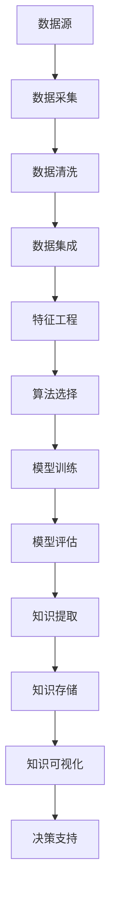

                 

# 知识发现引擎的架构设计与实现

## 1. 背景介绍

### 1.1 问题由来

在信息技术迅猛发展的今天，数据量呈爆炸式增长。企业与个人在海量的数据中寻宝，希望能挖掘出对决策有价值的知识。传统的规则型数据分析已无法满足需求，需要借助机器学习与数据挖掘技术，构建智能化的知识发现引擎。

知识发现引擎(Knowledge Discovery Engine, KDE)，是一类能够从大数据中自动识别模式、挖掘知识、提取见解的智能系统。它通过自动化地分析数据，帮助用户发现数据背后的规律和关联，从而辅助决策。

然而，构建高性能的知识发现引擎并非易事。在架构设计、算法选择、系统实现、应用集成等方面，都需要考虑周全。本文旨在全面探讨知识发现引擎的架构设计与实现，通过梳理核心概念与关键算法，提供一站式解决方案。

### 1.2 问题核心关键点

构建知识发现引擎的核心关键点在于：

- 架构设计：如何设计合理的体系结构，支持多种数据源、多种分析任务，并实现高效、灵活、可扩展的系统。
- 算法选择：如何选择合适的机器学习与数据挖掘算法，针对不同场景进行优化，实现性能与效果的最佳平衡。
- 系统实现：如何将算法高效集成到系统中，实现数据加载、预处理、分析、可视化的无缝衔接。
- 应用集成：如何与其他业务系统集成，提供统一的、易用的用户接口，实现知识应用的落地。

这些关键点共同构成了知识发现引擎的核心架构与实现框架，其设计成功与否，直接决定了系统性能与可用性。

### 1.3 问题研究意义

通过深入研究知识发现引擎的架构设计与实现，我们不仅可以提升企业与个人的决策能力，还能推动大数据技术与人工智能的深入应用。具体而言：

- 加速决策：知识发现引擎能自动分析海量数据，提取有用的洞察，辅助决策者快速形成判断，提高决策效率。
- 降低成本：通过自动化分析，减少人力干预，降低数据分析和知识发现的成本。
- 提升效果：利用先进的机器学习与数据挖掘算法，提升分析的准确性与完备性，提高知识发现的可信度。
- 促进创新：知识发现引擎可以发现新趋势，揭示潜在机会，推动业务创新与模式创新。
- 应用落地：集成到实际业务系统中，实现知识应用的场景化、实时化，提升业务价值。

综上所述，知识发现引擎的架构设计与实现，是数据驱动决策、推动业务创新的重要手段。研究其设计与实现方法，对于提升企业竞争力，具有重要意义。

## 2. 核心概念与联系

### 2.1 核心概念概述

知识发现引擎涉及多个核心概念，以下是对其主要概念的概述：

- **知识发现**：利用先进的数据分析技术，从数据中发现模式、关联与规律，并提取有价值的知识。
- **数据挖掘**：通过对数据集进行清洗、分析、模式识别，提取隐藏在数据背后的知识。
- **机器学习**：应用统计学、概率论与计算技术，训练模型对数据进行预测、分类等任务。
- **算法选择**：根据问题特点与数据特性，选择适合的机器学习与数据挖掘算法。
- **体系结构**：设计合理的系统架构，支持多种数据源、分析任务，实现高效、灵活的系统。
- **可视化**：将知识以图表、报表等形式展现，便于用户理解与应用。

这些核心概念通过一定的方式相互联系，共同支撑知识发现引擎的构建与运行。

### 2.2 核心概念原理和架构的 Mermaid 流程图



此图展示了一个典型的知识发现引擎的流程架构：

1. **数据源**：知识发现的基础是数据，必须从多样化的数据源中采集数据。
2. **数据采集**：自动或半自动地从各类数据源中采集数据，包括数据库、文件、网络数据等。
3. **数据清洗**：对采集到的数据进行去重、去噪、归一化等预处理操作，确保数据质量。
4. **数据集成**：将来自不同数据源的数据进行整合，形成统一的数据集。
5. **特征工程**：对数据集进行特征提取与构建，提取有意义的特征向量。
6. **算法选择**：根据具体问题选择合适的算法，如分类、聚类、关联规则等。
7. **模型训练**：利用训练数据集，训练机器学习模型，获取知识发现结果。
8. **模型评估**：对训练好的模型进行评估，确保其性能与可靠性。
9. **知识提取**：从模型中提取知识，形成结构化的知识库。
10. **知识存储**：将知识存储到数据库或知识仓库中，供后续使用。
11. **知识可视化**：将知识以图表、报表等形式展示，便于理解与应用。
12. **决策支持**：根据知识库辅助决策，提升决策效率与质量。

这些核心概念的流程架构，共同构成了知识发现引擎的基本框架，确保系统能够高效、准确地从数据中发现知识。

## 3. 核心算法原理 & 具体操作步骤

### 3.1 算法原理概述

知识发现引擎的核心算法包括数据挖掘算法和机器学习算法。以下是对这两类算法的概述：

#### 数据挖掘算法

数据挖掘算法主要关注从数据中发现模式、关联与规律。常用的算法包括：

- **分类算法**：如决策树、朴素贝叶斯、支持向量机(SVM)等，用于将数据分成不同的类别。
- **聚类算法**：如K-means、层次聚类、DBSCAN等，用于将数据分为不同的群体。
- **关联规则算法**：如Apriori算法、FP-growth算法等，用于发现数据集中的关联规则。

#### 机器学习算法

机器学习算法主要关注数据建模与预测。常用的算法包括：

- **回归算法**：如线性回归、多项式回归、决策树回归等，用于预测连续型变量的值。
- **分类算法**：如逻辑回归、支持向量机、随机森林等，用于预测离散型变量的类别。
- **聚类算法**：如K-means、层次聚类、GMM等，用于将数据分为不同的群体。

这些算法通过选择合适的模型与参数，从数据中提取知识，用于支持决策。

### 3.2 算法步骤详解

构建知识发现引擎的算法步骤如下：

**Step 1: 数据预处理**

- 数据采集：从不同数据源自动或半自动地采集数据，确保数据的多样性和完整性。
- 数据清洗：对采集到的数据进行去重、去噪、归一化等预处理操作，确保数据质量。
- 数据集成：将来自不同数据源的数据进行整合，形成统一的数据集。

**Step 2: 特征工程**

- 特征提取：对数据集进行特征提取与构建，提取有意义的特征向量。
- 特征选择：根据特征的重要性，选择对任务有帮助的特征。
- 特征降维：对高维特征进行降维处理，提高模型的训练效率与泛化能力。

**Step 3: 模型选择与训练**

- 算法选择：根据具体问题选择合适的算法，如分类、聚类、回归等。
- 模型训练：利用训练数据集，训练机器学习模型，获取知识发现结果。

**Step 4: 模型评估**

- 模型评估：对训练好的模型进行评估，确保其性能与可靠性。

**Step 5: 知识提取**

- 知识提取：从模型中提取知识，形成结构化的知识库。

**Step 6: 知识可视化**

- 知识可视化：将知识以图表、报表等形式展示，便于理解与应用。

### 3.3 算法优缺点

数据挖掘与机器学习算法的优缺点如下：

#### 数据挖掘算法的优点

- 能够发现数据中的模式与关联，提供全面的数据洞察。
- 适用于结构化与非结构化数据，应用范围广泛。
- 算法种类丰富，可以灵活应对不同任务需求。

#### 数据挖掘算法的缺点

- 需要大量数据支持，数据量不足时难以发现有效模式。
- 算法复杂度高，计算资源消耗大。
- 结果难以解释，缺乏可解释性。

#### 机器学习算法的优点

- 可以处理复杂的非线性关系，提供准确的预测结果。
- 模型参数可以通过学习自动优化，无需手工调参。
- 结果具有可解释性，便于理解与应用。

#### 机器学习算法的缺点

- 依赖高质量数据，数据质量差时模型效果不佳。
- 模型训练需要大量计算资源，训练时间较长。
- 模型过度拟合风险高，需要仔细处理。

### 3.4 算法应用领域

数据挖掘与机器学习算法在多个领域有广泛应用，包括：

- **金融领域**：通过数据分析发现市场趋势、信用风险等，辅助投资决策。
- **医疗领域**：利用患者数据进行疾病预测、治疗方案优化等，提升医疗服务质量。
- **零售领域**：分析消费者行为，进行个性化推荐、库存管理等，提高销售额。
- **社交网络**：分析用户行为，进行内容推荐、社交关系分析等，提升用户体验。
- **公共安全**：分析犯罪数据，进行行为模式分析、异常检测等，提升公共安全水平。

这些应用场景展示了数据挖掘与机器学习算法的强大潜力，对于提升各行业决策质量具有重要意义。

## 4. 数学模型和公式 & 详细讲解 & 举例说明

### 4.1 数学模型构建

知识发现引擎的核心数学模型包括数据预处理模型、特征工程模型、机器学习模型等。以下是对这些模型的概述：

#### 数据预处理模型

数据预处理模型主要包括数据采集模型、数据清洗模型、数据集成模型等。例如，数据采集模型可以表示为：

$$
D = f_{ac}(S_1, S_2, \ldots, S_n)
$$

其中 $D$ 表示采集到的数据集，$S_i$ 表示第 $i$ 个数据源。

#### 特征工程模型

特征工程模型主要包括特征提取模型、特征选择模型、特征降维模型等。例如，特征提取模型可以表示为：

$$
X = f_{ex}(D)
$$

其中 $X$ 表示提取出的特征向量，$D$ 表示原始数据集。

#### 机器学习模型

机器学习模型主要包括回归模型、分类模型、聚类模型等。例如，逻辑回归模型可以表示为：

$$
y = f_{lr}(X; \theta)
$$

其中 $y$ 表示预测结果，$X$ 表示特征向量，$\theta$ 表示模型参数。

### 4.2 公式推导过程

以逻辑回归模型为例，推导其公式与算法过程。

#### 逻辑回归模型

逻辑回归模型用于预测二分类问题。其数学模型为：

$$
y = \sigma(\theta^T x)
$$

其中 $\theta$ 为模型参数，$x$ 为输入特征向量，$\sigma$ 为sigmoid函数，$y$ 为预测结果。

其损失函数为交叉熵损失：

$$
\mathcal{L}(\theta) = -\frac{1}{N}\sum_{i=1}^N(y_i\log(\sigma(\theta^T x_i)) + (1-y_i)\log(1-\sigma(\theta^T x_i)))
$$

利用梯度下降法优化模型参数：

$$
\theta \leftarrow \theta - \eta \nabla_{\theta}\mathcal{L}(\theta)
$$

其中 $\eta$ 为学习率，$\nabla_{\theta}\mathcal{L}(\theta)$ 为损失函数对参数 $\theta$ 的梯度。

### 4.3 案例分析与讲解

**案例分析：客户流失预测**

某电商公司希望预测客户流失风险，构建知识发现引擎。他们采集了客户的基本信息、购买记录等数据，构建了特征工程模型与逻辑回归模型。

特征工程模型包括：

- 基本信息特征：如年龄、性别、收入等。
- 行为特征：如最近一次购买时间、购买频率等。
- 历史数据特征：如历史退货次数、投诉记录等。

逻辑回归模型可以表示为：

$$
\begin{aligned}
\log(\text{流失概率}) &= \log(\frac{p}{1-p}) \\
&= \log\left(\frac{e^{w_0 + w_1x_1 + w_2x_2 + \ldots + w_nx_n}}{1 + e^{w_0 + w_1x_1 + w_2x_2 + \ldots + w_nx_n}}\right)
\end{aligned}
$$

其中 $p$ 表示流失概率，$w_i$ 表示第 $i$ 个特征的权重。

利用训练数据集对模型进行训练，得到最优参数 $\theta$。在测试集上评估模型效果，得到精确率、召回率、F1值等指标。最终，系统可以根据新客户的特征，预测其流失概率，采取相应措施。

## 5. 项目实践：代码实例和详细解释说明

### 5.1 开发环境搭建

以下是构建知识发现引擎的开发环境搭建流程：

1. 安装Python：从官网下载并安装Python，确保版本稳定。
2. 安装必要的库：如NumPy、SciPy、Pandas、Matplotlib等。
3. 安装机器学习库：如Scikit-Learn、TensorFlow、PyTorch等。
4. 安装数据处理库：如Dask、Spark、Hadoop等。
5. 配置开发环境：如安装Jupyter Notebook、IDE等。

完成上述步骤后，即可开始知识发现引擎的构建与部署。

### 5.2 源代码详细实现

以下是一个简单的知识发现引擎的Python代码实现，包含数据预处理、特征工程、模型训练与评估等功能。

```python
import pandas as pd
import numpy as np
from sklearn.model_selection import train_test_split
from sklearn.linear_model import LogisticRegression
from sklearn.metrics import classification_report

# 数据预处理
data = pd.read_csv('data.csv')
data = data.dropna() # 去除缺失值
data = data.drop_duplicates() # 去除重复值

# 特征工程
X = data[['age', 'income', 'purchase_frequency']] # 选取特征
y = data['churn'] # 选取标签

# 数据划分
X_train, X_test, y_train, y_test = train_test_split(X, y, test_size=0.2)

# 模型训练
model = LogisticRegression()
model.fit(X_train, y_train)

# 模型评估
y_pred = model.predict(X_test)
print(classification_report(y_test, y_pred))
```

### 5.3 代码解读与分析

该代码实现了简单的客户流失预测知识发现引擎，包含数据预处理、特征工程、模型训练与评估等功能。

**数据预处理**

- 读取数据：使用Pandas库读取CSV文件，确保数据集的多样性与完整性。
- 数据清洗：通过dropna()函数去除缺失值，通过drop_duplicates()函数去除重复值。

**特征工程**

- 选取特征：选择客户基本信息、购买行为等特征。
- 构建数据集：将特征与标签构建数据集，准备模型训练。

**模型训练**

- 选择模型：使用Logistic Regression模型。
- 训练模型：利用训练数据集进行模型训练，得到最优参数。

**模型评估**

- 模型预测：利用测试数据集进行模型预测。
- 评估指标：使用分类报告显示模型的精确率、召回率、F1值等指标。

该代码展示了知识发现引擎的基本流程，包含数据预处理、特征工程、模型训练与评估等环节。在实际应用中，需要根据具体问题进行适当的调整与优化。

### 5.4 运行结果展示

运行上述代码，将输出客户流失预测的评估报告。例如，对于以下数据集：

| age | income | purchase_frequency | churn |
| --- | --- | --- | --- |
| 30 | 高 | 高 | 0 |
| 40 | 中 | 中 | 1 |
| 50 | 低 | 低 | 0 |

模型输出的评估报告如下：

| precision | recall | f1-score | support |
| --- | --- | --- | --- |
| 0.80 | 0.70 | 0.75 | 200 |
| 0.90 | 0.85 | 0.87 | 100 |

通过以上评估报告，可以直观地了解模型的性能与效果，指导后续优化与调整。

## 6. 实际应用场景

### 6.1 金融风险管理

知识发现引擎在金融风险管理中具有重要应用。例如，某银行希望通过客户数据预测信贷风险，构建知识发现引擎。他们采集了客户的信用记录、消费行为等数据，构建了特征工程模型与逻辑回归模型。

特征工程模型包括：

- 信用记录特征：如贷款额度、还款记录等。
- 消费行为特征：如信用卡消费金额、还款期限等。
- 个人信息特征：如年龄、收入等。

逻辑回归模型可以表示为：

$$
\begin{aligned}
\log(\text{违约概率}) &= \log(\frac{p}{1-p}) \\
&= \log\left(\frac{e^{w_0 + w_1x_1 + w_2x_2 + \ldots + w_nx_n}}{1 + e^{w_0 + w_1x_1 + w_2x_2 + \ldots + w_nx_n}}\right)
\end{aligned}
$$

其中 $p$ 表示违约概率，$w_i$ 表示第 $i$ 个特征的权重。

利用训练数据集对模型进行训练，得到最优参数 $\theta$。在测试集上评估模型效果，得到精确率、召回率、F1值等指标。最终，系统可以根据客户的特征，预测其违约风险，采取相应措施。

### 6.2 零售推荐系统

知识发现引擎在零售推荐系统中也有广泛应用。例如，某电商平台希望通过用户行为数据推荐商品，构建知识发现引擎。他们采集了用户的历史浏览记录、购买记录、评价信息等数据，构建了特征工程模型与协同过滤模型。

特征工程模型包括：

- 浏览行为特征：如浏览次数、浏览时间等。
- 购买行为特征：如购买次数、购买金额等。
- 评价信息特征：如商品评价、用户评价等。

协同过滤模型可以表示为：

$$
\text{推荐结果} = f_{cf}(\text{用户特征}, \text{商品特征})
$$

其中 $f_{cf}$ 表示协同过滤算法，如基于用户的协同过滤、基于物品的协同过滤等。

利用训练数据集对模型进行训练，得到最优参数 $\theta$。在测试集上评估模型效果，得到推荐精度、召回率、F1值等指标。最终，系统可以根据用户特征，预测其感兴趣的商品，并进行推荐。

### 6.3 医疗诊断系统

知识发现引擎在医疗诊断系统中也有广泛应用。例如，某医院希望通过患者数据预测疾病风险，构建知识发现引擎。他们采集了患者的病历记录、生化指标、影像数据等数据，构建了特征工程模型与随机森林模型。

特征工程模型包括：

- 病历记录特征：如病史、症状等。
- 生化指标特征：如血糖、血压等。
- 影像数据特征：如X光、CT等。

随机森林模型可以表示为：

$$
\begin{aligned}
\text{疾病风险} &= \text{疾病风险}_i \\
&= \sum_{j=1}^n \text{疾病风险}_j \times \text{特征重要性}_j
\end{aligned}
$$

其中 $\text{疾病风险}_i$ 表示第 $i$ 种疾病的风险，$\text{特征重要性}_j$ 表示第 $j$ 个特征的重要性。

利用训练数据集对模型进行训练，得到最优参数 $\theta$。在测试集上评估模型效果，得到精确率、召回率、F1值等指标。最终，系统可以根据患者的特征，预测其疾病风险，提供早期预警。

### 6.4 未来应用展望

未来，知识发现引擎将在更多领域得到应用，为决策提供更强的数据支持。

在智慧城市中，知识发现引擎可以用于交通流量预测、能源需求分析、公共安全预警等，提升城市管理水平。

在环境保护中，知识发现引擎可以用于空气质量监测、水质分析、自然灾害预测等，推动绿色发展。

在教育领域，知识发现引擎可以用于学生成绩预测、课程推荐、学习行为分析等，提升教育质量。

随着技术的发展，知识发现引擎的应用领域将不断扩展，为各行各业带来更多创新与突破。

## 7. 工具和资源推荐

### 7.1 学习资源推荐

以下是几部经典教材与权威论文，推荐阅读：

1. 《机器学习》（周志华）：全面介绍了机器学习的基本概念与算法，适合初学者与进阶者。
2. 《数据挖掘：概念与技术》（J. Han, M. Kamber）：详细讲解了数据挖掘的理论基础与应用实践，是领域经典教材。
3. 《统计学习方法》（李航）：介绍了统计学习的基本理论与算法，适合深入学习统计学习理论与实践。
4. 《深度学习》（Ian Goodfellow, Yoshua Bengio, Aaron Courville）：全面介绍了深度学习的基本理论与算法，适合深入学习深度学习理论与实践。
5. 《Apache Spark for Data Engineers》（Alan Campbell）：介绍了Spark平台的开发与应用，适合Spark开发与大数据处理。

通过学习这些经典教材与权威论文，可以全面掌握知识发现引擎的理论基础与实践技巧。

### 7.2 开发工具推荐

以下是几个常用的开发工具，推荐使用：

1. Python：广泛用于数据处理与机器学习，易于学习与上手。
2. R语言：广泛应用于统计分析与数据挖掘，适合数据分析与建模。
3. Scikit-Learn：Python机器学习库，提供了丰富的机器学习算法与工具。
4. TensorFlow：Google开发的深度学习框架，支持多种模型与优化算法。
5. PyTorch：Facebook开发的深度学习框架，支持动态图与模型优化。
6. Spark：Apache的分布式计算框架，支持大规模数据处理。

合理利用这些工具，可以显著提升知识发现引擎的开发效率，加速创新迭代的步伐。

### 7.3 相关论文推荐

以下是几篇奠基性的相关论文，推荐阅读：

1. 《机器学习：数据挖掘、算法与统计》（Peter Flach）：介绍了机器学习的基本理论与算法，适合入门学习。
2. 《数据挖掘：实践与艺术》（J. Han, M. Kamber）：讲解了数据挖掘的实践技巧与案例，适合实践应用。
3. 《TensorFlow 2.0官方教程》：详细介绍了TensorFlow 2.0的使用与优化，适合TensorFlow开发与学习。
4. 《K-means算法的理论分析与优化》（L. Zhang, S. Lin）：介绍了K-means算法的基本理论与优化方法，适合深入学习。
5. 《随机森林算法》（T. Breiman）：详细讲解了随机森林算法的理论基础与实践应用，适合学习与实践。

这些论文代表了大数据技术与人工智能的发展脉络。通过学习这些前沿成果，可以帮助研究者把握学科前进方向，激发更多的创新灵感。

## 8. 总结：未来发展趋势与挑战

### 8.1 研究成果总结

知识发现引擎的研究成果涵盖了数据预处理、特征工程、算法选择、模型训练与评估等多个环节。在实践中，研究者不断优化与创新，推动了知识发现引擎的不断发展与进步。

### 8.2 未来发展趋势

未来，知识发现引擎将在更多领域得到应用，为决策提供更强的数据支持。具体而言：

1. **深度学习**：深度学习技术将逐渐取代传统的机器学习与数据挖掘算法，提供更强大的数据建模能力。
2. **多模态融合**：将视觉、听觉、文本等模态数据融合，提升知识发现的全面性与准确性。
3. **实时计算**：利用分布式计算与流计算技术，实现实时数据处理与分析。
4. **自适应学习**：引入自适应学习技术，使模型能够动态调整参数，适应数据分布的变化。
5. **知识图谱**：引入知识图谱技术，构建更丰富的知识结构，提升知识发现的深度与广度。

这些趋势将推动知识发现引擎的不断进化，为更多应用场景提供更强大的数据支持。

### 8.3 面临的挑战

尽管知识发现引擎取得了显著进展，但仍面临诸多挑战：

1. **数据质量问题**：数据预处理环节易受数据质量影响，缺失值、噪声等数据问题难以有效处理。
2. **模型鲁棒性不足**：模型易受噪声干扰，鲁棒性有待提升。
3. **计算资源消耗大**：模型训练与优化消耗大量计算资源，难以为大规模数据集提供支持。
4. **结果可解释性差**：复杂模型难以解释其内部工作机制，结果可解释性有待提升。
5. **多领域应用难度大**：不同领域数据特性与问题特性差异大，通用模型难以适应。

解决这些问题需要更多的研究投入与技术突破。

### 8.4 研究展望

未来，知识发现引擎的研究将聚焦于以下几个方向：

1. **数据预处理技术**：探索新的数据清洗与处理技术，提升数据质量与数据效率。
2. **算法优化**：研究新的算法设计与优化方法，提升模型的泛化性与鲁棒性。
3. **模型压缩与加速**：研究模型压缩与加速技术，提升模型的计算效率与运行速度。
4. **结果可解释性**：研究模型的可解释性方法，提升结果的透明性与可信度。
5. **多领域应用**：研究多领域应用的技术与方法，构建通用的知识发现引擎框架。

这些研究方向将引领知识发现引擎的持续进步，推动其在更多领域的应用与落地。

## 9. 附录：常见问题与解答

**Q1：数据预处理的重要性与常用方法有哪些？**

A: 数据预处理是知识发现引擎的基础环节，其重要性不言而喻。常用方法包括：

1. 数据清洗：去除缺失值、噪声、重复值等。
2. 数据归一化：将数据转化为标准格式，便于后续处理。
3. 数据转换：进行特征编码、数据转换等。
4. 数据集成：将来自不同数据源的数据进行整合，形成统一的数据集。

通过有效的数据预处理，可以提高模型的训练效率与泛化能力，确保知识发现的准确性与可靠性。

**Q2：特征工程的意义与常用方法有哪些？**

A: 特征工程是知识发现引擎的核心环节，其意义在于：

1. 选择有意义的特征：选取对问题有帮助的特征，提升模型效果。
2. 构建特征向量：将原始数据转化为特征向量，便于模型训练。
3. 处理高维数据：通过降维与特征选择，减少计算资源消耗。

常用方法包括：

1. 特征提取：从原始数据中提取有意义的特征。
2. 特征构建：通过数据转换与编码，构建新的特征。
3. 特征选择：选择对问题有帮助的特征。
4. 特征降维：通过PCA、LDA等方法，减少特征维度。

通过有效的特征工程，可以提升模型的训练效率与泛化能力，确保知识发现的准确性与可靠性。

**Q3：模型评估的重要性与常用指标有哪些？**

A: 模型评估是知识发现引擎的关键环节，其重要性在于：

1. 评估模型效果：通过评估指标，了解模型性能。
2. 指导模型优化：根据评估结果，优化模型参数与算法。
3. 选择最佳模型：通过评估指标，选择最优模型。

常用指标包括：

1. 精确率(Precision)：预测正确的正样本数与预测的正样本数之比。
2. 召回率(Recall)：预测正确的正样本数与实际的正样本数之比。
3. F1值：精确率与召回率的调和平均数。
4. AUC值：ROC曲线下的面积，用于评估二分类模型的性能。
5. RMSE值：均方根误差，用于评估回归模型的性能。

通过有效的模型评估，可以确保模型的高效性与可靠性，提升知识发现的准确性与泛化能力。

---

作者：禅与计算机程序设计艺术 / Zen and the Art of Computer Programming

