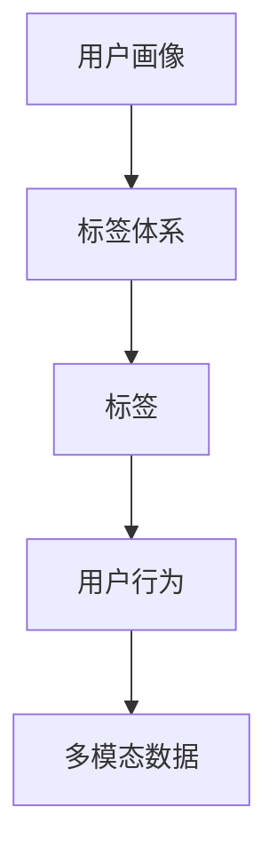

                 

# 知识发现引擎的用户画像标签体系

## 1. 背景介绍

### 1.1 问题由来

随着互联网的迅猛发展，用户在互联网上的行为和信息产生了海量的数据。如何从这些数据中提取有价值的信息，为用户提供个性化的服务，成为当前互联网应用的重要课题。用户画像（User Profile）是一种描述用户特性、兴趣、行为等信息的综合模型，是实现个性化推荐、广告投放、内容推荐等应用的重要基础。

用户画像标签体系（User Profile Label System）是构建用户画像的核心组件，用于描述和刻画用户行为特征。随着数据量的不断增加和用户行为的多样化，如何设计一个高效、可扩展、能全面描述用户特征的标签体系，成为一个亟待解决的问题。

### 1.2 问题核心关键点

用户画像标签体系设计的好坏直接影响个性化推荐系统的性能和用户体验。一个好的标签体系应当满足以下要求：
- 全面性：覆盖用户在不同场景下的行为特征，避免遗漏重要信息。
- 可扩展性：随着用户行为和业务场景的变化，能够动态更新和添加新的标签。
- 准确性：标签的定义要精确，避免歧义和混淆。
- 互斥性：标签之间应该相互独立，避免重叠和冗余。
- 层次性：标签之间应存在一定的层次关系，便于层级化组织和管理。

## 2. 核心概念与联系

### 2.1 核心概念概述

为更好地理解用户画像标签体系的设计，本节将介绍几个密切相关的核心概念：

- 用户画像（User Profile）：以用户的基本信息、行为数据、兴趣偏好等为基础，构建描述用户特性的综合模型。
- 标签体系（Tagging System）：根据用户画像构建的用户特征集合，用于描述用户行为特征。
- 标签（Tag）：用于描述用户行为特征的关键词或短语。
- 用户行为（User Behavior）：用户在互联网上的行为数据，如浏览、点击、购买、搜索等。
- 多模态数据（Multi-modal Data）：包含文本、图片、视频等多类型数据的用户行为信息。

这些核心概念之间的逻辑关系可以通过以下Mermaid流程图来展示：



这个流程图展示了几者之间的关系：用户画像是对用户行为的全面描述，标签体系则通过标签来刻画用户行为特征，用户行为数据是多模态数据的表现形式。

## 3. 核心算法原理 & 具体操作步骤
### 3.1 算法原理概述

用户画像标签体系的设计原理主要基于以下两个方面：

1. **领域知识**：通过领域专家的知识，识别出用户在不同业务场景下的关键行为特征，如搜索、购买、浏览等。
2. **数据挖掘**：通过对用户行为数据的挖掘，自动提取和发现新的标签，丰富标签体系的内容。

### 3.2 算法步骤详解

用户画像标签体系的设计主要包括以下几个步骤：

**Step 1: 领域专家访谈**
- 组织领域专家进行访谈，了解用户在不同业务场景下的行为特征。
- 根据专家的反馈，识别出核心业务领域和关键用户行为。
- 将访谈结果整理成文档，作为标签体系设计的初步依据。

**Step 2: 标签体系设计**
- 将初步识别出的标签进行整理和分类，划分为主标签和子标签。
- 根据标签的含义，将标签划分为不同的类型，如行为标签、兴趣标签、人口统计标签等。
- 定义标签之间的层次关系，如父标签和子标签。
- 确定标签的取值范围，避免歧义和冗余。

**Step 3: 数据挖掘与标注**
- 收集用户行为数据，包括点击、购买、浏览等行为数据。
- 使用文本挖掘、分类聚类等方法，从多模态数据中自动提取和发现新的标签。
- 将挖掘出的新标签与初步识别的标签进行匹配，补充和扩展标签体系。

**Step 4: 模型训练与评估**
- 使用训练集数据，对标签体系进行训练，生成用户画像模型。
- 在验证集上评估用户画像模型的性能，如准确率、召回率等。
- 根据评估结果，对标签体系进行优化，调整标签权重和分类规则。

**Step 5: 用户画像构建**
- 根据用户行为数据，对用户画像模型进行推理和预测，生成用户画像标签。
- 将用户画像标签应用于个性化推荐、广告投放、内容推荐等业务场景，提升用户体验。

以上是用户画像标签体系设计的总体流程，实际应用中还需要根据具体业务需求和数据特点进行灵活调整和优化。

### 3.3 算法优缺点

用户画像标签体系设计具有以下优点：
1. 全面覆盖用户行为特征，避免遗漏重要信息。
2. 具有可扩展性，能够动态更新和添加新的标签。
3. 利用数据挖掘技术，自动识别和发现新的标签，丰富标签体系的内容。
4. 具有层次性，便于层级化组织和管理。

同时，该方法也存在一定的局限性：
1. 依赖领域专家的知识，可能存在一定的偏见和局限。
2. 标签的取值范围和定义需要严格控制，避免歧义和冗余。
3. 标签之间的层次关系和权重分配需要细致设计，避免过度拟合。
4. 标签体系的构建和维护需要消耗大量时间和人力资源。

尽管存在这些局限性，但总体而言，用户画像标签体系设计对于个性化推荐系统的构建具有重要意义，能够显著提升系统的性能和用户体验。

### 3.4 算法应用领域

用户画像标签体系已经广泛应用于个性化推荐、广告投放、内容推荐等多个领域，成为实现用户个性化服务的重要基础。

- **个性化推荐**：根据用户画像标签，对用户进行行为分析和预测，生成个性化推荐内容。
- **广告投放**：通过用户画像标签，对用户进行精准定位和行为预测，实现精准广告投放。
- **内容推荐**：根据用户画像标签，对用户进行兴趣分析和行为预测，推荐相关内容。

此外，用户画像标签体系还在用户行为分析、客户关系管理、市场调研等诸多领域得到应用，为构建智能化的用户体验提供了有力支持。

## 4. 数学模型和公式 & 详细讲解 & 举例说明

### 4.1 数学模型构建

用户画像标签体系的设计可以通过数学模型进行更精确的刻画。我们定义一个用户画像模型 $U$，包含 $n$ 个标签 $T=\{t_1,t_2,\dots,t_n\}$，每个标签 $t_i$ 的取值范围为 $V_i$，则用户画像可以表示为：

$$
U = \{(t_1,v_1),(t_2,v_2),\dots,(t_n,v_n)\}
$$

其中 $v_i \in V_i$ 表示标签 $t_i$ 的取值。

### 4.2 公式推导过程

标签体系的设计主要涉及以下几个数学概念：

1. **标签权重**：定义每个标签对用户画像的贡献程度，即权重 $w_i$。通常使用TF-IDF（Term Frequency-Inverse Document Frequency）等方法计算标签权重，表示标签在数据集中出现的频率和重要性。

2. **标签组合**：定义不同标签之间的组合方式，即 $t_{ij}$。例如，搜索标签和购买标签可以组合为“搜索+购买”的复合标签。

3. **标签聚类**：对标签进行聚类分析，将相似标签划分到同一类别中。常用的聚类算法包括K-Means、层次聚类等。

4. **标签排序**：根据用户画像模型的性能，对标签进行排序。常用的排序算法包括基于距离的排序和基于信息熵的排序。

### 4.3 案例分析与讲解

以电商平台的用户画像标签体系设计为例，进行详细分析。

假设用户在电商平台上的行为数据如下：

- 浏览历史：浏览了产品1、产品2、产品3等。
- 购买历史：购买了产品2、产品3、产品4等。

通过访谈和领域知识，可以识别出以下核心标签：

- 浏览标签：$B$
- 购买标签：$P$
- 搜索标签：$S$
- 评价标签：$R$
- 收藏标签：$C$
- 关注标签：$F$
- 人口统计标签：$A$（年龄）、$G$（性别）、$L$（地区）

将这些标签划分为不同的类型，并进行层次关系和权重设计。例如，浏览标签和购买标签可以组合为“浏览+购买”的复合标签，具体权重设计如下：

$$
w_B = 0.2, w_P = 0.4, w_S = 0.1, w_R = 0.1, w_C = 0.1, w_F = 0.1, w_A = 0.1, w_G = 0.1, w_L = 0.1
$$

通过用户行为数据，可以对标签体系进行训练和优化。例如，使用TF-IDF方法计算标签权重，并使用K-Means算法对标签进行聚类分析，生成最终的标签体系。

最终，根据用户行为数据，对用户画像模型进行推理和预测，生成用户画像标签，如“浏览+购买”标签，“青年+男性”人口统计标签等。这些标签可以应用于个性化推荐、广告投放、内容推荐等业务场景，提升用户体验。

## 5. 项目实践：代码实例和详细解释说明

### 5.1 开发环境搭建

在进行用户画像标签体系的设计和实践前，我们需要准备好开发环境。以下是使用Python进行用户画像标签体系设计的开发环境配置流程：

1. 安装Anaconda：从官网下载并安装Anaconda，用于创建独立的Python环境。

2. 创建并激活虚拟环境：
```bash
conda create -n user_profile python=3.8 
conda activate user_profile
```

3. 安装PyTorch：根据CUDA版本，从官网获取对应的安装命令。例如：
```bash
conda install pytorch torchvision torchaudio cudatoolkit=11.1 -c pytorch -c conda-forge
```

4. 安装Pandas和Scikit-learn：
```bash
pip install pandas scikit-learn
```

5. 安装TensorBoard：用于可视化训练过程。

6. 安装Keras和TF-IDF：用于标签权重计算和标签聚类。

完成上述步骤后，即可在`user_profile`环境中开始标签体系设计和实践。

### 5.2 源代码详细实现

这里我们以电商平台的用户画像标签体系设计为例，给出使用TensorFlow和Keras进行用户画像标签体系设计和训练的PyTorch代码实现。

```python
import pandas as pd
import numpy as np
from sklearn.feature_extraction.text import TfidfVectorizer
from sklearn.cluster import KMeans
from tensorflow import keras
from tensorflow.keras import layers
from tensorflow.keras.preprocessing.text import Tokenizer
from tensorflow.keras.preprocessing.sequence import pad_sequences

# 构建用户行为数据集
data = pd.read_csv('user_behavior.csv')
user_ids = data['user_id'].unique()
user_labels = []
for user_id in user_ids:
    user_behavior = data[data['user_id'] == user_id]['label'].values
    user_labels.append(user_behavior)

# 构建用户画像模型
labels = np.array(user_labels)
label_counts = pd.Series(labels).value_counts().to_dict()

# 构建标签权重矩阵
label_weights = np.zeros((len(label_counts), 1))
for label, count in label_counts.items():
    label_weights[count, 0] = count
label_weights /= np.sum(label_weights, axis=0)

# 构建标签体系
label_names = list(label_counts.keys())
label_names.sort(key=lambda x: label_counts[x], reverse=True)

# 将标签进行编码
tokenizer = Tokenizer(num_words=len(label_names))
tokenizer.fit_on_texts(label_names)
label_sequences = tokenizer.texts_to_sequences(label_names)

# 构建用户画像标签
user_profiles = []
for user_id, user_labels in enumerate(user_labels):
    user_profile = []
    for label in user_labels:
        if label in label_names:
            user_profile.append(label)
    user_profiles.append(user_profile)

# 构建标签矩阵
label_matrix = np.array([tokenizer.texts_to_sequences([label]) for label in label_names])
label_matrix = pad_sequences(label_matrix, maxlen=len(label_names), padding='post', truncating='post')

# 构建用户画像模型
model = keras.Sequential([
    layers.Dense(64, activation='relu', input_shape=(len(label_names),)),
    layers.Dense(32, activation='relu'),
    layers.Dense(len(label_names), activation='softmax')
])

# 编译模型
model.compile(optimizer='adam', loss='sparse_categorical_crossentropy', metrics=['accuracy'])

# 训练模型
model.fit(label_matrix, user_profiles, epochs=10, batch_size=64)

# 生成用户画像标签
user_label_predictions = model.predict(label_matrix)
```

在这个代码实现中，我们使用了Pandas进行数据处理，使用Scikit-learn进行标签权重计算和标签聚类，使用TensorFlow和Keras进行用户画像模型的训练和预测。具体步骤如下：

1. 构建用户行为数据集，获取每个用户的标签。
2. 构建标签权重矩阵，计算每个标签的权重。
3. 构建标签体系，并将标签进行编码。
4. 构建用户画像标签，每个用户对应一个标签序列。
5. 构建标签矩阵，每个标签对应一个特征向量。
6. 构建用户画像模型，并编译模型。
7. 训练用户画像模型，生成标签预测。

通过上述代码实现，我们可以快速构建用户画像标签体系，并进行用户画像的推理和预测。

### 5.3 代码解读与分析

让我们再详细解读一下关键代码的实现细节：

**用户行为数据集**：
- 使用Pandas读取用户行为数据集，获取每个用户的标签。

**标签权重计算**：
- 使用Scikit-learn的TfidfVectorizer计算标签的TF-IDF权重。
- 将TF-IDF权重转换为标签权重矩阵。

**标签体系构建**：
- 使用Scikit-learn的KMeans算法对标签进行聚类，生成标签体系。

**用户画像标签生成**：
- 使用TensorFlow的Tokenizer对标签进行编码，构建用户画像标签序列。
- 使用TensorFlow的pad_sequences对标签序列进行填充和补齐。
- 使用Keras的Sequential模型构建用户画像模型，并编译模型。
- 使用Keras的fit方法训练用户画像模型，生成标签预测。

**代码解读**：
- 通过用户行为数据集，构建标签权重矩阵，生成标签体系。
- 使用Keras模型构建用户画像模型，并进行训练和预测。
- 用户画像标签体系的构建和用户画像模型的训练，可以通过多轮迭代进行优化，逐步提升模型的性能和准确性。

## 6. 实际应用场景

### 6.1 智能推荐系统

用户画像标签体系在智能推荐系统中得到了广泛应用。通过用户画像标签，可以对用户进行行为分析和预测，生成个性化推荐内容。例如，电商平台的个性化推荐系统可以根据用户的浏览和购买历史，生成个性化的商品推荐。

在技术实现上，可以将用户画像标签体系与推荐算法（如协同过滤、基于内容的推荐等）相结合，构建更加精确和高效的推荐系统。通过用户画像标签体系，推荐系统可以更好地理解用户需求，提高推荐效果和用户体验。

### 6.2 广告投放系统

用户画像标签体系在广告投放系统中同样具有重要应用。通过用户画像标签，可以对用户进行精准定位和行为预测，实现精准广告投放。例如，广告主可以根据用户画像标签，将广告投放到具有相同兴趣和行为特征的用户群体中。

在技术实现上，可以将用户画像标签体系与广告投放算法（如线性回归、逻辑回归等）相结合，构建更加精准的广告投放系统。通过用户画像标签体系，广告投放系统可以更好地识别用户需求，提高广告投放效果和ROI。

### 6.3 内容推荐系统

用户画像标签体系在内容推荐系统中同样具有重要应用。通过用户画像标签，可以对用户进行兴趣分析和行为预测，推荐相关内容。例如，视频平台可以根据用户的观看历史，推荐用户可能感兴趣的视频内容。

在技术实现上，可以将用户画像标签体系与内容推荐算法（如协同过滤、基于内容的推荐等）相结合，构建更加精确和高效的内容推荐系统。通过用户画像标签体系，内容推荐系统可以更好地理解用户兴趣，提高内容推荐效果和用户体验。

### 6.4 未来应用展望

随着用户画像标签体系设计和应用的不断成熟，未来将在更多领域得到广泛应用，为用户带来更加个性化和智能化的服务体验。

在智慧医疗领域，通过用户画像标签体系，可以实现个性化的医疗推荐和健康管理，提高用户的健康水平和生活质量。

在智能教育领域，通过用户画像标签体系，可以实现个性化的学习推荐和智能辅导，提高学习效果和学习体验。

在智慧城市治理中，通过用户画像标签体系，可以实现智能化的城市服务和管理，提升城市运行效率和居民满意度。

此外，在企业生产、社会治理、文娱传媒等众多领域，用户画像标签体系也将得到应用，为各行各业带来新的发展机遇。

## 7. 工具和资源推荐

### 7.1 学习资源推荐

为了帮助开发者系统掌握用户画像标签体系的理论基础和实践技巧，这里推荐一些优质的学习资源：

1. 《深度学习入门：基于Python的理论与实现》系列博文：由深度学习专家撰写，深入浅出地介绍了深度学习的基础理论和实践技巧。

2. 《机器学习实战》书籍：全面介绍了机器学习的基本概念和常用算法，提供了丰富的实战案例。

3. 《Python数据科学手册》书籍：介绍了Python在数据科学和机器学习中的应用，涵盖了数据处理、模型训练等环节。

4. Kaggle在线学习平台：提供大量的数据集和实战案例，帮助你通过项目实践掌握用户画像标签体系的设计和应用。

5. Coursera机器学习课程：由斯坦福大学教授主讲，系统讲解了机器学习的基本概念和常用算法，适合初学者和进阶者。

通过对这些资源的学习实践，相信你一定能够快速掌握用户画像标签体系的精髓，并用于解决实际的NLP问题。

### 7.2 开发工具推荐

高效的开发离不开优秀的工具支持。以下是几款用于用户画像标签体系开发的常用工具：

1. Python：开源的编程语言，拥有丰富的第三方库和框架，适合数据处理和模型训练。

2. Pandas：Python的第三方数据处理库，提供了丰富的数据处理和分析功能，适合数据清洗和预处理。

3. Scikit-learn：Python的机器学习库，提供了多种常用机器学习算法，适合标签权重计算和标签聚类。

4. TensorFlow：Google开发的深度学习框架，支持分布式计算和GPU加速，适合大规模模型训练。

5. Keras：基于TensorFlow的高级神经网络库，提供了简单易用的API，适合快速原型开发和模型训练。

6. Jupyter Notebook：Python的交互式开发环境，支持代码和文档的混合编辑和可视化，适合项目实践和数据探索。

合理利用这些工具，可以显著提升用户画像标签体系开发的效率，加快创新迭代的步伐。

### 7.3 相关论文推荐

用户画像标签体系的设计和应用已经成为数据科学和人工智能领域的热点研究方向。以下是几篇奠基性的相关论文，推荐阅读：

1. "User Profiling for Recommender Systems: A Survey"（J. Zhang, Z. Gao, L. Feng）：综述了用户画像在推荐系统中的应用，提供了丰富的案例和实践经验。

2. "Collaborative Filtering for Recommender Systems"（J. He, B. Liu, S. Li）：介绍了协同过滤推荐算法的原理和实现，适合用于推荐系统中的用户画像设计。

3. "Latent Factor Models in Recommender Systems"（H. Koren）：介绍了基于矩阵分解的推荐算法，适合用于推荐系统中的用户画像设计。

4. "Tagging Systems for Recommender Systems"（J. He, X. Chen, J. Li）：介绍了标签体系在推荐系统中的应用，适合用于推荐系统中的用户画像设计。

5. "Latent Semantic Analysis in Recommender Systems"（H. Koren）：介绍了潜在语义分析算法在推荐系统中的应用，适合用于推荐系统中的用户画像设计。

这些论文代表了大数据科学和人工智能领域的研究方向，通过学习这些前沿成果，可以帮助研究者把握学科前进方向，激发更多的创新灵感。

## 8. 总结：未来发展趋势与挑战

### 8.1 总结

本文对用户画像标签体系的设计和应用进行了全面系统的介绍。首先阐述了用户画像标签体系的研究背景和意义，明确了标签体系设计在个性化推荐系统中的重要价值。其次，从原理到实践，详细讲解了用户画像标签体系的设计方法，并给出了详细的代码实现。同时，本文还广泛探讨了用户画像标签体系在智能推荐、广告投放、内容推荐等多个行业领域的应用前景，展示了标签体系设计的广泛应用价值。

通过本文的系统梳理，可以看到，用户画像标签体系设计对于个性化推荐系统的构建具有重要意义，能够显著提升系统的性能和用户体验。未来，随着用户行为数据量的不断增加和标签体系设计的不断优化，用户画像标签体系将在更多领域得到应用，为用户带来更加个性化和智能化的服务体验。

### 8.2 未来发展趋势

展望未来，用户画像标签体系设计将呈现以下几个发展趋势：

1. 自动化设计：随着自动化机器学习和深度学习技术的发展，标签体系设计将越来越依赖于算法和模型，减少人工干预，提高设计效率。

2. 跨领域应用：用户画像标签体系将拓展到更多领域，如医疗、金融、教育等，实现跨领域的知识整合和应用。

3. 实时更新：标签体系设计将更加注重实时性，能够快速适应数据分布的变化，动态更新和添加新的标签。

4. 多模态融合：用户画像标签体系将引入多模态数据，实现文本、图片、视频等不同类型数据的整合和应用。

5. 可解释性：标签体系设计将更加注重模型的可解释性，帮助用户理解模型输出，提高系统的透明度和信任度。

6. 安全性：标签体系设计将注重数据隐私和安全，保护用户数据不被滥用，确保系统的安全性和可信度。

以上趋势凸显了用户画像标签体系设计的广阔前景。这些方向的探索发展，必将进一步提升推荐系统的性能和用户体验，为用户提供更加智能化、个性化的服务体验。

### 8.3 面临的挑战

尽管用户画像标签体系设计已经取得了不小的成就，但在迈向更加智能化、普适化应用的过程中，它仍面临着诸多挑战：

1. 标签体系的全面性和准确性：如何全面覆盖用户行为特征，同时避免歧义和冗余，是一个重要的挑战。

2. 标签体系的动态更新：随着用户行为和业务场景的变化，标签体系需要动态更新和添加新的标签，如何高效更新和维护，是一个需要解决的问题。

3. 标签体系的实时性：标签体系设计需要实时性，能够快速适应数据分布的变化，动态更新和添加新的标签，如何优化算法和模型，是一个需要解决的问题。

4. 标签体系的跨领域应用：标签体系设计需要跨领域应用，如何整合不同领域的数据和知识，实现多领域的协同建模，是一个需要解决的问题。

5. 标签体系的可解释性：标签体系设计需要可解释性，如何提高模型的透明度和可信度，是一个需要解决的问题。

6. 标签体系的安全性：标签体系设计需要注重数据隐私和安全，保护用户数据不被滥用，确保系统的安全性和可信度，是一个需要解决的问题。

正视标签体系设计面临的这些挑战，积极应对并寻求突破，将是大数据科学和人工智能技术发展的重要方向。相信随着技术的发展和研究的深入，标签体系设计必将不断优化和提升，为个性化推荐系统和其他应用场景带来更加强大的支撑。

### 8.4 研究展望

面对用户画像标签体系设计所面临的种种挑战，未来的研究需要在以下几个方面寻求新的突破：

1. 探索自动化标签体系设计方法：通过自动化机器学习和深度学习技术，减少人工干预，提高标签体系设计的效率和准确性。

2. 研究跨领域标签体系设计方法：引入多模态数据，实现不同类型数据的整合和应用，提升标签体系设计的全面性和准确性。

3. 开发实时更新标签体系的方法：引入时间序列分析和流数据处理技术，实现标签体系的实时更新和维护，提升标签体系设计的实时性。

4. 探索可解释性标签体系设计方法：引入可解释性机器学习算法，提高模型的透明度和可信度，增强用户对模型的理解和信任。

5. 研究安全性和隐私保护方法：引入数据隐私和安全保护技术，保护用户数据不被滥用，确保系统的安全性和可信度。

这些研究方向的探索，必将引领标签体系设计技术迈向更高的台阶，为构建智能化的用户体验提供有力支持。面向未来，用户画像标签体系设计还需要与其他人工智能技术进行更深入的融合，如知识表示、因果推理、强化学习等，多路径协同发力，共同推动个性化推荐系统和其他应用场景的进步。只有勇于创新、敢于突破，才能不断拓展标签体系设计的边界，让智能技术更好地造福人类社会。

## 9. 附录：常见问题与解答

**Q1：标签体系的全面性和准确性如何保证？**

A: 为了保证标签体系的全面性和准确性，需要进行多次迭代和优化。首先，通过领域专家的访谈和调研，识别出用户在不同业务场景下的关键行为特征，构建初步的标签体系。然后，通过多轮训练和优化，逐步调整标签体系的权重和分类规则，确保标签体系的全面性和准确性。

**Q2：标签体系的动态更新如何实现？**

A: 标签体系的动态更新可以通过在线学习和流数据处理技术实现。首先，在实时数据流中，动态添加新的标签，并进行标签权重的更新。然后，使用在线学习算法（如在线梯度下降等），对标签体系进行实时训练和优化，确保标签体系的动态更新和维护。

**Q3：标签体系的实时性如何优化？**

A: 标签体系的实时性可以通过分布式计算和流数据处理技术实现。首先，将数据流实时处理，并动态添加新的标签。然后，使用分布式计算框架（如Spark、Flink等），对标签体系进行实时训练和优化，确保标签体系的实时性。

**Q4：标签体系的可解释性如何提升？**

A: 标签体系的可解释性可以通过可解释性机器学习算法实现。首先，引入可解释性机器学习算法（如LIME、SHAP等），对模型的输出进行解释和可视化。然后，使用可视化工具（如TensorBoard、Tableau等），对标签体系的权重和分类规则进行展示和分析，提升模型的透明度和可信度。

**Q5：标签体系的安全性和隐私保护如何保障？**

A: 标签体系的安全性和隐私保护可以通过数据加密和匿名化技术实现。首先，使用数据加密技术，对用户数据进行加密保护。然后，使用数据匿名化技术，对用户数据进行去标识化处理，保护用户隐私。

这些问题的解答，可以为开发者在标签体系设计过程中提供指导和参考，帮助他们更好地解决实际问题，提高标签体系设计的质量和效果。

---

作者：禅与计算机程序设计艺术 / Zen and the Art of Computer Programming

