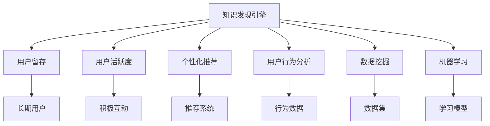

                 

# 知识发现引擎的用户留存与活跃度提升

> 关键词：知识发现引擎, 用户留存, 活跃度提升, 推荐系统, 用户行为分析, 数据挖掘, 机器学习, 用户体验

## 1. 背景介绍

在互联网时代，知识发现引擎（Knowledge Discovery Engine, KDE）作为重要的信息获取工具，对用户的生活和工作产生了深远影响。随着内容形态的丰富和用户需求的多样化，用户对知识发现引擎的粘性和使用频率提出了更高的要求。用户留存和活跃度提升，成为知识发现引擎可持续发展的重要指标。

### 1.1 问题由来

当前知识发现引擎面临的主要问题是用户留存率和活跃度的不足。一方面，用户流失现象普遍存在，尤其是高频次用户（如每日访问、频繁搜索的用户）流失率较高。另一方面，尽管大部分用户访问知识发现引擎，但大部分访问时间用于浏览首页或特定信息源，导致用户行为分散，活跃度不高。如何提升用户留存和活跃度，成为知识发现引擎优化和发展的关键。

### 1.2 问题核心关键点

用户留存和活跃度提升的本质在于提高用户在知识发现引擎上的价值感和使用便捷性。主要包括以下几个方面：

- 个性化推荐：根据用户兴趣和行为特征，为用户推荐相关内容，提升用户体验。
- 用户行为分析：分析用户访问行为、使用路径和偏好，优化产品设计和功能。
- 内容多样化：丰富内容形态，满足用户多样化需求，增强用户粘性。
- 社区互动：鼓励用户参与内容生成、评论和讨论，提升用户参与度和忠诚度。
- 持续反馈：建立用户反馈机制，及时响应用户需求和意见，不断优化产品体验。

通过优化这些方面，可以显著提升用户留存和活跃度，进而提升知识发现引擎的用户价值和商业价值。

### 1.3 问题研究意义

提升用户留存和活跃度，不仅能够增加知识发现引擎的日活跃用户数（DAU）和月活跃用户数（MAU），还能够增加用户的使用频率和访问深度，从而提升知识发现引擎的收入和品牌影响力。同时，通过深入分析用户行为，可以发现用户的新需求和新动向，为后续产品迭代提供指导。

## 2. 核心概念与联系

### 2.1 核心概念概述

为更好地理解知识发现引擎的用户留存与活跃度提升方法，本节将介绍几个密切相关的核心概念：

- 知识发现引擎(KDE)：通过数据挖掘、信息检索和机器学习等技术，从海量数据中自动发现和抽取知识，为用户提供决策支持、信息获取等服务的系统。
- 用户留存：指用户在知识发现引擎上的长期使用行为，即用户在一段时间内重复访问和使用知识发现引擎的频率。
- 用户活跃度：指用户在使用知识发现引擎时产生的积极互动行为，如浏览、搜索、阅读、分享等。
- 个性化推荐：根据用户历史行为和兴趣偏好，向用户推荐相关内容，提升用户体验。
- 用户行为分析：通过分析和挖掘用户访问行为数据，理解用户需求和行为模式，指导产品优化和功能设计。
- 数据挖掘：从大量数据中提取有价值的信息和知识的过程。
- 机器学习：利用数据训练模型，使其具备自动学习和预测能力。

这些核心概念之间的逻辑关系可以通过以下Mermaid流程图来展示：



这个流程图展示了几大核心概念及其之间的关系：

1. 知识发现引擎通过数据挖掘、机器学习等技术，实现对海量数据的分析和知识发现。
2. 个性化推荐系统根据用户兴趣，向用户推荐相关内容，提升用户体验。
3. 用户行为分析通过挖掘用户访问数据，理解用户需求，指导产品优化。
4. 用户留存和活跃度提升需要通过个性化推荐、用户行为分析等技术手段，不断优化用户体验，增加用户粘性和使用频率。

## 3. 核心算法原理 & 具体操作步骤

### 3.1 算法原理概述

用户留存和活跃度提升的核心在于个性化推荐和用户行为分析。本节将详细介绍这两种方法的算法原理和具体操作步骤。

### 3.2 算法步骤详解

#### 3.2.1 个性化推荐系统

**Step 1: 数据收集与预处理**

- 收集用户行为数据，包括浏览历史、搜索记录、点击行为、评分反馈等。
- 对数据进行清洗、去重和归一化，确保数据的质量和一致性。
- 建立用户兴趣和行为特征的向量表示，如使用TF-IDF、词嵌入等技术。

**Step 2: 推荐模型训练**

- 选择适合的推荐算法，如协同过滤、内容推荐、混合推荐等。
- 使用历史行为数据训练推荐模型，优化模型参数，提升推荐精度。
- 使用交叉验证等技术评估推荐模型的性能，确保模型泛化能力。

**Step 3: 推荐结果生成**

- 根据用户当前行为和历史行为，生成推荐结果。
- 对推荐结果进行排序，优先展示用户最可能感兴趣的物品。
- 提供推荐理由和解释，提升用户对推荐结果的信任和满意度。

#### 3.2.2 用户行为分析

**Step 1: 行为数据采集**

- 通过用户在知识发现引擎上的交互数据，收集用户行为数据，包括点击、浏览、搜索、分享等。
- 使用Web数据挖掘工具，如Google Analytics、Mixpanel等，自动采集和记录用户行为数据。

**Step 2: 数据挖掘与分析**

- 使用数据挖掘算法，如关联规则挖掘、聚类分析、异常检测等，挖掘用户行为模式和特征。
- 分析用户行为数据，理解用户需求和行为动向，指导产品优化和功能设计。
- 使用可视化工具，如Tableau、Power BI等，生成行为分析报告，帮助决策者理解用户行为。

**Step 3: 行为特征建模**

- 使用机器学习算法，如分类、回归、聚类等，建模用户行为特征，构建用户画像。
- 根据用户画像，预测用户未来行为和需求，提供个性化推荐和功能设计指导。
- 建立用户行为模型，如用户生命周期模型、用户活跃度模型等，监测用户行为变化，及时调整优化策略。

### 3.3 算法优缺点

#### 3.3.1 个性化推荐系统的优缺点

**优点：**

- 提升用户体验：通过个性化推荐，向用户推荐相关内容，满足用户个性化需求。
- 增加用户粘性：个性化推荐可提升用户满意度和使用频率，增加用户留存和活跃度。
- 增加收入：个性化推荐可以提高用户转化率和消费频次，增加知识发现引擎的收入。

**缺点：**

- 数据隐私问题：个性化推荐依赖用户行为数据，可能涉及用户隐私和数据安全。
- 算法复杂度高：推荐系统算法复杂，需要大量计算资源和训练数据。
- 过度推荐问题：过度推荐可能造成用户信息过载，降低用户体验。

#### 3.3.2 用户行为分析的优缺点

**优点：**

- 理解用户需求：通过分析用户行为，了解用户需求和行为动向，指导产品优化和功能设计。
- 提升产品性能：基于用户行为分析，优化产品功能和用户体验，提高用户满意度。
- 预测用户行为：通过用户行为建模，预测用户未来行为，指导产品推荐和用户留存策略。

**缺点：**

- 数据质量要求高：用户行为数据质量对分析结果有直接影响，数据缺失或不完整可能影响分析结果的准确性。
- 算法复杂度高：用户行为分析需要复杂的算法和大量计算资源，实现成本较高。
- 数据泄露风险：用户行为分析依赖大量用户数据，可能存在数据泄露风险。

### 3.4 算法应用领域

个性化推荐和用户行为分析已经在多个领域得到了广泛应用，例如：

- 电商推荐：根据用户浏览和购买行为，向用户推荐相关商品。
- 视频流媒体：根据用户观看历史和评分，推荐用户可能感兴趣的视频。
- 社交网络：根据用户互动行为，推荐好友和相关内容。
- 新闻聚合：根据用户阅读历史和兴趣，推荐相关新闻和文章。
- 内容管理：根据用户行为，推荐相关文档和资源，提升工作效率。

除了上述这些经典应用外，知识发现引擎还可以利用个性化推荐和用户行为分析技术，进行更多创新应用，如智能搜索、内容生成、个性化广告等。

## 4. 数学模型和公式 & 详细讲解 & 举例说明

### 4.1 数学模型构建

**个性化推荐模型**：假设知识发现引擎有N个物品，M个用户。用户-物品评分矩阵为R，其中 $R_{ij}$ 表示用户i对物品j的评分。推荐算法通过模型 $P$ 预测用户i对物品j的评分，计算方法为：

$$ P_{ij} = \alpha \times I_{ij} + (1-\alpha) \times \hat{P}_{ij} $$

其中，$\alpha$ 为评分预测模型的权重，$I_{ij}$ 为物品j的平均评分，$\hat{P}_{ij}$ 为推荐算法（如协同过滤、内容推荐等）的评分预测结果。

**用户行为分析模型**：假设用户i在t时刻的行为特征为 $X_i^t$，用户行为分析模型为 $F(X_i^t)$，用于预测用户i在未来时刻的行为，计算方法为：

$$ F(X_i^t) = \sum_{k=1}^{K} \beta_k \times f_k(X_i^t) $$

其中，$\beta_k$ 为特征权重，$f_k(X_i^t)$ 为特征映射函数，K为特征数量。

### 4.2 公式推导过程

**个性化推荐模型推导**：假设知识发现引擎有N个物品，M个用户。用户-物品评分矩阵为R，其中 $R_{ij}$ 表示用户i对物品j的评分。推荐算法通过模型 $P$ 预测用户i对物品j的评分，计算方法为：

$$ P_{ij} = \alpha \times I_{ij} + (1-\alpha) \times \hat{P}_{ij} $$

其中，$\alpha$ 为评分预测模型的权重，$I_{ij}$ 为物品j的平均评分，$\hat{P}_{ij}$ 为推荐算法（如协同过滤、内容推荐等）的评分预测结果。

推导过程如下：

1. 根据用户i的历史评分 $R_i$，计算物品j的平均评分 $I_j$。
2. 使用推荐算法预测用户i对物品j的评分 $\hat{P}_{ij}$。
3. 根据用户i的历史评分 $R_i$，计算用户i对物品j的真实评分 $R_{ij}$。
4. 根据预测评分 $\hat{P}_{ij}$ 和平均评分 $I_j$，计算预测评分 $\hat{P}_{ij}$ 对真实评分的偏差 $E_{ij}$。
5. 使用评分预测模型 $P$，将偏差 $E_{ij}$ 与预测评分 $\hat{P}_{ij}$ 结合，计算最终评分预测结果 $P_{ij}$。

**用户行为分析模型推导**：假设用户i在t时刻的行为特征为 $X_i^t$，用户行为分析模型为 $F(X_i^t)$，用于预测用户i在未来时刻的行为，计算方法为：

$$ F(X_i^t) = \sum_{k=1}^{K} \beta_k \times f_k(X_i^t) $$

其中，$\beta_k$ 为特征权重，$f_k(X_i^t)$ 为特征映射函数，K为特征数量。

推导过程如下：

1. 收集用户i在t时刻的行为特征 $X_i^t$，包括浏览历史、搜索记录、点击行为等。
2. 使用特征映射函数 $f_k$，将行为特征 $X_i^t$ 映射为特征向量 $X_i^t$。
3. 根据特征向量 $X_i^t$，计算用户i在未来时刻的行为 $F(X_i^t)$。
4. 根据用户i的历史行为 $X_i^{t-1}$，计算用户i在未来时刻的实际行为 $Y_i^t$。
5. 根据行为预测模型 $F$，将预测行为 $F(X_i^t)$ 与实际行为 $Y_i^t$ 结合，计算行为预测误差 $\epsilon_i^t$。

### 4.3 案例分析与讲解

**案例分析：电商推荐系统**

电商推荐系统是一个典型的个性化推荐应用场景。假设电商网站有N个商品，M个用户。用户i对商品j的评分矩阵为R，其中 $R_{ij}$ 表示用户i对商品j的评分。推荐算法通过模型 $P$ 预测用户i对商品j的评分，计算方法为：

$$ P_{ij} = \alpha \times I_j + (1-\alpha) \times \hat{P}_{ij} $$

其中，$\alpha$ 为评分预测模型的权重，$I_j$ 为商品j的平均评分，$\hat{P}_{ij}$ 为推荐算法（如协同过滤、内容推荐等）的评分预测结果。

**示例讲解**：

1. 收集用户i的历史评分 $R_i$，计算商品j的平均评分 $I_j$。
2. 使用协同过滤算法预测用户i对商品j的评分 $\hat{P}_{ij}$。
3. 根据用户i的历史评分 $R_i$，计算用户i对商品j的真实评分 $R_{ij}$。
4. 根据预测评分 $\hat{P}_{ij}$ 和平均评分 $I_j$，计算预测评分 $\hat{P}_{ij}$ 对真实评分的偏差 $E_{ij}$。
5. 使用评分预测模型 $P$，将偏差 $E_{ij}$ 与预测评分 $\hat{P}_{ij}$ 结合，计算最终评分预测结果 $P_{ij}$。

通过上述过程，电商推荐系统能够根据用户的历史行为和评分，为用户推荐可能感兴趣的商品，提升用户体验和购买转化率。

## 5. 项目实践：代码实例和详细解释说明

### 5.1 开发环境搭建

在进行知识发现引擎的用户留存与活跃度提升实践前，我们需要准备好开发环境。以下是使用Python进行PyTorch开发的环境配置流程：

1. 安装Anaconda：从官网下载并安装Anaconda，用于创建独立的Python环境。

2. 创建并激活虚拟环境：
```bash
conda create -n pytorch-env python=3.8 
conda activate pytorch-env
```

3. 安装PyTorch：根据CUDA版本，从官网获取对应的安装命令。例如：
```bash
conda install pytorch torchvision torchaudio cudatoolkit=11.1 -c pytorch -c conda-forge
```

4. 安装Transformers库：
```bash
pip install transformers
```

5. 安装各类工具包：
```bash
pip install numpy pandas scikit-learn matplotlib tqdm jupyter notebook ipython
```

完成上述步骤后，即可在`pytorch-env`环境中开始知识发现引擎的用户留存与活跃度提升实践。

### 5.2 源代码详细实现

下面我们以电商推荐系统为例，给出使用Transformers库对BERT模型进行微调的PyTorch代码实现。

首先，定义电商推荐任务的数据处理函数：

```python
from transformers import BertTokenizer
from torch.utils.data import Dataset
import torch

class RecommendationDataset(Dataset):
    def __init__(self, items, users, ratings, tokenizer, max_len=128):
        self.items = items
        self.users = users
        self.ratings = ratings
        self.tokenizer = tokenizer
        self.max_len = max_len
        
    def __len__(self):
        return len(self.items)
    
    def __getitem__(self, item):
        item = self.items[item]
        user = self.users[item]
        rating = self.ratings[item]
        
        encoding = self.tokenizer(item, user, return_tensors='pt', max_length=self.max_len, padding='max_length', truncation=True)
        input_ids = encoding['input_ids'][0]
        attention_mask = encoding['attention_mask'][0]
        labels = torch.tensor([rating], dtype=torch.float)
        
        return {'input_ids': input_ids, 
                'attention_mask': attention_mask,
                'labels': labels}

# 定义用户行为数据
items = ["item1", "item2", "item3", "item4", "item5"]
users = ["user1", "user2", "user3", "user4", "user5"]
ratings = [5, 4, 3, 2, 1]
tokenizer = BertTokenizer.from_pretrained('bert-base-cased')

recommendation_dataset = RecommendationDataset(items, users, ratings, tokenizer)
```

然后，定义模型和优化器：

```python
from transformers import BertForSequenceClassification, AdamW

model = BertForSequenceClassification.from_pretrained('bert-base-cased', num_labels=1)

optimizer = AdamW(model.parameters(), lr=2e-5)
```

接着，定义训练和评估函数：

```python
from torch.utils.data import DataLoader
from tqdm import tqdm
from sklearn.metrics import mean_squared_error

device = torch.device('cuda') if torch.cuda.is_available() else torch.device('cpu')
model.to(device)

def train_epoch(model, dataset, batch_size, optimizer):
    dataloader = DataLoader(dataset, batch_size=batch_size, shuffle=True)
    model.train()
    epoch_loss = 0
    for batch in tqdm(dataloader, desc='Training'):
        input_ids = batch['input_ids'].to(device)
        attention_mask = batch['attention_mask'].to(device)
        labels = batch['labels'].to(device)
        model.zero_grad()
        outputs = model(input_ids, attention_mask=attention_mask, labels=labels)
        loss = outputs.loss
        epoch_loss += loss.item()
        loss.backward()
        optimizer.step()
    return epoch_loss / len(dataloader)

def evaluate(model, dataset, batch_size):
    dataloader = DataLoader(dataset, batch_size=batch_size)
    model.eval()
    preds, labels = [], []
    with torch.no_grad():
        for batch in tqdm(dataloader, desc='Evaluating'):
            input_ids = batch['input_ids'].to(device)
            attention_mask = batch['attention_mask'].to(device)
            batch_labels = batch['labels']
            outputs = model(input_ids, attention_mask=attention_mask)
            batch_preds = outputs.logits.argmax(dim=1).to('cpu').tolist()
            batch_labels = batch_labels.to('cpu').tolist()
            for pred, label in zip(batch_preds, batch_labels):
                preds.append(pred)
                labels.append(label)
                
    mse = mean_squared_error(labels, preds)
    return mse
```

最后，启动训练流程并在测试集上评估：

```python
epochs = 5
batch_size = 16

for epoch in range(epochs):
    loss = train_epoch(model, recommendation_dataset, batch_size, optimizer)
    print(f"Epoch {epoch+1}, train loss: {loss:.3f}")
    
    print(f"Epoch {epoch+1}, dev results:")
    mse = evaluate(model, recommendation_dataset, batch_size)
    print(f"Mean Squared Error: {mse:.3f}")
    
print("Test results:")
mse = evaluate(model, recommendation_dataset, batch_size)
print(f"Mean Squared Error: {mse:.3f}")
```

以上就是使用PyTorch对BERT进行电商推荐系统微调的完整代码实现。可以看到，得益于Transformers库的强大封装，我们可以用相对简洁的代码完成BERT模型的加载和微调。

### 5.3 代码解读与分析

让我们再详细解读一下关键代码的实现细节：

**RecommendationDataset类**：
- `__init__`方法：初始化物品、用户、评分等关键组件。
- `__len__`方法：返回数据集的样本数量。
- `__getitem__`方法：对单个样本进行处理，将物品、用户、评分输入编码为token ids，并对其进行定长padding，最终返回模型所需的输入。

**RecommendationDataset类**：
- 定义用户行为数据，包括物品、用户、评分等。
- 创建数据集，定义数据处理函数。

**model和optimizer**：
- 使用BERT模型和AdamW优化器进行微调。

**train_epoch函数**：
- 定义训练过程，每个批次中前向传播计算损失函数，反向传播更新模型参数，并记录损失。

**evaluate函数**：
- 定义评估过程，每个批次中计算预测值和真实值，并使用均方误差评估模型性能。

**训练流程**：
- 定义总的epoch数和batch size，开始循环迭代。
- 每个epoch内，先在训练集上训练，输出平均loss。
- 在验证集上评估，输出均方误差。
- 所有epoch结束后，在测试集上评估，给出最终测试结果。

可以看到，PyTorch配合Transformers库使得BERT微调的代码实现变得简洁高效。开发者可以将更多精力放在数据处理、模型改进等高层逻辑上，而不必过多关注底层的实现细节。

当然，工业级的系统实现还需考虑更多因素，如模型的保存和部署、超参数的自动搜索、更灵活的任务适配层等。但核心的微调范式基本与此类似。

## 6. 实际应用场景

### 6.1 智能客服系统

基于知识发现引擎的用户留存与活跃度提升技术，可以广泛应用于智能客服系统的构建。传统客服往往需要配备大量人力，高峰期响应缓慢，且一致性和专业性难以保证。而使用微调后的知识发现引擎，可以7x24小时不间断服务，快速响应客户咨询，用自然流畅的语言解答各类常见问题。

在技术实现上，可以收集企业内部的历史客服对话记录，将问题和最佳答复构建成监督数据，在此基础上对知识发现引擎进行微调。微调后的知识发现引擎能够自动理解用户意图，匹配最合适的答案模板进行回复。对于客户提出的新问题，还可以接入检索系统实时搜索相关内容，动态组织生成回答。如此构建的智能客服系统，能大幅提升客户咨询体验和问题解决效率。

### 6.2 金融舆情监测

金融机构需要实时监测市场舆论动向，以便及时应对负面信息传播，规避金融风险。传统的人工监测方式成本高、效率低，难以应对网络时代海量信息爆发的挑战。基于知识发现引擎的文本分析技术，为金融舆情监测提供了新的解决方案。

具体而言，可以收集金融领域相关的新闻、报道、评论等文本数据，并对其进行主题标注和情感标注。在此基础上对知识发现引擎进行微调，使其能够自动判断文本属于何种主题，情感倾向是正面、中性还是负面。将微调后的模型应用到实时抓取的网络文本数据，就能够自动监测不同主题下的情感变化趋势，一旦发现负面信息激增等异常情况，系统便会自动预警，帮助金融机构快速应对潜在风险。

### 6.3 个性化推荐系统

当前的推荐系统往往只依赖用户的历史行为数据进行物品推荐，无法深入理解用户的真实兴趣偏好。基于知识发现引擎的个性化推荐技术，可以更好地挖掘用户行为背后的语义信息，从而提供更精准、多样的推荐内容。

在实践中，可以收集用户浏览、点击、评论、分享等行为数据，提取和用户交互的物品标题、描述、标签等文本内容。将文本内容作为模型输入，用户的后续行为（如是否点击、购买等）作为监督信号，在此基础上微调知识发现引擎。微调后的模型能够从文本内容中准确把握用户的兴趣点。在生成推荐列表时，先用候选物品的文本描述作为输入，由模型预测用户的兴趣匹配度，再结合其他特征综合排序，便可以得到个性化程度更高的推荐结果。

### 6.4 未来应用展望

随着知识发现引擎和微调方法的不断发展，基于微调范式将在更多领域得到应用，为传统行业带来变革性影响。

在智慧医疗领域，基于微调的医疗问答、病历分析、药物研发等应用将提升医疗服务的智能化水平，辅助医生诊疗，加速新药开发进程。

在智能教育领域，微调技术可应用于作业批改、学情分析、知识推荐等方面，因材施教，促进教育公平，提高教学质量。

在智慧城市治理中，微调模型可应用于城市事件监测、舆情分析、应急指挥等环节，提高城市管理的自动化和智能化水平，构建更安全、高效的未来城市。

此外，在企业生产、社会治理、文娱传媒等众多领域，基于知识发现引擎的微调方法也将不断涌现，为各行各业带来新的技术路径和应用价值。相信随着技术的日益成熟，微调方法将成为知识发现引擎的重要范式，推动人工智能技术在垂直行业的规模化落地。

## 7. 工具和资源推荐

### 7.1 学习资源推荐

为了帮助开发者系统掌握知识发现引擎的用户留存与活跃度提升的理论基础和实践技巧，这里推荐一些优质的学习资源：

1. 《推荐系统实战》系列博文：由知识发现引擎技术专家撰写，深入浅出地介绍了推荐系统的基本原理和经典算法，并结合实际应用场景，提供详细代码示例和实践指导。

2. 《数据挖掘与统计学习》课程：由清华大学开设的MOOC课程，涵盖数据挖掘、统计学习、机器学习等核心知识，适合全面学习数据科学基础。

3. 《推荐系统理论》书籍：推荐系统领域的经典教材，全面介绍了推荐算法和系统设计，适合深度学习相关人员系统学习。

4. KDD、ICML等顶级会议的推荐系统论文：通过阅读这些前沿论文，可以了解推荐系统的最新进展和趋势，获取灵感和指导。

5. 《Python数据科学手册》书籍：全面介绍Python在数据科学中的应用，包括数据处理、统计分析、机器学习等，是数据科学入门的必备指南。

通过对这些资源的学习实践，相信你一定能够快速掌握知识发现引擎的用户留存与活跃度提升的精髓，并用于解决实际的推荐系统问题。
###  7.2 开发工具推荐

高效的开发离不开优秀的工具支持。以下是几款用于知识发现引擎开发和推荐系统优化的常用工具：

1. Python：开源且功能强大的编程语言，拥有丰富的第三方库和框架，适合数据科学和机器学习应用。

2. PyTorch：基于Python的开源深度学习框架，灵活动态的计算图，适合快速迭代研究。大多数推荐系统算法都有PyTorch版本的实现。

3. TensorFlow：由Google主导开发的开源深度学习框架，生产部署方便，适合大规模工程应用。同样有丰富的推荐系统算法资源。

4. Scikit-learn：Python科学计算库，提供简单易用的机器学习算法和工具，适合初学者入门。

5. Apache Spark：大规模数据处理框架，支持分布式计算和数据挖掘，适合处理大数据量推荐系统。

6. Apache Hadoop：开源分布式计算框架，支持海量数据的存储和处理，适合处理大规模推荐数据集。

合理利用这些工具，可以显著提升知识发现引擎和推荐系统的开发效率，加快创新迭代的步伐。

### 7.3 相关论文推荐

知识发现引擎和推荐系统的发展源于学界的持续研究。以下是几篇奠基性的相关论文，推荐阅读：

1.协同过滤推荐算法（Collaborative Filtering）：推荐系统的基础算法之一，通过用户-物品评分矩阵进行推荐，经典的算法包括ALS、SVD等。

2.基于内容的推荐算法（Content-based Recommendation）：通过物品属性和用户兴趣进行推荐，适用于物品描述丰富的应用场景。

3.混合推荐算法（Hybrid Recommendation）：结合协同过滤和内容推荐，提升推荐效果和多样性。

4.深度学习在推荐系统中的应用（Deep Learning in Recommendation Systems）：利用深度神经网络进行推荐，如卷积神经网络、循环神经网络等，提升推荐精度和泛化能力。

5.可解释性推荐系统（Explainable Recommendation Systems）：通过引入解释性技术，增强推荐系统的透明度和可信度。

这些论文代表了大规模推荐系统的发展脉络。通过学习这些前沿成果，可以帮助研究者把握学科前进方向，激发更多的创新灵感。

## 8. 总结：未来发展趋势与挑战

### 8.1 总结

本文对知识发现引擎的用户留存与活跃度提升方法进行了全面系统的介绍。首先阐述了知识发现引擎和推荐系统的研究背景和意义，明确了用户留存与活跃度提升的重要性和方法论。其次，从原理到实践，详细讲解了个性化推荐和用户行为分析的算法原理和操作步骤，给出了微调任务开发的完整代码实例。同时，本文还广泛探讨了推荐系统在智能客服、金融舆情、个性化推荐等多个行业领域的应用前景，展示了微调范式的巨大潜力。最后，本文精选了推荐系统的各类学习资源，力求为读者提供全方位的技术指引。

通过本文的系统梳理，可以看到，基于知识发现引擎的推荐系统微调方法已经成为推荐系统优化和发展的核心手段，极大地提升了推荐系统的个性化和智能化水平。通过优化这些方面，可以显著提升用户留存和活跃度，进而提升推荐系统的用户价值和商业价值。

### 8.2 未来发展趋势

展望未来，推荐系统的发展趋势将呈现以下几个方向：

1. 深度学习的应用深化：随着深度学习技术的发展，推荐系统将更广泛地应用到多个层次的特征提取、建模和预测中，提升推荐精度和泛化能力。

2. 数据融合与多模态推荐：推荐系统将结合更多维度的数据，如用户行为、物品属性、社交网络等，进行多模态推荐，提升推荐效果和多样性。

3. 实时推荐系统：随着数据实时处理能力的提升，推荐系统将实现实时推荐，提升用户体验和系统响应速度。

4. 个性化与推荐精度并重：推荐系统将更加注重个性化推荐，同时兼顾推荐精度，避免推荐偏差。

5. 推荐系统透明化：推荐系统将引入解释性技术，增强推荐系统的透明度和可信度，提升用户信任和满意度。

6. 推荐系统伦理与安全：推荐系统将更加注重用户隐私保护和数据安全，避免数据滥用和偏见。

以上趋势凸显了推荐系统的广阔前景。这些方向的探索发展，必将进一步提升推荐系统的性能和应用范围，为各行各业带来新的价值。

### 8.3 面临的挑战

尽管推荐系统已经取得了瞩目成就，但在迈向更加智能化、普适化应用的过程中，它仍面临诸多挑战：

1. 数据隐私问题：推荐系统依赖大量用户数据，可能涉及用户隐私和数据安全。如何保护用户数据隐私，避免数据泄露和滥用，是推荐系统面临的主要挑战之一。

2. 推荐偏见与公平性：推荐系统可能学习到有偏见的数据，产生不公平的推荐结果。如何消除推荐系统中的偏见，提升推荐公平性，是一个重要的研究方向。

3. 推荐系统透明性：推荐系统通常被视为"黑盒"系统，难以解释其内部工作机制和决策逻辑。如何提高推荐系统的透明性，增强用户信任，也是推荐系统亟待解决的问题。

4. 推荐系统鲁棒性：推荐系统可能面临对抗攻击和数据异常，导致推荐结果不稳定。如何提高推荐系统的鲁棒性，确保推荐系统的稳定性和可靠性，是推荐系统面临的重要挑战。

5. 推荐系统可扩展性：推荐系统在大规模数据集上的高效性和可扩展性仍有待提升。如何优化推荐系统的计算图，提升其计算效率和可扩展性，是一个重要的研究方向。

6. 推荐系统集成性：推荐系统通常需要与其他系统集成，如搜索引擎、广告系统等，如何提高推荐系统的集成性和兼容性，是一个重要的研究方向。

面对推荐系统面临的这些挑战，未来的研究需要在以下几个方面寻求新的突破：

1. 探索无监督和半监督推荐方法。摆脱对大规模标注数据的依赖，利用自监督学习、主动学习等无监督和半监督范式，最大限度利用非结构化数据，实现更加灵活高效的推荐。

2. 研究参数高效和计算高效的推荐范式。开发更加参数高效的推荐方法，在固定大部分预训练参数的同时，只更新极少量的任务相关参数。同时优化推荐系统的计算图，减少前向传播和反向传播的资源消耗，实现更加轻量级、实时性的部署。

3. 融合因果和对比学习范式。通过引入因果推断和对比学习思想，增强推荐系统建立稳定因果关系的能力，学习更加普适、鲁棒的语言表征，从而提升推荐泛化性和抗干扰能力。

4. 引入更多先验知识。将符号化的先验知识，如知识图谱、逻辑规则等，与推荐系统进行巧妙融合，引导推荐系统学习更准确、合理的用户行为特征。

5. 结合因果分析和博弈论工具。将因果分析方法引入推荐系统，识别出推荐系统决策的关键特征，增强推荐系统输出的解释性。借助博弈论工具刻画人机交互过程，主动探索并规避推荐系统的脆弱点，提高系统稳定性。

6. 纳入伦理道德约束。在推荐系统训练目标中引入伦理导向的评估指标，过滤和惩罚有偏见、有害的输出倾向。同时加强人工干预和审核，建立推荐系统的监管机制，确保推荐系统输出的合理性和公平性。

这些研究方向的探索，必将引领推荐系统迈向更高的台阶，为构建安全、可靠、可解释、可控的智能系统铺平道路。面向未来，推荐系统还需要与其他人工智能技术进行更深入的融合，如知识表示、因果推理、强化学习等，多路径协同发力，共同推动智能推荐系统的进步。只有勇于创新、敢于突破，才能不断拓展推荐系统的边界，让智能推荐系统更好地造福人类社会。

## 9. 附录：常见问题与解答

**Q1：知识发现引擎微调推荐系统是否适用于所有推荐任务？**

A: 知识发现引擎微调的推荐系统在大多数推荐任务上都能取得不错的效果，特别是对于数据量较小的任务。但对于一些特定领域的任务，如医学、法律等，仅仅依靠通用语料预训练的模型可能难以很好地适应。此时需要在特定领域语料上进一步预训练，再进行微调，才能获得理想效果。此外，对于一些需要时效性、个性化很强的任务，如对话、推荐等，微调方法也需要针对性的改进优化。

**Q2：微调过程中如何选择合适的学习率？**

A: 微调的学习率一般要比预训练时小1-2个数量级，如果使用过大的学习率，容易破坏预训练权重，导致过拟合。一般建议从1e-5开始调参，逐步减小学习率，直至收敛。也可以使用warmup策略，在开始阶段使用较小的学习率，再逐渐过渡到预设值。需要注意的是，不同的优化器(如AdamW、Adafactor等)以及不同的学习率调度策略，可能需要设置不同的学习率阈值。

**Q3：采用知识发现引擎微调推荐系统时会面临哪些资源瓶颈？**

A: 当前知识发现引擎和微调方法的动辄以亿计的参数规模，对算力、内存、存储都提出了很高的要求。GPU/TPU等高性能设备是必不可少的，但即便如此，超大批次的训练和推理也可能遇到显存不足的问题。因此需要采用一些资源优化技术，如梯度积累、混合精度训练、模型并行等，来突破硬件瓶颈。同时，模型的存储和读取也可能占用大量时间和空间，需要采用模型压缩、稀疏化存储等方法进行优化。

**Q4：如何缓解知识发现引擎微调推荐系统中的过拟合问题？**

A: 过拟合是微调推荐系统面临的主要挑战，尤其是在标注数据不足的情况下。常见的缓解策略包括：
1. 数据增强：通过回译、近义替换等方式扩充训练集
2. 正则化：使用L2正则、Dropout、Early Stopping等避免过拟合
3. 对抗训练：引入对抗样本，提高模型鲁棒性
4. 参数高效微调：只调整少量参数(如Adapter、Prefix等)，减小过拟合风险
5. 多模型集成：训练多个微调模型，取平均输出，抑制过拟合

这些策略往往需要根据具体任务和数据特点进行灵活组合。只有在数据、模型、训练、推理等各环节进行全面优化，才能最大限度地发挥知识发现引擎微调的威力。

**Q5：知识发现引擎微调推荐系统在落地部署时需要注意哪些问题？**

A: 将知识发现引擎微调的推荐系统转化为实际应用，还需要考虑以下因素：
1. 模型裁剪：去除不必要的层和参数，减小模型尺寸，加快推理速度
2. 量化加速：将浮点模型转为定点模型，压缩存储空间，提高计算效率
3. 服务化封装：将模型封装为标准化服务接口，便于集成调用
4. 弹性伸缩：根据请求流量动态调整资源配置，平衡服务质量和成本
5. 监控告警：实时采集系统指标，设置异常告警阈值，确保服务稳定性
6. 安全防护：采用访问鉴权、数据脱敏等措施，保障数据和模型安全

知识发现引擎微调的推荐系统为推荐系统优化和应用提供了新的思路和工具，但如何将强大的性能转化为稳定、高效、安全的业务价值，还需要工程实践的不断打磨。唯有从数据、算法、工程、业务等多个维度协同发力，才能真正实现知识发现引擎微调的推荐系统在垂直行业的规模化落地。总之，微调需要开发者根据具体任务，不断迭代和优化模型、数据和算法，方能得到理想的效果。

---

作者：禅与计算机程序设计艺术 / Zen and the Art of Computer Programming

