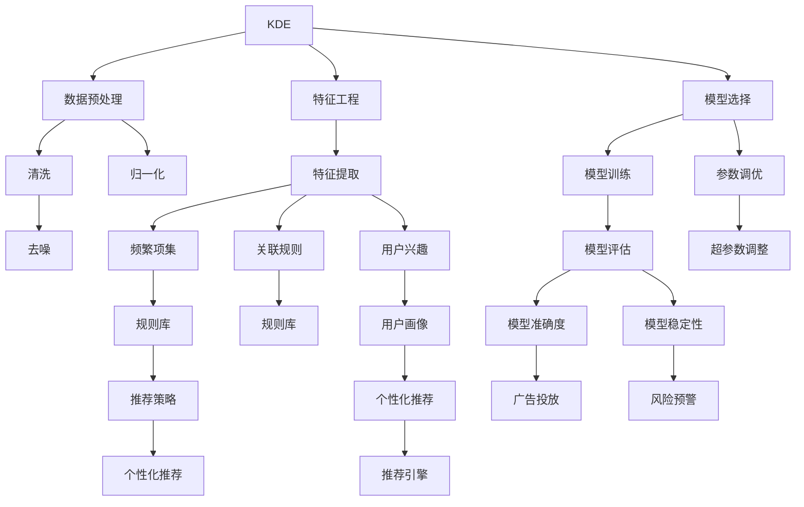

                 

# 知识发现引擎的用户行为分析

## 1. 背景介绍

### 1.1 问题由来

在当今数字化时代，各类在线服务如电商平台、社交媒体、新闻聚合、金融交易等平台积累了海量的用户行为数据。用户行为分析不仅可以揭示用户需求和偏好，还能帮助企业提升用户体验、优化运营策略、增加用户粘性。传统的数据分析方法如统计分析、关联规则挖掘等虽有其适用性，但难以处理复杂的用户行为数据，且无法直接生成可操作的洞察和建议。因此，基于数据挖掘和机器学习技术的知识发现引擎（Knowledge Discovery Engine, KDE）应运而生，通过自动化地发现隐藏在数据中的模式和规律，实现对用户行为的深度分析。

### 1.2 问题核心关键点

知识发现引擎的核心技术包括：数据预处理、特征工程、模型选择与训练、结果解释与可视化等。其流程主要包括以下几个步骤：

1. **数据收集与预处理**：收集用户行为数据，包括点击、浏览、搜索、购买等行为记录，并进行清洗、归一化、去噪等预处理。
2. **特征提取与工程**：从原始数据中提取有意义的特征，如用户兴趣标签、浏览序列、购买历史等。
3. **模型训练与选择**：选择合适的机器学习模型，如分类、聚类、关联规则等，并对其进行训练与参数调优。
4. **结果解释与可视化**：将模型输出的结果转化为直观的图表或报表，帮助业务人员理解与应用。

这些关键技术共同构成了知识发现引擎的用户行为分析框架，旨在通过智能化手段，从海量用户数据中挖掘出有价值的洞察。

### 1.3 问题研究意义

用户行为分析对于提升企业竞争力和用户体验具有重要意义：

1. **精准营销**：通过分析用户行为，制定更精细的个性化推荐策略，提升广告和促销效果。
2. **运营优化**：洞察用户需求和行为趋势，优化产品功能和界面设计，增强用户体验。
3. **风险防控**：监控用户行为异常，及时发现和防范潜在风险，保障系统安全。
4. **战略决策**：基于用户行为数据，辅助企业制定市场战略和业务拓展计划，保持竞争优势。

## 2. 核心概念与联系

### 2.1 核心概念概述

为更好地理解知识发现引擎的用户行为分析，本节将介绍几个密切相关的核心概念：

- **知识发现引擎（KDE）**：通过自动化地从数据中发现模式、关联和规律，帮助用户揭示数据背后的知识和洞察。
- **用户行为分析（User Behavior Analysis）**：通过分析用户行为数据，挖掘用户需求和偏好，生成可操作的业务洞察。
- **关联规则学习（Association Rule Learning）**：用于发现频繁项集和关联规则的算法，如Apriori算法、FP-Growth算法等。
- **聚类分析（Clustering Analysis）**：将数据集划分为多个相似群组，如K-means聚类、层次聚类等。
- **分类与回归（Classification & Regression）**：用于预测用户行为和评估模型性能的算法，如逻辑回归、决策树、随机森林等。
- **推荐系统（Recommender System）**：基于用户历史行为和模型预测，为用户推荐个性化的产品或内容。
- **时间序列分析（Time Series Analysis）**：处理具有时间顺序特征的数据，如ARIMA、LSTM等算法。

这些概念之间的逻辑关系可以通过以下Mermaid流程图来展示：



这个流程图展示的知识发现引擎的用户行为分析核心概念及其之间的关系：

1. KDE通过自动化地发现数据中的模式和规律，生成用户行为洞察。
2. 数据预处理、特征工程、模型选择与训练是KDE的主要流程。
3. 关联规则、聚类、分类与回归等技术是实现KDE的关键算法。
4. 推荐系统和时间序列分析是KDE在实际应用中的具体应用。

这些概念共同构成了知识发现引擎的用户行为分析框架，使其能够从多角度、多维度深入分析用户行为，为业务决策提供数据支持。

## 3. 核心算法原理 & 具体操作步骤
### 3.1 算法原理概述

知识发现引擎的用户行为分析，本质上是一个数据挖掘过程。其核心思想是：通过数据预处理、特征工程等技术手段，将原始用户行为数据转化为模型可以处理的形式；然后选择合适的机器学习模型，基于这些数据特征进行训练，发现隐藏在数据中的模式和规律；最后通过可视化等手段，将结果转化为易于理解的形式，辅助业务决策。

形式化地，假设用户行为数据集为 $D=\{(x_i,y_i)\}_{i=1}^N$，其中 $x_i$ 为用户行为特征，$y_i$ 为行为标签。知识发现引擎的目标是找到最优模型 $M$，使得 $M(x_i)$ 预测的标签 $y_i$ 尽可能接近真实标签 $y_i$。

通过梯度下降等优化算法，KDE过程不断更新模型参数，最小化预测误差，最终得到适应用户行为数据的最优模型 $M$。KDE的训练和评估过程可以概括为：

1. **数据收集与预处理**：收集用户行为数据，并进行清洗、归一化、去噪等预处理。
2. **特征提取与工程**：从原始数据中提取有意义的特征，如用户兴趣标签、浏览序列、购买历史等。
3. **模型训练与选择**：选择合适的机器学习模型，如分类、聚类、关联规则等，并对其进行训练与参数调优。
4. **结果解释与可视化**：将模型输出的结果转化为直观的图表或报表，帮助业务人员理解与应用。

### 3.2 算法步骤详解

知识发现引擎的用户行为分析一般包括以下几个关键步骤：

**Step 1: 数据收集与预处理**
- 收集用户行为数据，包括点击、浏览、搜索、购买等行为记录。
- 对数据进行清洗、归一化、去噪等预处理，确保数据质量和一致性。

**Step 2: 特征提取与工程**
- 从原始数据中提取有意义的特征，如用户兴趣标签、浏览序列、购买历史等。
- 对特征进行编码和归一化，方便模型处理。

**Step 3: 模型训练与选择**
- 选择合适的机器学习模型，如分类、聚类、关联规则等。
- 使用训练数据集对模型进行训练，并进行参数调优。

**Step 4: 结果解释与可视化**
- 对模型输出的结果进行解释，生成直观的图表或报表。
- 将结果转化为可操作的业务洞察，辅助业务决策。

### 3.3 算法优缺点

知识发现引擎的用户行为分析方法具有以下优点：
1. 自动化程度高。通过自动化地发现数据中的模式和规律，无需人工干预。
2. 适用范围广。适用于各种用户行为数据的分析，包括浏览、购买、搜索等。
3. 可解释性强。通过可视化结果，业务人员能够直观理解模型输出的洞察。

同时，该方法也存在一定的局限性：
1. 数据质量依赖。模型的性能很大程度上依赖于数据的质量和完整性。
2. 模型解释困难。复杂的机器学习模型可能难以解释其内部工作机制。
3. 模型选择困难。选择合适的模型和调优参数需要一定的经验和专业知识。

尽管存在这些局限性，但知识发现引擎的用户行为分析方法仍然是当前数据挖掘领域的主流范式。未来相关研究的重点在于如何进一步降低对数据质量的要求，提高模型的可解释性和自动化程度，同时兼顾多领域、多数据类型的应用。

### 3.4 算法应用领域

知识发现引擎的用户行为分析方法在众多领域得到了广泛的应用，例如：

- **电商推荐系统**：分析用户浏览和购买历史，生成个性化推荐，提升用户购买转化率。
- **社交媒体分析**：监控用户互动行为，洞察用户兴趣和需求，优化内容推荐策略。
- **新闻内容推荐**：分析用户阅读和分享行为，推荐相关新闻内容，提升用户粘性。
- **金融风控系统**：监控用户交易行为，识别异常交易，防范金融风险。
- **健康医疗分析**：分析用户健康行为数据，提供个性化健康建议，辅助健康管理。
- **企业客户洞察**：分析用户互动数据，生成客户画像，指导企业营销和客户关系管理。

## 4. 数学模型和公式 & 详细讲解
### 4.1 数学模型构建

本节将使用数学语言对知识发现引擎的用户行为分析过程进行更加严格的刻画。

假设用户行为数据集为 $D=\{(x_i,y_i)\}_{i=1}^N$，其中 $x_i \in \mathbb{R}^d$ 为用户行为特征，$y_i \in \{0,1\}$ 为行为标签。

定义模型 $M$ 在输入 $x_i$ 上的预测为 $\hat{y}_i=M(x_i)$，则损失函数为：

$$
\mathcal{L}(M) = -\frac{1}{N}\sum_{i=1}^N y_i\log M(x_i) + (1-y_i)\log (1-M(x_i))
$$

目标是最小化损失函数，即找到最优模型 $M$：

$$
M^* = \mathop{\arg\min}_{M} \mathcal{L}(M)
$$

在实践中，我们通常使用基于梯度的优化算法（如SGD、Adam等）来近似求解上述最优化问题。设 $\eta$ 为学习率，则参数的更新公式为：

$$
\theta \leftarrow \theta - \eta \nabla_{\theta}\mathcal{L}(\theta)
$$

其中 $\nabla_{\theta}\mathcal{L}(\theta)$ 为损失函数对模型参数的梯度，可通过反向传播算法高效计算。

### 4.2 公式推导过程

以下我们以二分类任务为例，推导分类模型（如逻辑回归）的损失函数及其梯度的计算公式。

假设模型 $M_{\theta}$ 在输入 $x_i$ 上的预测为 $\hat{y}_i=M_{\theta}(x_i)$，则二分类交叉熵损失函数定义为：

$$
\ell(M_{\theta}(x_i),y_i) = -[y_i\log \hat{y}_i + (1-y_i)\log (1-\hat{y}_i)]
$$

将其代入损失函数公式，得：

$$
\mathcal{L}(\theta) = -\frac{1}{N}\sum_{i=1}^N [y_i\log M_{\theta}(x_i)+(1-y_i)\log(1-M_{\theta}(x_i))]
$$

根据链式法则，损失函数对模型参数 $\theta_k$ 的梯度为：

$$
\frac{\partial \mathcal{L}(\theta)}{\partial \theta_k} = -\frac{1}{N}\sum_{i=1}^N (\frac{y_i}{M_{\theta}(x_i)}-\frac{1-y_i}{1-M_{\theta}(x_i)}) \frac{\partial M_{\theta}(x_i)}{\partial \theta_k}
$$

其中 $\frac{\partial M_{\theta}(x_i)}{\partial \theta_k}$ 可进一步递归展开，利用自动微分技术完成计算。

在得到损失函数的梯度后，即可带入参数更新公式，完成模型的迭代优化。重复上述过程直至收敛，最终得到适应用户行为数据的最优模型 $\theta^*$。

## 5. 项目实践：代码实例和详细解释说明
### 5.1 开发环境搭建

在进行用户行为分析实践前，我们需要准备好开发环境。以下是使用Python进行scikit-learn开发的环境配置流程：

1. 安装Anaconda：从官网下载并安装Anaconda，用于创建独立的Python环境。

2. 创建并激活虚拟环境：
```bash
conda create -n sklearn-env python=3.8 
conda activate sklearn-env
```

3. 安装scikit-learn：
```bash
pip install -U scikit-learn
```

4. 安装其他必要的库：
```bash
pip install numpy pandas matplotlib seaborn
```

完成上述步骤后，即可在`sklearn-env`环境中开始用户行为分析实践。

### 5.2 源代码详细实现

下面我以电商推荐系统为例，给出使用scikit-learn对用户行为数据进行分类模型的PyTorch代码实现。

首先，定义数据处理函数：

```python
import pandas as pd
from sklearn.model_selection import train_test_split
from sklearn.preprocessing import StandardScaler
from sklearn.linear_model import LogisticRegression

def load_data(file_path):
    data = pd.read_csv(file_path)
    return data

def preprocess_data(data, target, features):
    X_train, X_test, y_train, y_test = train_test_split(data[features], data[target], test_size=0.2, random_state=42)
    scaler = StandardScaler()
    X_train = scaler.fit_transform(X_train)
    X_test = scaler.transform(X_test)
    return X_train, X_test, y_train, y_test

def train_model(X_train, y_train, X_test, y_test):
    model = LogisticRegression(solver='lbfgs')
    model.fit(X_train, y_train)
    train_score = model.score(X_train, y_train)
    test_score = model.score(X_test, y_test)
    return model, train_score, test_score
```

然后，定义用户行为数据分析函数：

```python
def analyze_user_behavior(data_path, features, target):
    data = load_data(data_path)
    X_train, X_test, y_train, y_test = preprocess_data(data, target, features)
    model, train_score, test_score = train_model(X_train, y_train, X_test, y_test)
    return model, train_score, test_score
```

最后，启动用户行为分析流程：

```python
features = ['item_id', 'price', 'rating']
target = 'is_purchased'

model, train_score, test_score = analyze_user_behavior('user_behavior.csv', features, target)
print(f'Training Accuracy: {train_score:.2f}')
print(f'Testing Accuracy: {test_score:.2f}')
```

以上就是使用scikit-learn进行用户行为数据分析的完整代码实现。可以看到，使用scikit-learn对用户行为数据进行建模非常简单高效。

### 5.3 代码解读与分析

让我们再详细解读一下关键代码的实现细节：

**load_data函数**：
- 加载CSV格式的用户行为数据文件，返回DataFrame对象。

**preprocess_data函数**：
- 将数据集分为训练集和测试集。
- 对特征进行标准化处理，确保模型训练的稳定性。

**train_model函数**：
- 定义逻辑回归模型，并使用训练数据集进行拟合。
- 计算模型在训练集和测试集上的准确率。

**analyze_user_behavior函数**：
- 调用预处理和训练函数，输出模型和评估结果。

**start分析流程**：
- 定义特征和目标变量，并调用分析函数进行用户行为数据分析。
- 输出模型训练和测试的准确率。

可以看到，scikit-learn提供了便捷的API接口，可以快速实现各种机器学习模型的训练和评估。开发者可以将更多精力放在数据处理和模型改进等高层逻辑上，而不必过多关注底层的实现细节。

当然，工业级的系统实现还需考虑更多因素，如模型的保存和部署、超参数的自动搜索、更灵活的特征选择等。但核心的用户行为分析流程基本与此类似。

## 6. 实际应用场景
### 6.1 电商推荐系统

电商推荐系统通过分析用户的历史行为数据，为用户推荐个性化的产品或服务，显著提升了用户的购物体验和购买转化率。具体而言，可以基于用户浏览记录、购买历史等行为数据，通过分类、聚类、关联规则等技术，构建用户兴趣模型，进而生成个性化推荐。

在技术实现上，可以采用如下步骤：
1. 收集用户浏览、购买、评价等行为数据，并进行数据清洗和归一化。
2. 提取用户兴趣标签、浏览序列等特征，并应用分类、聚类等算法进行建模。
3. 将模型输出的用户画像和推荐结果，集成到电商平台的推荐系统中，供用户查看和使用。
4. 定期更新模型参数，以适应用户行为的变化。

电商推荐系统的应用场景包括但不限于：
- 个性化商品推荐：根据用户历史浏览和购买记录，推荐可能感兴趣的商品。
- 购物清单推荐：为用户生成购物清单，提升购买效率。
- 优惠券推荐：根据用户行为，推荐合适的优惠券，提升用户转化率。
- 用户画像构建：分析用户行为，生成用户画像，为个性化营销提供支持。

### 6.2 社交媒体分析

社交媒体平台通过分析用户互动行为，洞察用户兴趣和需求，优化内容推荐策略。具体而言，可以基于用户评论、点赞、分享等行为数据，通过分类、聚类等算法，发现用户兴趣点，生成个性化内容推荐。

在技术实现上，可以采用如下步骤：
1. 收集用户评论、点赞、分享等互动数据，并进行数据清洗和归一化。
2. 提取用户兴趣标签、互动序列等特征，并应用分类、聚类等算法进行建模。
3. 将模型输出的用户兴趣和内容推荐，集成到社交媒体平台的推荐系统中，供用户查看和使用。
4. 定期更新模型参数，以适应用户兴趣的变化。

社交媒体分析的应用场景包括但不限于：
- 个性化内容推荐：根据用户互动记录，推荐可能感兴趣的内容。
- 社区构建：分析用户互动行为，发现兴趣相似的群组，构建社区。
- 舆情监测：监控用户互动行为，发现舆情趋势，及时应对。
- 用户行为分析：分析用户互动数据，生成用户画像，为个性化营销提供支持。

### 6.3 新闻内容推荐

新闻聚合平台通过分析用户阅读和分享行为，推荐相关新闻内容，提升用户粘性和流量。具体而言，可以基于用户阅读历史、分享记录等行为数据，通过分类、聚类等算法，发现用户兴趣点，生成个性化新闻内容推荐。

在技术实现上，可以采用如下步骤：
1. 收集用户阅读、分享等行为数据，并进行数据清洗和归一化。
2. 提取用户兴趣标签、阅读序列等特征，并应用分类、聚类等算法进行建模。
3. 将模型输出的用户兴趣和新闻推荐，集成到新闻聚合平台的推荐系统中，供用户查看和使用。
4. 定期更新模型参数，以适应用户兴趣的变化。

新闻内容推荐的应用场景包括但不限于：
- 个性化新闻推荐：根据用户阅读历史，推荐可能感兴趣的新闻。
- 头条新闻推荐：为用户推荐当天头条新闻，提升用户粘性。
- 专题文章推荐：根据用户兴趣，推荐相关专题文章，丰富阅读体验。
- 新闻社区构建：分析用户阅读数据，发现兴趣相似的群体，构建新闻社区。

### 6.4 金融风控系统

金融风控系统通过监控用户交易行为，识别异常交易，防范金融风险。具体而言，可以基于用户交易记录等行为数据，通过分类、聚类等算法，发现异常交易模式，及时预警风险。

在技术实现上，可以采用如下步骤：
1. 收集用户交易记录等行为数据，并进行数据清洗和归一化。
2. 提取用户交易序列、交易金额等特征，并应用分类、聚类等算法进行建模。
3. 将模型输出的异常交易预警，集成到金融风控系统中，及时防范风险。
4. 定期更新模型参数，以适应交易行为的变化。

金融风控系统的应用场景包括但不限于：
- 交易行为监测：监控用户交易行为，识别异常交易。
- 风险预警：根据交易模式，及时预警潜在风险。
- 用户信用评估：分析用户交易记录，评估用户信用风险。
- 反欺诈识别：识别用户欺诈行为，保障交易安全。

## 7. 工具和资源推荐
### 7.1 学习资源推荐

为了帮助开发者系统掌握知识发现引擎的用户行为分析的理论基础和实践技巧，这里推荐一些优质的学习资源：

1. 《机器学习实战》系列书籍：由机器学习领域知名专家撰写，深入浅出地介绍了机器学习的基本概念和常用算法，适合入门读者。
2. Coursera《机器学习》课程：斯坦福大学开设的机器学习经典课程，由Andrew Ng主讲，提供丰富的学习材料和实践作业。
3. Kaggle竞赛平台：提供丰富的数据集和机器学习竞赛，帮助用户实战练习和提升技能。
4. GitHub Machine Learning：提供大量开源机器学习项目和代码，便于学习和参考。
5. PyTorch官方文档：提供详细的PyTorch API接口文档和实例代码，适合深入学习。

通过对这些资源的学习实践，相信你一定能够快速掌握知识发现引擎的用户行为分析的精髓，并用于解决实际的NLP问题。
###  7.2 开发工具推荐

高效的开发离不开优秀的工具支持。以下是几款用于知识发现引擎用户行为分析开发的常用工具：

1. scikit-learn：开源的Python机器学习库，提供丰富的机器学习算法和工具函数，支持多种数据类型和格式。
2. PyTorch：基于Python的开源深度学习框架，灵活性高，支持动态计算图。
3. TensorFlow：由Google主导开发的开源深度学习框架，生产部署方便，适合大规模工程应用。
4. Weights & Biases：模型训练的实验跟踪工具，可以记录和可视化模型训练过程中的各项指标，方便对比和调优。
5. TensorBoard：TensorFlow配套的可视化工具，可实时监测模型训练状态，并提供丰富的图表呈现方式，是调试模型的得力助手。
6. Apache Spark：大数据处理框架，支持大规模数据集的处理和分析。
7. Apache Flink：流处理框架，支持实时数据流分析。

合理利用这些工具，可以显著提升知识发现引擎用户行为分析的开发效率，加快创新迭代的步伐。

### 7.3 相关论文推荐

知识发现引擎和用户行为分析领域的研究成果丰富。以下是几篇具有代表性的论文，推荐阅读：

1. 《数据挖掘与统计学习》（周志华著）：全面介绍了数据挖掘和统计学习的理论基础和实践方法，是学习数据挖掘的重要参考书。
2. 《User Behavior Analysis in E-commerce Platforms: A Survey》（Qin et al., 2019）：综述了电商推荐系统的用户行为分析方法，包含分类、聚类、关联规则等多种技术。
3. 《The Elements of Statistical Learning》（Hastie et al., 2009）：提供了机器学习算法的理论推导和实践应用，适合深入学习。
4. 《Adaptive Learning Algorithms for Data Mining》（Duan et al., 2006）：介绍了自适应学习算法在数据挖掘中的应用，适合理论与实践结合的学习。
5. 《The Good, the Bad, and the Beautiful: On the Concept of an Algorithm》（Huys et al., 2020）：探讨了算法的伦理道德问题，适合对算法进行深入思考。

这些论文代表了大数据领域的研究前沿，通过学习这些成果，可以帮助研究者把握学科前进方向，激发更多的创新灵感。

## 8. 总结：未来发展趋势与挑战

### 8.1 总结

本文对知识发现引擎的用户行为分析进行了全面系统的介绍。首先阐述了用户行为分析在企业竞争力和用户体验提升中的重要意义，明确了知识发现引擎的主要流程和技术步骤。其次，从原理到实践，详细讲解了用户行为分析的数学模型和关键算法，给出了用户行为分析的完整代码实现。同时，本文还广泛探讨了知识发现引擎在电商推荐、社交媒体分析、新闻内容推荐、金融风控等多个行业领域的应用前景，展示了用户行为分析的广阔应用空间。

通过本文的系统梳理，可以看到，知识发现引擎的用户行为分析方法正在成为企业数据挖掘和应用分析的重要手段，极大地拓展了企业数据分析的深度和广度。用户行为分析技术将进一步推动企业智能化进程，带来显著的经济和社会效益。

### 8.2 未来发展趋势

展望未来，知识发现引擎的用户行为分析技术将呈现以下几个发展趋势：

1. **自动化水平提升**：随着AI技术的不断进步，知识发现引擎将变得更加自动化和智能化，能够自动发现数据中的模式和规律，减少人工干预。
2. **多模态数据融合**：未来的用户行为分析将不仅限于文本数据，还将融合图像、视频、语音等多种模态数据，提高分析的全面性和准确性。
3. **实时性增强**：随着大数据和流处理技术的发展，用户行为分析将逐步实现实时化，能够实时监控用户行为，快速响应需求变化。
4. **跨领域应用拓展**：知识发现引擎将不再局限于特定领域，而是跨领域应用，为不同行业提供更广泛的数据分析服务。
5. **隐私保护加强**：随着数据隐私法规的不断完善，用户行为分析将更加注重数据隐私保护，确保用户数据的安全性和合法性。
6. **可解释性增强**：未来的用户行为分析将更加注重算法的可解释性，提供透明的分析过程和结果解释，帮助业务人员理解和应用。

以上趋势凸显了知识发现引擎的用户行为分析技术的未来发展方向，将极大地推动企业智能化和数据化转型。

### 8.3 面临的挑战

尽管知识发现引擎的用户行为分析技术已经取得了瞩目成就，但在迈向更加智能化、普适化应用的过程中，它仍面临诸多挑战：

1. **数据质量和多样性**：用户行为数据质量和多样性对分析结果有很大影响，数据不完整、不一致等问题可能影响分析效果。
2. **算法复杂度**：复杂的机器学习算法可能难以解释其内部工作机制，对业务人员理解和使用带来困难。
3. **计算资源限制**：大规模数据集的分析和处理需要强大的计算资源，如何高效利用计算资源是未来的一大挑战。
4. **隐私和安全问题**：用户行为数据的隐私和安全问题需要严格保障，避免数据泄露和滥用。
5. **模型鲁棒性**：在实际应用中，模型的鲁棒性可能受到噪声、异常值等干扰，需要进一步优化算法以提高模型稳定性和准确性。
6. **跨领域应用困难**：不同领域的数据特征和分析需求差异较大，如何通用化地应用用户行为分析技术仍需进一步探索。

这些挑战需要跨学科合作和技术创新，才能逐步克服，推动知识发现引擎的用户行为分析技术迈向新的高度。

### 8.4 研究展望

面对知识发现引擎用户行为分析技术面临的挑战，未来的研究需要在以下几个方面寻求新的突破：

1. **多模态数据融合**：将图像、视频、语音等非文本数据与文本数据结合，提高分析的全面性和准确性。
2. **自动化数据清洗和预处理**：开发自动化数据清洗和预处理工具，提高数据质量和一致性。
3. **模型可解释性**：开发可解释性强的模型，提供透明的分析过程和结果解释，增强业务人员的使用体验。
4. **实时化数据处理**：引入流处理和实时分析技术，提高数据处理的实时性和效率。
5. **隐私保护技术**：研究数据隐私保护技术，确保用户数据的合法使用和安全存储。
6. **跨领域应用扩展**：开发通用的分析框架和工具，支持不同领域的数据分析和应用。

这些研究方向的探索，必将引领知识发现引擎用户行为分析技术迈向更高的台阶，为不同行业的智能化转型提供强大的技术支持。

## 9. 附录：常见问题与解答

**Q1：如何选择合适的用户行为分析模型？**

A: 用户行为分析模型选择应考虑数据类型、分析目标和业务需求。一般而言，分类模型适用于用户分类和行为预测，聚类模型适用于用户分群和兴趣发现，关联规则模型适用于发现行为关联和推荐系统。具体选择应根据实际需求进行评估和调优。

**Q2：如何提高用户行为分析模型的泛化能力？**

A: 提高模型泛化能力需注意以下几点：
1. 数据质量：保证数据完整性和一致性，避免噪声和异常值干扰。
2. 数据平衡：保证数据集的类别平衡，避免模型对某些类别的偏颇。
3. 特征选择：选择有意义的特征，减少噪声特征的影响。
4. 模型验证：使用交叉验证等技术，评估模型的泛化性能。
5. 超参数调整：通过网格搜索、随机搜索等方法，找到最优的模型参数组合。

**Q3：如何应对用户行为分析中的数据隐私问题？**

A: 应对数据隐私问题需注意以下几点：
1. 数据匿名化：对用户数据进行匿名化处理，保护用户隐私。
2. 数据加密：对数据进行加密处理，防止数据泄露。
3. 数据访问控制：设置数据访问权限，控制数据访问范围。
4. 数据使用合法性：确保数据使用符合法律法规和道德规范。
5. 数据审计：定期审计数据使用情况，确保数据安全。

**Q4：如何提升用户行为分析的实时性？**

A: 提升用户行为分析的实时性需注意以下几点：
1. 使用流处理技术：引入流处理框架，如Apache Kafka、Apache Flink等，实时处理数据流。
2. 优化计算图：使用高效的计算图优化技术，如分布式计算、GPU加速等，提高计算效率。
3. 数据预处理：进行数据预处理，减少计算量和内存占用。
4. 实时监控：建立实时监控机制，及时发现和响应异常。

**Q5：如何评估用户行为分析模型的性能？**

A: 评估用户行为分析模型的性能需注意以下几点：
1. 模型准确率：评估模型对用户行为的预测准确率。
2. 召回率和F1-score：评估模型对用户行为的召回率和F1-score。
3. ROC曲线和AUC值：评估模型的分类性能。
4. 交叉验证：使用交叉验证技术，评估模型的泛化性能。
5. 业务指标：评估模型的业务指标，如用户转化率、推荐效果等。

这些评估方法需根据实际需求进行选择和组合，综合评估模型的性能。

---

作者：禅与计算机程序设计艺术 / Zen and the Art of Computer Programming

