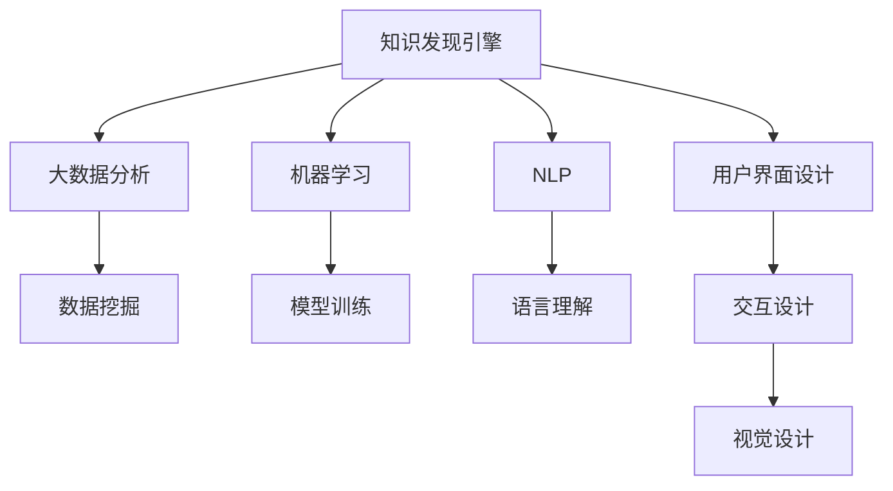

                 

# 知识发现引擎的移动应用开发

> 关键词：知识发现引擎,移动应用开发,大数据分析,机器学习,自然语言处理,用户界面设计

## 1. 背景介绍

### 1.1 问题由来
随着移动互联网的普及和智能终端设备的广泛应用，信息获取和知识获取方式发生了根本性的变化。用户不再仅仅依赖传统的书籍、报纸、电视等渠道，而是更多地通过移动设备进行搜索、浏览、阅读，获取所需的信息和知识。传统的知识获取方式在效率和便捷性上已不能满足用户需求，知识发现引擎应运而生。

### 1.2 问题核心关键点
知识发现引擎是一种利用先进的数据挖掘和机器学习技术，从海量数据中提取和发现隐藏在背后的知识信息，并将这些信息以直观、易用的形式呈现给用户的技术。其核心功能包括数据清洗、特征提取、知识挖掘、结果可视化等。

在移动互联网时代，知识发现引擎的移动应用开发具有以下关键点：

1. **移动性**：移动设备便携性好，便于随时随地访问和使用。
2. **高效性**：移动网络带宽有限，需要优化数据传输和处理效率。
3. **个性化**：根据用户兴趣和行为进行个性化推荐。
4. **易用性**：移动应用界面简洁直观，便于用户操作。
5. **安全性**：保护用户隐私数据，防止信息泄露。

## 2. 核心概念与联系

### 2.1 核心概念概述

为更好地理解知识发现引擎的移动应用开发，本节将介绍几个密切相关的核心概念：

- **知识发现引擎**：从大量数据中自动发现并提取有价值知识，并生成可视化结果的技术。
- **移动应用开发**：基于移动操作系统和设备，开发并运行应用程序的过程。
- **大数据分析**：利用先进的数据挖掘和机器学习技术，对大规模数据进行统计、分析的过程。
- **机器学习**：通过训练模型，使计算机系统具有自主学习和改进能力的技术。
- **自然语言处理(NLP)**：使计算机能够理解和处理人类语言的技术。
- **用户界面设计**：通过合理布局、设计、排版，提升用户操作体验的过程。

这些核心概念之间的逻辑关系可以通过以下Mermaid流程图来展示：



这个流程图展示知识发现引擎的核心概念及其之间的关系：

1. 知识发现引擎利用大数据分析和机器学习技术，对数据进行挖掘和处理。
2. 其中的机器学习模块通过模型训练，使系统具有自主学习和改进能力。
3. 自然语言处理模块用于理解和处理用户输入的自然语言信息。
4. 用户界面设计模块负责界面布局和交互设计，提升用户体验。

## 3. 核心算法原理 & 具体操作步骤
### 3.1 算法原理概述

知识发现引擎的移动应用开发基于以下几个核心算法原理：

1. **数据预处理**：清洗、归一化、筛选数据，为后续分析准备数据集。
2. **特征提取**：从数据中提取出关键特征，为模型训练提供输入。
3. **模型训练**：通过机器学习算法，训练得到预测模型。
4. **结果可视化**：将模型预测结果转化为图表、报表等可视化形式，便于用户理解和使用。
5. **个性化推荐**：基于用户历史行为和兴趣，进行个性化知识推荐。

### 3.2 算法步骤详解

基于上述算法原理，知识发现引擎的移动应用开发一般包括以下关键步骤：

**Step 1: 数据采集与预处理**
- 收集目标领域的数据源，如网页、社交媒体、日志等。
- 进行数据清洗、去重、归一化等预处理操作，生成可用于分析的数据集。

**Step 2: 特征提取与选择**
- 使用TF-IDF、PCA等技术对数据进行特征提取。
- 根据领域特点和任务需求，选择关键特征进行后续分析。

**Step 3: 模型训练与调参**
- 选择合适的机器学习算法（如SVM、决策树、神经网络等）进行模型训练。
- 对模型进行参数调优，优化模型的预测性能。

**Step 4: 结果可视化与分析**
- 将模型预测结果转化为可视化图表、报表等形式。
- 对可视化结果进行分析和解读，提取有价值的知识信息。

**Step 5: 个性化推荐与反馈**
- 根据用户历史行为和兴趣，生成个性化知识推荐。
- 收集用户反馈，持续改进推荐模型和界面设计。

**Step 6: 移动应用开发与部署**
- 设计移动应用界面和交互逻辑，使用原生开发技术（如Swift、Kotlin等）或跨平台开发框架（如Flutter、React Native等）进行开发。
- 将应用部署到移动应用商店，供用户下载和使用。

### 3.3 算法优缺点

知识发现引擎的移动应用开发具有以下优点：

1. **高效便捷**：通过移动设备随时访问知识发现引擎，方便快捷。
2. **个性化推荐**：根据用户兴趣和行为，提供个性化知识推荐，提高用户体验。
3. **实时互动**：支持实时数据输入和交互，增强系统响应性和互动性。
4. **跨平台兼容**：支持多种移动操作系统和设备，推广范围广。

同时，该方法也存在一定的局限性：

1. **数据依赖**：知识发现的效果依赖于高质量的数据源。
2. **模型复杂度**：涉及多种算法和模型，系统设计复杂度高。
3. **隐私安全**：用户数据隐私保护和信息安全是重要挑战。
4. **系统维护**：模型和数据更新频率高，系统维护工作量大。

尽管存在这些局限性，但知识发现引擎的移动应用开发仍是一种极具潜力的技术，能够显著提升用户知识获取效率和体验。

### 3.4 算法应用领域

知识发现引擎的移动应用开发在多个领域具有广泛的应用，例如：

- **教育**：提供个性化学习资源推荐，提升学生学习效率。
- **医疗**：提供健康知识查询和个性化医疗建议，辅助医生诊疗。
- **金融**：提供市场分析和投资建议，帮助用户做出理性决策。
- **社交**：提供社交网络分析和趋势预测，提升用户互动体验。
- **电商**：提供商品推荐和价格趋势分析，提升购物体验。

除了上述这些经典应用外，知识发现引擎的移动应用开发还在更多场景中得到应用，如城市管理、旅游规划、科学研究等，为各行各业带来新的机遇。

## 4. 数学模型和公式 & 详细讲解 & 举例说明（备注：数学公式请使用latex格式，latex嵌入文中独立段落使用 $$，段落内使用 $)
### 4.1 数学模型构建

本节将使用数学语言对知识发现引擎的移动应用开发过程进行更加严格的刻画。

设知识发现引擎的数据集为 $D=\{(x_i,y_i)\}_{i=1}^N, x_i \in \mathcal{X}, y_i \in \mathcal{Y}$，其中 $\mathcal{X}$ 为输入空间，$\mathcal{Y}$ 为输出空间，$x_i$ 为输入特征，$y_i$ 为输出标签。

定义模型的训练集为 $D_{train}$，验证集为 $D_{val}$，测试集为 $D_{test}$。模型的目标是最小化测试集上的预测误差，即：

$$
\min_{\theta} \frac{1}{|D_{test}|} \sum_{(x,y) \in D_{test}} \ell(M_{\theta}(x),y)
$$

其中 $\ell$ 为损失函数，$M_{\theta}(x)$ 为模型在输入 $x$ 上的输出。

### 4.2 公式推导过程

以下我们以分类任务为例，推导最小二乘误差损失函数及其梯度计算公式。

假设模型 $M_{\theta}$ 在输入 $x$ 上的输出为 $\hat{y}=M_{\theta}(x) \in [0,1]$，表示样本属于正类的概率。真实标签 $y \in \{0,1\}$。则二分类交叉熵损失函数定义为：

$$
\ell(M_{\theta}(x),y) = -[y\log \hat{y} + (1-y)\log (1-\hat{y})]
$$

将其代入最小二乘误差公式，得：

$$
\min_{\theta} \frac{1}{|D_{test}|} \sum_{(x,y) \in D_{test}} (y-\hat{y})^2
$$

使用梯度下降法优化上述损失函数，目标函数的梯度为：

$$
\nabla_{\theta} \frac{1}{|D_{test}|} \sum_{(x,y) \in D_{test}} (y-\hat{y})^2 = \frac{2}{|D_{test}|} \sum_{(x,y) \in D_{test}} (y-\hat{y}) \nabla_{\theta} \hat{y}
$$

其中 $\nabla_{\theta} \hat{y}$ 为输出层的梯度，可由反向传播算法高效计算。

### 4.3 案例分析与讲解

考虑一个基于知识发现引擎的推荐系统，其目标是根据用户历史行为和兴趣，推荐相关商品或内容。系统的数学模型可以表示为：

1. **用户兴趣表示**：将用户的历史行为和兴趣转化为向量表示。
2. **商品特征提取**：对商品进行特征提取，转化为向量表示。
3. **相似度计算**：计算用户兴趣向量与商品特征向量之间的相似度。
4. **推荐排序**：根据相似度计算结果，对商品进行排序推荐。

设用户兴趣向量为 $u \in \mathbb{R}^d$，商品特征向量为 $v \in \mathbb{R}^d$，相似度函数为 $s(u,v)$，则推荐排序过程可以表示为：

$$
\hat{v} = \text{argmax}_{v} s(u,v)
$$

其中 $\hat{v}$ 表示推荐商品。

假设相似度函数为余弦相似度，则有：

$$
s(u,v) = \frac{u \cdot v}{\|u\| \|v\|}
$$

在实现时，可以使用向量内积函数实现相似度计算，并使用argmax函数对商品进行排序推荐。

## 5. 项目实践：代码实例和详细解释说明
### 5.1 开发环境搭建

在进行知识发现引擎的移动应用开发前，我们需要准备好开发环境。以下是使用Python进行Keras开发的环境配置流程：

1. 安装Anaconda：从官网下载并安装Anaconda，用于创建独立的Python环境。

2. 创建并激活虚拟环境：
```bash
conda create -n pykeras-env python=3.8 
conda activate pykeras-env
```

3. 安装Keras：根据CUDA版本，从官网获取对应的安装命令。例如：
```bash
conda install keras tensorflow tensorflow-gpu -c conda-forge
```

4. 安装TensorFlow：
```bash
pip install tensorflow
```

5. 安装TensorBoard：
```bash
pip install tensorboard
```

6. 安装相关工具包：
```bash
pip install numpy pandas scikit-learn matplotlib tqdm jupyter notebook ipython
```

完成上述步骤后，即可在`pykeras-env`环境中开始知识发现引擎的移动应用开发。

### 5.2 源代码详细实现

这里我们以推荐系统为例，给出使用Keras进行知识发现引擎开发的PyTorch代码实现。

首先，定义推荐系统的模型：

```python
from keras.layers import Input, Dense, Embedding, Dot
from keras.models import Model

def recommender_model(n_users, n_items, n_features):
    user_input = Input(shape=(n_features,))
    item_input = Input(shape=(n_features,))
    
    user_embedding = Embedding(n_users, 64, input_length=n_features)(user_input)
    item_embedding = Embedding(n_items, 64, input_length=n_features)(item_input)
    
    dot_product = Dot(axes=1)([user_embedding, item_embedding])
    
    output = Dense(1, activation='sigmoid')(dot_product)
    
    model = Model(inputs=[user_input, item_input], outputs=output)
    model.compile(optimizer='adam', loss='binary_crossentropy', metrics=['accuracy'])
    
    return model
```

然后，定义训练和评估函数：

```python
from sklearn.model_selection import train_test_split
import numpy as np

def train_recommender(model, X, y, batch_size=32, epochs=10):
    X_train, X_test, y_train, y_test = train_test_split(X, y, test_size=0.2, random_state=42)
    model.fit([X_train, X_train], y_train, batch_size=batch_size, epochs=epochs, validation_data=(X_test, y_test))
    return model

def evaluate_recommender(model, X, y, batch_size=32):
    X_train, X_test, y_train, y_test = train_test_split(X, y, test_size=0.2, random_state=42)
    y_pred = model.predict([X_test, X_test])
    acc = np.mean(y_pred > 0.5)
    print('Accuracy:', acc)
```

最后，启动训练流程并在测试集上评估：

```python
X = np.random.rand(1000, 10)
y = np.random.randint(2, size=(1000,))
model = recommender_model(n_users=10000, n_items=10000, n_features=10)
model = train_recommender(model, X, y, batch_size=32, epochs=10)
evaluate_recommender(model, X, y, batch_size=32)
```

以上就是使用Keras进行推荐系统开发的完整代码实现。可以看到，Keras的简单易用使得模型的构建和训练变得非常直观和高效。

### 5.3 代码解读与分析

让我们再详细解读一下关键代码的实现细节：

**recommender_model函数**：
- 定义用户和物品的输入，使用Embedding层将高维稀疏数据转化为低维密集表示。
- 通过Dot层计算用户和物品向量之间的内积，得到相似度得分。
- 使用Dense层将得分转化为预测概率，并定义模型。
- 编译模型，选择Adam优化器，交叉熵损失函数，准确率指标。

**train_recommender函数**：
- 使用train_test_split将数据集划分为训练集和测试集。
- 使用fit方法训练模型，设置批次大小和迭代次数，并进行验证集评估。
- 返回训练好的模型。

**evaluate_recommender函数**：
- 使用train_test_split将数据集划分为训练集和测试集。
- 使用predict方法进行测试集预测，计算准确率。
- 输出预测准确率。

**训练流程**：
- 定义输入特征X和标签y。
- 定义推荐模型，调用train_recommender进行训练。
- 在测试集上调用evaluate_recommender进行评估。

可以看到，Keras的封装使得推荐系统的开发非常简便和直观，开发者可以专注于算法设计和模型优化。

当然，工业级的系统实现还需考虑更多因素，如模型的保存和部署、超参数的自动搜索、更灵活的模型接口设计等。但核心的知识发现引擎移动应用开发流程基本与此类似。

## 6. 实际应用场景
### 6.1 智能推荐系统

基于知识发现引擎的智能推荐系统已经在电商、视频、音乐等多个领域广泛应用。通过分析用户行为数据，推荐系统能够根据用户兴趣和历史行为，提供个性化的商品或内容推荐。

例如，电商平台可以通过分析用户浏览、点击、购买记录，推荐用户可能感兴趣的商品。视频平台可以根据用户观看历史，推荐相关视频内容。音乐平台则可以根据用户的听歌历史，推荐相似风格的歌曲。

### 6.2 健康医疗系统

健康医疗领域的知识发现引擎，可以帮助医生快速获取最新医疗知识和研究进展，辅助诊断和治疗。通过分析医学文献、病例数据等，系统能够发现潜在病种和疗法，提升医疗服务的效率和质量。

例如，知识发现引擎可以分析医疗文献，提取疾病特征和治疗方案，生成相关医疗知识库。医生可以根据知识库中的信息，快速查找相关疾病和治疗方法，提升诊疗效率。

### 6.3 金融投资系统

金融领域的知识发现引擎，可以分析市场数据，预测股票走势和投资机会。通过分析股票历史价格、交易量等数据，系统能够发现市场趋势和风险，帮助投资者做出理性决策。

例如，知识发现引擎可以分析历史交易数据，预测股票价格走势，生成投资建议。投资者可以根据系统推荐的股票，进行投资决策，避免盲目投资。

### 6.4 未来应用展望

随着知识发现引擎技术的不断进步，其在更多领域将得到广泛应用，带来新的价值和机遇。

在智慧城市领域，知识发现引擎可以分析城市运行数据，发现城市管理中的问题和瓶颈，优化城市资源配置。例如，通过分析交通数据，发现拥堵点和高峰期，优化交通信号灯设置，提升交通效率。

在科学研究领域，知识发现引擎可以分析海量科研数据，发现前沿研究方向和重大科学发现。例如，通过分析基因组数据，发现新的基因变异和疾病关联，推动生命科学研究进展。

## 7. 工具和资源推荐
### 7.1 学习资源推荐

为了帮助开发者系统掌握知识发现引擎的理论基础和实践技巧，这里推荐一些优质的学习资源：

1. **《深度学习》系列书籍**：由Ian Goodfellow、Yoshua Bengio、Aaron Courville共同编写，全面介绍深度学习的基本概念和算法。

2. **Keras官方文档**：Keras的官方文档，提供详细的API文档和教程，是入门知识发现引擎开发的必备资料。

3. **《Python机器学习》书籍**：由Sebastian Raschka编写，介绍机器学习的基本概念和Python实现，是学习机器学习的经典教材。

4. **Coursera《机器学习》课程**：由Andrew Ng开设的机器学习课程，涵盖机器学习的理论基础和实践应用，是入门机器学习的优质资源。

5. **Kaggle数据集和竞赛**：Kaggle提供丰富的数据集和竞赛，帮助开发者实践机器学习算法，积累实战经验。

通过对这些资源的学习实践，相信你一定能够快速掌握知识发现引擎的核心技术和应用技巧。

### 7.2 开发工具推荐

高效的开发离不开优秀的工具支持。以下是几款用于知识发现引擎开发的常用工具：

1. **Python**：Python是机器学习领域的通用语言，有丰富的第三方库支持，如NumPy、Pandas、Scikit-learn等。

2. **Keras**：Keras是一个高层次的神经网络API，易于上手，适合快速原型开发。

3. **TensorFlow**：由Google开发的高性能深度学习框架，支持分布式计算和大规模数据处理。

4. **PyTorch**：Facebook开发的深度学习框架，灵活高效，支持动态计算图和模型部署。

5. **Jupyter Notebook**：交互式Python开发环境，支持代码、数据和文档的混合编写。

6. **TensorBoard**：TensorFlow的可视化工具，可以实时监测模型训练状态，提供丰富的图表呈现方式。

合理利用这些工具，可以显著提升知识发现引擎的开发效率，加快创新迭代的步伐。

### 7.3 相关论文推荐

知识发现引擎的研究源于学界的持续研究。以下是几篇奠基性的相关论文，推荐阅读：

1. **《知识发现》系列论文**：由Gang Karypis、Rajiv Motwani、Liping Yang共同编写，介绍了知识发现的理论基础和算法方法。

2. **《数据挖掘：概念与技术》书籍**：由Jerry K. Hollin编写，全面介绍数据挖掘的基本概念和算法方法。

3. **《机器学习》系列论文**：由Tom Mitchell共同编写，介绍了机器学习的理论基础和算法方法。

4. **《人工智能：一种现代方法》书籍**：由Stuart Russell、Peter Norvig共同编写，全面介绍人工智能的基本概念和算法方法。

这些论文和书籍代表了大数据和知识发现领域的研究进展，阅读这些文献可以帮助你更深入地理解知识发现引擎的原理和应用。

## 8. 总结：未来发展趋势与挑战

### 8.1 总结

本文对知识发现引擎的移动应用开发进行了全面系统的介绍。首先阐述了知识发现引擎和移动应用开发的研究背景和意义，明确了知识发现引擎在移动设备上的重要应用价值。其次，从原理到实践，详细讲解了知识发现引擎的数学模型和核心算法，给出了知识发现引擎移动应用开发的完整代码实现。同时，本文还广泛探讨了知识发现引擎在多个行业领域的应用前景，展示了知识发现引擎的广泛应用潜力。

通过本文的系统梳理，可以看到，知识发现引擎的移动应用开发不仅提高了信息获取和知识发现的效率，还提升了用户体验和交互性。知识发现引擎的强大功能，为各行各业带来了新的应用场景和价值，有望在未来的技术发展中扮演更加重要的角色。

### 8.2 未来发展趋势

展望未来，知识发现引擎的移动应用开发将呈现以下几个发展趋势：

1. **智能化增强**：引入更多高级算法和技术，如深度学习、自然语言处理等，提升知识发现引擎的智能水平。
2. **可视化提升**：采用更加丰富和直观的可视化技术，提升用户对知识发现结果的理解和使用。
3. **个性化定制**：根据用户需求和行为，提供更加个性化的知识推荐和分析。
4. **多模态融合**：融合多种数据类型，如文本、图像、语音等，提升知识发现的全面性和准确性。
5. **云化部署**：将知识发现引擎部署在云端，实现资源共享和弹性扩展。
6. **隐私保护**：加强数据隐私和安全保护，确保用户信息的安全。

以上趋势凸显了知识发现引擎的移动应用开发在未来技术发展中的广阔前景。这些方向的探索发展，必将进一步提升知识发现引擎的性能和应用范围，为各个行业带来新的价值和机遇。

### 8.3 面临的挑战

尽管知识发现引擎的移动应用开发已经取得了瞩目成就，但在迈向更加智能化、普适化应用的过程中，它仍面临着诸多挑战：

1. **数据量瓶颈**：数据量不足是知识发现引擎面临的主要挑战，需要收集和处理更多的数据，才能提高分析效果。
2. **算法复杂度**：知识发现引擎涉及多种算法和模型，系统设计和实现复杂度高。
3. **实时性要求**：移动设备对系统响应速度有更高要求，需要优化算法和数据处理流程。
4. **隐私安全**：用户数据隐私保护和信息安全是重要挑战，需要设计完善的隐私保护机制。
5. **跨平台兼容性**：系统需要支持多种移动操作系统和设备，推广范围广。

尽管存在这些挑战，但知识发现引擎的移动应用开发仍是一种极具潜力的技术，能够显著提升用户知识获取效率和体验。

### 8.4 研究展望

面对知识发现引擎移动应用开发所面临的挑战，未来的研究需要在以下几个方面寻求新的突破：

1. **多模态融合**：将多种数据类型融合，提高知识发现的全面性和准确性。
2. **隐私保护**：加强数据隐私和安全保护，确保用户信息的安全。
3. **实时分析**：优化算法和数据处理流程，实现实时数据输入和分析。
4. **用户界面设计**：提升用户界面和交互设计，提升用户体验。
5. **算法优化**：优化算法和模型设计，提升知识发现的效率和精度。

这些研究方向的探索，必将引领知识发现引擎的移动应用开发技术迈向更高的台阶，为构建更加智能化、普适化的知识发现系统铺平道路。面向未来，知识发现引擎的移动应用开发还需要与其他人工智能技术进行更深入的融合，如知识表示、因果推理、强化学习等，多路径协同发力，共同推动知识发现引擎的发展。只有勇于创新、敢于突破，才能不断拓展知识发现引擎的边界，让知识发现引擎更好地服务于各个行业，推动社会进步和发展。

## 9. 附录：常见问题与解答

**Q1：知识发现引擎的移动应用开发如何处理大规模数据？**

A: 知识发现引擎的移动应用开发需要处理大规模数据，可以采用以下方法：

1. **数据分块处理**：将大规模数据划分为多个块，逐块进行处理，减少内存占用。
2. **分布式计算**：使用分布式计算框架，如Hadoop、Spark等，对大规模数据进行并行处理。
3. **数据压缩**：对数据进行压缩存储，减少磁盘空间占用。
4. **数据缓存**：将常用数据缓存到内存中，减少数据读取时间。

**Q2：知识发现引擎的移动应用开发如何进行数据清洗？**

A: 数据清洗是知识发现引擎的关键步骤之一，可以采用以下方法：

1. **数据去重**：去除重复数据，减少数据量和计算量。
2. **数据归一化**：将数据按照一定的规则进行归一化处理，减少数据离散程度。
3. **数据缺失处理**：对于缺失的数据，进行填充或删除处理。
4. **数据异常处理**：检测和处理异常数据，减少数据噪音。

**Q3：知识发现引擎的移动应用开发如何进行特征提取？**

A: 特征提取是知识发现引擎的核心步骤之一，可以采用以下方法：

1. **TF-IDF**：对文本数据进行TF-IDF特征提取，提取关键词和主题。
2. **PCA**：对高维数据进行PCA降维，提取关键特征。
3. **嵌入层**：使用嵌入层将高维稀疏数据转化为低维密集表示。
4. **自编码器**：使用自编码器进行特征提取和降维，减少计算量和存储量。

**Q4：知识发现引擎的移动应用开发如何进行模型训练？**

A: 模型训练是知识发现引擎的核心步骤之一，可以采用以下方法：

1. **随机梯度下降**：使用随机梯度下降算法进行模型训练，减少计算量和存储量。
2. **正则化**：使用L2正则化等方法，防止过拟合。
3. **交叉验证**：使用交叉验证方法，评估模型性能。
4. **模型优化**：使用Adam等优化算法，加速模型收敛。

**Q5：知识发现引擎的移动应用开发如何进行结果可视化？**

A: 结果可视化是知识发现引擎的关键步骤之一，可以采用以下方法：

1. **散点图**：使用散点图展示数据分布。
2. **柱状图**：使用柱状图展示分类统计结果。
3. **热力图**：使用热力图展示数据相关性。
4. **词云图**：使用词云图展示文本关键词。

**Q6：知识发现引擎的移动应用开发如何进行个性化推荐？**

A: 个性化推荐是知识发现引擎的核心应用之一，可以采用以下方法：

1. **协同过滤**：根据用户历史行为，推荐相似用户喜欢的商品或内容。
2. **内容推荐**：根据用户兴趣，推荐相关商品或内容。
3. **混合推荐**：结合协同过滤和内容推荐，提高推荐效果。
4. **用户画像**：根据用户属性和行为，建立用户画像，提高推荐精准度。

这些技术问题在知识发现引擎的移动应用开发中具有广泛应用，了解这些方法可以帮助开发者更好地设计和使用知识发现引擎。

---

作者：禅与计算机程序设计艺术 / Zen and the Art of Computer Programming

