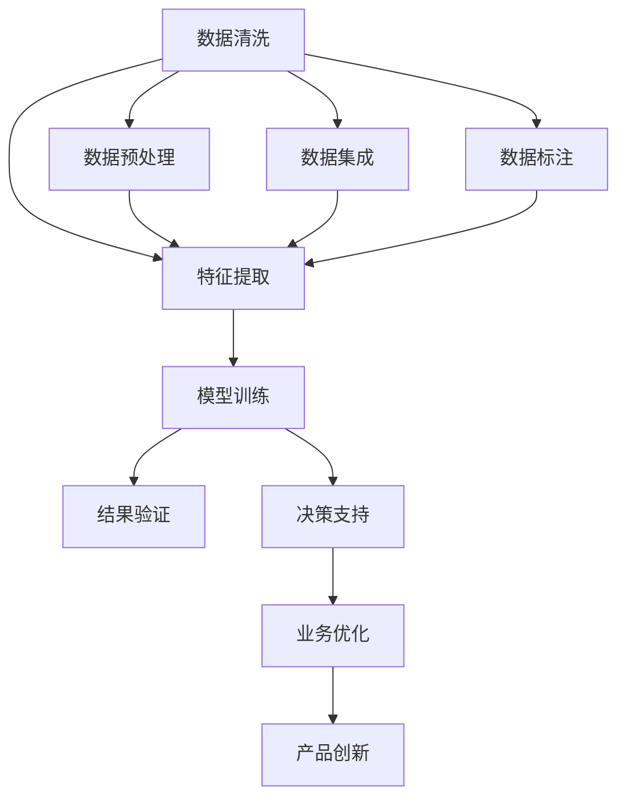

                 

# 知识发现引擎：人工智能时代的创新引擎

## 1. 背景介绍

### 1.1 问题由来
在人工智能(AI)飞速发展的时代，数据驱动的智能系统正逐步成为各行各业的核心竞争力。数据挖掘和知识发现技术的创新应用，直接关系到AI技术的进步和应用场景的拓展。面对海量数据的快速增长和多样性，如何从中提取出更有价值的知识，并有效地转化为行动方案，成为企业创新和发展的重要课题。

### 1.2 问题核心关键点
在当前AI时代，知识发现引擎扮演着至关重要的角色。它不仅从原始数据中挖掘出模式、趋势和关联，还通过对数据的深入分析，辅助决策、优化资源配置，促进产品和服务的创新。然而，随着数据规模的指数级增长和数据类型的日益多样化，传统知识发现技术在速度、质量和灵活性方面面临着巨大的挑战。

### 1.3 问题研究意义
研究知识发现引擎的原理与应用，对于推动人工智能技术在各行各业中的应用，提升企业的创新能力和竞争力，具有重要意义：

1. **提高决策质量**：通过分析数据中的模式和关联，知识发现引擎能够提供更为精准的决策依据，减少主观偏差，提升决策的科学性和准确性。
2. **优化资源配置**：通过对资源使用情况的数据分析，知识发现引擎可以提出更为有效的资源配置策略，提高运营效率。
3. **促进产品创新**：从用户反馈、市场数据中提取有价值的信息，辅助产品设计、优化和改进，提升产品竞争力。
4. **推动产业升级**：结合行业特定需求，定制化的知识发现引擎可以为传统行业数字化转型提供有力的技术支撑，加速产业升级。

## 2. 核心概念与联系

### 2.1 核心概念概述

为更好地理解知识发现引擎的工作原理和应用场景，本节将介绍几个关键概念：

- **知识发现(Knowledge Discovery)**：从大规模数据中自动或半自动地挖掘、发现有用知识的过程。通常包括数据清洗、特征提取、模型训练、结果验证等步骤。
- **人工智能(AI)**：利用算法和计算技术，让计算机模拟和执行人类的智能行为，包括学习、推理、规划等。
- **机器学习(ML)**：一种通过数据驱动的方法，使计算机从经验中自动学习知识，无需显式编程的技术。包括监督学习、无监督学习和强化学习等。
- **数据挖掘(Data Mining)**：从大规模数据集中自动发现有用、新颖和潜在有用信息的非平凡过程。是知识发现的重要工具和方法。
- **深度学习(Deep Learning)**：一类模拟人类神经网络结构的机器学习方法，适用于处理复杂、高维的特征数据，如图像、语音、文本等。
- **自然语言处理(NLP)**：使计算机能够理解和处理人类语言的技术，包括文本分析、情感分析、语义理解等。

这些概念之间的逻辑关系可以通过以下Mermaid流程图来展示：



这个流程图展示了知识发现引擎的基本流程和核心步骤：

1. 数据清洗：清洗原始数据，去除噪声和异常值。
2. 特征提取：从原始数据中提取有用的特征，供后续模型训练使用。
3. 模型训练：选择合适的机器学习模型，对特征进行训练，挖掘出有用知识。
4. 结果验证：评估模型的性能，确保结果的准确性和可靠性。
5. 数据预处理：对数据进行标准化、归一化等预处理操作。
6. 数据集成：将多个数据源集成到一个统一的数据集，供知识发现使用。
7. 决策支持：将知识发现结果应用于决策分析中，提供决策建议。
8. 业务优化：基于知识发现结果，优化业务流程和资源配置。
9. 产品创新：利用知识发现结果，改进和创新产品设计和服务模式。
10. 数据标注：为无标签数据进行标注，训练有监督学习模型。

这些概念共同构成了知识发现引擎的基础，使得系统能够从大规模数据中提取出有价值的知识，辅助企业决策和创新。

## 3. 核心算法原理 & 具体操作步骤
### 3.1 算法原理概述

知识发现引擎的核心在于从大规模数据中挖掘出有用的知识。其核心算法和操作步骤通常包括以下几个关键部分：

1. **数据预处理**：对原始数据进行清洗、去噪、归一化等预处理操作，确保数据的可用性。
2. **特征提取**：从清洗后的数据中提取有用的特征，供后续模型训练使用。
3. **模型选择与训练**：选择合适的机器学习模型，对数据进行训练，挖掘出有用的知识。
4. **结果验证**：对训练结果进行验证，确保模型的可靠性和准确性。
5. **结果应用**：将知识发现结果应用于实际业务场景中，辅助决策和创新。

### 3.2 算法步骤详解

知识发现引擎的具体操作步骤如下：

**Step 1: 数据预处理**
- 对原始数据进行清洗，去除噪声和异常值。
- 进行标准化和归一化操作，使数据具有较好的可比较性。
- 对缺失值进行处理，如填补、删除或插值。

**Step 2: 特征提取**
- 选择合适的特征提取方法，如PCA、LDA等。
- 对特征进行筛选和降维，减少数据维度。
- 生成新的特征，如时间序列、文本嵌入等。

**Step 3: 模型选择与训练**
- 根据任务类型选择合适的机器学习模型，如线性回归、逻辑回归、支持向量机等。
- 使用训练集对模型进行训练，调整模型参数。
- 使用验证集对模型进行验证，防止过拟合。

**Step 4: 结果验证**
- 使用测试集对模型进行测试，评估模型的泛化能力。
- 使用交叉验证等方法，确保结果的可靠性。

**Step 5: 结果应用**
- 将模型应用于实际业务场景中，进行预测或分类。
- 结合业务需求，对预测结果进行解读和优化。

### 3.3 算法优缺点

知识发现引擎的优点在于：

1. **自动化**：通过自动化算法和流程，减少了人工干预，提高了效率。
2. **灵活性**：可以处理各种类型的数据，如结构化、半结构化和非结构化数据。
3. **准确性**：通过科学的方法和技术，可以挖掘出高精度的知识。

同时，知识发现引擎也存在一些局限性：

1. **数据依赖**：知识发现的效果很大程度上依赖于数据的质量和数量，低质量数据可能导致错误的结论。
2. **算法复杂度**：一些复杂的算法可能需要较长的时间进行训练和验证。
3. **结果解释性不足**：某些算法的结果难以解释，难以让人理解和接受。

### 3.4 算法应用领域

知识发现引擎在多个领域都有广泛的应用，例如：

- **金融风险管理**：利用知识发现引擎对金融数据进行分析，识别潜在风险和异常交易。
- **市场营销**：分析消费者行为数据，进行客户细分和市场预测，优化营销策略。
- **医疗健康**：分析患者数据，进行疾病预测和诊断，优化医疗资源配置。
- **供应链管理**：分析供应链数据，优化库存管理、物流调度和生产计划。
- **网络安全**：分析网络流量数据，识别和预防网络攻击和入侵。

此外，知识发现引擎在社交媒体分析、舆情监测、舆情分析等多个领域也有广泛的应用。

## 4. 数学模型和公式 & 详细讲解 & 举例说明

### 4.1 数学模型构建

本节将使用数学语言对知识发现引擎的数学模型进行更加严格的刻画。

记原始数据集为 $D=\{(x_i, y_i)\}_{i=1}^N$，其中 $x_i$ 为特征向量，$y_i$ 为标签。定义知识发现引擎的任务为 $T$，即从数据集中挖掘出对 $T$ 有用的知识。

定义模型为 $M(\cdot)$，其中 $\theta$ 为模型参数。知识发现引擎的优化目标是最小化模型在数据集上的损失函数 $\mathcal{L}(\theta)$，即：

$$
\theta^* = \mathop{\arg\min}_{\theta} \mathcal{L}(M(\cdot), D)
$$

常见的损失函数包括均方误差、交叉熵等。

### 4.2 公式推导过程

以线性回归为例，假设 $y_i = \theta_0 + \sum_{j=1}^n \theta_j x_{ij}$，则模型为 $M(x) = \theta_0 + \sum_{j=1}^n \theta_j x_j$。

对于数据集 $D$，损失函数 $\mathcal{L}(\theta)$ 可以定义为均方误差：

$$
\mathcal{L}(\theta) = \frac{1}{N}\sum_{i=1}^N (y_i - M(x_i))^2
$$

其中 $x_i$ 为特征向量，$y_i$ 为标签。

根据梯度下降等优化算法，可以得到模型的更新公式：

$$
\theta_j \leftarrow \theta_j - \eta \frac{\partial \mathcal{L}(\theta)}{\partial \theta_j}
$$

其中 $\eta$ 为学习率，通常使用小步长更新模型参数。

在得到模型参数后，可以通过模型 $M(x)$ 进行预测，即 $y' = M(x')$，其中 $x'$ 为测试集样本。

### 4.3 案例分析与讲解

**案例：金融风险管理**

在金融领域，利用知识发现引擎对历史交易数据进行分析，可以识别出潜在的风险因素和异常交易行为。具体步骤如下：

1. **数据预处理**：对交易数据进行清洗和归一化，去除异常值和噪声。
2. **特征提取**：提取交易金额、交易时间、交易频率等特征。
3. **模型选择与训练**：选择线性回归模型，对特征进行训练，挖掘出风险因素。
4. **结果验证**：使用验证集对模型进行验证，确保模型的泛化能力。
5. **结果应用**：根据挖掘出的风险因素，对新交易进行风险评估和预警。

通过知识发现引擎，金融机构可以及时发现并应对潜在的风险，提升风险管理能力。

## 5. 项目实践：代码实例和详细解释说明

### 5.1 开发环境搭建

在进行知识发现引擎的开发时，我们需要准备好开发环境。以下是使用Python进行Scikit-Learn开发的环境配置流程：

1. 安装Anaconda：从官网下载并安装Anaconda，用于创建独立的Python环境。

2. 创建并激活虚拟环境：
```bash
conda create -n sklearn-env python=3.8 
conda activate sklearn-env
```

3. 安装Scikit-Learn：
```bash
conda install scikit-learn
```

4. 安装必要的依赖包：
```bash
pip install numpy pandas matplotlib seaborn
```

5. 安装必要的工具包：
```bash
pip install tqdm jupyter notebook
```

完成上述步骤后，即可在`sklearn-env`环境中开始知识发现引擎的开发。

### 5.2 源代码详细实现

下面以线性回归模型为例，给出使用Scikit-Learn对金融数据进行知识发现过程的代码实现。

首先，定义数据集：

```python
import numpy as np
from sklearn.datasets import make_regression

# 生成随机数据
X, y = make_regression(n_samples=1000, n_features=5, noise=0.1, random_state=42)

# 将数据集划分为训练集和测试集
from sklearn.model_selection import train_test_split
X_train, X_test, y_train, y_test = train_test_split(X, y, test_size=0.2, random_state=42)
```

然后，定义模型和优化器：

```python
from sklearn.linear_model import LinearRegression

# 定义线性回归模型
model = LinearRegression()

# 训练模型
model.fit(X_train, y_train)

# 预测测试集
y_pred = model.predict(X_test)
```

接着，评估模型性能：

```python
from sklearn.metrics import mean_squared_error, r2_score

# 计算均方误差和R^2得分
mse = mean_squared_error(y_test, y_pred)
r2 = r2_score(y_test, y_pred)
print("均方误差:", mse)
print("R^2得分:", r2)
```

最后，使用模型进行预测：

```python
# 对新样本进行预测
new_X = np.array([[0.1, 0.2, 0.3, 0.4, 0.5]])
print("预测结果:", model.predict(new_X))
```

以上就是使用Scikit-Learn对线性回归模型进行金融数据知识发现的完整代码实现。可以看到，Scikit-Learn封装了常用的机器学习模型和评估指标，使得知识发现过程变得简单易行。

### 5.3 代码解读与分析

让我们再详细解读一下关键代码的实现细节：

**make_regression函数**：
- 用于生成随机回归数据，指定样本数、特征数、噪声等参数。

**train_test_split函数**：
- 用于将数据集划分为训练集和测试集，指定划分比例和随机种子。

**LinearRegression类**：
- 定义线性回归模型，提供fit和predict方法。

**mean_squared_error函数**：
- 用于计算均方误差，评估模型的预测精度。

**r2_score函数**：
- 用于计算R^2得分，评估模型的拟合效果。

**模型训练**：
- 使用训练集数据fit方法对模型进行训练，调整模型参数。

**模型预测**：
- 使用训练好的模型predict方法对测试集和新样本进行预测，评估模型性能。

通过以上步骤，即可实现对金融数据进行线性回归模型的知识发现过程。

## 6. 实际应用场景

### 6.1 金融风险管理

在金融领域，知识发现引擎可以应用于风险评估、欺诈检测、信用评分等方面。通过分析历史交易数据，挖掘出潜在的风险因素和欺诈行为，帮助金融机构及时发现并应对风险，提升风控能力。

在具体应用中，知识发现引擎可以与实时监控系统结合，对新交易数据进行实时分析和预警，保障金融系统的安全稳定。

### 6.2 市场营销

在市场营销中，知识发现引擎可以用于客户细分、市场预测和广告投放优化。通过分析消费者行为数据，挖掘出不同客户群体的特征和偏好，制定个性化的营销策略。

利用知识发现引擎，企业可以实时监测市场变化，预测市场趋势，优化广告投放策略，提升营销效果。

### 6.3 医疗健康

在医疗健康领域，知识发现引擎可以用于疾病预测、药物研发和医疗资源配置。通过分析患者数据，挖掘出疾病风险因素和治疗方法，优化医疗资源配置。

利用知识发现引擎，医疗机构可以实时监测患者健康状态，预测疾病风险，制定个性化的治疗方案，提升诊疗效果。

### 6.4 未来应用展望

随着知识发现技术的不断发展，未来知识发现引擎将在更多领域得到应用，为各行各业带来变革性影响。

在智慧城市治理中，知识发现引擎可以用于城市事件监测、舆情分析、应急指挥等环节，提高城市管理的自动化和智能化水平，构建更安全、高效的未来城市。

在智能制造中，知识发现引擎可以用于设备监控、故障预测和生产优化，提升制造效率和产品质量。

在自动驾驶中，知识发现引擎可以用于环境感知、路径规划和行为预测，提升驾驶安全和舒适性。

此外，知识发现引擎在生物信息学、社会科学等领域也有广泛的应用前景。相信随着技术的日益成熟，知识发现引擎必将在更多行业大放异彩，推动社会的全面进步。

## 7. 工具和资源推荐
### 7.1 学习资源推荐

为了帮助开发者系统掌握知识发现引擎的理论基础和实践技巧，这里推荐一些优质的学习资源：

1. 《Python机器学习》：由Scikit-Learn核心开发团队撰写，全面介绍了Scikit-Learn库的使用方法和案例实践，适合入门学习。

2. Coursera《机器学习》课程：由斯坦福大学开设的机器学习课程，内容涵盖监督学习、无监督学习、深度学习等，适合深入学习。

3. Kaggle：数据科学竞赛平台，提供丰富的数据集和开源代码，适合实践练习。

4. Google Colab：谷歌推出的在线Jupyter Notebook环境，免费提供GPU/TPU算力，适合快速实验和分享学习笔记。

5. 《数据科学手册》：全面介绍数据科学方法和工具的书籍，适合系统学习和应用。

通过对这些资源的学习实践，相信你一定能够快速掌握知识发现引擎的精髓，并用于解决实际的业务问题。

### 7.2 开发工具推荐

高效的开发离不开优秀的工具支持。以下是几款用于知识发现引擎开发的常用工具：

1. Scikit-Learn：由Python社区开发的机器学习库，提供丰富的算法和工具，适合快速原型设计和实验。

2. TensorFlow：由Google主导开发的深度学习框架，支持分布式计算，适合大规模工程应用。

3. PyTorch：由Facebook开发的深度学习框架，提供灵活的计算图和动态图机制，适合研究和实验。

4. Jupyter Notebook：交互式编程环境，支持多种语言和库，适合开发和分享学习笔记。

5. Weights & Biases：模型训练的实验跟踪工具，可以记录和可视化模型训练过程中的各项指标，方便对比和调优。

6. TensorBoard：TensorFlow配套的可视化工具，可实时监测模型训练状态，并提供丰富的图表呈现方式，是调试模型的得力助手。

合理利用这些工具，可以显著提升知识发现引擎的开发效率，加快创新迭代的步伐。

### 7.3 相关论文推荐

知识发现引擎的研究源于学界的持续探索。以下是几篇奠基性的相关论文，推荐阅读：

1. G. Karypis et al., "Link Prediction, Clustering and Recommendation"（链接预测、聚类和推荐）：提出了基于图模型的推荐算法，为知识发现提供了新的视角和方法。

2. P. S. Yu et al., "Association Rules: Mining frequent itemsets in large databases"（关联规则：在大数据库中挖掘频繁项集）：介绍了关联规则挖掘方法，广泛应用于市场篮分析、用户行为预测等场景。

3. J. H. Friedman et al., "Fast Algorithms for Clustering and Outlier Detection"（聚类和异常检测的快速算法）：提出了基于密度的聚类算法，适用于处理大规模、高维数据。

4. T. S. Jaakkola et al., "Causal Inference in Data Science: A Review"（数据科学中的因果推断：综述）：介绍了因果推断在知识发现中的应用，提升了模型的解释性和可信度。

5. H. G. Langford et al., "The Case of the Vanishing Gradient: An Empirical Study"（梯度消失的问题：一项实证研究）：探讨了深度学习中梯度消失的问题，并提出了一系列优化方法。

这些论文代表了大数据知识发现的研究脉络。通过学习这些前沿成果，可以帮助研究者把握学科前进方向，激发更多的创新灵感。

## 8. 总结：未来发展趋势与挑战

### 8.1 总结

本文对知识发现引擎的原理与应用进行了全面系统的介绍。首先阐述了知识发现引擎的研究背景和意义，明确了知识发现引擎在数据驱动决策、业务优化和产品创新中的独特价值。其次，从原理到实践，详细讲解了知识发现引擎的数学模型和操作步骤，给出了知识发现引擎任务开发的完整代码实例。同时，本文还广泛探讨了知识发现引擎在金融、市场营销、医疗等多个领域的应用前景，展示了知识发现引擎的巨大潜力。此外，本文精选了知识发现引擎的学习资源和开发工具，力求为读者提供全方位的技术指引。

通过本文的系统梳理，可以看到，知识发现引擎正在成为数据驱动决策的重要工具，极大地提升企业的决策能力和业务效率。未来，伴随数据规模的持续增长和知识发现技术的不断进步，知识发现引擎必将在更多领域大放异彩，深刻影响各行各业的创新和发展。

### 8.2 未来发展趋势

展望未来，知识发现引擎将呈现以下几个发展趋势：

1. **自动化和智能化**：未来的知识发现引擎将更加自动化和智能化，能够自动从海量数据中挖掘出有用知识，并提供智能化的分析和建议。

2. **跨领域融合**：知识发现引擎将与其他AI技术如自然语言处理、计算机视觉、增强学习等进行更深层次的融合，实现多模态数据的协同分析和应用。

3. **实时化和交互化**：知识发现引擎将具备实时处理和交互功能，能够实时监测数据变化，并根据用户交互进行动态分析和调整。

4. **可解释性**：未来的知识发现引擎将具备更强的可解释性，能够清晰地解释知识发现的过程和结果，提升系统的透明性和可信度。

5. **伦理和安全**：知识发现引擎将加强伦理和安全约束，确保知识发现的过程和结果符合道德规范，保护用户隐私和安全。

6. **跨界应用**：知识发现引擎将拓展到更多领域，如智慧城市、智能制造、自动驾驶等，为各行各业带来创新和变革。

以上趋势凸显了知识发现引擎的广阔前景。这些方向的探索发展，必将进一步提升知识发现引擎的性能和应用范围，为各行各业提供更强大的数据驱动决策能力。

### 8.3 面临的挑战

尽管知识发现引擎已经取得了显著进展，但在迈向更加智能化、普适化应用的过程中，它仍面临着诸多挑战：

1. **数据质量**：知识发现的效果很大程度上依赖于数据的质量和完整性，低质量数据可能导致错误的结论。

2. **模型复杂度**：一些复杂的算法可能需要较长的时间进行训练和验证，难以实时处理大规模数据。

3. **可解释性不足**：某些算法的结果难以解释，难以让人理解和接受，限制了其应用范围。

4. **计算资源**：知识发现引擎通常需要大量计算资源，高性能计算设备是必要的支持。

5. **隐私保护**：在处理敏感数据时，如何保护用户隐私和数据安全是一个重要问题。

6. **应用场景多样化**：不同领域的应用场景差异较大，知识发现引擎需要针对特定领域进行优化和定制。

这些挑战需要通过技术创新和优化来解决，以便更好地发挥知识发现引擎的潜力，服务于更多的业务场景。

### 8.4 研究展望

面对知识发现引擎面临的诸多挑战，未来的研究需要在以下几个方面寻求新的突破：

1. **提高数据质量**：通过数据清洗和预处理技术，提升数据质量，减少数据噪声和异常值的影响。

2. **优化算法效率**：开发更加高效、轻量级的算法，支持实时处理大规模数据，提升知识发现引擎的性能。

3. **增强可解释性**：引入因果推断和可解释性模型，提升知识发现引擎的透明性和可信度，帮助用户理解和接受结果。

4. **引入更多先验知识**：将符号化的先验知识，如知识图谱、逻辑规则等，与神经网络模型进行巧妙融合，提升知识发现引擎的准确性和全面性。

5. **跨模态融合**：将知识发现引擎与其他AI技术进行更深层次的融合，实现多模态数据的协同分析和应用，提升系统的综合能力。

6. **伦理和安全**：在知识发现过程中，引入伦理和安全约束，确保知识发现的结果符合道德规范，保护用户隐私和安全。

这些研究方向的探索，必将引领知识发现引擎技术迈向更高的台阶，为各行各业提供更为强大的数据驱动决策能力。面向未来，知识发现引擎需要与其他AI技术进行更深入的融合，共同推动人工智能技术的进步和应用。

## 9. 附录：常见问题与解答

**Q1：知识发现引擎是否适用于所有数据类型？**

A: 知识发现引擎适用于处理各种类型的数据，包括结构化、半结构化和非结构化数据。然而，对于某些非数值型数据，如文本、图像等，需要进行预处理和特征提取，才能应用于知识发现模型。

**Q2：知识发现引擎的性能主要受哪些因素影响？**

A: 知识发现引擎的性能主要受数据质量、特征选择、模型选择、算法效率等因素影响。其中，数据质量是基础，特征选择和模型选择影响挖掘结果的准确性，算法效率影响处理速度和计算资源。

**Q3：知识发现引擎在实际应用中需要注意哪些问题？**

A: 知识发现引擎在实际应用中需要注意数据隐私和安全问题、算法的可解释性和透明度、处理实时数据的能力等。此外，还需要根据具体应用场景，选择合适的算法和模型，进行适当的优化和调整。

**Q4：知识发现引擎与其他AI技术相比有哪些优势？**

A: 知识发现引擎在数据驱动决策、业务优化和产品创新方面具有显著优势。它能够自动从大规模数据中挖掘出有用知识，辅助决策和优化，提升系统的性能和灵活性。

**Q5：知识发现引擎的未来发展方向是什么？**

A: 未来的知识发现引擎将向自动化、智能化、跨界融合、实时化和交互化方向发展。通过技术创新和优化，知识发现引擎必将在更多领域大放异彩，深刻影响各行各业的创新和发展。

通过本文的系统梳理，可以看到，知识发现引擎正在成为数据驱动决策的重要工具，极大地提升企业的决策能力和业务效率。未来，伴随数据规模的持续增长和知识发现技术的不断进步，知识发现引擎必将在更多领域大放异彩，深刻影响各行各业的创新和发展。

