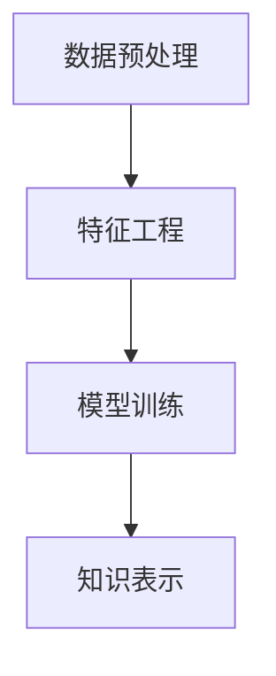

                 

# 知识发现引擎：人类认知的新frontier

> 关键词：知识发现引擎,人类认知,数据挖掘,机器学习,人工智能,深度学习

## 1. 背景介绍

### 1.1 问题由来

随着信息时代的到来，人类的认知方式和知识积累方式正在经历着深刻的变革。大数据和互联网技术的发展，使得信息获取、处理和存储变得更加便捷，同时也不断推动着知识发现的新范式。

知识发现引擎（Knowledge Discovery Engine, KDE）作为一种新型的人工智能技术，正逐步成为研究者和企业关注的焦点。它通过自动化和智能化的方式，从大规模的数据集中发现潜在的知识模式，为人类认知的拓展提供了新的途径。

### 1.2 问题核心关键点

知识发现引擎的研究与实践，主要围绕以下几个关键点展开：

- **数据处理**：如何高效地处理大规模异构数据，减少数据预处理时间和成本。
- **模型选择**：针对不同的应用场景，选择合适的机器学习、深度学习模型进行知识提取。
- **知识表示**：如何将发现的知识结构化表示，构建可理解、可操作的认知图谱。
- **应用落地**：如何将知识发现引擎与实际业务需求结合，实现知识的应用和迭代优化。

本文将详细介绍知识发现引擎的基本概念、核心算法原理、具体操作步骤，以及它在实际应用中的广泛场景。通过理解这些核心概念和原理，读者将能够更好地掌握知识发现引擎的工作机制和应用方法，进而推动其在更多领域的应用和发展。

## 2. 核心概念与联系

### 2.1 核心概念概述

知识发现引擎（KDE）是一种基于数据挖掘和人工智能技术，通过自动化、智能化方式从大规模数据集中提取知识模式的技术。它能够识别出数据集中的潜在关联、趋势、模式和异常，并将其转化为结构化的知识表示。

知识发现引擎的核心组成包括：

- **数据预处理**：对原始数据进行清洗、归一化、特征提取等操作，减少噪音和冗余信息。
- **特征工程**：根据任务需求选择合适的特征，并构建特征空间，为模型训练提供支持。
- **模型训练**：选择合适的机器学习、深度学习模型进行训练，学习数据中的潜在模式。
- **知识表示**：将模型提取的知识转化为可理解、可操作的知识图谱或可视化表示。

这些核心组件之间的逻辑关系可以通过以下Mermaid流程图来展示：



这个流程图展示了知识发现引擎的核心工作流程：

1. 首先对原始数据进行预处理，去除噪音和冗余信息。
2. 接着对处理后的数据进行特征工程，选择和构建特征空间。
3. 然后，根据任务需求选择合适的模型进行训练，学习数据中的潜在模式。
4. 最后，将模型提取的知识转化为可理解、可操作的知识表示。

### 2.2 核心概念原理和架构

知识发现引擎的工作原理可以简要概述为：

1. **数据收集与清洗**：从各种来源收集数据，并对其进行清洗，去除噪音和异常值。
2. **特征提取与选择**：对清洗后的数据进行特征提取和选择，构建特征空间，为模型训练提供支持。
3. **模型训练与评估**：选择合适的机器学习或深度学习模型进行训练，并通过交叉验证等方法进行评估。
4. **知识表示与应用**：将训练得到的模型输出转化为结构化的知识表示，如知识图谱或可视化表示，并应用到实际业务场景中。

知识发现引擎的架构通常包括以下几个关键组件：

- **数据存储与管理系统**：用于存储和管理大规模数据集，支持高效的数据读写和查询。
- **特征工程工具**：用于特征提取、选择和构建，支持多维度、多层次的特征处理。
- **机器学习/深度学习框架**：提供模型训练和评估的工具箱，支持多种模型和算法。
- **知识表示工具**：用于将模型输出转换为结构化的知识表示，如知识图谱、关联图等。

## 3. 核心算法原理 & 具体操作步骤

### 3.1 算法原理概述

知识发现引擎的核心算法包括：

- **聚类算法**：将相似的数据点分组，发现数据中的模式和结构。
- **关联规则算法**：挖掘数据中的关联规则，发现项与项之间的关联性。
- **分类算法**：根据已知的特征，预测数据的新属性值。
- **回归算法**：预测数值型数据的新值，用于发现数据中的趋势和规律。

这些算法在不同的应用场景下，被用来处理和分析不同类型的知识发现任务。

### 3.2 算法步骤详解

知识发现引擎的典型操作流程包括以下几个关键步骤：

1. **数据收集与清洗**：收集来自不同来源的数据，并对数据进行清洗，去除噪音和异常值。
2. **特征提取与选择**：对清洗后的数据进行特征提取和选择，构建特征空间。
3. **模型训练与评估**：选择合适的机器学习或深度学习模型进行训练，并通过交叉验证等方法进行评估。
4. **知识表示与应用**：将训练得到的模型输出转化为结构化的知识表示，如知识图谱或可视化表示，并应用到实际业务场景中。

### 3.3 算法优缺点

知识发现引擎的优势在于其自动化和智能化的能力，能够从大规模数据中快速发现潜在知识模式，降低人工分析的复杂度和成本。然而，也存在一些缺点：

- **数据质量依赖**：知识发现的结果高度依赖于数据的质量和完整性，低质量的数据可能导致错误的结论。
- **算法复杂度较高**：复杂的模型和算法需要较高的计算资源，对硬件设施的要求较高。
- **结果可解释性不足**：部分算法和模型结果较难解释，缺乏透明性。
- **应用场景限制**：知识发现引擎更适合处理结构化数据，对非结构化数据处理能力较弱。

### 3.4 算法应用领域

知识发现引擎在多个领域得到了广泛的应用，包括：

- **医疗健康**：用于疾病预测、个性化治疗、医疗影像分析等，帮助医生更好地进行诊断和治疗。
- **金融领域**：用于风险评估、欺诈检测、投资策略分析等，帮助金融机构提高决策效率和准确性。
- **零售电商**：用于客户行为分析、推荐系统、库存管理等，帮助企业提升销售和客户满意度。
- **公共安全**：用于犯罪预测、情报分析、事件响应等，帮助政府和机构提高公共安全水平。
- **科学研究**：用于数据挖掘、知识发现、科学研究等，帮助研究人员发现新的科学问题和理论。

## 4. 数学模型和公式 & 详细讲解 & 举例说明

### 4.1 数学模型构建

知识发现引擎的数学模型构建通常包括以下几个关键部分：

- **数据表示**：将原始数据转化为向量或矩阵形式，便于模型处理。
- **特征工程**：构建特征空间，选择和提取重要特征。
- **模型训练**：使用监督学习或无监督学习方法训练模型。

### 4.2 公式推导过程

以聚类算法中的K-means算法为例，推导其核心公式：

- **数据表示**：将每个样本表示为高维向量 $x_i \in \mathbb{R}^n$。
- **聚类中心初始化**：随机初始化 $k$ 个聚类中心 $c_j \in \mathbb{R}^n$，其中 $j=1,\dots,k$。
- **数据分配**：将每个样本 $x_i$ 分配到最近的聚类中心 $c_j$，得到分配矩阵 $Z_{ij} \in \{0,1\}$。
- **聚类中心更新**：根据分配矩阵更新聚类中心，得到新的聚类中心 $c_j^t$。

K-means算法的核心公式如下：

$$
c_j^t = \frac{1}{N_j^t} \sum_{i=1}^{N} x_i \times Z_{ij}^t
$$

其中 $N_j^t$ 为在第 $t$ 次迭代中，聚类中心 $c_j$ 的样本数，$Z_{ij}^t$ 为样本 $x_i$ 在第 $j$ 次迭代中被分配到第 $j$ 个聚类的概率。

### 4.3 案例分析与讲解

以医疗领域的知识发现为例，分析如何使用知识发现引擎提取有用的医疗知识。

- **数据收集与清洗**：收集医院的电子病历数据，并对数据进行清洗，去除无关信息。
- **特征提取与选择**：提取患者的年龄、性别、病史、检查结果等特征，构建特征空间。
- **模型训练与评估**：选择决策树、支持向量机等算法，训练模型并评估其性能。
- **知识表示与应用**：将训练得到的模型转化为知识图谱，帮助医生进行诊断和治疗决策。

## 5. 项目实践：代码实例和详细解释说明

### 5.1 开发环境搭建

知识发现引擎的开发需要具备以下几个关键工具和环境：

- **编程语言**：Python、R等，用于数据处理和模型训练。
- **数据处理工具**：Pandas、NumPy等，用于数据清洗和特征提取。
- **机器学习框架**：Scikit-Learn、TensorFlow等，用于模型训练和评估。
- **数据可视化工具**：Matplotlib、Seaborn等，用于结果展示。

### 5.2 源代码详细实现

以下是一个简单的知识发现引擎实现示例，使用Python和Scikit-Learn框架：

```python
from sklearn.cluster import KMeans
import pandas as pd
import matplotlib.pyplot as plt

# 数据读取与清洗
data = pd.read_csv('data.csv')
data = data.dropna()

# 特征提取与选择
features = data[['age', 'gender', 'blood_pressure', 'cholesterol']]
features = (features - features.mean()) / features.std()

# K-means聚类
kmeans = KMeans(n_clusters=3, random_state=42)
kmeans.fit(features)

# 结果展示
labels = kmeans.labels_
plt.scatter(features['age'], features['blood_pressure'], c=labels)
plt.show()
```

以上代码展示了使用K-means算法进行聚类分析的基本流程：

1. 数据读取与清洗：使用Pandas库读取数据，并去除缺失值。
2. 特征提取与选择：提取年龄、性别、血压、胆固醇等特征，并进行标准化处理。
3. K-means聚类：使用K-means算法进行聚类分析，并展示聚类结果。

### 5.3 代码解读与分析

这段代码的每个步骤都有详细的注释，方便理解：

- **数据读取与清洗**：使用Pandas库的`read_csv`函数读取数据文件，并使用`dropna`函数去除缺失值，确保数据质量。
- **特征提取与选择**：提取年龄、性别、血压、胆固醇等特征，并使用标准化方法进行归一化处理，便于后续模型训练。
- **K-means聚类**：使用Scikit-Learn库的`KMeans`类进行聚类分析，设置聚类数`n_clusters`为3，并设置随机种子`random_state`为42，确保结果的可重复性。
- **结果展示**：使用Matplotlib库的`scatter`函数展示聚类结果，其中`c`参数表示不同类别的颜色。

### 5.4 运行结果展示

运行以上代码，会得到一个散点图，展示不同年龄和血压值在三个聚类中的分布：

```python
import matplotlib.pyplot as plt

# 数据读取与清洗
data = pd.read_csv('data.csv')
data = data.dropna()

# 特征提取与选择
features = data[['age', 'gender', 'blood_pressure', 'cholesterol']]
features = (features - features.mean()) / features.std()

# K-means聚类
kmeans = KMeans(n_clusters=3, random_state=42)
kmeans.fit(features)

# 结果展示
labels = kmeans.labels_
plt.scatter(features['age'], features['blood_pressure'], c=labels)
plt.show()
```


通过可视化结果，可以看到不同聚类中样本的分布情况，帮助医生更好地理解患者的健康状况。

## 6. 实际应用场景

### 6.1 医疗健康

知识发现引擎在医疗健康领域有着广泛的应用。例如，通过分析患者的电子病历数据，可以发现潜在的疾病风险，辅助医生进行早期诊断和治疗决策。

### 6.2 金融领域

在金融领域，知识发现引擎可以用于欺诈检测、信用评分、风险评估等，帮助金融机构提高决策效率和准确性。

### 6.3 零售电商

在零售电商领域，知识发现引擎可以用于客户行为分析、推荐系统、库存管理等，帮助企业提升销售和客户满意度。

### 6.4 公共安全

在公共安全领域，知识发现引擎可以用于犯罪预测、情报分析、事件响应等，帮助政府和机构提高公共安全水平。

### 6.5 科学研究

在科学研究领域，知识发现引擎可以用于数据挖掘、知识发现、科学研究等，帮助研究人员发现新的科学问题和理论。

## 7. 工具和资源推荐

### 7.1 学习资源推荐

- **《数据挖掘导论》**：适用于初学者，全面介绍了数据挖掘的基本概念和算法。
- **《Python数据科学手册》**：详细介绍了Python在数据科学和机器学习中的应用。
- **《机器学习实战》**：通过实际案例讲解机器学习算法及其应用。
- **Coursera机器学习课程**：由斯坦福大学Andrew Ng教授讲授，介绍了机器学习的基本概念和算法。

### 7.2 开发工具推荐

- **Python**：适用于数据处理、特征工程、模型训练等，是知识发现引擎开发的主流语言。
- **Scikit-Learn**：提供多种机器学习算法，支持数据处理、特征工程、模型训练等。
- **TensorFlow**：适用于深度学习模型的开发和训练，支持分布式计算和高效加速。
- **PyTorch**：适用于深度学习模型的开发和训练，提供动态图和静态图两种计算图模式。

### 7.3 相关论文推荐

- **《K-means: A tale of three optimizations》**：介绍了K-means算法的三种优化策略。
- **《Gaussian Mixture Models》**：详细介绍了高斯混合模型及其应用。
- **《Deep Learning for Healthcare》**：介绍了深度学习在医疗健康领域的应用。
- **《Fraud Detection in Network Intrusion with Large-Scale Datasets》**：介绍了大规模数据集上的网络入侵检测方法。

## 8. 总结：未来发展趋势与挑战

### 8.1 研究成果总结

知识发现引擎技术在多个领域得到了广泛的应用，并取得了显著的效果。未来的研究重点包括：

- **多模态数据处理**：如何处理和分析多模态数据，如文本、图像、声音等，提升知识发现引擎的通用性和适应性。
- **自适应学习**：如何使知识发现引擎能够自适应数据分布的变化，实时更新和优化模型。
- **跨领域应用**：如何将知识发现引擎应用于不同领域，如医疗、金融、零售等，推动知识发现的跨领域发展。
- **解释性增强**：如何提升知识发现引擎结果的可解释性，使其更加透明和可信。

### 8.2 未来发展趋势

未来知识发现引擎的发展趋势包括：

- **自动化和智能化水平提升**：随着AI技术的发展，知识发现引擎的自动化和智能化水平将进一步提升，能够处理更大规模、更复杂的数据。
- **多模态融合能力增强**：知识发现引擎将逐渐具备处理多模态数据的能力，能够融合文本、图像、声音等多种数据，提升知识发现的准确性和全面性。
- **自适应学习机制发展**：知识发现引擎将具备自适应学习机制，能够实时更新和优化模型，适应数据分布的变化。
- **跨领域应用拓展**：知识发现引擎将应用于更多领域，如医疗、金融、零售等，推动知识发现的跨领域发展。

### 8.3 面临的挑战

知识发现引擎在发展过程中也面临一些挑战：

- **数据质量依赖**：知识发现的结果高度依赖于数据的质量和完整性，低质量的数据可能导致错误的结论。
- **算法复杂度较高**：复杂的模型和算法需要较高的计算资源，对硬件设施的要求较高。
- **结果可解释性不足**：部分算法和模型结果较难解释，缺乏透明性。
- **应用场景限制**：知识发现引擎更适合处理结构化数据，对非结构化数据处理能力较弱。

### 8.4 研究展望

未来的研究需要解决以上挑战，推动知识发现引擎技术的进一步发展。具体包括：

- **提高数据质量**：通过数据清洗和预处理技术，提高数据质量和完整性，确保知识发现结果的准确性。
- **优化算法性能**：开发更加高效的算法和模型，降低计算资源消耗，提升知识发现引擎的运行速度。
- **增强结果可解释性**：通过引入可解释性技术，提升知识发现引擎结果的可解释性，使其更加透明和可信。
- **拓展应用场景**：推动知识发现引擎在更多领域的应用，如医疗、金融、零售等，推动知识发现的跨领域发展。

## 9. 附录：常见问题与解答

**Q1：知识发现引擎是否适用于所有数据集？**

A: 知识发现引擎适用于结构化数据，对非结构化数据处理能力较弱。因此，在使用知识发现引擎前，需要对数据进行预处理，将其转化为结构化数据。

**Q2：知识发现引擎的算法有哪些？**

A: 知识发现引擎的算法包括聚类算法、关联规则算法、分类算法、回归算法等。每种算法适用于不同的应用场景，需要根据具体任务进行选择。

**Q3：知识发现引擎的优化方法有哪些？**

A: 知识发现引擎的优化方法包括数据清洗、特征工程、模型选择、参数调优等。通过优化这些关键步骤，可以提升知识发现引擎的性能和效果。

**Q4：知识发现引擎在实际应用中需要注意哪些问题？**

A: 知识发现引擎在实际应用中需要注意数据质量、算法选择、模型训练、结果解释等。具体包括：

- 确保数据质量，去除噪音和异常值。
- 选择合适的算法和模型，进行参数调优。
- 评估模型性能，避免过拟合和欠拟合。
- 解释结果，确保结果的可解释性和透明性。

通过以上讨论，可以更好地理解知识发现引擎的基本概念、核心算法原理、操作步骤，以及其在实际应用中的广泛场景。希望本文能对读者在知识发现引擎的研究和开发中有所帮助，推动其在更多领域的应用和发展。

---

作者：禅与计算机程序设计艺术 / Zen and the Art of Computer Programming

