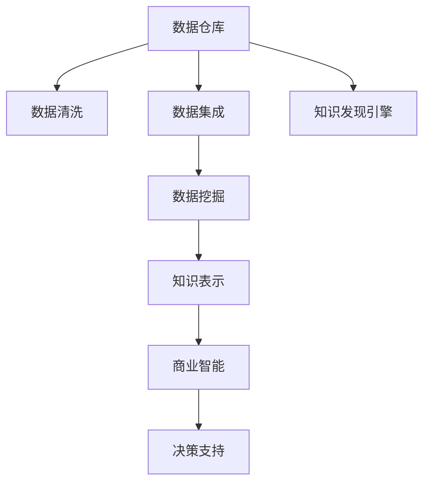

                 

# 知识发现引擎：助力企业战略的智慧决策

## 1. 背景介绍

### 1.1 问题由来

在信息爆炸的现代社会，企业需要从大量复杂且多源的数据中发现有用的信息，以辅助制定科学合理的战略决策。然而，传统的数据挖掘和分析方法，如统计分析、关系型数据库等，已经难以满足企业对智慧决策的更高要求。此时，一种能够高效、准确地挖掘知识、洞察业务模式的新型技术——知识发现引擎，便应运而生。

知识发现引擎是一种基于数据仓库、数据挖掘和机器学习等技术的智能信息处理工具。它能够将结构化、半结构化以及非结构化的数据转化为结构化知识，从而帮助企业高效地发现潜在的商业洞察，指导战略决策，提升核心竞争力。

### 1.2 问题核心关键点

构建知识发现引擎的核心挑战在于如何高效地从海量数据中提取知识。这包括：
1. **数据质量**：企业的数据通常非结构化且不完整，需要通过清洗和预处理保证数据的准确性和一致性。
2. **数据多样性**：企业的数据来源广泛，包括用户行为数据、市场数据、财务数据、社交媒体数据等，需要统一格式和维度。
3. **知识提取**：从多源数据中提取有价值的洞察，如趋势、关联规则、异常检测等，需要借助数据挖掘和机器学习算法。
4. **数据可视化**：将挖掘出的知识转化为可读性强的图表和报告，便于决策者理解和使用。
5. **应用落地**：将知识发现引擎嵌入到业务流程中，实现自动化的知识推送和应用。

本文将从上述关键点出发，全面介绍知识发现引擎的核心概念、技术原理以及实践案例，探讨其在企业战略决策中的重要价值。

## 2. 核心概念与联系

### 2.1 核心概念概述

为了更好地理解知识发现引擎，我们首先介绍几个核心概念：

- **知识发现(Knowledge Discovery)**：指从数据中自动发现模式、规律和关联性的过程。知识发现通常包括数据清洗、数据集成、数据挖掘和知识表示等步骤。
- **数据挖掘(Data Mining)**：从大量数据中提取有用信息和知识的过程。数据挖掘应用了统计学、机器学习、人工智能等技术。
- **数据仓库(Data Warehouse)**：存储企业历史数据的数据管理系统，为知识发现提供数据源。
- **商业智能(Business Intelligence, BI)**：利用数据仓库和数据挖掘等技术，支持企业决策者理解业务，做出科学决策。
- **知识发现引擎(Knowledge Discovery Engine, KDE)**：基于数据挖掘、机器学习等技术，自动化地发现知识，并支持业务决策的系统。

这些概念之间的联系可以通过以下Mermaid流程图来展示：



这个流程图展示了数据从数据仓库到商业智能的整个知识发现流程：

1. 数据仓库收集企业历史数据。
2. 数据清洗和集成处理保证数据质量。
3. 数据挖掘从数据中提取有价值的知识。
4. 知识表示将挖掘结果结构化存储。
5. 商业智能利用知识支持企业决策。
6. 知识发现引擎将上述步骤自动化并集成于BI系统。

### 2.2 核心概念原理和架构

知识发现引擎的原理可以简述为：通过数据清洗、数据挖掘等技术，从数据仓库中提取有用知识，并将其结构化表示，以供商业智能系统使用。其核心架构包括数据接口、数据预处理、知识挖掘和知识展示等模块。

- **数据接口**：负责连接数据仓库，抽取数据。
- **数据预处理**：清洗数据，包括缺失值填充、异常值检测、数据转换等。
- **知识挖掘**：应用数据挖掘算法，从数据中提取关联规则、分类规则、聚类规则等知识。
- **知识展示**：将挖掘出的知识展示为图表、报表等可视化形式。

以下是一个简单的知识发现引擎架构图：

```
+---------------------------+
|   数据仓库               |
+---------------------------+
       |                    |
       |                    |
      v                    v
+---------------------------+        +-----------------------+
|    数据接口               |        |   数据预处理           |
+---------------------------+        +-----------------------+
       |                    |
       |                    |
      v                    v
+---------------------------+        +-----------------------+
|    数据挖掘算法         |        |   知识展示算法         |
+---------------------------+        +-----------------------+
       |                    |
       |                    |
      v                    v
+---------------------------+        +-----------------------+
|   知识发现引擎           |        |   商业智能系统         |
+---------------------------+        +-----------------------+
       |                    |
       |                    |
      v                    v
+---------------------------+
|  企业决策者               |
+---------------------------+
```

## 3. 核心算法原理 & 具体操作步骤

### 3.1 算法原理概述

知识发现引擎的核心算法主要集中在数据挖掘部分。常用的数据挖掘算法包括分类、聚类、关联规则挖掘等。以下简要介绍这些算法的原理：

- **分类算法**：根据特征将数据分到不同类别中。常用的算法有决策树、朴素贝叶斯、支持向量机等。
- **聚类算法**：将数据分为若干群组，每个群组内的数据相似度高。常用的算法有K-Means、层次聚类、DBSCAN等。
- **关联规则挖掘**：发现数据项之间的关联关系。常用的算法有Apriori、FP-Growth等。

### 3.2 算法步骤详解

知识发现引擎的核心算法步骤如下：

1. **数据预处理**：清洗和标准化数据，处理缺失值、异常值，进行数据转换。
2. **特征工程**：选择和构造特征，提高算法的性能。
3. **模型训练**：选择合适的算法，训练模型。
4. **模型评估**：使用测试数据评估模型性能，调整参数。
5. **知识展示**：将挖掘出的知识转换为可视化形式，辅助决策。

以分类算法为例，详细的算法步骤如下：

**Step 1: 数据预处理**

数据预处理是知识发现引擎的第一步。常用的预处理方法包括：
- 数据清洗：去除噪声、缺失值、重复值等。
- 数据转换：对数值型数据进行归一化、标准化等。
- 数据采样：处理不平衡数据，采用欠采样、过采样等方法。

**Step 2: 特征工程**

特征工程是影响模型性能的关键步骤。常用的特征工程方法包括：
- 特征选择：选择最相关的特征，去除冗余特征。
- 特征构造：通过组合和变换构造新特征，提高模型性能。
- 特征归一化：对不同量级的特征进行归一化处理。

**Step 3: 模型训练**

模型训练是知识发现引擎的核心。常用的分类算法及其训练步骤：
- 决策树：使用ID3、C4.5等算法，生成决策树。
- 朴素贝叶斯：使用极大似然估计或贝叶斯估计，计算后验概率。
- 支持向量机：通过核函数映射数据到高维空间，寻找最优超平面。

**Step 4: 模型评估**

模型评估是评估算法性能的重要步骤。常用的评估方法包括：
- 交叉验证：将数据集分为训练集和测试集，进行交叉验证。
- ROC曲线：绘制ROC曲线，评估分类器性能。
- 混淆矩阵：计算真阳性、假阳性、真阴性、假阴性等指标。

**Step 5: 知识展示**

知识展示是知识发现引擎的最后一步。常用的展示方法包括：
- 数据可视化：使用Matplotlib、Seaborn等库绘制图表。
- 报表生成：生成统计报表，包括表格、柱状图、饼图等。

### 3.3 算法优缺点

知识发现引擎的核心算法具有以下优点：

- **自动化**：自动化数据清洗、特征工程和模型训练，减少人工干预。
- **高效性**：算法处理速度快，可以处理大规模数据。
- **普适性**：支持多种算法，适用于不同类型的业务需求。

然而，这些算法也存在以下缺点：

- **数据依赖性高**：需要大量高质量数据，数据质量不好会导致结果偏差。
- **算法复杂度高**：一些算法如深度学习、神经网络等，计算复杂度较高，对硬件要求高。
- **解释性差**：一些算法的决策过程难以解释，缺乏可解释性。

### 3.4 算法应用领域

知识发现引擎广泛应用于商业智能、金融分析、医疗健康、物流管理等领域。以下具体介绍几个典型应用：

**商业智能(BI)**：在BI系统中，知识发现引擎通过挖掘客户行为、市场趋势等数据，生成报表和图表，辅助决策者制定营销策略、优化供应链等。

**金融分析**：在金融领域，知识发现引擎可以通过挖掘交易数据、市场数据等，发现交易模式、异常交易等，帮助金融机构进行风险管理、欺诈检测等。

**医疗健康**：在医疗领域，知识发现引擎可以通过挖掘患者数据、治疗效果等，发现疾病关联、治疗方案等，辅助医生制定诊疗方案、优化治疗效果。

**物流管理**：在物流领域，知识发现引擎可以通过挖掘运输数据、库存数据等，发现物流瓶颈、优化路线等，提升物流效率和客户满意度。

## 4. 数学模型和公式 & 详细讲解

### 4.1 数学模型构建

知识发现引擎的数学模型可以简化为以下形式：

设企业数据集为 $D=\{(x_i,y_i)\}_{i=1}^N$，其中 $x_i$ 为特征向量，$y_i$ 为标签。目标是从数据中学习模型 $f(x;\theta)$，使得 $f(x_i;\theta)$ 能够准确预测 $y_i$。模型的参数 $\theta$ 通过最大化似然函数进行估计：

$$
\hat{\theta}=\mathop{\arg\max}_{\theta} \prod_{i=1}^N p(y_i|x_i;\theta)
$$

其中 $p(y_i|x_i;\theta)$ 为条件概率密度函数。

### 4.2 公式推导过程

以决策树算法为例，其核心在于构建决策树，公式推导如下：

1. **信息熵**：信息熵 $H(y)$ 用于度量数据的不确定性，定义如下：

$$
H(y) = -\sum_{i=1}^C p_i \log_2 p_i
$$

其中 $p_i$ 为类别 $i$ 的概率，$C$ 为类别数。

2. **信息增益**：信息增益 $I(A;y)$ 用于度量属性 $A$ 对数据集 $D$ 的分割能力，定义如下：

$$
I(A;y) = H(y) - \sum_{v=1}^V H(y|A=v)
$$

其中 $V$ 为属性 $A$ 的取值数，$H(y|A=v)$ 为给定属性 $A=v$ 后，数据集 $D$ 的条件熵。

3. **信息增益比**：信息增益比用于选择最优属性，定义如下：

$$
\gamma(A)=\frac{I(A;y)}{H(A)}
$$

其中 $H(A)$ 为属性 $A$ 的熵。

4. **决策树构建**：根据信息增益比选择最优属性 $A$，递归构建决策树，如图：

```
      age
     /   \
   10-30   30+
          /    \
         male   female
```

5. **决策树剪枝**：为了避免过拟合，需要对决策树进行剪枝，如图：

```
      age
     /   \
   10-30   30+
          /    \
         male   female
     |          |
    10-30      30+
```

### 4.3 案例分析与讲解

以电商客户流失分析为例，数据预处理如下：

- **数据清洗**：去除重复数据、异常数据、缺失值等。
- **数据转换**：对数值型数据进行归一化处理。
- **数据采样**：采用欠采样方法，处理不平衡数据。

特征工程如下：

- **特征选择**：选择客户年龄、性别、购买金额等特征。
- **特征构造**：构造新的特征如购买频率、客户流失时间等。
- **特征归一化**：对特征进行标准化处理。

模型训练如下：

- **算法选择**：选择决策树算法。
- **模型训练**：使用ID3算法，生成决策树。
- **模型评估**：使用交叉验证方法，评估模型性能。

知识展示如下：

- **数据可视化**：使用Matplotlib库绘制客户流失的决策树。
- **报表生成**：生成客户流失的统计报表，包括客户流失率和流失原因等。

## 5. 项目实践：代码实例和详细解释说明

### 5.1 开发环境搭建

为了搭建知识发现引擎的开发环境，需要安装以下软件和工具：

1. Python 3.8：使用Python编写代码，进行数据处理和模型训练。
2. Pandas：用于数据处理和数据清洗。
3. Scikit-learn：包含各种机器学习算法和模型评估工具。
4. Matplotlib：用于数据可视化。
5. Jupyter Notebook：用于编写和运行代码。

### 5.2 源代码详细实现

以下是一个简单的Python代码示例，用于构建决策树模型并进行分类预测：

```python
import pandas as pd
from sklearn.tree import DecisionTreeClassifier
from sklearn.model_selection import train_test_split
from sklearn.metrics import accuracy_score
import matplotlib.pyplot as plt

# 读取数据
data = pd.read_csv('customer_churn.csv')

# 数据预处理
data = data.drop_duplicates()
data = data.dropna()
data['Churn'] = data['Churn'].apply(lambda x: 1 if x == 'true' else 0)

# 数据拆分
X = data.drop('Churn', axis=1)
y = data['Churn']
X_train, X_test, y_train, y_test = train_test_split(X, y, test_size=0.2, random_state=42)

# 特征选择
features = ['Age', 'tenure', 'DailySalesAmount', 'MonthlyCharges']
X_train = X_train[features]
X_test = X_test[features]

# 模型训练
clf = DecisionTreeClassifier()
clf.fit(X_train, y_train)

# 模型评估
y_pred = clf.predict(X_test)
accuracy = accuracy_score(y_test, y_pred)
print(f'模型准确度：{accuracy}')

# 可视化决策树
plt.figure(figsize=(10, 6))
plt.title('客户流失决策树')
plt.plot(clf.feature_importances_)
plt.show()
```

### 5.3 代码解读与分析

- **数据读取**：使用Pandas库读取数据。
- **数据预处理**：去除重复数据、异常数据、缺失值，并处理不平衡数据。
- **特征选择**：选择最相关的特征。
- **模型训练**：使用Scikit-learn库的决策树分类器。
- **模型评估**：计算模型的准确度。
- **可视化**：使用Matplotlib库绘制决策树特征重要性。

### 5.4 运行结果展示

运行上述代码后，将得到模型准确度和决策树特征重要性的可视化结果。


## 6. 实际应用场景

### 6.1 智能客户管理

知识发现引擎可以用于智能客户管理，通过分析客户数据，发现客户的流失原因，制定针对性挽留策略，提升客户满意度和忠诚度。

### 6.2 个性化推荐

知识发现引擎可以用于个性化推荐，通过分析用户行为数据，发现用户的偏好和兴趣，推荐个性化的商品和服务，提升用户体验和购买率。

### 6.3 风险管理

知识发现引擎可以用于风险管理，通过分析交易数据，发现异常交易行为，及时预警和处理潜在风险，保障金融安全。

### 6.4 未来应用展望

未来，知识发现引擎将在更多领域得到应用，其发展趋势如下：

1. **多源数据融合**：支持多源数据的融合，提高数据多样性和完整性。
2. **自动化深度学习**：引入深度学习等自动化算法，提高模型性能。
3. **实时处理**：支持实时数据处理和分析，提高数据的时效性。
4. **可解释性**：提高模型的可解释性，便于理解和调试。
5. **跨领域应用**：支持跨领域的知识发现，拓展应用场景。

## 7. 工具和资源推荐

### 7.1 学习资源推荐

为了深入了解知识发现引擎，推荐以下学习资源：

1. 《Python数据分析与挖掘》书籍：全面介绍Python数据分析与挖掘技术，包含数据清洗、特征工程和模型训练等内容。
2. 《数据科学导论》课程：斯坦福大学开设的在线课程，涵盖数据科学的基本概念和常用算法。
3. 《机器学习》课程：斯坦福大学开设的在线课程，涵盖机器学习的基本概念和常用算法。
4. Kaggle平台：提供大量数据集和竞赛，练习知识发现和数据挖掘技能。
5. GitHub：查找开源项目和代码示例，学习知识发现引擎的实现细节。

### 7.2 开发工具推荐

以下是几个常用的开发工具：

1. Jupyter Notebook：用于编写和运行代码，支持数据可视化。
2. Python IDE：如PyCharm、VSCode等，提供代码编写和调试功能。
3. Git版本控制：用于版本管理和团队协作。
4. Docker容器：提供容器化部署，方便迁移和扩展。
5. AWS云平台：提供云上基础设施和数据存储，支持分布式计算。

### 7.3 相关论文推荐

以下是几篇奠基性的知识发现引擎相关论文：

1. 《Knowledge Discovery in Databases》书籍：详细介绍知识发现的基本概念和常用算法。
2. 《The Elements of Statistical Learning》书籍：介绍统计学习的基本概念和常用算法，包含分类、回归、聚类等。
3. 《Data Mining and Statistical Learning》书籍：介绍数据挖掘和机器学习的基本概念和常用算法。
4. 《Decision Trees》论文：介绍决策树的基本概念和算法实现。
5. 《Support Vector Machines》论文：介绍支持向量机的基本概念和算法实现。

## 8. 总结：未来发展趋势与挑战

### 8.1 总结

本文详细介绍了知识发现引擎的核心概念、算法原理和操作步骤，通过具体案例和代码实现，展示了其在商业智能、个性化推荐、风险管理等实际应用中的价值。

知识发现引擎通过自动化数据处理和智能算法，从海量数据中提取知识，辅助企业决策，具有广泛的应用前景。未来，随着技术的不断进步，知识发现引擎将能够支持更多类型的业务需求，提升企业竞争力。

### 8.2 未来发展趋势

1. **自动化程度提高**：自动化数据清洗、特征工程和模型训练，降低人工干预。
2. **算法多样性**：支持更多类型的算法，如深度学习、强化学习等。
3. **实时性增强**：支持实时数据处理和分析，提高数据的时效性。
4. **可解释性增强**：提高模型的可解释性，便于理解和调试。
5. **跨领域应用**：支持跨领域的知识发现，拓展应用场景。

### 8.3 面临的挑战

1. **数据质量**：企业数据质量参差不齐，数据清洗和预处理工作量大。
2. **算法复杂度**：部分算法如深度学习计算复杂度高，硬件资源要求高。
3. **模型可解释性**：部分算法如神经网络缺乏可解释性，难以理解和调试。
4. **实时处理**：实时数据处理和分析对系统架构和资源要求高。
5. **跨领域应用**：跨领域的知识发现，需要构建通用的知识表示和推理机制。

### 8.4 研究展望

未来，知识发现引擎需要在以下几个方面进行深入研究：

1. **自动化程度**：提高自动化水平，降低人工干预。
2. **算法多样性**：支持更多类型的算法，如深度学习、强化学习等。
3. **实时性**：支持实时数据处理和分析，提高数据的时效性。
4. **可解释性**：提高模型的可解释性，便于理解和调试。
5. **跨领域应用**：支持跨领域的知识发现，拓展应用场景。

通过不断创新和突破，知识发现引擎必将在企业战略决策中发挥更加重要的作用，助力企业迈向智能化、智慧化发展的道路。

## 9. 附录：常见问题与解答

**Q1: 什么是知识发现引擎？**

A: 知识发现引擎是一种基于数据仓库、数据挖掘和机器学习等技术的智能信息处理工具，用于自动化地发现知识并支持业务决策。

**Q2: 知识发现引擎与商业智能(BI)有什么区别？**

A: 知识发现引擎是BI系统的一个组成部分，通过数据挖掘和机器学习等技术，自动化地发现知识，并支持BI系统的决策支持。

**Q3: 如何提高知识发现引擎的性能？**

A: 可以通过数据清洗、特征工程、算法选择和模型调参等手段，提高知识发现引擎的性能。

**Q4: 知识发现引擎在哪些领域有应用？**

A: 知识发现引擎广泛应用于商业智能、金融分析、医疗健康、物流管理等领域，帮助企业提取有用的知识，辅助决策。

**Q5: 知识发现引擎如何支持实时处理？**

A: 可以通过分布式计算、缓存技术、流处理框架等手段，支持实时数据处理和分析。

**Q6: 知识发现引擎的开发环境有哪些？**

A: 知识发现引擎的开发环境包括Python、Pandas、Scikit-learn、Matplotlib等工具，可以用于数据处理、模型训练和可视化。

**Q7: 知识发现引擎的未来发展趋势是什么？**

A: 知识发现引擎的未来发展趋势包括自动化程度提高、算法多样性增强、实时性提升、可解释性增强和跨领域应用等。

---

作者：禅与计算机程序设计艺术 / Zen and the Art of Computer Programming

