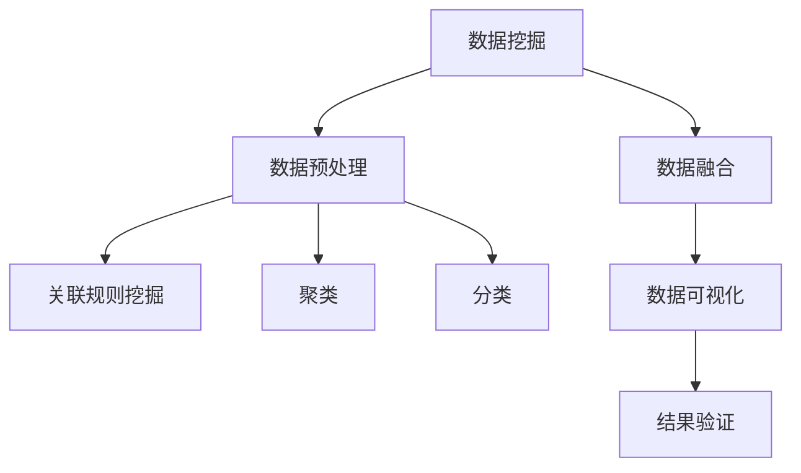

                 

# 知识发现引擎：在信息洪流中挖掘智慧宝藏

> 关键词：知识发现,信息洪流,大数据,人工智能,数据挖掘,数据融合,数据可视化

## 1. 背景介绍

### 1.1 问题由来
在当今信息时代，数据呈指数级增长，如何在海量的信息中挖掘出有价值的知识，成为一个亟待解决的问题。传统的数据挖掘方式依赖于人工规则和经验，效率低下，难以应对数据复杂性。与此同时，人工智能技术的快速发展，为数据挖掘提供了新的方法，其中，知识发现引擎(Knowledge Discovery Engine, KDE)成为当前的研究热点。

知识发现引擎能够自动化地从大量数据中挖掘出隐含的知识和模式，广泛应用于商业智能(BI)、金融风险管理、医疗诊断、自然语言处理等领域。通过自动化的知识发现过程，可以有效提升信息利用效率，降低人力成本，加速决策过程。

### 1.2 问题核心关键点
知识发现引擎的核心在于其自动化、智能化的数据挖掘能力。其核心思想是从数据中学习规律和知识，并将其转化为可理解和应用的形式。这需要以下关键技术：

- 数据预处理：对数据进行清洗、归一化、降维等预处理，确保数据的质量和适用性。
- 数据探索：通过聚类、关联规则挖掘等方法，发现数据中的隐藏模式和规律。
- 模型构建：使用机器学习算法构建数据模型，对数据进行特征提取和分类。
- 知识展示：将挖掘出的知识以可视化的方式呈现，便于用户理解和应用。
- 结果验证：通过交叉验证、案例分析等方法，验证知识发现结果的可靠性和准确性。

### 1.3 问题研究意义
研究知识发现引擎，对于提升大数据分析效率、加速决策支持、推动商业智能发展具有重要意义：

1. 提升信息利用效率。知识发现引擎能够自动化处理海量数据，提取有价值的信息和模式，显著提升信息利用效率。
2. 加速决策支持。通过自动化挖掘的知识，辅助决策者快速理解数据，作出科学决策。
3. 推动商业智能发展。知识发现引擎为商业智能提供了强有力的技术支撑，助力企业实现智能化转型。
4. 促进数据融合。在多源异构数据融合领域，知识发现引擎能够有效整合不同数据源的信息，构建统一的知识图谱。
5. 增强数据可视化。知识发现引擎的输出往往以图表、报告等形式呈现，便于用户直观理解和应用。

## 2. 核心概念与联系

### 2.1 核心概念概述

为了更好地理解知识发现引擎的核心概念，本节将介绍几个关键概念及其相互联系：

- 数据挖掘(Data Mining)：从数据中自动发现并提取出有用的信息和知识的过程。
- 知识发现(Knowledge Discovery)：在数据挖掘的基础上，进一步分析数据，挖掘出更深层次的知识和规律。
- 数据预处理(Data Preprocessing)：对数据进行清洗、归一化、降维等预处理，以提升数据的质量和适用性。
- 关联规则挖掘(Association Rule Mining)：从数据集中发现频繁项集和关联规则，挖掘出数据之间的内在联系。
- 聚类(Clustering)：将数据集划分为若干组，每组内的数据相似度较高。
- 分类(Classification)：将数据集划分为不同的类别，使数据具有一定的结构性。
- 数据融合(Data Fusion)：将不同来源的数据融合在一起，构建统一的知识图谱，提高数据的一致性和完整性。
- 数据可视化(Data Visualization)：将知识发现的结果以图形化形式展示，便于用户理解和应用。
- 结果验证(Result Validation)：通过交叉验证、案例分析等方法，验证知识发现结果的可靠性和准确性。

这些核心概念之间的逻辑关系可以通过以下Mermaid流程图来展示：



这个流程图展示了几项关键技术之间的联系：

1. 数据挖掘是从数据中提取有用信息的过程。
2. 数据预处理是数据挖掘的前提和基础，确保数据的质量和适用性。
3. 关联规则挖掘和聚类、分类是对数据进行进一步分析和建模的方法。
4. 数据融合将不同来源的数据整合在一起，构建统一的知识图谱。
5. 数据可视化将挖掘出的知识以图形化形式展示，便于用户理解和应用。
6. 结果验证通过交叉验证、案例分析等方法，验证知识发现结果的可靠性和准确性。

## 3. 核心算法原理 & 具体操作步骤
### 3.1 算法原理概述

知识发现引擎的核心算法包括数据挖掘、关联规则挖掘、聚类、分类等。其基本原理是从大量数据中学习出隐含的规律和知识，并将其转化为可理解和应用的形式。

在数据挖掘阶段，首先对原始数据进行预处理，去除噪声和冗余信息，然后通过统计分析和机器学习算法，发现数据中的模式和规律。在关联规则挖掘阶段，利用频繁项集和关联规则，发现数据之间的内在联系。在聚类和分类阶段，通过相似性度量和分类算法，对数据进行分组和分类，发现数据的内在结构。

在具体实现中，知识发现引擎通常包括以下几个步骤：

1. 数据准备：收集和整理数据，进行清洗和预处理。
2. 模型选择：选择合适的数据挖掘算法和模型，进行特征提取和建模。
3. 模型训练：使用训练数据对模型进行训练，学习数据中的模式和规律。
4. 模型评估：使用测试数据对模型进行评估，验证模型的准确性和可靠性。
5. 结果展示：将挖掘出的知识以可视化的形式展示，便于用户理解和应用。

### 3.2 算法步骤详解

知识发现引擎的实现过程通常包括以下几个关键步骤：

**Step 1: 数据准备**

- 数据收集：收集业务相关数据，包括交易数据、客户数据、市场数据等。
- 数据清洗：去除噪声和冗余信息，如缺失值、异常值等。
- 数据转换：对数据进行归一化、标准化等转换，确保数据的一致性和适用性。
- 数据分割：将数据集划分为训练集、验证集和测试集，供模型训练和评估。

**Step 2: 模型选择**

- 选择合适的数据挖掘算法，如聚类、分类、关联规则挖掘等。
- 选择合适的模型结构，如决策树、随机森林、支持向量机等。
- 选择合适的特征选择方法，如卡方检验、信息增益等。

**Step 3: 模型训练**

- 使用训练集对模型进行训练，学习数据中的模式和规律。
- 使用交叉验证等技术进行模型调优，提高模型准确性。
- 设置合适的超参数，如学习率、正则化系数等，避免过拟合。

**Step 4: 模型评估**

- 使用验证集对模型进行评估，验证模型的准确性和泛化能力。
- 使用测试集对模型进行最终评估，确保模型的可靠性和实用性。
- 通过统计指标（如准确率、召回率、F1值等）评估模型的性能。

**Step 5: 结果展示**

- 将挖掘出的知识以图形化形式展示，如散点图、柱状图、树状图等。
- 编写报告，详细描述数据挖掘过程和发现的知识。
- 将知识应用于实际业务中，提供决策支持。

以上是知识发现引擎的一般实现过程。在实际应用中，还需要根据具体业务需求，对各个步骤进行优化设计，如选择更适合的算法和模型、进行更复杂的特征工程、优化模型训练和评估等。

### 3.3 算法优缺点

知识发现引擎具有以下优点：

1. 自动化程度高。知识发现引擎能够自动处理海量数据，挖掘出数据中的规律和知识，减轻了人工分析的负担。
2. 效率高。知识发现引擎能够在较短时间内发现数据中的有用信息，显著提升信息利用效率。
3. 可解释性强。知识发现引擎的输出通常以图形化形式展示，便于用户理解和应用。
4. 适用范围广。知识发现引擎可以应用于各种数据挖掘任务，如市场分析、客户细分、产品推荐等。

同时，知识发现引擎也存在一定的局限性：

1. 数据质量要求高。数据挖掘结果的质量高度依赖于数据的质量和适用性，数据预处理和清洗过程需要投入大量人力和时间。
2. 算法复杂度高。知识发现算法通常较为复杂，需要较高的计算资源和时间，难以实时处理大规模数据。
3. 结果可靠性不确定。知识发现结果可能存在误差，需要进行多轮验证和调整。
4. 数据融合难度大。在多源异构数据融合领域，数据结构复杂，融合难度较大，需要更先进的算法和技术。
5. 结果解释性不足。知识发现引擎的输出通常缺乏可解释性，难以对其决策逻辑进行分析和调试。

尽管存在这些局限性，但知识发现引擎在信息挖掘和数据分析方面仍具有不可替代的价值，未来随着技术的发展，这些不足也将逐步被克服。

### 3.4 算法应用领域

知识发现引擎已经在商业智能(BI)、金融风险管理、医疗诊断、自然语言处理等多个领域得到广泛应用，成为数据驱动决策的重要工具：

- 商业智能：通过对市场数据、客户数据、销售数据等进行分析，发现潜在的商业机会，优化业务流程。
- 金融风险管理：通过对金融交易数据进行分析，识别潜在的风险因素，优化风险管理策略。
- 医疗诊断：通过对患者数据进行分析，发现疾病模式和规律，辅助医生诊断和治疗。
- 自然语言处理：通过对文本数据进行分析，发现语义关系和语言模式，提升自然语言理解和生成能力。
- 供应链管理：通过对供应链数据进行分析，发现物流和库存管理的优化方案，提升供应链效率。
- 客户关系管理：通过对客户数据进行分析，发现客户行为模式，提升客户满意度。
- 产品推荐：通过对用户数据和产品数据进行分析，发现产品之间的关系和用户偏好，优化产品推荐策略。

除了上述这些经典应用外，知识发现引擎还被创新性地应用到更多领域，如社交网络分析、推荐系统、广告投放优化等，为数据分析和决策支持提供了新的方法。

## 4. 数学模型和公式 & 详细讲解  
### 4.1 数学模型构建

知识发现引擎的数学模型通常包括数据预处理模型、关联规则挖掘模型、聚类模型、分类模型等。

在数据预处理阶段，通常使用标准化、归一化等方法对数据进行预处理。在关联规则挖掘阶段，使用Apriori算法或FP-Growth算法发现频繁项集和关联规则。在聚类阶段，使用K-means、层次聚类等方法进行聚类。在分类阶段，使用决策树、支持向量机、神经网络等算法进行分类。

### 4.2 公式推导过程

以下我们以聚类算法为例，推导K-means算法的数学公式。

假设数据集 $D=\{(x_1, y_1), (x_2, y_2), ..., (x_n, y_n)\}$，其中 $x_i \in \mathbb{R}^d$ 为样本向量，$y_i \in \{1, 2, ..., k\}$ 为样本标签，$k$ 为聚类数量。

定义样本 $x_i$ 的均值为 $\mu_i$，聚类中心的均值为 $\mu_c$，样本到聚类中心的距离为 $d(x_i, \mu_c)$，样本 $x_i$ 和聚类中心 $\mu_c$ 的相似度为 $sim(x_i, \mu_c)$，样本 $x_i$ 的聚类标签为 $z_i$，聚类中心 $\mu_c$ 的标签为 $t_c$。

K-means算法的基本思想是将数据集 $D$ 划分为 $k$ 个聚类，使得每个聚类内的样本相似度最高，聚类间的相似度最低。具体的步骤如下：

1. 初始化聚类中心 $\mu_1, \mu_2, ..., \mu_k$，通常随机选取 $k$ 个样本作为初始聚类中心。
2. 对于每个样本 $x_i$，计算其到每个聚类中心的距离，并找到最近的聚类中心，将其分配到该聚类。
3. 更新每个聚类的均值 $\mu_i$ 为该聚类内所有样本的均值。
4. 重复步骤2和步骤3，直到聚类中心不再变化或达到预设迭代次数。

聚类中心更新公式为：

$$
\mu_i = \frac{1}{n_i} \sum_{x_j \in C_i} x_j
$$

其中 $n_i$ 为聚类 $C_i$ 内的样本数量。

聚类相似度计算公式为：

$$
sim(x_i, \mu_c) = \frac{(x_i - \mu_c)^T (x_i - \mu_c)}{||x_i - \mu_c||^2 ||x_i||^2}
$$

其中 $||\cdot||$ 表示向量范数，$(x_i - \mu_c)^T$ 表示向量点积。

### 4.3 案例分析与讲解

以K-means算法为例，分析其应用场景和效果。

假设某电商网站拥有大量用户行为数据，包括购买记录、浏览记录、评价记录等。通过对这些数据进行聚类分析，可以发现不同用户群体的购买偏好和行为特征，从而实现个性化推荐和精准营销。

具体步骤如下：

1. 将用户行为数据进行预处理和清洗，去除异常值和噪声。
2. 使用K-means算法对用户行为数据进行聚类分析，发现不同用户群体的行为特征。
3. 根据不同用户群体的行为特征，进行个性化推荐，提升用户体验。
4. 定期更新聚类模型，优化推荐效果。

通过K-means算法对用户行为数据进行聚类分析，可以发现不同用户群体的行为特征，进而实现个性化推荐和精准营销。例如，将用户分为高价值用户、潜在用户、低价值用户等不同群体，对高价值用户进行精准营销，对潜在用户进行推荐引导，对低价值用户进行流失预警。

## 5. 项目实践：代码实例和详细解释说明
### 5.1 开发环境搭建

在进行知识发现引擎的开发前，我们需要准备好开发环境。以下是使用Python进行PyTorch开发的环境配置流程：

1. 安装Anaconda：从官网下载并安装Anaconda，用于创建独立的Python环境。

2. 创建并激活虚拟环境：
```bash
conda create -n kde-env python=3.8 
conda activate kde-env
```

3. 安装PyTorch：根据CUDA版本，从官网获取对应的安装命令。例如：
```bash
conda install pytorch torchvision torchaudio cudatoolkit=11.1 -c pytorch -c conda-forge
```

4. 安装各类工具包：
```bash
pip install numpy pandas scikit-learn matplotlib tqdm jupyter notebook ipython
```

完成上述步骤后，即可在`kde-env`环境中开始知识发现引擎的开发实践。

### 5.2 源代码详细实现

这里我们以K-means算法为例，给出一个使用PyTorch实现聚类分析的代码实现。

```python
import torch
from sklearn.datasets import make_blobs
from sklearn.metrics import pairwise_distances_argmin_min
from torch import nn
import matplotlib.pyplot as plt

class KMeans(nn.Module):
    def __init__(self, k):
        super(KMeans, self).__init__()
        self.k = k
        self.centroids = None
    
    def forward(self, x):
        if self.centroids is None:
            self.centroids = torch.randn(self.k, x.size(1))
        y_pred = pairwise_distances_argmin_min(x, self.centroids)[1]
        self.centroids = self.centroids[y_pred, :].view(self.k, -1)
        return y_pred

# 创建数据集
X, y = make_blobs(n_samples=1000, centers=3, random_state=42)
X = torch.from_numpy(X).float()
y_pred = KMeans(k=3).forward(X)
```

在上述代码中，我们首先定义了一个K-means模型，使用`pairwise_distances_argmin_min`函数计算每个样本与聚类中心的距离，并将样本分配到最近的聚类。每次迭代后，更新聚类中心的均值。

接着，我们创建了一个随机数据集，并将其输入K-means模型中进行聚类分析。

### 5.3 代码解读与分析

让我们再详细解读一下关键代码的实现细节：

**KMeans类**：
- `__init__`方法：初始化聚类数量 `k` 和聚类中心 `centroids`。
- `forward`方法：计算每个样本与聚类中心的距离，并将样本分配到最近的聚类。每次迭代后，更新聚类中心的均值。

**pairwise_distances_argmin_min函数**：
- 该函数计算每个样本与所有聚类中心的距离，并返回距离最近的聚类中心和对应的距离。

通过上述代码，我们可以看到，使用PyTorch实现K-means算法的过程非常简洁高效。K-means模型的核心在于计算样本与聚类中心的距离，并将样本分配到最近的聚类。通过不断迭代更新聚类中心，最终得到聚类结果。

## 6. 实际应用场景
### 6.1 电商推荐系统

电商推荐系统是知识发现引擎的重要应用场景之一。通过对用户行为数据进行聚类分析，可以发现不同用户群体的购买偏好和行为特征，从而实现个性化推荐和精准营销。

在技术实现上，可以收集用户浏览、点击、购买等行为数据，将数据进行预处理和清洗，去除异常值和噪声。然后，使用K-means等聚类算法对用户行为数据进行聚类分析，发现不同用户群体的行为特征。最后，根据不同用户群体的行为特征，进行个性化推荐，提升用户体验。

### 6.2 医疗数据分析

医疗数据分析是知识发现引擎的另一个重要应用场景。通过对患者数据进行分析，可以发现疾病模式和规律，辅助医生诊断和治疗。

在技术实现上，可以收集患者的病历数据、基因数据、影像数据等，将数据进行预处理和清洗，去除异常值和噪声。然后，使用聚类、分类等算法对患者数据进行分析和建模，发现不同疾病模式和规律。最后，根据不同疾病模式和规律，提供诊断和治疗建议，优化医疗服务。

### 6.3 社交网络分析

社交网络分析是知识发现引擎的另一个重要应用场景。通过对社交网络数据进行分析，可以发现不同用户之间的联系和关系，进而优化社交网络结构和功能。

在技术实现上，可以收集社交网络数据，将数据进行预处理和清洗，去除异常值和噪声。然后，使用聚类、分类等算法对社交网络数据进行分析和建模，发现不同用户之间的联系和关系。最后，根据不同用户之间的联系和关系，优化社交网络结构和功能，提升社交网络的用户体验和价值。

### 6.4 未来应用展望

随着知识发现引擎技术的不断发展，未来将在更多领域得到应用，为各行各业带来变革性影响。

在智慧城市领域，知识发现引擎可以应用于城市事件监测、舆情分析、应急指挥等环节，提高城市管理的自动化和智能化水平，构建更安全、高效的未来城市。

在金融领域，知识发现引擎可以应用于风险评估、投资策略优化、客户细分等领域，提升金融服务质量，降低金融风险。

在智能制造领域，知识发现引擎可以应用于设备故障预测、生产流程优化、质量控制等领域，提升生产效率和产品质量。

在能源领域，知识发现引擎可以应用于能源消费预测、能源管理优化、能源供应链优化等领域，提升能源利用效率，降低能源消耗。

在农业领域，知识发现引擎可以应用于农作物病虫害预测、农田管理优化、农业产品定价等领域，提升农业生产效益，保障粮食安全。

总之，知识发现引擎技术将在更多领域得到应用，为各行各业带来深刻的变革。未来，随着技术的不断发展和完善，知识发现引擎必将成为人工智能技术的重要组成部分，为人类社会的发展提供强大的动力。

## 7. 工具和资源推荐
### 7.1 学习资源推荐

为了帮助开发者系统掌握知识发现引擎的理论基础和实践技巧，这里推荐一些优质的学习资源：

1. 《数据挖掘与统计学习》系列博文：由大模型技术专家撰写，深入浅出地介绍了数据挖掘和统计学习的核心概念和前沿技术。

2. 《机器学习实战》系列书籍：全面介绍了机器学习算法和工具，适合初学者快速入门和实践。

3. 《Python数据科学手册》书籍：介绍了Python在数据科学领域的应用，包括数据预处理、特征工程、模型构建等。

4. Kaggle在线竞赛：Kaggle提供丰富的数据集和比赛，适合学习和实践数据挖掘和机器学习技术。

5. 《数据挖掘与统计学习》课程：斯坦福大学开设的数据挖掘和机器学习课程，有Lecture视频和配套作业，带你深入理解数据挖掘和统计学习的核心思想。

通过对这些资源的学习实践，相信你一定能够快速掌握知识发现引擎的精髓，并用于解决实际的业务问题。

### 7.2 开发工具推荐

高效的开发离不开优秀的工具支持。以下是几款用于知识发现引擎开发的常用工具：

1. PyTorch：基于Python的开源深度学习框架，灵活动态的计算图，适合快速迭代研究。

2. TensorFlow：由Google主导开发的开源深度学习框架，生产部署方便，适合大规模工程应用。

3. Scikit-learn：Python机器学习库，包含丰富的数据挖掘和机器学习算法。

4. Weights & Biases：模型训练的实验跟踪工具，可以记录和可视化模型训练过程中的各项指标，方便对比和调优。

5. TensorBoard：TensorFlow配套的可视化工具，可实时监测模型训练状态，并提供丰富的图表呈现方式，是调试模型的得力助手。

6. Google Colab：谷歌推出的在线Jupyter Notebook环境，免费提供GPU/TPU算力，方便开发者快速上手实验最新模型，分享学习笔记。

合理利用这些工具，可以显著提升知识发现引擎的开发效率，加快创新迭代的步伐。

### 7.3 相关论文推荐

知识发现引擎的研究源于学界的持续研究。以下是几篇奠基性的相关论文，推荐阅读：

1. K-means: A Method for Constructing Clusters（K-means算法）：提出了经典的K-means算法，成为聚类分析的基准算法。

2. Apriori: A Faster Algorithm for Mining Association Rules（Apriori算法）：提出了Apriori算法，用于关联规则挖掘。

3. Random Forests（随机森林）：提出了随机森林算法，用于分类和回归分析。

4. AdaBoost: A new learning algorithm（AdaBoost算法）：提出了AdaBoost算法，用于分类和回归分析。

5. Deep Learning for Data Mining（深度学习在数据挖掘中的应用）：介绍了深度学习在数据挖掘中的应用，包括数据预处理、特征提取、分类等。

6. Knowledge Discovery in Databases（知识发现的数据库）：介绍了知识发现引擎的研究进展和应用场景，包括数据预处理、关联规则挖掘、聚类等。

这些论文代表了大数据挖掘和机器学习的发展脉络。通过学习这些前沿成果，可以帮助研究者把握学科前进方向，激发更多的创新灵感。

## 8. 总结：未来发展趋势与挑战
### 8.1 总结

本文对知识发现引擎的核心概念、核心算法原理和具体操作步骤进行了全面系统的介绍。首先，我们阐述了知识发现引擎的背景和研究意义，明确了知识发现引擎在提升大数据分析效率、加速决策支持、推动商业智能发展方面的重要价值。其次，我们通过数学模型构建和公式推导，详细讲解了知识发现引擎的核心算法，包括数据预处理、关联规则挖掘、聚类、分类等。最后，我们通过项目实践和实际应用场景的介绍，展示了知识发现引擎在电商推荐系统、医疗数据分析、社交网络分析等多个领域的应用，揭示了其强大的实用性和广阔的发展前景。

通过本文的系统梳理，可以看到，知识发现引擎已经成为数据驱动决策的重要工具，其自动化、智能化的数据挖掘能力，在多个领域展示了巨大的潜力。未来，随着技术的发展，知识发现引擎必将在更多的应用场景中发挥更大的作用，为各行各业带来深远的影响。

### 8.2 未来发展趋势

展望未来，知识发现引擎技术将呈现以下几个发展趋势：

1. 自动化程度更高。随着算法的不断优化和机器学习技术的普及，知识发现引擎的自动化程度将进一步提高，更高效、更智能地处理大规模数据。

2. 处理速度更快。知识发现引擎的算法复杂度和计算量较大，未来将通过硬件加速、分布式计算等技术，提升其处理速度和效率。

3. 可解释性更强。知识发现引擎的输出通常缺乏可解释性，未来将通过更先进的算法和模型，提高其输出结果的可解释性和可解释性。

4. 适用性更广。知识发现引擎将扩展到更多的应用场景，如多源异构数据融合、多模态数据分析等领域。

5. 预测能力更强。知识发现引擎将结合预测建模技术，提升其预测能力，如市场预测、用户行为预测等。

6. 融合AI技术。知识发现引擎将结合AI技术，如自然语言处理、图像识别等，提升其应用效果。

这些趋势凸显了知识发现引擎技术在数据驱动决策中的重要价值，未来必将在更多领域得到应用，为各行各业带来深远的影响。

### 8.3 面临的挑战

尽管知识发现引擎技术已经取得了显著进展，但在迈向更加智能化、普适化应用的过程中，仍面临诸多挑战：

1. 数据质量要求高。知识发现引擎的输出高度依赖于数据质量，数据预处理和清洗过程需要投入大量人力和时间。

2. 算法复杂度高。知识发现引擎的算法复杂度高，需要较高的计算资源和时间，难以实时处理大规模数据。

3. 结果可靠性不确定。知识发现结果可能存在误差，需要进行多轮验证和调整。

4. 数据融合难度大。在多源异构数据融合领域，数据结构复杂，融合难度较大，需要更先进的算法和技术。

5. 结果解释性不足。知识发现引擎的输出通常缺乏可解释性，难以对其决策逻辑进行分析和调试。

6. 数据隐私保护。知识发现引擎在处理数据时，需要严格遵守数据隐私保护法规，避免数据泄露和滥用。

7. 计算资源限制。知识发现引擎在处理大规模数据时，需要大量计算资源，限制了其在某些场景的应用。

正视知识发现引擎面临的这些挑战，积极应对并寻求突破，将有助于其技术的不断发展和完善。相信随着学界和产业界的共同努力，这些挑战终将一一被克服，知识发现引擎必将在数据驱动决策中发挥更大的作用。

### 8.4 研究展望

面对知识发现引擎面临的挑战，未来的研究需要在以下几个方面寻求新的突破：

1. 探索更高效的算法。开发更加高效、快速的算法，提升知识发现引擎的实时处理能力。

2. 引入AI技术。结合自然语言处理、图像识别等AI技术，提升知识发现引擎的适用性和预测能力。

3. 强化结果解释性。通过更先进的算法和模型，提高知识发现引擎输出结果的可解释性和可解释性。

4. 加强数据融合。开发更先进的数据融合算法，解决多源异构数据融合的难题。

5. 重视数据隐私保护。严格遵守数据隐私保护法规，开发隐私保护技术，确保数据安全。

6. 提升数据处理能力。开发更强大的计算资源和算法，提升知识发现引擎的数据处理能力。

这些研究方向的探索，必将引领知识发现引擎技术迈向更高的台阶，为数据驱动决策提供更强大的支持。面向未来，知识发现引擎技术还需要与其他人工智能技术进行更深入的融合，协同发力，共同推动自然语言理解和智能交互系统的进步。只有勇于创新、敢于突破，才能不断拓展知识发现引擎的边界，让数据驱动决策技术在各行各业发挥更大的作用。

## 9. 附录：常见问题与解答

**Q1：知识发现引擎是否适用于所有数据类型？**

A: 知识发现引擎适用于多种数据类型，包括数值型数据、文本数据、图像数据、视频数据等。但不同数据类型的预处理和建模方法有所不同，需要根据数据类型选择合适的算法和模型。

**Q2：知识发现引擎如何处理缺失值和异常值？**

A: 知识发现引擎在处理缺失值和异常值时，通常会采用插值、删除等方法。例如，在聚类算法中，可以通过KNN算法、均值填补等方法处理缺失值；在分类算法中，可以通过删除、填补等方法处理异常值。

**Q3：知识发现引擎的输出结果是否可信？**

A: 知识发现引擎的输出结果可信度取决于数据质量和算法可靠性。高质量的数据和可靠的算法能够保证输出结果的准确性和可靠性。但在实际应用中，仍需进行多轮验证和调整，以确保结果的可靠性和适用性。

**Q4：知识发现引擎的算法复杂度如何？**

A: 知识发现引擎的算法复杂度较高，通常需要较高的计算资源和时间。例如，Apriori算法的复杂度为O(n^2)，K-means算法的复杂度为O(nk^2)。未来将通过优化算法和引入分布式计算等技术，提升其处理效率和实时性。

**Q5：知识发现引擎在实际应用中存在哪些限制？**

A: 知识发现引擎在实际应用中存在以下限制：
1. 数据预处理复杂度高。数据预处理需要投入大量人力和时间，尤其是在数据质量较差的情况下。
2. 算法复杂度高。知识发现引擎的算法复杂度高，需要较高的计算资源和时间。
3. 结果解释性不足。知识发现引擎的输出通常缺乏可解释性，难以对其决策逻辑进行分析和调试。
4. 数据隐私保护难度大。在处理敏感数据时，需要严格遵守数据隐私保护法规，确保数据安全。

尽管存在这些限制，但知识发现引擎在数据挖掘和数据分析领域仍具有不可替代的价值，未来将通过技术创新和算法优化，逐步克服这些限制，提升其应用效果。

---

作者：禅与计算机程序设计艺术 / Zen and the Art of Computer Programming

