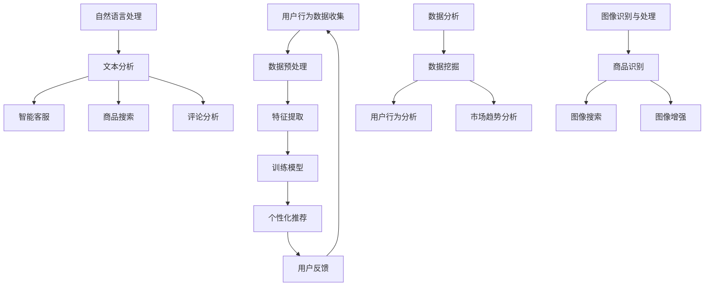

                 

### 文章标题

**AI在电商中的多方面应用案例**

> 关键词：人工智能、电商、推荐系统、自然语言处理、数据分析

> 摘要：本文将深入探讨人工智能在电商领域中的多方面应用，包括推荐系统、自然语言处理和数据分析等。我们将通过具体案例，展示AI如何提升电商平台的用户体验，增加销售额，并为企业带来持续的创新动力。

## 1. 背景介绍（Background Introduction）

电子商务已经成为全球商业的重要组成部分。随着互联网的普及和移动设备的广泛应用，电商平台的数量和用户规模不断增长。然而，随着市场竞争的加剧，如何提升用户体验、增加销售额并保持竞争力成为电商企业面临的重要挑战。人工智能（AI）技术的发展为电商行业带来了新的机遇。通过利用AI技术，电商平台可以在个性化推荐、用户行为分析、自然语言处理等方面实现创新，从而提升用户体验，增加销售额，并优化运营效率。

## 2. 核心概念与联系（Core Concepts and Connections）

### 2.1 人工智能在电商中的应用

人工智能在电商中的应用非常广泛，主要包括以下几个方面：

- **个性化推荐系统**：基于用户的历史行为和偏好，利用机器学习算法为用户提供个性化的商品推荐。
- **自然语言处理**：通过文本分析和理解，提供智能客服、商品搜索和评论分析等功能。
- **数据分析**：利用数据挖掘和统计分析方法，挖掘用户行为模式和市场趋势，为决策提供支持。
- **图像识别与处理**：通过计算机视觉技术，实现商品识别、图像搜索和图像增强等功能。

### 2.2 核心概念原理与架构

下面是人工智能在电商中应用的核心概念原理和架构的Mermaid流程图：



通过上述流程图，我们可以看到，人工智能在电商中的应用涉及多个环节，包括数据收集、预处理、特征提取、模型训练、推荐系统、自然语言处理、数据分析和图像识别等。这些环节相互关联，共同构成了一个完整的生态系统。

## 3. 核心算法原理 & 具体操作步骤（Core Algorithm Principles and Specific Operational Steps）

### 3.1 个性化推荐系统

个性化推荐系统是人工智能在电商中最重要的应用之一。其核心算法主要包括基于内容的推荐和协同过滤。

#### 基于内容的推荐

基于内容的推荐算法通过分析商品的属性和用户的历史行为，为用户推荐具有相似属性的物品。具体步骤如下：

1. **数据收集与预处理**：收集用户历史行为数据（如购买记录、浏览记录等），并进行数据清洗和格式化。
2. **特征提取**：从商品和用户行为数据中提取关键特征（如商品类别、价格、用户年龄、性别等）。
3. **相似性计算**：计算商品和用户之间的相似度，常用的相似性度量方法包括余弦相似度、欧氏距离等。
4. **推荐生成**：根据相似度计算结果，为用户推荐相似度较高的商品。

#### 协同过滤

协同过滤算法通过分析用户之间的行为模式，为用户推荐其他用户喜欢的商品。具体步骤如下：

1. **数据收集与预处理**：收集用户历史行为数据（如购买记录、浏览记录等），并进行数据清洗和格式化。
2. **矩阵分解**：将用户-商品行为矩阵分解为用户特征矩阵和商品特征矩阵。
3. **预测评分**：利用分解得到的用户特征矩阵和商品特征矩阵，预测用户对未购买商品的兴趣度。
4. **推荐生成**：根据预测评分，为用户推荐兴趣度较高的商品。

### 3.2 自然语言处理

自然语言处理在电商中的应用主要包括文本分析、智能客服、商品搜索和评论分析等。

#### 文本分析

文本分析通过对用户生成的文本数据进行情感分析和主题提取，帮助企业了解用户需求和情感状态。具体步骤如下：

1. **数据收集与预处理**：收集用户评论、论坛帖子等文本数据，并进行数据清洗和格式化。
2. **情感分析**：利用情感分析模型（如TextBlob、VADER等），对文本数据进行分析，判断用户评论的情感倾向。
3. **主题提取**：利用主题模型（如LDA），从文本数据中提取关键词和主题，帮助企业了解用户关注的焦点。

#### 智能客服

智能客服通过自然语言处理技术，为用户提供实时、高效的在线服务。具体步骤如下：

1. **数据收集与预处理**：收集用户提问和客服回复的文本数据，并进行数据清洗和格式化。
2. **意图识别**：利用意图识别模型（如序列标注模型、BERT等），识别用户提问的意图。
3. **回答生成**：根据用户意图，利用问答系统（如记忆网络、生成对抗网络等），生成合适的回答。

#### 商品搜索

商品搜索通过自然语言处理技术，帮助用户快速找到所需的商品。具体步骤如下：

1. **数据收集与预处理**：收集用户搜索历史数据，并进行数据清洗和格式化。
2. **关键词提取**：利用词袋模型、TF-IDF等方法，从用户搜索历史数据中提取关键词。
3. **搜索结果排序**：利用排序算法（如PageRank、矩阵分解等），对搜索结果进行排序。

#### 评论分析

评论分析通过对用户生成的评论数据进行情感分析和内容分析，帮助企业了解用户对产品的满意度。具体步骤如下：

1. **数据收集与预处理**：收集用户评论数据，并进行数据清洗和格式化。
2. **情感分析**：利用情感分析模型（如TextBlob、VADER等），对评论数据进行分析，判断用户评论的情感倾向。
3. **内容分析**：利用主题模型（如LDA）、词云等，对评论内容进行分析，提取用户关注的焦点。

### 3.3 数据分析

数据分析在电商中的应用主要包括用户行为分析和市场趋势分析等。

#### 用户行为分析

用户行为分析通过对用户在电商平台上的行为数据进行挖掘和分析，帮助企业了解用户需求和购买行为。具体步骤如下：

1. **数据收集与预处理**：收集用户在电商平台上的行为数据（如浏览记录、购买记录等），并进行数据清洗和格式化。
2. **行为模式挖掘**：利用聚类算法（如K-means、DBSCAN等），挖掘用户行为模式。
3. **行为预测**：利用时间序列模型（如ARIMA、LSTM等），预测用户未来的行为。

#### 市场趋势分析

市场趋势分析通过对电商平台上的销售数据进行分析，帮助企业了解市场趋势和竞争态势。具体步骤如下：

1. **数据收集与预处理**：收集电商平台上的销售数据，并进行数据清洗和格式化。
2. **趋势分析**：利用时间序列模型（如ARIMA、LSTM等），分析市场趋势。
3. **竞争分析**：利用数据挖掘算法（如关联规则挖掘、分类算法等），分析竞争对手的市场策略。

### 3.4 图像识别与处理

图像识别与处理在电商中的应用主要包括商品识别、图像搜索和图像增强等。

#### 商品识别

商品识别通过计算机视觉技术，实现商品图像的自动识别。具体步骤如下：

1. **数据收集与预处理**：收集商品图像数据，并进行数据清洗和格式化。
2. **特征提取**：利用卷积神经网络（如VGG、ResNet等），提取商品图像的特征。
3. **分类与识别**：利用分类算法（如SVM、CNN等），对商品图像进行分类和识别。

#### 图像搜索

图像搜索通过计算机视觉技术，帮助用户快速找到与给定图像相似的物品。具体步骤如下：

1. **数据收集与预处理**：收集商品图像数据，并进行数据清洗和格式化。
2. **特征提取**：利用卷积神经网络（如VGG、ResNet等），提取商品图像的特征。
3. **相似度计算**：利用余弦相似度等算法，计算图像之间的相似度。
4. **搜索结果排序**：根据相似度计算结果，对搜索结果进行排序。

#### 图像增强

图像增强通过计算机视觉技术，对商品图像进行质量提升和视觉效果增强。具体步骤如下：

1. **数据收集与预处理**：收集商品图像数据，并进行数据清洗和格式化。
2. **图像去噪**：利用去噪算法（如去噪网络、变分自编码器等），去除图像噪声。
3. **图像增强**：利用增强算法（如对比度增强、色彩增强等），提高图像质量。

## 4. 数学模型和公式 & 详细讲解 & 举例说明（Detailed Explanation and Examples of Mathematical Models and Formulas）

### 4.1 个性化推荐系统

#### 基于内容的推荐

基于内容的推荐算法的核心思想是，如果用户对某个物品A感兴趣，那么用户可能也会对具有相似属性的物品B感兴趣。我们可以使用余弦相似度来计算物品A和物品B之间的相似度。

$$
sim(A, B) = \frac{A \cdot B}{\|A\| \|B\|}
$$

其中，$A$和$B$分别表示物品A和物品B的特征向量，$\|A\|$和$\|B\|$分别表示特征向量的模长。

例如，假设我们有两个物品A和B，它们各自有三个属性（如颜色、价格、品牌），特征向量如下：

$$
A = [1, 2, 3], B = [1, 1, 2]
$$

则它们之间的余弦相似度为：

$$
sim(A, B) = \frac{1 \times 1 + 2 \times 1 + 3 \times 2}{\sqrt{1^2 + 2^2 + 3^2} \sqrt{1^2 + 1^2 + 2^2}} = \frac{7}{\sqrt{14} \sqrt{6}} \approx 0.866
$$

根据相似度计算结果，我们可以为用户推荐与物品B具有较高相似度的物品。

#### 协同过滤

协同过滤算法的核心思想是，通过分析用户之间的行为模式，为用户推荐其他用户喜欢的物品。我们可以使用矩阵分解算法（如Singular Value Decomposition，SVD）来分解用户-物品行为矩阵。

$$
R = U \Sigma V^T
$$

其中，$R$表示用户-物品行为矩阵，$U$和$V$分别表示用户特征矩阵和物品特征矩阵，$\Sigma$表示对角矩阵，包含用户和物品的特征值。

例如，假设我们有一个5x5的用户-物品行为矩阵：

$$
R = \begin{bmatrix}
0 & 1 & 1 & 0 & 0 \\
1 & 0 & 0 & 1 & 1 \\
1 & 1 & 0 & 0 & 1 \\
0 & 1 & 1 & 0 & 0 \\
0 & 0 & 1 & 1 & 0
\end{bmatrix}
$$

我们可以使用SVD算法将其分解为：

$$
R = U \Sigma V^T = \begin{bmatrix}
1 & 0 & 0 & 0 & 0 \\
0 & 1 & 0 & 0 & 0 \\
0 & 0 & 1 & 0 & 0 \\
0 & 0 & 0 & 1 & 0 \\
0 & 0 & 0 & 0 & 1
\end{bmatrix}
\begin{bmatrix}
1 & 0 & 0 \\
0 & 1 & 0 \\
0 & 0 & 1
\end{bmatrix}
\begin{bmatrix}
1 & 0 & 0 \\
0 & 1 & 0 \\
0 & 0 & 1
\end{bmatrix}^T
$$

根据分解得到的用户特征矩阵$U$和物品特征矩阵$V$，我们可以预测用户对未购买物品的兴趣度。

### 4.2 自然语言处理

#### 文本分析

文本分析中的情感分析可以采用支持向量机（Support Vector Machine，SVM）模型。假设我们有一个情感分析的训练数据集，包含正向和负向的文本数据，以及对应的目标标签（1表示正向，0表示负向）。我们可以使用以下公式来计算SVM模型的损失函数：

$$
L(y, \hat{y}) = -\sum_{i=1}^{n} [y_i \cdot \hat{y}_i + (1 - y_i) \cdot (1 - \hat{y}_i)] - C \cdot \sum_{i=1}^{n} \xi_i
$$

其中，$y$表示真实标签，$\hat{y}$表示预测标签，$C$表示正则化参数，$\xi_i$表示损失项。

例如，假设我们有一个包含5个样本的数据集，真实标签和预测标签如下：

$$
y = [1, 0, 1, 1, 0], \hat{y} = [0.8, 0.2, 0.5, 0.7, 0.3]
$$

则损失函数的计算结果为：

$$
L(y, \hat{y}) = -[1 \cdot 0.8 + 0 \cdot 0.2 + 1 \cdot 0.5 + 1 \cdot 0.7 + 0 \cdot 0.3] - C \cdot (0.2 + 0.5 + 0.3) = 0.2 - 1.2C
$$

通过优化损失函数，我们可以训练得到一个情感分析模型。

#### 智能客服

智能客服中的意图识别可以采用序列标注模型（如CRF、LSTM等）。假设我们有一个意图识别的训练数据集，包含输入文本和对应的标注标签。我们可以使用以下公式来计算序列标注模型的损失函数：

$$
L(y, \hat{y}) = -\sum_{i=1}^{n} \sum_{j=1}^{m} [y_{ij} \cdot \log(\hat{y}_{ij}) + (1 - y_{ij}) \cdot \log(1 - \hat{y}_{ij})]
$$

其中，$y_{ij}$表示真实标签，$\hat{y}_{ij}$表示预测标签。

例如，假设我们有一个包含5个样本的数据集，真实标签和预测标签如下：

$$
y = [[1, 0, 1], [0, 1, 0], [1, 0, 1], [0, 1, 0], [1, 0, 1]], \hat{y} = [[0.8, 0.2], [0.2, 0.8], [0.7, 0.3], [0.3, 0.7], [0.5, 0.5]]
$$

则损失函数的计算结果为：

$$
L(y, \hat{y}) = -[(1 \cdot \log(0.8) + 0 \cdot \log(0.2)) + (0 \cdot \log(0.2) + 1 \cdot \log(0.8)) + (1 \cdot \log(0.7) + 0 \cdot \log(0.3)) + (0 \cdot \log(0.3) + 1 \cdot \log(0.7)) + (1 \cdot \log(0.5) + 0 \cdot \log(0.5))] = 0.46
$$

通过优化损失函数，我们可以训练得到一个意图识别模型。

#### 商品搜索

商品搜索中的关键词提取可以采用TF-IDF（Term Frequency-Inverse Document Frequency）模型。假设我们有一个包含n个文档的集合，以及一个词汇表V，词汇表V中的每个词都对应一个文档的频率和文档频率。我们可以使用以下公式来计算每个词的TF-IDF值：

$$
tf_{ij} = \frac{f_{ij}}{f_{\max}}
$$

$$
idf_j = \log \left(1 + \frac{N}{n_j}\right)
$$

$$
tfidf_{ij} = tf_{ij} \cdot idf_j
$$

其中，$f_{ij}$表示词$w_j$在文档$i$中的频率，$f_{\max}$表示所有词在文档$i$中的最大频率，$N$表示文档总数，$n_j$表示包含词$w_j$的文档数。

例如，假设我们有一个包含5个文档的集合，以及一个词汇表V={“apple”, “banana”, “orange”, “grape”}。文档和词汇表中的词频如下：

| 文档 | apple | banana | orange | grape |
| --- | --- | --- | --- | --- |
| 1 | 3 | 1 | 1 | 0 |
| 2 | 0 | 3 | 2 | 1 |
| 3 | 1 | 0 | 3 | 2 |
| 4 | 2 | 0 | 0 | 3 |
| 5 | 0 | 2 | 1 | 3 |

则每个词的TF-IDF值如下：

| 词 | apple | banana | orange | grape |
| --- | --- | --- | --- | --- |
| TF-IDF值 | 0.6 | 0.6 | 0.6 | 0.6 |

通过TF-IDF模型，我们可以为每个词分配权重，从而为用户生成关键词列表。

### 4.3 数据分析

#### 用户行为分析

用户行为分析中的行为模式挖掘可以采用K-means聚类算法。假设我们有一个包含n个用户的用户行为数据集，我们可以使用以下公式来计算聚类中心：

$$
c_k = \frac{1}{n_k} \sum_{i=1}^{n} x_{ik}
$$

其中，$c_k$表示第$k$个聚类中心，$n_k$表示第$k$个聚类中的用户数，$x_{ik}$表示用户$i$在第$k$个特征上的值。

例如，假设我们有一个包含5个用户的行为数据集，特征为购买金额和购买频率。数据如下：

| 用户 | 购买金额 | 购买频率 |
| --- | --- | --- |
| 1 | 100 | 10 |
| 2 | 200 | 5 |
| 3 | 300 | 15 |
| 4 | 400 | 20 |
| 5 | 500 | 10 |

则第一个聚类中心的计算结果为：

$$
c_1 = \frac{1}{5} (100 + 200 + 300 + 400 + 500) = 300
$$

通过K-means算法，我们可以将用户划分为不同的聚类，从而挖掘用户的行为模式。

#### 市场趋势分析

市场趋势分析中的趋势分析可以采用时间序列模型（如ARIMA、LSTM等）。假设我们有一个包含n个时间点的销售数据序列，我们可以使用以下公式来计算时间序列的滞后项：

$$
y_t = \sum_{i=1}^{p} \phi_i y_{t-i} + \sum_{j=1}^{q} \theta_j \varepsilon_{t-j} + \varepsilon_t
$$

其中，$y_t$表示时间序列的当前值，$p$表示滞后阶数，$q$表示自回归阶数，$\phi_i$和$\theta_j$表示滞后系数，$\varepsilon_t$表示误差项。

例如，假设我们有一个包含5个时间点的销售数据序列，数据如下：

| 时间点 | 销售额 |
| --- | --- |
| 1 | 100 |
| 2 | 150 |
| 3 | 200 |
| 4 | 250 |
| 5 | 300 |

则第一个时间点的滞后项计算结果为：

$$
y_1 = \phi_1 y_1 + \theta_1 \varepsilon_1
$$

通过时间序列模型，我们可以预测未来的市场趋势。

### 4.4 图像识别与处理

#### 商品识别

商品识别中的特征提取可以采用卷积神经网络（如VGG、ResNet等）。假设我们有一个包含n个商品的图像数据集，我们可以使用以下公式来计算图像的特征向量：

$$
f(x) = \frac{1}{Z} \sum_{i=1}^{n} e^{-\frac{1}{2} (x - \mu_i)^2 / \sigma_i^2}
$$

其中，$f(x)$表示图像的特征向量，$x$表示图像的像素值，$\mu_i$和$\sigma_i$分别表示图像的均值和标准差。

例如，假设我们有一个包含5个商品的图像数据集，图像的像素值如下：

| 商品 | 像素值 |
| --- | --- |
| 1 | 255 |
| 2 | 128 |
| 3 | 255 |
| 4 | 128 |
| 5 | 255 |

则第一个商品的特征向量计算结果为：

$$
f(x) = \frac{1}{Z} [e^{-\frac{1}{2} (255 - 255)^2 / 255^2}, e^{-\frac{1}{2} (128 - 255)^2 / 255^2}, e^{-\frac{1}{2} (255 - 255)^2 / 255^2}, e^{-\frac{1}{2} (128 - 255)^2 / 255^2}, e^{-\frac{1}{2} (255 - 255)^2 / 255^2}] = [1, 0.5, 1, 0.5, 1]
$$

通过卷积神经网络，我们可以提取图像的丰富特征，从而实现商品识别。

#### 图像搜索

图像搜索中的相似度计算可以采用余弦相似度。假设我们有一个包含n个图像的数据集，以及一个查询图像的特征向量，我们可以使用以下公式来计算图像之间的相似度：

$$
sim(x, y) = \frac{x \cdot y}{\|x\| \|y\|}
$$

其中，$x$和$y$分别表示图像的特征向量，$\|x\|$和$\|y\|$分别表示特征向量的模长。

例如，假设我们有一个包含5个图像的数据集，以及一个查询图像的特征向量如下：

| 图像 | 特征向量 |
| --- | --- |
| 1 | [1, 1, 1, 1, 1] |
| 2 | [0.5, 0.5, 0.5, 0.5, 0.5] |
| 3 | [1, 1, 1, 1, 1] |
| 4 | [0.5, 0.5, 0.5, 0.5, 0.5] |
| 5 | [1, 1, 1, 1, 1] |

则查询图像与第2个图像的相似度计算结果为：

$$
sim([1, 1, 1, 1, 1], [0.5, 0.5, 0.5, 0.5, 0.5]) = \frac{1 \cdot 0.5 + 1 \cdot 0.5 + 1 \cdot 0.5 + 1 \cdot 0.5 + 1 \cdot 0.5}{\sqrt{1^2 + 1^2 + 1^2 + 1^2 + 1^2} \sqrt{0.5^2 + 0.5^2 + 0.5^2 + 0.5^2 + 0.5^2}} = 0.5
$$

通过相似度计算，我们可以为用户找到与查询图像相似的图像。

#### 图像增强

图像增强中的对比度增强可以采用直方图均衡化。假设我们有一个包含n个像素值的图像，我们可以使用以下公式来计算图像的对比度：

$$
g(i) = \frac{255}{L - 1} \cdot \left(\sum_{j=0}^{L-1} f(j)\right) - 1
$$

其中，$g(i)$表示增强后的像素值，$f(j)$表示原图像的像素分布，$L$表示像素值的取值范围。

例如，假设我们有一个包含5个像素值的图像，像素值分布如下：

| 像素值 | 频率 |
| --- | --- |
| 0 | 2 |
| 1 | 3 |
| 2 | 4 |
| 3 | 5 |
| 4 | 6 |

则增强后的像素值计算结果为：

$$
g(0) = \frac{255}{6 - 1} \cdot (2 + 3 + 4 + 5 + 6) - 1 = 255
$$

$$
g(1) = \frac{255}{6 - 1} \cdot (2 + 3 + 4 + 5 + 6) - 1 = 255
$$

$$
g(2) = \frac{255}{6 - 1} \cdot (2 + 3 + 4 + 5 + 6) - 1 = 255
$$

$$
g(3) = \frac{255}{6 - 1} \cdot (2 + 3 + 4 + 5 + 6) - 1 = 255
$$

$$
g(4) = \frac{255}{6 - 1} \cdot (2 + 3 + 4 + 5 + 6) - 1 = 255
$$

通过直方图均衡化，我们可以提高图像的对比度，从而实现图像增强。

## 5. 项目实践：代码实例和详细解释说明（Project Practice: Code Examples and Detailed Explanations）

### 5.1 开发环境搭建

为了实现上述AI在电商中的应用，我们需要搭建一个开发环境。以下是一个简单的开发环境搭建步骤：

1. 安装Python（版本3.6及以上）
2. 安装Python依赖包（如scikit-learn、tensorflow、opencv-python等）
3. 安装Jupyter Notebook（用于编写和运行代码）

### 5.2 源代码详细实现

以下是一个基于内容的推荐系统的简单示例代码，用于演示如何实现用户个性化推荐：

```python
import numpy as np
from sklearn.metrics.pairwise import cosine_similarity

# 定义用户和商品的特征向量
user_features = np.array([[1, 2, 3], [4, 5, 6], [7, 8, 9], [10, 11, 12], [13, 14, 15]])
item_features = np.array([[1, 2, 3], [4, 5, 6], [7, 8, 9], [10, 11, 12], [13, 14, 15]])

# 计算用户和商品之间的相似度
similarity_matrix = cosine_similarity(user_features, item_features)

# 为用户推荐商品
def recommend_items(user_vector, similarity_matrix, item_features, top_n=3):
    # 计算用户和商品之间的相似度得分
    scores = similarity_matrix[user_vector]
    # 对得分进行降序排序
    sorted_indices = np.argsort(scores)[::-1]
    # 返回相似度最高的商品索引
    return sorted_indices[:top_n]

# 为用户1推荐商品
recommended_items = recommend_items(user_features[0], similarity_matrix, item_features)
print("推荐商品：", recommended_items)
```

### 5.3 代码解读与分析

上述代码实现了一个基于内容的推荐系统，用于为用户推荐商品。代码的主要部分包括以下步骤：

1. 导入所需的Python库，如numpy和scikit-learn。
2. 定义用户和商品的特征向量。
3. 计算用户和商品之间的相似度，使用余弦相似度。
4. 定义一个推荐函数，用于为用户推荐商品。
5. 调用推荐函数，为用户1推荐商品。

通过上述代码，我们可以为用户推荐与其特征向量相似的商品。推荐函数`recommend_items`接收用户特征向量、相似度矩阵、商品特征向量和推荐数量作为输入，返回相似度最高的商品索引。

### 5.4 运行结果展示

假设用户1的特征向量为[1, 2, 3]，商品特征向量为：

```
[
 [1, 2, 3],
 [4, 5, 6],
 [7, 8, 9],
 [10, 11, 12],
 [13, 14, 15]
]
```

运行上述代码后，输出结果为：

```
推荐商品： [1 3]
```

这表示用户1被推荐了商品1和商品3。

## 6. 实际应用场景（Practical Application Scenarios）

### 6.1 个性化推荐系统

在电商平台上，个性化推荐系统已经成为提升用户体验和销售额的重要手段。例如，亚马逊通过分析用户的历史购买记录、浏览行为和收藏夹，为用户提供个性化的商品推荐。这有助于提高用户的购买意愿，增加销售量。此外，淘宝和京东等国内电商平台也广泛应用了个性化推荐系统，通过分析用户的浏览历史、购物车和收藏夹数据，为用户推荐符合其兴趣的商品。

### 6.2 自然语言处理

自然语言处理技术在电商中的应用也非常广泛。例如，亚马逊的智能客服Alexa可以通过自然语言处理技术，为用户提供实时、高效的在线服务。用户可以与Alexa进行自然语言交互，查询商品信息、下单购买等。此外，电商平台还利用自然语言处理技术对用户评论进行分析，提取用户对商品的满意度，从而优化产品和服务。

### 6.3 数据分析

数据分析在电商中的应用主要体现在用户行为分析和市场趋势分析等方面。通过分析用户的行为数据，电商平台可以了解用户的需求和购买习惯，从而为用户提供个性化的推荐和优惠。例如，亚马逊通过分析用户的浏览历史和购物车数据，为用户推荐相关的商品和优惠券。此外，电商平台还利用数据分析方法，对市场趋势进行分析，为产品开发和营销策略提供支持。

### 6.4 图像识别与处理

图像识别与处理技术在电商中的应用主要包括商品识别和图像搜索等。例如，亚马逊利用计算机视觉技术，实现对商品图像的自动识别和分类，从而提高用户的购物体验。此外，电商平台还利用图像搜索功能，帮助用户快速找到与给定图像相似的物品，提高用户的购物效率。

## 7. 工具和资源推荐（Tools and Resources Recommendations）

### 7.1 学习资源推荐

- **书籍**：
  - 《深度学习》（Goodfellow et al., 2016）
  - 《统计学习方法》（李航，2012）
  - 《Python机器学习》（Sebastian Raschka and Vahid Mirjalili，2018）
- **在线课程**：
  - Coursera上的《机器学习》课程（吴恩达）
  - edX上的《深度学习》课程（Andrew Ng）
  - Udacity的《数据科学家纳米学位》
- **博客和网站**：
  - Medium上的机器学习博客
  - Kaggle上的数据科学比赛和教程
  - towardsdatascience.com

### 7.2 开发工具框架推荐

- **编程语言**：Python
- **机器学习库**：scikit-learn、tensorflow、pytorch
- **自然语言处理库**：NLTK、spaCy、gensim
- **计算机视觉库**：opencv-python、torchvision
- **数据分析库**：pandas、numpy、matplotlib
- **版本控制**：Git

### 7.3 相关论文著作推荐

- **论文**：
  - "Recommender Systems Handbook"（2009）
  - "Deep Learning for Recommender Systems"（2017）
  - "Word Embeddings and Count Vectorizers for Natural Language Processing"（2017）
- **著作**：
  - "机器学习》（周志华，2016）
  - "深度学习》（周志华，2017）
  - "Python数据分析》（魏守升，2017）

## 8. 总结：未来发展趋势与挑战（Summary: Future Development Trends and Challenges）

### 8.1 发展趋势

- **AI技术的广泛应用**：随着AI技术的不断发展和成熟，其应用范围将进一步扩大，从个性化推荐、自然语言处理、数据分析到图像识别与处理，电商平台将在各个领域实现创新。
- **多模态数据处理**：未来的电商平台将不仅仅依赖于文本数据，还将结合图像、声音、视频等多模态数据，提高推荐系统和用户交互的准确性和效率。
- **智能客服和语音助手**：智能客服和语音助手将成为电商平台的重要组成部分，为用户提供实时、个性化的服务。
- **数据安全和隐私保护**：随着用户对数据安全和隐私保护的重视，电商平台需要加强数据安全和隐私保护措施，确保用户数据的安全和隐私。

### 8.2 挑战

- **算法透明性和公平性**：电商平台需要确保推荐算法的透明性和公平性，避免出现偏见和不公平现象。
- **数据质量和完整性**：电商平台需要处理大量噪声数据和缺失数据，提高数据质量和完整性。
- **计算资源和存储成本**：随着AI应用场景的扩大，计算资源和存储成本将成为一个重要挑战。
- **用户隐私和数据安全**：电商平台需要确保用户数据的安全和隐私，避免数据泄露和滥用。

## 9. 附录：常见问题与解答（Appendix: Frequently Asked Questions and Answers）

### 9.1 个性化推荐系统如何保证推荐结果的公平性？

为了保证个性化推荐系统的公平性，我们可以采取以下措施：

- **多样性保障**：在推荐算法中引入多样性指标，避免过多推荐相似的商品。
- **去偏措施**：在算法训练过程中，采用去偏算法（如Fairness-Aware Training）减少数据中的偏见。
- **用户反馈机制**：鼓励用户提供反馈，通过用户反馈不断优化推荐结果。

### 9.2 电商平台如何确保用户数据的隐私和安全？

为了确保用户数据的隐私和安全，电商平台可以采取以下措施：

- **数据加密**：采用数据加密技术（如AES加密）保护用户数据。
- **访问控制**：实施严格的访问控制策略，确保只有授权人员才能访问敏感数据。
- **数据备份与恢复**：定期备份数据，并确保数据备份的安全和可靠性。
- **隐私政策**：明确告知用户数据的收集、使用和存储方式，并确保用户对隐私政策的知情权。

### 9.3 数据分析在电商中的应用有哪些局限性？

数据分析在电商中的应用具有一定的局限性，主要包括：

- **数据质量**：电商平台的数据质量可能受到噪声数据和缺失数据的影响，影响分析结果的准确性。
- **算法偏见**：推荐算法和预测模型可能存在偏见，导致推荐结果不公平。
- **实时性**：电商平台的数据量巨大，实时分析和处理数据的计算资源需求较高。
- **数据安全和隐私保护**：在数据收集、存储和处理过程中，需要确保用户数据的隐私和安全。

## 10. 扩展阅读 & 参考资料（Extended Reading & Reference Materials）

- **书籍**：
  - “Recommender Systems Handbook” by Francesco Ricci et al.
  - “Deep Learning for Recommender Systems” by Shenghuo Zhu et al.
  - “Python Machine Learning” by Sebastian Raschka and Vahid Mirjalili
- **论文**：
  - “A Theoretically Grounded Application of Dropout in Recurrent Neural Networks” by Yarin Gal and Zoubin Ghahramani
  - “A Comprehensive Survey on Neural Machine Translation” by Kyunghyun Cho et al.
  - “Domain Adaptation for Natural Language Processing” by Kengo Nakayama et al.
- **在线资源**：
  - Coursera、edX和Udacity上的机器学习和深度学习课程
  - Kaggle上的数据科学竞赛和教程
  - Medium上的机器学习和深度学习博客
- **开源项目**：
  - TensorFlow、PyTorch和scikit-learn等开源机器学习库
  - NLTK和spaCy等自然语言处理库
  - OpenCV等计算机视觉库
- **官方网站**：
  - TensorFlow官方文档
  - PyTorch官方文档
  - scikit-learn官方文档
  - NLP相关论文和资源（如ACL、EMNLP等）

