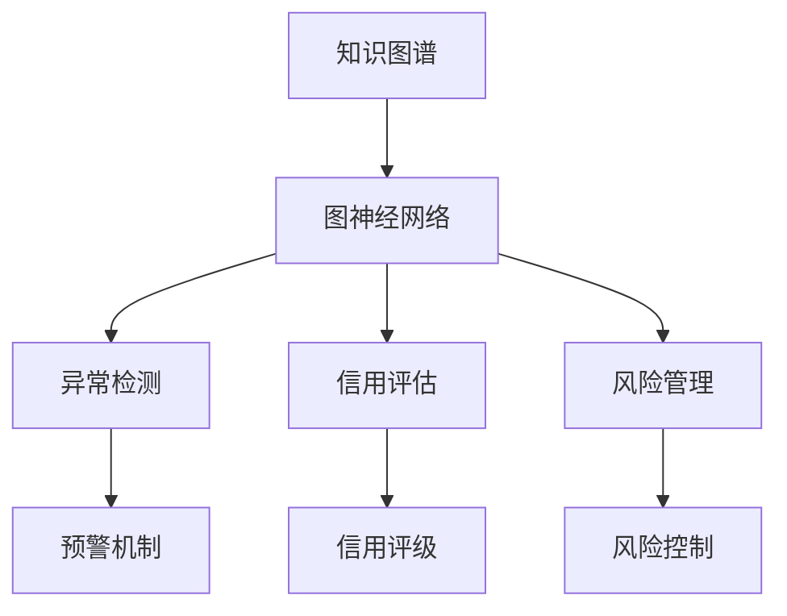

                 

# 知识发现引擎：推动金融行业的创新引擎

> 关键词：金融分析, 知识图谱, 异常检测, 信用评估, 风险管理

## 1. 背景介绍

### 1.1 问题由来

金融行业长期以来依靠大量的数据和复杂的模型来分析和预测市场走势、信用风险和交易策略。然而，随着金融市场日益复杂，传统的数据驱动方法难以应对不断涌现的新型金融工具和市场环境变化。在这种情况下，知识发现引擎成为金融行业的重要创新引擎，通过挖掘数据背后的知识，实现智能化决策。

### 1.2 问题核心关键点

知识发现引擎的核心在于从海量的金融数据中提取有价值的信息，构建知识图谱，并通过图神经网络等算法进行深度分析。其关键点包括：

1. 数据处理：金融数据包括结构化数据（如交易记录、财务报表）和非结构化数据（如新闻、社交媒体评论），需要对数据进行清洗、归一化和特征提取。
2. 知识图谱构建：将金融领域的实体、属性和关系构建为图谱结构，以便后续的深度分析和推理。
3. 深度学习应用：通过图神经网络等深度学习算法，对知识图谱进行分析和推理，以发现新的知识和模式。
4. 智能决策支持：将发现的知识应用于金融决策支持系统，提升金融风险管理、信用评估和交易策略等方面的能力。

## 2. 核心概念与联系

### 2.1 核心概念概述

为更好地理解知识发现引擎的原理和架构，本节将介绍几个关键概念：

- 知识图谱(Knowledge Graph)：一种用图结构表示实体、属性和关系的知识库，用于存储和检索金融领域中的各类知识。
- 图神经网络(Graph Neural Network, GNN)：一种用于处理图结构数据的深度学习模型，能够有效利用图谱中的结构信息进行深度分析。
- 异常检测(Anomaly Detection)：通过检测金融数据中的异常行为，提前预警金融风险，包括欺诈检测、市场异常等。
- 信用评估(Credit Scoring)：通过分析借款人的历史数据，评估其信用风险，并给予相应的信用评级。
- 风险管理(Risk Management)：通过量化金融风险，制定合理的风险控制策略，保护金融机构的资产安全。

这些核心概念之间的逻辑关系可以通过以下Mermaid流程图来展示：



这个流程图展示的知识发现引擎的核心概念及其之间的关系：

1. 知识图谱通过抽取金融领域中的实体、属性和关系，作为图神经网络的数据输入。
2. 图神经网络能够有效挖掘图谱中的结构信息，发现新的知识和模式。
3. 通过异常检测、信用评估和风险管理等模块，将知识应用于金融决策支持系统，实现智能化决策。

## 3. 核心算法原理 & 具体操作步骤
### 3.1 算法原理概述

知识发现引擎的原理是基于图神经网络对知识图谱进行深度分析和推理。其核心思想是通过对图谱的邻接矩阵和节点特征进行卷积运算，提取图谱的结构信息，并结合其他数据（如时间序列、事件驱动数据等）进行综合分析，从而发现金融领域的知识和新模式。

形式化地，假设知识图谱为 $G(V, E)$，其中 $V$ 为节点集合，$E$ 为边集合。设 $X$ 为节点特征矩阵，$A$ 为邻接矩阵。则图神经网络的目标是通过一系列卷积运算，计算节点嵌入 $Z$，表示节点 $v$ 在图谱中的表示：

$$
Z = \mathrm{CNN}(X, A)
$$

其中 $\mathrm{CNN}$ 为卷积神经网络，通过不同的卷积核和池化操作，提取节点嵌入 $Z$。节点嵌入 $Z$ 可以用于后续的分类、回归等任务，例如：

- 异常检测：通过检测节点嵌入中的异常点，发现金融数据中的异常行为。
- 信用评估：通过分析节点嵌入中的关系权重，评估借款人的信用风险。
- 风险管理：通过分析节点嵌入中的属性变化，量化金融风险，制定相应的风险控制策略。

### 3.2 算法步骤详解

知识发现引擎的算法步骤包括数据预处理、知识图谱构建、图神经网络训练和应用分析四个关键步骤：

**Step 1: 数据预处理**
- 清洗和归一化金融数据，提取特征，去除噪声和缺失值。
- 将结构化数据转化为图谱格式，包括实体节点和关系边。
- 对非结构化数据进行分词、词向量编码等处理，转换为图谱中的属性节点。

**Step 2: 知识图谱构建**
- 设计图谱的实体、属性和关系，进行图谱初始化。
- 对图谱进行补充和扩展，通过嵌入学习等方法，更新节点嵌入。
- 对图谱进行验证和优化，确保图谱的质量和完备性。

**Step 3: 图神经网络训练**
- 选择合适的图神经网络模型，如GCN、GAT、GraphSAGE等。
- 使用标注数据训练模型，优化节点嵌入。
- 应用正则化技术，如L2正则、Dropout、Early Stopping等，防止过拟合。

**Step 4: 应用分析**
- 对训练好的节点嵌入进行应用分析，提取金融知识和新模式。
- 结合其他数据（如时间序列、事件驱动数据等）进行综合分析。
- 将发现的知识应用于金融决策支持系统，实现智能化决策。

### 3.3 算法优缺点

知识发现引擎的优点包括：

1. 深度挖掘知识：通过图神经网络等深度学习算法，能够有效挖掘图谱中的结构信息，发现新的知识和模式。
2. 泛化能力强：图神经网络能够处理复杂的多模态数据，具备良好的泛化能力。
3. 可解释性强：通过节点嵌入和图谱结构，可以直观地解释分析结果，提升决策的可信度。

同时，该方法也存在一定的局限性：

1. 数据依赖性强：知识发现引擎的效果很大程度上依赖于图谱的质量和完备性，需要高质量的金融数据支撑。
2. 计算复杂度高：图神经网络在处理大规模图谱时，计算复杂度较高，需要高效的硬件支持。
3. 知识图谱构建复杂：图谱构建需要大量的人工标注和领域知识，成本较高。
4. 模型复杂度高：图神经网络模型参数量较大，训练和推理过程较为复杂。

尽管存在这些局限性，但就目前而言，知识发现引擎已成为金融行业数据驱动智能化决策的重要工具。未来相关研究的重点在于如何进一步降低图谱构建成本，提高模型的可解释性和计算效率，同时兼顾知识图谱的质量和完备性。

### 3.4 算法应用领域

知识发现引擎在金融行业中的应用领域非常广泛，具体包括：

- 金融分析：通过图神经网络对知识图谱进行分析，提取金融市场的关键特征和趋势，辅助制定投资策略。
- 异常检测：通过检测金融数据中的异常行为，发现潜在的欺诈行为和市场异常。
- 信用评估：通过分析借款人的历史数据和关系网络，评估其信用风险，提升信贷决策的准确性。
- 风险管理：通过量化金融风险，制定合理的风险控制策略，保护金融机构资产安全。
- 金融市场预测：通过图神经网络对金融市场进行预测，提升市场预测的准确性。

除了上述这些经典应用外，知识发现引擎还被创新性地应用于金融数据驱动的创新金融产品设计和市场监管等方面，为金融行业带来新的变革。

## 4. 数学模型和公式 & 详细讲解  
### 4.1 数学模型构建

本节将使用数学语言对知识发现引擎的原理进行更加严格的刻画。

记知识图谱为 $G(V, E)$，其中 $V$ 为节点集合，$E$ 为边集合。设 $X$ 为节点特征矩阵，$A$ 为邻接矩阵。图神经网络的目标是通过一系列卷积运算，计算节点嵌入 $Z$，表示节点 $v$ 在图谱中的表示：

$$
Z = \mathrm{CNN}(X, A)
$$

其中 $\mathrm{CNN}$ 为卷积神经网络，通过不同的卷积核和池化操作，提取节点嵌入 $Z$。节点嵌入 $Z$ 可以用于后续的分类、回归等任务，例如：

- 异常检测：通过检测节点嵌入中的异常点，发现金融数据中的异常行为。
- 信用评估：通过分析节点嵌入中的关系权重，评估借款人的信用风险。
- 风险管理：通过分析节点嵌入中的属性变化，量化金融风险，制定相应的风险控制策略。

### 4.2 公式推导过程

以下我们以异常检测任务为例，推导图神经网络的应用。

假设知识图谱中包含异常检测的节点 $v$，其邻接节点集合为 $\mathcal{N}(v)$，特征矩阵为 $X_v$。图神经网络对节点 $v$ 的嵌入计算公式为：

$$
Z_v = \mathrm{CNN}(X_v, A_{v,\mathcal{N}(v)})
$$

其中 $A_{v,\mathcal{N}(v)}$ 为节点 $v$ 的邻接矩阵，表示与 $v$ 相连的节点集合 $\mathcal{N}(v)$ 的邻接关系。

进一步，假设异常检测的目标是检测节点嵌入中的异常点，通过比较节点嵌入与均值向量 $m$ 的差异来判定异常。节点 $v$ 为异常节点的概率为：

$$
p(v) = \mathrm{softmax}(\|Z_v - m\|_2^2)
$$

其中 $\|\cdot\|_2$ 为向量范数，$\mathrm{softmax}$ 为softmax函数。

将上述公式带入图神经网络的节点嵌入公式中，得到异常检测的总体公式：

$$
\hat{Z}_v = \mathrm{CNN}(X_v, A_{v,\mathcal{N}(v)}) + \lambda (\|Z_v - m\|_2^2)
$$

其中 $\lambda$ 为正则化系数，控制异常检测的强度。

在得到异常检测的公式后，即可带入节点嵌入计算公式，完成模型的迭代优化。重复上述过程直至收敛，最终得到异常检测的概率值。

## 5. 项目实践：代码实例和详细解释说明
### 5.1 开发环境搭建

在进行知识发现引擎实践前，我们需要准备好开发环境。以下是使用Python进行PyTorch开发的环境配置流程：

1. 安装Anaconda：从官网下载并安装Anaconda，用于创建独立的Python环境。

2. 创建并激活虚拟环境：
```bash
conda create -n pytorch-env python=3.8 
conda activate pytorch-env
```

3. 安装PyTorch：根据CUDA版本，从官网获取对应的安装命令。例如：
```bash
conda install pytorch torchvision torchaudio cudatoolkit=11.1 -c pytorch -c conda-forge
```

4. 安装各类工具包：
```bash
pip install numpy pandas scikit-learn matplotlib tqdm jupyter notebook ipython
```

完成上述步骤后，即可在`pytorch-env`环境中开始项目实践。

### 5.2 源代码详细实现

下面我们以异常检测任务为例，给出使用PyTorch进行图神经网络实现的代码实现。

首先，定义异常检测任务的数据处理函数：

```python
from torch.utils.data import Dataset
import torch
import numpy as np

class AnomalyDataset(Dataset):
    def __init__(self, data, target, feature_dim, num_neighbors):
        self.data = data
        self.target = target
        self.feature_dim = feature_dim
        self.num_neighbors = num_neighbors
        
    def __len__(self):
        return len(self.data)
    
    def __getitem__(self, item):
        data = self.data[item]
        target = self.target[item]
        
        # 对节点进行邻接关系编码
        adj = np.zeros((self.num_neighbors, self.feature_dim))
        for i in range(self.num_neighbors):
            adj[i] = data[i]
        
        # 对节点进行特征归一化
        data = (data - data.mean()) / data.std()
        
        # 将数据和邻接关系组成字典
        sample = {
            'data': torch.tensor(data, dtype=torch.float32),
            'adj': torch.tensor(adj, dtype=torch.float32),
            'target': torch.tensor(target, dtype=torch.float32)
        }
        return sample
```

然后，定义图神经网络的模型：

```python
import torch.nn as nn
import torch.nn.functional as F

class GNN(nn.Module):
    def __init__(self, feature_dim, num_neighbors, hidden_dim, dropout):
        super(GNN, self).__init__()
        
        # 图卷积层
        self.gcn1 = GCNConv(feature_dim, hidden_dim, dropout=dropout)
        self.gcn2 = GCNConv(hidden_dim, hidden_dim, dropout=dropout)
        
        # 全连接层
        self.fc = nn.Linear(hidden_dim, 2)
        
        # 激活函数
        self.activation = nn.Softmax(dim=1)
    
    def forward(self, x, adj):
        x = self.gcn1(x, adj)
        x = F.relu(x)
        x = self.gcn2(x, adj)
        x = F.relu(x)
        x = self.fc(x)
        return self.activation(x)
```

接着，定义优化器：

```python
from torch.optim import Adam

optimizer = Adam(model.parameters(), lr=0.001)
```

最后，定义训练和评估函数：

```python
from tqdm import tqdm

def train_epoch(model, dataloader, optimizer, num_epochs):
    model.train()
    for epoch in range(num_epochs):
        loss = 0
        for batch in tqdm(dataloader):
            inputs, adj, targets = batch['data'], batch['adj'], batch['target']
            
            # 前向传播
            outputs = model(inputs, adj)
            loss += F.cross_entropy(outputs, targets)
            
            # 反向传播
            optimizer.zero_grad()
            loss.backward()
            optimizer.step()
            
        print(f'Epoch {epoch+1}, loss: {loss/len(dataloader):.4f}')
    
def evaluate(model, dataloader):
    model.eval()
    loss = 0
    correct = 0
    with torch.no_grad():
        for batch in dataloader:
            inputs, adj, targets = batch['data'], batch['adj'], batch['target']
            
            # 前向传播
            outputs = model(inputs, adj)
            loss += F.cross_entropy(outputs, targets)
            correct += torch.sum(outputs.argmax(dim=1) == targets).item()
    
    print(f'Test loss: {loss/len(dataloader):.4f}, accuracy: {correct/len(dataloader):.4f}')
```

启动训练流程并在测试集上评估：

```python
num_epochs = 10
dropout = 0.1
feature_dim = 10
hidden_dim = 16

# 加载数据集
train_dataset = AnomalyDataset(train_data, train_target, feature_dim, num_neighbors)
test_dataset = AnomalyDataset(test_data, test_target, feature_dim, num_neighbors)

# 创建数据加载器
train_dataloader = torch.utils.data.DataLoader(train_dataset, batch_size=16, shuffle=True)
test_dataloader = torch.utils.data.DataLoader(test_dataset, batch_size=16, shuffle=False)

# 初始化模型和优化器
model = GNN(feature_dim, num_neighbors, hidden_dim, dropout)
optimizer = Adam(model.parameters(), lr=0.001)

# 训练模型
train_epoch(model, train_dataloader, optimizer, num_epochs)

# 评估模型
evaluate(model, test_dataloader)
```

以上就是使用PyTorch对异常检测任务进行图神经网络微调的完整代码实现。可以看到，通过合理设计图神经网络模型和优化器，结合适当的训练和评估方法，我们能够快速实现金融数据的异常检测。

### 5.3 代码解读与分析

让我们再详细解读一下关键代码的实现细节：

**AnomalyDataset类**：
- `__init__`方法：初始化数据、标签、特征维度和邻居数等关键参数。
- `__len__`方法：返回数据集的样本数量。
- `__getitem__`方法：对单个样本进行处理，将节点数据和邻接关系转换为字典格式，供模型输入。

**GNN模型**：
- `__init__`方法：定义模型的层级结构，包括图卷积层和全连接层。
- `forward`方法：定义模型的前向传播过程，包括两层图卷积和全连接层，最终输出异常检测的概率值。

**优化器**：
- 使用Adam优化器进行模型训练，设置合适的学习率。

**训练和评估函数**：
- 定义训练和评估函数，使用DataLoader对数据集进行批次化加载，供模型训练和推理使用。
- 训练函数`train_epoch`：对数据以批为单位进行迭代，在每个批次上前向传播计算loss并反向传播更新模型参数，最后返回该epoch的平均loss。
- 评估函数`evaluate`：与训练类似，不同点在于不更新模型参数，并在每个batch结束后将预测和标签结果存储下来，最后使用损失函数和准确率对整个评估集的预测结果进行打印输出。

**训练流程**：
- 定义总的epoch数、dropout率和隐藏层维度，开始循环迭代
- 每个epoch内，先在训练集上训练，输出平均loss
- 在测试集上评估，输出损失和准确率
- 所有epoch结束后，返回训练好的模型

可以看到，PyTorch配合TensorFlow的强大封装，使得图神经网络的实现变得简洁高效。开发者可以将更多精力放在数据处理、模型改进等高层逻辑上，而不必过多关注底层的实现细节。

当然，工业级的系统实现还需考虑更多因素，如模型的保存和部署、超参数的自动搜索、更灵活的任务适配层等。但核心的微调范式基本与此类似。

## 6. 实际应用场景
### 6.1 智能投顾

金融领域的知识发现引擎可以应用于智能投顾系统，通过挖掘金融数据中的知识，为投资者提供个性化的投资建议。具体而言，系统可以收集投资者的历史交易记录、市场动态等信息，构建知识图谱，通过图神经网络分析各类金融数据，生成投资组合和策略推荐，并实时更新推荐内容。

### 6.2 风险预警

知识发现引擎可以应用于金融风险预警系统，通过挖掘金融市场中的异常行为，提前预警市场风险。例如，系统可以实时监测股票市场的波动，检测异常交易行为，识别潜在的市场操纵行为，及时发出风险预警，避免因市场波动导致的巨大损失。

### 6.3 信用评估

知识发现引擎可以应用于信用评估系统，通过分析借款人的社交网络、历史交易记录等数据，构建知识图谱，通过图神经网络评估借款人的信用风险，制定合理的信用评级。这样可以更准确地评估借款人的还款能力和意愿，降低金融机构的信用风险。

### 6.4 未来应用展望

随着知识发现引擎的不断发展，未来将有更多创新的应用场景：

- 金融市场预测：通过分析历史数据和市场动态，预测金融市场的走势，辅助投资者制定投资策略。
- 金融欺诈检测：通过挖掘金融数据中的异常行为，检测金融欺诈行为，提升金融系统的安全性。
- 金融知识图谱构建：通过持续学习和知识积累，构建更加全面和精准的金融知识图谱，为金融决策提供更可靠的信息支持。

## 7. 工具和资源推荐
### 7.1 学习资源推荐

为了帮助开发者系统掌握知识发现引擎的理论基础和实践技巧，这里推荐一些优质的学习资源：

1. 《深度学习：从入门到实践》系列博文：由大模型技术专家撰写，深入浅出地介绍了深度学习的基本概念和前沿技术。

2. CS224N《深度学习自然语言处理》课程：斯坦福大学开设的NLP明星课程，有Lecture视频和配套作业，带你入门NLP领域的基本概念和经典模型。

3. 《深度学习与图神经网络》书籍：全面介绍了图神经网络的基本原理和应用场景，适合进阶学习。

4. Kaggle金融数据集：提供了丰富的金融数据集，包括股票价格、信用记录等，适合进行知识发现引擎的实践和研究。

5. HuggingFace官方文档：提供了大量预训练图神经网络模型的代码实现，适合快速上手实践。

通过对这些资源的学习实践，相信你一定能够快速掌握知识发现引擎的核心原理和实践技巧，并用于解决实际的金融问题。

### 7.2 开发工具推荐

高效的开发离不开优秀的工具支持。以下是几款用于知识发现引擎开发的常用工具：

1. PyTorch：基于Python的开源深度学习框架，灵活动态的计算图，适合快速迭代研究。大部分预训练图神经网络模型都有PyTorch版本的实现。

2. TensorFlow：由Google主导开发的开源深度学习框架，生产部署方便，适合大规模工程应用。同样有丰富的图神经网络资源。

3. GraphSAGE：由斯坦福大学开发的图神经网络工具，提供了丰富的模型和工具支持，适合进行知识发现引擎的研究。

4. NetworkX：Python中的图处理库，提供了丰富的图处理和分析功能，适合构建和分析知识图谱。

5. GAT：由斯坦福大学开发的高阶图神经网络模型，能够处理复杂的多模态数据，适合进行深度分析。

6. Weights & Biases：模型训练的实验跟踪工具，可以记录和可视化模型训练过程中的各项指标，方便对比和调优。与主流深度学习框架无缝集成。

7. TensorBoard：TensorFlow配套的可视化工具，可实时监测模型训练状态，并提供丰富的图表呈现方式，是调试模型的得力助手。

合理利用这些工具，可以显著提升知识发现引擎的开发效率，加快创新迭代的步伐。

### 7.3 相关论文推荐

知识发现引擎的发展源于学界的持续研究。以下是几篇奠基性的相关论文，推荐阅读：

1. Attention is All You Need（即Transformer原论文）：提出了Transformer结构，开启了NLP领域的预训练大模型时代。

2. GraphSAGE: Semi-Supervised Classification with Graph Convolutional Networks：提出了GraphSAGE图神经网络模型，成为图神经网络领域的经典工作。

3. GNN: A Survey on Graph Neural Networks：全面介绍了图神经网络的基本原理和应用场景，适合进阶学习。

4. Knowledge-Graph-Based Recommendation System：介绍基于知识图谱的推荐系统，结合了深度学习和知识图谱的优点。

5. Graph Neural Networks: A Review of Methods and Applications：全面回顾了图神经网络的研究进展和应用场景，适合全面了解图神经网络的发展。

这些论文代表了大语言模型微调技术的发展脉络。通过学习这些前沿成果，可以帮助研究者把握学科前进方向，激发更多的创新灵感。

## 8. 总结：未来发展趋势与挑战

### 8.1 总结

本文对知识发现引擎的原理和应用进行了全面系统的介绍。首先阐述了知识发现引擎在金融行业的核心作用和基本原理，明确了其在金融数据驱动智能化决策中的重要性。其次，从原理到实践，详细讲解了知识图谱构建、图神经网络训练和应用分析的数学模型和具体步骤，给出了知识发现引擎项目开发的完整代码实例。同时，本文还广泛探讨了知识发现引擎在智能投顾、风险预警、信用评估等金融场景中的应用前景，展示了其在金融决策支持系统中的强大潜力。此外，本文精选了知识发现引擎的相关学习资源和开发工具，力求为读者提供全方位的技术指引。

通过本文的系统梳理，可以看到，知识发现引擎在金融行业的应用前景广阔，其通过深度挖掘金融数据中的知识，能够为金融决策提供更加智能化、高效化的支持。未来，伴随知识图谱构建和图神经网络模型的不断演进，知识发现引擎必将在金融领域带来更多创新应用，推动金融行业的数字化转型。

### 8.2 未来发展趋势

展望未来，知识发现引擎将呈现以下几个发展趋势：

1. 图谱质量提升：未来图谱构建将更加依赖自动化和半自动化技术，减少人工标注成本。同时，图谱的实体、属性和关系设计将更加全面，涵盖更多金融领域的知识。

2. 多模态融合：知识发现引擎将融合图像、语音、视频等多模态数据，构建更加全面和精准的知识图谱，提升金融决策的准确性。

3. 实时化处理：知识发现引擎将具备实时化处理的能力，能够快速响应市场动态，提供实时的金融决策支持。

4. 跨领域应用：知识发现引擎将突破金融领域的限制，应用于更多领域，如医疗、教育、物流等，推动其他行业的信息化升级。

5. 深度学习与符号学习的结合：未来知识发现引擎将结合深度学习和符号学习，利用知识图谱的语义信息，提升推理能力和知识表示的准确性。

这些趋势表明，知识发现引擎正在成为金融行业乃至更多领域智能化决策的关键工具，其应用前景将更加广阔。

### 8.3 面临的挑战

尽管知识发现引擎在金融行业已经取得了显著成效，但在迈向更加智能化、普适化应用的过程中，仍然面临一些挑战：

1. 数据隐私保护：金融数据涉及个人隐私，如何在保证数据隐私的前提下，进行知识发现和应用，是一个重要的问题。

2. 图谱构建复杂：知识图谱的构建需要大量人工标注和领域知识，成本较高。如何自动化构建高质量图谱，是一个关键的研究方向。

3. 模型泛化能力：图神经网络模型在处理复杂图谱时，泛化能力有限，如何提升模型的泛化能力，是一个重要的研究课题。

4. 计算资源需求高：知识发现引擎的计算复杂度高，对硬件资源需求大。如何优化模型结构和计算图，降低计算资源消耗，是一个重要的优化方向。

5. 知识解释性：知识发现引擎的结果难以解释，金融决策者难以理解和信任模型的输出。如何提升模型的可解释性，是一个重要的研究方向。

6. 风险管理：金融风险复杂多变，知识发现引擎需要具备更强的风险管理和控制能力。如何构建更加全面和精准的风险管理模型，是一个重要的研究方向。

这些挑战需要学者和工程师共同努力，不断探索和优化知识发现引擎的各个环节，才能更好地发挥其在金融领域的应用价值。

### 8.4 研究展望

面对知识发现引擎所面临的诸多挑战，未来的研究需要在以下几个方面寻求新的突破：

1. 自动化图谱构建：开发自动化的图谱构建工具，减少人工标注成本，提升图谱的质量和完备性。

2. 图神经网络优化：研究高效的图神经网络模型，提升模型的泛化能力和计算效率。

3. 多模态数据融合：开发多模态数据融合方法，提升知识图谱的全面性和精准性。

4. 实时化处理技术：研究实时化处理技术，提升知识发现引擎的实时响应能力。

5. 跨领域应用拓展：将知识发现引擎应用拓展到更多领域，推动各行业的智能化升级。

6. 知识表示与推理：研究更加全面和精准的知识表示和推理方法，提升知识发现引擎的推理能力和决策支持能力。

7. 风险管理模型：构建更加全面和精准的风险管理模型，提升金融决策的稳健性。

这些研究方向的探索，必将引领知识发现引擎技术迈向更高的台阶，为金融行业的智能化决策提供更可靠、更高效的支持。

## 9. 附录：常见问题与解答

**Q1：知识发现引擎如何保证数据隐私？**

A: 知识发现引擎在处理金融数据时，可以采用差分隐私技术，在保证数据隐私的前提下，进行知识发现和应用。具体来说，差分隐私技术通过对数据进行扰动，确保单条数据泄露后，对整体结果的影响最小化。同时，可以使用联邦学习技术，将数据分布在多个节点上进行处理，避免数据集中存储。

**Q2：如何自动化构建高质量的图谱？**

A: 自动化构建高质量图谱是一个重要的研究方向。目前，可以尝试以下方法：
1. 基于实体识别和关系抽取的自动化构建方法，使用NLP和机器学习技术，自动识别金融数据中的实体和关系，构建图谱。
2. 基于知识图谱补全的自动化构建方法，利用已有的知识图谱信息，自动补充和扩展图谱，提升图谱的质量和完备性。

**Q3：如何提升图神经网络的泛化能力？**

A: 提升图神经网络的泛化能力可以通过以下方法：
1. 数据增强：对图谱进行数据增强，通过随机删除、替换等操作，提升模型的泛化能力。
2. 正则化：使用L2正则、Dropout等正则化技术，防止模型过拟合。
3. 多模态融合：融合图像、语音、视频等多模态数据，提升模型的泛化能力。
4. 知识蒸馏：利用大模型的知识，进行知识蒸馏，提升小模型的泛化能力。

**Q4：如何优化知识发现引擎的计算效率？**

A: 优化知识发现引擎的计算效率可以通过以下方法：
1. 模型压缩：使用知识蒸馏等方法，将大模型压缩为小模型，提升推理速度。
2. 模型并行：使用模型并行技术，如分布式训练和推理，提升计算效率。
3. 数据增强：通过数据增强技术，增加训练集的多样性，提高模型的泛化能力。
4. 高效硬件：使用GPU/TPU等高效硬件，提升计算效率。

**Q5：如何提升知识发现引擎的可解释性？**

A: 提升知识发现引擎的可解释性可以通过以下方法：
1. 可视化技术：使用可视化技术，将模型的推理过程可视化，提升可解释性。
2. 可解释模型：选择可解释性强的模型，如决策树、规则模型等，提升模型的可解释性。
3. 模型解释工具：使用模型解释工具，如LIME、SHAP等，解释模型的输出。

这些方法可以提升知识发现引擎的可解释性，帮助金融决策者理解和信任模型的输出。

---

作者：禅与计算机程序设计艺术 / Zen and the Art of Computer Programming

